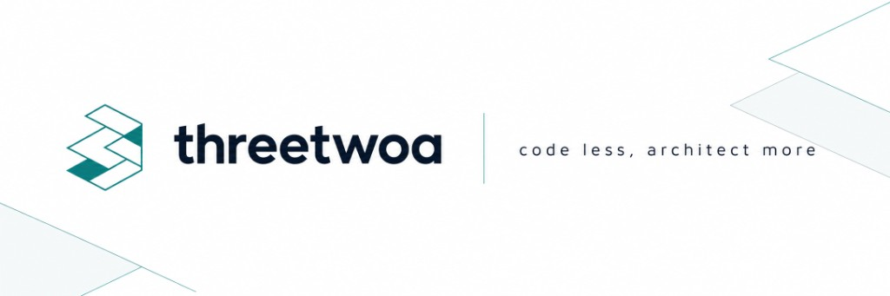

<h1 align="center">threetwoa's blog</h1>

<p align="center">
  <strong><em>code less, architect more</em></strong> 🚀
</p>

<p align="center">
  
  
  
  <br>
  
  
  
  
</p>

<p align="center">
  基于 <a href="https://github.com/CuteLeaf/Firefly">Firefly</a>（Astro 静态博客主题）的个人站二次开发<br>
  <sub>Standalone by <a href="https://github.com/Aafff623/fork-Firefly">threetwoa</a> · 已脱离上游 fork 网络 · 不是官方镜像</sub>
</p>

<p align="center">
  
</p>

<p align="center">
  <a href="#features">Features</a>
  · <a href="#showcase">Showcase</a>
  · <a href="#quick-start">Quick Start</a>
  · <a href="#configuration">Configuration</a>
  · <a href="#architecture">Architecture</a>
</p>

---

> [!TIP]
> 本仓源自 [CuteLeaf/Firefly](https://github.com/CuteLeaf/Firefly)，已 **Leave fork network** 成为独立仓库：本地开发 / 独立演进，不跟随上游进度；保留主题能力，叠加上 threetwoa 的品牌、治理与部署约定。

---

## Features

配置优先于硬编码：日常换皮、开关页面、调整壁纸与侧栏，尽量只动 `src/config`。

### Core

- **Astro SSG** — 静态 `dist`，CDN 友好；默认非 SSR
- **Svelte islands** — 搜索、显示设置、分页等按需注水
- **Swup transitions** — 站内切换更顺滑
- **Pagefind** — 构建期全文索引
- **i18n UI** — 主题内置多语言界面（内容语言由站点配置决定）

### Personalization

- **Config-driven** — 站点 / 导航 / 侧栏 / 壁纸 / 字体 / 评论集中在 `src/config/*.ts`
- **Layout system** — 单/双侧栏 · 列表/网格 · 横幅 + 透明壁纸
- **Reading UI** — Index-First TOC（中心焦点渐变）· list Featured+行 · About Quote-Led · 分类/标签单色点缀
- **Theme controls** — 色相、亮暗切换、显示设置面板
- **Markdown extensions** — 提醒框、Mermaid、PlantUML、Wiki Link 等（`src/plugins`）
- **Extended pages** — 动态、相册、友链、留言等，可用 `siteConfig.pages.*` 关闭
- **Sidebar extras** — 日历贡献热力图 + 空闲贪吃蛇 · 可选桌宠（SpritePet）

---

## Showcase

推荐浏览路径：首页（list）→ 文章（TOC）→ 动态 → 归档 / 关于 / 图库。

线上站点：https://fork-firefly.vercel.app

> 画册图由 Playwright 真机截取（`scripts/capture-readme-showcase.py`）。UI 大改后：先 `pnpm dev`，再跑该脚本覆盖 `assets/images/readme/showcase-*.png`。

### Blog surfaces

<table>
  <tr>
    <td width="33%" valign="top" align="center">
      <a href="assets/images/readme/showcase-home.png"></a>
      <br><strong>Home</strong><br>
      <sub>list Featured+行 · 双侧栏 · 壁纸横幅</sub><br>
      <a href="https://fork-firefly.vercel.app/">Open</a>
    </td>
    <td width="33%" valign="top" align="center">
      <a href="assets/images/readme/showcase-post.png"></a>
      <br><strong>Post</strong><br>
      <sub>Index-First TOC · 暖黄标题焦点 · Markdown 扩展</sub><br>
      <a href="https://fork-firefly.vercel.app/posts/guide/firefly-layout-system/">Open</a>
    </td>
    <td width="33%" valign="top" align="center">
      <a href="assets/images/readme/showcase-dynamic.png"></a>
      <br><strong>Dynamic</strong><br>
      <sub>碎碎念时间线（可接 Memos）</sub><br>
      <a href="https://fork-firefly.vercel.app/dynamic/">Open</a>
    </td>
  </tr>
  <tr>
    <td width="33%" valign="top" align="center">
      <a href="assets/images/readme/showcase-archive.png"></a>
      <br><strong>Archive</strong><br>
      <sub>按年折叠 · 克制行列表</sub><br>
      <a href="https://fork-firefly.vercel.app/archive/">Open</a>
    </td>
    <td width="33%" valign="top" align="center">
      <a href="assets/images/readme/showcase-about.png"></a>
      <br><strong>About</strong><br>
      <sub>Quote-Led · Now / Practice / Reach</sub><br>
      <a href="https://fork-firefly.vercel.app/about/">Open</a>
    </td>
    <td width="33%" valign="top" align="center">
      <a href="assets/images/readme/showcase-gallery.png"></a>
      <br><strong>Gallery</strong><br>
      <sub>相册网格 · 视觉内容</sub><br>
      <a href="https://fork-firefly.vercel.app/gallery/">Open</a>
    </td>
  </tr>
</table>

---

## Quick Start

### Requirements

- Node.js ≥ 22
- pnpm ≥ 9（锁文件 `9.14.4`）

### Local development

1. **Clone the repository**

```bash
git clone https://github.com/Aafff623/fork-Firefly.git
cd fork-Firefly
```

主题灵感来自上游：[CuteLeaf/Firefly](https://github.com/CuteLeaf/Firefly)（本仓不再是其 fork）。

2. **Install dependencies**

```bash
# 如果没有安装 pnpm，先安装
npm install -g pnpm

# 安装项目依赖（若镜像 404：pnpm install --registry https://registry.npmjs.org）
pnpm install
```

3. **Configure the blog**

- 编辑 `src/config/` 下的配置文件自定义站点（见 [Configuration](#configuration)）
- 文章与动态写在 `src/content/posts/` · `src/content/dynamic/`

4. **Start the dev server**

```bash
pnpm dev
```

博客将在 `http://localhost:4321` 可用。

### Useful commands

| Command | Action |
|---------|--------|
| `pnpm install` | 安装依赖 |
| `pnpm dev` | 本地开发（`localhost:4321`） |
| `pnpm build` | LQIP → Astro → font subset → Pagefind → `dist/` |
| `pnpm preview` | 预览构建产物 |
| `pnpm check` | Astro / 类型诊断 |
| `pnpm format` | Biome 格式化 |
| `pnpm new-post <slug>` | 新建文章 |
| `pnpm new-d <一句话>` | 新建动态 |
| `python scripts/capture-readme-showcase.py` | 重截 README Showcase（需 `pnpm dev`） |

### Deploy

本仓默认推送到 Vercel 项目 **fork-firefly**：

| Setting | Value |
|---------|-------|
| Framework | Astro |
| Root | `./` |
| Output | `dist` |
| Build | `pnpm run build` |
| Install | `pnpm install` |

push `master` → 等待 Ready → 打开 https://fork-firefly.vercel.app 复核。

---

## Configuration

### Site language

编辑 `src/config/siteConfig.ts`：

```ts
// 定义站点语言
const SITE_LANG = "zh_CN";
```

支持：`zh_CN` · `zh_TW` · `en` · `ja` · `ru` · `ko`

### Where to edit first

| 你想改什么 | 文件 |
|------------|------|
| 站点名、色相、页面开关、列表布局 | `siteConfig.ts` |
| 头像与简介 | `profileConfig.ts` |
| 导航 | `navBarConfig.ts` |
| 侧栏 | `sidebarConfig.ts` |
| 壁纸与透明参数 | `backgroundWallpaper.ts` |
| 设置面板可见项 | `displaySettingsConfig.ts` |
| 樱花等特效 | `effectsConfig.ts` |

### Config file structure

```text
src/
└── config/
    ├── index.ts                  # 配置索引（barrel）
    ├── siteConfig.ts             # 站点基础配置
    ├── analyticsConfig.ts        # 统计分析配置
    ├── announcementConfig.ts     # 公告配置
    ├── backgroundWallpaper.ts    # 背景壁纸配置
    ├── commentConfig.ts          # 评论系统配置
    ├── coverImageConfig.ts       # 封面图配置
    ├── displaySettingsConfig.ts  # 设置面板配置
    ├── dynamicConfig.ts          # 动态页面配置
    ├── effectsConfig.ts          # 动画特效配置（樱花等）
    ├── expressiveCodeConfig.ts   # 代码高亮配置
    ├── fontConfig.ts             # 字体配置
    ├── footerConfig.ts           # 页脚配置
    ├── friendsConfig.ts          # 友链配置
    ├── galleryConfig.ts          # 相册配置
    ├── licenseConfig.ts          # 许可证配置
    ├── musicConfig.ts            # 音乐播放器配置
    ├── navBarConfig.ts           # 导航栏配置
    ├── pioConfig.ts              # 看板娘配置
    ├── mermaidConfig.ts          # Mermaid 图表配置
    ├── plantumlConfig.ts         # PlantUML 图表配置
    ├── profileConfig.ts          # 用户资料配置
    ├── sidebarConfig.ts          # 侧边栏布局配置
    └── sponsorConfig.ts          # 打赏配置
```

---

## Architecture

本仓把「能改的」和「尽量别动的」分开：日常运营走配置与内容；构建链路固定；运行时保持薄客户端。

### Layered view

| Layer | Responsibility | Primary surfaces |
|-------|----------------|------------------|
| **Authoring** | 配置、文案、Markdown 内容 | `src/config` · `src/content` |
| **Composition** | 页面装配、布局网格、组件与插件 | `src/pages` · `src/layouts` · `src/components` · `src/plugins` |
| **Build** | 静态生成与资源流水线 | Astro 7 SSG · remark/rehype · LQIP · font subset · Pagefind |
| **Runtime** | CDN 交付 + 轻量交互 | `dist` · Vercel · Browser（Swup / Svelte islands） |

```text
┌─────────────┐   ┌──────────────────┐   ┌─────────────┐   ┌──────────┐
│  Authoring  │ → │  Astro compose   │ → │ static dist │ → │  Vercel  │
│ config/mdx  │   │  + plugins/CSS   │   │  + Pagefind │   │   CDN    │
└─────────────┘   └──────────────────┘   └─────────────┘   └────┬─────┘
                                                                ↓
                                                         Browser islands
                                                         (Svelte / Swup)
```

### Design principles

1. **Config over layout** — 品牌、开关、壁纸参数落在 `src/config`；布局上帝文件非必要不改。
2. **Static by default** — 输出静态站点；SSR / Workers 仅显式启用。
3. **Islands, not SPA** — Svelte 按需注水；Swup 做内容容器替换。
4. **Content collections** — `posts` / `dynamic` / `spec` 经 Content Layer 校验。
5. **Build-time enrichment** — LQIP、字体子集、Pagefind 在 `pnpm build` 完成。

---

## Acknowledgments

- Theme: [CuteLeaf/Firefly](https://github.com/CuteLeaf/Firefly) · derived from [fuwari](https://github.com/saicaca/fuwari)
- Working style: [andrej-karpathy-skills](https://github.com/multica-ai/andrej-karpathy-skills)
- License: MIT（见 `LICENSE`）。二次开发请保留上游版权声明。
