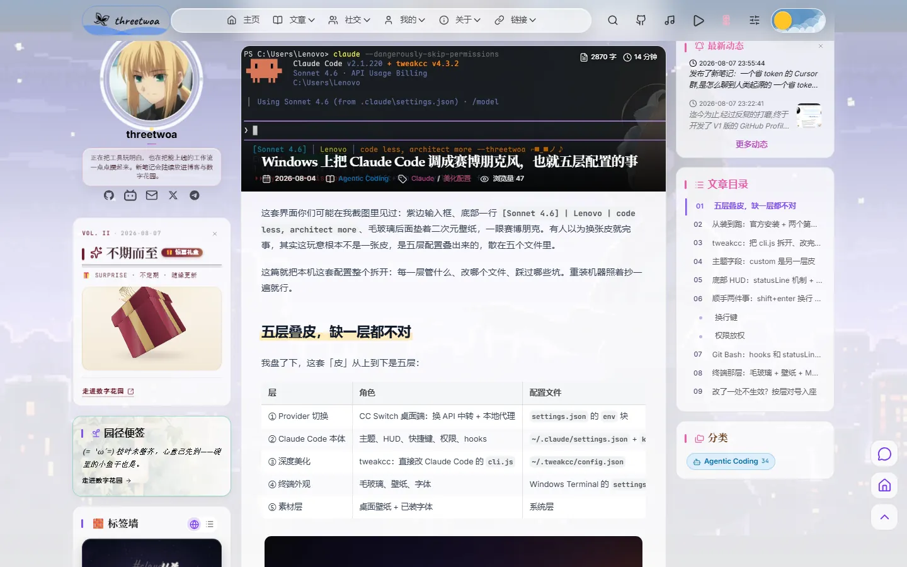
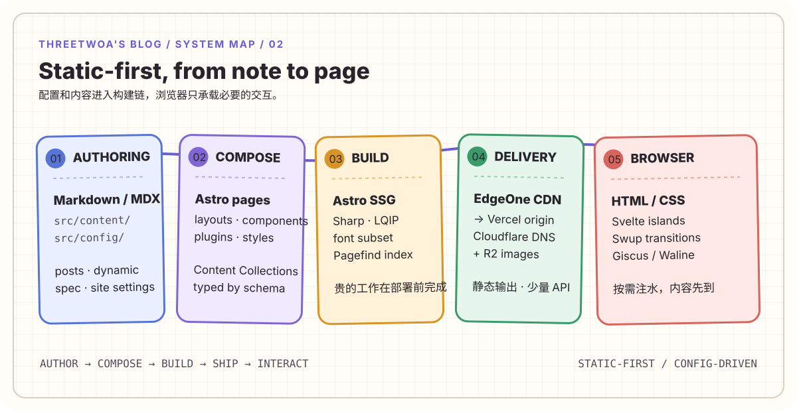
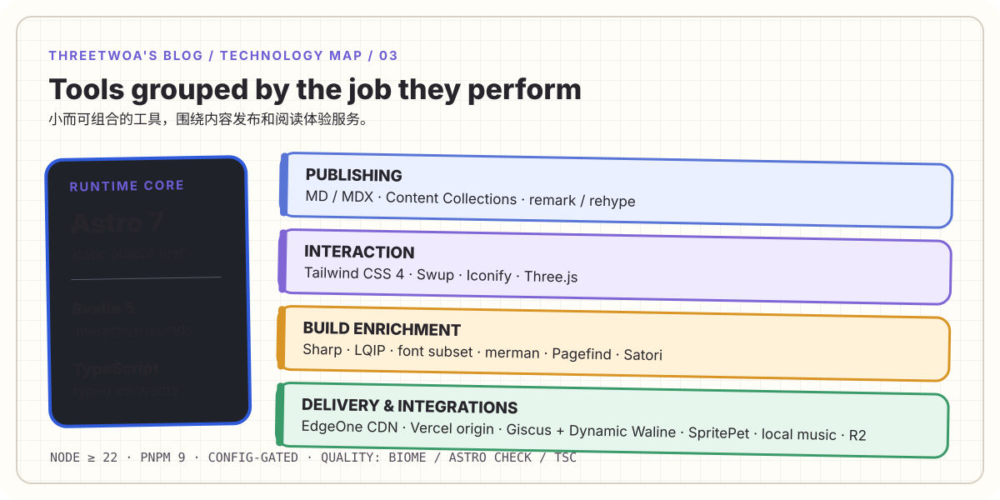

<h1 align="center">threetwoa's blog</h1>

<p align="center">
  <strong><em>Astro 静态博客 · 配置驱动 · Agent 发文流水线</em></strong>
  <br>
  <sub>少写一点一次性代码，多留一点可复用结构 · standalone Firefly 二次开发</sub>
</p>

<!-- Badges: 单行六枚，其余事实进正文表格 -->
<p align="center">
  <a href="https://www.threetwoa.live"></a>
  <a href="https://github.com/Aafff623/fork-Firefly/blob/master/LICENSE"></a>
  <a href="https://github.com/Aafff623/fork-Firefly/commits/master"></a>
  
  
  
  
</p>

<p align="center">
  基于 <a href="https://github.com/CuteLeaf/Firefly">CuteLeaf/Firefly</a> 的 Astro 个人博客二次开发<br>
  <sub>作者 <a href="https://github.com/Aafff623">Aafff623</a> / threetwoa · 已脱离 fork network · 非官方镜像</sub>
</p>

<p align="center">
  
</p>

<p align="center">
  <a href="#showcase">Showcase</a>
  · <a href="#features">Features</a>
  · <a href="#quick-start">Quick start</a>
  · <a href="#architecture">Architecture</a>
  · <a href="#deploy">Deploy</a>
  · <a href="#agent-collaboration">Agent</a>
  · <a href="https://www.threetwoa.live">Live</a>
  · <a href="https://github.com/Aafff623/fork-Firefly">Source</a>
</p>

---

> [!TIP]
> 本仓源自 [CuteLeaf/Firefly](https://github.com/CuteLeaf/Firefly)，已脱离 fork network。保留上游主题的内容与页面能力，并叠加本仓品牌配置、组件、交互与多平台交付约定。主入口：<https://www.threetwoa.live>（Cloudflare Workers）。

## Showcase

真实界面优先：以下截图全部来自本地 `pnpm dev` 真机（Playwright 脚本 [scripts/capture-readme-showcase.py](scripts/capture-readme-showcase.py) 重截，强制 light 主题、隐藏桌宠与 toast）。推荐逛站路径：首页 → 文章 → Dynamic → Timeline → About → Gallery。

<table>
  <tr>
    <td width="33%" valign="top" align="center">
      <a href="assets/images/readme/showcase-home.webp"></a>
      <br><strong>Home</strong><br>
      <sub>文章卡片 · 双侧栏 · 壁纸横幅 · 分类条</sub><br>
      <a href="https://www.threetwoa.live/">Open</a>
    </td>
    <td width="33%" valign="top" align="center">
      <a href="assets/images/readme/showcase-post.webp"></a>
      <br><strong>Post</strong><br>
      <sub>Index-First TOC · 封面 · Markdown 扩展 · 公告礼盒</sub><br>
      <a href="https://www.threetwoa.live/">Open</a>
    </td>
    <td width="33%" valign="top" align="center">
      <a href="assets/images/readme/showcase-dynamic.webp"></a>
      <br><strong>Dynamic</strong><br>
      <sub>朋友圈式短动态 · 本地 content 时间线 · 一键发布</sub><br>
      <a href="https://www.threetwoa.live/dynamic/">Open</a>
    </td>
  </tr>
  <tr>
    <td width="33%" valign="top" align="center">
      <a href="assets/images/readme/showcase-timeline.webp"></a>
      <br><strong>Timeline</strong><br>
      <sub>按年折叠 · 行列表 · 内容索引</sub><br>
      <a href="https://www.threetwoa.live/timeline/">Open</a>
    </td>
    <td width="33%" valign="top" align="center">
      <a href="assets/images/readme/showcase-about.webp"></a>
      <br><strong>About</strong><br>
      <sub>GitHub profile 克隆 · 置顶仓库 · profile README</sub><br>
      <a href="https://www.threetwoa.live/about/">Open</a>
    </td>
    <td width="33%" valign="top" align="center">
      <a href="assets/images/readme/showcase-gallery.webp"></a>
      <br><strong>Gallery</strong><br>
      <sub>作品集手风琴 · 无限画布双模式</sub><br>
      <a href="https://www.threetwoa.live/gallery/">Open</a>
    </td>
  </tr>
</table>

## Project

配置驱动的 Astro 个人博客：正文在 Markdown / MDX，行为在 `src/config`，页面由 Astro + Svelte islands + 少量客户端脚本组成。

硬边界：**静态优先**、**改站先改配置**、发文唯一入口 `post-publish`（识别输入 → 沉淀 vault → 成帖 → 校验 → 级联收尾的一条链）；短动态走 `dynamic-publish`；早报 / 热榜为内置合集 skill。本仓没有独立 Preview 产品壳，上方 Showcase 即主链路真机面。

| 维度 | 事实 |
| --- | --- |
| Product | standalone Firefly 二次开发个人博客 |
| Render | Static-first · SSG · CDN |
| Content | `posts` / `dynamic` / `spec` Content Collections |
| Interaction | Svelte islands · Swup · progressive enhancement |
| Integrations | Giscus · Waline（Dynamic）· GitHub Discussions · Iconify · SpritePet · local music |
| Delivery | `www.threetwoa.live`（Cloudflare Workers）；Cloudflare DNS + R2 图床 |

### Modules

| 模块 | 职责 | 入口 |
| --- | --- | --- |
| Config | 站点身份、导航、侧栏、壁纸、主题、评论、音乐、桌宠等开关 | `src/config/` |
| Content | 文章 / 动态 / About·Friends 等特殊页；frontmatter schema | `src/content/` · `src/content.config.ts` |
| Pages & layout | 路由页、网格壳、列表与文章页 | `src/pages/` · `src/layouts/` |
| Components | 侧栏 widget、阅读控件、相册、动态时间线等 | `src/components/` |
| Ask | 自研 AskChat 问答岛（已去 HeroUI）、站内检索、SSE、桌宠 LiveChat；PROD 占位、DEV 完整 | `src/components/ask/` · `src/pages/api/ask.ts` |
| Plugins | KaTeX、Mermaid(merman)、PlantUML、Wiki Link、directive | `src/plugins/` |
| Agent skills | 发文 `post-publish` 一条链、短动态 `dynamic-publish`、早报/热榜合集 skill、GSAP | `.agents/skills/`（`.cursor/skills` 为桥接） |
| Scripts | LQIP、字体子集、new-post / new-d、Showcase 截图 | `scripts/` |
| Docs | CONTEXT / ADR / workflow / inventory（非运行时） | `docs/` · 根目录治理文件 |

## Features

能力按「发布 → 阅读 → 个人页 → 集成」分层；表内是本仓现行能力（不是上游全部开关列表）。

| 层 | 你能做什么 | 主要入口 |
| --- | --- | --- |
| Publishing | MD/MDX 成帖；草稿 / 置顶 / 密码文；RSS · Sitemap · OG · Pagefind | `src/content/` · `astro.config.mjs` |
| Reading | list / grid / waterfall；Index-First TOC；亮暗色 / 色相 / 壁纸 | `PostPage.astro` · `displaySettingsConfig.ts` |
| Performance | Swup 泄漏治理 · 图片按需物化 · 移动端组件裁剪 · 首屏 LCP 渲染门控 | `src/lib/page-lifecycle.ts` · `MainGridLayout.astro` |
| Ask | `/ask` 自研聊天岛（mode: page/widget）、站内检索、SSE、桌宠 LiveChat；导航露出，PROD「正在开发中」，DEV 完整调试 | `src/components/ask/` · `src/pages/api/ask.ts` |
| Personal | Dynamic 时间线、摘星录 / 藏经阁（PROD 占位）、GitHub Discussions、Gallery、About（GitHub profile 克隆）/ Friends / Guestbook | `src/pages/` · `src/content/spec/` |
| Widgets | 热力图、日历、公告礼盒、园径便签、标签墙、站点统计、桌宠 | `src/components/widget/` |
| Delivery | Cloudflare Workers 主入口、R2 外置大图 | `wrangler.jsonc` · `astro.config.mjs` |

<details>
<summary>Features 详表（Area · Capability · entry）</summary>

| Area | Capability | Included | Main entry |
| --- | --- | --- | --- |
| Publishing | Content model | `posts`、`dynamic`、`spec` 三类 Content Collections | `src/content/` · `src/content.config.ts` |
| Publishing | Authoring | Markdown / MDX、frontmatter、草稿、置顶、密码文章、文章关联 | `src/content/` · `src/plugins/` |
| Publishing | Build output | RSS、Sitemap、OpenGraph、阅读时间、字数、Pagefind 索引 | `astro.config.mjs` · `scripts/` |
| Publishing | Rich content | KaTeX、Mermaid（merman 静态 SVG）、PlantUML、Wiki Link、代码组、directive | `src/plugins/` |
| Reading | List system | list、grid、waterfall；Featured、标签和分类入口 | `src/components/layout/` |
| Reading | Article navigation | Index-First TOC、相关文章、文章导航、标签聚焦 | `src/components/layout/PostPage.astro` |
| Reading | Display controls | 亮暗色、系统主题、色相、壁纸模式、卡片表现 | `src/config/displaySettingsConfig.ts` |
| Reading | Interaction model | Swup 页面过渡与 Svelte islands 按需注水 | `src/components/` · `src/layouts/` |
| Personal surfaces | Dynamic | 碎碎念时间线，可接本地内容或 Memos | `src/pages/dynamic/index.astro` |
| Personal surfaces | Achievements | 摘星录徽章墙（PROD 占位，DEV 完整星墙） | `src/config/achievementsConfig.ts` |
| Personal surfaces | Nav sites | 藏经阁站点导航（PROD 占位，DEV 完整目录） | `src/pages/nav/` · `NavSitesView.astro` |
| Personal surfaces | About | GitHub profile 克隆 + 可选 `about-site.md` | `GitHubProfile.astro` · `src/lib/github-profile.ts` |
| Personal surfaces | Gallery | 作品集手风琴与 Three.js 无限画布双模式 | `src/pages/gallery/` |
| Personal surfaces | Extended pages | Community、About、Friends、Guestbook、Anime 等独立页面 | `src/pages/` · `src/content/spec/` |
| Personal surfaces | Widgets | 热力图、日历、公告礼盒、园径便签、标签墙、统计、桌宠 | `src/components/widget/` |
| Integration | Comments | 文章主评论用 Giscus；Dynamic 内联回复保留 Waline（ADR-0006），两者都按页面延迟加载 | `src/config/commentConfig.ts` · `src/pages/dynamic/comments.astro` |
| Integration | Icons | `astro-icon` + Iconify（lucide 主，兼 fa7 / simple-icons / mdi / mingcute / material-symbols） | `astro.config.mjs` |
| Integration | Pets & music | SpritePet 默认开；Live2D / Spine 备选互斥；音乐默认 local（ADR-0002） | `petConfig.ts` · `musicConfig.ts` · `pioConfig.ts` |
| Integration | Media services | 评论大图优先 Cloudflare R2，保留 COS 兼容；Fancybox 灯箱 | `.env.example` · `src/pages/api/comment-image.ts` |
| Integration | Delivery | Cloudflare Workers（DNS / SSL / 托管一体） | `wrangler.jsonc` · `astro.config.mjs` |
| Integration | Localization | `zh_CN`、`zh_TW`、`en`、`ja`、`ru`、`ko` | `src/config/siteConfig.ts` |

</details>

## Integrations

站点集成按配置门控：默认开的写进下表「现行」；槽位保留但未默认启用的写「备选」。改集成优先改 `src/config`，不要往布局里硬编码厂商名。

| 域 | 现行 | 备选 / 备注 | 配置 |
| --- | --- | --- | --- |
| 评论 | **Giscus**（文章）+ **Waline**（Dynamic 内联回复，配 qq/weibo/bilibili/bmoji 表情与 Giphy GIF） | Twikoo / Artalk / Disqus 槽位保留 | `commentConfig.ts` · [ADR-0006](docs/adr/0006-giscus-with-waline-dynamic-channel.md) |
| 社区 | **GitHub Discussions** 分区与身份体系（Announcements / General / Q&A / Ideas） | 独立论坛 / 注册 / 私信留作后续独立应用 | `communityConfig.ts` · `/community/` |
| 桌宠 | **SpritePet**（双 DeepSeek 皮，访客可换皮） | Live2D / Spine（三者互斥） | `petConfig.ts` · `pioConfig.ts` |
| 音乐 | **local** 自托管曲库（Pixabay 氛围曲等） | Meting API 备源 | `musicConfig.ts` · [ADR-0002](docs/adr/0002-local-music-default.md) |
| 图标 | Iconify + **Lucide** 为主 | fa7 / simple-icons / mdi / mingcute / material-symbols | `astro.config.mjs` |
| 动态源 | 本地 `content/dynamic` | 可选 Memos API | `dynamicConfig` |
| 灯箱 / 图示 | Fancybox；Mermaid 经 **merman** 构建期出 SVG | PlantUML · panzoom | `@fancyapps/ui` · `@mermanjs/web` |
| 媒体 | Fancybox；评论大图优先走 Cloudflare R2（服务端代理，绕过 128KB Base64） | COS 兼容链保留；未配存储变量则上传不可用 | `/api/comment-image` · `.env.example` |
| 分析 | 槽位就绪（GA / Clarity / Umami / 51la） | ID 多为空，按需填 | `analyticsConfig.ts` |

决策记录：文章评论回归 Giscus，以 GitHub 身份、审核和 Discussions 历史为主；Dynamic 内联回复继续用 Waline（见 ADR-0006，ADR-0001 已被取代）。音乐默认 local，是为了不依赖公共 Meting 可用性（见 ADR-0002）。

## Quick start

**Requirements**：Node.js ≥ 22 · pnpm `9.14.4`（与 `packageManager` 一致；`preinstall` 强制 pnpm）。

```bash
git clone https://github.com/Aafff623/fork-Firefly.git
cd fork-Firefly
pnpm install
pnpm dev
```

打开 <http://127.0.0.1:4321>。首次部署先走 [Configuration](#configuration)：站点身份与内容 → 再开评论 / R2 / Memos。

| 命令 | 用途 |
| --- | --- |
| `pnpm dev` | 本地开发 |
| `pnpm check` · `pnpm type-check` | 诊断与类型 |
| `pnpm build` · `pnpm preview` | 生产构建与预览 |
| `pnpm new-post <slug>` | 新建文章骨架 |
| `pnpm new-d <一句话>` | 新建动态 |
| `python scripts/capture-readme-showcase.py` | 重截 Showcase（需先 `pnpm dev`；输出为 `assets/images/readme/showcase-*.png`，入库前请压成 WebP 并同步本表引用） |

## Configuration

从零部署按序推进：先跑通站点 → 填身份与内容 → 再开评论 / 动态源 / R2。配置优先于改布局内核。

1. **环境**：Node ≥ 22 · pnpm 9.14.4（`node --version` · `pnpm --version`）
2. **安装**

   ```bash
   git clone https://github.com/Aafff623/fork-Firefly.git
   cd fork-Firefly
   pnpm install
   ```

3. **站点身份**
   - `siteConfig.ts`：站名、色相、语言、页面开关、列表
   - `profileConfig.ts`：头像、简介、联系方式
   - `navBarConfig.ts`：导航与搜索
   - 语言：`const SITE_LANG = "zh_CN";`
4. **显示与页面**：`sidebarConfig` · `backgroundWallpaper` · `displaySettingsConfig` · `galleryConfig`
5. **内容目录**

   ```text
   src/content/posts/      # 文章（MD / MDX）
   src/content/dynamic/    # 动态 / 碎碎念（可接 Memos）
   src/content/spec/       # About · Friends · Guestbook 等
   ```

   frontmatter 由 [src/content.config.ts](src/content.config.ts) 校验；生产默认隐藏 `draft: true`。日常写作改内容文件，日常换皮改 `src/config`——不要为改站名、侧栏或壁纸去动布局内核。
6. **集成**：需要密钥时复制 `.env.example` → `.env`（勿提交）。文章评论 Giscus、Dynamic 回复 Waline、桌宠 SpritePet、音乐 `local`、R2 / COS 存储见 Integrations。
7. **本地验证**：`pnpm check` · `pnpm type-check` · `pnpm check:owner` · `pnpm build` · `pnpm preview` — 核对 `dist/`、Pagefind、RSS、Sitemap、主页面。登录与园主身份走 Supabase Auth（GitHub / Google / 邮箱），见 [ADR-0008](docs/adr/0008-supabase-auth.md)。
8. **交付链**

   | Setting | Value |
   | --- | --- |
   | Cloudflare Workers | Astro SSR/API · `pnpm build` · `dist`（CF_WORKERS 或默认适配器） |
   | Cloudflare DNS | `threetwoa.live` / `www.threetwoa.live` 自定义域（Workers 自动签 SSL） |
   | Cloudflare R2 | `img.threetwoa.live` 图床 |

   评论 / R2 / COS / Ask 等变量在 Cloudflare Worker 的 Secrets（wrangler secret）与本地 `.env.local` 补齐。
9. **上线复核**：主域首页 · 文章 · 搜索 · RSS · Sitemap · 评论 · R2 图片 · 移动端；push 后看 `deploy-cf.yml` CI 与 workers.dev/主域。UI 大改后重跑 `scripts/capture-readme-showcase.py`。

<details>
<summary>Configuration file map</summary>

| 你想改什么 | 文件 |
| --- | --- |
| 站点名、色相、页面开关、文章列表 | `src/config/siteConfig.ts` |
| 头像、简介、联系方式 | `src/config/profileConfig.ts` |
| 导航和搜索 | `src/config/navBarConfig.ts` |
| 双侧栏与 widget 顺序 | `src/config/sidebarConfig.ts` |
| 壁纸、透明度和背景模式 | `src/config/backgroundWallpaper.ts` |
| 亮暗色、布局和显示面板 | `src/config/displaySettingsConfig.ts` |
| 评论与社区（Giscus / Dynamic Waline / Discussions） | `src/config/commentConfig.ts` · `src/config/communityConfig.ts` |
| 相册模式与相册元数据 | `src/config/galleryConfig.ts` |
| 公告、礼盒和日历封面 | `src/config/announcementConfig.ts` |
| 特效开关 | `src/config/effectsConfig.ts` |
| 音乐、桌宠、Live2D / Spine | `src/config/musicConfig.ts` · `petConfig.ts` · `pioConfig.ts` |
| 字体、代码块和 Markdown 扩展 | `src/config/fontConfig.ts` · `expressiveCodeConfig.ts` · `src/plugins/` |

配置通过 [src/config/index.ts](src/config/index.ts) 统一导出，类型定义集中在 `src/types/`。
</details>

## Architecture

把「常改」与「少动」分开：运营改配置和 Markdown；构建期做图片 / 字体 / Mermaid / 搜索索引；浏览器只拿必要的岛屿交互。

<p align="center">
  
</p>

| Layer | Responsibility | Primary surfaces |
| --- | --- | --- |
| Authoring | 配置、文案、Markdown / MDX | `src/config` · `src/content` |
| Composition | 页面、布局、组件、Markdown plugins | `src/pages` · `src/layouts` · `src/components` · `src/plugins` |
| Build | SSG、LQIP、字体子集、Mermaid SVG、Pagefind | `pnpm build` 串起 |
| Runtime | CDN + 轻量交互 + 少量 API | Cloudflare Workers · Swup · Svelte / React islands · Waline · SpritePet |

### Design principles

1. **Config over layout** — 品牌、开关、壁纸、侧栏优先进 `src/config`。
2. **Static by default** — 默认静态出站；仅 API 与明确运行时需求才上 adapter。
3. **Islands, not SPA** — 按组件注水，不把整站做成客户端应用。
4. **Content collections** — `posts` / `dynamic` / `spec` 均经 schema 校验。
5. **Motion with intent** — 微交互优先 CSS；重动画保留 reduced-motion。
6. **Visual consistency** — 新页共享 token、导航、响应式与可访问状态（壳层中性灰 · 彩仅点缀）。
7. **Performance as a feature** — 不阉割视觉换性能；只优化加载策略与生命周期（按需物化、离页销毁、首屏不被 JS 门控）。见下文 Performance。

## Tech stack

技术栈按「运行时、内容管线、交互、构建、交付、集成、开发期」分组。图负责气质；下表负责事实。图若略旧，以本表与 inventory 为准。

<p align="center">
  
</p>

| Lane | Stack | 本站现行 | Role |
| --- | --- | --- | --- |
| Runtime core | Astro 7.1 · Svelte 5 · React 19（少量）· TypeScript 6 · Tailwind CSS 4 · pnpm 9 · Node ≥22 | 全开 | 页面、岛屿、类型与样式 |
| Publishing | MD / MDX · Content Collections · remark / rehype · Expressive Code（one-dark-pro / one-light） | 全开 | 写作契约与正文增强 |
| Fonts | Inter（全局）· Zen Maru（横幅）· JetBrains Mono（代码）· GreatVibes（本地子集） | 见 fontConfig | 品牌与可读性 |
| Interaction | Swup · Iconify（Lucide 主）· Fancybox · Three.js（Gallery）· Framer Motion（动态时间线） | 全开 | 过渡、图标、灯箱、画廊 |
| Build enrichment | Sharp · LQIP · font subset · **merman** · Pagefind · Satori（OG） | `pnpm build` 串起 | 构建期把贵活做完 |
| Delivery | Cloudflare Workers（`@astrojs/cloudflare`）· Cloudflare DNS / R2 | 托管与 DNS 一家 | 静态出站 + 少量 API + 外置大图 |
| Site integrations | Giscus · GitHub Discussions · Dynamic Waline + emoji/Giphy · SpritePet · local music · R2 / COS · analytics 槽位 | 评论双通道按路由门控；分析 ID 多为空 | 配置门控 |
| Quality | Biome · `astro check` · tsc · only-allow pnpm | 全开 | 格式、类型与包管理纪律 |
| Agent tooling | post-publish · dynamic-publish · 早报/热榜合集 skills · gsap-* | **开发期**，非站点运行时硬依赖 | 发文与动画工作流 |

完整包名、插件链与入口路径：[docs/knowledge/tech-stack-inventory.md](docs/knowledge/tech-stack-inventory.md)。

## Deploy

生产托管已收敛到一家（09-19 起 Vercel / EdgeOne 均退役）：

| 平台 | 职责 | 入口 / 配置 | 验收信号 |
| --- | --- | --- | --- |
| Cloudflare Workers | Git `master` 自动构建（`deploy-cf.yml`）、SSR/API、自定义域 | [wrangler.jsonc](wrangler.jsonc) · `threetwoa.live` / `www.threetwoa.live` | CI `success`、主域 200 |
| Cloudflare R2 | `img.threetwoa.live` 评论图床 | R2 bucket `firefly-comment` | 对象 200、`cf-cache-status` |

主入口是 <https://www.threetwoa.live>。push 后部署由 `.github/workflows/deploy-cf.yml` 自动完成，本地 `pnpm build` 与 CI 同走 Cloudflare adapter。

## Performance

性能专项已推进到 V10。**方法比单个跑分重要**：先用 LCP / CDP / 20-hop 探针确认瓶颈，再改加载策略、生命周期和移动端信息密度。下表为代表性结果，跨环境数字只作趋势判断，不伪装成严格 A/B。

| 指标 | 参考值 | 当前值 | 变化与口径 |
| --- | ---: | ---: | --- |
| 移动端 LCP | 3241 ms | 2221 ms | -31.5%；线上旧版 vs 本地当前版，趋势值 |
| 桌面 LCP | 1696 ms | 420 ms | -75.2%；环境不可比，仅作方向验证 |
| 移动端 DOM 节点 | 3597 | 3015 | -16.2% |
| 桌面 DOM 节点 | 3598 | ≈3200 | -11.1% |
| TagCloud reflow | 723 ms | 140 ms | -80.6% |
| 构建产物 dist | 571 MB | 185 MB | V4→V7（agents.astro glob 根治 + pio 出仓 + 孤儿 chunk 清零） |
| 每页内联脚本 | 162 KB | 49 KB | V4→V7；music 双脚本 defer、hero 大图懒换、页脚 CSS 异步 |
| Swup 软跳转事件 | — | 中位 291 ms | V8；20-hop 回归无重复 iframe / ID / Waline 泄漏；本地样本 LCP 1.35s · CLS 0.00 |
| CLS | — | 0.01 | hero/音乐脚本 defer 引入的 0.27 已收敛 |

移动端不是等比缩小 PC：RepelText 字符、TagCloud CDN / 动画、Calendar / Recommend 重复元数据请求和底部冗余侧栏都在小屏归零；主题切换长条从 `85×40` 收到 `35×35` icon。核心治理包括 Swup 生命周期统一清理、图片按需物化、Pagefind 懒加载、内联脚本外置、首屏渲染门控、Waline/Giscus 按页面门控与 2 并发意图队列导航（V9）。

版本里程碑：**V8**（2026-08-20 · [v1.4.0](https://github.com/Aafff623/fork-Firefly/releases/tag/v1.4.0)）文章评论切回 Giscus + `/community/` Discussions 门户；**V9**（2026-08-21）意图队列导航 + GitHub numeric-id 园主会话 + 本地编辑器；**V10**（2026-08-30 · [v1.5.0](https://github.com/Aafff623/fork-Firefly/releases/tag/v1.5.0)）新增 Java 全栈课程文章 531 篇并修复误标草稿，本地构建文章页 589→703 全部生成，分支收敛为 `master` 单分支。

完整测试边界、20-hop 回归和后续项：Wiki [Performance](https://github.com/Aafff623/fork-Firefly/wiki/Performance) · [V3 handoff](docs/outputs/handoff/perf-optimization-2026-08-13-v3.md) · [V5 review+收口](docs/outputs/handoff/perf-optimization-2026-08-15-v5-plan.md) · [V6/V7 收官](docs/outputs/handoff/perf-optimization-2026-08-15-v6-final.md)。

## Style and assets

视觉三原则（细则见 [CONTEXT.md](CONTEXT.md)）：

1. 壳层中性灰 — 页面 / 卡片底色不泡在主题色里。
2. 彩仅点缀 — 紫系邻近色只出现在链接、高亮、图标、竖条。
3. 默认色相 hue ≈ 290（Kraken 主紫）作链接主色。

| 域 | 现行 | 配置 / 路径 |
| --- | --- | --- |
| 主题与显示 | time 模式（按时段自动亮暗）· hue 290 · 卡片边框开 | `siteConfig.ts` · `displaySettingsConfig.ts` |
| 壁纸 / Banner 氛围 | 横幅 + 独立 `atmosphere` 垫底 | `backgroundWallpaper.ts` |
| 样式入口 | `main.css` + 页面/组件 CSS | `src/styles/` |
| 字体 | 全局 Inter；横幅 Zen Maru；代码 JetBrains Mono | `fontConfig.ts` |
| 代码主题 | `one-dark-pro` / `one-light` | `expressiveCodeConfig.ts` |
| 图标 | Iconify；UI 以 Lucide 为主 | `astro.config.mjs` → `icon.include` |
| 桌宠 | SpritePet 双 DeepSeek + 访客换皮 | `petConfig.ts` · `public/pets/` |
| Live2D / Spine | 备选，与桌宠互斥 | `pioConfig.ts` · `public/pio/` |
| 评论表情 | Dynamic 的 Waline emojis：qq / weibo / bilibili / bmoji | `commentConfig.ts` |
| 音乐 | local 曲库（Pixabay 氛围曲等） | `musicConfig.ts` · `public/assets/music/` |
| README 配图 | banner · architecture · tech-stack · showcase-*（WebP） | `assets/images/readme/` |
| 合集 / 日历 GIF 等 | 合集封面 · 日历月图 | `public/assets/collections/` · `images/widgets/calendar/` |

细清单（字体权重、图标全集、宠物许可、静态目录树）：[docs/knowledge/style-and-assets-inventory.md](docs/knowledge/style-and-assets-inventory.md)。

## Agent collaboration

本仓同时是 AI Agent 的多协作者工作区（Cursor / Claude Code / Codex 等）。面向协作者的治理规则与任务流细则**全部**在以下文档，README 只留索引——访客可跳过本节。

| 入口 | 用途 |
| --- | --- |
| [AGENTS.md](AGENTS.md) | 任务流、修改边界、验证与交付规则（协作者宪法） |
| [CONTEXT.md](CONTEXT.md) | 产品定位、技术事实、术语和仓库边界 |
| [docs/agents/workflow.md](docs/agents/workflow.md) | 发文 / 功能 PRD / 交付闭环细则 |
| [docs/knowledge/tech-stack-inventory.md](docs/knowledge/tech-stack-inventory.md) · [style-and-assets-inventory.md](docs/knowledge/style-and-assets-inventory.md) | 技术栈与素材细表 |
| [docs/adr/](docs/adr/) · [docs/outputs/commit-history/](docs/outputs/commit-history/) | 架构决策 · 已完成改动摘要 |

三条主链路速览（细则见 workflow.md）：

| 链路 | 一句话 | 关键门禁 |
| --- | --- | --- |
| 发文 | `post-publish` 一条链（识别输入→沉淀 vault→成帖→校验→级联收尾）；短动态 `dynamic-publish` | 草稿先落 `_draftbox/`，出箱需园主确认 |
| 功能 | idea → Issue → PRD(draft) → 园主批准 → handoff → 实施 | 未批准不写大规模功能代码 |
| 交付 | 本地预览 → check/build → 园主确认 → push → deploy-cf CI 绿 → 主域复核 | 未本地验收不得 push；未核主域不宣称完成 |

硬约束：只改任务相关行、不顺手重构；密钥不入库（不提交 `.env`、评论服务 token、私有 API key）；二次开发请保留 Firefly / Fuwari 的版权声明与 MIT 义务。

## Author

- GitHub: [Aafff623](https://github.com/Aafff623)
- Blog: [threetwoa's blog](https://www.threetwoa.live)

## Acknowledgments

- Theme: [CuteLeaf/Firefly](https://github.com/CuteLeaf/Firefly)
- Original theme lineage: [saicaca/fuwari](https://github.com/saicaca/fuwari)
- Working style: [andrej-karpathy-skills](https://github.com/multica-ai/andrej-karpathy-skills)
- License: [MIT](LICENSE)
