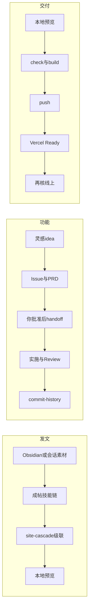

<h1 align="center">threetwoa's blog</h1>

<p align="center">
  <strong><em>an Astro blog with a system behind it</em></strong>
  <br>
  <sub>✨ code less, architect more · 配置驱动 · 静态优先 · Agent 发文流水线</sub>
</p>

<p align="center">
  
  
  
  <br>
  
  
  
  
</p>

<p align="center">
  🪴 基于 <a href="https://github.com/CuteLeaf/Firefly">Firefly</a> 的 Astro 个人博客二次开发 ☕(￣▽￣)ノ<br>
  <sub>Standalone by <a href="https://github.com/Aafff623/fork-Firefly">threetwoa</a> · 独立演进 · 非官方镜像</sub>
</p>

<p align="center">
  
</p>

<p align="center">
  <a href="#features">Features</a>
  · <a href="#showcase">Showcase</a>
  · <a href="#quick-start">Quick start</a>
  · <a href="#workflows">Workflows</a>
  · <a href="#tech-stack">Tech stack</a>
  · <a href="https://fork-firefly.vercel.app">🚀 Live</a>
  · <a href="https://github.com/Aafff623/fork-Firefly">📦 Source</a>
  · <a href="#key-docs-and-assets">📋 Docs</a>
</p>

---

> [!TIP]
> 本仓源自 [CuteLeaf/Firefly](https://github.com/CuteLeaf/Firefly)，已脱离 fork network，成为独立仓库。它保留上游主题的内容能力，同时叠加本仓自己的品牌配置、页面组件、交互与部署约定。

## Project

配置驱动的 Astro 个人博客：内容写在 Markdown / MDX，站点行为落在 `src/config`，页面由 Astro + Svelte islands + 少量客户端脚本组成。

边界很清楚——**静态优先**、**配置优先于改布局内核**、发文走双路径（Obsidian vault → `ob2blog`，或 Knowledge → `knowledge-output`），收尾都接 `site-cascade`。本仓**没有**独立 Preview 壳；产品面用下方 [Showcase](#showcase) 真机截图。

当前站点：<https://fork-firefly.vercel.app>

| 项目维度 | 当前状态 |
| --- | --- |
| Product shape | 配置驱动的 Astro 个人博客 |
| Rendering model | Static-first · SSG · CDN-friendly |
| Content model | Markdown / MDX · Content Collections |
| Interaction model | Svelte islands · Swup · progressive enhancement |
| Integrations | Waline · Iconify · SpritePet · local music（见下） |
| Deployment | Vercel 默认 · Cloudflare adapter 可选 |

### Key docs and assets

<a id="key-docs-and-assets"></a>

| 入口 | 用途 |
| --- | --- |
| [CONTEXT.md](CONTEXT.md) | 产品定位、技术事实、术语和仓库边界 |
| [AGENTS.md](AGENTS.md) | 任务流、修改边界、验证与交付规则 |
| [docs/agents/workflow.md](docs/agents/workflow.md) | 发文 / 功能 PRD / 交付闭环细则 |
| [docs/knowledge/tech-stack-inventory.md](docs/knowledge/tech-stack-inventory.md) | 技术栈细清单（包名 · 入口 · 现行/备选） |
| [docs/knowledge/style-and-assets-inventory.md](docs/knowledge/style-and-assets-inventory.md) | 视觉 · 字体 · 图标 · 桌宠 · 曲库 · 静态资源 |
| [docs/adr/](docs/adr/) | 需要长期保留的架构决策（含 Waline / 本地音乐） |
| [docs/outputs/commit-history/](docs/outputs/commit-history/) | 历史改动、视觉演进和工作摘要 |
| [assets/images/readme/](assets/images/readme/) | Banner、Features、Integrations、Workflow、架构图、技术栈图与 Showcase 资产 |
| [preview-readme.html](preview-readme.html) | README 本地预览壳（端口 **8090**；非产品站） |
| [capture-readme-showcase.py](scripts/capture-readme-showcase.py) | 本地 Playwright 重截 README Showcase |

推荐阅读顺序：`README.md` → `CONTEXT.md` → `AGENTS.md` → 两篇 inventory → `docs/adr/` → `src/config/` / `src/content/`。

## Features

核心能力按「内容 → 阅读 → 个性化 → 集成」组织。主视觉见下图；入口路径与完整行表在折叠区。

<p align="center">
  
</p>

<details>
<summary>Features 详表（Area · Capability · entry）</summary>

| Area | Capability | Included | Main entry |
| --- | --- | --- | --- |
| Publishing | Content model | `posts`、`dynamic`、`spec` 三类 Content Collections | `src/content/` · `src/content.config.ts` |
| Publishing | Authoring | Markdown / MDX、frontmatter、草稿、置顶、密码文章、文章关联 | `src/content/` · `src/plugins/` |
| Publishing | Build output | RSS、Sitemap、OpenGraph、阅读时间、字数、Pagefind 索引 | `astro.config.mjs` · `scripts/` |
| Publishing | Rich content | KaTeX、Mermaid（merman 静态 SVG）、PlantUML、Wiki Link、代码组、directive | `src/plugins/` |
| Reading | List system | list、grid、waterfall；Featured、标签和分类入口 | `src/components/layout/` |
| Reading | Article navigation | Index-First TOC、相关文章、文章导航、标签聚焦 | `src/components/layout/PostPage.astro` |
| Reading | Display controls | 亮暗色、系统主题、色相、壁纸模式、卡片表现 | `src/config/displaySettingsConfig.ts` |
| Reading | Interaction model | Swup 页面过渡与 Svelte islands 按需注水 | `src/components/` · `src/layouts/` |
| Personal surfaces | Dynamic | 碎碎念时间线，可接本地内容或 Memos | `src/pages/dynamic/index.astro` |
| Personal surfaces | Gallery | 作品集手风琴与 Three.js 无限画布双模式 | `src/pages/gallery/` |
| Personal surfaces | Extended pages | About、Friends、Guestbook、Anime 等独立页面 | `src/pages/` · `src/content/spec/` |
| Personal surfaces | Widgets | 热力图、日历、公告礼盒、园径便签、标签墙、统计、桌宠 | `src/components/widget/` |
| Integration | Comments | Waline（ADR-0001）：表情预设、Giphy、访客统计；`stickerSuggest` 已集成默认关 | `src/config/commentConfig.ts` |
| Integration | Icons | `astro-icon` + Iconify（lucide 主，兼 fa7 / simple-icons / mdi / mingcute / material-symbols） | `astro.config.mjs` |
| Integration | Pets & music | SpritePet 默认开；Live2D / Spine 备选互斥；音乐默认 local（ADR-0002） | `petConfig.ts` · `musicConfig.ts` · `pioConfig.ts` |
| Integration | Media services | 评论大图 COS 代理上传；Fancybox 灯箱 | `.env.example` · `src/pages/api/` |
| Integration | Delivery | Vercel 默认部署，Cloudflare adapter 可选 | `vercel.json` · `wrangler.jsonc` |
| Integration | Localization | `zh_CN`、`zh_TW`、`en`、`ja`、`ru`、`ko` | `src/config/siteConfig.ts` |

</details>

## Integrations

把「装进站点、但容易被 README 漏掉」的集成单独摊开。现行 vs 备选以配置为准，不硬编码进布局。主视觉见下图；完整对照表在折叠区。

<p align="center">
  
</p>

<details>
<summary>Integrations 详表（现行 · 备选 · 配置入口）</summary>

| 域 | 现行（默认） | 备选 / 旁路 | 配置入口 |
| --- | --- | --- | --- |
| 评论 | **Waline**（自建 `serverURL` + Neon） | Twikoo / Giscus / Artalk / Disqus 槽位保留 | [`commentConfig.ts`](src/config/commentConfig.ts) · [ADR-0001](docs/adr/0001-waline-over-giscus.md) |
| 表情包 | `@waline/emojis@1.4.0`：qq / weibo / bilibili / bmoji | CDN 可换包 | `commentConfig.waline.emoji` |
| GIF | Waline 客户端默认 **Giphy** search | 高流量时可换自有 API Key | `Waline.astro` |
| 梗图建议 | `stickerSuggest` **已接线、默认 `enabled: false`** | 可开词表；可选 DeepSeek agent | `/api/comment-sticker-suggest` |
| 评论大图 | 腾讯云 **COS** 服务端代理（绕过 128KB Base64） | 未配密钥则大图不可用 | `/api/comment-image` · `.env.example` |
| 图标 | **Iconify** via `astro-icon`；UI 以 **Lucide** 为主 | fa7 / simple-icons / mdi / mingcute / material-symbols | `astro.config.mjs` → `icon({ include })` |
| 桌宠 | **SpritePet** 默认开（双 DeepSeek 皮） | Live2D / Spine；三者互斥 | [`petConfig.ts`](src/config/petConfig.ts) · `pioConfig.ts` |
| 音乐 | **local** 自托管曲库 | Meting API 备源 | [`musicConfig.ts`](src/config/musicConfig.ts) · [ADR-0002](docs/adr/0002-local-music-default.md) |
| 灯箱 / 图示 | Fancybox；Mermaid 经 **merman** 构建期出 SVG | PlantUML · panzoom | `@fancyapps/ui` · `@mermanjs/web` |
| 动态源 | 本地 `content/dynamic` | 可选 Memos API | `dynamicConfig` · `DynamicSidebar` |
| 分析 | 槽位就绪（GA / Clarity / Umami / 51la） | ID 多为空，按需填 | `analyticsConfig.ts` |

</details>

决策记录：评论走 Waline 而不是 Giscus，是为了表情选项卡与 GIF 插入闭环（见 ADR-0001）。音乐默认 local，是为了不依赖公共 Meting 可用性（见 ADR-0002）。

## Showcase

推荐浏览路径：首页 → 文章 → Dynamic → Timeline / About / Gallery。

截图来自本地 `pnpm dev`（`http://127.0.0.1:4321`），由 Playwright 脚本重截；样式迭代后请再跑一遍覆盖旧图。脚本会隐藏桌宠与礼盒 toast，避免挡画面。

```bash
# 先 pnpm dev，再：
python scripts/capture-readme-showcase.py
```

本仓无独立 Preview 站；下表即产品主链路真机面。

<table>
  <tr>
    <td width="33%" valign="top" align="center">
      <a href="assets/images/readme/showcase-home.png"></a>
      <br><strong>Home</strong><br>
      <sub>文章卡片 · 双侧栏 · 壁纸横幅 · 分类条</sub><br>
      <a href="https://fork-firefly.vercel.app/">Open</a>
    </td>
    <td width="33%" valign="top" align="center">
      <a href="assets/images/readme/showcase-post.png"></a>
      <br><strong>Post</strong><br>
      <sub>Index-First TOC · 封面 · Markdown 扩展 · 公告礼盒</sub><br>
      <a href="https://fork-firefly.vercel.app/posts/claude-code-windows-beautify/">Open</a>
    </td>
    <td width="33%" valign="top" align="center">
      <a href="assets/images/readme/showcase-dynamic.png"></a>
      <br><strong>Dynamic</strong><br>
      <sub>碎碎念时间线 · 搜索筛选 · Memos 可接</sub><br>
      <a href="https://fork-firefly.vercel.app/dynamic/">Open</a>
    </td>
  </tr>
  <tr>
    <td width="33%" valign="top" align="center">
      <a href="assets/images/readme/showcase-timeline.png"></a>
      <br><strong>Timeline</strong><br>
      <sub>按年折叠 · 行列表 · 内容索引</sub><br>
      <a href="https://fork-firefly.vercel.app/timeline/">Open</a>
    </td>
    <td width="33%" valign="top" align="center">
      <a href="assets/images/readme/showcase-about.png"></a>
      <br><strong>About</strong><br>
      <sub>Quote-Led · Now / 统计 / 日历侧栏</sub><br>
      <a href="https://fork-firefly.vercel.app/about/">Open</a>
    </td>
    <td width="33%" valign="top" align="center">
      <a href="assets/images/readme/showcase-gallery.png"></a>
      <br><strong>Gallery</strong><br>
      <sub>作品集手风琴 · 无限画布双模式</sub><br>
      <a href="https://fork-firefly.vercel.app/gallery/">Open</a>
    </td>
  </tr>
</table>

## Quick start

<details>
<summary>Requirements</summary>

- Node.js ≥ 22
- pnpm ≥ 9，锁文件版本为 `9.14.4`
</details>

<details open>
<summary>Local development</summary>

```bash
git clone https://github.com/Aafff623/fork-Firefly.git
cd fork-Firefly
pnpm install
pnpm dev
```

打开 <http://localhost:4321> 查看站点。

首次配置请阅读 [Configuration](#configuration)：先完成站点身份和内容，再开评论、COS、Memos 等可选服务。
</details>

<details>
<summary>Useful commands</summary>

```bash
# dependencies and local server
pnpm install
pnpm dev

# diagnostics and production build
pnpm check
pnpm type-check
pnpm build
pnpm preview

# content helpers
pnpm new-post <slug>
pnpm new-d <一句话>

# README Showcase; run pnpm dev first
python scripts/capture-readme-showcase.py

# README 本地预览壳（GFM 渲染 README.md，非产品站）
python -m http.server 8090
# 打开 http://127.0.0.1:8090/preview-readme.html
```
</details>

## Workflows

三条主链路：发文、功能、交付。主视觉见下图；细则见 [docs/agents/workflow.md](docs/agents/workflow.md) · [AGENTS.md](AGENTS.md)。

<p align="center">
  
</p>

<details>
<summary>Workflows 详表（发文路径 · PRD 门禁 · 交付 · Mermaid）</summary>



#### 发文

| 路径 | 源 | 技能链 |
| --- | --- | --- |
| 甲 | Obsidian vault（`threetwoa_ob`） | `ob2blog` → `site-cascade` |
| 乙 | 会话 / Knowledge 素材 | `knowledge-extract` → `knowledge-output` → `site-cascade` |

内容目录：

```text
src/content/
├── posts/      # 博客文章，支持 Markdown / MDX
├── dynamic/    # 动态、碎碎念或 Memos 时间线
└── spec/       # About、Friends、Guestbook 等特殊页面内容
```

文章 frontmatter 经 [src/content.config.ts](src/content.config.ts) 校验。生产构建默认隐藏 `draft: true`；本地可预览草稿。日常写作改内容文件，日常换皮改 `src/config`——不要为改站名、侧栏或壁纸去动布局内核。

#### 功能（PRD 门禁）

```text
docs/idea/{theme}/ → Issue(.scratch/) → PRD(draft) → 你批准
  → handoff → 实施 → awaiting-review → commit + commit-history → archive
```

灵感只进 `docs/idea/` 不算开题。未批准的大规模功能不写代码（配置微调 / 文案 / 部署除外，需在对话声明）。

#### 交付闭环

本地预览 → 本地校验 → 你确认后 push → 等 Vercel Ready → **打开线上再核**。未本地验收不得 push；未看线上不得宣称部署完成。

</details>

## Configuration

从零部署时，建议按下面的顺序推进：先让站点稳定运行，再逐步启用评论、动态和媒体服务。配置优先于修改布局内核。

1. **准备运行环境**

   安装 Node.js ≥ 22 和 pnpm ≥ 9，并确认 pnpm 版本与锁文件一致：

   ```bash
   node --version
   pnpm --version
   ```

2. **获取项目并安装依赖**

   ```bash
   git clone https://github.com/Aafff623/fork-Firefly.git
   cd fork-Firefly
   pnpm install
   ```

3. **配置站点身份**

   先修改站点名称、描述、域名、语言、头像和个人信息：

   - `src/config/siteConfig.ts`：站点名、色相、语言、页面开关和文章列表
   - `src/config/profileConfig.ts`：头像、简介和联系方式
   - `src/config/navBarConfig.ts`：导航与搜索入口

   语言通过 `SITE_LANG` 设置：

   ```ts
   const SITE_LANG = "zh_CN";
   ```

4. **配置页面和显示系统**

   根据需要调整侧栏、壁纸、主题和页面表现：

   - `src/config/sidebarConfig.ts`：双侧栏与 widget 顺序
   - `src/config/backgroundWallpaper.ts`：壁纸、透明度和背景模式
   - `src/config/displaySettingsConfig.ts`：亮暗色、布局和显示面板
   - `src/config/galleryConfig.ts`：相册模式和相册元数据

5. **准备内容**

   将文章、动态和特殊页面分别放入对应目录：

   ```text
   src/content/posts/      # Markdown / MDX 文章
   src/content/dynamic/    # 动态、碎碎念或 Memos 时间线
   src/content/spec/       # About、Friends、Guestbook 等特殊页面
   ```

   文章 frontmatter 会由 [src/content.config.ts](src/content.config.ts) 校验。生产构建默认隐藏 `draft: true` 的文章。

6. **启用 / 核对集成服务**

   - 复制 [.env.example](.env.example) 为 `.env`（仅在需要 COS 等密钥时）
   - 评论：`commentConfig.ts` 现行 Waline；表情与 Giphy 已接
   - 桌宠：`petConfig.ts` 默认开；与 Live2D / Spine 互斥
   - 音乐：`musicConfig.ts` 默认 `local`
   - 不要提交 `.env`、API key 或评论服务 token

7. **本地验证**

   ```bash
   pnpm check
   pnpm type-check
   pnpm build
   pnpm preview
   ```

   构建完成后，确认 `dist/`、搜索索引、RSS、Sitemap 和主要页面均正常。

8. **部署到 Vercel**

   在 Vercel 中导入仓库，使用以下设置：

   | Setting | Value |
   | --- | --- |
   | Framework preset | Astro |
   | Install command | `pnpm install` |
   | Build command | `pnpm build` |
   | Output directory | `dist` |

   如果使用评论、COS 或其他外部服务，在 Vercel Project Settings → Environment Variables 中补齐 `.env` 对应变量，再触发部署。

9. **上线后复核**

   依次检查首页、文章页、搜索、RSS、Sitemap、评论、图片上传和移动端布局。UI 大改后，再运行 `scripts/capture-readme-showcase.py` 更新 README Showcase。

<details>
<summary>Configuration file map</summary>

| 你想改什么 | 文件 |
| --- | --- |
| 站点名、色相、页面开关、文章列表 | `src/config/siteConfig.ts` |
| 头像、简介、联系方式 | `src/config/profileConfig.ts` |
| 导航和搜索 | `src/config/navBarConfig.ts` |
| 双侧栏与 widget 顺序 | `src/config/sidebarConfig.ts` |
| 壁纸、透明度和背景模式 | `src/config/backgroundWallpaper.ts` |
| 亮暗色、布局和显示面板 | `src/config/displaySettingsConfig.ts` |
| 评论系统与 Waline | `src/config/commentConfig.ts` |
| 相册模式与相册元数据 | `src/config/galleryConfig.ts` |
| 公告、礼盒和日历封面 | `src/config/announcementConfig.ts` |
| 特效开关 | `src/config/effectsConfig.ts` |
| 音乐、桌宠、Live2D / Spine | `src/config/musicConfig.ts` · `petConfig.ts` · `pioConfig.ts` |
| 字体、代码块和 Markdown 扩展 | `src/config/fontConfig.ts` · `expressiveCodeConfig.ts` · `src/plugins/` |

配置通过 [src/config/index.ts](src/config/index.ts) 统一导出，类型定义集中在 `src/types/`。
</details>

## Architecture

项目把「经常修改的内容」与「尽量稳定的内核」分开：运营走配置和 Markdown，构建链路负责增强，浏览器只接收必要的交互。

<p align="center">
  
</p>

| Layer | Responsibility | Primary surfaces |
| --- | --- | --- |
| Authoring | 配置、文案、Markdown / MDX | `src/config` · `src/content` |
| Composition | 页面、布局、组件和 Markdown plugins | `src/pages` · `src/layouts` · `src/components` · `src/plugins` |
| Build | 静态生成、图片占位、字体、Mermaid SVG、搜索索引 | Astro SSG · LQIP · font subset · merman · Pagefind |
| Runtime | CDN 交付与轻量交互 | `dist` · Vercel · Swup · Svelte islands · Waline · SpritePet · Iconify |

### Design principles

1. **Config over layout** — 品牌、开关、壁纸和侧栏参数优先放在 `src/config`。
2. **Static by default** — 默认输出静态站点；只有 API 和明确的运行时需求才使用 adapter。
3. **Islands, not SPA** — 交互按组件注水，不把整个站点变成客户端应用。
4. **Content collections** — 文章、动态和特殊页面都经过 schema 校验。
5. **Motion with intent** — 微交互优先 CSS；复杂编排才使用更重的动画方案，并保留 reduced-motion 路径。
6. **Visual consistency over feature count** — 新页面必须共享 token、导航、响应式边界和可访问状态。

## Style and assets

视觉三原则（细则见 [CONTEXT.md](CONTEXT.md)）：

1. 壳层中性灰 — 页面 / 卡片底色不泡在主题色里。
2. 彩仅点缀 — 紫系邻近色只出现在链接、高亮、图标、竖条。
3. 默认色相 hue ≈ 290（Kraken 主紫）作链接主色。

| 域 | 现行 | 配置 / 路径 |
| --- | --- | --- |
| 主题与显示 | system 模式 · hue 290 · 卡片边框开 | `siteConfig.ts` · `displaySettingsConfig.ts` |
| 壁纸 / Banner 氛围 | 横幅 + 独立 `atmosphere` 垫底 | `backgroundWallpaper.ts` |
| 样式入口 | `main.css` + 页面/组件 CSS | `src/styles/` |
| 字体 | 全局 Inter；横幅 Zen Maru；代码 JetBrains Mono | `fontConfig.ts` |
| 代码主题 | `one-dark-pro` / `one-light` | `expressiveCodeConfig.ts` |
| 图标 | Iconify；UI 以 Lucide 为主 | `astro.config.mjs` → `icon.include` |
| 桌宠 | SpritePet 双 DeepSeek + 访客换皮 | `petConfig.ts` · `public/pets/` |
| Live2D / Spine | 备选，与桌宠互斥 | `pioConfig.ts` · `public/pio/` |
| 评论表情 | Waline emojis：qq / weibo / bilibili / bmoji | `commentConfig.ts` |
| 音乐 | local 曲库（Pixabay 氛围曲等） | `musicConfig.ts` · `public/assets/music/` |
| README 配图 | banner · architecture · tech-stack · showcase-* | `assets/images/readme/` |
| 合集 / 日历 GIF 等 | 合集封面 · 日历月图 | `public/assets/collections/` · `images/widgets/calendar/` |

细清单（字体权重、图标全集、宠物许可、静态目录树）：[docs/knowledge/style-and-assets-inventory.md](docs/knowledge/style-and-assets-inventory.md)。

## Tech stack

技术栈按「运行时、内容管线、交互、构建、交付、集成、开发期」分组。图负责气质；下表负责事实。图若略旧，以本表与 inventory 为准。

<p align="center">
  
</p>

| Lane | Stack | 本站现行 | Role |
| --- | --- | --- | --- |
| Runtime core | Astro 7.1 · Svelte 5 · React 19（少量）· TypeScript 6 · Tailwind CSS 4 · pnpm 9 · Node ≥22 | 全开 | 页面、岛屿、类型与样式 |
| Publishing | MD / MDX · Content Collections · remark / rehype · Expressive Code（one-dark-pro / one-light） | 全开 | 写作契约与正文增强 |
| Fonts | Inter（全局）· Zen Maru（横幅）· JetBrains Mono（代码）· GreatVibes（本地子集） | 见 fontConfig | 品牌与可读性 |
| Interaction | Swup · Iconify（Lucide 主）· Fancybox · Three.js（Gallery）· Framer Motion（动态时间线） | 全开 | 过渡、图标、灯箱、画廊 |
| Build enrichment | Sharp · LQIP · font subset · **merman** · Pagefind · Satori（OG） | `pnpm build` 串起 | 构建期把贵活做完 |
| Delivery | `dist/` · Vercel（`@astrojs/vercel`）· Cloudflare adapter（可选） | Vercel 默认 | 静态出站 + 少量 API |
| Site integrations | Waline + emoji/Giphy · SpritePet · local music · COS · analytics 槽位 | 前三项现行；分析 ID 多为空 | 配置门控 |
| Quality | Biome · `astro check` · tsc · only-allow pnpm | 全开 | 格式、类型与包管理纪律 |
| Agent tooling | `ob2blog` · knowledge-* · `site-cascade` · minimax-media · gsap-* skills | **开发期**，非站点运行时硬依赖 | 发文与动画工作流 |

完整包名、插件链与入口路径：[docs/knowledge/tech-stack-inventory.md](docs/knowledge/tech-stack-inventory.md)。

## Deploy

本仓默认部署到 Vercel 项目 `fork-firefly`：

| Setting | Value |
| --- | --- |
| Framework | Astro |
| Build command | `pnpm build` |
| Install command | `pnpm install` |
| Output directory | `dist` |
| Project config | [vercel.json](vercel.json) |

标准交付顺序：本地预览 → `pnpm check` / `pnpm type-check` → `pnpm build` → push → 等待 Vercel Ready → 复核线上页面。

Cloudflare 配置保留在 [wrangler.jsonc](wrangler.jsonc)，但启用 Cloudflare 时需要额外验证 API 路由与 Node runtime 依赖。

## Project rules

- [AGENTS.md](AGENTS.md)：任务流、修改边界、提交和交付规则。
- [CONTEXT.md](CONTEXT.md)：产品定位、术语、技术事实和仓库边界。
- [docs/agents/workflow.md](docs/agents/workflow.md)：发文 / 功能 / 交付细则。
- [docs/knowledge/tech-stack-inventory.md](docs/knowledge/tech-stack-inventory.md) · [style-and-assets-inventory.md](docs/knowledge/style-and-assets-inventory.md)：栈与素材细表。
- `docs/adr/`：需要长期保留的架构决策。
- `docs/outputs/commit-history/`：已完成工作和视觉演进的摘要。
- `docs/idea/`：尚未进入实现阶段的灵感和设计研究。

不要提交 `.env`、评论服务 token 或私有 API key。二次开发请保留 Firefly / Fuwari 的版权声明与 MIT 义务。

## Author

- GitHub: [Aafff623](https://github.com/Aafff623)
- Blog: [threetwoa's blog](https://fork-firefly.vercel.app)

## Acknowledgments

- Theme: [CuteLeaf/Firefly](https://github.com/CuteLeaf/Firefly)
- Original theme lineage: [saicaca/fuwari](https://github.com/saicaca/fuwari)
- Working style: [andrej-karpathy-skills](https://github.com/multica-ai/andrej-karpathy-skills)
- License: [MIT](LICENSE)
