<h1 align="center">threetwoa's blog</h1>

<p align="center">
  <strong><em>Astro 静态博客 · 配置驱动 · Agent 发文流水线</em></strong>
  <br>
  <sub>少写一点一次性代码，多留一点可复用结构 · standalone Firefly 二次开发</sub>
</p>

<!-- Badges: 两行紧凑 · 无分组标题（避免三栏段落外边距把信息密度撑稀） -->
<p align="center">
  <a href="https://www.threetwoa.live"></a>
  <a href="https://github.com/Aafff623/fork-Firefly/blob/master/LICENSE"></a>
  <a href="https://github.com/Aafff623/fork-Firefly/commits/master"></a>
  
  <br>
  
  
  
  
  
  
  
  
  
  <a href="https://github.com/Aafff623/fork-Firefly"></a>
</p>

<p align="center">
  基于 <a href="https://github.com/CuteLeaf/Firefly">CuteLeaf/Firefly</a> 的 Astro 个人博客二次开发<br>
  <sub>作者 <a href="https://github.com/Aafff623">Aafff623</a> / threetwoa · 已脱离 fork network · 非官方镜像</sub>
</p>

<p align="center">
  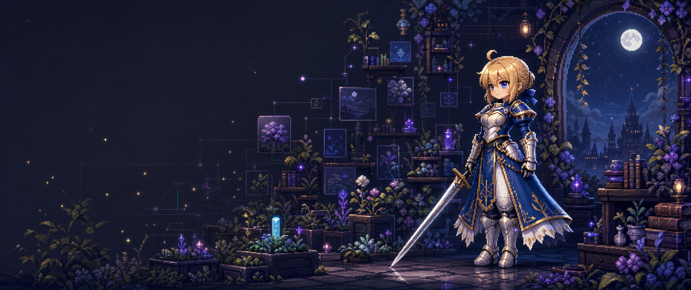
</p>

<p align="center">
  <a href="#features">Features</a>
  · <a href="#integrations">Integrations</a>
  · <a href="#showcase">Showcase</a>
  · <a href="#quick-start">Quick start</a>
  · <a href="#workflows">Workflows</a>
  · <a href="#architecture">Architecture</a>
  · <a href="#performance">Performance</a>
  · <a href="#tech-stack">Tech stack</a>
  · <a href="https://www.threetwoa.live">Live</a>
  · <a href="https://github.com/Aafff623/fork-Firefly">Source</a>
  · <a href="#key-docs-and-assets">Docs</a>
</p>

---

> [!TIP]
> 本仓源自 [CuteLeaf/Firefly](https://github.com/CuteLeaf/Firefly)，已脱离 fork network。保留上游主题的内容与页面能力，并叠加本仓品牌配置、组件、交互与多平台交付约定。主入口：<https://www.threetwoa.live>；Vercel 备用：<https://fork-firefly.vercel.app>。

## Project

配置驱动的 Astro 个人博客：正文在 Markdown / MDX，行为在 `src/config`，页面由 Astro + Svelte islands + 少量客户端脚本组成。

硬边界：**静态优先**、**改站先改配置**、发文唯一入口 `knowledge-extract`（四渠分流）再 `knowledge-output` / 合集 skill，收尾统一 `site-cascade`。本仓**没有**独立 Preview 产品壳；产品面见下方 [Showcase](#showcase)。README 本地预览壳是 `preview-readme.html`（端口 8090），与站点本身无关。

| 维度 | 事实 |
| --- | --- |
| Product | standalone Firefly 二次开发个人博客 |
| Render | Static-first · SSG · CDN |
| Content | `posts` / `dynamic` / `spec` Content Collections |
| Interaction | Svelte islands · Swup · progressive enhancement |
| Integrations | Giscus · Waline（Dynamic）· GitHub Discussions · Iconify · SpritePet · local music |
| Delivery | `www.threetwoa.live` → EdgeOne CDN → Vercel origin；Cloudflare DNS + R2 图床 |

### Modules

| 模块 | 职责 | 入口 |
| --- | --- | --- |
| Config | 站点身份、导航、侧栏、壁纸、主题、评论、音乐、桌宠等开关 | `src/config/` |
| Content | 文章 / 动态 / About·Friends 等特殊页；frontmatter schema | `src/content/` · `src/content.config.ts` |
| Pages & layout | 路由页、网格壳、列表与文章页 | `src/pages/` · `src/layouts/` |
| Components | 侧栏 widget、阅读控件、相册、动态时间线等 | `src/components/` |
| Ask | HeroUI Pro 问答页、桌宠 LiveChat、同源安全代理与站内检索 | `src/components/ask/` · `src/pages/api/ask.ts` |
| Plugins | KaTeX、Mermaid(merman)、PlantUML、Wiki Link、directive | `src/plugins/` |
| Agent skills | 发文四渠（extract → output / 合集 skill）、级联、GSAP | `.cursor/skills/` |
| Scripts | LQIP、字体子集、new-post / new-d、Showcase 截图 | `scripts/` |
| Docs | CONTEXT / ADR / workflow / inventory（非运行时） | `docs/` · 根目录治理文件 |

<a id="key-docs-and-assets"></a>

### Key docs and assets

| 入口 | 用途 |
| --- | --- |
| [CONTEXT.md](CONTEXT.md) | 产品定位、技术事实、术语和仓库边界 |
| [AGENTS.md](AGENTS.md) | 任务流、修改边界、验证与交付规则 |
| [docs/agents/workflow.md](docs/agents/workflow.md) | 发文 / 功能 PRD / 交付闭环细则 |
| [docs/knowledge/tech-stack-inventory.md](docs/knowledge/tech-stack-inventory.md) | 技术栈细清单（包名 · 入口 · 现行/备选） |
| [docs/knowledge/style-and-assets-inventory.md](docs/knowledge/style-and-assets-inventory.md) | 视觉 · 字体 · 图标 · 桌宠 · 曲库 · 静态资源 |
| [docs/adr/](docs/adr/) | 长期架构决策（Waline / 本地音乐等） |
| [docs/outputs/commit-history/](docs/outputs/commit-history/) | 已完成改动与视觉演进摘要 |
| [docs/outputs/handoff/perf-optimization-2026-08-13-v3.md](docs/outputs/handoff/perf-optimization-2026-08-13-v3.md) | 最新性能、移动端与兼容性验收 |
| [assets/images/readme/](assets/images/readme/) | Banner、Features、Integrations、Workflow、架构 / 技术栈图、Showcase |
| [preview-readme.html](preview-readme.html) | README 本地预览壳（**8090**；非产品站） |
| [capture-readme-showcase.py](scripts/capture-readme-showcase.py) | Playwright 重截 README Showcase |

阅读顺序：`README` → `CONTEXT` → `AGENTS` → inventory → `docs/adr/` → `src/config/` / `src/content/`。

## Features

能力按「发布 → 阅读 → 个人页 → 集成」分层。下图是总览；表内是本仓现行能力（不是上游全部开关列表）。

<p align="center">
  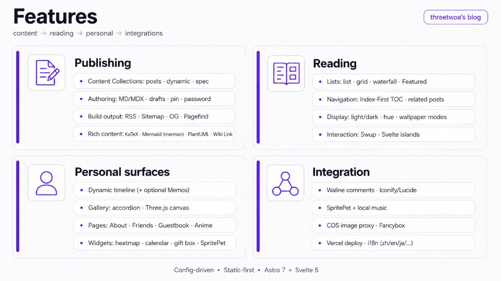
</p>

| 层 | 你能做什么 | 主要入口 |
| --- | --- | --- |
| Publishing | MD/MDX 成帖；草稿 / 置顶 / 密码文；RSS · Sitemap · OG · Pagefind | `src/content/` · `astro.config.mjs` |
| Reading | list / grid / waterfall；Index-First TOC；亮暗色 / 色相 / 壁纸 | `PostPage.astro` · `displaySettingsConfig.ts` |
| Performance | Swup 泄漏治理 · 图片按需物化 · 移动端组件裁剪 · 首屏 LCP 渲染门控 | `src/lib/page-lifecycle.ts` · `MainGridLayout.astro` |
| Ask | `/ask` HeroUI Pro 聊天岛、站内检索、SSE、桌宠 LiveChat；默认生产关闭 | `src/components/ask/` · `src/pages/api/ask.ts` |
| Personal | Dynamic 时间线、GitHub Discussions 社区、Gallery 手风琴 + Three.js 画布、About / Friends / Guestbook | `src/pages/` · `src/content/spec/` |
| Widgets | 热力图、日历、公告礼盒、园径便签、标签墙、站点统计、桌宠 | `src/components/widget/` |
| Delivery | EdgeOne CDN 主入口、Vercel 源站与回滚、Cloudflare R2 外置大图 | `vercel.json` · `edgeone.json` · `wrangler.jsonc` |

<details>
<summary>Features 详表（Area · Capability · entry）</summary>

| Area | Capability | Included | Main entry |
| --- | --- | --- | --- |
| Publishing | Content model | `posts`、`dynamic`、`spec` 三类 Content Collections | `src/content/` · `src/content.config.ts` |
| Publishing | Authoring | Markdown / MDX、frontmatter、草稿、置顶、密码文章、文章关联 | `src/content/` · `src/plugins/` |
| Publishing | Build output | RSS、Sitemap、OpenGraph、阅读时间、字数、Pagefind 索引 | `astro.config.mjs` · `scripts/` |
| Publishing | Rich content | KaTeX、Mermaid（merman 静态 SVG）、PlantUML、Wiki Link、代码组、directive | `src/plugins/` |
| Reading | List system | list、grid、waterfall；Featured、标签和分类入口 | `src/components/layout/` |
| Reading | Article navigation | Index-First TOC、相关文章、文章导航、标签聚焦 | `src/components/layout/PostPage.astro` |
| Reading | Display controls | 亮暗色、系统主题、色相、壁纸模式、卡片表现 | `src/config/displaySettingsConfig.ts` |
| Reading | Interaction model | Swup 页面过渡与 Svelte islands 按需注水 | `src/components/` · `src/layouts/` |
| Personal surfaces | Dynamic | 碎碎念时间线，可接本地内容或 Memos | `src/pages/dynamic/index.astro` |
| Personal surfaces | Gallery | 作品集手风琴与 Three.js 无限画布双模式 | `src/pages/gallery/` |
| Personal surfaces | Extended pages | Community、About、Friends、Guestbook、Anime 等独立页面 | `src/pages/` · `src/content/spec/` |
| Personal surfaces | Widgets | 热力图、日历、公告礼盒、园径便签、标签墙、统计、桌宠 | `src/components/widget/` |
| Integration | Comments | 文章主评论用 Giscus；Dynamic 内联回复保留 Waline（ADR-0006），两者都按页面延迟加载 | `src/config/commentConfig.ts` · `src/pages/dynamic/comments.astro` |
| Integration | Icons | `astro-icon` + Iconify（lucide 主，兼 fa7 / simple-icons / mdi / mingcute / material-symbols） | `astro.config.mjs` |
| Integration | Pets & music | SpritePet 默认开；Live2D / Spine 备选互斥；音乐默认 local（ADR-0002） | `petConfig.ts` · `musicConfig.ts` · `pioConfig.ts` |
| Integration | Media services | 评论大图优先 Cloudflare R2，保留 COS 兼容；Fancybox 灯箱 | `.env.example` · `src/pages/api/comment-image.ts` |
| Integration | Delivery | EdgeOne CDN → Vercel origin；Cloudflare 管 DNS 与 R2 | `vercel.json` · `edgeone.json` · `wrangler.jsonc` |
| Integration | Localization | `zh_CN`、`zh_TW`、`en`、`ja`、`ru`、`ko` | `src/config/siteConfig.ts` |

</details>

## Integrations

站点集成按配置门控：默认开的写进下表「现行」；槽位保留但未默认启用的写「备选」。改集成优先改 `src/config`，不要往布局里硬编码厂商名。

<p align="center">
  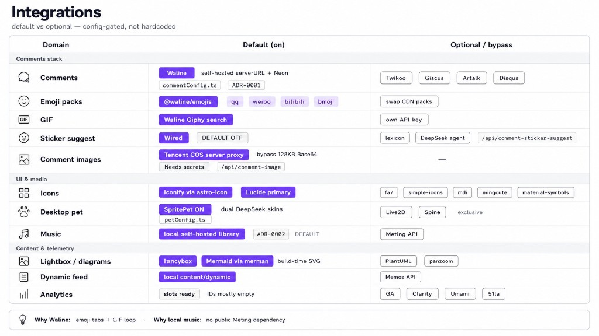
</p>

| 域 | 现行 | 备选 / 备注 | 配置 |
| --- | --- | --- | --- |
| 评论 | **Giscus**（文章）+ **Waline**（Dynamic 内联回复） | Twikoo / Artalk / Disqus 槽位保留 | `commentConfig.ts` · [ADR-0006](docs/adr/0006-giscus-with-waline-dynamic-channel.md) |
| 社区 | **GitHub Discussions** 分区与身份体系 | 独立论坛 / 注册 / 私信留作后续独立应用 | `communityConfig.ts` · `/community/` |
| 桌宠 | **SpritePet**（双 DeepSeek 皮） | Live2D / Spine（三者互斥） | `petConfig.ts` · `pioConfig.ts` |
| 音乐 | **local** 自托管曲库 | Meting API 备源 | `musicConfig.ts` · [ADR-0002](docs/adr/0002-local-music-default.md) |
| 图标 | Iconify + **Lucide** 为主 | fa7 / simple-icons / mdi / mingcute / material-symbols | `astro.config.mjs` |
| 动态源 | 本地 `content/dynamic` | 可选 Memos API | `dynamicConfig` |
| 媒体 | Fancybox；评论大图优先走 Cloudflare R2 | COS 兼容链保留；未配存储变量则上传不可用 | `/api/comment-image` · `.env.example` |

<details>
<summary>Integrations 完整对照（表情 · GIF · 分析等）</summary>

| 域 | 现行（默认） | 备选 / 旁路 | 配置入口 |
| --- | --- | --- | --- |
| 评论 | **Giscus** 承担文章讨论；**Waline** 只服务 Dynamic 内联回复 | Twikoo / Artalk / Disqus 槽位保留 | [`commentConfig.ts`](src/config/commentConfig.ts) · [ADR-0006](docs/adr/0006-giscus-with-waline-dynamic-channel.md) |
| 社区 | GitHub Discussions 的 Announcements / General / Q&A / Ideas | 以后需要站内账号时再拆独立论坛应用 | [`communityConfig.ts`](src/config/communityConfig.ts) · `/community/` |
| 表情包 | Dynamic 的 `@waline/emojis@1.4.0`：qq / weibo / bilibili / bmoji | CDN 可换包 | `commentConfig.waline.emoji` |
| GIF | Dynamic 的 Waline 客户端默认 **Giphy** search | 高流量时可换自有 API Key | `Waline.astro` |
| 梗图建议 | `stickerSuggest` **已接线、默认 `enabled: false`** | 可开词表；可选 DeepSeek agent | `/api/comment-sticker-suggest` |
| 评论大图 | Cloudflare **R2** 服务端代理（绕过 128KB Base64） | COS 兼容链保留；删除 / 取消会同步清对象 | `/api/comment-image` · `.env.example` |
| 图标 | **Iconify** via `astro-icon`；UI 以 **Lucide** 为主 | fa7 / simple-icons / mdi / mingcute / material-symbols | `astro.config.mjs` → `icon({ include })` |
| 桌宠 | **SpritePet** 默认开（双 DeepSeek 皮） | Live2D / Spine；三者互斥 | [`petConfig.ts`](src/config/petConfig.ts) · `pioConfig.ts` |
| 音乐 | **local** 自托管曲库 | Meting API 备源 | [`musicConfig.ts`](src/config/musicConfig.ts) · [ADR-0002](docs/adr/0002-local-music-default.md) |
| 灯箱 / 图示 | Fancybox；Mermaid 经 **merman** 构建期出 SVG | PlantUML · panzoom | `@fancyapps/ui` · `@mermanjs/web` |
| 动态源 | 本地 `content/dynamic` | 可选 Memos API | `dynamicConfig` · `DynamicSidebar` |
| 分析 | 槽位就绪（GA / Clarity / Umami / 51la） | ID 多为空，按需填 | `analyticsConfig.ts` |

</details>

决策记录：文章评论回归 Giscus，以 GitHub 身份、审核和 Discussions 历史为主；Dynamic 内联回复继续用 Waline，保留表情、GIF 与轻量回复体验（见 ADR-0006，ADR-0001 已被取代）。音乐默认 local，是为了不依赖公共 Meting 可用性（见 ADR-0002）。

## Showcase

推荐路径：首页 → 文章 → Dynamic → Timeline → About → Gallery。

截图来自本地 `pnpm dev`（`http://127.0.0.1:4321`），Playwright 脚本 `scripts/capture-readme-showcase.py` 重截。脚本强制 light 主题（并写入 `theme-time-beijing-v1`，避免夜间 `time` 模式盖掉）、隐藏桌宠与礼盒 toast；动态页会等到时间线条目就绪再截。UI 大改后请重跑覆盖旧图。

```bash
# 终端 A
pnpm dev --host 127.0.0.1 --port 4321

# 终端 B（Python 需已装 playwright + chromium）
python scripts/capture-readme-showcase.py
```

本仓无独立 Preview 产品站；下表即主链路真机面。README 排版预览用 `preview-readme.html`（见 Quick start）。

<table>
  <tr>
    <td width="33%" valign="top" align="center">
      <a href="assets/images/readme/showcase-home.png">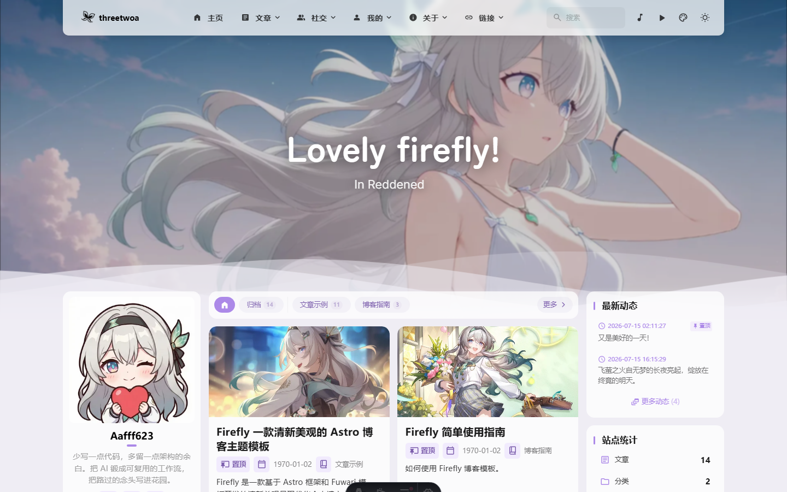</a>
      <br><strong>Home</strong><br>
      <sub>文章卡片 · 双侧栏 · 壁纸横幅 · 分类条</sub><br>
      <a href="https://www.threetwoa.live/">Open</a>
    </td>
    <td width="33%" valign="top" align="center">
      <a href="assets/images/readme/showcase-post.png">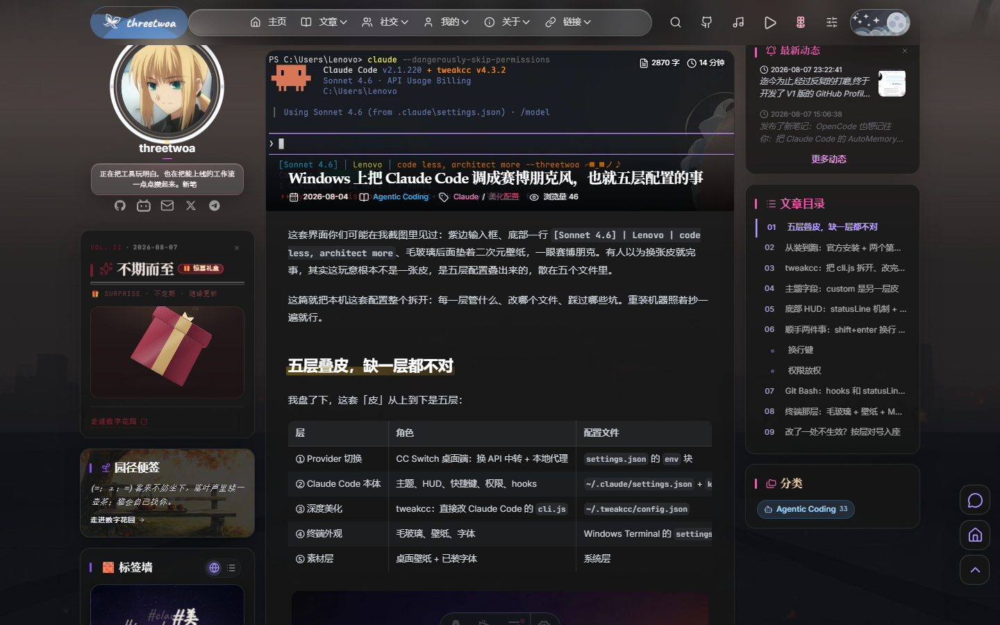</a>
      <br><strong>Post</strong><br>
      <sub>Index-First TOC · 封面 · Markdown 扩展 · 公告礼盒</sub><br>
      <a href="https://www.threetwoa.live/">Open</a>
    </td>
    <td width="33%" valign="top" align="center">
      <a href="assets/images/readme/showcase-dynamic.png">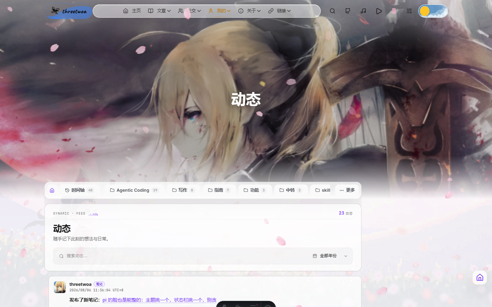</a>
      <br><strong>Dynamic</strong><br>
      <sub>朋友圈式短动态 · 本地 content 时间线 · 一键发布</sub><br>
      <a href="https://www.threetwoa.live/dynamic/">Open</a>
    </td>
  </tr>
  <tr>
    <td width="33%" valign="top" align="center">
      <a href="assets/images/readme/showcase-timeline.png">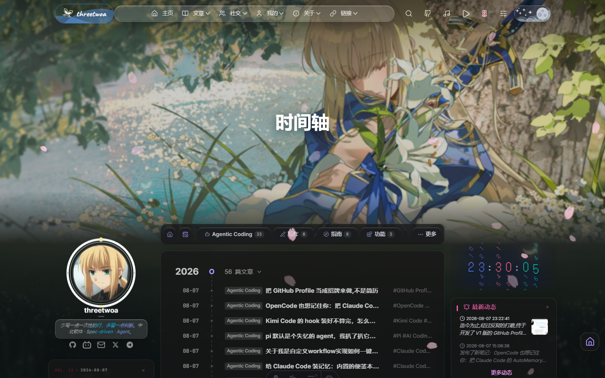</a>
      <br><strong>Timeline</strong><br>
      <sub>按年折叠 · 行列表 · 内容索引</sub><br>
      <a href="https://www.threetwoa.live/timeline/">Open</a>
    </td>
    <td width="33%" valign="top" align="center">
      <a href="assets/images/readme/showcase-about.png">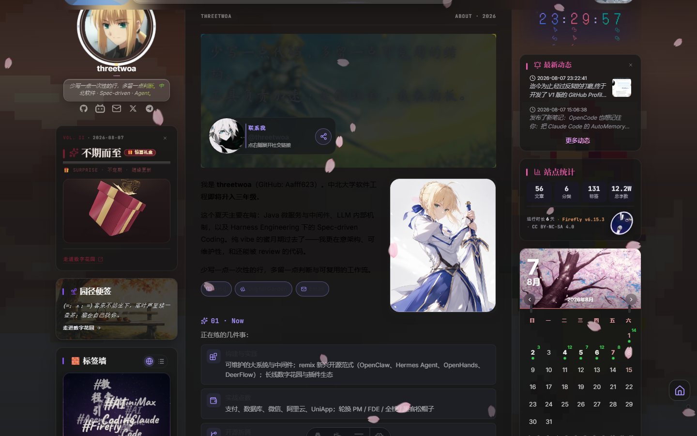</a>
      <br><strong>About</strong><br>
      <sub>Quote-Led · Now / Agent / 竞赛 · 纸质骑士分镜翻页</sub><br>
      <a href="https://www.threetwoa.live/about/">Open</a>
    </td>
    <td width="33%" valign="top" align="center">
      <a href="assets/images/readme/showcase-gallery.png">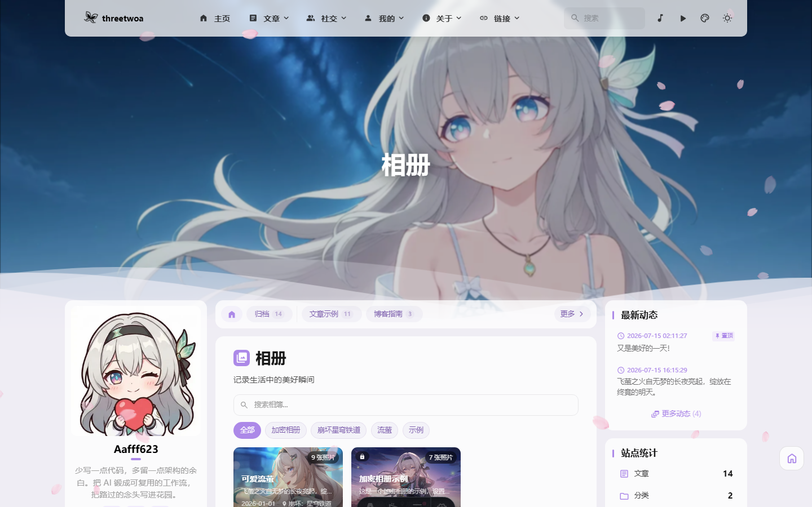</a>
      <br><strong>Gallery</strong><br>
      <sub>作品集手风琴 · 无限画布双模式</sub><br>
      <a href="https://www.threetwoa.live/gallery/">Open</a>
    </td>
  </tr>
</table>

## Quick start

**Requirements**：Node.js ≥ 22 · pnpm `9.14.4`（与 `packageManager` 一致；`preinstall` 强制 pnpm）。

```bash
git clone https://github.com/Aafff623/fork-Firefly.git
cd fork-Firefly
pnpm install
pnpm dev
```

打开 <http://127.0.0.1:4321>。首次部署先走 [Configuration](#configuration)：站点身份与内容 → 再开评论 / R2 / Memos。

| 命令 | 用途 |
| --- | --- |
| `pnpm dev` | 本地开发 |
| `pnpm check` · `pnpm type-check` | 诊断与类型 |
| `pnpm build` · `pnpm preview` | 生产构建与预览 |
| `pnpm new-post <slug>` | 新建文章骨架 |
| `pnpm new-d <一句话>` | 新建动态 |
| `python scripts/capture-readme-showcase.py` | 重截 Showcase（需先 `pnpm dev`） |
| `python -m http.server 8090` | README 预览壳 → <http://127.0.0.1:8090/preview-readme.html> |

## Workflows

三条主链路：**发文**、**功能（PRD 门禁）**、**交付闭环**。细则：[docs/agents/workflow.md](docs/agents/workflow.md) · [AGENTS.md](AGENTS.md)。

<p align="center">
  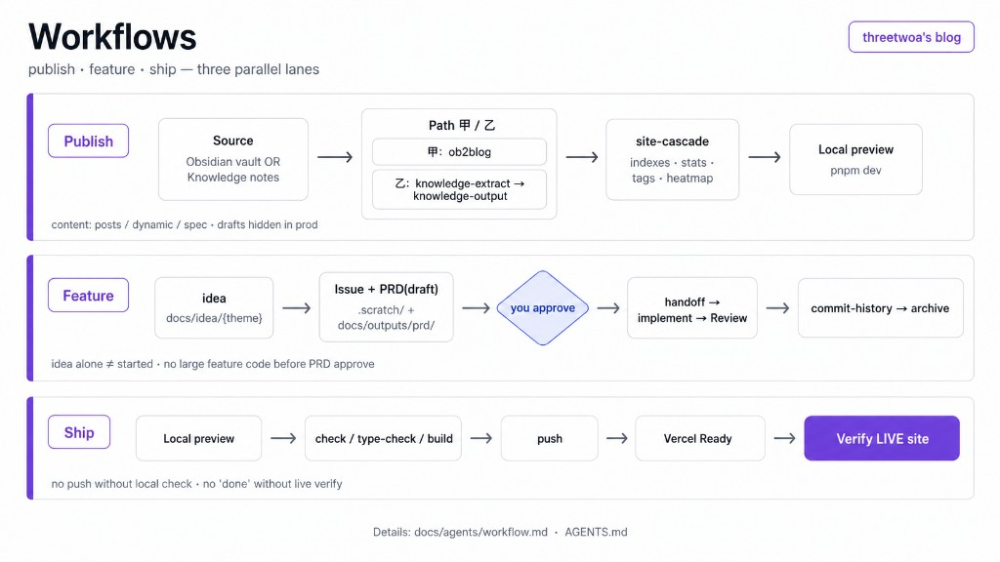
</p>

| 链路 | 一句话 | 关键门禁 |
| --- | --- | --- |
| 发文 | `knowledge-extract`（四渠）→ 1–3 再 `knowledge-output` → `site-cascade` | vault 根见 `CONTEXT.md`；早报/热榜为渠道 4 |
| 功能 | idea → Issue → PRD(draft) → 你批准 → handoff → 实施 | 未批准不写大规模功能代码 |
| 交付 | 本地预览 → check/build → push → Vercel Ready → EdgeOne / CF 链路复核 | 未本地验收不得 push；未核主域不宣称完成 |

<details>
<summary>Workflows 详表（内容目录 · Mermaid · 步骤全文）</summary>

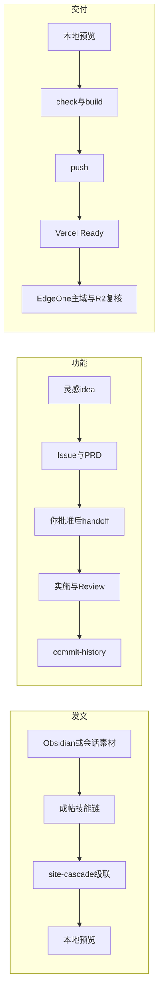

#### 发文

| 渠 | 源 | 技能链 |
| --- | --- | --- |
| 1–3 | vault / 粘贴 / 调研 | `knowledge-extract` → `knowledge-output` → `site-cascade` |
| 4 | 早报 / GitHub 周榜 | extract 交接合集 skill → `site-cascade` |

内容目录：

```text
src/content/
├── posts/      # 博客文章，支持 Markdown / MDX
├── dynamic/    # 动态、碎碎念或 Memos 时间线
└── spec/       # About、Friends、Guestbook 等特殊页面内容
```

文章 frontmatter 经 [src/content.config.ts](src/content.config.ts) 校验。生产构建默认隐藏 `draft: true`；本地可预览草稿。日常写作改内容文件，日常换皮改 `src/config`——不要为改站名、侧栏或壁纸去动布局内核。

#### 功能（PRD 门禁）

```text
docs/idea/{theme}/ → Issue(.scratch/) → PRD(draft) → 你批准
  → handoff → 实施 → awaiting-review → commit + commit-history → archive
```

灵感只进 `docs/idea/` 不算开题。未批准的大规模功能不写代码（配置微调 / 文案 / 部署除外，需在对话声明）。

#### 交付闭环

本地预览 → 本地校验 → 你确认后 push → 等 Vercel Ready → **打开 `www.threetwoa.live` 再核 EdgeOne / R2 链路**。未本地验收不得 push；未看主域线上结果不得宣称部署完成。

</details>

## Configuration

从零部署按序推进：先跑通站点 → 填身份与内容 → 再开评论 / 动态源 / R2。配置优先于改布局内核。

1. **环境**：Node ≥ 22 · pnpm 9.14.4（`node --version` · `pnpm --version`）
2. **安装**

   ```bash
   git clone https://github.com/Aafff623/fork-Firefly.git
   cd fork-Firefly
   pnpm install
   ```

3. **站点身份**
   - `siteConfig.ts`：站名、色相、语言、页面开关、列表
   - `profileConfig.ts`：头像、简介、联系方式
   - `navBarConfig.ts`：导航与搜索
   - 语言：`const SITE_LANG = "zh_CN";`
4. **显示与页面**：`sidebarConfig` · `backgroundWallpaper` · `displaySettingsConfig` · `galleryConfig`
5. **内容目录**

   ```text
   src/content/posts/      # 文章（MD / MDX）
   src/content/dynamic/    # 动态 / 碎碎念（可接 Memos）
   src/content/spec/       # About · Friends · Guestbook 等
   ```

   frontmatter 由 [src/content.config.ts](src/content.config.ts) 校验；生产默认隐藏 `draft: true`。
6. **集成**：需要密钥时复制 `.env.example` → `.env`（勿提交）。文章评论 Giscus、Dynamic 回复 Waline、桌宠 SpritePet、音乐 `local`、R2 / COS 存储见 Integrations。
7. **本地验证**：`pnpm check` · `pnpm type-check` · `pnpm check:owner` · `pnpm build` · `pnpm preview` — 核对 `dist/`、Pagefind、RSS、Sitemap、主页面。园主 DEV 编辑器只接受 loopback 会话；生产写回默认关闭，见 [ADR-0007](docs/adr/0007-owner-oauth-and-local-editor.md)。
8. **交付链**

   | Setting | Value |
   | --- | --- |
   | Vercel origin | Astro · `pnpm build` · `dist` |
   | EdgeOne CDN | `www.threetwoa.live` CNAME 到 EdgeOne，回源 Vercel |
   | Cloudflare | `threetwoa.live` DNS + `img.threetwoa.live` R2 图床 |
   | 备用入口 | `https://fork-firefly.vercel.app` |

   评论 / R2 / COS / Ask 等变量在 Vercel Project Settings → Environment Variables 补齐后再部署。
9. **上线复核**：主域首页 · 文章 · 搜索 · RSS · Sitemap · 评论 · R2 图片 · 移动端；再抽查 Vercel 备用入口。UI 大改后重跑 `scripts/capture-readme-showcase.py`。

<details>
<summary>Configuration file map</summary>

| 你想改什么 | 文件 |
| --- | --- |
| 站点名、色相、页面开关、文章列表 | `src/config/siteConfig.ts` |
| 头像、简介、联系方式 | `src/config/profileConfig.ts` |
| 导航和搜索 | `src/config/navBarConfig.ts` |
| 双侧栏与 widget 顺序 | `src/config/sidebarConfig.ts` |
| 壁纸、透明度和背景模式 | `src/config/backgroundWallpaper.ts` |
| 亮暗色、布局和显示面板 | `src/config/displaySettingsConfig.ts` |
| 评论与社区（Giscus / Dynamic Waline / Discussions） | `src/config/commentConfig.ts` · `src/config/communityConfig.ts` |
| 相册模式与相册元数据 | `src/config/galleryConfig.ts` |
| 公告、礼盒和日历封面 | `src/config/announcementConfig.ts` |
| 特效开关 | `src/config/effectsConfig.ts` |
| 音乐、桌宠、Live2D / Spine | `src/config/musicConfig.ts` · `petConfig.ts` · `pioConfig.ts` |
| 字体、代码块和 Markdown 扩展 | `src/config/fontConfig.ts` · `expressiveCodeConfig.ts` · `src/plugins/` |

配置通过 [src/config/index.ts](src/config/index.ts) 统一导出，类型定义集中在 `src/types/`。
</details>

## Architecture

把「常改」与「少动」分开：运营改配置和 Markdown；构建期做图片 / 字体 / Mermaid / 搜索索引；浏览器只拿必要的岛屿交互。

<p align="center">
  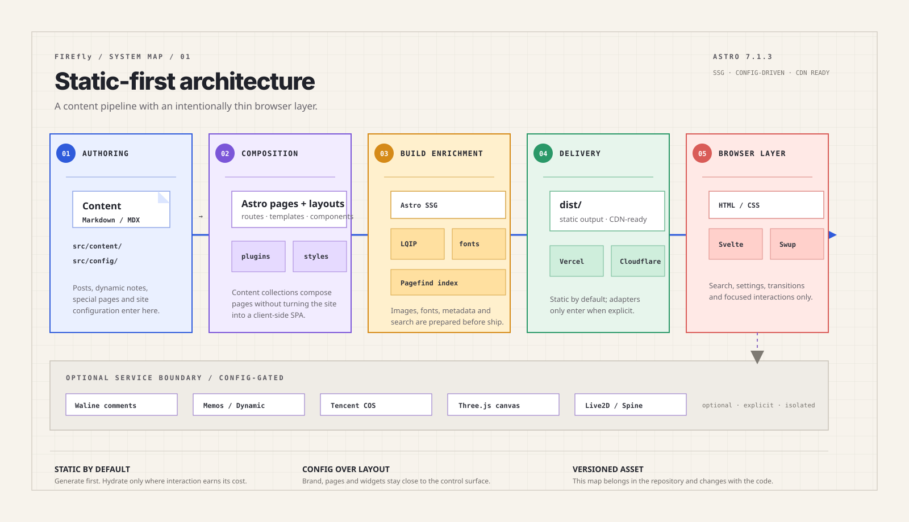
</p>

| Layer | Responsibility | Primary surfaces |
| --- | --- | --- |
| Authoring | 配置、文案、Markdown / MDX | `src/config` · `src/content` |
| Composition | 页面、布局、组件、Markdown plugins | `src/pages` · `src/layouts` · `src/components` · `src/plugins` |
| Build | SSG、LQIP、字体子集、Mermaid SVG、Pagefind | `pnpm build` 串起 |
| Runtime | CDN + 轻量交互 + 少量 API | EdgeOne CDN · Vercel origin · Swup · Svelte / React islands · Waline · SpritePet |

### Design principles

1. **Config over layout** — 品牌、开关、壁纸、侧栏优先进 `src/config`。
2. **Static by default** — 默认静态出站；仅 API 与明确运行时需求才上 adapter。
3. **Islands, not SPA** — 按组件注水，不把整站做成客户端应用。
4. **Content collections** — `posts` / `dynamic` / `spec` 均经 schema 校验。
5. **Motion with intent** — 微交互优先 CSS；重动画保留 reduced-motion。
6. **Visual consistency** — 新页共享 token、导航、响应式与可访问状态（壳层中性灰 · 彩仅点缀）。
7. **Performance as a feature** — 不阉割视觉换性能；只优化加载策略与生命周期（按需物化、离页销毁、首屏不被 JS 门控）。见下文 Performance。

## Performance

性能专项已推进到 **V7**。**方法比单个跑分重要**：先用 LCP / CDP / 20-hop 探针确认瓶颈，再改加载策略、生命周期和移动端信息密度。最新结果如下，跨环境数字只作趋势判断，不伪装成严格 A/B。

| 指标 | 参考值 | 当前值 | 变化与口径 |
| --- | ---: | ---: | --- |
| 移动端 LCP | 3241 ms | 2221 ms | -31.5%；线上旧版 vs 本地当前版，趋势值 |
| 桌面 LCP | 1696 ms | 420 ms | -75.2%；环境不可比，仅作方向验证 |
| 移动端 DOM 节点 | 3597 | 3015 | -16.2% |
| 桌面 DOM 节点 | 3598 | ≈3200 | -11.1% |
| 移动端 forced layout | 3734 ms | 2590 ms | -30.6% |
| TagCloud reflow | 723 ms | 140 ms | -80.6% |
| CLS | — | 0.01 | hero/音乐脚本 defer 引入的 0.27 已收敛 |

移动端不是等比缩小 PC：RepelText 字符、TagCloud CDN / 动画、Calendar / Recommend 重复元数据请求和底部冗余侧栏都在小屏归零；主题切换长条从 `85×40` 收到 `35×35` icon。核心治理仍包括 Swup 生命周期统一清理、图片按需物化、Pagefind 懒加载、内联脚本外置和首屏渲染门控。

**V4→V7 增量（2026-08-15/16）**：dist 571→**185MB**（`agents.astro` 根级 glob 根治 + pio 出仓 + 孤儿 chunk 清零 + 内容重复 142MB→0）；每页内联脚本 162→**49KB**；桌宠移动文章页 **0 张** spritesheet；music 双脚本 defer；Waline/画布/qrcode 点击才载；TagCloud 自托管；swup 视口内链接预取（弱网自动退避）；hero 大图懒换；页脚 CSS 异步。门禁 `scripts/check-v41-gates.mjs` **29 项**（含 dist 产物断言）进日常验证。

**V8 增量（2026-08-20）**：文章评论切回 Giscus，Dynamic 独立覆盖为 Waline；评论组件、预连接和 Waline 样式均按页面门控，文章构建产物不再引用 Waline CSS；新增 `/community/` Discussions 门户。最终构建产物 20-hop Swup 回归无重复 iframe / ID / Waline 泄漏，软跳转事件样本中位 **291ms**、最慢 **505ms**；本地无节流文章直达样本 LCP **1.35s**、CLS **0.00**（实验室观测，不等同线上 CrUX）。社区页移动 Lighthouse：Accessibility / SEO / Agentic Browsing 均 **100**；Best Practices **81** 只因本地 HTTP。专项门禁 `pnpm check:community` **9 项**。

**V9（2026-08-21 · [v1.4.0](https://github.com/Aafff623/fork-Firefly/releases/tag/v1.4.0)）**：未缓存文章先进入 2 并发意图队列，HTML 准备完成后再一次提交 URL、DOM 与即时回顶；请求失败保留旧 URL/DOM/滚动并提示重试，导航等待期暂停桌宠、标签球与装饰动画。新增 GitHub numeric-id 园主会话、本地 Markdown/图片编辑与软归档；DEV bypass 仅在显式开关与真实 loopback 下生效，退出登录需确认；搜索迁至分类条「更多」右侧，樱花开关回到设置面板。生产 GitHub 写回和真实 OAuth 尚未启用，不把本地 mock 当线上后台。专项门禁为 `scripts/check-article-navigation-gates.mjs`、`scripts/check-ui-motion-gates.mjs` 与 `pnpm check:owner`。

完整测试边界、20-hop 回归和后续项：Wiki [Performance](https://github.com/Aafff623/fork-Firefly/wiki/Performance) · [V3 handoff](docs/outputs/handoff/perf-optimization-2026-08-13-v3.md) · [V5 review+收口](docs/outputs/handoff/perf-optimization-2026-08-15-v5-plan.md) · [V6/V7 收官](docs/outputs/handoff/perf-optimization-2026-08-15-v6-final.md)。

## Style and assets

视觉三原则（细则见 [CONTEXT.md](CONTEXT.md)）：

1. 壳层中性灰 — 页面 / 卡片底色不泡在主题色里。
2. 彩仅点缀 — 紫系邻近色只出现在链接、高亮、图标、竖条。
3. 默认色相 hue ≈ 290（Kraken 主紫）作链接主色。

| 域 | 现行 | 配置 / 路径 |
| --- | --- | --- |
| 主题与显示 | system 模式 · hue 290 · 卡片边框开 | `siteConfig.ts` · `displaySettingsConfig.ts` |
| 壁纸 / Banner 氛围 | 横幅 + 独立 `atmosphere` 垫底 | `backgroundWallpaper.ts` |
| 样式入口 | `main.css` + 页面/组件 CSS | `src/styles/` |
| 字体 | 全局 Inter；横幅 Zen Maru；代码 JetBrains Mono | `fontConfig.ts` |
| 代码主题 | `one-dark-pro` / `one-light` | `expressiveCodeConfig.ts` |
| 图标 | Iconify；UI 以 Lucide 为主 | `astro.config.mjs` → `icon.include` |
| 桌宠 | SpritePet 双 DeepSeek + 访客换皮 | `petConfig.ts` · `public/pets/` |
| Live2D / Spine | 备选，与桌宠互斥 | `pioConfig.ts` · `public/pio/` |
| 评论表情 | Dynamic 的 Waline emojis：qq / weibo / bilibili / bmoji | `commentConfig.ts` |
| 音乐 | local 曲库（Pixabay 氛围曲等） | `musicConfig.ts` · `public/assets/music/` |
| README 配图 | banner · architecture · tech-stack · showcase-* | `assets/images/readme/` |
| 合集 / 日历 GIF 等 | 合集封面 · 日历月图 | `public/assets/collections/` · `images/widgets/calendar/` |

细清单（字体权重、图标全集、宠物许可、静态目录树）：[docs/knowledge/style-and-assets-inventory.md](docs/knowledge/style-and-assets-inventory.md)。

## Tech stack

技术栈按「运行时、内容管线、交互、构建、交付、集成、开发期」分组。图负责气质；下表负责事实。图若略旧，以本表与 inventory 为准。

<p align="center">
  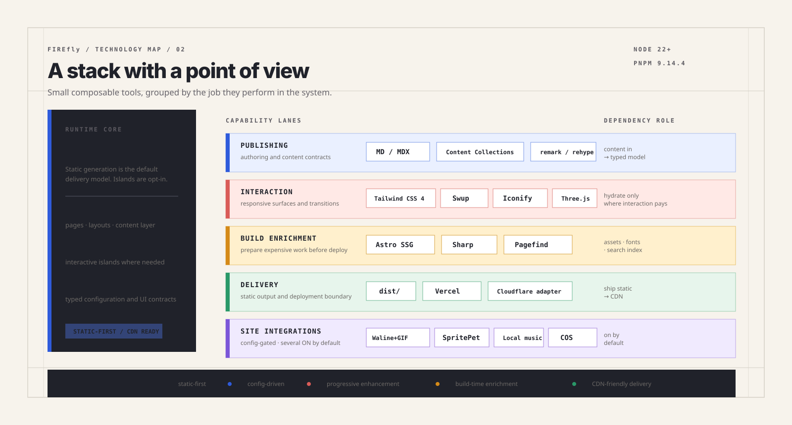
</p>

| Lane | Stack | 本站现行 | Role |
| --- | --- | --- | --- |
| Runtime core | Astro 7.1 · Svelte 5 · React 19（少量）· TypeScript 6 · Tailwind CSS 4 · pnpm 9 · Node ≥22 | 全开 | 页面、岛屿、类型与样式 |
| Publishing | MD / MDX · Content Collections · remark / rehype · Expressive Code（one-dark-pro / one-light） | 全开 | 写作契约与正文增强 |
| Fonts | Inter（全局）· Zen Maru（横幅）· JetBrains Mono（代码）· GreatVibes（本地子集） | 见 fontConfig | 品牌与可读性 |
| Interaction | Swup · Iconify（Lucide 主）· Fancybox · Three.js（Gallery）· Framer Motion（动态时间线） | 全开 | 过渡、图标、灯箱、画廊 |
| Build enrichment | Sharp · LQIP · font subset · **merman** · Pagefind · Satori（OG） | `pnpm build` 串起 | 构建期把贵活做完 |
| Delivery | Vercel origin（`@astrojs/vercel`）· EdgeOne CDN · Cloudflare DNS / R2 | 三者各司其职 | 静态出站 + 少量 API + 外置大图 |
| Site integrations | Giscus · GitHub Discussions · Dynamic Waline + emoji/Giphy · SpritePet · local music · R2 / COS · analytics 槽位 | 评论双通道按路由门控；分析 ID 多为空 | 配置门控 |
| Quality | Biome · `astro check` · tsc · only-allow pnpm | 全开 | 格式、类型与包管理纪律 |
| Agent tooling | knowledge-extract / output · `site-cascade` · gsap-* skills | **开发期**，非站点运行时硬依赖 | 发文与动画工作流 |

完整包名、插件链与入口路径：[docs/knowledge/tech-stack-inventory.md](docs/knowledge/tech-stack-inventory.md)。

## Deploy

当前生产链不是三家重复托管，而是分层协作：

| 平台 | 当前职责 | 入口 / 配置 | 验收信号 |
| --- | --- | --- | --- |
| Vercel | Git `master` 自动构建、SSR/API 源站、海外备用与回滚 | [vercel.json](vercel.json) · `fork-firefly.vercel.app` | Production `Ready`，commit 对齐 `master` |
| EdgeOne | `www.threetwoa.live` 的 CDN 与基础防护，回源 Vercel | DNS CNAME → `*.eo.dnse2.com` | HTTPS 200、`eo-cache-status`、静态资源 HIT |
| Cloudflare | `threetwoa.live` 权威 DNS；`img.threetwoa.live` R2 图床 | [wrangler.jsonc](wrangler.jsonc) · R2 环境变量 | NS 指向 Cloudflare、对象 200、`cf-cache-status` |

主入口是 <https://www.threetwoa.live>，Vercel 直链是 <https://fork-firefly.vercel.app>。当前未备案，不把 EdgeOne 的“全球不含中国大陆”链路写成大陆节点加速。

[edgeone.json](edgeone.json) / `EDGEONE=1 pnpm run build:edgeone` 保留用于 EdgeOne Pages 适配与回归，不是当前生产主托管；`CF_WORKERS=1` 才会切 Cloudflare adapter，当前主链路不使用它。

标准交付顺序：本地预览 → `pnpm check` / `pnpm type-check` → `pnpm build` → push `master` → 等 Vercel Ready → 核 `www.threetwoa.live` 首页 / 文章 / Pagefind / API → 抽查 R2 图片与缓存头。详细运行手册见 [docs/agents/edgeone-domain-runbook.md](docs/agents/edgeone-domain-runbook.md) 与 [docs/agents/architecture-cost-optimized.md](docs/agents/architecture-cost-optimized.md)。

## Project rules

- [AGENTS.md](AGENTS.md)：任务流、修改边界、提交和交付规则。
- [CONTEXT.md](CONTEXT.md)：产品定位、术语、技术事实和仓库边界。
- [docs/agents/workflow.md](docs/agents/workflow.md)：发文 / 功能 / 交付细则。
- [docs/knowledge/tech-stack-inventory.md](docs/knowledge/tech-stack-inventory.md) · [style-and-assets-inventory.md](docs/knowledge/style-and-assets-inventory.md)：栈与素材细表。
- `docs/adr/`：需要长期保留的架构决策。
- `docs/outputs/commit-history/`：已完成工作和视觉演进的摘要。
- `docs/idea/`：尚未进入实现阶段的灵感和设计研究。

不要提交 `.env`、评论服务 token 或私有 API key。二次开发请保留 Firefly / Fuwari 的版权声明与 MIT 义务。

## Author

- GitHub: [Aafff623](https://github.com/Aafff623)
- Blog: [threetwoa's blog](https://www.threetwoa.live)

## Acknowledgments

- Theme: [CuteLeaf/Firefly](https://github.com/CuteLeaf/Firefly)
- Original theme lineage: [saicaca/fuwari](https://github.com/saicaca/fuwari)
- Working style: [andrej-karpathy-skills](https://github.com/multica-ai/andrej-karpathy-skills)
- License: [MIT](LICENSE)
