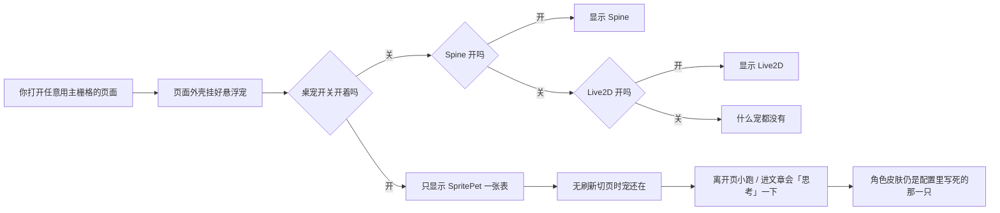
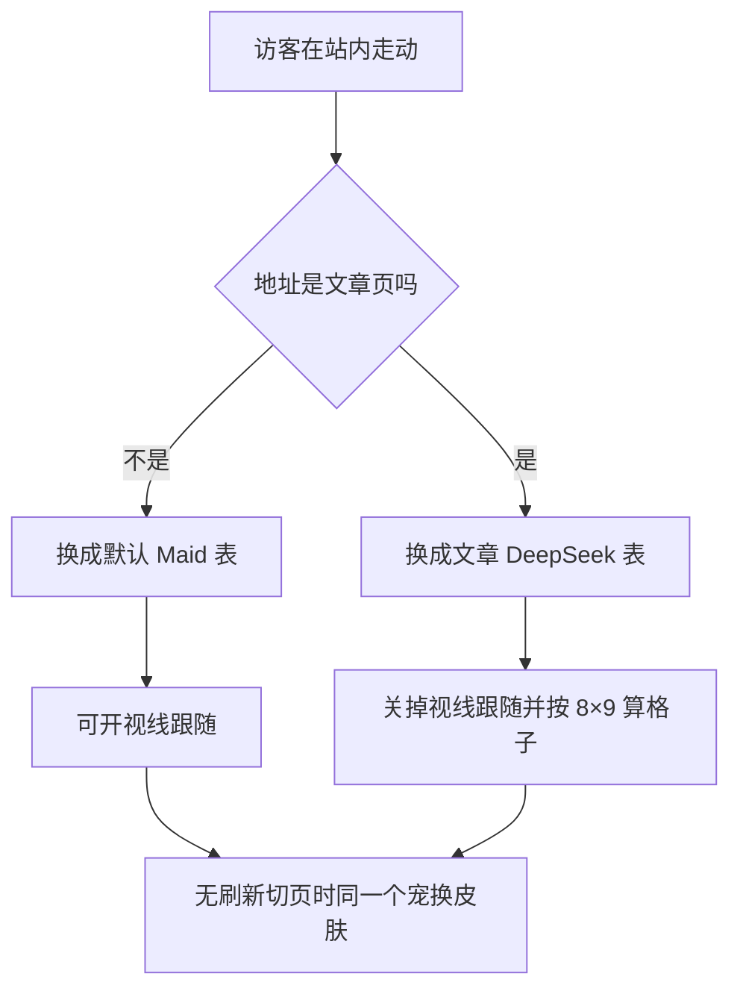

# 双桌宠迁入方案（Maid + OpenPet DeepSeek）

> 状态：**已落地**（2026-08-04）· 见 `docs/outputs/prd/dual-pet-deepseek/prd.md` · 本文保留为方案底稿  

> 素材本地源（工作区 `blog/`）：`temp/maid-deepseek-whale/` · `temp/openpet-ai-girls/deepseek/`  
> 几何对照：[`extract.md`](./extract.md) · 灵感入口：[`README.md`](./README.md)  
> 术语：站内桌宠 = `SpritePet` / spritesheet atlas；**勿与 Spine / Live2D 混名**；三者互斥不变。

---

## Conclusion

园主要的是**两套 DeepSeek 题材 SpritePet**：浏览态用 **Maid-DeepSeek-Whale（A · 8×11）** 换掉现 `dada-code`；进入 `/posts/*` 后切成 **OpenPet DeepSeek（B · 8×9）**。不是 Spine/Live2D，也不是 `temp/deepseek-pet-preview` 那种演示页。

| 项 | 结论 |
|---|---|
| 推荐实现 | **单实例** SpritePet：Swup 切页后按路由换 `petId` + atlas 变体（A=`PET_ATLAS_V2`，B=`classic-8x9`） |
| 「卡片左右两边」 | 源码最贴合解读见 §9：优先当作「点卡片进文后换宠」；双侧栏装饰位为可选增强，**非首期必做** |
| 手机 | 现配置 `hideOnMobile: true`；若要「手机正常浏览也见默认宠」，PRD 须改响应式规则（至少浏览态可见） |
| 许可黄线 | A **unknown** · B **无 LICENSE**；可假设园主接受「本地/站内试用」，**上线/再分发前仍须授权闸** |
| 本任务边界 | 只写方案；落地走 调研 → PRD → 批准 → handoff（对齐 `AGENTS.md`） |
| 下一步 | 园主确认 §4 映射与 §9 歧义后，开 `docs/outputs/prd/dual-pet-deepseek/prd.md` |

---

## Process and Evidence

### 1. 意图复述（白话）

1. **默认宠（A）**：Maid 蓝发鲸女仆，替换现在的搭搭（`dada-code` / cc-haha 四宠体系）。出现在首页、分页列表、归档、标签等「还没点进某篇文章」的浏览态；手机布局若要正常看见宠，不能沿用「≤768 一律藏」。
2. **文章宠（B）**：访客点文章卡片 / 真正进入文章页后，桌宠换成 OpenPet DeepSeek（蓝发蓝白裙 + 鲸发夹）。
3. **形态**：spritesheet 桌宠；与 Spine、Live2D **互斥**（现逻辑：桌宠开则后两者不挂）。
4. **旧宠根除**：dada / huhu / bubu / huihui 的配置、类型、`public/pets` 资源、文档与硬编码 ID 要可验证清干净（本阶段列清单，实施阶段勾验）。

---

### 2. 现状：桌宠架构（白话）+ 关键开关



| 层 | 路径 / 符号 | 现状要点 |
|---|---|---|
| 配置 | `src/config/petConfig.ts` → `spritePetConfig` | `enable: true`，`petId: "dada-code"`，`lookFollow: true`，`hideOnMobile: true`，`zIndex: 1100` |
| 类型 | `src/types/petConfig.ts` → `SpritePetConfig` | `petId: BuiltinPetId`（四宠联合类型） |
| 角色表 | `src/lib/pets/builtinPets.ts` | `dada-code` / `huhu-plan` / `bubu-fix` / `huihui-build` → `/pets/<id>/spritesheet.webp` |
| 动画核 | `src/lib/pets/petAnimation.ts` | **硬绑** `PET_ATLAS_V2`（8×11 · 192×208 · 1536×2288）；`getPetLookFrame` 用 row 9–10 |
| UI | `src/components/features/SpritePet.svelte` | 单岛；`background-size` 用 `PET_ATLAS_V2.rows`；`getDadaFrameOffset` 仅 `dada-code`；`data-swup-permanent`；挂到 `document.body` |
| 挂载 | `src/layouts/MainGridLayout.astro` → `#site-pet-host` | 在主内容 `z-30` **之外**；`spritePetConfig.enable` 时只挂 SpritePet，否则才考虑 Spine / Live2D |
| 互斥 | `src/config/pioConfig.ts` | 注释约定：桌宠开则 Spine/Live2D 配置不生效；现 `spineModelConfig.enable` / `live2dWidgetConfig.enable` 均为 `false` |
| 文章识别（布局） | `MainGridLayout`：`isPostPage = !!postSlug` | 仅文章页传入 `postSlug`（`posts/[...slug].astro`） |
| 文章识别（宠内） | `SpritePet.isPostPath()`：`/\/posts\//` | **只驱动动作**（进文 `review`、读文滚动 `waiting`），**不换皮** |
| 列表卡片 | `src/components/layout/PostCard.astro` | 卡片链到文章 URL；无桌宠挂点；有 `card-rail`（索引轨）与封面位，**不是宠槽** |
| Swup | `SpritePet` 已绑 `animation:out:start` / `page:view` / `content:replace` | 实例常驻；切页**不必销毁重建**；若要换皮，应在 `page:view`（或等价）后改 `petId`/atlas，而不是整页重挂 |

**关键开关一览**

| 开关 | 文件 | 双宠方案影响 |
|---|---|---|
| `spritePetConfig.enable` | `petConfig.ts` | 保持 true；仍优先于 Spine/Live2D |
| `spritePetConfig.petId` | 同上 | 今日单值；方案改为「默认 ID」+ 运行时路由覆盖 |
| `lookFollow` | 同上 | A 可 true；B 必须 false（或缺 look 的 atlas 分支） |
| `responsive.hideOnMobile` | 同上 | 与「手机浏览见默认宠」冲突，PRD 必决 |
| `spineModelConfig.enable` / `live2dWidgetConfig.enable` | `pioConfig.ts` | 保持 false；互斥模型不改 |
| `sidebarLayoutConfig.showBothSidebarsOnPostPage` | `sidebarConfig.ts`（现 `true`） | 文章页可双侧栏；影响「侧栏旁第二宠」是否有空间，**不等于已有宠槽** |

---

### 3. 两套素材差异

| 维度 | A · Maid-DeepSeek-Whale | B · OpenPet DeepSeek |
|---|---|---|
| 本地路径 | `temp/maid-deepseek-whale/` | `temp/openpet-ai-girls/deepseek/` |
| `pet.json` id | `maid-deepseek-whale` | `deepseek` |
| Atlas | **8×11** · 格 192×208 · 整图 **1536×2288** | **8×9** · 格 192×208 · 整图 **1536×1872** |
| `spriteVersionNumber` | `2` | 未标（经典 8×9） |
| 九态行 0–8 | 有 | 有（可对齐 `PET_ANIMATION_DEFINITIONS`） |
| look 行 9–10 | 有 | **无** |
| `lookFollow` | 可开 | 默认不可开 |
| 与现核 | 几何 = `PET_ATLAS_V2` | `background-size` 若仍按 11 行算会**纵向拉伸错帧** |
| 许可 | **unknown**（作者线索 DeaDumB；见 `SOURCE.txt`） | 仓内 **无 LICENSE** |
| 建议产品 ID | `maid-deepseek-whale`（与包一致） | `openpet-deepseek`（避免泛名 `deepseek` 撞品牌语义）或保留 `deepseek` 但文档写清来源 |

预览沙盒 `temp/deepseek-pet-preview/`：**勿当产品资源**。

---

### 4. 路由 / 页面态 → 宠 ID 映射（建议）

判别优先级（实施时写成纯函数，便于测）：

1. 路径匹配 `/posts/`（与现 `SpritePet.isPostPath`、侧栏 `pathname.includes("/posts/")` 一致）→ **文章宠 B**  
2. 其余走主栅格的浏览页 → **默认宠 A**  
3. 特殊页（404 / 搜索等）→ 默认仍用 **A**（动作层可继续 `failed` 等，不换 B）

| 页面 | 典型路径 | 宠 | 说明 |
|---|---|---|---|
| 首页 | `/`（`isHomePage`） | **A** | `[...page].astro` + `MainGridLayout`，无 `postSlug` |
| 分页列表 | `/2`… | **A** | 同上，仍是列表 |
| 归档 | `/archive` | **A** | 浏览态 |
| 标签 / 分类 | `/tags` · `/categories`… | **A** | 浏览态 |
| 关于 / 友链 / 相册等 | `/about` 等 | **A** | 除非园主另定「全站非文章都 A」的例外表 |
| **文章详情** | `/posts/<slug>` | **B** | `posts/[...slug].astro` 传 `postSlug`；Swup 进文后切换 |
| 点 PostCard 但未完成导航 | （仍在列表 URL） | **A** | 卡片本身不换宠；**落地后** URL 变了才换 B |
| 404 | `/404` 等 | **A** + `failed` 动作 | 与现 `reactToRoute` 一致精神 |

**手机规则（须园主拍板，推荐默认）**

| 场景 | 推荐 | 理由 |
|---|---|---|
| 浏览态（非 `/posts/`） | **显示 A**（改 `hideOnMobile` 或「仅文章隐」） | 对齐「手机布局正常浏览」 |
| 文章页 | 显示 B **或** 仍隐藏 | 正文窄、防挡控件；若显示则缩小 `size` / 右下避让回顶 |
| 现默认 | `hideOnMobile: true` @ 768 | **不满足**产品意图，不能原样搬 |

**「点击卡片」时刻**：列表页卡片只有 `<a href>`，无独立宠事件。产品语义应落在 **URL 进入文章后**；若要「按下卡片瞬间」预切换，属于增强（易被取消导航打脸），**不进首期**。

---

### 5. 适配方案选项

#### 选项 1（推荐）：单 SpritePet 实例，按路由切换 spritesheet + atlas 变体



| 面 | 说明 |
|---|---|
| 改动面 | `builtinPets` 换两只新 ID；`SpritePet` 增加「当前 atlas + lookFollow 覆盖」；Swup `page:view` / `content:replace` 里 `resolvePetForPath(location.pathname)` |
| Swup | 实例已 `data-swup-permanent` 且钩子齐全：**换皮即可**，不必重挂岛；换皮时停 playback、清 gaze、重设 `background-image` / `background-size`，可选短过渡（`waving`/`review`） |
| lookFollow | 随宠切换：A on / B off（或 B 无 look API） |
| 性能 | 一张表常驻 + 另一张懒加载；切页多一次图片解码；内存优于双实例 |
| 位置记忆 | 共用 `firefly-sprite-pet-pos` 即可（两宠同悬浮语义） |
| 风险 | 须拆开硬编码 `PET_ATLAS_V2.rows`；忘记切 atlas 时 B 错帧 |

#### 选项 2（备选）：双实例显隐

| 面 | 说明 |
|---|---|
| 做法 | `#site-pet-host` 挂两个 SpritePet（或一个壳两套 DOM），按路由 `hidden` / `display` |
| Swup | 显隐切换简单；须保证只一套接收指针 / 拖拽 / 场景事件，避免双绑 |
| lookFollow | 各实例自带配置，B 实例恒关 |
| 性能 | 双 atlas、双定时器风险；要做「非活跃停表」否则费电 |
| 何时选 | 园主坚持「文章区左右各一只」视觉，或两宠要**同时**出现 |

**取舍结论**：产品是「同一时间一只宠换角色」→ **选项 1**。选项 2 留给「双侧装饰宠」歧义落地时再开。

---

### 6. Atlas 适配（B · 8×9）— 推荐与理由

| 方案 | 做法 | 优劣 |
|---|---|---|
| **R1 · 推荐：`atlasVariant: "v2" \| "classic-8x9"`** | `petAnimation` 抽 `getAtlas(variant)`；帧函数吃 atlas；B 注册 `classic-8x9`（rows=9, height=1872）；`lookFollow` 强制 false；`getPetLookFrame` 在 8×9 上不可用 | 正确、可测、可给 openpet 其余角色复用；改核面可控 |
| R2 · 仅关 `lookFollow`，仍当 v2 | 不碰 rows | **不可用**：`background-size` 高按 11 行算，8×9 图被拉错 |
| R3 · 美术垫两行 look 合成 8×11 | B 升格为 v2 | 工作量大、许可/署名更乱；非必须 |
| R4 · 运行时 Canvas 垫透明行 | 运行时生成 2288 高 | 复杂、首帧闪，违背 KISS |

**推荐 R1**：与 `extract.md` 结论一致；B 缺 look 是事实，用配置表达比假装有视线行更诚实。

A 走现有 `PET_ATLAS_V2`，可保留 `lookFollow: true`。  
`getDadaFrameOffset`（`SpritePet.svelte`）随 `dada-code` 删除一并移除，新宠偏移默认 0。

---

### 7. 旧宠根除清单（实施时可勾验）

#### 7.1 配置 / 类型 / 代码

| 路径 | 动作 | 验收 |
|---|---|---|
| `src/config/petConfig.ts` | `petId` 改为默认 A；注释去 cc-haha 默认搭搭叙事（可留历史一句） | 默认非 `dada-code` |
| `src/types/petConfig.ts` | `BuiltinPetId` 来源更新；若双宠映射扩展字段（`defaultPetId` / `postPetId` / `atlasVariant`）在此或并列类型 | 类型无四旧 ID |
| `src/lib/pets/builtinPets.ts` | 删除四旧项；新增 A/B；路径指向新目录 | `BUILTIN_PETS` 仅新宠 |
| `src/lib/pets/petAnimation.ts` | 保留 v2；新增 8×9 变体入口（实施阶段） | B 不读 row≥9 |
| `src/components/features/SpritePet.svelte` | 去 `getDadaFrameOffset` / `dada-code` 分支；路由换皮；atlas 驱动 `background-size` | 无 `dada-code` 字符串 |
| `src/layouts/MainGridLayout.astro` | 仍单挂载点；props 改为默认宠或交给岛内自解析 | 互斥结构不变 |
| `src/config/index.ts` · `src/config/README.md` · `src/components/README.md` | 文案从「cc-haha 四宠」改为双 DeepSeek 桌宠 | 无过时 petId |
| `src/config/pioConfig.ts` | 互斥注释可保留；无需为旧宠改 | 仍三者互斥 |
| `CONTEXT.md`（Firefly） | 桌宠一行更新 | 不写旧角色名当现状 |

#### 7.2 静态资源

| 路径 | 动作 | 验收 |
|---|---|---|
| `public/pets/dada-code/` | 删除（含 spritesheet） | 目录不存在 |
| `public/pets/huhu-plan/` | 删除 | 同上 |
| `public/pets/bubu-fix/` | 删除 | 同上 |
| `public/pets/huihui-build/` | 删除 | 同上 |
| `public/pets/guides/` | 评估：cc-haha 动作引导图；无引用则删 | 无死链 |
| `public/pets/README.md` | 重写为 A/B 结构与许可黄线 | 目录树匹配真实文件 |
| 新建 `public/pets/maid-deepseek-whale/spritesheet.webp` | **仅许可闸后**从 temp 拷入 | 与 `pet.json` 一致 |
| 新建 `public/pets/openpet-deepseek/spritesheet.webp`（ID 以 PRD 为准） | 同上 | 8×9 原图，勿误当 v2 |

#### 7.3 文档 / 知识 / 历史产物

| 路径 | 动作 | 验收 |
|---|---|---|
| `docs/knowledge/cc-haha-pets.md` | 归档或改写为「历史：cc-haha」并链到新 knowledge | 现行知识不以四宠为默认 |
| 新建 `docs/knowledge/dual-pet-deepseek.md`（实施期） | 交互、映射、atlas、许可 | 与线上一致 |
| `docs/outputs/prd/archive/cc-haha-pets/` · `handoff/archive/cc-haha-pets/` · `report/archive/cc-haha-pets/` | **保留作史（已归档）**；新主题另建 `dual-pet-deepseek` | 不覆盖旧 PRD |
| `docs/outputs/commit-history/master/2026-08-01-sprite-pet-plan.md` | 不改历史；新变更另记 | — |
| `docs/idea/codex-pet-deepseek/*` | 灵感保留；本文为主方案 | — |
| `.cursor/skills/firefly-minimax-media/**` | 若示例写死 `public/pets/<旧 id>`，实施时改示例 | 无旧 ID 示例 |

#### 7.4 硬编码 / 检索验收命令（实施后）

在 `Firefly/` 下检索应为空（或仅出现在 archive/history）：

`dada-code` · `huhu-plan` · `bubu-fix` · `huihui-build` · `getDadaFrameOffset` · `搭搭`（产品文案）

---

### 8. 实施阶段建议（门禁对齐 AGENTS）

```text
docs/idea/codex-pet-deepseek/          ← 你在这里（方案）
  → （可选）docs/outputs/report/dual-pet-deepseek/   # 许可核验记录
  → docs/outputs/prd/dual-pet-deepseek/prd.md      # 须园主批准
  → docs/outputs/handoff/dual-pet-deepseek/…       # 再改 src/ 与 public/pets
  → Review → commit-history
```

| 阶段 | 做什么 | 完成标志 |
|---|---|---|
| 调研收口 | 确认许可试用范围；拍板 §4 手机与 §9 歧义 | 开放问题有答案 |
| PRD(draft→批准) | 映射表、R1 atlas、根除范围、非目标（不做双实例、不做卡片悬停预换皮） | 园主批准 |
| handoff | 文件级任务切分；验收命令 | 可交给实施 Agent |
| M0 最小可验证 | 仅 A 替换 dada：拷 A、改 `builtinPets`+`petConfig`、删 dada 偏移；B 未接 | 桌面首页见 Maid；`lookFollow` 正常 |
| M1 | 路由换皮 + B 的 `classic-8x9` + 关 look；Swup 首页↔文章来回 | 进 `/posts/*` 必为 B，返回列表必为 A |
| M2 | 旧四宠目录与文档根除；手机规则；`pnpm check` / type-check | §7 检索干净 |
| 非目标（首期） | 卡片左右真·双宠；访客选宠面板；openpet 五角色选择器；Spine/Live2D 混开 | — |

---

### 9. 风险与开放问题

#### 许可黄线（保留，不假装已授权）

| 包 | 风险 | 方案立场 |
|---|---|---|
| A | 许可 **unknown** | 分析可假设「本地/站内试用」；**公开部署 / 再分发前必须授权或替换** |
| B | **无 LICENSE** | 同上；README 偏个人 demo，不可默认商用 |

#### 「卡片左右两边」歧义（源码解读）

| 解读 | 含义 | 贴合度 | 建议 |
|---|---|---|---|
| **D1（推荐产品语义）** | 点列表卡片 → 进入文章 → 换 B；「左右」是随口空间感，不是 DOM 槽 | 高：与 PostCard 只有链接、主宠在 `#site-pet-host` 一致 | **首期按此做** |
| **D2** | 文章页主栏两侧 / 左右侧栏外侧各挂视觉宠 | 中：`showBothSidebarsOnPostPage: true` 有双侧栏，但**无宠挂点**；且违反「同时一只有意义的交互宠」除非装饰 | 备选增强；用选项 2 |
| **D3** | PostCard 左右轨（`card-rail` / 封面侧）悬停出宠 | 低：卡片结构无槽；多卡会多实例灾难 | **不做** |
| **D4** | 仅文章页把宠从左下改到「贴着正文左右」定位 | 中：改 `position/offset` 即可，仍是单实例 | 若园主要「读文时伴读感」可作 M1.5 |

**请园主一句话选定：D1 / D2 / D4（或组合：D1+D4）。**

#### 其它开放问题

| # | 问题 | 默认假设（可改） |
|---|---|---|
| Q1 | 手机文章页是否显示 B？ | 浏览态显示 A；文章页可继续隐藏或缩小显示 |
| Q2 | B 产品 ID 用 `deepseek` 还是 `openpet-deepseek`？ | `openpet-deepseek` |
| Q3 | 非文章内容页（about 等）是否永远 A？ | 是 |
| Q4 | 切皮动画？ | 复用现有进文 `review` / 回列表 `waving` 即可 |
| Q5 | `guides/` 动作引导图是否保留？ | 无引用则删 |
| Q6 | 公开站上线前许可是否拿到？ | 未拿到则仅本地；CI/生产构建可加「禁止拷贝未授权资产」检查（可选） |

#### 技术风险摘要

| 风险 | 等级 | 缓解 |
|---|---|---|
| B 误用 11 行 `background-size` | 高 | 强制 R1 atlasVariant |
| Swup 后仍显示旧皮 | 中 | `page:view` 同步 `resolvePetForPath`；加手动回归：列表↔文章×3 |
| 双实例事件双绑 | 中（仅选项 2） | 首期不选 2 |
| 许可投诉 | 高（上线时） | 黄线门禁；可替换素材策略 |

---

### 10. 符号速查（实施导航）

| 符号 | 路径 |
|---|---|
| `spritePetConfig` | `src/config/petConfig.ts` |
| `BuiltinPetId` / `BUILTIN_PETS` | `src/lib/pets/builtinPets.ts` |
| `PET_ATLAS_V2` / `getPetLookFrame` | `src/lib/pets/petAnimation.ts` |
| `SpritePet` / `isPostPath` / Swup hooks | `src/components/features/SpritePet.svelte` |
| `#site-pet-host` | `src/layouts/MainGridLayout.astro` |
| `postSlug` → `isPostPage` | `MainGridLayout.astro` + `src/pages/posts/[...slug].astro` |
| PostCard 链接 | `src/components/layout/PostCard.astro` |
| 互斥 | `petConfig.ts` + `pioConfig.ts` + `MainGridLayout` 条件渲染 |

---

**一句话推荐**：单 SpritePet + 路由换皮；A 用 v2 开 look，B 用 `classic-8x9` 关 look。  
**最大风险**：许可未清就上线，以及 B 未接 atlas 变体导致错帧。
