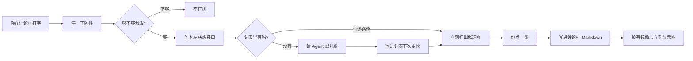
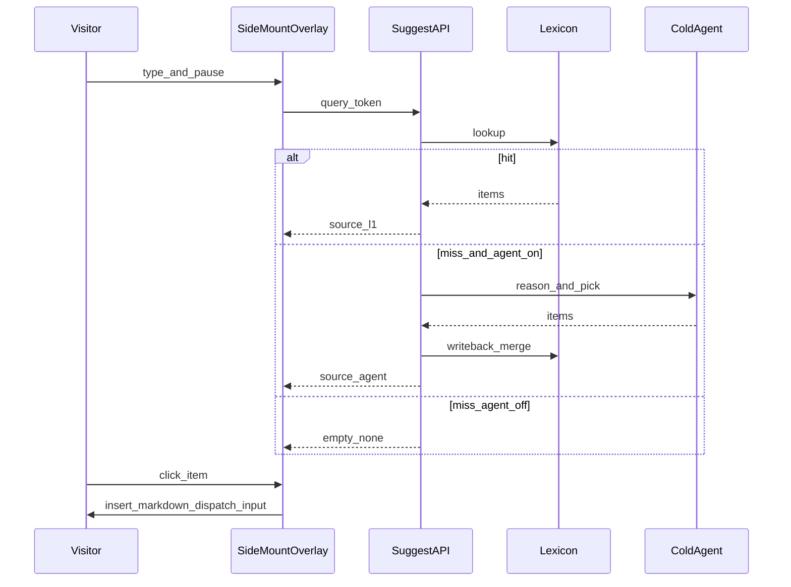

# 评论区边打字边推梗图 · 架构方案

> Status: implemented but disabled by default（仅适用于 Dynamic 的 Waline 回复；文章评论已改用 Giscus）
> Date: 2026-08-04  
> 约束：不 fork Waline、旁挂优先；评论双通道现状见 ADR-0006
> 调研索引：`research-index.md`  
> PRD：`docs/outputs/prd/comment-sticker-suggest/prd.md`

## 一句话目标

访客在 Waline 评论框打中文热梗时，**缓存秒匹配**出表情包/梗图候选；未命中再走 **Agent 冷路径**写回缓存——体验像微信输入联想，但不碰 Waline 内核。

## 现状挂载点（已核实）

| 项 | 路径 / 事实 |
|---|---|
| 评论类型 | 文章默认 Giscus；`dynamic/comments.astro` 显式 `service="waline"` |
| 挂载入口 | `Firefly\src\components\comment\index.astro` → Dynamic 路由覆盖 `Waline.astro` |
| 客户端 | npm `@waline/client`，组件接近视口后动态加载 |
| 旁挂已验证 | `Waline.astro`：`textarea.wl-editor` 视觉镜像、折叠编辑器、`MutationObserver` |
| 大图上传 | `Firefly\src\pages\api\comment-image.ts` → 腾讯云 COS（`prerender=false`） |
| 表情预设 | qq / weibo / bilibili / bmoji（`@waline/emojis@1.4.0`） |
| 默认 GIF 搜索 | Waline 内置 Giphy（工具栏「搜索面板」） |
| ADR | `Firefly\docs\adr\0006-giscus-with-waline-dynamic-channel.md`（取代 ADR-0001） |

**关键结论**：Waline 的 `search` 钩子只服务「打开 GIF 搜索面板后的查询」，**不是**编辑器 type-ahead。官方 Cookbook 亦如此。不可把产品目标塞进该钩子。

---

## 方案对比（侵入性）

| 维度 | A. 增强 Waline `search` | B. 旁挂 type-ahead 浮层（推荐） | C. 独立 Svelte 5 island |
|---|---|---|---|
| 产品契合 | 差（需先点搜索按钮） | 好（边打字边出） | 好 |
| 与现有旁挂 | 无关 / 易打架 | **同构**：再挂一层 input 监听 | 跨岛找 DOM，多一层时序 |
| 改 `Waline.astro` | 中（改 `init` 的 `search`） | **极小**（多一次 `attach*`） | 小～中（astro 插 island） |
| 依赖面 | 绑死 Waline search UI | 只读 `textarea.wl-editor` | Svelte 运行时 + hydration |
| 回滚 | 撤 search 自定义 | **关配置开关即静默** | 关开关 + 去掉 island |
| 风险 | 误解 UX；与 Giphy 面板抢职责 | z-index / 折叠编辑器需对齐 | 过度工程；island 与 CDN init 竞态 |
| 侵入分（低更好） | 6/10 | **2/10** | 5/10 |

### 推荐：B · 旁挂 type-ahead 浮层

**为何最不侵入**

1. 本站已验证「CDN Waline + 父页旁挂 `wl-editor`」可行（视觉层即先例）。
2. 不替换 `search` / emoji / Giphy / `imageUploader`，三者继续各司其职。
3. 插入结果用 Markdown ``，**现有视觉镜像自动吃掉**，无需改镜像逻辑。
4. 业务逻辑进独立模块 + `prerender=false` API；Waline.astro 只多一行挂载。
5. 配置开关默认关 → 零行为变化；出问题一键回滚。

**不选 A**：产品是 type-ahead，不是「打开搜索面板再搜」。  
**不选 C（MVP）**：DOM 旁挂问题不需要 Svelte 状态机；P2 若 UI 变复杂可再抽 island，接口保持不变。

---

## 最终推荐架构

### 组件拆分

```text
Waline.astro（壳，极少改动）
  └── init(@waline/client)          # 现状不变
  ├── attachEditorVisual(...)       # 现状：短码/图视觉镜像
  ├── attachCollapsibleEditor(...)  # 现状：折叠
  └── attachStickerSuggest(...)     # 新增：旁挂 type-ahead（可抽文件）

独立模块（建议）
  sticker-suggest/
    attach.ts          # MutationObserver 等到 wl-editor → 绑定 input
    extract-query.ts   # 从光标前截取中文触发词（热梗 token）
    overlay.ts         # 浮层 DOM：候选缩略图 / 加载 / 空态 / 键盘
    insert.ts          # 在 selection 处写入 Markdown，dispatch input
    client-cache.ts    # 会话级 Map（同词不重复打 API）

服务端
  pages/api/comment-sticker-suggest.ts   # 热/冷统一入口（prerender=false）
  lib/sticker-suggest/
    normalize.ts       # 简繁/空白/同义归一
    l1-lexicon.ts      # 关键词 / 别名 → 条目
    l3-agent.ts        # 仅缓存未命中时调用（P1）
    writeback.ts       # Agent 结果写入运行时词表（P1）
    url-allowlist.ts   # src/preview 白名单校验
```

### 文件落点（建议，实施时再建）

| 职责 | 建议路径 |
|---|---|
| 配置开关 | `Firefly\src\config\commentConfig.ts` + `Firefly\src\types\commentConfig.ts` |
| 挂载一行 | `Firefly\src\components\comment\Waline.astro`（`attachStickerSuggest`） |
| 客户端模块 | `Firefly\src\components\comment\sticker-suggest\*.ts` |
| 浮层样式 | 同模块旁 `sticker-suggest.css`，挂到 `.waline-shell` 下，勿污染全局 |
| Suggest API | `Firefly\src\pages\api\comment-sticker-suggest.ts` |
| 服务端库 | `Firefly\src\lib\sticker-suggest\` |
| L1 词表（仓内策展） | `Firefly\src\data\sticker-lexicon\zh-meme.json` |
| 梗图 | 复用 COS 公共读；条目存 `src`/`preview` URL，不塞 Base64 |
| 方案本文 | `Firefly\docs\idea\comment-sticker-suggest\architecture.md` |
| 调研索引 | `Firefly\docs\idea\comment-sticker-suggest\research-index.md` |
| PRD | `Firefly\docs\outputs\prd\comment-sticker-suggest\prd.md` |

### 数据流（白话）



### 缓存分层

| 层 | 位置 | 延迟目标 | 内容 | 分期 |
|---|---|---|---|---|
| L0 会话 | 浏览器 `Map` | &lt;10ms | 同会话同 query 复用 | P0 |
| L1 词表 | 仓内 JSON + 进程内存 | &lt;100ms | 中文热梗别名 → 固定条目 | P0 |
| L1′ 运行时合并 | 进程内 Map（P1 写回） | &lt;100ms | Agent 成功条目合并视图 | P1 |
| L2 向量 | 嵌入索引 | &lt;300ms | 近义梗、错别字 | P2 |
| L3 Agent | 服务端调用模型 | 可接受 1～3s | 未命中生成候选 + 写回 L1′ | P1 |

**原则**：访客默认只打热路径；Agent **从不在浏览器直连**（密钥只在 API）。

---

## API 契约

与 [`comment-image.ts`](../../src/pages/api/comment-image.ts) 并列：独立路由、独立限流计数器、`export const prerender = false`。

### 请求

推荐 **GET**（便于 CDN/缓存调试；无敏感 body）：

```http
GET /api/comment-sticker-suggest/?q={urlencoded_token}&path={optional_page_path}
```

或 **POST**（与上传风格一致时）：

```json
{ "q": "好耶", "path": "/posts/example/" }
```

| 字段 | 约束 |
|---|---|
| `q` | 必填；归一化后长度 1～32；超长截断或 400 |
| `path` | 可选；仅日志/限流维度，不参与匹配逻辑 |

### 成功响应（HTTP 200）

```ts
type SuggestItem = {
  id: string;
  title: string;
  src: string;       // 插入用完整 URL
  preview?: string;  // 浮层缩略图，缺省用 src
};

type SuggestResponse = {
  source: "l1" | "agent" | "none";
  items: SuggestItem[];
  latencyMs?: number;
};
```

| `source` | 含义 |
|---|---|
| `l1` | 仓内词表或运行时合并词表命中 |
| `agent` | L3 冷路径返回（P1；且 `agentEnabled`） |
| `none` | 未命中；`items` 为空数组（**仍 200**，避免前端当错误刷屏） |

### 错误与限流

| 状态 | 何时 |
|---|---|
| 200 + `source:"none"` | 无匹配；或 Agent 关闭且 L1 未命中 |
| 400 | `q` 缺失/非法 |
| 429 | IP / 全站窗口超限（对齐 comment-image：如 10 分钟 N 次，独立计数） |
| 503 | Agent 已开但未配置密钥 / 上游不可用（P1；可降级为 `none` 以免打断打字） |

**P0**：实现仅 L1；`agentEnabled` 忽略或强制视为 false；从未返回 `source:"agent"`。

---

## 词表 schema（L1）

文件：`src/data/sticker-lexicon/zh-meme.json`

```json
{
  "version": 1,
  "updatedAt": "2026-08-04",
  "entries": [
    {
      "id": "hao-ye",
      "keywords": ["好耶", "好耶！"],
      "title": "好耶",
      "src": "https://example-cos.example/stickers/hao-ye.webp",
      "preview": "https://example-cos.example/stickers/hao-ye-sm.webp",
      "license": "self",
      "enabled": true
    }
  ]
}
```

| 字段 | 规则 |
|---|---|
| `id` | 稳定 slug；写回与审计主键 |
| `keywords` | 匹配用；服务端 `normalize` 后精确/前缀策略由 `l1-lexicon` 定（P0：归一化后精确或后缀 token 全等） |
| `src` / `preview` | `https:`；须过白名单（本站 COS 域名或配置允许列表） |
| `license` | `self` \| `curated`；禁止无来源上库 |
| `enabled` | `false` 则不可召回 |

P0 验收：≥30 条 `enabled: true` 中文热梗（人工策展）。

---

## 时序（P0 / P1）



---

## P1 写回边界（避免 SSG 仓写盘幻想）

| 资产 | 谁写 | 持久化 |
|---|---|---|
| 仓内 `zh-meme.json` | **仅园主 / PR 策展** | Git；部署随构建加载 |
| 运行时 L1′ | Agent 成功后 `writeback.merge` | **默认：进程内 Map**；同实例二次请求可热命中 |
| 可选持久化占位 | 未接则跳过 | 预留接口：Vercel KV / 外部 DB；**首期不强制** |
| 审计 | `console` / 结构化日志 | 记录 `q`、`id`、`src`、是否写回；不含密钥 |

**禁止**：在 Vercel Serverless 上假设可写仓库文件并跨冷启动永久保存。  
**「越喂越快」P1 语义**：同部署实例内越用越热；跨实例靠园主把优质条目 PR 进 JSON。P2 再上共享 KV。

Agent 输出校验（写回前）：

1. JSON schema 校验（`id`/`title`/`src`/`keywords`）。  
2. `src`/`preview` 白名单。  
3. 拒绝 HTML / `javascript:` / 相对钓鱼路径。  
4. 校验失败：本次可不返回或仅返回已通过项；**不写回**。

---

## Agent 冷路径约定（P1 · DeepSeek 官网直连）

1. 触发：L1（含 L1′）未命中，且 `agentEnabled: true`，且已配置 `DEEPSEEK_API_KEY`。  
2. 接入（官方文档 https://api-docs.deepseek.com）：  
   - OpenAI 兼容 `base_url`：`https://api.deepseek.com`  
   - `POST /chat/completions`  
   - 模型默认：`deepseek-v4-flash`（可用 `DEEPSEEK_MODEL` 覆盖为 `deepseek-v4-pro`）  
   - `thinking: { type: "disabled" }`（联想不需要长推理）  
   - `response_format: { type: "json_object" }`（JSON Output）  
3. 输入：归一化 `q` + 策展目录（仅 id/title/keywords）。  
4. 输出：`{"ids":["hao-ye",...]}`；服务端映射为词表条目；禁止模型发明 URL。  
5. 写回：进程内 L1′（`writeback.merge`）。  
6. 限流 / 硬超时 ~2.8s；失败降级 `source:"none"`。

---

## 与现有视觉层共存

| 现有能力 | 共存方式 |
|---|---|
| 视觉镜像 | 插入 `` 后 `dispatchEvent(input)` → 镜像已有逻辑刷新 |
| 折叠编辑器 | 仅在 `waline-editor-expanded` 或 editor focus 时显示浮层 |
| emoji 弹层 / Giphy 面板 | 浮层 `z-index` 低于 Waline popup；打开官方面板时隐藏联想 |
| `imageUploader` / COS | 联想图用已托管 URL；不走 Base64；大图仍走原上传 |
| 提交清空 | 听现有 `waline-editor-reset` 关闭浮层 |
| 挂载失败 | 静默；不抛错阻断评论 |

插入意图（非实施代码）：

```ts
// 在光标处写入 Markdown，触发 Waline 与视觉层同步
function insertMarkdown(editor: HTMLTextAreaElement, md: string) {
  const start = editor.selectionStart;
  const end = editor.selectionEnd;
  const v = editor.value;
  editor.value = v.slice(0, start) + md + v.slice(end);
  const pos = start + md.length;
  editor.setSelectionRange(pos, pos);
  editor.dispatchEvent(new Event("input", { bubbles: true }));
}
```

### 触发与防抖

| 参数 | 建议默认 |
|---|---|
| `debounceMs` | 300 |
| `minChars` | 2 |
| `maxResults` | 6 |
| token 提取 | 光标前连续中文/字母数字片段；忽略整段长文中段 |

---

## 安全清单

| 项 | 要求 |
|---|---|
| 密钥 | `STICKER_AGENT_*` 仅服务端；禁止 `PUBLIC_` |
| URL | 白名单域名；拒绝 `data:` 大图与脚本协议 |
| XSS | 浮层用 `textContent` / 受控 `img.src`；不把用户输入拼进 HTML |
| 插入 | 只插转义后的 Markdown 图片语法；`alt` 取自 `title` 净化 |
| 滥用 | 独立于 `comment-image` 的 IP 限流；Agent 额外更严配额 |
| 隐私 | 远程 Agent 只发归一化短 `q`，不发整篇评论 |
| 版权 | `license` 字段；人工策展优先；不适内容可 `enabled:false` |

---

## 反侵入清单（明确不改什么）

| 禁止 | 原因 |
|---|---|
| 改 `commentConfig.type` / 换 Twikoo·Giscus·Artalk | ADR-0001 |
| fork / patch `@waline/client` 源码 | 维护成本；CDN 策略 |
| 用本功能替换默认 Giphy `search` | 职责不同；并存 |
| 改 Waline 服务端（Vercel/Neon）schema | 与联想无关 |
| 重写视觉镜像 / 折叠编辑器 | 已稳定；只消费其事件 |
| 接入 Tenor | API 已死（见 research-index） |
| 浏览器直调 Agent / 暴露密钥 | 安全 |
| 为 MVP 强上 Svelte island / 向量库 | 过度工程 |
| 把词表塞进 `comment-image` API | 上传与联想解耦 |
| Serverless 写 Git 仓库当写回 | 不可靠 |

---

## 配置开关建议

扩展 `commentConfig.waline`（类型同步 `commentConfig.ts`）：

```ts
stickerSuggest?: {
  /** 总开关；默认 false，未批准 PRD / 未上线前保持关 */
  enabled: boolean;
  /** 防抖 ms，建议 280～400 */
  debounceMs?: number;
  /** 最少触发字数，建议 2 */
  minChars?: number;
  /** 最多展示条数，建议 6 */
  maxResults?: number;
  /** 未命中是否走 Agent；P0 必须 false */
  agentEnabled?: boolean;
  /** API 路径，默认 /api/comment-sticker-suggest/ */
  endpoint?: string;
};
```

环境变量（仅服务端，不入库明文）：

| 变量 | 用途 | 分期 |
|---|---|---|
| `DEEPSEEK_API_KEY`（或 `STICKER_AGENT_API_KEY`） | DeepSeek 官网 API Key | P1 |
| `DEEPSEEK_API_BASE` | 默认 `https://api.deepseek.com` | P1 |
| `DEEPSEEK_MODEL` | 默认 `deepseek-v4-flash`（`thinking.type=disabled`） | P1 |
| 现有 `COS_*` | 梗图托管 | P0 策展可用 |

回滚：`enabled: false` → 不挂监听、不请求 API；`agentEnabled: false` → 只关冷路径。

---

## MVP 分期与验收

### P0 · 热路径可用（可独立上线）

| 项 | 验收 |
|---|---|
| 开关默认关 | 关时评论行为与现网一致 |
| 旁挂监听 `wl-editor` | 展开编辑器打词表词 → 浮层出候选 |
| L1 词表 | ≥30 条中文热梗（人工）；命中 &lt;200ms（本机/预览） |
| 点击插入 | 写入 Markdown；视觉镜像显示图；提交后 Waline 正常出图 |
| 与 Giphy/emoji | 工具栏原能力仍可用 |
| 空态 | 无结果不报错刷屏；`source:"none"` |
| 质量门 | `pnpm check` · `pnpm type-check` |

### P1 · Agent 冷路径 + 写回

| 项 | 验收 |
|---|---|
| 未命中 | 「想一下…」后给出候选或礼貌空态 |
| 写回 | 同实例二次同词走热路径（L1′） |
| 成本闸 | IP/全站限流；可只关 Agent |
| 安全 | URL 白名单；失败不污染词表 |

### P2 · 增强（可选）

| 项 | 验收 |
|---|---|
| L2 近义 | 「绝绝子」≈「yyds」类召回 |
| 共享持久化 | KV/DB 跨实例写回 |
| 运营喂养 UI | 可先继续 JSON + PR |
| 抽 Svelte island | 仅当浮层交互显著变复杂 |
| 与官方 emoji 短码互通 | 词条可指向 `:bilibili_xxx:` |

---

## 风险与缓解

| 风险 | 级别 | 缓解 |
|---|---|---|
| Agent 费用 / 滥用 | 高 | 默认 `agentEnabled: false`；限流；白名单图源 |
| 浮层挡住折叠/emoji 弹层 | 中 | z-index；官方 popup 打开时隐藏 |
| 误触发 | 中 | 防抖 + minChars + 仅光标前 token |
| 词表版权 / 不适梗图 | 中 | 人工策展；`enabled`；可删条目 |
| 进程写回冷启动丢失 | 中（P1） | 文档预期明确；优质条目 PR 进 JSON；P2 KV |
| SSG 与 API | 低 | 复用 `comment-image` 的 `prerender=false` |
| Waline CDN 升级改 class | 低 | 选择器集中；挂不上静默失败 |

---

## 实施前门禁

1. idea + 调研索引 + 本架构契约（已具备）。  
2. PRD draft → **园主批准** 后方可大规模编码（`docs/agents/workflow.md`）。  
3. 实施顺序：类型+开关 → API L1 → 旁挂 UI →（P1）Agent + writeback。

## 关联

- 调研索引：`docs/idea/comment-sticker-suggest/research-index.md`
- PRD：`docs/outputs/prd/comment-sticker-suggest/prd.md`
- ADR-0001：`docs/adr/0001-waline-over-giscus.md`
- 旁挂先例：`src/components/comment/Waline.astro`
- 上传先例：`src/pages/api/comment-image.ts`
