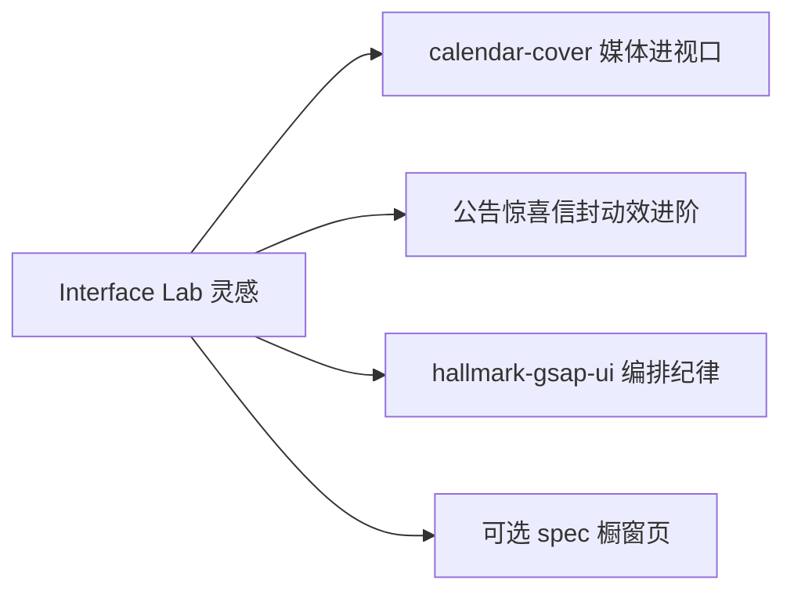

# Interface Lab · 提炼对照

> 源：工作区 `temp/interface-lab/`（clone of ggkim0614/interface-lab）  
> 日期：2026-08-04 · **只记灵感，不写实现**

## 源结构速览

| 角色 | 相对路径（相对 `temp/interface-lab/`） |
|---|---|
| 橱窗注册表 | `src/app/page.tsx` → `components` 数组 |
| Masonry 栅格 | `src/components/templates/masonry.tsx` |
| 缩略图 + 懒播 + Drawer | `src/components/templates/thumbnail.tsx` |
| 折纸邮件（拖拽展开） | `src/components/prototypes/folded-email.tsx` |
| 三折纸 + SVG 描边 | `src/components/prototypes/tri-folded-paper.tsx` |
| Desktop-only 硬墙 | `src/app/DesktopOnlyWrapper.tsx`（layout 全局包裹） |
| 原型试玩框 | `src/components/templates/production.tsx` |

其它原型（钱包卡、堆叠卡、贴纸、下拉刷新、动态搜索、开关等）可作二次灵感，本篇优先园主点名的四块。

---

## 可移植点总表

| 可移植点 | 源路径（相对 `temp/interface-lab/`） | Firefly 可能落点 | 风险 |
|---|---|---|---|
| 进视口才 `play`、离屏 `pause`；`preload="none"` + poster | `src/components/templates/thumbnail.tsx` | 侧栏日历封面 GIF/视频、画廊预览、动态媒体 | 多实例仍占解码器；需 `muted`+`playsInline`；与现有 `loading="lazy"` / LQIP 策略协调 |
| 拖拽 Y → 多段 transform（位移/缩放/亮度）模拟折纸展开 | `folded-email.tsx` · `tri-folded-paper.tsx` | 公告 `.gift-surprise` 开盖后信封进阶；或 `spec` 玩具页 | Framer API ≠ GSAP；弹簧/skew 易「炫技」违 Hallmark；触控与侧栏滚动手势冲突 |
| 单一注册表驱动橱窗（title / 媒体 / 组件 / stack） | `src/app/page.tsx` + `masonry.tsx` | 可选实验橱窗页（配置数组 + Astro/Svelte 渲染） | 易膨胀成第二产品；勿塞进主布局内核 |
| 缩略图点击 → Drawer 再挂完整交互 | `thumbnail.tsx`（vaul Drawer） | 特殊页「试玩」壳；勿全站抽屉化 | 无障碍焦点陷阱、移动端高度、与现有 modal 规范一致性 |
| 预览用短循环 MP4，真交互按需挂载 | `public/static/videos/*.mp4` + 上列 Thumbnail | 重交互 demo 的预览层 | 静态资源体积；需压缩与 CDN/缓存策略 |
| （反模式）`<1024px` 整页拦截 | `DesktopOnlyWrapper.tsx` | **不要落到 Firefly** | 伤害移动读者与 SEO；实验室可接受，博客不可 |

---

## 重点拆解

### 1. 视频懒播

机制（源注释即意图）：

1. `thumbnailSrc` 以 `.mp4` 判定视频，否则走静态图  
2. `poster` = 同路径 `.jpg`  
3. `IntersectionObserver`（`threshold: 0.25`）：相交 `play()`，离开 `pause()`  
4. `preload="none"`：未进视口不拉流  

对 Firefly 的翻译（灵感级）：

- 封面/预览媒体默认「进视口才动」  
- 离开视口停播，避免侧栏+主栏多路同时解码  
- 与 `calendar-cover` 轮询池可叠加：池切换时仍遵守进视口策略  

### 2. 折纸 / 信封 Motion

共性模式：

| 手法 | 作用 |
|---|---|
| `yDrag` MotionValue | 拖拽行程单一真相 |
| 分段 `useTransform` | 上/中/下折面不同延迟与缩放 |
| brightness filter | 折缝内侧变暗，增强「纸层」 |
| variants：collapsed / open / dragged | 圆角、轻旋转、阴影状态机 |
| TriFold 额外：SVG `pathLength` + skew | 展开时描边显现 |

与现站惊喜信封：

| 现站（已有） | Lab 可借鉴 |
|---|---|
| 3D 礼盒自转 → 悬停经典盒晃动 → 点击开盖 → 信封淡入（`.gift-surprise`） | 开盖后「纸面分段展开」或拖拽展开正文 |
| 配置：`announcementConfig.loveLetter` + version 胶囊 | 勿为炫技改配置模型；动效进阶另开 PRD |
| Hallmark 克制 | 若做拖拽折纸，建议标成彩蛋豁免，并限时长桶 |

**映射提醒**：Lab 用 Framer Motion；本站优先 **GSAP（Svelte 岛）或 CSS**，见 `docs/idea/hallmark-gsap-ui/`。

### 3. 橱窗注册表

`page.tsx` 中 `components[]` 每项：`title` · `description` · `thumbnailSrc` · `component` · `stack` → `Masonry` → `Thumbnail`。

可借鉴纪律：

- **数据与壳分离**：加 demo = 加一行注册，不改栅格壳  
- **预览与实现分离**：首页只播媒体，真组件进 Drawer  
- **标签诚实**：stack 芯片仅作说明，不假装技术选型承诺  

Firefly 若做实验橱窗：更自然的是 `src/config` 驱动的条目列表 + Astro 页，而非 React 子树数组。

### 4. Desktop-only 反模式

```text
window.innerWidth < 1024  → 整站「DESKTOP VIEW ONLY」
```

| 为何 Lab 能做 | 为何博客不能 |
|---|---|
| 明确「原型庇护所」、指针/拖拽 demo | 读者大量移动端；侧栏/文章必须可读 |
| 降低多端适配成本 | SEO / 分享卡片预览也可能是窄视口 |

**结论**：可记「复杂拖拽原型可提示最佳体验宽度」；**禁止**全局硬墙。移动端应降级为静态预览或简化手势。

---

## 与其它 idea 主题的关系



| 主题 | 关系 |
|---|---|
| `calendar-cover` | 懒播 / 离屏暂停可共用策略 |
| `hallmark-gsap-ui` | 折纸若落地，时长桶与属性白名单走此纪律 |
| `zhuzhiliao-toy` | 同属「角落彩蛋」气质；交互域不同（物理玩具 vs 纸感 UI） |

---

## 其它原型（次优先，一行备忘）

| 原型 | 源文件 | 一句话灵感 |
|---|---|---|
| Stacked Cards | `stacked-card-2.tsx` | 悬停扇出；卡片墙慎用（Hallmark 禁每卡 lift） |
| Wallet | `wallet.tsx` | 点击首卡展开层叠 |
| Sticker | `sticker.tsx` | 拖放贴纸；注意与桌宠拖拽冲突 |
| Pull To Reload | `drag-to-reload.tsx` | 下拉加载隐喻；博客列表未必需要 |
| Search Input | `search-input.tsx` | CMD+K 动态搜索壳；本站已有搜索岛，勿重复造轮子 |
| Animated Switch | `animated-switch.tsx` | 开关微交互 → 优先 CSS |

---

## 扫库附注（同批 `temp/`）

| 路径 | 处理 |
|---|---|
| `temp/interface-lab/` | 本 theme |
| `temp/zhuzhiliao/` | 见 `docs/idea/zhuzhiliao-toy/` |
| `temp/openpet-ai-girls*` · `temp/maid-deepseek-whale*` · zip | **跳过**；见索引「待合并：Pet 素材」 |
| `temp/_cdn_probe` · `_page.html` · `_probe.bin` | 探针/临时文件，无主题价值 |
