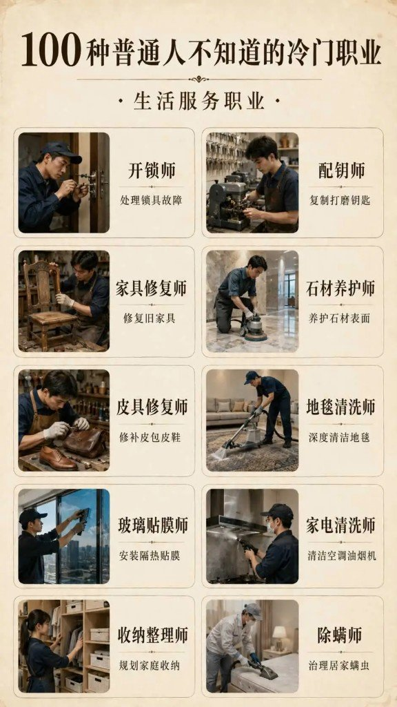
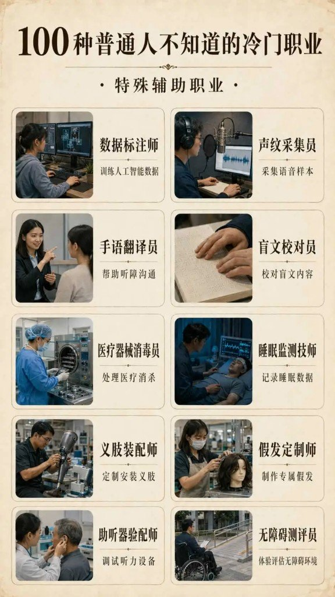
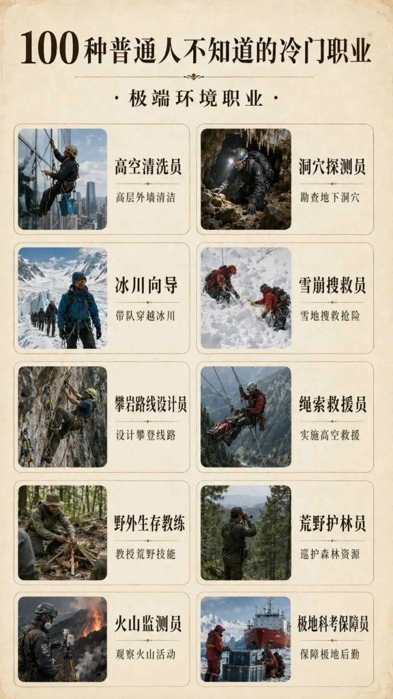
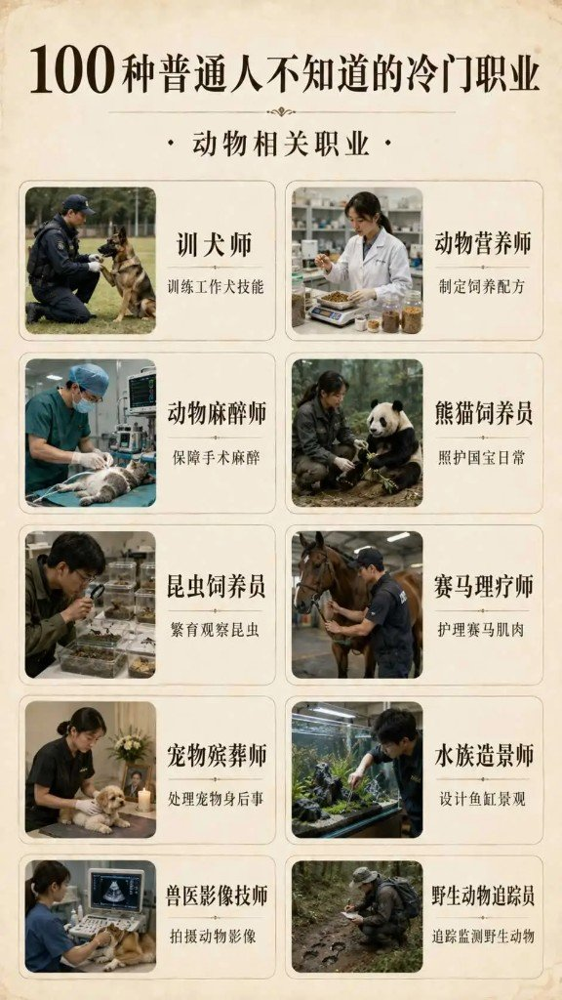
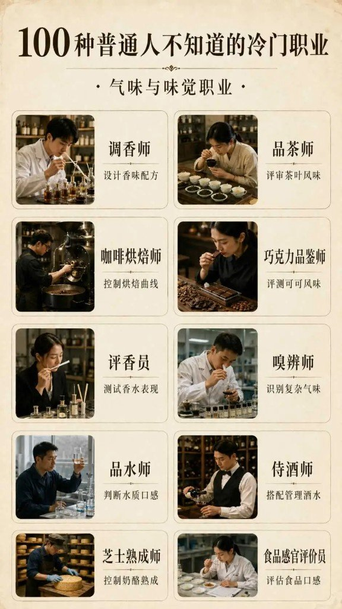
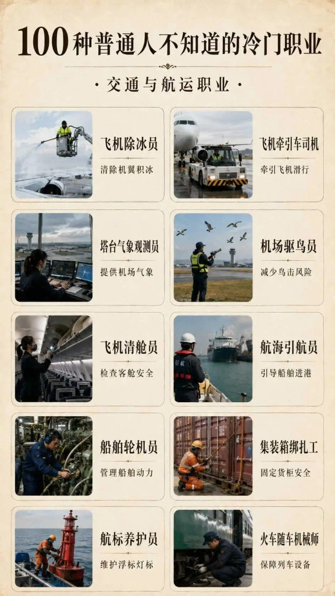
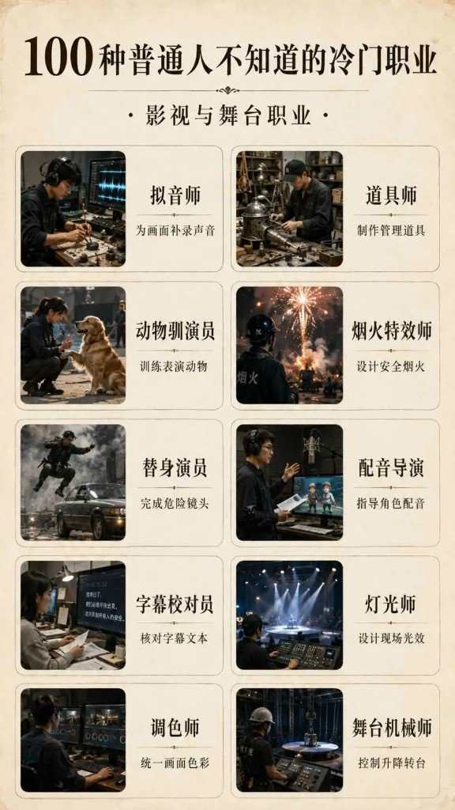
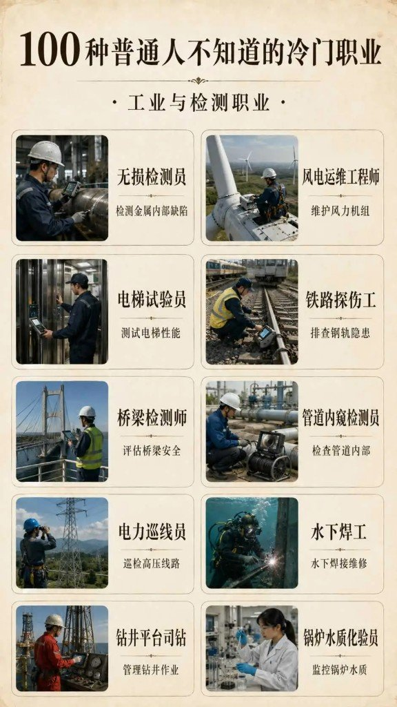
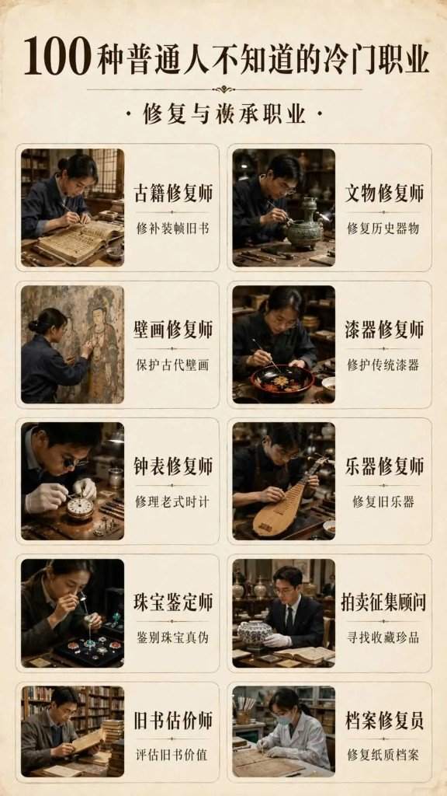
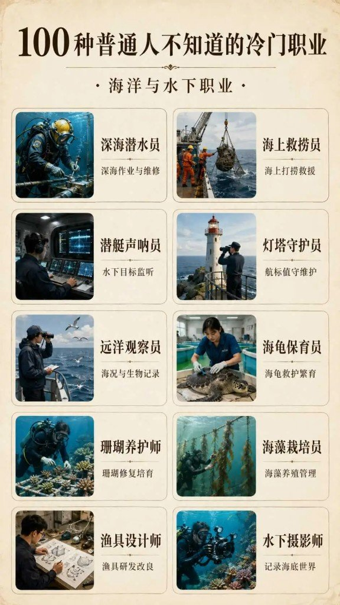

有些岗位你「听说过名字」，但从来不会想到有人靠它吃饭；另一些则是完全没听过。社区长图文按十类各列十个，凑成一百种——图面总标题用「不知道」，用户粘贴标题写成「不会想到」，意思差不多，正文以图面为准。[^source]

导语原意保留：不少职业大家知道，但一般想不到自己要从事；还有一些，则完全没听说过。

---

## 生活服务职业

| 职业 | 一句话 |
|---|---|
| 开锁师 | 处理锁具故障 |
| 配钥师 | 复制打磨钥匙 |
| 家具修复师 | 修复旧家具 |
| 石材养护师 | 养护石材表面 |
| 皮具修复师 | 修补皮包皮鞋 |
| 地毯清洗师 | 深度清洁地毯 |
| 玻璃贴膜师 | 安装隔热贴膜 |
| 家电清洗师 | 清洁空调油烟机 |
| 收纳整理师 | 规划家庭收纳 |
| 除螨师 | 治理居家螨虫 |

---

## 特殊辅助职业

| 职业 | 一句话 |
|---|---|
| 数据标注师 | 训练人工智能数据 |
| 声纹采集员 | 采集语音样本 |
| 手语翻译员 | 帮助听障沟通 |
| 盲文校对员 | 校对盲文内容 |
| 医疗器械消毒员 | 处理医疗消杀 |
| 睡眠监测技师 | 记录睡眠数据 |
| 义肢装配师 | 定制安装义肢 |
| 假发定制师 | 制作专属假发 |
| 助听器验配师 | 调试听力设备 |
| 无障碍测评员 | 体验评估无障碍环境 |

---

## 极端环境职业

| 职业 | 一句话 |
|---|---|
| 高空清洗员 | 高层外墙清洁 |
| 冰川向导 | 带队穿越冰川 |
| 攀岩路线设计员 | 设计攀登路线 |
| 野外生存教练 | 教授荒野技能 |
| 火山监测员 | 观察火山活动 |
| 洞穴探测员 | 勘查地下洞穴 |
| 雪崩搜救员 | 雪地搜救抢险 |
| 绳索救援员 | 实施高空救援 |
| 荒野护林员 | 巡护森林资源 |
| 极地科考保障员 | 保障极地后勤 |

---

## 动物相关职业

| 职业 | 一句话 |
|---|---|
| 训犬师 | 训练工作犬技能 |
| 动物麻醉师 | 保障手术麻醉 |
| 昆虫饲养员 | 繁育观察昆虫 |
| 宠物殡葬师 | 处理宠物身后事 |
| 兽医影像技师 | 拍摄动物影像 |
| 动物营养师 | 制定饲养配方 |
| 熊猫饲养员 | 照护国宝日常 |
| 赛马理疗师 | 护理赛马肌肉 |
| 水族造景师 | 设计鱼缸景观 |
| 野生动物追踪员 | 追踪监测野生动物 |

---

## 气味与味觉职业

| 职业 | 一句话 |
|---|---|
| 调香师 | 设计香味配方 |
| 品茶师 | 评审茶叶风味 |
| 咖啡烘焙师 | 控制烘焙曲线 |
| 巧克力品鉴师 | 评测可可风味 |
| 评香员 | 测试香水表现 |
| 嗅辨师 | 识别复杂气味 |
| 品水师 | 判断水质口感 |
| 侍酒师 | 搭配管理酒水 |
| 芝士熟成师 | 控制奶酪熟成 |
| 食品感官评价员 | 评估食品口感 |

---

## 交通与航运职业

| 职业 | 一句话 |
|---|---|
| 飞机除冰员 | 清除机翼积冰 |
| 飞机牵引车司机 | 牵引飞机滑行 |
| 塔台气象观测员 | 提供机场气象 |
| 机场驱鸟员 | 减少鸟击风险 |
| 飞机清舱员 | 检查客舱安全 |
| 航海引航员 | 引导船舶进港 |
| 船舶轮机员 | 管理船舶动力 |
| 集装箱绑扎工 | 固定货柜安全 |
| 航标养护员 | 维护浮标灯标 |
| 火车随车机械师 | 保障列车设备 |

---

## 影视与舞台职业

| 职业 | 一句话 |
|---|---|
| 拟音师 | 为画面补录声音 |
| 道具师 | 制作管理道具 |
| 动物驯演员 | 训练表演动物 |
| 烟火特效师 | 设计安全烟火 |
| 替身演员 | 完成危险镜头 |
| 配音导演 | 指导角色配音 |
| 字幕校对员 | 核对字幕文本 |
| 灯光师 | 设计现场光效 |
| 调色师 | 统一画面色彩 |
| 舞台机械师 | 控制升降转台 |

---

## 工业与检测职业

| 职业 | 一句话 |
|---|---|
| 无损检测员 | 检测金属内部缺陷 |
| 电梯试验员 | 测试电梯性能 |
| 桥梁检测师 | 评估桥梁安全 |
| 电力巡线员 | 巡检高压线路 |
| 钻井平台司钻 | 管理钻井作业 |
| 风电运维工程师 | 维护风力机组 |
| 铁路探伤工 | 排查钢轨隐患 |
| 管道内窥检测员 | 检查管道内部 |
| 水下焊工 | 水下焊接维修 |
| 锅炉水质化验员 | 监控锅炉水质 |

---

## 修复与传承职业

| 职业 | 一句话 |
|---|---|
| 古籍修复师 | 修补装帧旧书 |
| 壁画修复师 | 保护古代壁画 |
| 钟表修复师 | 修理老式时计 |
| 珠宝鉴定师 | 鉴别珠宝真伪 |
| 旧书估价师 | 评估旧书价值 |
| 文物修复师 | 修复历史器物 |
| 漆器修复师 | 修护传统漆器 |
| 乐器修复师 | 修复旧乐器 |
| 拍卖征集顾问 | 寻找收藏珍品 |
| 档案修复员 | 修复纸质档案 |

---

## 海洋与水下职业

| 职业 | 一句话 |
|---|---|
| 深海潜水员 | 深海作业与维修 |
| 海上救捞员 | 海上打捞救援 |
| 潜艇声呐员 | 水下目标监听 |
| 灯塔守护员 | 航标值守维护 |
| 远洋观察员 | 海况与生物记录 |
| 海龟保育员 | 海龟救护繁育 |
| 珊瑚养护师 | 珊瑚修复培育 |
| 海藻栽培员 | 海藻养殖管理 |
| 渔具设计师 | 渔具研发改良 |
| 水下摄影师 | 记录海底世界 |

---

## 「冷门」到底冷在哪

十类一百岗扫下来，多数不是玄学：开锁、配钥、灯光、文物修复，路人都能叫出名字。真正「冷」的，往往是——

- **路径冷**：知道有这行，但不知道怎么进、要什么证、招不招人
- **场景冷**：极地后勤、飞机除冰、集装箱绑扎——普通人日常碰不到
- **边界糊**：有人觉得除螨、收纳更像家政技能，未必算独立职业

纪录片能把文物修复师推成网红岗，不等于街道办门口挂着招聘牌。曝光和从业机会，经常是两回事。

旁链同日另一份图鉴体裁（题材无关，不硬并）：[报纸卷轴创意排版图鉴](/posts/newspaper-scroll-layout-gallery/)。

---

## 附录：评论区吵什么

择要，不展开辩论：

| 声音 | 要点 |
|---|---|
| Woody | 开锁 / 配钥 / 配音算「不知道」吗？ |
| 作者 | 一般人不会立志让孩子做这些 |
| 猛哥 | 标题与内容不太符 |
| 易群先 | 文物修复师不冷门（故宫纪录片） |
| 天命才子 | 可补「试睡师」；海藻栽培员招聘极窄 |
| 可以了 | 水库管理员、森林员 |
| 独步寒秋 | 有些只是家政技能，不是独立职业 |
| 其他补岗 | 阴阳师 / 风水、灯塔国内少见、法医、攀树师、品酒师、美术向等 |

---

[^source]: 原料为用户粘贴的社区图文 + 10 张分类整页截图；**缺原始 URL**，未编造链接。图面总标题「不知道」与用户标题「不会想到」并存，转录以图为准。职业中文名与一句话描述均按图面 OCR；十页各 10 条，合计 **100**。工业页图面为左右栏交错排版，正文表序按用户对照清单（左栏自上而下，再右栏），条目与图一致无漏。
