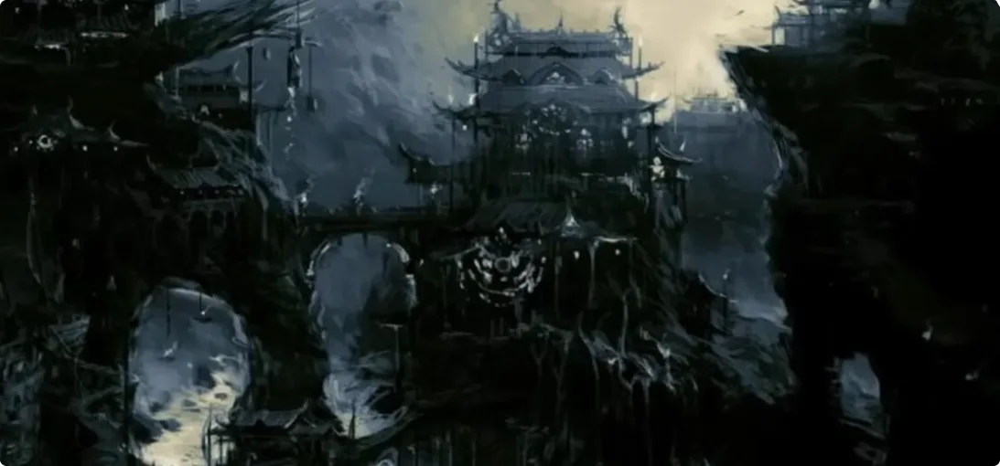
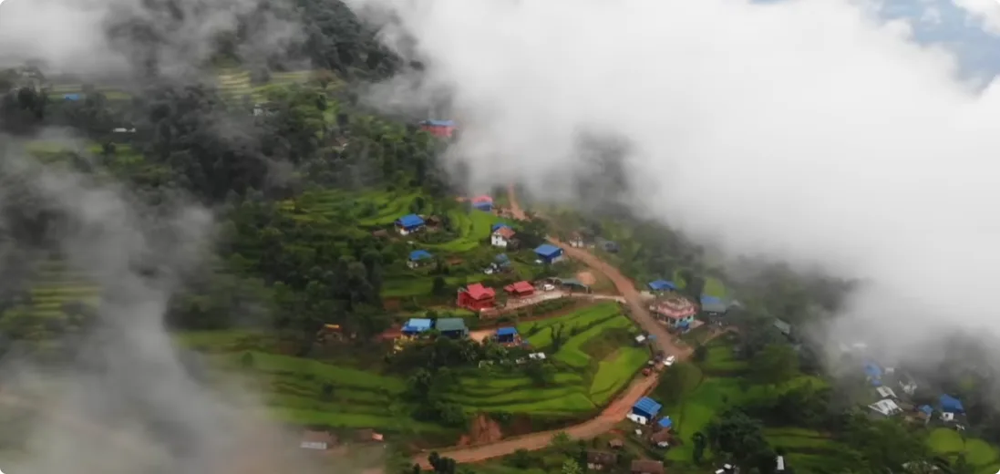
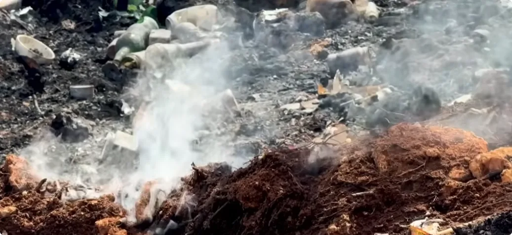
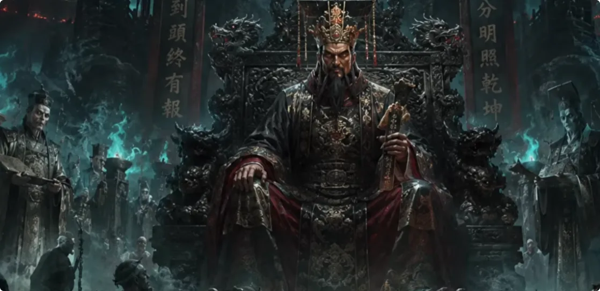
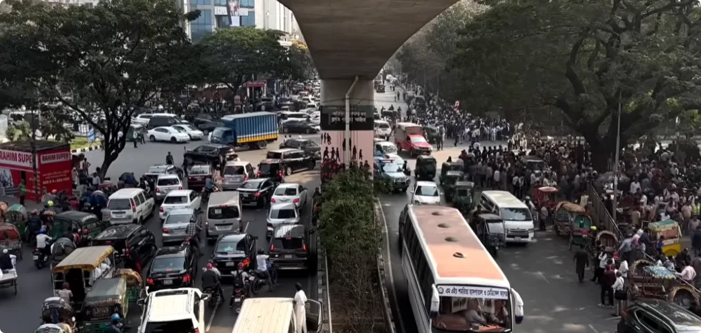
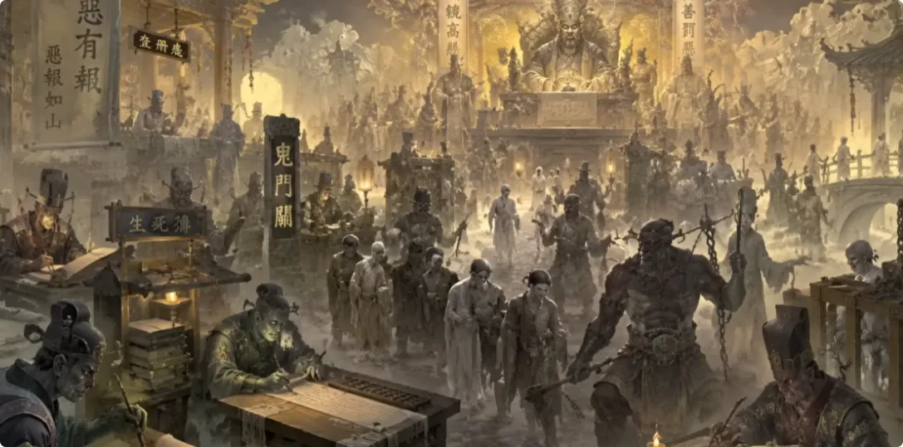
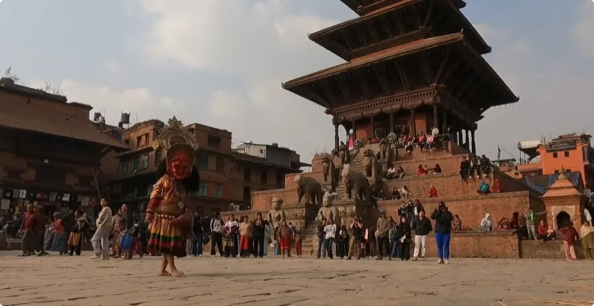
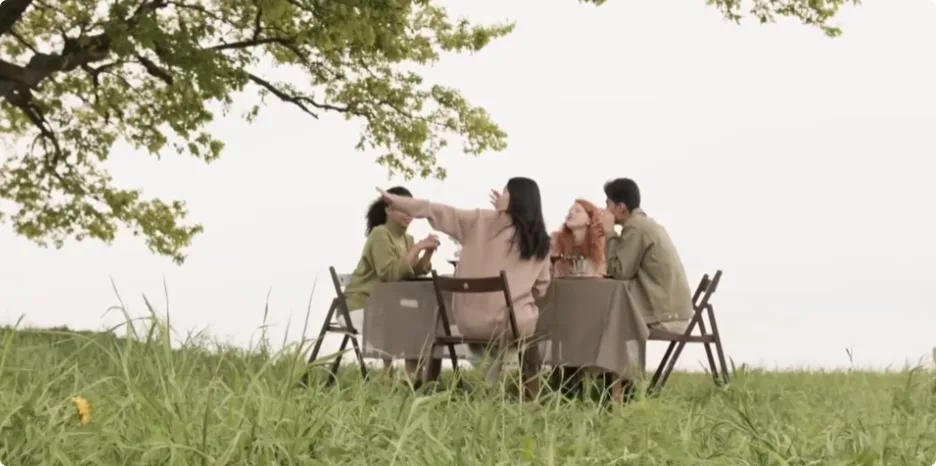

> **人死后究竟去了哪里？地府是什么？鬼是什么？因果又是如何完成清算的？**
> 
> _**真正要讲明白“死后的世界”，最后回答的其实不是人死后该去哪里，而是——人活着的时候应该怎么活。**_

## 1. 为什么不同文明，都在反复讲述“死后的世界”

人死后的世界长什么样呢？

几千年来，不同文明、不同民族、不同地域的人类，都在反复记录物质以外的世界，记录着天地之间的神明、祖先、灵魂、妖魔鬼怪。这些并不是某一个民族单独幻想出来的东西，而是人类在漫长历史中，对生死、灵魂和看不见的世界的一种共同感知。

不同文化、不同文明都有，而现代人因为对技术的傲慢和自信，很容易形成一种错觉：

> _**只有能被测量出来的东西才是真实的；凡是看不见、摸不着，或是仪器无法测量的，就一律叫迷信。**_

如果你也是这样的，那接下来的视频可能会粉碎你的三观。今天我们来聊聊：**地府到底是什么？它是干什么的？**要讲明白地府，我们首先得讲明白——**人和鬼。**

鬼是什么可怕的东西吗？其实并不是。

> **我们每个人都曾是鬼，也终将会变成鬼。**

### 当人只相信肉身，生命就容易失去神圣性

近现代教育里，很多人开始以唯物为骄傲。他们不再相信因果，不再相信天地有眼，也不再相信生命本身有神圣性。一旦陷入这种唯物的陷阱里，很多可怕的事情就会发生。

你会看到在计划生育的年代，为了控制人口数量，出现了“百日无孩”这样的运动。怀孕的妇女，无论是孕早期还是临近分娩的孕晚期，都会被强行送往医院进行引产；婴儿尤其是女婴，即使生下来了，也有可能被强行杀害。

这种事情放在整个人类文明史里，都是骇人听闻的。

为什么会这样？

因为一旦人只相信物质，就会慢慢地对生命失去敬畏。他会以为胎儿只是块肉，杀了就杀了，就结束了。

殊不知，足月之后，此时婴儿的肉身虽然被毁，但是灵魂依然存在。尤其越接近孕晚期，胎儿的肉身越完整，魂魄与肉身的连接越深，中断之后形成的冲击也越重，也越是可怜。
他已经带着某种因缘来到了这一具肉身里，但他不知道自己该去哪了。如果没有人引渡，只能本能地继续停留在原地，或是作为婴灵跟在父母的身边。

---

## 2. 人为什么感受不到灵魂：肉身只是魂来到人间的一件“衣服”

很多人还在怀疑，人到底有没有灵魂。
你看不见风，但人能感受到风吹过皮肤；你看不见空气，却仍知道自己需要呼吸。

气、魂魄、灵魂这些东西也是这样的。

它不是不存在，而是因为人心太乱、气太浊，所以感受不到。
很多人并不是没有灵性，而是灵性被过度的欲望、电子屏幕给盖住了。
如果一个人只相信肉身，他会把自己活得很低，以为吃喝玩乐就是人生，以为死了就一了百了，从而陷入一种享乐主义和及时行乐里。

但实际，人并不只是一具肉体，而是：

> **借着这具精妙的肉体，来到人间走一趟的魂。**

### 人身为什么被称为“修行容器”

人身是一个极其复杂、极其珍贵的修行容器，具**眼、耳、鼻、舌、身、意**，能看、能听、能闻、能尝、能触、能思考。

所以：
- 人能感受痛苦，从而生出慈悲；
- 人能造业，也能忏悔；
- 人能被欲望牵着走，也能在某一刻突然醒过来。

这就是人生珍贵的地方。
动物很多时候被本能牵引，鬼道众生很多时候被执念牵引
天人道享福太多，未必愿意修。

而人间最特殊的地方在于：

> _**人有苦，也有选择。**_
> 
> _**正因为有苦，所以人能醒；正因为有选择，所以人能修；正因为会犯错、会痛，所以人才有机会明白因果与慈悲。**_

**能成为人，本身就是很有福德的体现。**

也正因为如此，并不是每一个生灵都能投胎成人的，就如我们之前说的“**盲龟浮木**”的故事。

很多时候，各地的神话，无论是佛经、圣经，其中的神话大多不是假的。人体本身就是造物主的结晶，是造物主按照自己身体的样子造出来的。
每个细胞的运作，每次神经元的闪烁，其精妙程度都远远超过任何人类制造出来的机器。

---

## 3. 人生是法器，人间是道场：这一世的问题，就是这一世要修的课

> _**人生是法器，人间是道场。**_

各位这一世能得到人身，不只是为了吃喝玩乐、争夺名利的，而是带着过去的**因果、业力、功课和机会**来的。
此生的八字、家庭、身体、性格，或是遭遇、关系、磨难等等，这些东西很多都不是孤立的存在。

它们往往是过去的业力在这一世的显现，也是这一世要修的功课。
所以人不能顺从命运，不能顺从八字，而是要从八字命里看懂自己的课业：

> **你遇到什么问题，往往就说明你哪里需要修。**
> 
> **你这一生最难过的关，也许就是你这一世最该修的地方。**

人生之所以难得，不只是因为生命稀有，而是因为：

> **人能悟。**

而能悟，才有机会继续往上走。
这一生只是个阶段，真正延续的是你的**魂识、业力、德行、因果和修行层次**。

---

## 4. 死亡不是结束，而是“脱壳”：从亡魂到秩序，地府为什么会出现

所以理解地府之前，必须先理解这一点：

> **人死后，并不是什么都没有了。**

肉身结束之后，魂魄会进入另一个秩序。

肉身只是你在人间行走时所穿上的一件衣服，衣服坏了，不代表穿衣服的那个存在也消失了，只不过这件衣服比世间上所有的衣服都珍贵。

> _**死亡不是结束，死亡是脱壳。**_
> 
> _**肉体归还给尘土，气归还给天地，而魂魄则去了它该去的地方。**_

如果你明白了人有灵魂，人死后灵魂不会立刻消失，那按照逻辑推演：
1. 大量亡魂死后聚集在一起，会不会形成**关系**？
2. 有关系，就会不会出现**强弱**？
3. 有强弱，就会不会自然产生**秩序**？
4. 有秩序，就会不会出现**管理**？

所以它自然会有：
- 引渡；
- 安置；
- 审判；
- 清算；
- 转生。

这条逻辑其实非常简单，理解了之后，它并不玄幻。

人间为什么有法院？
>因为人和人之间会产生纠纷。

为什么有监狱？
>因为犯错的后果必须被承担。

为什么有档案？
>因为每个人的来历、经历都需要被记录。

那么：

> **灵魂世界为什么不能有类似的秩序呢？**

一个社会管理活人，都有这么复杂的系统，那么一个管理亡魂、业力、转生、功德的系统，只会更复杂，不会更简单。

---

## 5. 为什么世界各地都有“死后审判”：地府只是这种秩序在中国的显化

如果人死后什么都没有了，所有东西都清零，那么这个世界是非常荒谬的。

一个人在人间杀人放火，逃过法律，享尽荣华，最后寿终正寝；另一个人一身善良，受尽委屈，含冤而死，而且没有得到任何平反。

如果死后什么都没有了，那么：

> 善恶之间就断了；
> 
> 很多人的痛苦永远没有答案；
> 
> 很多人的冤屈永远没有出口；
> 
> 很多恶人就真的赢了。

但天地之间有更高的秩序，而这股秩序不会允许这种断裂。

世间中更高级的灵体，又或者叫神明，为了顺应天道，自然而然地会创造出一种阴间的管理模式。

而**地府，就是天地大道规则在中国的一种显化。**

### 不同文明的名字不同，核心结构却很相似

如果只有中国人相信有死后世界，你可以说这是中国人的文化想象。

可事实不是这样:
1. 古埃及人相信人死后需要接受审判；
2. 古希腊有冥府和亡灵世界；
3. 基督教传统中有天堂、地狱和末日审判；

世界上很多部落文明，也都有冥界和死后的审判观念。

这些文明文化不同、语言不同、地域不同，但核心结构很相似：

> _**人死后不会消失，善恶会被清算。**_

不同文明有不同的管理系统。

用大白话概括就是：

> **世界各地更高级的灵体，会建立出不同形式的死后秩序。名字不同，但本质相通；神明不同，但秩序相近。**

---

## 6. 地府真的在地下吗：所谓“天地”，其实是不同的频率层

那中国的地府长什么样呢？

“地府、地府”，很多人一听这个名字，会觉得这是古人想象中的——地下有一座阴森森的城。
地府是不是真的在地下呢？

>**非也。**

地下只是人类用空间语言去描述的一种维度差异。

因为人在阳间，抬头看到的是天，脚下踩着的是地。
所以古人:
把更高、更清、更明亮的维度叫“**天**”
把更沉、更浊、更阴的维度叫“**地**”。

它不是地理上的上下，而是：

> **能量频率上的高低。**

天界不是在云层上面，同样，地府也不是在泥土之下。
它们更像是不同频率的存在层。
1. **天界**：更清明、更高频的存在，对应着福报、清静和高频的意识；
2. **人间**：阴阳混杂的中间场，这里有善有恶，也有修行的机会；
3. **地府**：更阴、更低频的存在，聚集着执念、亡灵，以及人间没有完成的清算。

所以地府并不是一个单纯的“地方”, 它更像一个**频率层、一个其他维度的空间、一个与人间重叠却不完全相同的平行秩序**。

### 收音机的比喻：频道一直在那里，只是你没调到

你活着的时候看不见它，不代表它不存在。
就像收音机。
不同频率一直存在于空气里，只是你没有调到那个频率。

> _**你没有调到，不代表那个频道不存在。**_

人间和地府也是这样的。
不是距离很远，而是**频率不同**。

所以有些人会在梦中进入阴性空间，会看见鬼；有些人在濒死状态下会看见亡人；有些人在虚弱、阳气低时，会感受到平常感受不到的东西。

按照这里的解释，是因为你的频率短暂地接近了他们。

当一个人阳气下降，又或者是在夜里阴气上升、阳气下降，这时人间的频率、你的频率，就会短暂地接近他们，所以能看见、能感受到。

---

## 7. 阎王、判官、生死簿究竟是什么：人格化的背后，是一套因果管理系统

那地府里真的有阎王、判官、鬼差、孟婆吗？
真的有生死簿、奈何桥吗？

**有，但未必是现代人想象中的那种。**

人类理解高维事物，往往必须把它**人格化**，因为不人格化，普通人很难理解这些东西。它可以是规则，也可以是神职，是高维系统在人类理解范围内的一种显化方式。就像人间的法律。你看不见“法律”本身，但法律会通过警察、法官、监狱表现出来。

同样：

> **阴间的因果系统，也会通过阎王、判官、鬼差、生死簿、奈何桥这些形象表现出来。**

不要以为神话只是故事。
神话很多时候，都是先圣用人类听得懂的语言，去描述一个更高维、更难被普通人理解的系统。
女娲用泥土造人、《创世记》中，上帝六日创造万物，并于第六日造人，第七日安息、盘古开天，这些神话都是如此。

> _**你以为古人在讲故事？不是，古人在保存信息。**_

---

## 8. 因果不是“劝人向善”的一句话，而是一套不会自动清零的结算机制

因果也好，轮回也好，这些东西听起来很虚，好像只是一句劝人向善的话。

>非也。

现代人都知道，能量是守恒的，能量不会凭空产生，也不会凭空消失。因果业力也是如此。火燃烧之后会变成烟、变成灰；石头落进水里会激起水波，水波会向外扩散，影响整个水面。人的每一个念头、每一句话、每一个行为，都会产生能量。
这个能量不会凭空消失。

> **而这股能量，就是因果和业力。**

这些能量不会因为你忘了就消失，不会因为你死了就清空。
人死后，肉体没了、身份没了，一切都没了，但是：

> **业力还在。**

### 人间为什么看起来经常“不公平”

人间有时间限制，人寿有限、法律有限、认知有限，所以人间并不是完整的因果结算场。
人间看起来很混乱，你可能会有很多看不惯、无法理解的东西。

为什么？因为：

> **人间只是局部。**

站在局部看，很多事情不公平；站在短时间看，很多事情没有答案；站在一世看，很多命运看起来很荒谬。

好人做好事没有好报，恶人却能享福一辈子。

但如果把生命拉长到**魂识的连续性**，把世界拉开到**阴阳两面**，把因果拉到**多世流转**，你会发现很多事情不是没有答案，只是：

> _**答案不在人间这一页。**_
> 
> _**地府，就是下一页。**_

有些人看似失败，却攒了很多福德；
有些人看似成功，却造了很多业；
有些人一生受苦，却修出了慈悲。

**笑到最后的才是赢家。**

你这一生做的所有事情，都在天地间留下了痕迹。伤过的人、积过的德，都在被记录着。

---

## 9. 因果为什么不会“立刻报”：它更像种子，要等条件成熟

它不是今天做一件坏事，明天就被雷劈；也不是今天做一件善事，明天就可以中彩票。
因果就像种子。
种子种下去，需要时间、需要土壤，需要等待因缘成熟：
- 有些果在**现世**成熟；
- 有些果在**晚年**成熟；
- 有些果在**子孙**中成熟；
- 有些果在**死后**才成熟。

> **不是没有报，而是大多数凡人看不见完整的周期。**

你向世界发出什么频率，世界迟早会以某种方式，把同类的频率回送给你。
如果一个人伤害别人，他会在别人的痛苦里生成怨，在自己的心里生成业，在彼此之间生成债，在天地之间留下痕迹。

他以为事情过去了，其实只是：

> **表层过去了，深层并没有过去。**

那个连接、那个因果还在。
你帮助别人也是一样。
你给别人一点光，那点光也不会消失。它会在别人心里形成感激，在你自己的气场里形成福德，在天地之间形成一股清气。
然后在未来某个你需要帮助的时候，以另一种方式回到你的身边。

### 善恶从更高层面看，是两种不同性质的“气”

那因果的存在，只是为了惩恶扬善吗？

>是，也不是。

它更像一个**没有私人感情的运行机器**。
而善恶从更高处看，也许并不是人间理解得那么狭隘。
善恶更像两股不同性质的能量：

> **善，是使气机流畅的东西。**
> 
> **恶，是使气机郁结的东西。**

善让灵魂变轻，恶让灵魂变重。

所以为什么作恶多的人，死后容易“下沉”？
并不是某个神明讨厌他，而是因为他的灵魂频率已经形成了。
带着怨气、亏欠和执念离开肉身，魂识自然会往相应的频率层去。

> _**同气相求，同频相应，这就是天道。**_

不是有人把他拖了下去，而是：

> **他这一生，把自己修成了那个频率。**

你是什么样的气，就会去往什么样的地方；你是什么样的心，就会感应什么样的境；你是什么样的业，就会进入什么样的秩序。

---

## 10. 地府真正的作用：不是“折磨灵魂”，而是完成一次无法逃避的整理

所以，地府并不是一个单纯的惩罚场。
它更像是一个**因果的执行层**，为了弥补人间无法完成的清算。
一个人在人间制造出来的混乱，需要在那里被重新整理；他在人间没有学会的课，要在那里重新学。

> **人间审不到的，地府审；人间逃过去的，阴司记着。**

真正值得害怕的，并不是死亡本身。
真正可怕的是一个人糊涂了半生，以为死完之后一切都结束了，结果停止呼吸的那一刻，却发现：

> _**意识在。**_
> 
> _**亏欠在。**_
> 
> _**执念在。**_

只是这个时候，他已经没有肉体可以分散注意力了，没有手机，也没有别人替他遮掩，只能面对自己。

**这才是地府真正可怕的地方。**

### 死后的一次“总清算”

灵魂自然下沉之后，地府会承担整理一生记忆的责任。
善恶要整理，功德要整理，你这一世完成了什么、没完成什么，都需要整理。

> **轻的上升，重的下沉；轻的归轻处，浊的归浊处。**

有功的受其福，有罪的受其业；有冤债的先处理冤债，有福报的得相应的安置。
地府也不是一个灵魂的终点。
它更像一个**整理系统**：
1. 有审判；
2. 有判罚；
3. 有惩戒；
4. 有教化；
5. 有等待；
6. 也有转生。

---

## 11. 所谓“审判”：真正面对的，是自己这一生做过的一切

很多人在活着的时候很擅长自我欺骗：

> “我也没有办法。”
> 
> “现实世界就是这样。”
> 
> “我也不是故意的。”

人活着的时候，有太多借口了。

但是死后，这些借口就都没了，只剩下你最真实的魂。

而那时候，人会看见自己真正做过什么，会看见别人因为自己承受过什么，会看见一句话所造成的伤害，会看见那些自以为无人知晓的念头，其实早已写进自己的灵魂结构里。

> **这就是审判。**

### 慈悲为什么不是“做什么都没关系”

但是这个时候你可能会有疑问：
神佛不都是慈悲的吗？不都是爱世人的吗？怎么会舍得一个人死后受这样的苦呢？

很多人误解了慈悲。
以为慈悲就是：

> “没关系。”

做错了没关系，说一句“我知道错了”就应该被原谅。

这不叫慈悲。
这叫：

> **纵容。**

真正的慈悲，一定包含着**承担**。
一个人伤害了别人，他就要知道别人为什么痛；他造了业，就要知道业为什么会回到他的身上；他如果轻贱了生命，就要知道生命为什么珍贵。
所以地府的惩罚不能只理解为惩罚，它更多的是：

> **教育。**

一个人让别人恐惧过，他就要明白恐惧是什么；他让别人绝望过，就要明白绝望是什么。
不是为了折磨一个人，而是要让他的魂明白。

因为不明白，就会继续造；继续造，就会继续沉；继续沉，就会离道越来越远。

> _**这就是天道的慈悲：它不是取消后果，而是让后果帮助我们醒来。**_

---

## 12. 地府最厉害的地方，是让人“看见真实”

这就是“罚”的真实含义。
不是为了让我们痛苦，而是为了让灵魂深处落下烙印，明白：

> **原来我们不能这样活。**

地府最厉害的地方，就是让我们看见真实。

> _**看见真实本身就是一种惩罚，看见真实本身也是一种救赎。**_

因为只有看见了、明白了，才可能改；只有承认了，才可能还；只有面对了，才可能超脱。
所以地府的存在，它就是慈悲的。
但它的慈悲不是纵容。

> **它的慈悲，是让我们明白。**

### 天道不仅惩恶，也会让善不白做

很多人印象中的地府只讲恶人受罚，但真正的天道不只是惩恶，**天道也护善**。
如果地府只是为了惩罚人，那它还不够完整。
它真正完整的地方，在于：

> **它让善不白做。**

很多善人在人间看起来吃亏，但从因果来看，这种人未必真的亏。
他守住了自己的气，这就是福。
福不一定马上表现为钱。
有时候表现为灵魂的清明，在离开肉身之后：

> **有路可走，有光可寻。**

你仔细用逻辑想想就会明白：

> _**真诚和善良，才是这个世界上最智慧的处世之道。**_

善恶之间，就算逃过了人间，也逃不过因果，更逃不过天道。
而天道是不虚的。

---

## 13. 为什么人间反而是最珍贵的地方：只要还活着，一切就还有修改空间

人间是很美好的。
只要你还在人间，很多因果就有转换的空间。

你可以：
- 认错；
- 补偿；
- 修行；
- 行善；
- 改变命数；
- 从一个很低的状态、很低的频率里，一点一点把自己拉回来。

但如果一个人主动毁掉人生，自杀就等于中途毁了这一世的功课。

> _**这不是逃出考场，而是交了白卷，还把试卷撕了。**_

人活着的时候，痛苦还有出口。
可以出去走走，可以找人哭，可以睡一觉，可以慢慢转念。
而自我伤害，从来都不是终点。

因为按照这里的观点，痛苦不会因为肉体死亡而自动消失。肉体死了，但导致痛苦的业力、执念、恐惧、未解的心结，以及死亡那一瞬间的绝望仍然存在。

甚至因为没有肉身作为缓冲，痛苦会变得更加直接，也可能因为死亡前的强烈执念，反复停留在当时的状态。

这也是为什么会诞生厉鬼。
他们既是吓人的灵体，同时也是最可悲、最可怜、被惩罚的灵魂。

为什么惩罚他们？
不是因为天地冷酷，而是因为：

> **人生太珍贵。**

你不能轻易毁掉一个本来可以修、可以改、可以还债、可以积福的机会。

> _**真正的解脱，不是把肉体杀死；真正的解脱，是把无明破掉。**_

如果有人正在经历自我伤害的念头，最重要的不是研究死后会怎样，而是**先活下来、先找人、先求助，让自己离开那个极端的状态。**

玄学也好，因果也好，所有真正的正法都不会鼓励人放弃生命。

> **生命还在，就还有转机；只要还在人间，就还有改命的机会。**

---

## 14. 真正的玄学不是让人怕鬼，而是让人重新学会敬畏

我们以为自己比古人懂得多。
可是古人敬天畏地，现代人却大多不敬畏。

古人知道人生难得，现代人却很容易随意糟蹋身体；古人知道祖先有灵，现在城市里的年轻人觉得祭祀可笑；古人知道善恶有报，现在很多人觉得，只要法律抓不到就没事。

我们真的比古人聪明吗？

>我看未必。

我们只是：

> 工具更多了；
> 
> 信息更多了；
> 
> 欲望更多了；
> 
> 噪音更多了。

但感知力未必更强，敬畏心未必更多，灵性未必更高，对生命的理解也未必更深。

真正的玄学，不是为了让人沉迷在怪力乱神里，不是让人天天怕鬼，不是让人把所有问题都推给前世业障、冤亲债主，然后逃避现实责任。
真正的玄学，是为了让人重新回到：

> **敬畏, 敬畏天地，敬畏生命，敬畏因果，敬畏那个看不见的秩序，敬畏自己的每一个起心动念。**

一个人如果因为相信地府，变得更恐惧、更消极、更逃避，那他就是没有真正地懂。
一个人如果因为相信因果，变得更善良、更清醒、更珍惜生命：

> **那他才算真的懂。**

---

## 15. 讲地府的最终目的，不是告诉你“死后去哪”，而是告诉你“现在怎么活”

所以讲地府，不是为了让人害怕的。而是为了让人：

> **醒。**

因为什么时候醒，都来得及。

> _**一念心清净，处处莲花开。**_

一个人只要还活着，今生还能为人，还能害怕，地府就是天地在给他机会改。
我们本期讲地府，真正要回答的不只是：

> **“人死后去了哪里？”**

它真正要回答的是：

> **“人活着的时候，应该怎么活？”**

如果人死后一切皆空，那就变成谁聪明、谁狠、谁就赢了。
但当我们得知死亡不是结束、因果不会消失、地府会继续清算，那么人生就不同了。一个人就不能只看眼前。
不能只看利益，不能只问会不会被人发现，不能只问法律会不会管。
而是应该问：

> **“这件事情会不会伤害我的德？”**
> 
> **“会不会污染我的气？”**
> 
> **“会不会让我离道更远？”**

这才是玄学真正的智慧。
它不是迷信地告诉你：

> “世界上有鬼，会来抓你。”

而是告诉你：

> _**你所做的每一件事情，最终都会塑造你自己。**_

你说过的话在塑造你；你动过的每一个念在塑造你；你伤过的人在塑造你；你救过的人也在塑造你。

> **每一次选择善，魂就轻一点；每一次选择恶，魂就重一点。**

最后你去哪里，不是别人随便决定的，而是你自己一步一步走出来的。

**地府，只是让这个结果呈现。**

---

## 16. 真正高明的人，不是怕地府，而是让自己“合于道”

真正高明的人，不是天天怕地府、怕鬼。
真正高明的人，是：

> **让自己合于道。**

什么叫合于道？
- 不违背天理；
- 不亏欠良心；
- 不轻贱生命；
- 不纵容恶念；
- 不把别人当工具；
- 不把身体当垃圾；
- 不把善良当愚蠢；
- 不把因果当笑话。

合于道，不代表你永远不会犯错。
人都可能犯错。
真正重要的是：

> **犯错之后能不能醒；**
> 
> **跌下去之后能不能重新爬起来；**
> 
> **无明之后能不能重新开始。**

要明白，天道一直在给人机会。

> _**人间本身就是机会。**_
> 
> _**活着就是机会。**_
> 
> _**痛就是机会。**_
> 
> _**还会想变得更好，就是机会。**_

最可怕的不是犯错，最可怕的是不觉得自己有错。
最可怕的不是业，最可怕的是：

> **一生都没有开悟的机会。**

到最后讲地府，不是为了让人绝望，而是为了让人珍惜。
**此刻，趁肉身还在，修；趁身体还能用，修；趁心还没有彻底麻木，修。**

这是神佛给世人的慈悲。

> _**从无明里回头，前念迷即凡夫，后念悟即佛。**_
> 
> _**与诸位共勉。**_

