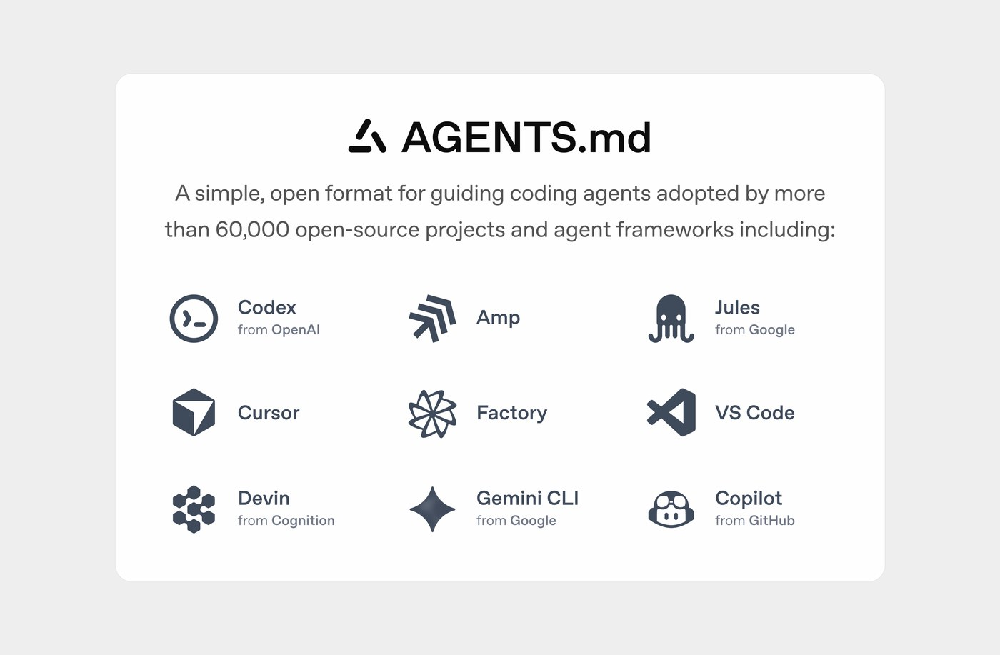
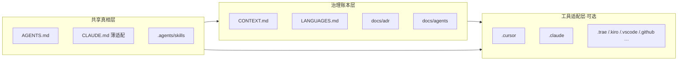
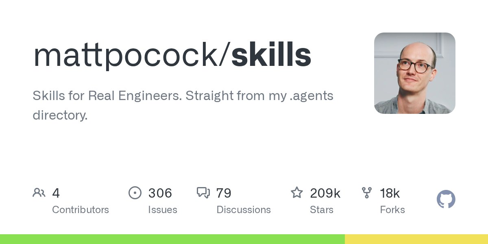
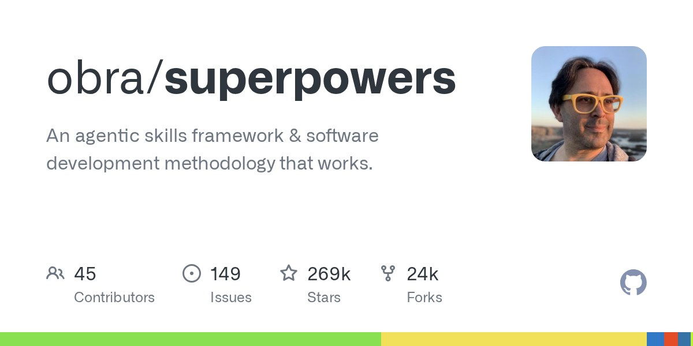

同一个项目里，CLI 老老实实读 `.agents/`，IDE 却拼命新建 `.cursor`、`.claude`、`.trae`、`.kiro`。不是你配错了，是生态还处在「共享核心 + 专属扩展」的过渡期。

这篇不拆 Matt 那四十个技能怎么转（那件事我写过：[40 个技能围着一个 grilling 转](/posts/matt-pocock-engineering-method/)）。这篇只回答三件事：根目录到底放什么、不同阶段养什么、Agent 怎么把这套 harness 读进上下文并干活。


## 先认清：IDE 建专属目录，不等于第二套技能源

CLI 基本是纯文件驱动，所以更愿意读共享的 `AGENTS.md` + `.agents/skills/`。

IDE 还要额外的东西：

- 更细的触发元数据（globs、`alwaysApply`、条件规则）
- hooks、settings、命令面板、本地覆盖
- 历史包袱（旧 `.cursorrules`、各家 `CLAUDE.md` / steering / specs）

所以 `.claude`、`.cursor`、`.trae`、`.vscode` 首先是**运行时适配层**。它们经常只是在指向或镜像共享内容，不该再复制一份 skill 正文。

你要盯的是：共享源有没有唯一真源；专属目录有没有偷偷长成第二份仓库。

## 正在收敛的三块开放标准

还没走到「全世界只认一个文件夹」，但主干已经清楚。

### AGENTS.md：跨工具的项目说明书

[AGENTS.md](https://agents.md/) 是给人看的 README 之外、专给 coding agent 的说明：怎么构建、怎么测、哪些约定别踩。现在由 Linux Foundation 旗下的 Agentic AI Foundation 托管，Codex、Cursor、GitHub Copilot、Jules、Amp 等一长串工具都认。

Claude Code 不原生读它，读 `CLAUDE.md`。务实做法是：`AGENTS.md` 当 SSOT，`CLAUDE.md` 顶部 `@AGENTS.md` 或薄封装一层加载序。

Matt 自己也提醒过：别把 `AGENTS.md` 养成泥球。每条指令都占「instruction budget」，路径级细节又最容易过期。短、可执行、偏能力描述，细节丢给 skills 渐进加载。



### Agent Skills：`SKILL.md` 文件夹协议

[Agent Skills](https://agentskills.io/) 约定很简单：一个目录 + `SKILL.md`（frontmatter 必填 `name` + `description`）+ 可选的 `scripts/`、`references/`、`assets/`。

加载方式是 progressive disclosure：先只看见名字和描述，真用到才读全文。Codex 会从当前目录向上扫 `.agents/skills`，再读用户级 `~/.agents/skills`；Cursor 一类工具常同时扫共享路径和自家 skills 目录。

### `.agents/` Protocol：还在 Draft，但路径已经被用上了

[dotagentsprotocol.com](https://dotagentsprotocol.com/) 想把 MCP、指令、skills、sub-agents、memories、模型配置都塞进 vendor-neutral 的 `.agents/`。草案而已。现实里更管用的是约定俗成：`.agents/skills/` 当共享技能源，IDE 目录做薄适配。

MCP 解决「能力怎么接」；Plugins / skills.sh 解决「技能包怎么分发」。它们都不替代「项目记忆写在哪」。

## 三层心智模型（我每个项目都按这个长）



**共享真相层**：能力与跨工具规范只维护一份。  
**治理账本层**：领域语言、决策、tracker 配置随项目生长。  
**工具适配层**：只放该工具真正需要的 rules / settings / hooks；skills 用 junction 指回共享源。

展开成目录，大概是这样：

```text
project/
├── AGENTS.md                 # 跨工具通用指令（优先维护）
├── CLAUDE.md                 # @AGENTS.md + Claude 专属加载序
├── CONTEXT.md                # 领域事实 / 术语（单上下文）
├── CONTEXT-MAP.md            # （可选）多上下文索引
├── LANGUAGES.md              # 共享用词（本仓加厚；见下）
│
├── docs/
│   ├── adr/                  # 难逆转决策（懒创建）
│   └── agents/               # 项目配置层
│       ├── issue-tracker.md
│       ├── domain.md
│       ├── triage-labels.md
│       └── workflow.md       # 你自己的任务流细节
│
├── .agents/
│   └── skills/               # 真正的 skill 源（只维护这里）
│
# --- 下面全部可选：你用到哪个工具再加哪个 ---
├── .claude/                  # Claude Code
├── .cursor/                  # Cursor（rules / skills→junction）
├── .trae/                    # Trae
├── .kiro/                    # Kiro（steering / specs）
├── .codex/ · .gemini/ · .junie/ · .windsurf/
├── .vscode/                  # 编辑器集成默认值
├── .github/                  # Copilot instructions / prompts
└── src/
```

别被列表吓到。根上先有 `AGENTS.md` + `CLAUDE.md` + `CONTEXT.md` + `.agents/skills/`，已经能跑；其余按痛点长，不按焦虑长。

## Matt 的治理资产：嵌进日常，而不是换掉你的流程

[mattpocock/skills](https://github.com/mattpocock/skills) 标语写得很直：Skills for Real Engineers，从他自己的 `.agents` 目录抽出来。调研日量级大约二十万星，release 已到 v1.2.x。主站目录在 [AIHero Skills](https://www.aihero.dev/skills)。



它不是「全流程接管框架」。哲学是：小、可组合、模型无关，**人始终握着过程**。针对的是对齐失败、术语漂移、代码质量、架构泥球，而不是再发明一套必须服从的瀑布。

一次性 `/setup-matt-pocock-skills` 在仓里落的，主要是这些：

| 资产 | 位置 | 干什么 |
|---|---|---|
| Issue tracker 配置 | `docs/agents/issue-tracker.md` | GitHub / Linear / 本地 `.scratch/` … |
| Triage 标签映射 | `docs/agents/triage-labels.md` | 五态：needs-triage → ready-for-agent … |
| Domain 消费规则 | `docs/agents/domain.md` | 告诉技能读哪些 CONTEXT / ADR |
| 领域语言 | 根 `CONTEXT.md` | grilling 时生长；别兼当 spec 草稿 |
| 决策账本 | `docs/adr/` | 只记难逆转 + 真有 trade-off 的 |

技能文件本身尽量零硬编码：跨仓差异都读 `docs/agents/*`。这点很工程。

主流程我日常记成：

```text
Align  → /grill-with-docs（有代码库）或 /grill-me
Spec   → /to-spec
Plan   → /to-tickets
Build  → /implement + 模型侧 tdd / code-review
Upkeep → /improve-codebase-architecture …
迷路时 → /ask-matt
```

技能拆解、grilling 引擎、v1.2 细节见旧帖；这里只强调一句：**治理文件是活的**。你不更新 `CONTEXT.md`，整套技能就退化为「会喊口号的斜杠命令」。

### `LANGUAGE.md` 别和 `LANGUAGES.md` 搞混

Matt 技能内部会有 `LANGUAGE.md`（deep module 那套词汇：Module / Interface / Seam…）。那是技能自带参考，不是每个项目根目录必建的文件。

我这边额外维护根级 `LANGUAGES.md`：站点称呼、issue 用词、博客领域用词。和 `CONTEXT.md` 分工——CONTEXT 管领域事实与硬约束，LANGUAGES 管「说话时用哪个词」。冲突以 CONTEXT 为准，必要时开 ADR。

官方 setup 还有个已知坑：它优先往已存在的 `CLAUDE.md` 写 `## Agent skills`，Codex 用户可能读不到。所以我坚持 **AGENTS 为 SSOT，CLAUDE 只做薄适配**。

## 不同阶段，养哪一层

| 阶段 | 重点维护 | Agent 实际在读什么 | 我怎么做 |
|---|---|---|---|
| 新项目启动 | AGENTS、空 CONTEXT、docs/agents、.agents/skills | 启动读 AGENTS/CLAUDE | 跑一次 setup；空 CONTEXT 也先建 |
| 需求澄清 / 设计 | CONTEXT、ADR 实时写 | grill-with-docs 读写账本 | 强制 grilling，禁止直接开写大功能 |
| 中大型功能 | tickets、术语表 | implement + 自动 tdd/review | to-spec → to-tickets → 每票尽量新会话 |
| 日常小改 / Bug | 局部 CONTEXT、相关 ADR | diagnosing-bugs | 小改勿全流程；修完必要时补 ADR |
| 架构演进 | CONTEXT、ADR、设计词汇 | improve-codebase-architecture | 定期扫 deepening，别等泥球成型 |
| 多工具协作 | 共享层 SSOT；专属目录薄 | CLI 读 .agents；IDE 走 junction | skill 正文只维护一份 |
| 长期维护 | CONTEXT 精简、ADR 懒记 | 每会话都会参考 | 几周删一次过时术语 |

核心纪律只有两条：共享层永远是真相源；工具目录禁止再复制同一套 skill 正文。

## Agent 怎么读，才能把 harness 用满

机制可以简化成：

```text
会话启动
  → 读根 AGENTS.md / CLAUDE.md（嵌套时最近者优先）
  → IDE 再叠 alwaysApply rules
Skills 发现
  → 扫 .agents/skills + 工具专属 skills（先 metadata，后全文）
运行时
  → 你触发的 skill：显式改 CONTEXT / 写 ADR / 更新 docs/agents
  → 模型触发的 skill：tdd、code-review… 带着账本干活
工具面
  → MCP 接外部能力；Plugins 负责安装与更新通道
```

想放大效果，我实际就做这几件：

1. 全局 / 项目 skills 用 junction，避免三份漂移  
2. `AGENTS.md` 写明：工程技能优先走 Matt 系，并维护 CONTEXT  
3. Claude：`CLAUDE.md` 指向 AGENTS，不另起炉灶  
4. 迷路先 `/ask-matt`，别靠背技能名  
5. grilling 结束若没改 CONTEXT，算这次对齐失败  

Harness 不是「装得越多越强」。是 Agent 每次醒来都能摸到同一份项目记忆。

## 和 Superpowers、ECC 怎么处




| 维度 | Matt Skills | Superpowers | ECC |
|---|---|---|---|
| 定位 | 可组合工具箱 + 治理资产 | 完整方法论，硬门禁 | Harness OS：海量 agent/skill + memory + 安全扫描 |
| 控制权 | 人主动触发为主 | SessionStart 注入，流程强制 | 灵活，能力面大，编排靠你 |
| 资产沉淀 | CONTEXT / ADR 跨会话生长 | 偏单次 Plan→Execute→Finish | 有 memory/instincts；领域建模非核心 |
| 规模 | 精，可挑着用 | 十几个核心技能成体系 | 几十 agent + 上百 skill |
| 风险 | 人不坚持就退化 | 小任务过重 | 过载、纪律变可选 |

社区里比较清醒的用法是：按任务形状选，不要按星数选。不确定、要深对齐，先 Matt 的 grill；要防 agent 偷懒的长程交付，可叠 Superpowers 的纪律；要某一类垂直能力，再从 ECC 里偷单件。

我自己的默认：**Matt 治理骨架 + 开放标准目录当底座**；Superpowers / ECC 只吸收真痛点对应的招，绝不三个 meta-router 同时开。

## 本站是怎么长出来的（实证，不是示意图）

这套不是 PPT。博客仓现在就是按三层养的：

- 根上：`AGENTS.md`、`CLAUDE.md`、`CONTEXT.md`、`LANGUAGES.md`
- 账本：`docs/adr/`、`docs/agents/`（Matt 三件套之外，还加了 `workflow` / `deliver` / `archive` / `voice`）
- 共享技能：`.agents/skills/`
- Cursor 适配：`.cursor/rules` 只放站点专有规则；`.cursor/skills` 用 junction，正文不双开

内容流水线也挂在同一治理层上，而不是另起一套玄学：

```text
甲 · Obsidian 笔记 → ob2blog → posts/<slug> → site-cascade
乙 · 会话/调研   → knowledge-extract → knowledge-output → site-cascade
```

再加一条多 agent 并行纪律：壁纸、音乐、配图、发文各管各的模块，看到别人的未提交改动别瞎慌。这是「项目记忆」的一部分，写进 AGENTS 比写进某次聊天有用得多。

## 近几天上游还在吵什么

扫 [mattpocock/skills](https://github.com/mattpocock/skills) 近几日的 issue，味道很成熟库：不是「这套废了」，而是「再好用一点」。

例如可恢复的 grilling 状态、plugin 通道下 setup 漏写 triage-labels、并行分支 ADR 编号撞车、skills 目录拍平并靠拢 Agent Plugins 1.0。对使用者的启示很具体：setup 跑完检查 `docs/agents/` 是否真写全；多分支时 ADR 编号别裸冲。

## 认清边界再开工

小改别强行 grill→tickets→implement 全套。  
skill 正文只维护一份，专属目录用链接。  
`AGENTS.md` 变厚时做减法，别当后悔药仓库。  
IDE 专属文件夹会继续存在；你要统一的是**真相源**，不是强迫所有工具删目录。

如果你已经在用 Matt、又同时开着 Cursor / Claude / Codex：先把共享层收干净，再谈装更多技能。目录不乱，Agent 才有机会真的变乖。
