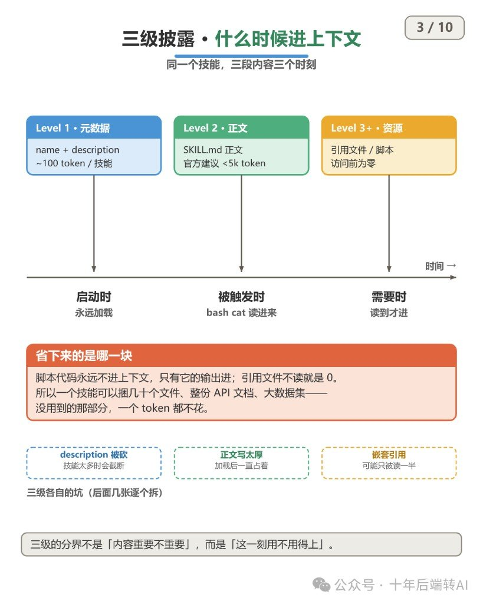
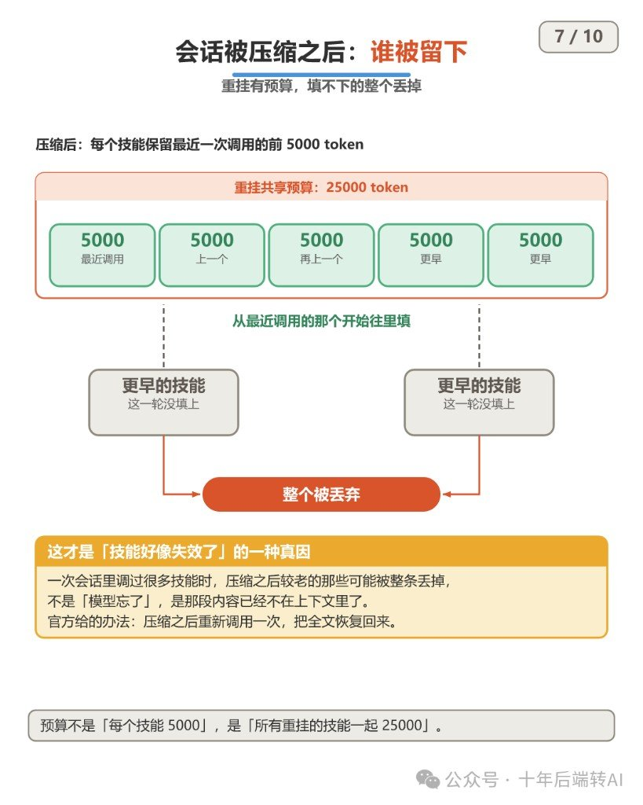
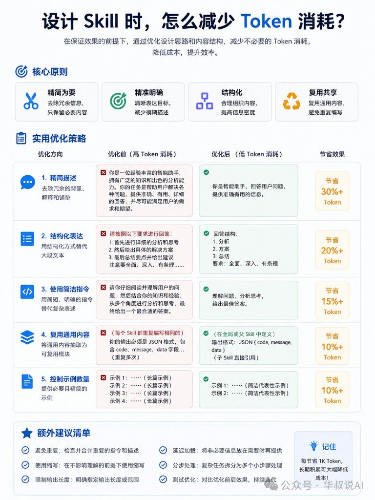
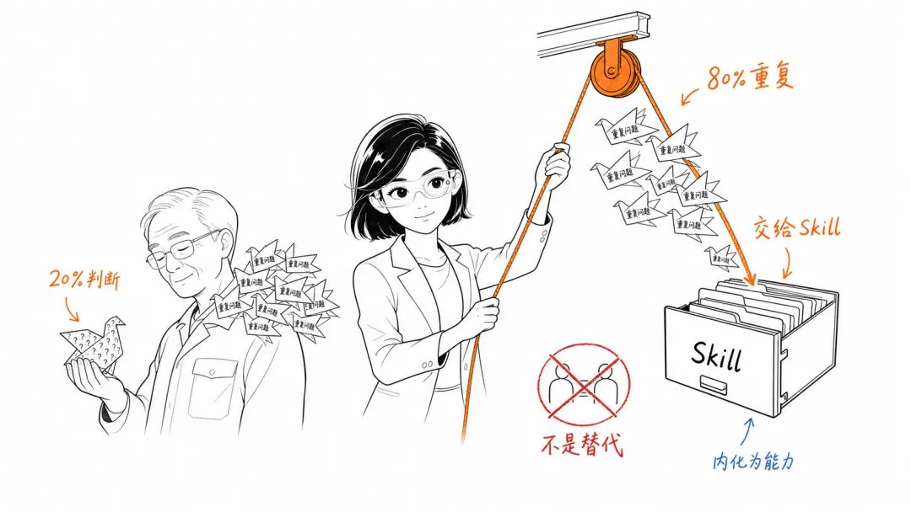
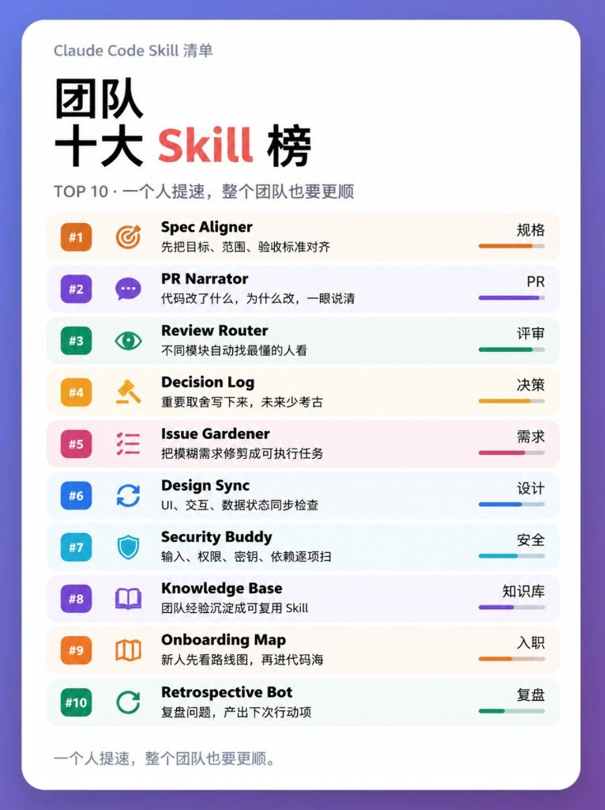
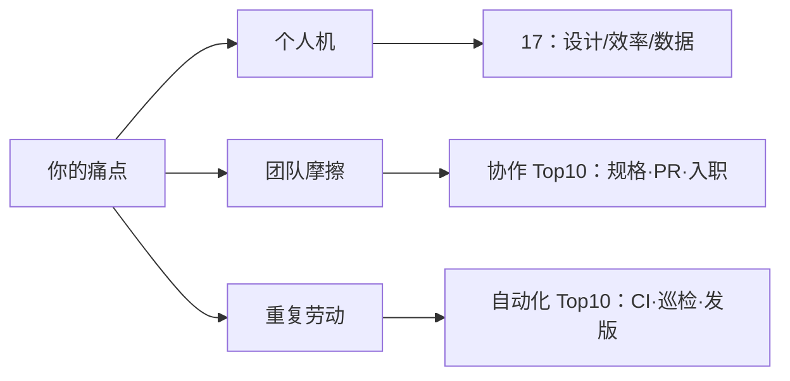
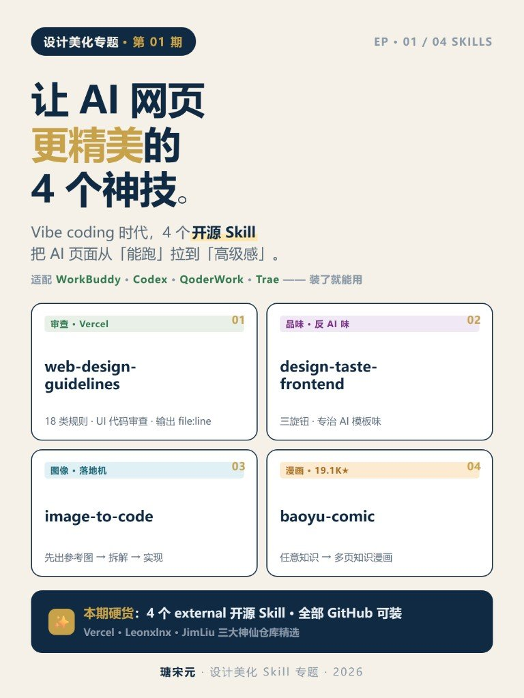

规范专篇之三：**Skills 测评与写法**。各工具安装路径差异见工具手册。

---

## Skill 怎么写，上下文怎么省

> 合并自原帖 `agent-skills-handbook`

Skill 别写成说明书前言，写成新员工 SOP。另一边还有一句更硬的：装一堆 Skill 不心疼，是因为启动只挂门牌——**正文一旦被触发，整会话常驻，没有 LRU**。

两篇教程本来各说各的：一篇讲怎么写、怎么叫；一篇讲上下文预算和分级加载。并在一起只为一件事——**写薄不是文风，是内存纪律**。

口径先说死：目录结构、词数建议、以及 100 / 1% / 5000 / 25000 等数字，均为作者教程转述，本轮未逐条核对 Anthropic / Cursor 官方原文。成帖当作业笔记用，落地前对照你宿主文档。


### 文件放哪，门牌怎么写

```text
skills/<skill-name>/SKILL.md
```

一技能一文件夹；文件夹名英文小写 + 连字符；主文件名写死 `SKILL.md`。

YAML 只管两样：

| 字段 | 只干一件事 |
|---|---|
| `name` | 小写连字符 ID（`checking-code` 可以；空格 / 中文 / 下划线不行） |
| `description` | **只写触发条件**——别把整套流程塞进去 |

```yaml
---
name: checking-code
description: Use when the user asks to review code or identify bugs
---
```

`description` 是门牌，不是操作手册。流程写正文。

### 正文七根柱子

照抄版把正文钉成七块；万能模板里常多一节「输入要求」：

1. 目标  
2. 什么时候用  
3. 什么时候别用  
4. 执行步骤（编号、可执行）  
5. 禁止事项（漏了最容易翻车）  
6. 输出格式  
7. 完成标准  

写薄：作者建议 `SKILL.md` **&lt;500 英文词**；细则、大例子、脚本拆到同目录的 `references/` / `examples/` / `scripts/`，别全塞进主文件。

`checking-code` 那例记住三条禁令就够：别评论不存在的代码；别顺手改无关代码；没验证别说「修好了」。

### 调用：目标 + 技能名 + 输入 + 输出

公式就四段拼起来。三种叫法都行——直接点名、说场景让它对上 Skill、顺带钉死输出格式。

四步不跳：说清任务 → 指定 Skill → 补齐输入 → 说明输出。缺材料就先让模型指出缺什么，别空跑。

万能调用（可粘贴）：

```text
请使用 [skill-name]，帮我完成 [任务]。
背景信息：[...]
输入材料：[...]
输出要求：[...]
若关键信息缺失，请先指出。
```

### 装得起，正文拿不出


和 CLAUDE.md / MCP / 提示词怎么分：

| | 偏什么 | 常驻怎么付 |
|---|---|---|
| CLAUDE.md | 稳定事实 | 启动全量进 |
| 工具 / MCP | 动作接口 | schema 常驻 |
| 提示词 | 当次对话 | 每次重贴 |
| Skill | 流程包 | ~100 token/技能（官方口径转述）；正文触发才读 |

分界线就一句：**事实留常驻，流程抽 Skill。**  
`CLAUDE.md` 某段从「一条事实」长成「一套流程」——抽出去。MCP 和 Skills 不在一层，那是另一篇的事；这里只盯 Skills **自己怎么吃上下文**。

### 三级披露：什么时候进窗口



| 级 | 进什么 | 时机 | 约束 |
|---|---|---|---|
| L1 | name + description | 启动永远挂 | ~**100** token/技能 |
| L2 | `SKILL.md` | 匹配触发 | 建议 **&lt;5k** |
| L3+ | 资源 / 脚本 | 真读才进 | 未读 = 0；脚本**只出输出** |

运行时像翻盘：不读的文件不进上下文。省的是「没摸到的那块」，不是把正文写胖还能白嫖。

### 四条压力线（数字标出处）

下列数字均为**作者转述官方口径**，未在本轮核对原文。

**装得起**——常驻 ≈ N × 100。装得多不等于「随便装几百个都没事」；列表还有 1% 天花板。

**拿不出**——L2 一旦进窗口，整会话常驻；后续不重读、**无淘汰**。例外：`allowed-tools` 下一条消息清空。

**会被砍**——技能列表预算 = 上下文窗口 **1%**。超了从最少用的砍 description。单技能 `description` + `when_to_use` ≤ **1536** 字符；关键用例写前面。被砍掉的关键词，可能就是匹配触发词——砍完等于这技能死了。

**会被丢**——会话压缩后重挂：每技能最近调用前 **5000** token，全体技能共享 **25000**。老的整条丢；再调可回流恢复。



### 两边都爱踩的坑

| 写 Skill | 调 Skill | 上下文 |
|---|---|---|
| 写成科普前言 | 「帮我处理一下」任务不清 | 正文写厚还指望白嫖 |
| 流程塞进 `description` | 不点名 Skill，流程被乱选 | 触发词被列表砍刀削掉 |
| 缺禁止事项 | 不给输入却指望准 | 压缩后以为技能「丢了」其实是重挂预算 |
| 改完不验证 | 不说输出格式 | 把脚本当免费常驻文档 |

安全另记一句：Skill 带着脚本和工具授权进来。只信可信源，用前逐文件审。外拉内容可能夹指令；授权别给得比任务宽。

### 认清撞上哪一层就行

写的时候盯七根柱子和「门牌别塞流程」。跑的时候先问：是门牌被砍了，还是正文写太厚，还是压缩把老技能整条踢了。

装得多不怕。怕的是触发后的常驻、列表 1% 被砍、压缩后 25000 共享丢光。

---

## 写 Skill 别堆料

> 合并自原帖 `agent-skills-handbook`

做 Skill 时爱把背景、规则、示例一次塞满，觉得越全越好。真烧钱的，往往是这些**每次调用都重复灌进上下文**的大段。

好 Skill 不止答得准，还要「够用就好」：一句话能说清就不写三句；公共规则抽出去复用；示例要代表性，不是堆数量。复杂事拆成多个小 Skill，Agent 按需调用，上下文更干净，维护也轻松。

Token 在业务里已经是运营成本。优秀 Skill 不是写得最长，而是用最少信息把事讲清、做对。

站内相关阅读：[Skill 怎么写，上下文怎么省](/posts/agent-skills-handbook/)（门牌、七根柱子、分级加载）。



### 先钉四条规矩

| 原则 | 落地 |
|---|---|
| 精简为要 | 删冗余，只留必要 |
| 精准明确 | 目标写清，少空话 |
| 结构化 | 用列表 / 字段抬信息密度 |
| 复用共享 | 公共模块一处维护，子 Skill 引用 |

### 五条改法：胖稿怎么削

原文给了「高 Token → 低 Token」对照。节省比例是经验估计，当方向看，别当精确账本。

1. **精简描述**（估省 30%+）  
   长自我介绍、背景铺垫 → 一句角色 + 任务。

2. **结构化表达**（估省 20%+）  
   「请详细分析…再给方案…注意全面…」→ 固定回答骨架：分析 / 方案 / 收尾判断 + 短要求。

3. **精简指令**（估省 15%+）  
   「仔细阅读并理解…多角度…最佳答案」→ 「理解问题，分析，给出最佳答案。」

4. **复用公共内容**（估省 10%+）  
   每个 Skill 复制同一 JSON schema → 父 / 全局定义 `{code, message, data}`，子 Skill 引用。

5. **控制示例数量**（估省 10%+）  
   四个超长示例 → 两个短而有代表性的。

### 改 Skill 时顺手扫一眼

- 合并重复指令  
- 缩写不影响理解再用  
- 写明输出长度 / 范围  
- 非必要说明懒加载（真用到再给）  
- 复杂任务拆多步 / 多 Skill，别做一个巨型 Prompt  
- 改完前后对比效果，再迭代  

### 和本仓写法怎么对上

落到个人博客或小型工具链也一样：主说明只写常用路径，细则另开附录；公共校验抽成一份复用，别每个技能各抄一遍；发文、校验、索引更新拆成独立能力，用到再串。这就是「聚焦单一能力 + 按需调用」的落地版。

写新 Skill 前先问三句：这段每次都会注入吗？能上提到父规则吗？这个示例删了模型还懂吗？

### 别踩的坑

- 「信息越全效果越好」在 Skill 里常常变成「上下文越胖、越贵、越好偏」。  
- 拆 Skill 不是拆成碎片：边界要清，公共契约（输出格式、红线）要共享。  
- 原文百分比未给测量条件；落地时用自己的前后 token 对比验收。

---

## 装不上：目录与套层

> 合并自原帖 `agent-skills-handbook`

Skill 是「结构化提示词 + 可选脚本/参考」；Plugin 是一包能力（可含多个 Skill、commands、`.mcp.json`、hooks）。装单个能力拷目录；装整套工作流再走 `/plugin`。

### 路径

| 级别 | Claude Code | Codex（常见） |
|---|---|---|
| 项目 | `.claude/skills/` | 视客户端文档 |
| 用户 | `~/.claude/skills/` | `~/.codex/skills/` |

坑：`~/.claude/skills/md-polish/md-polish/SKILL.md` 多套一层 → 发现不了。正确是 `.../md-polish/SKILL.md`。

同 Skill 兼 Claude / Codex 时，触发方式要分开写清（`/` vs `$SkillName` 等）。

### 安装三条路

1. **手动拷**完整 Skill 目录（最稳）  
2. **skills.sh / skillsmp**：如 `npx skills add https://github.com/anthropics/skills --skill frontend-design`  
3. **Plugin marketplace**（整包）

```text
/plugin marketplace add anthropic-agent-skills
/plugin install document-skills@anthropic-agent-skills
/plugin search frontend anthropic-agent-skills
/plugin uninstall document-skills
```

### `SKILL.md` 字段（常用）

| 字段 | 作用 |
|---|---|
| name | 技能名（与目录一致） |
| description | 触发条件（最重要） |
| disable-model-invocation | `true` = 禁自动，只手触 |
| user-invocable | 是否允许 `/名` |
| allowed-tools | 工具白名单 |
| argument-hint | 手触参数提示 |
| effort | 工作强度提示 |

### 挑别人 Skill 时看啥

最近是否维护、文档是否写清客户端、触发边界是否清楚。装完没反应：先查路径与文件名大小写，再查 `description` 是否跟你的话对得上。

### 相关阅读

- [Cursor Skills：路径放错等于没装](/posts/cursor-handbook/)
- [MCP、Skills、Plugin 不是三选一](/posts/mcp-handbook/)

> 素材来源：[CSDN 原文](https://island.blog.csdn.net/article/details/161088692)

---

## SOP 落到 Skill

> 合并自原帖 `agent-skills-handbook`

虚虚老师这篇把企业护城河从「拼模型」拧到「拼 Skill」：模型谁都能接，**隐性经验**才难抄。框架挂 AI-OIT（Observe-Implant-Train）。原文链接没给，下面按要点压薄；案例数字一律**作者转述、本地未核**。


### 人墙比文档墙更贵

车间里常见戏码：厚 SOP 长蛛网；真正救人的是老师傅听异响、闻金属味、扫一眼报错码。  
Skill 干的事，不是再写一本更厚的手册，而是把「老李会、别人不会」的口令，收成**可调用的小步骤罐**。

人墙不拆，Agent 再强也只会在门口排队。

### 模型像电，Skill 像电器

通用模型是插座里的电；公司偏好（编码习惯、排查口令、工单结构）是变压器；Skill 才是能稳定出活的电器。


没有偏好层，电再强也只是乱闪。护城河不在电表读数，在你家电器柜里有没有**别人抄不走的偏好**。

### 两类 Skill，别囤错货

| 类型 | 跟着什么变 | 建议 |
|---|---|---|
| 能力提升型 | 模型 / 工具版本 | 易过时，少囤勤汰 |
| 编码偏好型 / 组织口令 | 你们怎么干活 | **优先囤**，这是持久资产 |

「会用某模型的新功能」一年后可能作废；「我们遇到 E07 + 金属味先停机」不会跟风过期。

### 示例骨架：设备异常初判

把感官信号压成可执行卡，而不是散文 SOP：

- **输入**：异响 + 金属味 + `E07`
- **动作**：观察 → 预警 → **停机**
- **升级**：一周内同类三次 → 拉高一级处理


骨架够短，老师傅才愿意改；改完才能进罐。

### 作者甩出的几组数（先降温）

| 说法 | 口径 |
|---|---|
| 电机诊断 17 → 3.2 分钟，复用率 68% | 作者转述，未核 |
| 企微代码生成率 94% | 同上 |
| 腾讯云 Skills 替全量检索：首字延迟 −45%、token −92% | 同上 |
| 协鑫内训师互动 +42%、NPS 4.8 | 同上 |

当「方向感」看可以；当 KPI 抄进自家 OKR 之前，先找原出处。

### 五招撬老师傅（心理战大于文档战）

1. **改不写**：别逼从零写；他改比他写便宜一百倍  
2. **被封神**：口令抬成标准，不是「被掏空」  
3. **挑顺风口人**：先找愿意被看见的，别一上来硬刚最难搞的那位  
4. **一把手保底**：对外口径固定：**augment ≠ replace**  
5. **只要 80% 可重复**：剩下 20% 判断留在人手里



### 本周三件实事

1. 列出「离了某人就转不动」的事（人墙清单）  
2. **先捞 → 草拟 → 他来改**（真实过程进网，再出草稿）  
3. 每条 Skill 配 **1–3 组真实 I/O**（输入信号 / 输出动作），空口令不要


### 跟旁边几篇怎么并排

同周库里已有「怎么写 Skill」「上下文预算」「团队十大 Skill」——那是**写法 / 工程预算 / 清单选型**。本篇是**组织侧：隐性经验怎么进罐**。旁链互指即可，**不要合并成一篇大杂烩**。

职业叙事向的 FDE 陪跑，另见 [被裁了别开馆子](/posts/layoff-to-fde/)。

文末「回复 Skill」领模板：私链不进库；留言区多是领福利，别当成验证证据。

---

## Claude 插件选型旁证

> 合并自原帖 `claude-code-handbook`

模型开箱大家差不多。真拉开差距的，是 skill、CLI、插件装没装对——以及你有没有把三张宣传榜当成同一份购物车。

这篇文章只做一件事：**对照**。一张是作者自用 17 件套（设计 / 效率 / 数据），另外两张是团队协作 Top10 和自动化 Top10。名单几乎不重叠；硬并成「27 个必装」只是给上下文添堵。




### 三张榜各自吃哪口痛

| 榜 | 吃什么 | 装源诚实度 |
|---|---|---|
| 自用 17 | 个人机上的审美补丁、少写代码、喂外部信号 | 文中多给 CLI / 仓库线索；仍按「作者筛选」看 |
| 团队 Top10 | 规格、PR、评审、决策、入职、复盘 | **宣传名**；文内无仓库，是否可装未验证 |
| 自动化 Top10 | 开发测试、清洗数据、发版运维那类重复劳动 | 同上；公开检索也对不上同名可装包 |

先认能力与类别，再决定去哪找实现。名字好看不等于能 `npx skills add`。



### 17 件套：痛哪类拿哪类

一次装满没意义。痛哪类就从那类拿 1～2 个，跑通再加。

| 类 | 你在烦什么 | 先摸哪几个 |
|---|---|---|
| 设计 | 界面一眼塑料、落地页同质 | Taste、Impeccable、Awesome Design.md |
| 效率 | 代码写多、token 贵、浏览器 / GitHub 手点 | Ponytail、Playwright CLI、`gh`、Skill Creator |
| 数据 | 外部信号、网页进上下文、库 / 记忆 / 收款 | Last 30 Days、Firecrawl CLI、LightRAG、Stripe CLI |

设计类里，Taste 偏从零 / 重做观感，Impeccable 偏命令面 + 页内点选改——别两个一起上来搅浑。审美深潜另有专帖，这里只记它在 17 件里站「审美入口」位。

效率类真正可复用的，往往不是再塞三个 skill，而是 Ponytail 那套写前五问：真需要写吗？库里有没有？标准库够不够？平台原生有没有？已有依赖能否一行解决？`gh` + Skill Creator 我认作地基：issue / PR / release 能在终端闭环，你自己还能造轮子。

数据类按需开抽屉。常爬网页再上 Firecrawl CLI；常要外部热点再上 Last 30 Days。GWS / Stripe / Supabase 按你是否真的碰 Workspace、收款、后端再决定。说不出「它替我省掉哪一步」，就卸。

Playwright 选型口诀：Agent 长会话里偶发点网页，MCP 可能更省事；批跑、脚本化、控成本，优先 CLI。

### 两张 Top10：能力备忘，不是安装清单

协作榜堵的是对齐乱、PR 说不清、老人带不动新人。按痛点裁：

| 痛 | 先看哪几把（宣传名） |
|---|---|
| 对齐乱 | Spec Aligner、Issue Gardener |
| PR / 评审糊 | PR Narrator、Review Router |
| 决策会丢 | Decision Log |
| 新人进海 | Onboarding Map、Knowledge Base |
| 安全 / 设计核对 | Security Buddy、Design Sync |
| 复盘空转 | Retrospective Bot |

自动化榜堵的是重复劳动。按段拆开看：

| 段 | 宣传名 |
|---|---|
| 开发测试 | Agent Swarm、Playwright Scout、Terminal Sense、CI Fixer、Screenshot QA |
| 数据处理 | Data Cleaner |
| 发布运维 | Changelog Miner、Dependency Guard、Release Notes、Nightly Runner |

两张榜名单几乎不重叠。别当成同一表的续集，也别跟 17 件套逐条合并——切面不同。

### 差分一眼看完

| 维度 | 17 自用 | 团队 Top10 | 自动化 Top10 |
|---|---|---|---|
| 读者场景 | 个人工作台提效 | 协作摩擦 | 流水线重复劳动 |
| 典型物件 | CLI、审美 skill、喂料工具 | 规格 / PR / 入职类能力名 | CI / 巡检 / 发版类能力名 |
| 和另一榜重叠 | 几乎无（个别能力相近但名字不同） | 几乎无 | 几乎无 |
| 我怎么用 | 按痛点装 1～2 个可验证的 | 当「团队该覆盖哪些能力」备忘 | 当「重复劳动该外包哪段」备忘 |

撞名不等于可装。生态里能搜到能力相近的 Playwright / changelog / CI 修复类 skill，那是**别的仓库、别的名字**，不能偷换成「就是榜上这十个」。

### 我会怎么装

如果是我自己的机器，顺序大概是：

1. `gh` + Skill Creator（地基）
2. 痛 UI 再上 Taste 或 Impeccable 其中一个
3. 常爬网页再上 Firecrawl CLI；常要外部热点再上 Last 30 Days
4. Ponytail 当习惯补丁，数字当参考，五问当纪律
5. 团队侧先对照协作榜写清「我们缺哪段能力」，再去找可审仓库或自己写同名能力包
6. 自动化侧同理：先标重复劳动段落，再找可核实现

其余当工具抽屉。开了就要能说出替我省掉哪一步。

---

## 六条视频 Agent Skills

> 合并自原帖 `agent-skills-handbook`

生成、粗剪、代码排版、多模态生媒、中文口播剪辑、Seedance 提示词——别指望一个 Skill 包打天下。Megadotnet 这张清单把链路拆开；信息图里 seedance 卡片曾误贴 videocut 仓库，以正文链接为准（作者已认）。


用法通识：装进 Agent Skills 目录后，由工具显式或隐式调用（作者留言口径）。下面对照 GitHub 现状（2026-08-11 抽查）做一张选型表。

### 六件对照，对上你卡的那段

| # | Skill | 仓库 | 干嘛的 | 更适合 | 抽查备注 |
|---|---|---|---|---|---|
| 1 | HyperFrames | [heygen-com/hyperframes](https://github.com/heygen-com/hyperframes) | HTML/CSS/动画 → 确定性 MP4 | 宣发、教程开场、社交短片 | Apache-2.0；面向 agent 渲染 |
| 2 | video-use | [browser-use/video-use](https://github.com/browser-use/video-use) | coding agent 粗剪 | 口播/采访/教程先过一遍 | MIT；去填充词、调色、烧字幕 |
| 3 | Remotion Skills | [remotion-dev/skills](https://github.com/remotion-dev/skills) | React 代码控字幕/动画/时间轴 | 排行榜、周报、产品更新栏目 | `npx skills add remotion-dev/skills` |
| 4 | Generative Media Skills | [SamurAIGPT/Generative-Media-Skills](https://github.com/SamurAIGPT/Generative-Media-Skills) | 图/视频/音频生成工具箱 | 广告、UGC、音乐短片、实验 | MIT；依赖 muapi 等生媒后端 |
| 5 | videocut-skills | [Ceeon/videocut-skills](https://github.com/Ceeon/videocut-skills) | 中文口播剪辑 Agent | 重复句、口误、术语字幕 | 对比剪映：偏语义理解 + 词典 |
| 6 | seedance2-skill | [dexhunter/seedance2-skill](https://github.com/dexhunter/seedance2-skill) | 写 Seedance 2.0 视频提示词 | 分镜/镜头/运动/氛围拆解 | MIT；英文+中文 Skill 文件 |

作者点名 Remotion「貌似目前最好用」——更准确的说法是：**固定版式、要批量、能接受代码管时间轴**时它强；口播去废话优先 video-use / videocut；纯文生视频提示词走 seedance2；要从 HTML 直接渲片走 HyperFrames。

### 能力落点，别混成一条河

```text
想法 / 文案
  → seedance2（拆镜头提示词）或 Generative Media（直生媒）
成片素材（口播原片）
  → video-use / videocut-skills（粗剪）
栏目化、可复现版式
  → Remotion Skills（React 批产）
文章/推文 → 动效 MP4
  → HyperFrames
```

### 和本机栈怎么并排放

仓内 / 本机已有 `video-use`、`firefly-minimax-media`、[story-to-handdrawn-video](/posts/story-to-handdrawn-video/) 等——这张清单是**外部选型地图**，不是替代安装说明。真要上某仓库，仍以其 README 的 skills 安装命令与密钥要求为准；Generative Media 类还要单独看付费后端。

白板手绘整条生产线（分镜·旁白·对角扫描渲染）另见 [create-whiteboard-video](/posts/create-whiteboard-video/)。

### 别踩这些坑

- 信息图右下角卡片链接曾写错：seedance ≠ videocut。
- 「最好用」取决于任务：口播剪辑和数据周报不是同一条管线。
- 装了 Skill ≠ 免费无限生视频；生图/生片额度、ffmpeg、Remotion 工程环境都要自己备齐。

---

## 设计向 Skill 去 AI 紫

> 合并自原帖 `agent-skills-handbook`

Cursor / Claude Code / Codex 写前端，功能往往能跑，脸却总像同一张：紫蓝渐变、100vh 居中 Hero、三等分 Feature 卡、Inter 一把梭。行业叫这 AI Slop——不是「丑」，是「默认」。

这周手头三份素材其实在讲**同一条审美流水线的三层**，不是三个互抢的安装包：

| 层 | 管什么 | 代表 |
|---|---|---|
| 约束 | 反模板规则、三旋钮、起飞前自检 | Taste Skill（`design-taste-frontend`） |
| 串技 | 参考图落地 → 拧品味 → Vercel 规则钉到 `file:line` | 设计美化四技里的网页三连 |
| 词库 | 点名美学家族（79 风格 × 中英 Prompt） | `ui-styles-skill` |

别四个 skill 一锅扔进同一轮对话，也别把「风格名」和「品味旋钮」当成同一把刀。



### Taste：把「别出那张脸」写成可执行规则

[Taste Skill](https://github.com/Leonxlnx/taste-skill)（Leonxlnx，官网 [tasteskill.dev](https://tasteskill.dev)，MIT）不是 UI 库、不是 CSS 框架、没有运行时。本质是一堆 `SKILL.md`：读 brief → 调旋钮 → 硬禁常见模板 → 起飞前自检。

默认安装名 `design-taste-frontend`，当前是 **v2 experimental**（要钉死旧行为就装 `design-taste-frontend-v1`）。骨架可以记成四段：

**§0 Brief Inference**——碰代码之前先读房间：页面种类、vibe 词、参考 URL/截图、受众、品牌资产、安静约束。输出一行 Design Read 再开干。brief 真含糊时只问**一个**澄清问题，不连环审问。

**三旋钮（1～10）**：

| 旋钮 | 默认 | 低 → 高 |
|---|---|---|
| `DESIGN_VARIANCE` | **8** | 对称干净 → 不对称实验 |
| `MOTION_INTENSITY` | **6** | 静态 / hover → 电影级 / 磁吸 / 滚动 |
| `VISUAL_DENSITY` | **4** | 画廊留白 → 座舱密铺 |

Baseline `8 / 6 / 4`。覆盖靠对话，不靠让用户去改 skill 文件。

**Hard Bans（节选）**：默认紫蓝渐变 / Lila glow（品牌明确要紫另说）、`100vh` 居中 Hero 当万能开场、三等分等宽 Feature 墙、滥用 Inter、em-dash 当装饰、半截交付和假数据文案。

**Pre-Flight**：交付前大约 60 项自检。过不了就返工，不当「差不多」。体积提醒：单份 SKILL 大约 87KB / ~2 万 token——装了就会占上下文，不是免费午餐。

仓库里还有 image-to-code、redesign、图像 comps、brutalist 等十来个安装名。不必一次全装；默认一个 `design-taste-frontend` 往往就够起步。

落地页 / 作品集 / 营销站是主场。仪表盘、数据表、多步产品后台，官方自己划了「不是它的菜」。


### 四技网页线：先锚点，再旋钮，再审查

瑭宋元那篇「设计美化专题」把四技并排推。装机量、星数先当宣传数字看（作者称，本轮未核）。宿主兼容按作者口径：WorkBuddy / Codex / QoderWork / Trae。

| # | Skill | 角色 | 你真正拿走的 |
|---|---|---|---|
| 01 | `web-design-guidelines` | 审查 · Vercel | 18 类规则扫 UI；吐 `file:line` |
| 02 | `design-taste-frontend` | 品味 · 反 AI 味 | 就是上一节那套旋钮 |
| 03 | `image-to-code` | 图像落地 | 参考图 → 拆解 → React / Next / Tailwind |
| 04 | `baoyu-comic` | 知识漫画 | 6 风格；知识 → 多页漫画 |

**网页线（推荐）**：`image-to-code` → `design-taste-frontend` → `web-design-guidelines`。  
先有视觉锚点，再拧品味，最后用 Vercel 规则钉到具体行。

**漫画线**：`baoyu-comic` 单独跑。它解决的是「知识怎么变成可翻页漫画」，跟落地页审美不是一条流水线。

安装命令（作者文内，本机未实测）：

```bash
curl -fsSL vercel.com/design/guidelines/install | bash
npx skills add Leonxlnx/taste-skill --skill design-taste-frontend
npx skills add jimliu/baoyu-skills --skill baoyu-comic
```

`image-to-code` 原文图卡没给独立一行安装命令；串进网页线时按你宿主里实际包名再补。

### ui-styles：别只会喊「好看一点」

Ant Design 看腻了，跟 Agent 又只会喊「好看一点」——等于没给审美词条。[ui-styles-skill](https://github.com/chrzamz/ui-styles-skill) 干的事很窄：把开源 UI 风格 Prompt 装进 Claude Code Skill，写前端时能**点名风格**（离线读本地 catalog）。


2026-08-11 核对：README 写 **79** design styles × bilingual prompts；GitHub 显示 ★10；上游 Prompt 致谢 [TonnyWong1052/UI-Prompt](https://github.com/TonnyWong1052/UI-Prompt)。封面图写 79、公众号正文常见 70+——以仓库 79 family 为准；其中 9 个只有 `style.md`（理解用），没有可直接生成代码的 `custom.md`。

能带走的用法：按场景筛候选；点名风格（如 claymorphism）再出页；两个风格名直接对比各自 `style.md`。作者例：出入库项目用 Shadcn/ui + Tailwind 做黏土风——风格词有了，组件库才是落地层，不是互斥。

### 三层怎么叠，别搅成一锅

| | Taste / 四技品味层 | ui-styles |
|---|---|---|
| 管什么 | 反模板约束 + 审查落点 | 风格 Prompt 库 |
| 典型动作 | brief → 三旋钮 / `review my UI` | 「用 claymorphism 做登录页」 |
| 适合先上 | 已经「能跑但一眼模板」 | 知道要某种美学家族、缺词条 |

推荐串法：先从 ui-styles 点风格名（或从参考图走 image-to-code），再用 Taste 收口，最后 guidelines 钉行号。漫画需求单独开 baoyu-comic，别跟网页三连搅。

### 适合谁，别硬套谁

适合：落地页、作品集、营销站、活动页；已经一眼模板的改版；想把审美判断沉淀成可复用 Agent 约束的人。

不太适合：后台表格、高密度仪表盘、多步产品工作台；brief 糊却指望旋钮救命；上下文很紧、不想喂进约 2 万 token 规则的会话；把 v2 experimental 当生产契约却拒绝回退到 v1。

作者声明（Taste）：没有官方代币 / 币 / 加密项目；蹭名发币的一律无关。

---

## tta 技能族全景

> 合并自原帖 `agent-skills-handbook`

拿到一套成体系的 AI 技能仓库，一共 8 个 skill，覆盖了 PPT、文风、插画、封面、HTML 文档、网页动画、前端、UI 生成。它原本是另一个开发者（oil）开源的东西，我 fork 下来改名成了自己的 tta 系列。

逐个读完 SKILL.md 之后，最深的感受是：这不是一堆零散提示词的堆叠，而是一套有明确设计哲学的**生产系统**。这篇先把它们本来的规范和流程长什么样记下来——V0 版，算是这套系列自己博客集的开篇。之后每一次较大的迭代或更新，都会对应发 V1、V2，逐步把它磨成完全自己的形状。


### 八个技能，各管一摊

| skill | 干什么 | 上游核心规范一句话 |
|---|---|---|
| tta-ppt | 16：9 HTML 演示稿 | 状态机驱动，AI 只执行当前一步，逐页创作 |
| tta-tone | 中文/英文文风规范 | 事实边界是硬规则，避 AI 表达有清单 |
| tta-visual | 漫画墨线插画 | 固定画风：墨线+网点+火柴人+黄边牧 |
| tta-cover | 视频封面生成 | 三画幅无人物，标题由 Agent 提炼 |
| tta-html | 单页 HTML 分享文档 | 拟真 UI 代替文字描述 |
| tta-motion | 网页交互动画 | 先生图锁帧，再 AI 视频补中间帧 |
| tta-frontend | 前端实现与评审 | 单一权威来源，禁止伪操作 |
| tta-draw-ui | UI 生成与还原 | 纯净边框图锁导航，结构代码化 |

### 三个最有分量的设计思路

**① 重复劳动全部脚本化，还强制留证据。** cover 用 ffmpeg 本地预筛候选帧（清晰度+亮度+内容度硬过滤），模型只做"语义选帧"这一件事；motion 用 `motion_budget.py` 自动裁决交付格式；每次生成都留 prompt/analysis/manifest 三份 sidecar。把"哪些交给模型、哪些交给程序"划得干干净净：**模型只做语义判断，程序只做确定性处理**。

**② 质量门禁不是口号，是显式步骤。** 每个 skill 都有"不可违反清单 + 交付前自查"。ppt 有一长串阻塞项（HTML 结构损坏、文字溢出、远程资源、跨页 CSS 污染）；visual 要求 label 逐字符比对、禁止用独立文字层掩盖错误；html 有最小字号 14px、彩色不超过两色相这些硬指标。

**③ 强触发约束，防止误用。** 大部分 skill 要求"用户明确点名才启用"。html 甚至写明：你说"帮我做份 HTML"它都不会自动触发，必须点名 `oil-html`。这跟现在很多 skill 抢着自动触发正好相反。

### 几条值得抄的具体做法

- **文风当基建**：tone 是所有内容 skill 共用的文案层，ppt/html/cover 都引用它。人称规则清晰（「我」讲自己、「我们」面向读者、「你」仅指导操作），还配了 `tone_lint.py` 自动查 AI 腔。
- **先生图后视频**：motion 用"先生成首尾关键帧，再用 AI 视频补中间"，色键背景是硬门槛，插帧 48FPS，清晰度优先、体积其次。
- **先删后建**：frontend 和 draw-ui 都强调"先删除无效内容再实现"，改前端前先明确真正出错的位置。
- **剪裁而非降级**：ppt 拆页压缩只删冗余，不删事实、原因、影响、步骤。
- **透明素材分级**：draw-ui 把小 logo 白底转 alpha，大插画走绿幕，不混装一张素材板。


### 这套体系的共同基因

读完 8 个 SKILL.md，能总结出五条贯穿始终的原则：

1. 忠于内容，不编造事实、不虚构来源
2. 产物只写最终态，不写 changelog
3. 一个含义只保留一个权威来源
4. 强触发约束防误用
5. 重复性工作脚本化 + sidecar 证据留痕

这套体系最大的价值不是某个 skill 多好用，而是它们共享同一套设计哲学——**把「确定性」和「创造性」分层**：程序守住边界，模型在边界内发挥。这正是我后续做个性化改造时要保持的骨架。

---

## 官方坐标与补强备注

官方口径摘要：

- Agent Skills 已走向跨工具开放标准；`SKILL.md` 至少要有清晰 `name` + `description`（决定何时被选中）
- 正文别无限堆：拆 `references/` / 脚本；关注「技能列表」本身也有上下文预算
- Skills ≠ MCP：一个教怎么做，一个接外部能力
