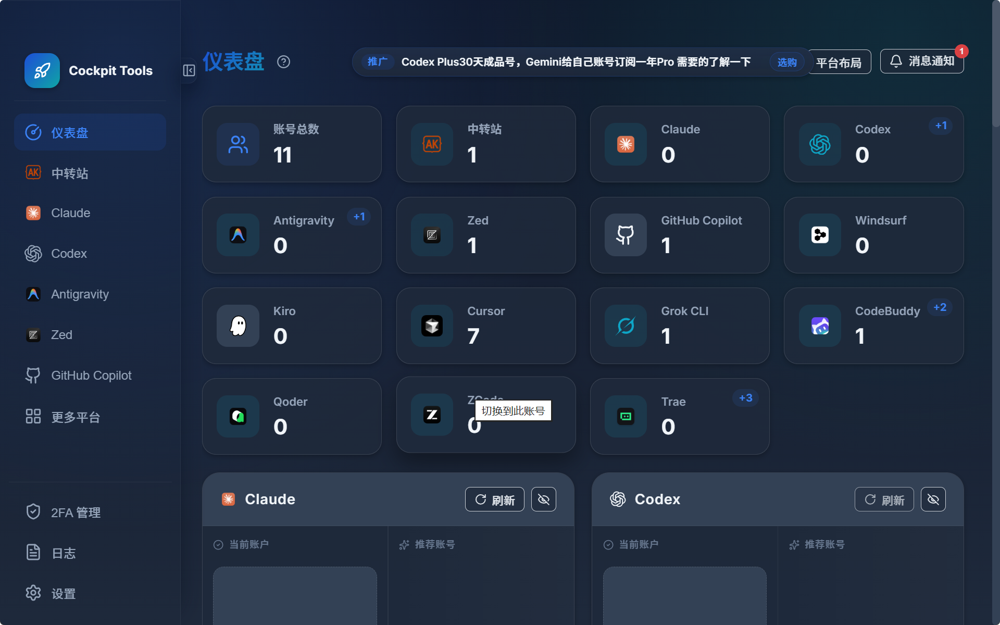

## 渠道
**咸鱼**:  https://www.goofish.com/
  租号, 速刷, 日抛等..(如 plus速刷, kiro拼车, cursor auto等)

**QQ群**: 中转,号商,群友集结地, 各种渠道, bug放出的消息(也可以蹲 [l站](https://linux.do/) )

**官网**(挑有性价比的)优惠: 
  一般是首月优惠, 或者 0 月绑卡适用, 白夜间福利, 新模型测评低倍率,0倍率
  当前推荐(opencode go, cursor 半价(需要符合资格号), gpt plus)

**中转:** l站 / b站 / 社区论坛看 0.0x的倍率中转, 挑测试稳定, 福利多的

## 目前已知的bug / 羊毛
- cursor 
  - 卡mcp (正存活): 
  - ~~超额流~~ (已修复)
  - 卡半价的半价(不太清楚): 例如 首月6$
- kiro 
  - 企业号拼车
- qoder
- trae
- gpt 
  - k12
  - 日抛周额度 plus

## 推荐
1. opencode go 路由到 ccswitch 蹬 deepseek v4 flash
  >35块 蹬 75e+ 的v4f(正式版)

2. qq 群里面找 号商买 临期的 cursor auto的号 蹬 grok4.5 high fast
  >pro auto: 2e, pro+3倍, ultra 20倍

3. 买 日抛的周额度plus号 / 配合中转蹬 00x倍率的 性价比模型

4. 咸鱼拼车minimax / glm / kimi 订阅车, 30-40一月
  >参考订阅(MiniMax MAX, glm 老lite, kimi Allerogtto)

## 技巧
1) 使用  [cockpit tools](https://github.com/jlcodes99/cockpit-tools/releases)  管理各个类型的订阅号池, 可以保存登录态

   

2) 使用claude code cli 做轻量任务, cursor ide 配套维护重型任务,复杂操作(如e2e测试, 文件索引拖拽, 内置浏览器div选择..)
