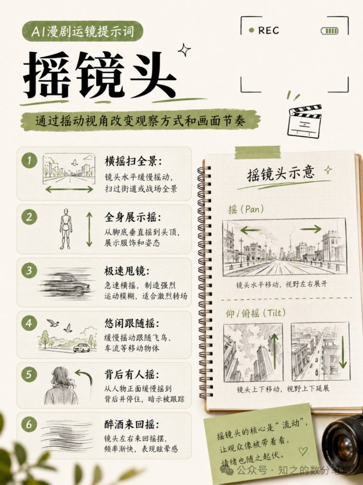
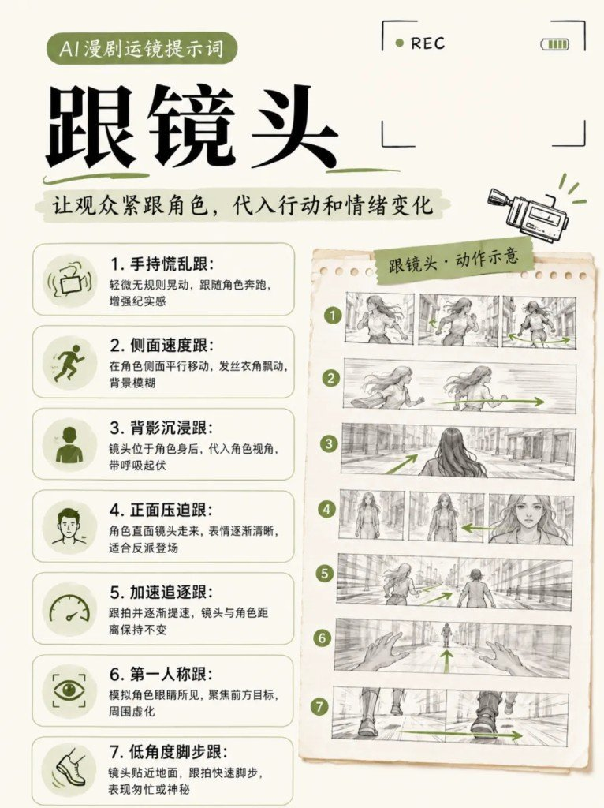
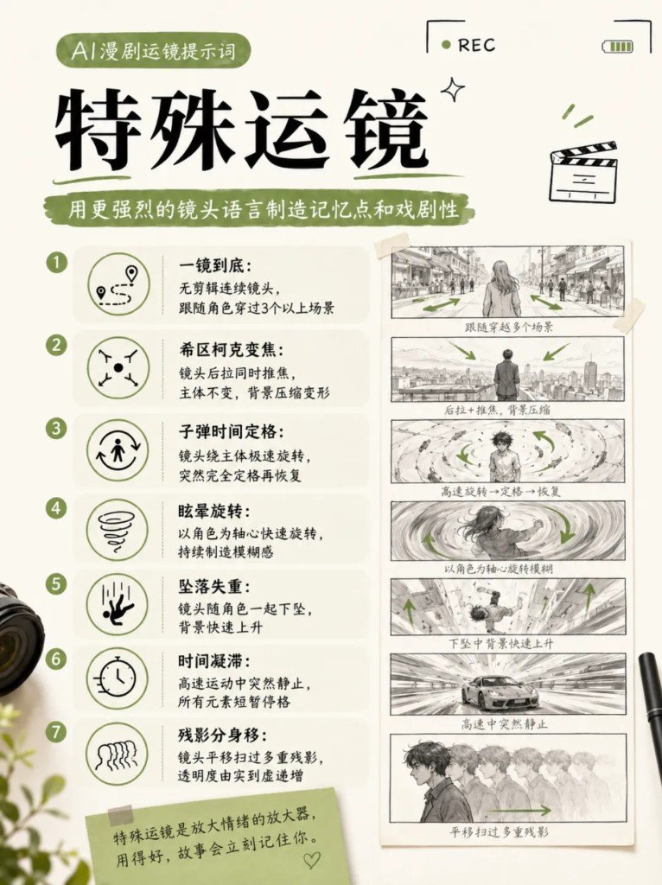

做 AI 漫剧时，人物和场景已经够精致了，镜头却一直钉死——成片还是很容易滑成「会说话的插画」。

真正把情绪带起来的，往往还是运镜本身。

这篇把常用运镜按六个方向拆开：推、拉、摇、移、跟、特殊。每条都是能直接丢进视频模型的提示词思路，不是概念课。

> **计数脚注**：原标题与导语写「36种」；六张信息图上可辨编号条目合计 **39**（推7 + 拉6 + 摇6 + 移6 + 跟7 + 特殊7）。下文按图面实录，不编造、不删条去凑 36。

旁链（不合并）：[静图 Prompt 反推](../2026-08-10_AI图片提示词反推公式/) · [baoyu-comic 分镜流水线](../2026-08-10_baoyu-comic知识漫画工作流拆解/) · [verysmallwoods 视频流水线](../2026-08-10_verysmallwoods视频流水线拆解/) · [MiniMax 当制片](../../Archive/2026-08-06_MiniMax生成体系优化/)

---

## 万用组合，比堆特效管用

```text
[景别] + [运镜动词] + [速度/半径/角度] + [主体动作] + [环境/光影] + [4K+防崩约束]
```

运镜不是越复杂越好，关键是对上剧情要的情绪：

| 想表达 | 更合适的方向 |
|---|---|
| 孤独 | 慢拉 |
| 突出细节 | 缓推 |
| 代入感 | 跟拍 |
| 空间关系 | 摇镜 / 移镜 |
| 爆发、记忆点 | 特殊运镜（别天天上） |

---

## 推镜头：控制距离，放大情绪

把观众的注意力慢慢推向重点。核心：**控制距离，放大情绪，聚焦重点。**


| # | 名称 | 提示词思路（图面原文） |
|---|---|---|
| ① | 慢推情绪 | 3秒内从中景缓推到眼部特写，带轻微呼吸感，适合内心独白 |
| ② | 急推进击 | 全景急推到惊恐面部特写，约0.5秒完成，制造紧张 |
| ③ | 逐层揭示 | 从远景推进到中景，最后定格关键物体 |
| ④ | 瞳孔放大 | 从面部中景急推到眼部大特写，抓住瞳孔变化 |
| ⑤ | 犹豫呼吸推 | 推近1秒，停0.3秒，再拉回0.5秒，重复两次 |
| ⑥ | 冲击回弹推 | 撞击或爆炸瞬间猛推到特写，再轻微回弹 |
| ⑦ | 穿物转场推 | 穿过玻璃、水面或烟雾，模糊后进入新场景 |

---

## 拉镜头：把人拉回环境

把人物拉回环境，让情绪和空间一起出现。


| # | 名称 | 提示词思路（图面原文） |
|---|---|---|
| ① | 孤独慢拉 | 从人物眼泪特写缓慢拉到空荡全景，环境逐渐清晰 |
| ② | 灾难急速拉 | 从角色近景急速拉到大远景，1秒内制造失控感 |
| ③ | 渺小感拉 | 从中景向后拉远，人物逐渐变小，环境占满画面 |
| ④ | 真相反转拉 | 从照片特写急速拉远，展示照片所处的完整场景 |
| ⑤ | 转场拉出 | 从水面、镜面或车窗中拉出，完成虚拟到现实过渡 |
| ⑥ | 晕厥抽离拉 | 从人物面部快速拉远并虚化到全白或全黑 |

---

## 摇镜头：核心是「流动」

通过摇动视角改变观察方式和画面节奏。先分清两件事：

- **摇（Pan）**：镜头水平移动，视野左右展开
- **仰/俯摇（Tilt）**：镜头上下移动，视野上下延展

摇镜头的核心是「流动」——让观众像被带着看，情绪也随之起伏。



| # | 名称 | 提示词思路（图面原文） |
|---|---|---|
| ① | 横摇扫全景 | 镜头水平缓慢摇动，扫过街道或战场全景 |
| ② | 全身展示摇 | 从脚底垂直摇到头顶，展示服饰和姿态 |
| ③ | 极速甩镜 | 急速横摇，制造强烈运动模糊，适合激烈转场 |
| ④ | 悠闲跟随摇 | 缓慢摇动跟随飞鸟、车流等移动物体 |
| ⑤ | 背后有人摇 | 从人物正面缓慢摇到背后并停住，暗示被跟踪 |
| ⑥ | 醉酒来回摇 | 镜头左右来回摇摆，频率渐快，表现眩晕感 |

---

## 移镜头：镜头在空间里走

让镜头在空间中移动，画面会更有现场感。


| # | 名称 | 提示词思路（图面原文） |
|---|---|---|
| ① | 平行跟移 | 镜头与人物平行移动，保持中景，速度匹配步伐 |
| ② | 360°环绕 | 镜头绕主体旋转一整圈，保持轻微仰角 |
| ③ | 滑轨横移 | 平滑横向平移，掠过墙壁、树丛或人群展示细节 |
| ④ | 穿墙转场移 | 横向移动并穿过门框或树丛，遮挡后进入新空间 |
| ⑤ | 弧形绕障移 | 沿弧形轨迹移动，绕过前景障碍物平滑过渡 |
| ⑥ | 垂直升降横移 | 下降的同时横移，形成楼上到楼下的视角切换 |

---

## 跟镜头：把观众拴在角色身上

让观众紧跟角色，代入行动和情绪变化。



| # | 名称 | 提示词思路（图面原文） |
|---|---|---|
| ① | 手持慌乱跟 | 轻微无规则晃动，跟随角色奔跑，增强纪实感 |
| ② | 侧面速度跟 | 在角色侧面平行移动，发丝衣角飘动，背景模糊 |
| ③ | 背影沉浸跟 | 镜头位于角色身后，代入角色视角，带呼吸起伏 |
| ④ | 正面压迫跟 | 角色直面镜头走来，表情逐渐清晰，适合反派登场 |
| ⑤ | 加速追逐跟 | 跟拍并逐渐提速，镜头与角色距离保持不变 |
| ⑥ | 第一人称跟 | 模拟角色眼睛所见，聚焦前方目标，周围虚化 |
| ⑦ | 低角度脚步跟 | 镜头贴近地面，跟拍快速脚步，表现匆忙或神秘 |

---

## 特殊运镜：爆点才上，别当日常调料

用更强烈的镜头语言制造记忆点和戏剧性。特殊运镜是情绪的放大器——用得好，故事会立刻记住你；天天上，观众只会觉得你在炫技。



| # | 名称 | 提示词思路（图面原文） |
|---|---|---|
| ① | 一镜到底 | 无剪辑连续镜头，跟随角色穿过3个以上场景 |
| ② | 希区柯克变焦 | 镜头后拉同时推焦，主体不变，背景压缩变形 |
| ③ | 子弹时间定格 | 镜头绕主体极速旋转，突然完全定格再恢复 |
| ④ | 眩晕旋转 | 以角色为轴心快速旋转，持续制造模糊感 |
| ⑤ | 坠落失重 | 镜头随角色一起下坠，背景快速上升 |
| ⑥ | 时间凝滞 | 高速运动中突然静止，所有元素短暂停格 |
| ⑦ | 残影分身移 | 镜头平移扫过多重残影，透明度由实到虚递增 |

---

## 怎么选，别怎么炫

固定机位再精致，也只是插画会说话。先问剧情要什么情绪，再选推 / 拉 / 摇 / 移 / 跟；只有真需要爆发或记忆点时，再动特殊运镜。

拼口令时按上方公式塞进景别、速度和防崩约束即可——方向对了，复杂运镜不是加分项。
