## 为什么所有技术岗位都应该了解 AI
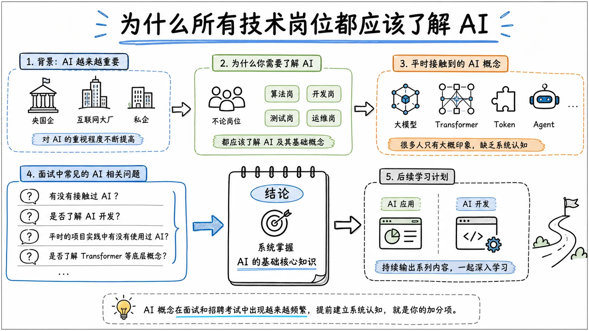

大家好，我是程序员 Dan。今天主要想和大家分享人工智能在计算机校园招聘面试中经常被问到的一些基础核心概念，并按照不同模块整理成一套完整的知识框架。

平时我们或多或少都接触过 AI，也听说过**大模型、Transformer、Token、Agent** 等概念。很多人没有专门查过，只是根据别人的描述形成了一个大概印象。但在面试和招聘考试中，这类 AI 概念出现得越来越频繁。

现在无论是央国企、互联网大厂还是私企，对 AI 的重视程度都在不断提高。因此，不管你找的是算法岗，还是开发、测试、运维等岗位，都应该了解 AI 及其基础概念。

我之前面试一些国企时，也被问到过：

- 有没有接触过 AI；
- 是否了解 AI 开发；
- 平时的项目实践中有没有使用过 AI；
- 是否了解 Transformer 等底层概念。

所以，大家确实有必要系统掌握一些 AI 的基础核心知识。后续关于 AI 应用和 AI 开发，我也打算继续做一系列内容，和大家一起深入学习。

## 一、大模型基础
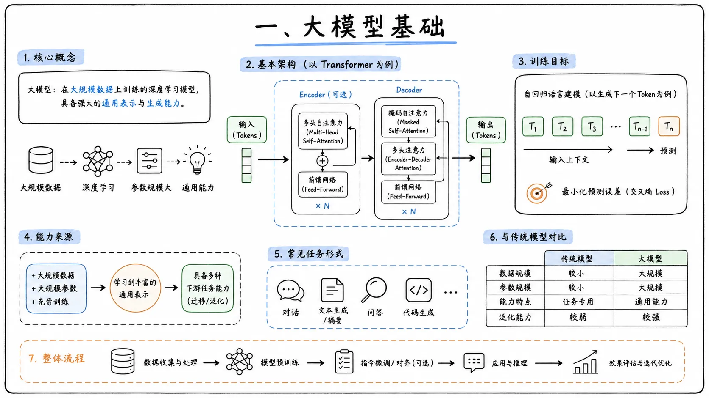

## 大语言模型的本质
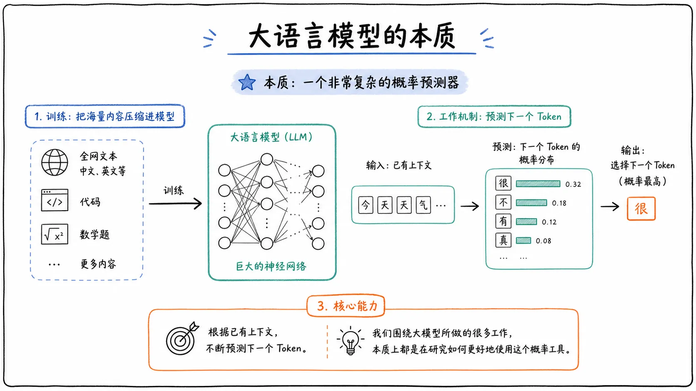

大模型，也就是**大语言模型**（Large Language Model，LLM），本质上是一个非常复杂的概率预测器。

它的训练过程，就像把全网的中文、英文、代码、数学题等内容，全部压缩进一个巨大的神经网络。我们给它一段上文，它并不具备真正的人类意识，而是通过数学计算，推测下一个词或 Token 出现的概率分布。

> 大模型的核心能力，可以理解为：根据已有上下文，不断预测下一个 Token。

因此，我们围绕大模型所做的很多工作，本质上都是在研究如何更好地使用这个概率工具。

## 自回归生成
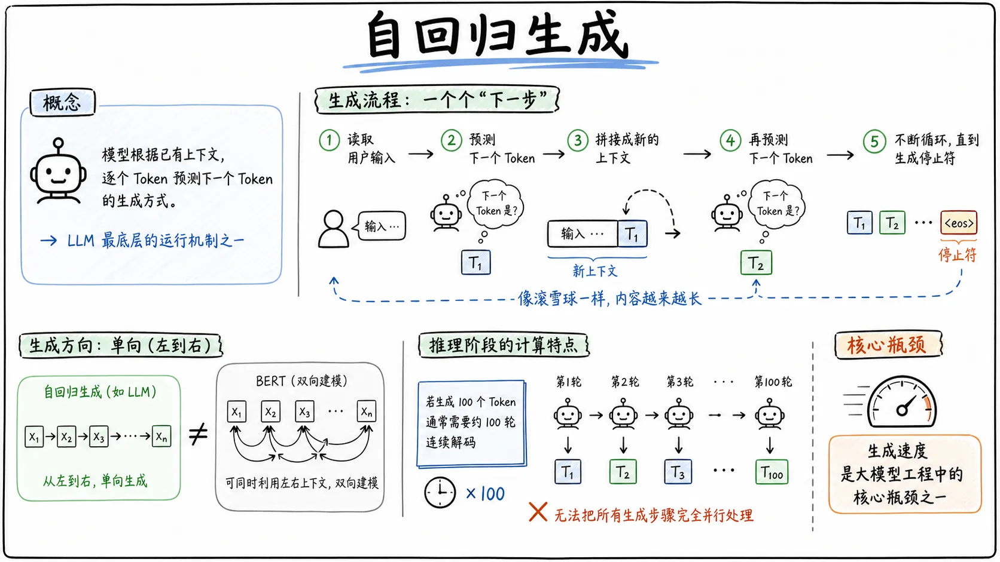

**自回归生成**是指模型根据已有上下文，逐个 Token 预测下一个 Token 的生成方式。它是 LLM 最底层的运行机制之一。

所谓自回归，就是模型把文本生成过程拆成无数个“下一步”：

1. 读取用户输入；
2. 预测下一个 Token；
3. 把刚刚生成的 Token 与原有内容拼接成新的上下文；
4. 再预测下一个 Token；
5. 不断循环，直到生成停止符。

整个过程就像滚雪球一样，生成的内容越来越长。

这种机制决定了模型通常是从左到右、单向生成文本的，不像 BERT 那样能够同时进行双向建模。同时，它也决定了推理阶段的计算特点：如果要生成 100 个 Token，通常就需要进行约 100 轮连续解码，无法把所有生成步骤完全并行处理。

因此，**生成速度是大模型工程中的核心瓶颈之一**。

## Token 与子词切分
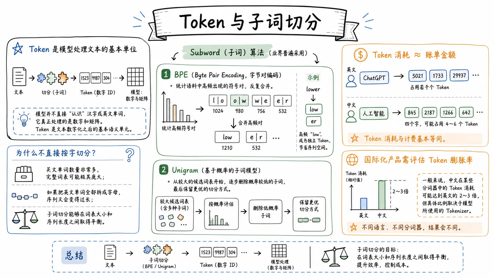

Token 是模型处理文本的基本单位。文本通常会通过 **BPE**、**Unigram** 等算法被切分成子词片段。

简单来说，模型并不直接“认识”汉字或英文单词，它真正处理的是数字和矩阵。Token 就是文本数字化之后的基本语义单元。

为什么不直接按字切分？

- 英文单词数量非常多，完整词表可能极其庞大；
- 如果把英文单词全部拆成字母，序列又会变得过长；
- 子词切分能够在词表大小和序列长度之间取得平衡。

目前业界普遍采用 **Subword（子词）算法**。

### BPE

BPE 的全称是 **Byte Pair Encoding，字节对编码**。它会统计语料中高频出现的符号对，然后反复合并。

例如，`low` 和 `lower` 可能被切分成：

- `low`
- `er`

其中，高频出现的 `low` 可以单独成为一个 Token，从而节省序列空间。

### Unigram

Unigram 通常从一个较大的候选词表开始，逐步删除概率较低的子词，最后保留更优的切分方式。

在实际业务中，Token 消耗基本等同于账单金额。比如：

- 英文 `ChatGPT` 可能占用若干个 Token；
- 中文“人工智能”四个字，也可能占用 4～6 个 Token。

如果要做国际化产品，就必须评估不同语言的 **Token 膨胀率**。一般来说，中文在某些分词器中的 Token 消耗可能达到英文的 2～3 倍，但具体比例取决于模型所使用的 Tokenizer。

## 上下文窗口
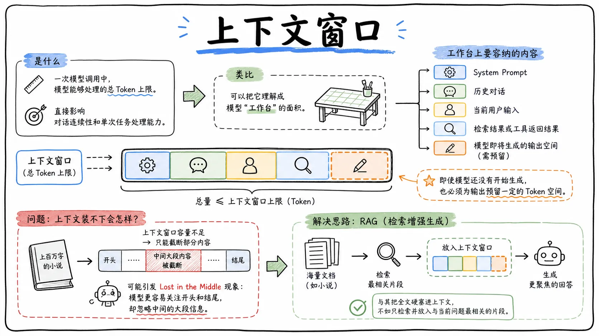

**上下文窗口**是指一次模型调用中，模型能够处理的总 Token 上限。它会直接影响对话连续性和单次任务处理能力。

可以把它理解成模型“工作台”的面积。这个工作台上要同时容纳：

- System Prompt；
- 历史对话；
- 当前用户输入；
- 检索结果或工具返回结果；
- 模型即将生成的输出空间。

即使模型还没有开始生成，也必须为输出预留一定的 Token 空间。

当用户上传一本上百万字的小说时，如果上下文窗口装不下，就只能截断部分内容。这样可能引发 **Lost in the Middle** 现象：模型往往更容易关注开头和结尾，却忽略中间的大段信息。

这也推动了 **RAG（检索增强生成）**的发展。与其把全文硬塞进上下文，不如只检索并放入与当前问题最相关的片段。

## 采样参数
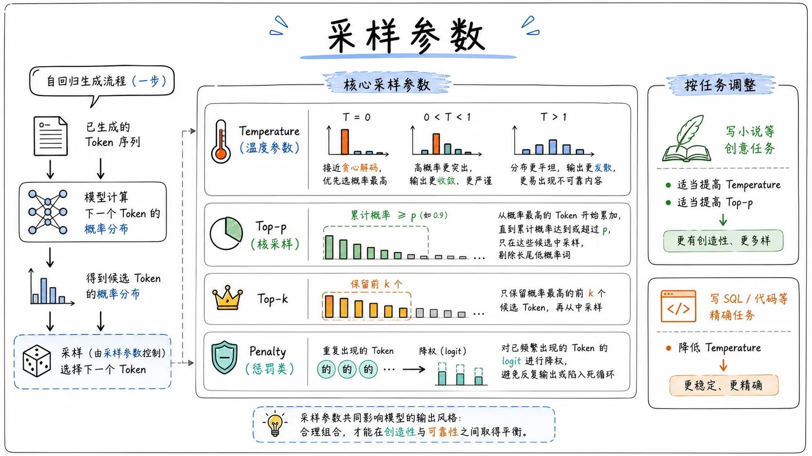

模型通过自回归计算出下一个 Token 的概率分布后，还要决定究竟选择哪一个 Token。这个过程主要由采样参数控制。

### Temperature

**Temperature，也就是温度参数**，用于重塑概率分布。

- 当 `T = 0` 时，通常接近贪心解码，即优先选择概率最高的 Token；
- 当 `0 < T < 1` 时，高概率 Token 更突出，输出更收敛、更严谨；
- 当 `T > 1` 时，概率分布更加平坦，输出更发散，也更容易出现不可靠内容。

### Top-p

Top-p 又叫**核采样**或 **Nucleus Sampling**，属于动态截断方法。

例如将 Top-p 设置为 `0.9`，模型会从概率最高的 Token 开始累加，直到累计概率达到或超过 90%，然后只在这些候选 Token 中采样，剔除概率极低的长尾词。

### Top-k

Top-k 更直接：只保留概率最高的前 `k` 个候选 Token，再从中采样。

### Penalty

重复惩罚、频率惩罚或存在惩罚，会对已经频繁出现的 Token 对应的 **logit** 进行降权，避免模型反复输出“的、的、的”等内容，甚至陷入“复读机”式死循环。

采样参数可以根据任务调整：

- 写小说时，可以适当提高 Temperature 和 Top-p，让内容更有创造性；
- 写 SQL 或代码时，可以降低 Temperature，追求更稳定、精确的输出。

## Prompt 工程
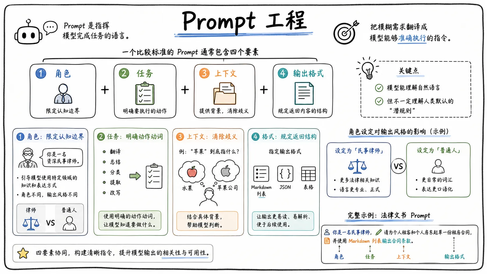

Prompt 是指挥模型完成任务的语言。一个比较标准的 Prompt 通常包含四个要素：

1. **角色**
2. **任务**
3. **上下文**
4. **输出格式**

模型虽然能够理解自然语言，但它不一定理解人类默认的“潜规则”。Prompt 工程要做的，就是把模糊需求翻译成模型能够准确执行的指令。

**角色**用于限定认知边界。例如：

> 你是一名资深民事律师。

这样的角色设定会引导模型更多使用法律相关的知识和表达方式。相反，如果设定为普通人，模型可能会使用更日常的词汇。

**任务**需要使用明确的动作动词，例如：

- 翻译；
- 总结；
- 分类；
- 提取；
- 改写。

**上下文**用于消除歧义。例如“苹果”到底指水果还是苹果公司，需要结合具体背景判断。

**格式**用于规定返回内容的结构。例如，要求模型用 Markdown 列表、JSON 或表格输出。

一个完整的法律文书 Prompt 可以写成：

> 你是一名民事律师，请为个人租客和个人房东起草一份租房合同，并使用 Markdown 列表输出合同条款。

这就是比较标准的四要素框架。

## 结构化输出
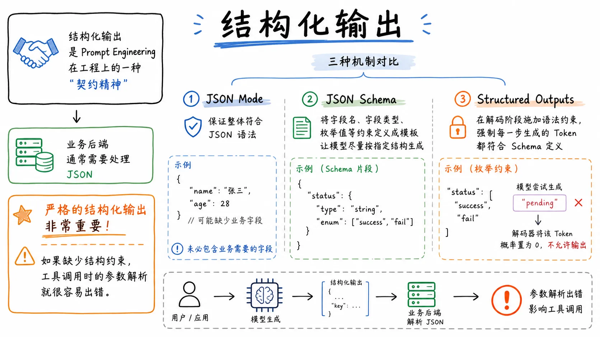

结构化输出可以理解为 Prompt Engineering 在工程上的一种“契约精神”。业务后端通常需要处理 JSON，因此需要通过不同机制约束模型输出。

### JSON Mode

JSON Mode 可以保证输出整体符合 JSON 语法，例如由一对大括号包裹，但它未必能保证其中一定包含业务需要的字段。

### JSON Schema

JSON Schema 会把字段名、字段类型、枚举值等约束定义成模板，让模型尽量按照指定结构生成。

### Structured Outputs

Structured Outputs 不只是通过 Prompt 要求模型遵守结构，而是在解码阶段施加语法约束，强制每一步生成的 Token 都符合 Schema 定义。

例如，某个字段只能从指定枚举值中选择。如果模型试图生成枚举之外的内容，解码器可以直接把对应 Token 的概率置为零，不允许输出。

**严格的结构化输出非常重要**。如果缺少结构约束，工具调用时的参数解析就很容易出错。

## 工具调用
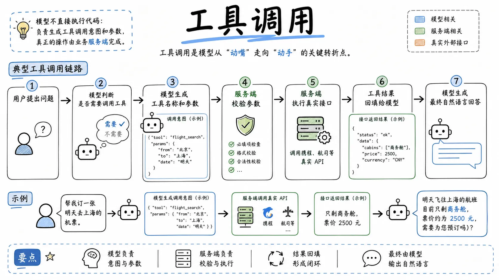

工具调用是模型从“动嘴”走向“动手”的关键转折点。

需要注意的是：**模型本身通常并不直接执行代码，它负责生成工具调用意图和参数，真正的操作由业务服务端完成。**

一个典型的工具调用链路如下：

1. 用户提出问题；
2. 模型判断是否需要调用工具；
3. 模型生成工具名称和参数；
4. 服务端校验参数；
5. 服务端执行真实接口；
6. 工具结果回填给模型；
7. 模型生成最终的自然语言回答。

例如，用户说：

> 帮我订一张明天去上海的机票。

模型会根据上下文判断需要调用机票查询工具，并生成 JSON 格式的调用意图。业务服务端拦截该请求，再调用携程、航司等真实 API。

假设接口返回“只剩商务舱，票价 2500 元”，服务端会把结果回填给模型。模型再将其包装成自然语言：

> 明天飞往上海的航班目前只剩商务舱，票价约为 2500 元，需要为您预订吗？

## Transformer：大模型的“物理心脏”
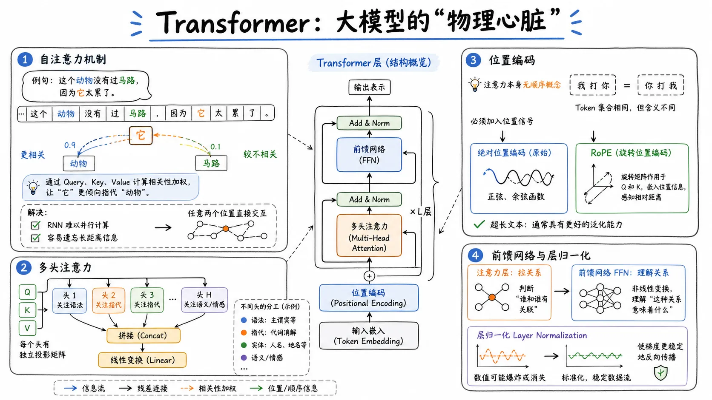

Transformer 可以说是现代大模型的核心架构，其中最重要的机制之一就是**自注意力机制**。

### 自注意力机制

假设有一句话：

> 这个动物没有过马路，因为它太累了。

句子中既有“动物”，又有“马路”。模型怎么知道“它”指的是哪一个？

自注意力机制会通过 Query、Key、Value 之间的计算，让“它”所在位置的向量与前文其他位置的向量进行相关性加权。计算结果可能是：

- “动物”的注意力权重为 0.9；
- “马路”的注意力权重为 0.1。

因此，模型就更倾向于认为“它”指代“动物”。

自注意力机制主要解决了传统 **RNN（循环神经网络）**难以并行计算和容易遗忘长距离信息的问题，使序列中任意两个位置之间的信息都可以直接交互。

### 多头注意力

单个注意力头往往只能捕捉一种关系模式，但自然语言非常复杂，需要同时关注语法、语义、情绪、实体和指代关系。

多头注意力会并行运行多个注意力头，例如 8 个头或 32 个头。每个头都有独立的 Query、Key、Value 投影矩阵。

训练完成后，不同注意力头可能自动形成不同分工：

- 有的头关注主谓宾等语法关系；
- 有的头关注代词和指代消解；
- 有的头关注人名、地名等实体；
- 有的头关注语义或情感。

最后，所有注意力头的结果会被拼接，再经过线性变换输出。

### 位置编码

纯粹的注意力机制本身没有顺序概念。对它来说，“我打你”和“你打我”包含的 Token 集合相同，但两句话的含义显然不同。

因此，必须在输入向量中加入位置信号。

原始 Transformer 使用正弦、余弦函数实现绝对位置编码。现在的一些主流模型，例如 Llama 系列，会使用 **RoPE（旋转位置编码）**，通过旋转矩阵将位置信息嵌入 Query 和 Key，让模型感知相对距离。

这种方式在处理超长文本时，通常具有更好的泛化能力。

### 前馈网络与层归一化

注意力层负责判断“谁和谁有关联”，有点像在“拉关系”；前馈网络 **FFN** 则负责进一步理解“这种关系意味着什么”。

FFN 通常是一个包含非线性激活的全连接网络，用于对每个位置的表示进行独立的非线性变换。大量世界知识并不只存在于注意力模块中，也会沉淀在 FFN 的权重矩阵里。

随着 Transformer 层数不断增加，数值可能出现爆炸或消失。**Layer Normalization（层归一化）**会对每一层的表示进行标准化，像给数据流加了稳定器，使梯度能够更稳定地反向传播。

## 预训练与微调
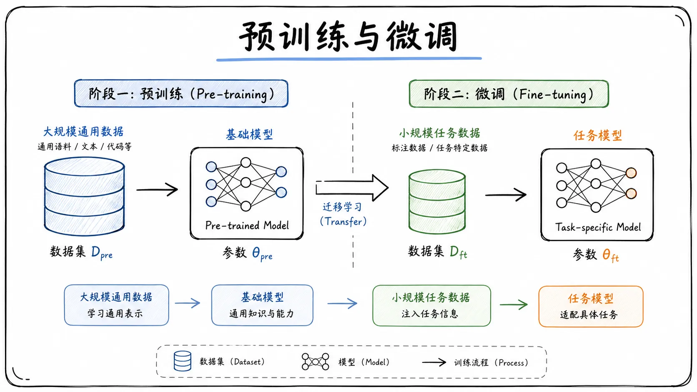

预训练和微调，可以类比成模型的“上学”和“上班”。

### 预训练：基础教育

预训练相当于模型上学，用于学习通用知识。这个阶段可能消耗上万张 GPU 和数万亿个 Token。

预训练阶段的模型主要进行下一 Token 预测，而不是专门学习问答。它通过海量数据学习：

- 语法；
- 语言结构；
- 基本逻辑；
- 推理模式；
- 隐含的世界知识。

预训练得到的 Base 模型可能文理都懂，但不一定会聊天。你对它说“你好”，它可能继续补全成：

> 你好，今天天气不错……

而不是像助理一样主动回应。它懂知识，但还不熟悉对话格式。

### SFT：监督微调

**SFT（Supervised Fine-Tuning，监督微调）**类似于让模型模仿学霸的标准答案。

我们可以构造几十万条高质量的“问题——标准答案”数据，让模型学习看到问题后应该以什么格式回答。

SFT 主要解决格式和行为对齐问题，让模型学会像正常助理一样组织答案。

### RLHF：基于人类反馈的强化学习

**RLHF（Reinforcement Learning from Human Feedback）**类似于训练导盲犬。

SFT 主要是模仿，但模型未必知道答案的好坏。RLHF 会先训练一个 Reward Model，也就是偏好打分模型。模型生成多个答案后，由人类或 AI 裁判进行偏好排序，再通过 PPO 等强化学习算法调整参数，使模型更倾向于生成高分答案。

另外，也可以使用 **DPO（Direct Preference Optimization，直接偏好优化）**直接进行偏好对齐。

可以这样理解：

- SFT 让模型知道“应该怎么答”；
- RLHF 或 DPO 让模型知道“怎么答才更讨喜、更安全、更符合人类价值观”。

例如，面对违法或危险内容，单纯经过 SFT 的模型未必知道应该拒绝，而经过偏好对齐后，模型会强化安全拒答行为。

## 二、Agent：从回答问题到自主执行任务
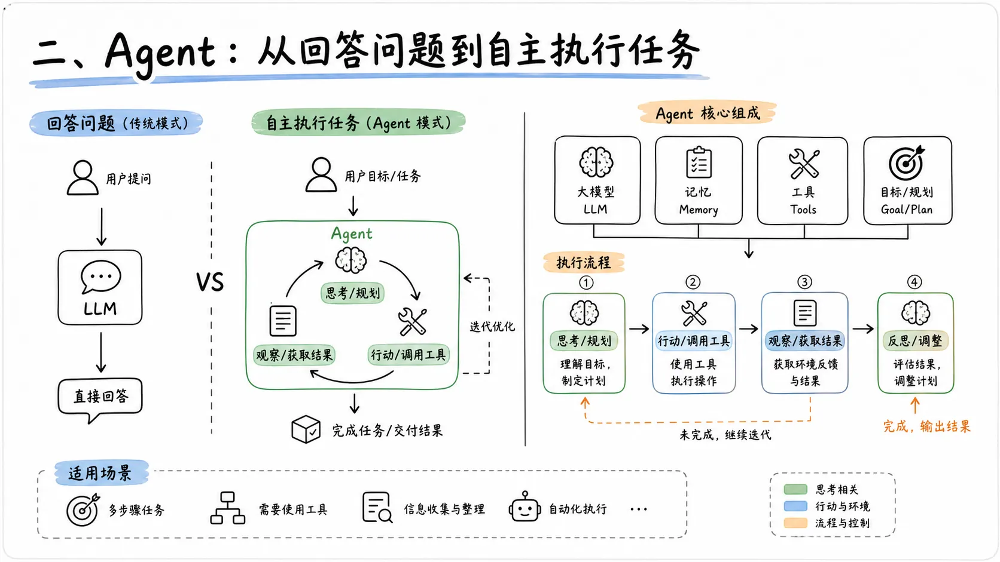

## Agent 的定义
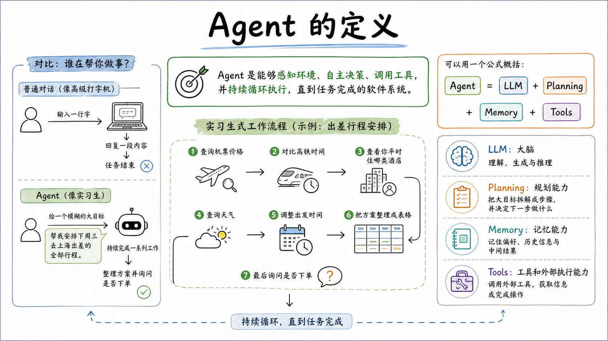

使用 DeepSeek 或 ChatGPT 时，如果你输入一行字，它回复一段内容，然后任务就结束了，这更像一台高级打字机。

Agent，也就是**智能体**，则更像你手下的一名实习生。你给它一个模糊的大目标，例如：

> 帮我安排下周三去上海出差的全部行程。

它不能只回复一句“好的”，而是要继续完成一系列工作：

- 查询机票价格；
- 对比高铁时间；
- 查看你平时住哪类酒店；
- 查询天气；
- 调整出发时间；
- 把方案整理成表格；
- 最后询问是否下单。

> Agent 是能够感知环境、自主决策、调用工具，并持续循环执行，直到任务完成的软件系统。

可以用一个公式概括：

**Agent = LLM + Planning + Memory + Tools**

也就是：

- LLM：大脑；
- Planning：规划能力；
- Memory：记忆能力；
- Tools：工具和外部执行能力。

## 推理与规划
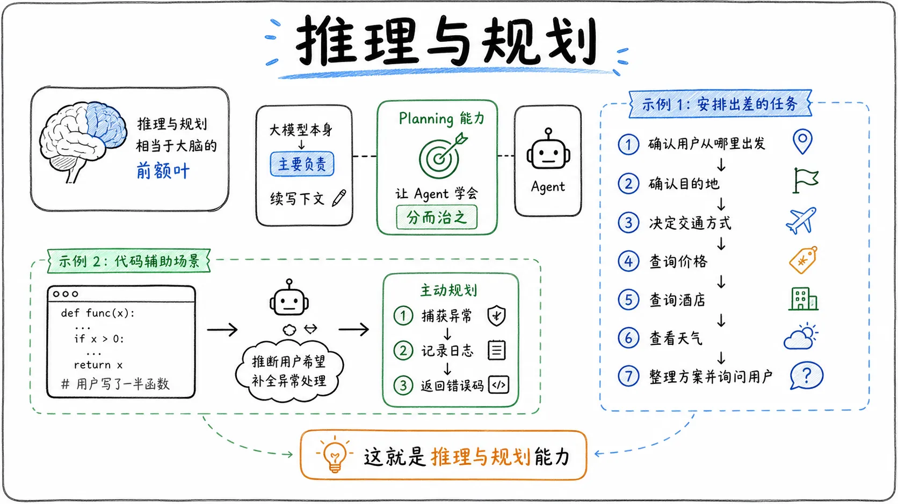

推理与规划相当于大脑的前额叶。

大模型本身主要负责续写下文，但不天然擅长长期目标管理。Planning 能力可以让 Agent 学会分而治之。

例如，接到安排出差的任务后，规划模块可能会形成以下步骤：

1. 确认用户从哪里出发；
2. 确认目的地；
3. 决定交通方式；
4. 查询价格；
5. 查询酒店；
6. 查看天气；
7. 整理方案并询问用户。

在代码辅助场景中，如果用户写了一半函数，Agent 可能推断用户希望补全异常处理，于是主动规划：

1. 捕获异常；
2. 记录日志；
3. 返回错误码。

这就是推理与规划能力。

## 记忆系统
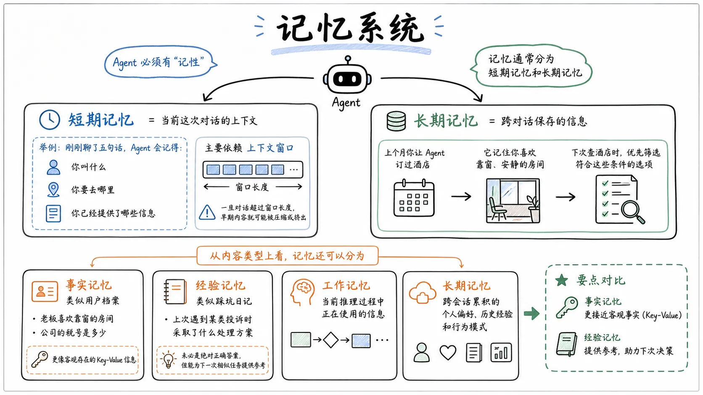

Agent 必须有“记性”，记忆通常分为短期记忆和长期记忆。

### 短期记忆

短期记忆就是当前这次对话的上下文。

如果你们刚刚聊了五句话，Agent 会记得：

- 你叫什么；
- 你要去哪里；
- 你已经提供了哪些信息。

短期记忆主要依赖上下文窗口。一旦对话超过窗口长度，早期内容就可能被压缩或挤出。

### 长期记忆

长期记忆是跨对话保存的信息。

例如，你上个月让 Agent 订过酒店，它记住你喜欢靠窗、安静的房间。下次查酒店时，它就会优先筛选符合这些条件的选项。

从内容类型上看，记忆还可以分为：

- **事实记忆**：类似用户档案，例如老板喜欢靠窗的房间、公司的税号是多少；
- **经验记忆**：类似踩坑日记，例如上次遇到某类投诉时采取了什么处理方案；
- **工作记忆**：当前推理过程中正在使用的信息；
- **长期记忆**：跨会话累积的个人偏好、历史经验和行为模式。

事实记忆更像客观存在的 Key-Value 信息；经验记忆未必是绝对正确答案，但能为下一次相似任务提供参考。

## 工具：Agent 的手脚
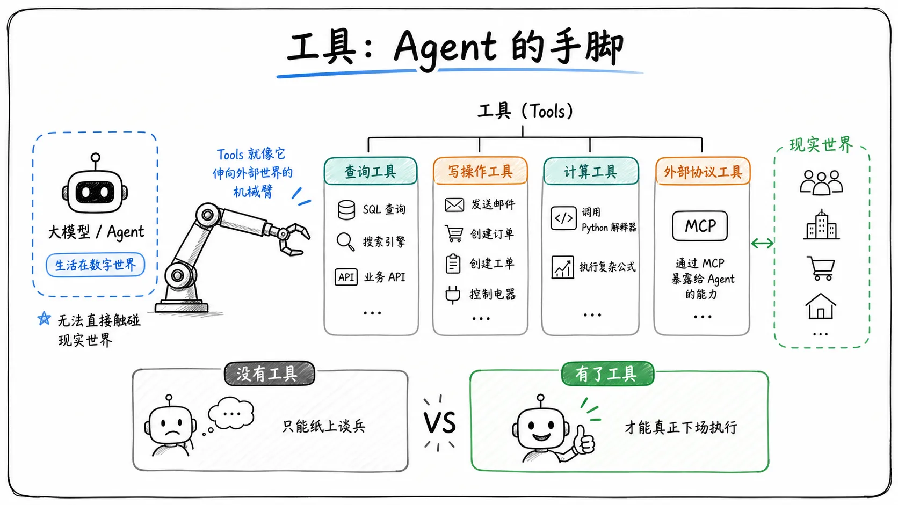

大模型生活在数字世界里，无法直接触碰现实世界。Tools 就像它伸向外部世界的机械臂。

工具可以包括：

- **查询工具**：SQL 查询、搜索引擎、业务 API；
- **写操作工具**：发送邮件、创建订单、创建工单、控制电器；
- **计算工具**：调用 Python 解释器执行复杂公式；
- **外部协议工具**：通过 MCP 暴露给 Agent 的能力。

没有工具，Agent 只能纸上谈兵；有了工具，它才能真正下场执行。

## Observation：观察与自我纠错
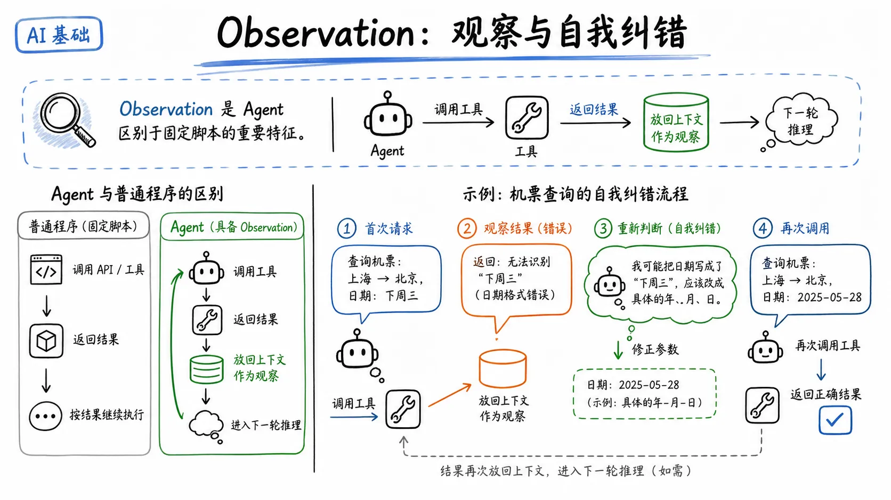

Observation 是 Agent 区别于固定脚本的重要特征。

普通程序调用 API 后，通常按照返回结果继续执行；Agent 调用工具之后，还会把返回结果重新放回上下文，作为新的观察信息，再进行下一轮推理。

例如，查询机票工具返回：

```text
Error：日期格式错误
```

Agent 观察到错误后，会重新判断：

> 我可能把日期写成了“下周三”，应该改成具体的年、月、日。

于是它修正参数并再次调用工具。这就是 Agent 的自我纠错机制。

## Agent 的运行循环
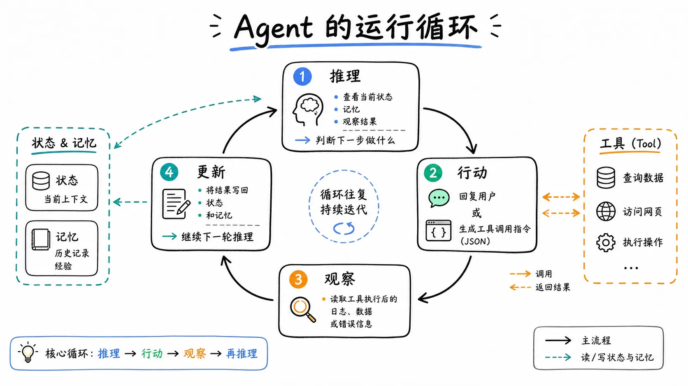

Agent 的核心循环可以概括为：

**推理 → 行动 → 观察 → 再推理**

- **推理**：查看当前状态、记忆和观察结果，判断下一步做什么；
- **行动**：回复用户，或者生成某个工具的 JSON 调用指令；
- **观察**：读取工具执行后的日志、数据或错误信息；
- **更新**：将结果写回状态和记忆，继续下一轮推理。

## 两种工作模式
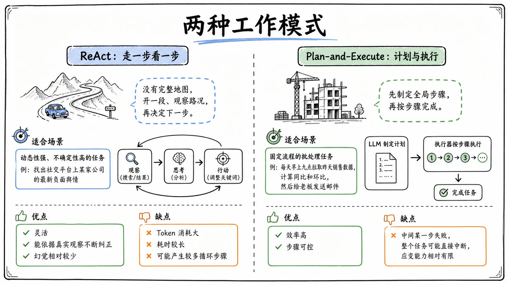

### ReAct：走一步看一步

ReAct 模式可以理解为在陌生山路上开车：没有完整地图，只能开一段、观察路况，再决定下一步。

它适合动态性强、不确定性高的任务。例如：

> 找出社交平台上关于某家公司的最新负面舆情。

搜索结果无法提前确定，因此 Agent 必须根据实时结果不断调整下一轮搜索关键词。

它的优点是：

- 灵活；
- 能依据真实观察不断纠正；
- 幻觉相对较少。

缺点是：

- Token 消耗大；
- 耗时较长；
- 可能产生较多循环步骤。

### Plan-and-Execute：计划与执行

计划与执行模式会先由 LLM 制定全局步骤，再由执行器按步骤完成。

这就像盖大楼：设计师先把打地基、砌墙、装修等步骤画成蓝图，执行器再按图施工。

它适合固定流程的批处理任务，例如：

> 每天早上九点拉取昨天的销售数据，计算同比和环比，然后给老板发送邮件。

这种模式效率高、步骤可控，但如果中间某一步失败，整个任务可能直接中断，应变能力相对有限。

## 工作流与有向图
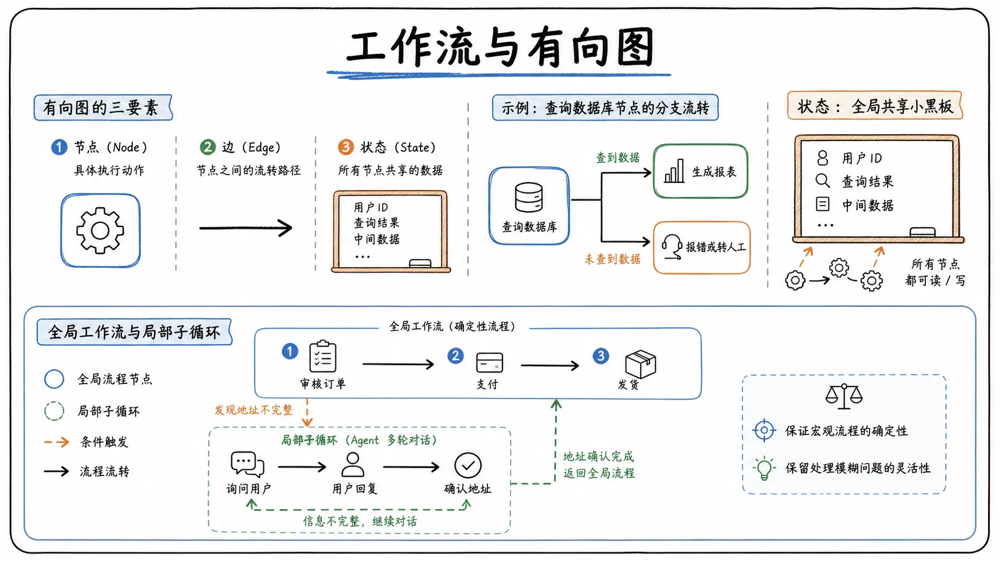

当 Agent 任务非常复杂时，不能让代码变成一团 `if-else`。这时可以使用有向图管理工作流。

有向图主要包含：

- **节点**：具体执行动作；
- **边**：节点之间的流转路径；
- **状态**：所有节点共享的数据。

例如，“查询数据库”可以作为一个节点：

- 如果查到数据，就进入“生成报表”节点；
- 如果没查到数据，就进入“报错或转人工”节点。

状态则像一块全局共享的小黑板，所有节点都可以在上面读写用户 ID、中间查询结果等信息。

### 全局工作流与局部子循环

可以在固定的全局工作流中，嵌入局部 Agent 子循环。

例如，全局流程是：

1. 审核订单；
2. 支付；
3. 发货。

如果在审核订单时发现用户地址不完整，系统不直接报错，而是启动一个子 Agent，与用户进行多轮对话，直到确认地址。确认完成后，再返回全局流程中的支付节点。

这样既能保证宏观流程的确定性，又保留了 Agent 处理模糊问题的灵活性。

## 上下文工程
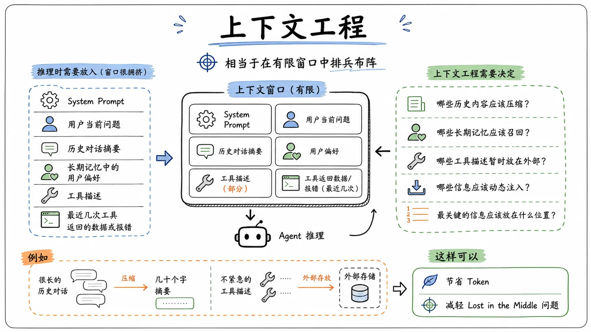

上下文工程相当于在有限窗口中排兵布阵。

Agent 每次推理时，上下文窗口都非常拥挤，需要同时放入：

- System Prompt；
- 用户当前问题；
- 历史对话摘要；
- 长期记忆中的用户偏好；
- 工具描述；
- 最近几次工具返回的数据或报错。

上下文工程需要决定：

- 哪些历史内容应该压缩；
- 哪些长期记忆应该召回；
- 哪些工具描述暂时放在外部；
- 哪些信息应该动态注入；
- 最关键的信息应该放在什么位置。

例如，可以把很长的历史对话压缩成几十个字的摘要；不紧急的工具描述先放在外部，只有 Agent 判断需要使用时再动态加载。

这样既可以节省 Token，又能减轻 Lost in the Middle 问题。

## 三、RAG：给大模型外挂一座图书馆
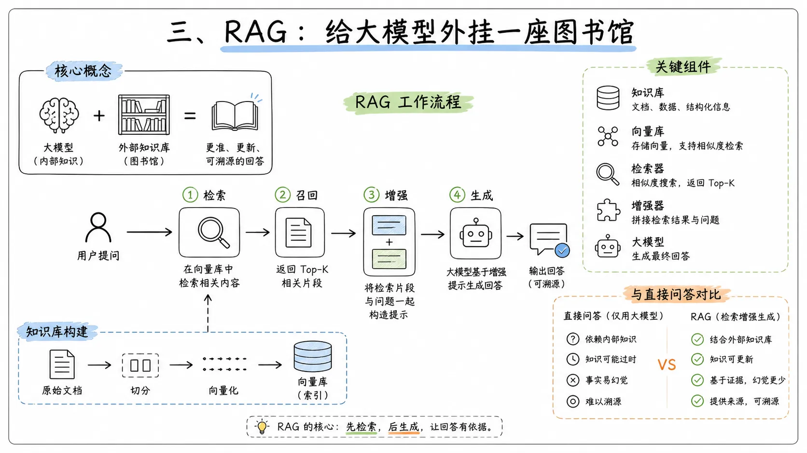

## 纯大模型的三类硬伤
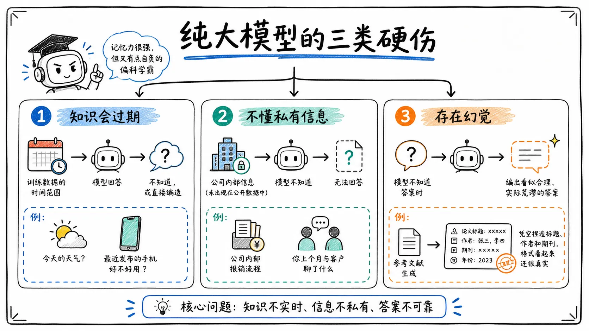

纯大模型像一个记忆力很强、但又有点自负的偏科学霸，主要有三个硬伤。

### 1. 知识会过期

模型的知识通常截止于训练数据覆盖的时间。你问它今天的天气，或者最近发布的手机好不好用，它可能不知道，也可能直接编造。

### 2. 不懂私有信息

模型不知道公司的内部报销流程，也不知道你上个月与客户聊了什么，因为这些信息并没有公开出现在训练数据中。

### 3. 存在幻觉

模型不知道答案时，不一定会像正常人一样说“我不知道”，反而可能编出一个看似合理、实际荒谬的答案。

例如，让模型生成论文参考文献时，它可能凭空捏造论文标题、作者和期刊，而且格式看起来还很真实。

## RAG 的核心理念
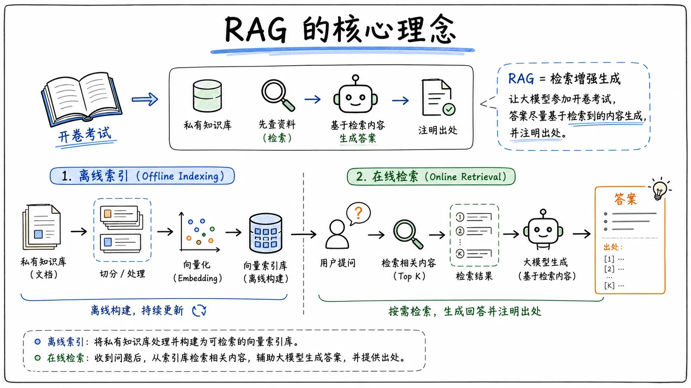

**RAG（Retrieval-Augmented Generation，检索增强生成）**可以缓解以上问题。

它的理念很简单：让大模型参加开卷考试。

用户指定一个私有知识库，模型回答问题前先从知识库中查资料，答案尽量基于检索到的内容生成，并注明出处。

RAG 通常包含两条工作链路：

1. **离线索引**
2. **在线检索**

## 离线索引
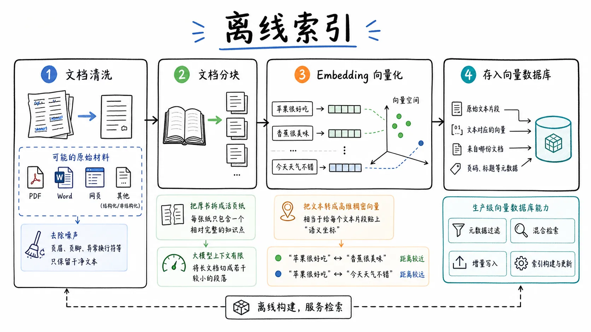

离线索引相当于把杂乱无章的书籍整理成标准化索引，主要包括：

1. 文档清洗；
2. 文档分块；
3. Embedding 向量化；
4. 存入向量数据库。

### 文档清洗

原始材料可能来自：

- PDF；
- Word；
- 网页；
- 其他结构化或非结构化文件。

这些材料中可能存在页眉、页脚、异常换行符等噪声。文档清洗要尽可能去掉无关内容，只保留干净文本。

### 文档分块

分块就像把一本厚书拆成一张张活页纸，每张纸只包含一个相对完整的知识点。

大模型一次能处理的内容有限，不能把上百万字的整本书全部塞进上下文，因此要把文档切成若干较小的段落。

### Embedding 向量化

Embedding 会把文本转换成高维稠密向量，相当于给每个文本片段贴上“语义坐标”。

语义越接近的文本，在向量空间中的距离通常越近。例如：

- “苹果很好吃”和“香蕉很美味”距离较近；
- “苹果很好吃”和“今天天气不错”距离较远。

### 存入向量数据库

最后，把以下内容一起写入向量数据库：

- 原始文本片段；
- 文本对应的向量；
- 文本来自哪份文档；
- 页码、标题等元数据。

生产级向量数据库通常还会提供：

- 元数据过滤；
- 混合检索；
- 增量写入；
- 索引构建与更新。

## 在线检索
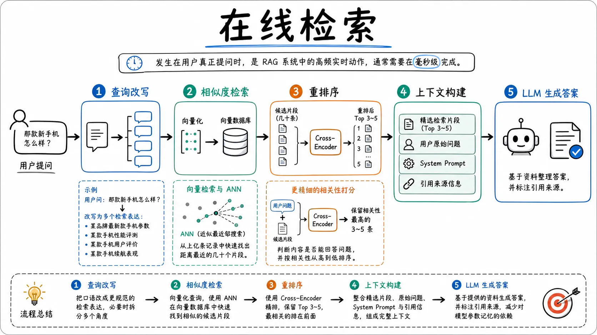

在线检索发生在用户真正提问时，是 RAG 系统中的高频实时动作，通常需要在毫秒级完成。

完整流程包括：

1. 查询改写；
2. 相似度检索；
3. 重排序；
4. 上下文构建；
5. LLM 生成答案。

### 查询改写

用户提问往往非常随意，直接拿口语去知识库搜索，可能很难命中。因此，可以使用模型把口语改成更规范的检索表达，甚至拆成多个角度。

例如，用户问：

> 那款新手机怎么样？

系统可能将其改写为：

- 某品牌最新款手机参数；
- 某款手机性能评测；
- 某款手机用户评价；
- 某款手机续航表现。

### 向量检索与 ANN

改写后的查询也会被转换成向量，然后到向量数据库中查找距离最近的几十个片段。

常用方法是 **ANN（Approximate Nearest Neighbor，近似最近邻搜索）**。它不追求绝对精确，而是利用高效索引结构，从上亿条记录中快速找出最相似的若干结果。

### 重排序

向量检索得到的几十条内容只是“看起来相似”，还需要更精细的模型进行打分。

重排序通常使用 **Cross-Encoder（交叉编码器）**，将用户问题和候选片段拼接到一起，深入判断这段内容到底能否回答问题。

最终可以保留相关性最高的 3～5 条，并把最相关的内容排在前面。

### 上下文构建与生成

最后，将以下内容一起放入大模型上下文：

- 精选检索片段；
- 用户原始问题；
- System Prompt；
- 引用来源信息。

模型手里有了资料，就不需要完全依赖参数记忆，而是可以基于资料整理答案，并标注引用来源。

## 文档切分是一门手艺
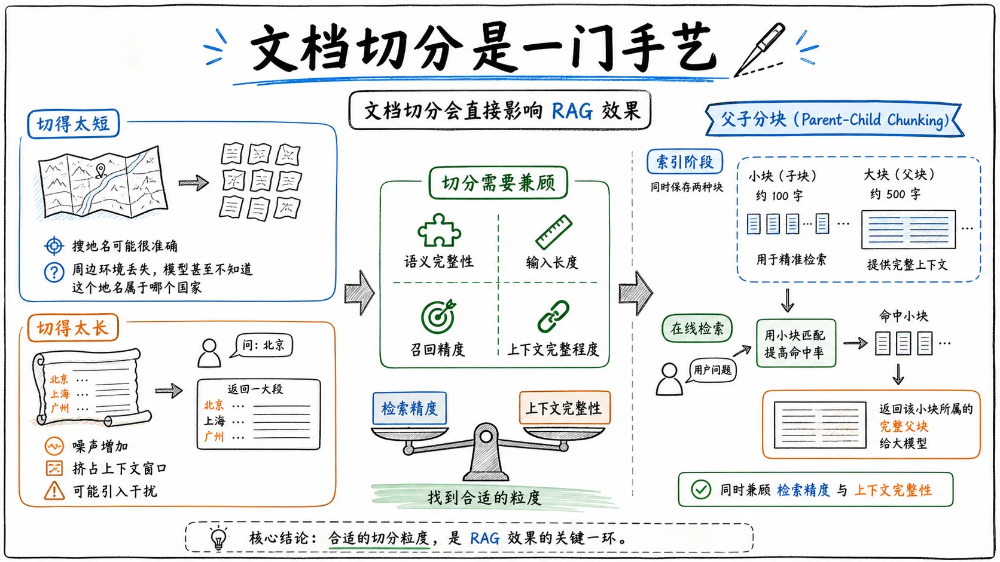

文档切分会直接影响 RAG 效果。

如果切得太短，例如每块只有 50 个字，就像把完整地图撕成很多小碎片。虽然搜索地名时可能很准确，但周边环境丢失了，模型甚至不知道这个地名属于哪个国家。

如果切得太长，虽然保留了完整背景，但噪声也会增加。例如用户只问北京，却返回一整段同时包含北京、上海、广州的内容，不仅挤占上下文窗口，还可能引入干扰。

因此，切分需要兼顾：

- 语义完整性；
- 输入长度；
- 召回精度；
- 上下文完整程度。

### 父子分块

工业界常见的一种方案是**父子分块**。

索引时同时保存两种块：

- 小块，例如 100 字，用于精准检索；
- 大块，例如 500 字，用于提供完整上下文。

在线检索时，用小块匹配用户问题，提高命中率；返回给大模型时，则把小块所属的完整父块一起返回。

这样能够同时兼顾检索精度和上下文完整性。

## 混合检索
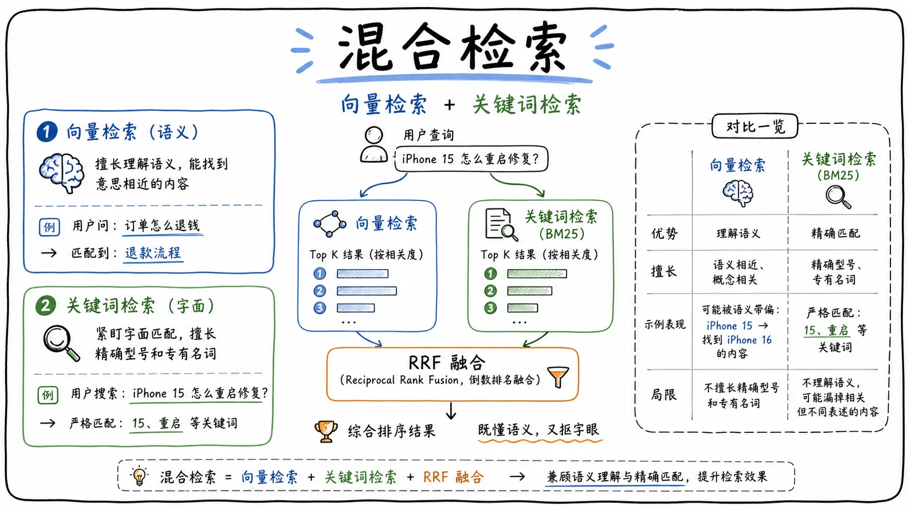

混合检索通常是：

**向量检索 + 关键词检索**

向量检索擅长理解语义。例如用户问“订单怎么退钱”，它可以匹配到“退款流程”。

但向量检索有时不擅长处理精确型号和专有名词。关键词检索，例如 **BM25**，则会紧盯字面匹配。

例如用户搜索：

> iPhone 15 怎么重启修复？

向量模型可能被“iPhone”这一整体语义带偏，找到 iPhone 16 的内容；BM25 则会更严格地匹配“15”和“重启”等关键词。

两类结果可以通过 **RRF（Reciprocal Rank Fusion，倒数排名融合）**进行综合排序，达到既懂语义、又抠字眼的效果。

## 查询改写的五种操作
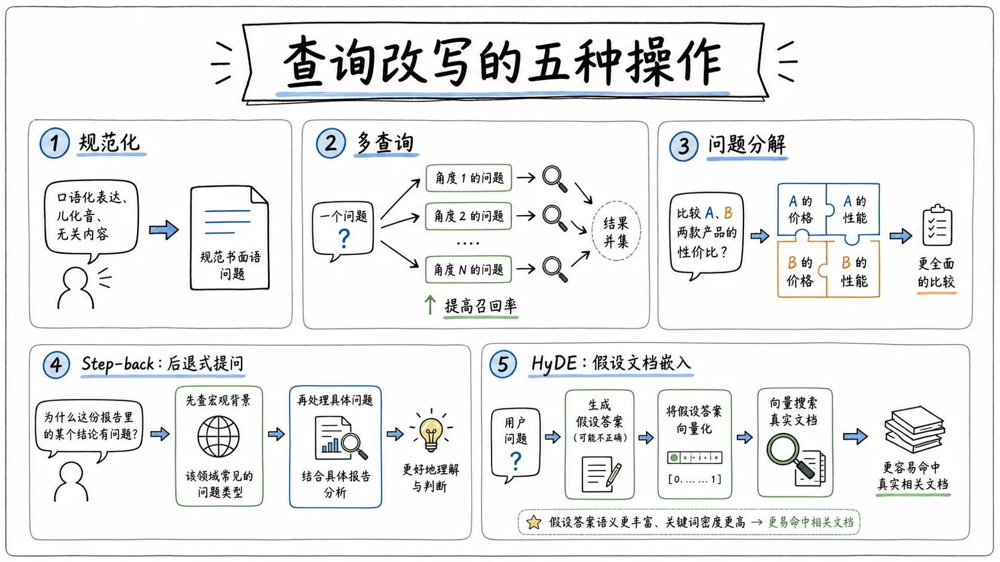

### 1. 规范化

去掉口语化表达、儿化音或无关内容，把问题转换为规范书面语。

### 2. 多查询

把一个问题扩展成多个角度的问题，分别检索，再对结果取并集，以提高召回率。

### 3. 问题分解

如果用户要比较 A、B 两款产品的性价比，可以拆成：

- A 的价格；
- A 的性能；
- B 的价格；
- B 的性能。

这样可以实现更全面的比较。

### 4. Step-back：后退式提问

先查询宏观背景，再处理具体问题。

例如，用户问“为什么这份报告里的某个结论有问题”，系统可以先查询该领域常见的问题类型，获取全局背景，再结合具体报告分析。

### 5. HyDE：假设文档嵌入

**HyDE（Hypothetical Document Embeddings）**是一种比较巧妙的做法。

它不会直接用用户的简短问题搜索，而是先让大模型根据问题生成一个“假设答案”，再用这个假设答案的向量搜索真实文档。

假设答案可能不正确，但它的语义风格和关键词密度通常比原始问题更丰富，因此更容易命中真实相关文档。

## 向量检索与重排序的黄金组合
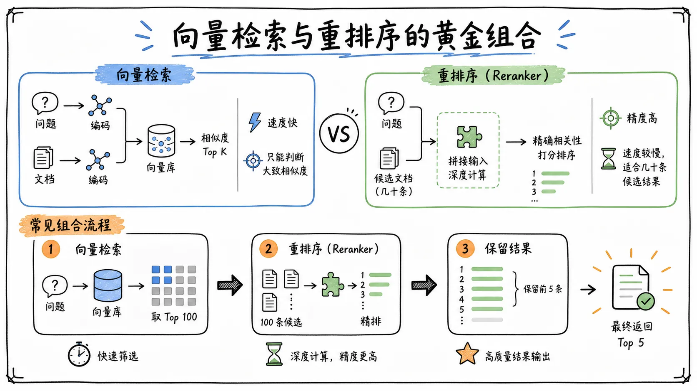

向量检索会把问题和文档分别编码，速度快，但只能判断大致相似度。

重排序会把问题和文档拼在一起交给模型深度计算，精度高，但速度较慢，通常只适合处理几十条候选结果。

一种常见组合是：

1. 先用向量检索快速筛出 100 条；
2. 再用 Reranker 精排；
3. 最终保留前 5 条。

## GraphRAG
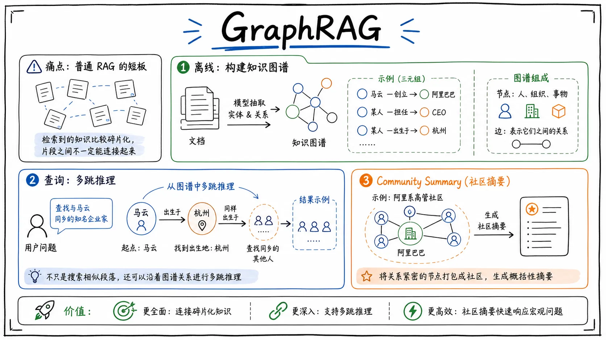

普通 RAG 的一个短板是：检索到的知识比较碎片化，片段之间不一定能连接起来。

**GraphRAG** 会在离线阶段使用模型抽取文档中的实体和关系，建立知识图谱。

例如：

- 马云 —— 创立 —— 阿里巴巴；
- 某人 —— 担任 —— CEO；
- 某人 —— 出生于 —— 杭州。

图谱中的节点可以是人、组织或事物，边则表示它们之间的关系。

查询时，GraphRAG 不只是搜索相似段落，还可以沿着图谱关系进行多跳推理。例如：

> 查找与马云同乡的知名企业家。

系统可以从“马云”节点出发，找到“出生地：杭州”，再从“杭州”节点查找其他同样关联该出生地的人。

GraphRAG 还可以生成 **Community Summary（社区摘要）**。例如，将阿里系高管打包成一个关系紧密的社区，并生成概括性摘要。用户提出宏观问题时，可以直接返回社区摘要，提高效率。

## RAG 的评估指标
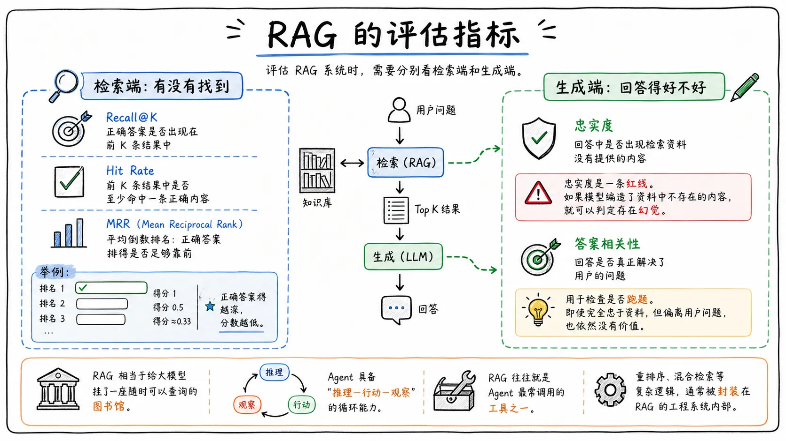

评估 RAG 系统时，需要分别看检索端和生成端。

### 检索端：有没有找到

常见指标包括：

- **Recall@K**：正确答案是否出现在前 K 条结果中；
- **Hit Rate**：前 K 条结果中是否至少命中一条正确内容；
- **MRR（Mean Reciprocal Rank，平均倒数排名）**：正确答案排得是否足够靠前。

例如：

- 正确答案排第一，得 1 分；
- 排第二，得 0.5 分；
- 排第三，得约 0.33 分。

正确答案埋得越深，分数越低。

### 生成端：回答得好不好

生成端主要关注：

- **忠实度**：回答中是否出现检索资料没有提供的内容；
- **答案相关性**：回答是否真正解决了用户的问题。

忠实度是一条红线。如果模型编造了资料中不存在的内容，就可以判定存在幻觉。

答案相关性则用于检查是否跑题。用户问苹果手机，系统却检索到苹果种植技术，即使回答完全忠于资料，也依然没有价值。

> RAG 相当于给大模型挂了一座随时可以查询的图书馆。

Agent 具备“推理——行动——观察”的循环能力，而 RAG 往往就是 Agent 最常调用的工具之一。至于重排序、混合检索等复杂逻辑，通常都会被封装在 RAG 的工程系统内部。

## 四、MCP 与 Skills：连接工具和沉淀经验
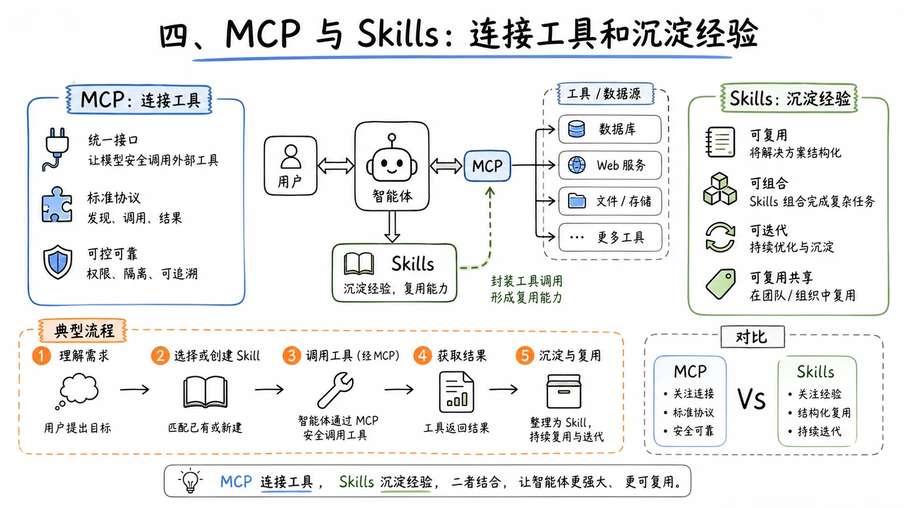

## MCP 是什么
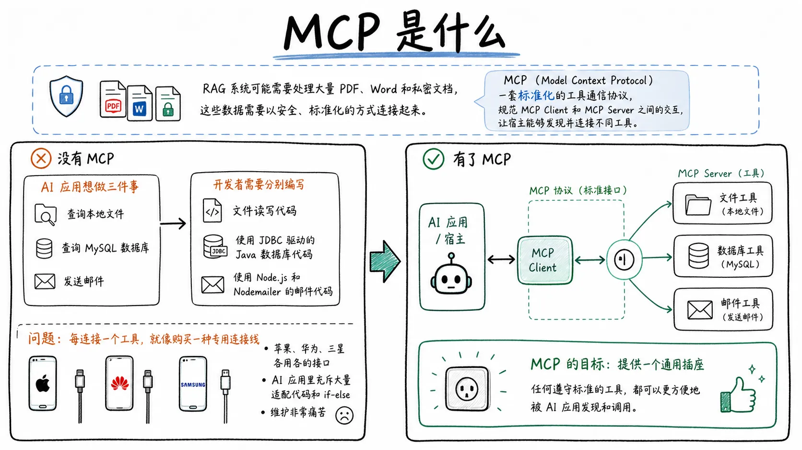

RAG 系统可能需要处理大量 PDF、Word 和私密文档，这些数据需要以安全、标准化的方式连接起来。

**MCP（Model Context Protocol，模型上下文协议）**是一套标准化的工具通信协议，用于规范 MCP Client 和 MCP Server 之间的交互，让宿主能够发现并连接不同工具。

如果没有 MCP，一个 AI 应用想做三件事：

- 查询本地文件；
- 查询 MySQL 数据库；
- 发送邮件。

开发者可能需要分别编写：

- 文件读写代码；
- 使用 JDBC 驱动的 Java 数据库代码；
- 使用 Node.js 和 Nodemailer 的邮件代码。

每连接一个工具，就像购买一种专用连接线：苹果、华为、三星各用各的接口。最终，AI 应用里会充斥大量适配代码和 `if-else`，维护非常痛苦。

MCP 的目标就是提供一个通用插座。任何遵守标准的工具，都可以更方便地被 AI 应用发现和调用。

## 三层关系
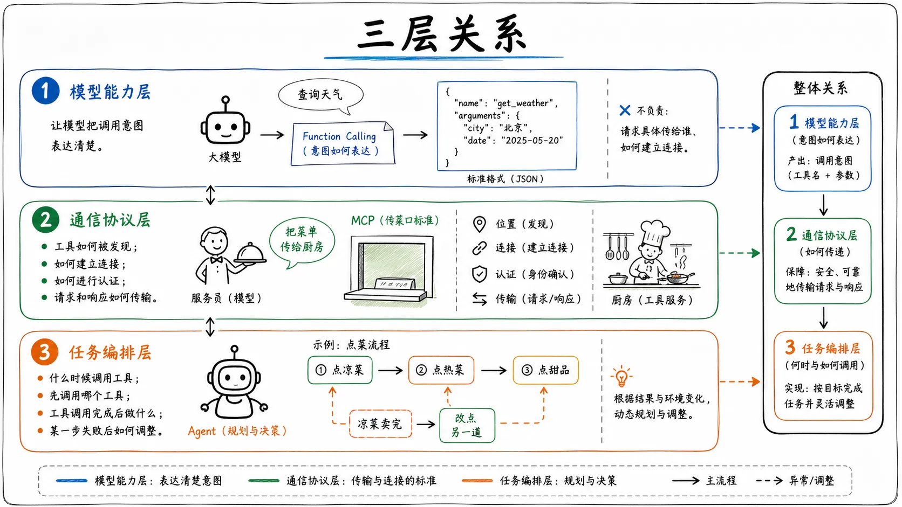

### 1. 模型能力层

模型能力层负责让模型把调用意图表达清楚。

例如，大模型决定查询天气后，需要用标准格式表达工具名称和参数，通常是 JSON。这属于 Function Calling 的职责。

Function Calling 负责“意图如何表达”，但不负责请求具体传给谁、如何建立连接。

### 2. 通信协议层

通信协议层负责：

- 工具如何被发现；
- 如何建立连接；
- 如何进行认证；
- 请求和响应如何传输。

可以把模型比作服务员。服务员写好了菜单，接下来要把菜单传给厨房。MCP 规定了传菜口的位置、盘子的尺寸、身份如何确认等标准。

它不关心菜单上具体是什么菜，只关心请求能否安全、可靠地传到厨房。

### 3. 任务编排层

任务编排层负责决定：

- 什么时候调用工具；
- 先调用哪个工具；
- 工具调用完成后做什么；
- 某一步失败后如何调整。

例如，先点凉菜，再点热菜，最后点甜品；如果凉菜卖完了，就改点另一道。这些属于 Agent 的规划和决策能力。

## MCP Server
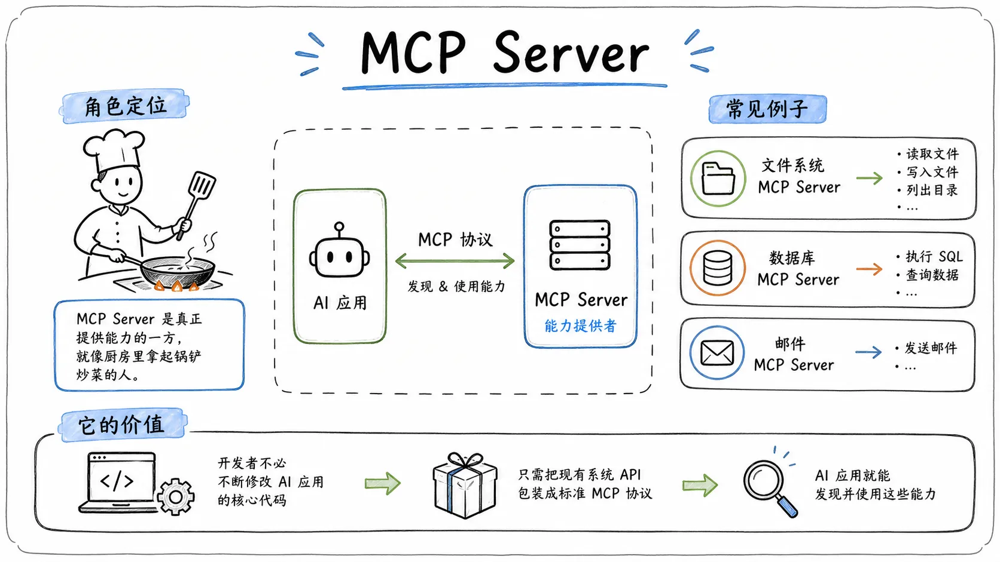

MCP Server 是真正提供能力的一方，就像厨房里拿起锅铲炒菜的人。

常见例子包括：

- 文件系统 MCP Server：暴露读取文件、写入文件、列出目录等能力；
- 数据库 MCP Server：暴露执行 SQL、查询数据等能力；
- 邮件 MCP Server：暴露发送邮件等能力。

它的价值在于：开发者不必不断修改 AI 应用的核心代码，只需要把现有系统 API 包装成标准 MCP 协议，AI 应用就能发现并使用这些能力。

## Skills：任务说明与经验沉淀
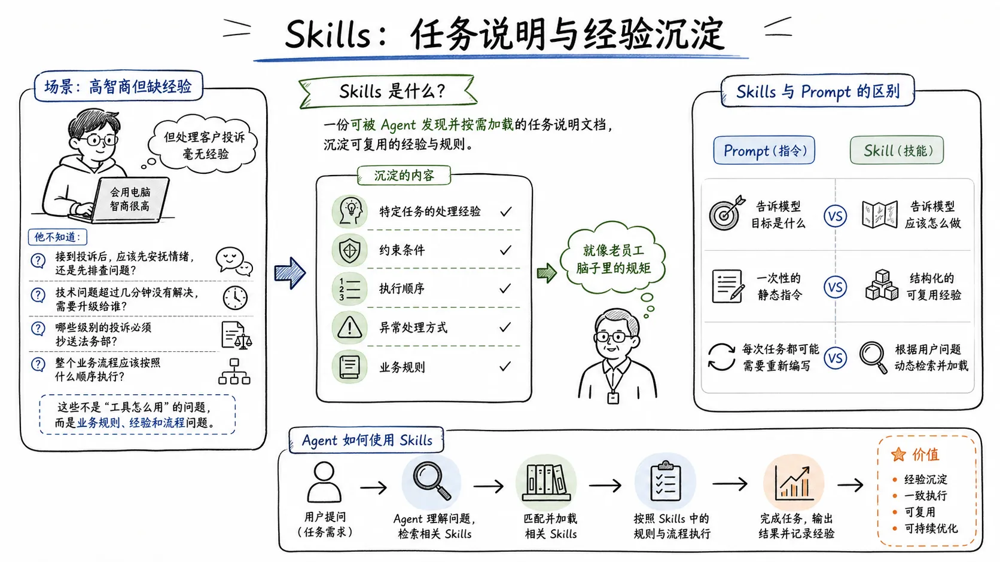

假设你招来一名清华毕业的高材生。他像大模型一样，智商很高、会使用电脑，但如果让他处理客户投诉，他可能毫无经验。

他不知道：

- 接到投诉后应该先安抚情绪，还是先排查问题；
- 技术问题超过几分钟没有解决，需要升级给谁；
- 哪些级别的投诉必须抄送法务部；
- 整个业务流程应该按照什么顺序执行。

这些不是“工具怎么用”的问题，而是业务规则、经验和流程问题。

**Skills** 就是用来解决这一类问题的。它是一份可以被 Agent 发现并按需加载的任务说明文档，其中可以沉淀：

- 特定任务的处理经验；
- 约束条件；
- 执行顺序；
- 异常处理方式；
- 业务规则。

它就像老员工脑子里的规矩。

### Skills 与 Prompt 的区别

Prompt 和 Skills 很容易混淆，但两者并不相同。

- **Prompt 是指令**：告诉模型目标是什么；
- **Skill 是技能**：告诉模型应该怎么做。

Prompt 往往是一次性的静态指令，每次任务都可能需要重新编写。Skill 则是结构化、可复用的外部经验，Agent 可以根据用户问题动态检索并加载。

## 五、AI 工程实践
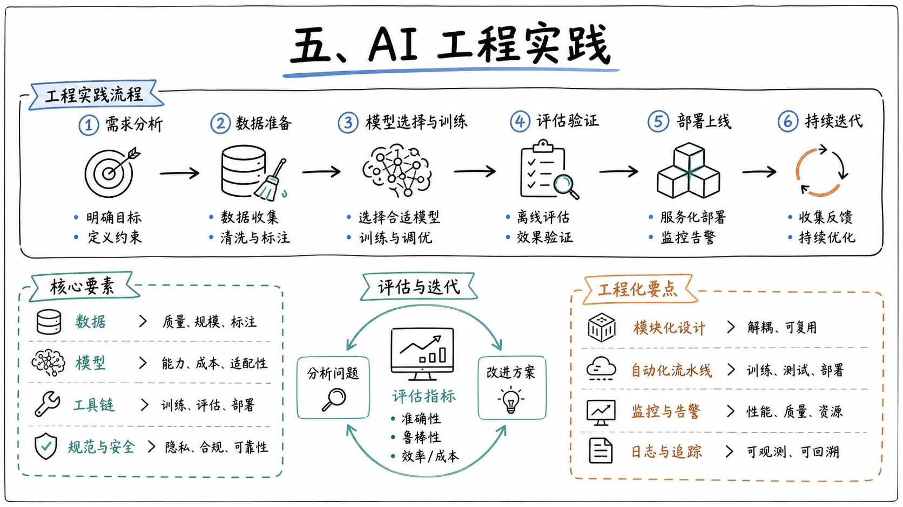

## Harness Engineering：给模型配一套完整系统
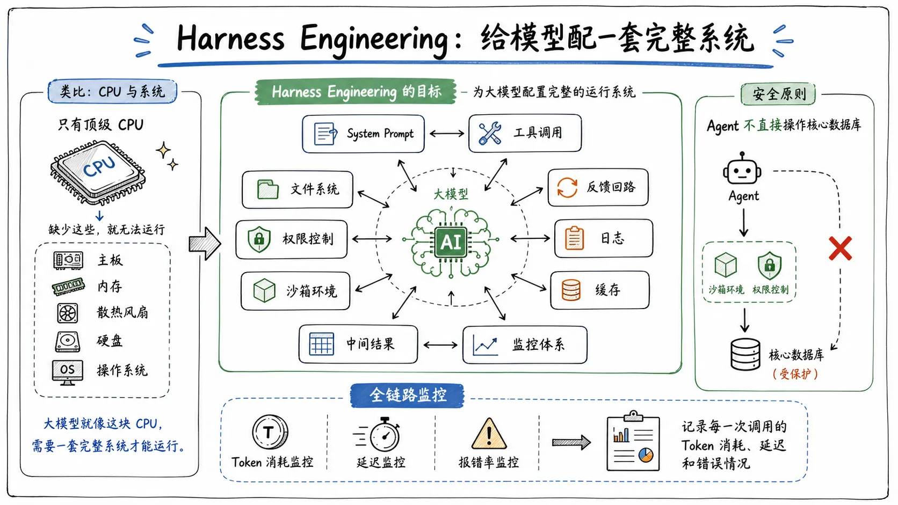

假设你买了一块世界顶级 CPU，但没有给它配：

- 主板；
- 内存；
- 散热风扇；
- 硬盘；
- 操作系统。

那么这块 CPU 连正常通电运行都做不到。

大模型就像这块 CPU，而 **Harness Engineering** 要做的，就是为它配置完整的运行系统。

这套系统需要包含：

- System Prompt；
- 工具调用；
- 文件系统；
- 权限控制；
- 沙箱环境；
- 反馈回路；
- 日志；
- 缓存；
- 中间结果；
- Token 消耗监控；
- 延迟监控；
- 报错率监控。

Agent 不应该直接操作核心数据库，而应该经过沙箱和权限控制。整个系统还需要记录每一次调用的 Token 消耗、延迟和错误情况。

## 提示、上下文与执行
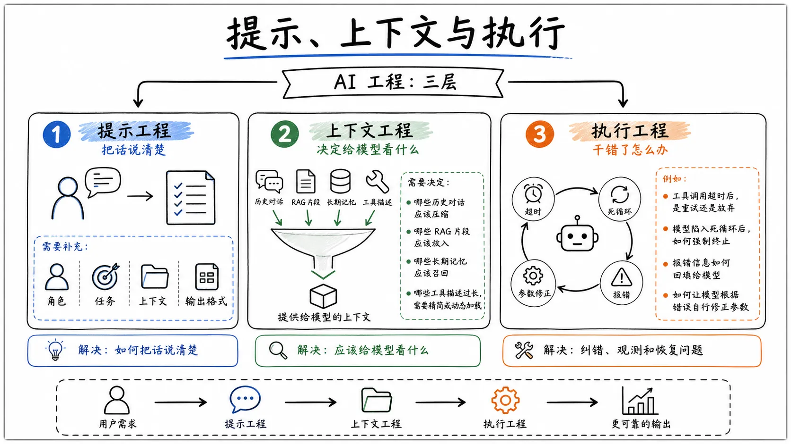

AI 工程可以分为三层。

### 提示工程：把话说清楚

Prompt Engineering 解决的是“如何把话说清楚”。

需要把模糊需求转化成标准指令，补充：

- 角色；
- 任务；
- 上下文；
- 输出格式。

### 上下文工程：决定给模型看什么

Context Engineering 解决的是“应该给模型看什么”。

需要决定：

- 哪些历史对话应该压缩；
- 哪些 RAG 片段应该放入；
- 哪些长期记忆应该召回；
- 哪些工具描述过长，需要精简或动态加载。

### 执行工程：干错了怎么办

Execution Engineering 解决的是纠错、观测和恢复问题。

例如：

- 工具调用超时后，是重试还是放弃；
- 模型陷入死循环后，如何强制终止；
- 报错信息如何回填给模型；
- 如何让模型根据错误自行修正参数。

## 循环工程
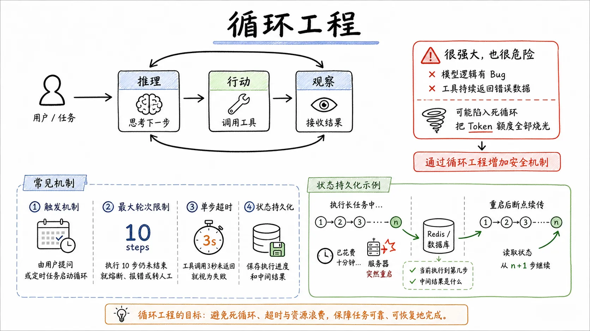

Agent 的“推理——行动——观察”循环很强大，但也很危险。

如果模型逻辑有 Bug，或者工具持续返回错误数据，Agent 可能陷入死循环，把 Token 额度全部烧光。因此，需要通过循环工程增加安全机制。

### 常见机制

- **触发机制**：由用户提问或定时任务启动循环；
- **最大轮次限制**：执行 10 步仍未结束，就熔断、报错或转人工；
- **单步超时**：工具调用 3 秒未返回，就视为失败；
- **状态持久化**：保存执行进度和中间结果。

例如，Agent 执行一个长任务已经花了十分钟，但服务器突然重启。如果没有状态持久化，只能从头再来。

因此，需要把当前执行到第几步、中间结果是什么等信息存入 Redis 或数据库。服务重启后再读取状态，实现断点续传。

## 六、常见面试考点
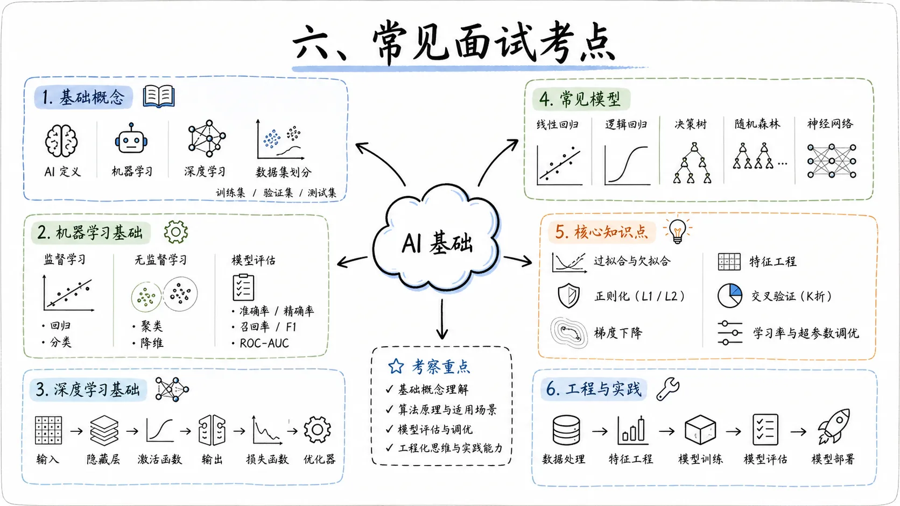

## 如何系统性减少大模型幻觉
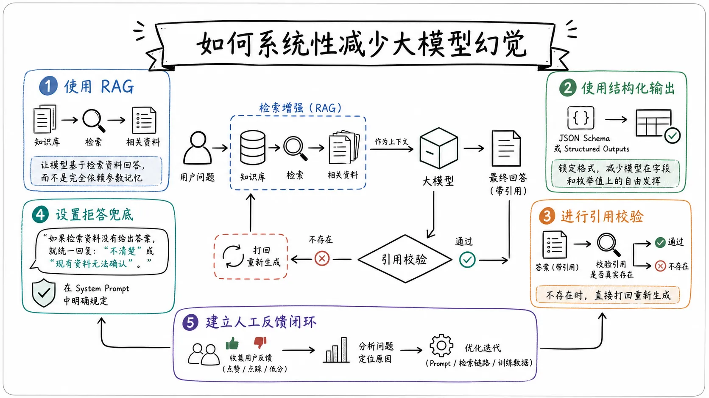

可以从以下几个方面回答：

1. **使用 RAG**  
   让模型基于检索资料回答，而不是完全依赖参数记忆。

2. **使用结构化输出**  
   通过 JSON Schema 或 Structured Outputs 锁定格式，减少模型在字段和枚举值上的自由发挥。

3. **进行引用校验**  
   要求答案带引用标记，后端检查引用是否真实存在；不存在时，直接打回重新生成。

4. **设置拒答兜底**  
   在 System Prompt 中明确规定：如果检索资料没有给出答案，就统一回复“不清楚”或“现有资料无法确认”。

5. **建立人工反馈闭环**  
   收集用户点赞、点踩等线上低分数据，定期优化 Prompt、检索链路或训练数据。

## 如何设计可靠的 Agent
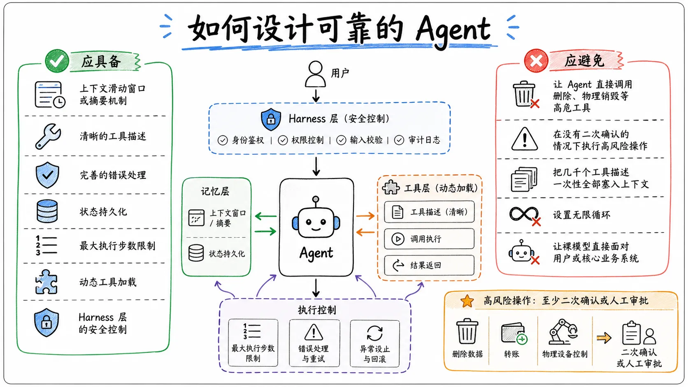

一个可靠的 Agent 应该具备：

- 上下文滑动窗口或摘要机制；
- 清晰的工具描述；
- 完善的错误处理；
- 状态持久化；
- 最大执行步数限制；
- 动态工具加载；
- Harness 层的安全控制。

同时还应避免：

- 让 Agent 直接调用删除、物理销毁等高危工具；
- 在没有二次确认的情况下执行高风险操作；
- 把几千个工具描述一次性全部塞入上下文；
- 设置无限循环；
- 让裸模型直接面对用户或核心业务系统。

对于删除数据、转账、物理设备控制等高风险操作，至少应增加二次确认或人工审批。

## 如何评估 RAG 系统
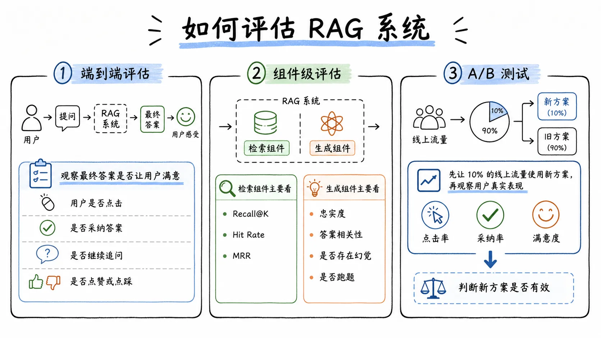

可以拆成三个层面。

### 端到端评估

直接观察最终答案是否让用户满意，例如：

- 用户是否点击；
- 是否采纳答案；
- 是否继续追问；
- 是否点赞或点踩。

### 组件级评估

检索组件主要看：

- Recall@K；
- Hit Rate；
- MRR。

生成组件主要看：

- 忠实度；
- 答案相关性；
- 是否存在幻觉；
- 是否跑题。

### A/B 测试

可以先让 10% 的线上流量使用新方案，再观察用户真实的点击率、采纳率和满意度，判断新方案是否有效。

## 多模态模型与部署加速
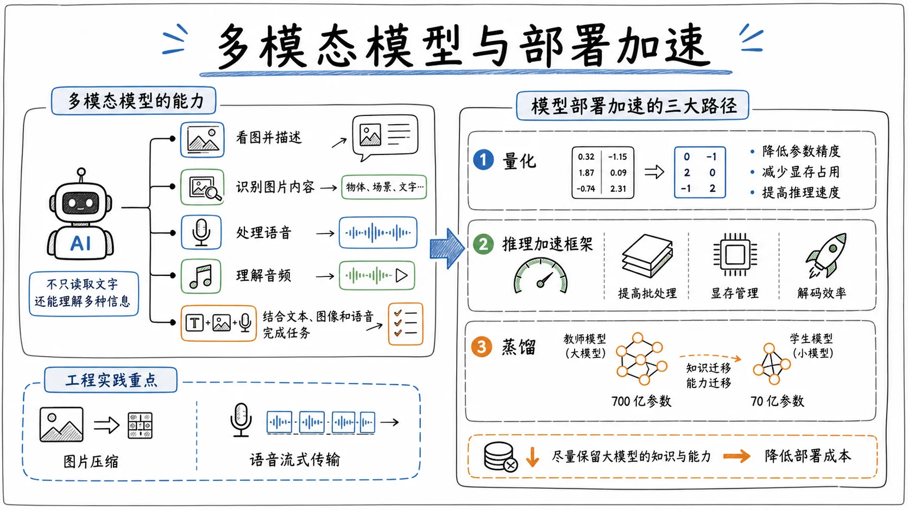

多模态模型不只能读取文字，还可以：

- 看图并描述；
- 识别图片内容；
- 处理语音；
- 理解音频；
- 结合文本、图像和语音完成任务。

工程上的重点包括图片压缩、语音流式传输等。

模型部署加速可以采用：

- **量化**：降低参数精度，减少显存占用并提高推理速度；
- **推理加速框架**：提高批处理、显存管理和解码效率；
- **蒸馏**：让大模型担任教师模型，训练更小的学生模型。

例如，可以让 700 亿参数的大模型教一个 70 亿参数的小模型，尽量把大模型的知识和能力迁移到小模型中，从而降低部署成本。

## 七、AI 核心模块的整体关系
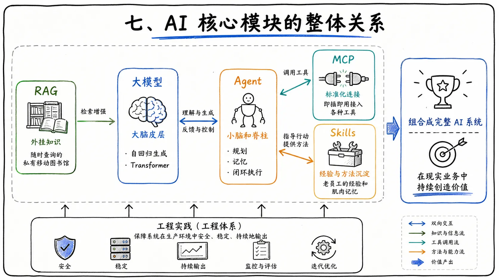

前面的几个模块并不是孤立存在的，而是彼此关联、共同组成完整 AI 系统。

- **大模型**提供“大脑皮层”，核心包括自回归生成和 Transformer；
- **Agent**相当于“小脑和脊柱”，负责规划、记忆和闭环执行；
- **RAG**提供外挂知识，相当于一座随时可以查询的私有移动图书馆；
- **MCP**提供标准化连接，让系统可以即插即用地接入各种工具；
- **Skills**沉淀老员工的经验和肌肉记忆，告诉 Agent 应该怎样做事；
- **工程实践**保障整个系统能够在生产环境中安全、稳定、持续地输出。

> 当大模型、Agent、RAG、MCP、Skills 和工程体系真正组合起来之后，才会形成一套能够在现实业务中持续创造价值的 AI 系统。

这些就是 AI 领域中比较核心的基础概念。大家可以在这个框架上继续补充学习，并结合具体项目加深理解。
