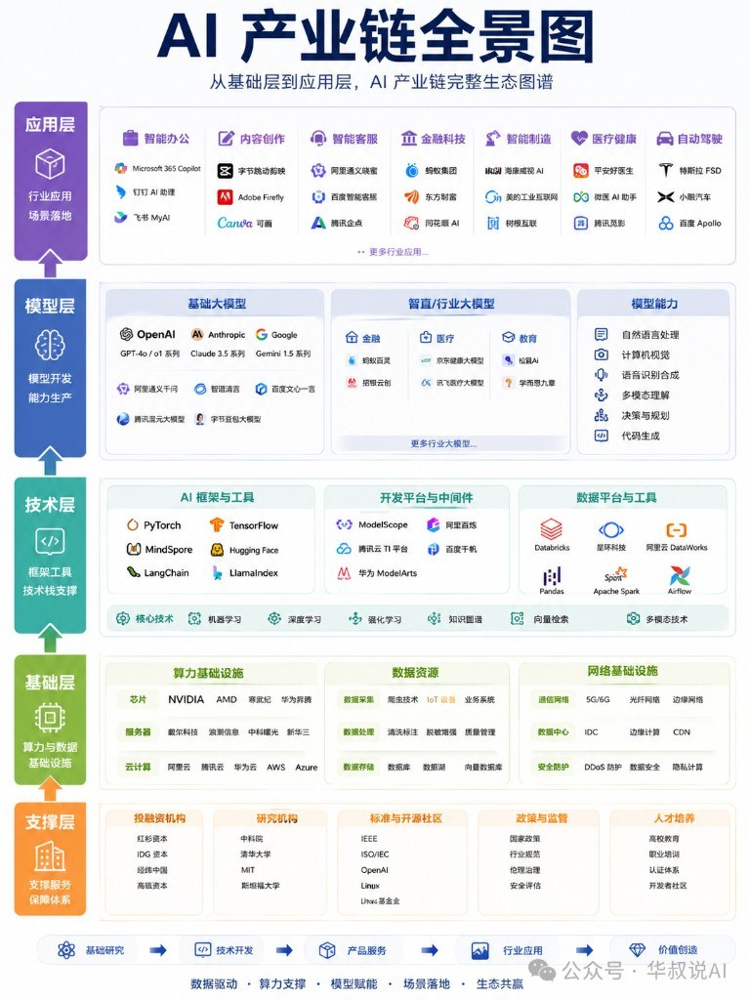

模型又升一档、产品又开一场发布会，热闹归热闹。更稳的视角是：**整条产业链在变厚**。算力与数据、框架与平台、基础/行业模型、再到 Agent 与场景，每一环都在动。企业很难只押一个模型；个人也更该先搞清「每层解决什么问题」，再选学习切口。

华叔这张全景图（另文参见「价值链」版，本次未附）适合当**分层地图**，不当最新厂商黄页。图里的型号会过时，层职责相对稳。

## 五层怎么读（上近用户，下远底座）

| 层 | 在干什么 | 看图时抓什么 |
|---|---|---|
| **应用层** | 行业场景落地 | 办公、创作、客服、金融、制造、医疗、自动驾驶…谁在吃业务 |
| **模型层** | 能力生产 | 基础大模型 / 垂直大模型 / 能力维度（NLP·CV·语音·多模态·规划·代码） |
| **技术层** | 把模型用起来 | 训练推理框架、开发平台、数据工具；ML/DL/RL、向量检索等 |
| **基础层** | 算力与数据底座 | 芯片·服务器·云；采集→清洗标注→湖仓/向量库；网络与安全 |
| **支撑层** | 生态与规则 | 投资、科研、标准开源、政策伦理、人才培养 |

页脚那条链更像价值流向：基础研究 → 技术研发 → 产品服务 → 产业应用 → 价值创造。口号翻译成人话：**没数据没算力，模型悬空；没场景，模型只是演示。**

## 个人怎么用这张图

别从「我该学哪个模型名」开局，先定位自己落在哪一层、上下游靠谁：

1. **只会调 API** → 人在应用层边缘；要加深，往下懂一点模型能力边界 + 技术层编排（Agent/RAG/评测）。
2. **会训/微调** → 模型层；同时要知道基础层成本和数据质量会卡死你。
3. **做平台/中间件** → 技术层；客户真正买的往往是应用层结果，别只卷框架名词。
4. **搞基础设施** → 基础层；离热点远，但应用一爆你就忙。

追热点前先问：这个新闻改的是哪一层的约束？是算力便宜了、数据合规变了，还是某个垂直场景打通了？

## 企业怎么用这张图

- **选技术**：先定场景（应用层），再倒推要不要自建模型、买 API、还是只做编排与数据。
- **做产品**：识别自己卖的是哪一层的交付物，缺的合作伙伴在邻层。
- **找伙伴**：芯片云、数据标注、模型商、集成商、行业 ISV，别全挤在「大模型」四个字里谈。

整合能力创造价值，不是押中一个基座模型名称。

## 读图时别踩这几条

- 厂商与版本（如某代 GPT/Claude/Gemini、国内云平台名单）**会过期**；收藏的是分层，不是榜单。
- 「Agent」在正文里被点到，图上更多落在应用/技术编排侧，别把 Agent 理解成独立第六层神话。
- 同作者还有「价值链」参照图；叠看时分清：一张偏**谁在哪一层**，一张偏**价值怎么流**。

## 别被单一概念牵着跑

理解产业链，是为了少被单一概念牵着跑。无论那个概念叫大模型、Agent，还是下一周的新词。
