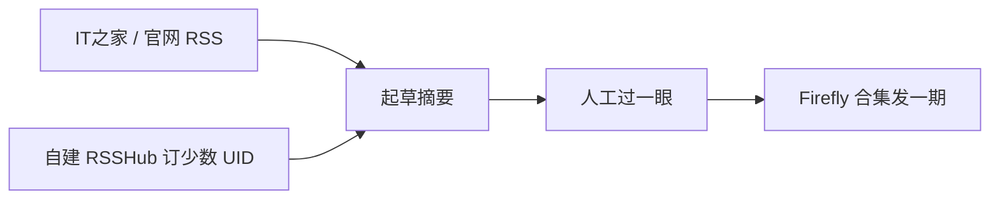

从这期起，博客多了一个合集：[AI 早报](/collections/ai-morning-brief/)。打算按报刊来，一期一篇，不写成教程，也不跟薅羊毛那篇抢活。

今晚同时挂上的还有 [国产模型比价](/posts/aug-coding-model-discounts-2026-08/)。价格、套餐、还在不在打折，去那篇对账。这里只记夜里这几条新闻本身。

## 今晚三件真事

IT之家 8 月 12 日深夜到 13 日 0 点那一波，和写代码相关的就这三件：

1. DeepSeek V4 Pro 正式版进 API，后端写成 `DeepSeek-V4-Pro-0813`，调用名还是 `deepseek-v4-pro`
2. 阿里把 Qwen3.8-2.4T-A95B 权重放到魔搭，Qwen-Max 这一档第一次开源
3. Grok 4.6 发布，Artificial Analysis 综合指数跟 GPT-5.6 Sol 打平，Cursor 里已经能选

来源都是 [IT之家 RSS](https://www.ithome.com/rss/)，不是转发群截图。

## DeepSeek 又搞静默切版本

调用名没变，账单口径却可能已经按 0813 走。别等 chat.deepseek.com 换皮才承认发版。

[IT之家 0 点 05 分那篇](https://www.ithome.com/0/989/000.htm) 写：正式版今晚进 API，模型名不变；增强 Agent，支持 Responses API 和 Codex 接入；官方群评测表里 Pro-0813 多项接近 Fable 5。定价他们附的是官方中文页那套：百万 tokens 命中 ¥0.025 / 未命中 ¥3 / 输出 ¥6。

我这边对过文档：开放平台模型名仍是 `deepseek-v4-pro` / `deepseek-v4-flash`。文档已经把 Pro 后端写成 `DeepSeek-V4-Pro-0813`。**官方更新日志还停在 7 月 31 日那篇 Flash 公测**，当时写过 Pro 正式版「将会尽快发布」，App / 网页先不动。所以今晚能确认的是 API 文档和调用，不是 chat.deepseek.com 已经切了 0813。

Harness 仍然没有下载页。别把微信公众号「DeepSeek Harness 团队」当成产品发布。写代码走官方 API 的人，从这晚起按 0813 对能力，按比价那篇对价。

*图：DeepSeek API 文档社交卡片。来源：[api-docs.deepseek.com](https://api-docs.deepseek.com/)（2026-08-13 抓取）。版权归 DeepSeek。*

## 千问把 2.4T 权重扔出来了

开源了不等于免费随便打。自己跑 2.4T MoE 是另一笔电费和显存账。

[IT之家 0 点 10 分](https://www.ithome.com/0/989/001.htm)：魔搭公众号 12 日深夜宣布开放 [Qwen3.8-2.4T-A95B](https://modelscope.cn/models/Qwen/Qwen3.8-2.4T-A95B)。总参 2.4T，每个 token 激活 95B，原生 262,144 上下文，可扩到约 1,010,000。512 专家里每 token 走 10 个路由专家加 1 个共享专家。官方博文在 [qwen.ai/blog?id=qwen3.8](https://qwen.ai/blog?id=qwen3.8)，云端 Qwen3.8-Max 基于这份权重再加生产环境能力。

这是 Qwen-Max 级别第一次放权重。评测表跟 Opus 4.8、Fable 5、GPT-5.6 Sol 互有高低，别只截一张图当总冠军。大多数人写代码还是走百炼 Token Plan / Qoder，别把「开源了」理解成「Coding Plan 白名单突然有 3.8-max」。套餐和折扣在比价那篇。

*图：Qwen 官方博文中的 Qwen3.8-Max 评测图。来源：[qwen.ai/blog?id=qwen3.8](https://qwen.ai/blog?id=qwen3.8)（2026-08-13 抓取）。版权归阿里云 / Qwen 团队。*

## Grok 4.6 对上 GPT-5.6 Sol

Cursor 里已经能选。刊例和「首周两倍额度」对不上时，以 usage 为准。

[IT之家 12 日 23 点 57 分](https://www.ithome.com/0/988/999.htm)：Grok 4.6 强调长流程 Agent、复杂交互和视觉。Artificial Analysis Intelligence Index 九项综合跟 GPT-5.6 Sol 相同。已上 Cursor、Grok Build，也走 API / OpenRouter / Vercel / Cloudflare。刊例：百万 input $2、output $6，更快那档翻倍。IT之家写 Cursor 和 Grok Build **首周两倍内含额度**；Cursor 文档写的是 **8 月 12 日起一周 50% 首发折扣**。可能是同一件事的两种说法，对账看 usage，别只信标题。

半价窗口大概到 8 月 19 日。有 Cursor Ultra 才能玩前一天那条 Grok Bot；Pro 这档先摸 4.6 折扣就行。

*图：Cursor 站点 Open Graph。Grok 4.6 已进 Cursor Models 池。来源：[cursor.com](https://cursor.com/)（2026-08-13 抓取）。版权归 Anysphere / Cursor。*

## B 站早报源这期接不上

B 站没有官方 UP 主 RSS。社区常用 RSSHub 路由，比如用户投稿、动态、专栏、合集。路线本身在，**今晚公共实例接不上**：rsshub.app 403，其它几个常见镜像 502 / 503。

所以这期没有 B 站片单，也不去扒口播、字幕当正文。以后要接，也只订少数 UID，标题加原链当线索，版权过不去的内容不上站。

官方媒体 RSS 是通的。IT之家 `https://www.ithome.com/rss/` 今晚 200。少数派 feed 也通。36氪 `/feed` 抓到的是 HTML，别当 XML 用。

*图：DIYgod/RSSHub 仓库 GitHub Open Graph。来源：[github.com/DIYgod/RSSHub](https://github.com/DIYgod/RSSHub)（2026-08-13 抓取）。版权归 DIYgod / RSSHub 贡献者。*

设想的流水线就这样，先人工过一眼再发，不上全自动：

## 对账去看比价那篇

价格、Coding Plan、还在不在打折，看 [八月中旬写代码，国产模型这周到底哪家在打折](/posts/aug-coding-model-discounts-2026-08/)。

API 侧 DeepSeek Pro 按 0813 来。千问 2.4T 权重在魔搭。Grok 4.6 半价窗口大概到 8 月 19 日。网页聊天是不是同一天切，官方没写，别替它宣布。

下期起主源改成[橘鸦早报 RSS](https://daily.juya.uk/rss.xml)。这期仍是 IT之家夜里那三条，结构不动。
