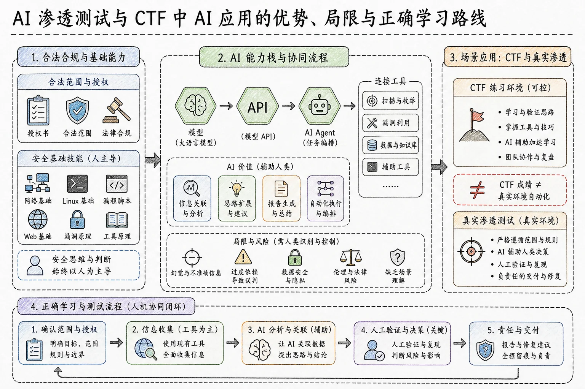

# 分享背景与实践经历

大家好，我是一只枷锁。今天不讲具体知识点，主要分享当前比较热门的 **AI 渗透测试**，以及 AI 在 CTF 中的应用。这些内容来自我个人在工作、学习和比赛中的实践，因此会偏主观一些，但确实是我使用 AI 时观察到的真实现象。

这是我们的粉丝群，感兴趣的同学可以进群交流。相关文档后续也会发到粉丝群里。

AI 确实给安全工作带来了很大变化。以长城杯初赛为例，当时有一道题，我甚至没有仔细看题目，熬夜时直接把题目附件交给 AI 分析，很快就把 Flag 梭哈了出来，还拿到了一血，排名瞬间冲到第一。最后当然没能保住，还是被经验丰富的大手子们制裁了。

在红队工作中，我发现 AI 的上限同样很高。例如测试 **Fastjson、JNDI 注入** 等漏洞时，AI 基本可以正常完成，并成功拿到 Shell。还有一次真实红队项目，我晚上打开一个口子后，把 AI 挂在上面跑内网，自己直接睡觉。第二天醒来后，发现它已经拿下了 16 台服务器。这个结果当时让我非常震惊，也让我意识到 AI 在红队方向确实能提供很大的帮助。

在其他红队项目中，AI 还可以帮助完成以下工作：

- 获取服务器和数据库权限；
- 统计数据库中包含多少张表，以及哪些数据较为敏感；
- 识别 OA 系统、微信小程序及其他业务系统；
- 整理已控主机；
- 分析和利用 RCE 等漏洞；
- 识别 Docker 宿主机及相关环境；
- 编写对应的工具链；
- 记录完整利用过程，帮助测试人员手动复现。

如果你只想手动复现，也可以不断追问 AI，让它把整个复现过程完整写出来，再由你一步一步操作。

> **核心认识：**AI 已经能在部分比赛和红队场景中发挥非常明显的作用，但它并不等于可以完全替代人的判断。

## AI 辅助安全测试与 AI 系统安全测试

## 两个容易混淆的方向

开始之前，需要先区分两个概念：

1. **AI 辅助安全测试**
2. **AI 系统安全测试**

它们本质上属于两个不同方向。

### AI 辅助安全测试

AI 辅助安全测试的测试对象，主要是传统网站、服务器和内部网络。例如：

- 企业 OA 系统；
- 学校教务系统；
- 校园洗浴等业务系统；
- 部署在服务器上的普通 Web 应用；
- 由代码、接口、参数和配置共同构成的业务系统。

通俗地说，就是让 AI 帮助安全人员完成部分工作。前面提到的信息收集、漏洞分析、数据库整理、脚本编写、报告生成等，都属于 **AI 辅助安全测试** 的范畴。

其常见内容包括：

- 信息收集；
- 代码解释；
- 请求与响应分析；
- 脚本辅助；
- 结果整理；
- 漏洞判断；
- 报告生成。

### AI 系统安全测试

AI 系统安全测试面向的是大模型、智能体和 AI 应用本身。例如大家使用过的豆包、腾讯元宝，以及其他 AI 智能体或 RAG 应用。

它关注的是 AI 系统自身是否安全，常见测试方向包括：

- 提示词注入；
- 系统提示词泄露；
- 敏感信息泄露；
- 越权调用工具；
- 绕过安全限制；
- 诱导模型输出不应输出的内容；
- 让模型生成违法、暴力或血腥内容。

本次主要讨论的是：

> **如何使用 AI 改变传统渗透测试，以及初学者应该如何应对这种变化。**

至于 AI 系统本身的安全测试，属于后续专项内容，这里只介绍基本概念。

## AI 渗透与 AI 红队为什么越来越热门

## 大模型降低了信息处理门槛

渗透测试会接触大量信息，包括：

- 网站目录；
- 接口和参数；
- 请求与响应；
- 服务器报错；
- 配置文件；
- 扫描结果；
- 日志和代码；
- 数据库结构与业务数据。

如果全部依靠人工判断，很容易出现遗漏或误判。大模型可以通读这些材料，按照其理解提炼重点，也可以继续辅助测试或生成报告。

过去，安全人员往往需要在搜索引擎、文档、笔记和大量工具之间不断切换。同一种任务可能有十几个工具，每个工具输出的内容又不一样，还要在不同笔记之间反复整理。

大模型的价值之一，就是把这些结构化或半结构化数据放在一起分析，帮助人们：

- 快速提炼重点；
- 解释陌生内容；
- 关联不同来源的数据；
- 整理复杂结果；
- 将专业内容转化成更容易理解的表达。

## AI 正从聊天工具变成工具调用者

早期使用 AI，主要通过网页或手机应用，例如网页版豆包、DeepSeek、GPT 等。用户必须主动提问，AI 才会给出回答。让它写脚本时，往往要来回描述很久，而且它有时还会“骗你”，嘴上说会用最通俗、最正确的方式回答，实际给出的脚本却未必能运行。

很多人到现在仍把聊天窗口理解成 AI 的全部。实际上，从聊天软件发展到能够连接安全工具的智能体，中间经历了不同层次。

### 对话式应用

对话式应用就是大家平时能直接看到和使用的产品，例如：

- 豆包；
- DeepSeek 网页版；
- GPT 网页版；
- Kimi；
- 腾讯元宝。

如果别人问你用了什么 AI，你回答“豆包”，并没有错，但你回答的是一个应用，而不是它背后的模型。

### 模型

模型可以理解成 AI 应用背后的“核心大脑”，负责处理文字、图片、代码等输入，并生成回答。同一个聊天应用里可能存在多个模型，用户可以在不同模型之间切换。

不同模型各有特点，例如：

- 有的擅长代码；
- 有的擅长图片理解；
- 有的中文表达更自然；
- 有的上下文更长；
- 有的推理速度更快；
- 有的安全审查更严格。

同一个模型也可以被网页、手机软件、代码编辑器或其他工具调用。

因此，**应用和模型不是同一个概念**：

- 应用是用户能看到的产品；
- 模型是应用背后负责理解和生成内容的核心能力。

应用升级时，背后的模型可能被替换，也可能更新为新的版本。

## API 是什么

API 可以理解成程序之间通信的通道。大模型通过 API，允许开发者使用脚本、网站或安全工具向模型提交任务，再由程序接收模型返回的结果。

以 DeepSeek 为例，官网通常会同时提供：

1. 网页版对话入口；
2. API 开放平台。

网页版可以直接聊天，而 API 允许外部脚本、软件或安全工具调用模型能力。

两者还有一个明显区别：

- 网页版通常可以免费或按订阅使用；
- API 一般按照调用量收费，需要充值并生成 API Key。

这个 API Key 是调用模型的重要凭证。不同模型对应的价格也不同，因此经常会听到“某个模型很贵”或“某个模型比较便宜”。

刚开始学习时，我不建议直接使用太贵的模型。一方面钱包可能承受不了，另一方面，贵模型的实际效果未必比便宜模型高出很多。到目前为止，我使用 DeepSeek 仍然比较多，因为它的价格、可用性和实际效果相对合适。

选择模型时，还要考虑安全限制。有些模型的安全审查非常严格，让它执行安全研究或渗透测试相关任务时，它可能直接拒绝。部分国外模型还要求通过安全研究或相关认证，否则不会协助完成安全类操作。即使通过认证，也可能遇到认证失效、账号被封、成本过高或服务不稳定等问题。

因此，国外模型即使在某些能力上更强，考虑到价格和使用稳定性，我个人仍更推荐国内模型。前面提到的比赛和渗透测试案例，很多也是使用 DeepSeek 完成的。

> 重点并不只是“哪个模型最厉害”，而是如何建立自己的工作流、规范提示词，并提高 AI 在特定领域中的能力。

大家使用的可能是同一个模型，但为什么有人用出来的 AI 明显更强？真正值得研究的是：

- 中间做了哪些准备；
- 给 AI 提供了哪些上下文；
- 如何拆解任务；
- 如何规范提示词；
- 如何接入工具；
- 如何检查和纠正结果。

一味追逐模型并不稳定。今天觉得这个模型强，明天又觉得另一个模型强，但模型的价格、策略、认证和可用性随时可能变化。

## 从模型、API 到智能体工作流

## Claude Code 只是“躯体”，模型才是“大脑”

以 Claude Code 这类工具为例，它本身可以理解成一个“躯体”，需要接入模型这个“大脑”才能工作。模型可以来自 DeepSeek、GPT、Claude、Kimi、GLM 等不同服务。

因此必须分清：

- **Claude Code 等工具**：任务执行和交互载体；
- **模型**：理解、推理和生成能力；
- **API**：工具与模型之间的通信通道。

对话式应用是人在聊天窗口中上传文字或文件，让 AI 帮忙分析；API 则是程序自动提交任务并读取结果。

网页版的使用门槛更低，下载应用或打开网页即可使用。API 接入则需要一定配置，可能涉及：

- 简单编程；
- 低代码工具；
- API Key；
- 模型地址；
- 工具权限；
- 上下文和提示词配置。

这些对新人而言会更复杂。后续课程还会详细介绍模型、API、智能体、MCP、Skills 等概念，本次只需要先能区分它们。

## API 调用示例

例如，我启动 Claude Code 后，可以要求它：

> 在桌面生成一个名为 `5671.txt` 的文件，文件内容是“我是一只枷锁”。

这时，Claude Code 会调用后端模型的 API，消耗账户余额，并在桌面完成文件创建。最终生成的文件名和内容会与要求一致。

这只是一个最简单的例子。它的上限远不止创建文本文件。例如写报告时，可以把一份已有报告交给 AI，让它学习其中的格式和必填内容，再上传一份空白报告以及本次项目的数据，AI 就能按照对应格式完成排版和内容整理。

这属于基础的文档处理能力，但在真实工作中已经非常实用。

## AI 应该连接工具，而不是重复造轮子

安全工具擅长获取真实数据，模型擅长理解、关联和分析信息。如果能把二者连接起来，效果通常比让 AI 从零写工具更好。

现有安全工具已经非常成熟，例如：

- Nmap；
- Burp Suite；
- SQLMap；
- URLFinder；
- Yakit；
- 目录扫描工具；
- 端口探测工具；
- 漏洞扫描与验证工具。

我自己也开发了一套工具箱，集成了常用安全工具。它们在特定场景下执行特定任务，效率非常高。

如果让 AI 完全从零渗透一个网站，它可能先写一个端口探测脚本，再写一个 JS 接口提取脚本。这个过程既耗时间，又消耗 Token，成本并不划算。因为这些任务本来就可以通过成熟工具完成，没有必要让 AI 重复造轮子。

更合理的方式是：

1. 先使用现有工具完成端口探测、目录扫描、JS 分析等工作；
2. 把真实结果交给 AI；
3. 让 AI 分析结果并决定下一步；
4. 必要时再让 AI 调用对应工具。

例如发现疑似 SQL 注入时，正确流程应该是先进行判断，确认值得验证后调用 SQLMap。SQLMap 跑出结果后，再让 AI 读取并分析，而不是要求 AI 临时编写一个 SQL 注入脚本。

这样做可以同时节省：

- 时间；
- API 成本；
- 推理成本；
- 调试成本；
- 人工检查成本。

## 什么是智能体工作流

普通 API 调用通常是提交一次任务，得到一次回答。智能体工作流则会把以下内容组合起来：

- 模型；
- 上下文；
- 任务规划；
- 工具；
- 执行结果；
- 状态记录；
- 错误处理；
- 人工确认。

这种运行方式通常称为 **AI Agent，也就是智能体**。

可以把它理解为：

- 大模型负责理解任务、规划步骤；
- 外部工具负责执行具体操作；
- 人负责授权、监督、判断和承担责任。

一个比较合理的智能体流程可能是：

1. 读取授权范围和已有资料；
2. 选择合适工具完成信息收集；
3. 分析工具输出；
4. 判断现有信息是否充分；
5. 如果方向行不通，就更换方向；
6. 得到新结果后重新调整任务优先级；
7. 在关键步骤请求人工确认。

这个过程可能需要多轮交互，而不是一次问答就结束。

智能体工作流不等于把任务丢给 AI 后彻底不管。正确做法是先告诉它有哪些工具、工具分别能做什么，再让它根据任务调用工具并分析结果。

完整智能体通常需要：

- 任务规划；
- 上下文管理；
- 工具清单和说明；
- 状态记录；
- 错误处理；
- 日志审计；
- 人工确认机制。

例如使用 Claude Code 时，它可能每执行一步都要求用户确认。如果比较保守，可以保留逐步确认；如果足够信任当前工作流，也可以调整成减少确认的模式，但这种模式的安全风险更高。

> 只有把工作流真正建立起来，才能尽量避免 AI 重复执行、超出范围，或者不断放大错误判断。

## 初学者应如何理解 AI 能力层次

## 推荐的学习顺序

零基础学习者可以按照以下链路理解：

1. **对话式问答**  
   先学会描述问题，让 AI 分析材料、解释知识点、辅助写代码和处理文件。

2. **API 调用**  
   学会把模型接入自己的脚本、软件或安全工具。

3. **工具协同**  
   让 AI 调用端口扫描、目录扫描、流量分析和漏洞验证工具。

4. **智能体工作流**  
   把上下文、模型、工具、执行结果和人工确认组合成完整闭环。

最开始，必须先学会把问题说清楚。如果与 AI 聊天时连自己的诉求和重点都表达不明白，AI 就很容易误解，最终产出的内容也会乱七八糟。

会调用 API，不代表已经掌握 AI。即使把模型接入 Claude Code，也需要不断调整：

- 提示词；
- 工具权限；
- 任务拆分方式；
- 结果验收方式；
- 错误纠正机制。

要让 AI 真正理解你的诉求和目标，并稳定产出成果，需要长期调试。

## 攻防双方都在使用 AI

现在无论渗透测试还是攻击活动，AI 的使用都越来越普遍。如果仍然认为所有内容都必须纯手工测试，整体效率就会下降。

人类测试容易受知识盲区影响，而 AI 可能知道测试人员不了解的检查方向，从而帮助补充遗漏。攻击者已经在用 AI 提升效率，如果防守方仍然固步自封，攻击者的 AI 可能早已把网站“买下来”了。

不同岗位使用 AI 的方式也不同。

### 渗透测试与红队

- 整理资产；
- 解释流量；
- 辅助代码审计；
- 自动执行部分渗透步骤；
- 分析漏洞利用条件；
- 整理证据并生成报告。

### 蓝队与安全运营

- 告警分类；
- 分析不熟悉的设备告警；
- 通读大量日志；
- 提取异常行为；
- 定位问题来源。

日志很长时，不可能全部塞进普通网页聊天窗口，这时就需要通过 API 或本地工具读取和分析完整日志。

### 开发与运维

- 代码检查；
- 补丁影响分析；
- 配置检查；
- 修复方案生成；
- 自动化脚本编写。

### 恶意攻击者

- 自动化信息收集；
- 制作后门；
- 批量攻击网站；
- 提高漏洞利用和横向移动效率。

因此，AI 带来的变化不只是让攻击变强，而是让整个攻防专业的工作方式发生变化。

## AI 不能取代人的基本功

## 内网和隔离环境中的现实限制

不能盲目追求 AI，更不能忽略人的重要性。

部署在公网的网站通常可以正常调用 AI，但很多客户系统位于纯内网。例如银行、金融机构等敏感单位，测试人员只能进入客户内网开展工作，环境不允许访问互联网，也不允许接入外部 AI 服务。

这种情况下，在线模型基本无法发挥作用。最多只能用手机上的聊天应用查询某个报错或测试点，不可能像 API 工作流那样方便。

很多银行和金融机构对 AI 的态度仍然比较谨慎，内部工作记录、配置和业务数据通常不允许上传给外部模型。这时，渗透测试能否继续完成，本质上考验的就是基本功。

如果长期只依赖 AI，忽略手工测试能力，进入纯内网环境后就会束手无策。真实安全项目中，内网环境往往不可避免。我第一次做项目以及最近几次项目，都遇到过客户内网无法使用 AI 的情况，只能依靠人工经验完成任务。

因此，AI 应该被当成工具：

- 有条件时，它非常好用；
- 没有条件时，安全人员仍必须独立完成工作。

一个简单的自测标准是：

> **能用 AI 时，你可以明显提升效率；不能用 AI 时，你也能依靠自己的知识和能力完成对应工作。**

这才是正确的学习方向，而不是因为 AI 很火，就把全部精力都投入 AI，最后在特殊环境中失去工作能力。

## 授权、监督与责任

一套稳定的人机协作流程，首先必须确认授权目标。AI 可以在授权范围内帮助分析资产、整理信息、探索接口，并根据目标类型建议调用相应工具。

例如 AI 判断目标是一个 IP 站点，可能先调用端口探测工具；工具输出结果后，AI 再读取结果并判断下一步。

但整个过程中，授权范围必须由人确定。AI 如果执行失控，可能删除数据库、破坏数据或影响业务，这些行为都可能涉及严重违法问题。

因此，以下内容必须由人复核：

- 工具输出；
- 漏洞结论；
- 证据是否充分；
- 风险等级；
- 敏感操作；
- 最终报告。

最终项目责任也不可能交给 AI 承担。真出了问题，不能对执法人员说“不是我打的，是 AI 打的”。执法机关不会去抓 AI，只会追究实际操作人员的责任。

在漏洞赏金、互联网授权测试、SOC 或红队项目中，即使允许使用 AI，也必须遵守平台和客户规则。不要随意下载、删除或新增客户数据，更不能让 AI 执行明显越界的操作。

## AI 更擅长和不擅长的工作

## 初始访问阶段仍依赖人工经验

在红队项目的外部打点阶段，让 AI 对一个完全陌生的网站自动渗透，效率通常不高，成功率也不稳定。

它可能只发现一些低价值的信息泄露，或者根本无法利用的问题，很难满足红队快速拿下服务器的要求。AI 可能花很长时间全面分析一个网站，最后只找出几个没有实际价值的问题，时间和调用成本都消耗掉了，却没有形成有效结果。

这个阶段往往更依赖人工结合资产特点进行判断。例如看到某种 OA 系统，有经验的人会立即想到它可能存在哪些历史漏洞、N-day 或 0-day，并快速寻找公开漏洞进行验证。

因此，就目前的个人实践而言，红队初始打点仍然更适合人工主导。AI 在这个阶段通常：

- 速度偏慢；
- 目标不够聚焦；
- 容易陷入低价值问题；
- 实际效果不够稳定。

## 获得权限后，AI 提效非常明显

当测试人员已经在授权范围内取得一台服务器的访问权限，进入内网后，AI 的价值会明显增加。

内网中存在大量重复性工作，例如：

- 判断不同 IP 对应的业务站点；
- 访问和梳理站点功能；
- 识别数据库类型；
- 配置不同数据库的连接方式；
- 整理账号和口令；
- 分类业务系统和敏感数据。

一台服务器可能同时存在 MySQL、SQL Server、MongoDB 等多种数据库。人工逐个配置连接，可能需要十几分钟到半小时；在 AI 辅助下，可能几十秒内就完成连接配置，并继续分析数据，区分哪些是敏感信息、哪些价值较低。

## AI 适合处理大量文件和代码

人长时间查看大量配置、代码和文件，很容易疲劳和遗漏。AI 非常适合完成第一轮筛选。

它可以帮助：

- 梳理 JavaScript 文件结构；
- 定位接口地址；
- 识别敏感字段；
- 分析可疑调用；
- 查找凭证；
- 查找数据库账号和密码；
- 梳理服务器中的配置文件；
- 帮助初学者理解 JavaScript 代码；
- 提取可访问接口并辅助快速打点。

目前我认为，AI 最大的价值之一就是消除重复劳动，包括：

- 配置连接；
- 格式转换；
- 结果去重；
- 文件分类；
- 数据整理；
- 报告生成。

这些工作本身未必很难，却非常耗时间。可能实际渗透只花一两个小时，写报告却还要半小时甚至一小时。AI 可以显著节省这部分时间。

在红队项目和 CTF 比赛中，时间非常宝贵。同一个漏洞如果别人先提交，你就失去了对应分数。因此，AI 对重复性工作的压缩具有很高价值。

## AI 不必替代工具，而应连接工具

传统安全工具仍然有明确价值。例如：

- Burp Suite 用于抓取、修改和重放 Web 或 App 流量；
- URLFinder 用于从页面和 JavaScript 文件中提取接口；
- SQLMap 用于自动化 SQL 注入验证；
- Nmap 用于端口与服务探测；
- 其他工具用于执行特定检查。

更实用的方式不是有了 AI 就扔掉所有工具，而是把它们结合起来。例如通过 MCP，让 AI 读取 Burp Suite 中的流量包，再进行分析和判断。

常见误区是把整个任务完全交给 AI，不管它如何执行。没跑出来就骂 AI 不行，跑出来了就感叹“真牛”。这种使用方式并不合理。

## AI 在 CTF 中的应用与边界

## CTF 对学生的价值

很多课程学员是学生，大学期间最常接触的就是网络安全竞赛，尤其是 CTF。参赛者会接触：

- 密码学；
- Web；
- 逆向；
- 二进制；
- 取证；
- 其他 Flag 获取方向。

CTF 属于网络安全领域的一个分支。大学期间可以通过 CTF 学习基础知识和常用工具，并为后续工作建立一定基础。

但不要过度沉迷 CTF。大一、大二以竞赛为导向学习技术没有问题，它可以逼迫自己持续学习；到了大三、大四，如果仍然只沉迷 CTF，没有及时调整方向，可能会影响职业规划。

除非你确实属于全国顶尖选手，年年能拿全国第一、第二，否则不能把全部职业发展押在 CTF 上。很多 CTF 题本质上是脑洞题，尤其部分 Web 题更考验解题思路，并不完全对应真实渗透测试场景。

安全公司招聘时，CTF 奖项可能带来加分，但如果基础能力不过关，也不会仅凭奖项录用。

## AI 解题案例

前面提到的长城杯案例中，我直接把题目附件下载下来，复制到桌面，再交给 AI，并告诉它：

> 这是一道 CTF 题，请帮我解出来。

AI 最终直接拿到了 Flag，而且还是一血。整个操作过程非常简单。

但这个案例并不代表 AI 能稳定解决所有 CTF 题。它也可能：

- 误判题意；
- 生成无法运行的脚本；
- 把自己绕进去；
- 浪费大量时间；
- 最终仍然解不出题。

AI 并非万能。它可以在用户缺少基础或经验时帮助解决一部分问题，但长期学习和能力发展仍然需要人为判断。

掌握 AI 不代表其他知识都不用学。相反，只有同时掌握基础知识和 AI，才能真正得心应手。

有经验的人知道一个网站可能有哪些薄弱点，会让 AI 重点测试这些方向；没有经验的新手往往只会说一句：

> 帮我测试一下这个网站。

两者最终得到的效果必然不同。

## 线上赛与线下赛

线上赛通常对 AI 使用相对宽松。只要能得到 Flag，参赛者往往会使用 AI 辅助解题，这已经非常常见。

部分线下赛可能限制外部模型和 API。如果比赛是纯内网环境，就无法调用在线 API。假如线上成绩全部依赖 AI，进入线下赛后可能立刻失去解题能力，最终也拿不到成绩。

如果打 CTF 是为了提升自己的水平，就必须同步提高个人能力。

比赛规则会变化，不能想当然地认为线上赛允许 AI，线下赛就一定允许或一定不允许。参赛前必须阅读规则。如果明确禁用 AI，就只能依靠：

- 个人经验；
- 团队协作；
- 本地笔记；
- 熟悉的工具；
- 离线资料。

## CTF 正逐渐变成“谁更会用 AI”的比赛

现在很多 CTF 比赛越来越像 AI 使用能力的竞赛。重点不只是比较谁的模型更强，而是比较谁更会用 AI。

模型只要花钱或完成配置，大家往往都能获得，但不同人使用同一个模型，效果仍然不同。经常打 CTF 的老手，即使和新手使用同一个模型，也通常能更快解题。

如果线下赛只能使用本地模型，算力还会成为新的竞争因素，包括：

- 电脑性能；
- 可运行模型的规模；
- 模型量化方式；
- 本地知识库；
- 工具和配置；
- 团队的人机协作效率。

本地模型通常不如在线模型强，因此更需要人工判断模型输出是否正确。不会判断的人容易被错误答案带偏，越绕越远；基础扎实的人则可以快速发现错误并纠正，让 AI 成为速度放大器。

AI 普及后，人与人之间的差距不会立刻消失。相反：

> **会用 AI、同时自身基础又强的人，只会变得更强。**

如果个人水平不足，只依靠 AI 完成任务，脑子里仍然是空的。成果本质上来自模型，与个人能力关系不大，对长期职业发展并不有利。

未来的 CTF 可能进一步出现：

- 使用 AI 优化题目；
- 使用 AI 出题；
- 明确禁止 AI 的个人赛；
- 允许 AI 的开放赛；
- 专门考核人机协作的比赛。

参赛者最稳妥的准备方式，是同时训练无 AI 环境下的基本功，以及允许 AI 时的人机协作能力。

## 全自动化黑客是否已经实现

## 靶场效果不等于真实环境

在部分靶场和固定竞赛环境中，AI 确实可以快速完成信息收集和部分漏洞利用。

原因是题目或靶场通常会提供提示，例如：

- 某个接口可能存在问题；
- 目标涉及某种特定漏洞；
- 题目属于某个明确方向。

有了这些精准信息，AI 会直接朝对应方向测试，因此看起来打靶场非常快。

但面对真实网站时，AI 可能很快就不动了。因为真实环境没有明确提示，目标也更复杂。AI 是否能快速判断，很大程度上取决于输入信息是否足够准确。

靶场通常具有以下特点：

- 目标明确；
- 规模较小；
- 判断成功相对容易；
- 漏洞经过预设；
- 干扰因素较少。

真实环境则可能包含：

- 大量资产；
- 复杂业务体系；
- 网络隔离；
- 权限和角色；
- 业务逻辑；
- 严格上线测试；
- 多层防护；
- 不明确的攻击面。

因此，打完靶场不代表已经掌握真实渗透测试。很多人离开舒适区进入正式环境后，会发现自己什么都测不出来。必须尽量接触真实、合法授权的环境，完成从靶场思维到项目思维的转变。

## 当前全自动化渗透的局限

### 1. AI 会产生幻觉

例如让 AI 查论文时，它可能编造根本不存在的论文。在安全测试中，它也可能构造假的参数、假的漏洞，或者把正常接口判断成漏洞。

这种幻觉会浪费时间，甚至导致错误操作。

### 2. 长上下文理解不稳定

在长期任务中，AI 可能忘记先前条件。即使一开始设置了约束，执行较长时间后，它也可能忽略这些要求。

### 3. 缺乏真实业务判断

AI 很难真正理解：

- 价格逻辑；
- 审批流程；
- 角色权限；
- 复杂业务规则；
- 业务数据之间的真实关系。

因此，它容易遗漏逻辑漏洞。

### 4. 工具执行存在风险

错误指令、错误参数或高并发操作，可能影响真实网站和真实业务，造成严重后果。

目前，部分步骤确实可以实现高度自动化，但要在复杂环境中长期、稳定、合规且无人监管地完成完整渗透测试，仍然不够成熟，也没有普遍成为常规生产能力。

判断一个自动化产品时，应该关注：

- 整体成功率；
- 是否需要人工介入；
- 误报率；
- 漏报情况；
- 测试目标是否经过筛选；
- 演示条件是否经过特殊设计。

不能只看最终宣传数据。

## 商业化产品不等于个人能力

## 不必因企业级平台过度焦虑

目前已经出现一些商业化 AI 渗透测试平台、企业级解决方案和安全智能体。它们通常结合了厂商多年的积累，包括：

- 大规模知识库；
- 多种安全工具；
- 私有模型；
- 调度系统；
- 专用算力；
- 特定场景优化；
- 多人团队经验。

这些产品在特定场景下可能展示出很高的效果，很多人看到宣传后会焦虑。但没有必要过度焦虑，因为商业平台的成本通常比个人高得多。

这类产品所使用的工具、数据、模型和算力与普通用户不同，演示目标、漏洞类型和成功条件也可能经过选择。它们往往需要专门设备或授权服务，整体成本较高。

短时间内发现多个漏洞，也要继续检查其中有多少误报。实际价值和验证结果最终仍需由人判断。

企业产品能够自动执行，不代表个人在真实项目中也能无意识地完成同样操作。未来安全工作会逐渐增加 AI 使用要求，因此普通学习者现阶段更应该掌握可迁移的基础能力，并构建自己可控制、可复用的工具和工作流。

如果只依靠公司提供的商业设备，一旦离职，个人能力可能立刻下降。必须把能力沉淀到自己身上，才能形成后续转岗、晋升或跳槽的资本。

> **AI 输出不等于现实。**模型告诉你“这里有漏洞”，不代表它真的存在。必须亲自复测，确认漏洞能够稳定复现。

## 新手应优先学习什么

## 尽早使用 AI，但不要迷信 AI

新人应尽早体验 AI 和自动化渗透工具，了解它们能做到什么。但不能因为 AI 能完成部分任务，就认为它无所不能。

基础知识仍然必须学习。如果没有基础，最终可能只是一个“调 API 的小子”，甚至 API 还用不熟。而技术本身扎实的人再使用 AI，往往是降维打击，真正做到如虎添翼。

## 使用者的知识水平决定 AI 的上限

AI 可以帮助新人：

- 理解概念；
- 减少重复劳动；
- 快速接触陌生知识；
- 辅助分析和生成内容。

但一个人最终能把 AI 发挥到什么程度，与自身知识水平密切相关。

如果从未参加过红队项目，也不了解红队工作流程，就很难知道 AI 在红队中究竟能做到什么程度。

基础扎实的人更懂得：

- 如何发现问题；
- 如何提出问题；
- 如何补充有效上下文；
- 如何拆解复杂任务；
- 如何选择合适的模型；
- 如何选择合适的工具；
- 如何判断 AI 输出是否正确。

更重要的是，他能看懂 AI 生成的代码、命令、流量和结果，并及时发现幻觉和错误，再继续纠正。到了漏洞确认阶段，只需要检查是否属于误报、能否稳定复现，就能快速完成整个过程。

把同一套 Claude Code 和模型交给小学生，与交给工作多年的安全工程师，最终效果肯定不同。

AI 更像是能力放大器，而不是凭空生成能力的替代品：

- 自身技术扎实，AI 会放大速度和分析优势；
- 自身技术不足，AI 也会放大错误理解和错误操作。

因此，学习基础知识和学习 AI 并不冲突。掌握网络、操作系统、HTTP 协议和漏洞原理后，AI 可以帮助使用者更快地调用和组合这些能力。

如果同一个模型别人用得很好，自己却觉得它很蠢，未必是模型的问题，也可能是使用方式不对。用户的错误判断会被继续传递给 AI，AI 再在错误前提上进一步判断，最终自然会得到更错误的结果。

## 正确的人机协作渗透流程

## 不要只说“帮我测一下这个网站”

如果一个什么都不懂的人只对 AI 说：

> 帮我对某个目标进行渗透测试。

这句话存在很多问题，因为它没有说明：

- 是否获得授权；
- 授权范围；
- 当前角色；
- 技术环境；
- 已有工具；
- 允许的操作；
- 禁止的操作；
- 预期输出；
- 并发限制；
- 测试边界。

AI 看不到网站的完整流量，也不知道测试边界，只能根据有限信息给出通用检查清单，或者盲目调用工具，结果通常比较凌乱。

## 第一步：确认测试范围和条件

在任何工具和 AI 介入前，都应确认：

- 可以测试哪些 IP；
- 可以测试哪些域名和子域名；
- 测试时间范围；
- 并发数限制；
- 禁止执行的操作；
- 是否允许数据读取；
- 是否允许漏洞利用；
- 是否允许调用外部模型。

尤其要限制高并发和 DoS 类操作，避免 AI 把真实业务打崩。

## 第二步：先用现有工具采集基础数据

可以先完成：

- Nmap 端口扫描；
- 目录扫描；
- JavaScript 分析；
- URLFinder 接口提取；
- Burp Suite 流量收集；
- 基础指纹识别；
- 账号角色与权限信息整理。

得到这些真实结果后再交给 AI。提供的信息越多，AI 的分析就越精准、越快速。

如果什么都不提供，让 AI 从零开始，通常是效率最低、成本最高的方式。

## 第三步：让 AI 关联多来源数据

最好让 AI 同时分析多个来源的结果，包括：

- 端口；
- 目录；
- 请求与响应；
- Cookie；
- Header；
- 接口参数；
- 对象 ID；
- 账号角色；
- JavaScript 文件；
- 已知业务功能。

在真实数据基础上，AI 可以完成：

- 去重；
- 归类；
- 关联；
- 风险排序；
- 攻击面清单生成；
- 角色差异分析；
- 验证步骤规划。

它还会重点关注上传、导入、导出等敏感功能，判断这些位置可能存在哪些安全缺陷。

## 第四步：预置提示词、工具和权限

我的 AI 环境会预先加载提示词。例如在 Claude Code 中，通过类似 `/红队` 的快捷命令读取一个 Markdown 文件，激活红队模式。

这个文件会写明：

- 当前任务角色；
- 授权边界；
- 工作要求；
- 可调用工具；
- 禁止操作；
- 输出格式；
- 风险控制方式。

同时，我会提前接入对应工具。当遇到端口扫描任务时，AI 可以调用 Nmap；遇到 SQL 注入时，可以调用 SQLMap；遇到其他检查任务时，则调用相应工具。

因此，真正影响效果的不只是模型，还包括：

- 前置提示词；
- AI 权限；
- 工具接入；
- 工作流设计；
- 人工监督。

后续课程会继续介绍环境配置、提示词编写和工具接入方式。本次主要是先建立基础概念，理解 AI 渗透的盲点和注意事项。

## 从 0 到 1，与从 1 到更高阶段

让 AI 完全接手，与人先完成关键步骤后再让 AI 接手，效果有明显差异。

如果人先确定范围、准备工具、采集信息、筛选重点，再交给 AI，AI 面对的就不再是一个模糊开放的问题，而是一个边界明确、数据充分、目标聚焦的任务。

这样可以：

- 缩小搜索空间；
- 降低调用成本；
- 减少无效尝试；
- 提高回答质量；
- 提升漏洞发现概率；
- 降低误报与越界风险。

基础越强，越知道该寻找哪些暴露面，也越能理解不同现象对应的风险。例如看到某个 ID 参数后，有经验的人会立即想到越权、对象引用和权限差异，并要求 AI 优先验证这些方向。

## 法律边界与最终结论

## 所有测试必须基于合法授权

本文只做技术科普。任何人将相关知识用于未授权渗透、攻击旧网站或其他违法行为，后果都由实际操作人员自行承担。

模型推测不能直接作为漏洞结论。不是模型说有漏洞，就一定有漏洞。必须经过人工复测，只有能够真实、稳定复现的问题，才能认定为漏洞。

AI 很多时候会产生误报，也可能在长任务中出现幻觉，因此不能尽信 AI，但也不应完全拒绝 AI。正确做法是在 AI 和个人能力之间找到平衡：

- 不完全依赖 AI；
- 也不完全排斥 AI；
- 用 AI 提升效率；
- 用人的经验控制边界和质量。

## AI 更适合作为安全人员的助手

AI 正在改变安全人员处理信息、调用工具和编写文档的方式，同时也催生了针对大模型和智能体的新安全方向。

但目前 AI 更适合作为安全人员的助手，还不能完整替代人。它无法仅凭一次自动化渗透和一份报告，就结束整个项目。

重复性工作可以交给 AI，因为它通常做得又快又准；但以下工作仍然依赖人的经验和监督：

- 复杂业务判断；
- 风险判定；
- 高风险操作；
- 漏洞复核；
- 客户沟通；
- 项目责任承担；
- 纯内网环境中的独立工作。

对零基础学习者来说，最合理的态度是：

> **尽早接触 AI，但不要迷信 AI；先打好基础，再用 AI 提速。最终结论看证据，所有操作守授权、守范围。**

下一部分将介绍当前使用的电脑配置，帮助初学者熟悉电脑、工具和整体学习环境。

