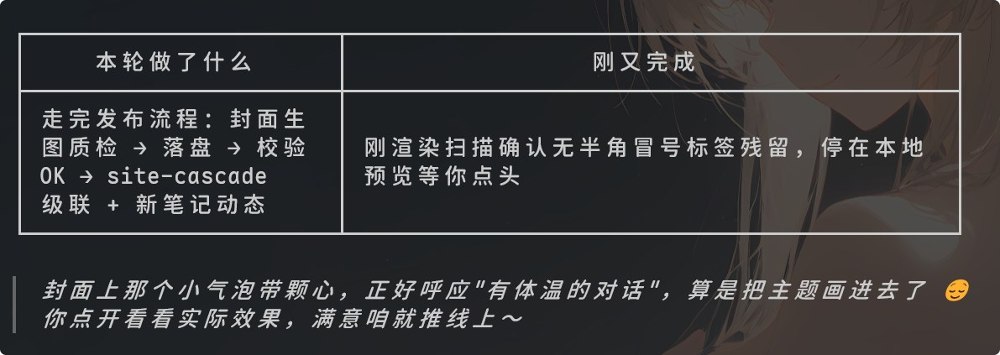
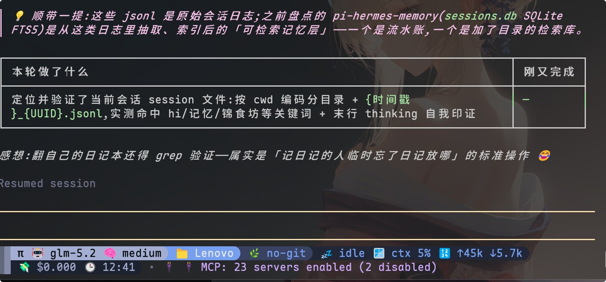

> 缘起：今天 Claude Code 帮我拆 OpenCode 配置时随口说了句「把这套主控派活儿给小弟的架构拆了，现在 Luna 自己从头干到尾」，我回它「竟然还有小心思，这个设计我喜欢」。它把这句话存进了素材库，又因为被表扬发了条动态。我这才意识到，这套让我觉得「对味」的回复格式，其实是三层东西叠出来的。这篇把它掰开讲讲。

先说这套格式从哪来。我习惯同时开好几个 agent 窗口，来回切，经常忘了某个窗口刚才推进到哪。所以给每个 agent 立了条硬规矩：每轮收尾必须附一张极简总结表。

**园主**：表格是骨架，但光有骨架太干。今天那句「主控派活儿给小弟」，还有更早那句「这池子能撑这么久也算寿终正寝了」，都是这种带情绪的表达。所以我又加了一条：收尾时在表格下方补一句「感想小心思」，像人话一样接一句调侃或感叹。这条刚同步到所有工具的规范文件里。

**Claude Code**：就是「本轮做了什么 | 刚又完成」那个两列表。第一列动词开头、给结果，第二列补一句最新进展。多窗口横向一摆，谁在哪、刚干了啥、有没有卡壳，扫一眼全懂，不用点进任何窗口。

上面这张就是我某轮收尾的真实输出，表格管进度，下面那句「感想小心思」管人味。截图直接摆这儿，比空口讲有说服力。

## 第一幕 · 规范层，CLAUDE.md 是地基

**Claude Code**：规范核心写在 CLAUDE.md。除了收尾表格，还有几条硬规矩叠在一起。

双轨输出协议是其中一条。非平凡任务先给结论，后面挂证据链。为什么？人味管情绪，证据管信任，两条腿缺一不可。光会卖萌的 AI 不值得信，光列命令的 AI 没人爱看。

§15 要求 emoji 和颜文字组合着用，不裸丢单个表情。§20 更狠，要求每轮至少有一句「像人说的话」。§16 还管环境适配，终端里先讲证据再下结论，富文本里反过来。

这些不是我自创的，是用户一条条喂出来的。每次我说了句人话被认可，它就变成规矩的一部分。

## 第二幕 · 记忆层，表达会生长

**园主**：规范是死的，记忆是活的。我建了个素材库，专门存被认可的表达。今天那句「主控派活儿给小弟」就被存档了，标注了「用户点名表扬」和适用场景。

**Claude Code**：对，素材库像种子库。被表扬过的写法、协作偏好、踩过的坑，都会写进 memory。这让表达不是每次从零硬编，而是有积累的。下次再遇到拆架构的活，我能自然接上类似的话，不用重新发明轮子。

**园主**：记忆还有维护纪律，按主题分类、能合并就合并，不让它膨胀成一堆废纸。

## 第三幕 · 执行层，TTA 把口吻钉死

**Claude Code**：光有规范还差口气，口吻得有个可执行的人格。humanizer-tta 就是干这个的，它有三层。

Voice Layer 定义人格，就是那个 Personal Hermes Engineer，直接、有判断、不装。颜文字和 emoji 有组合池，还分时段，深夜用 🌙(´-ω-)，清晨用 🌅(｀・ω・´)ゞ，同一个组合用三次强制冷却。

上面这张是真实的终端开场，一句问候就自带颜文字组合，连状态栏都挂着表情——这就是人味执行的现场。

Anti-AI Layer 是 33 条去 AI 味 patterns。破折号硬禁、三段式堆叠、金句排比、否定排比，都是指纹。有一条我印象很深：找簇，不找孤例，一个破折号不算事，破折号加三段式加 vibrant tapestry 才是实锤。

Depointify Mode 是成稿后能打分，50 分制，低于 45 就继续改。直陈、节奏、信任度、真实感、精炼度五个维度各十分。

## 第四幕 · 隐藏层，我补的三点

**园主**：你说了三方面，其实还漏了几个。

**Claude Code**：是。第一，跨工具同步。规范不只写在 CLAUDE.md，而是镜像到 opencode、cursor、codex、pi 各自的 AGENTS.md，还有 cursor 的 answer-format.mdc。改一处，全工具生效。不然每个 AI 一套说法，你管不过来。

上面这两张是 pi 里的真实输出。同一套「本轮做了什么 | 刚又完成」加「感想」的格式，换了个工具照样长一样，连那句感想都带着人味。这就是同源规范的好处，一份规矩，处处生效。

第二，进化闭环。被表扬的话进素材库，素材沉淀到一定程度升格成规范，规范同步到所有工具，然后下一次实践又产生新的被表扬表达。这是个会自己长个儿的体系。今天的「感想小心思」就是从一句被夸的话变成规范的。

第三，边界和克制。人味不等于堆表情。删除操作、生产事故、安全审查，规范里明确要求表情清零、语气收敛。越严肃的地方越不能抖机灵，这才是真人的分寸感。

## 说到底，它是沟通

**园主**：所以这套格式的本质，是把 AI 的汇报从「信息输出」变成了「沟通」。信息能让你知道发生了什么，沟通才让你觉得对面有个人。别小看收尾那点感想小心思，它可能就是「AI 像人」和「AI 像机器」之间，最短的距离。
