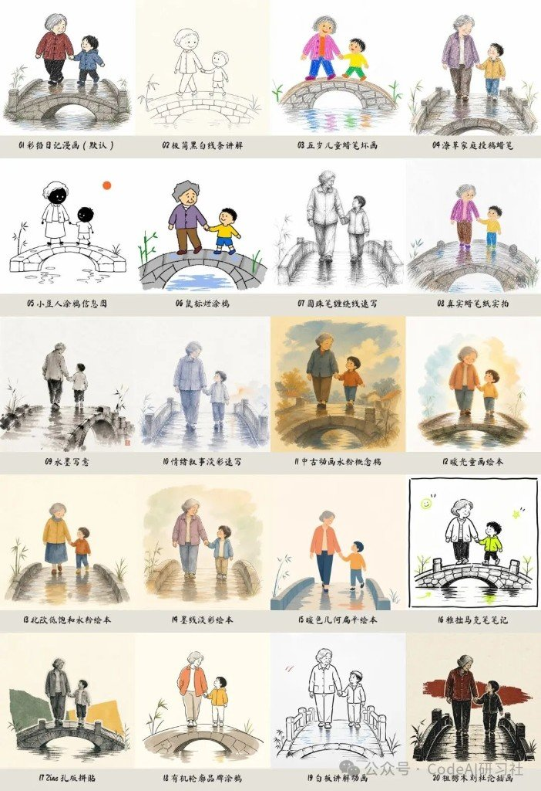
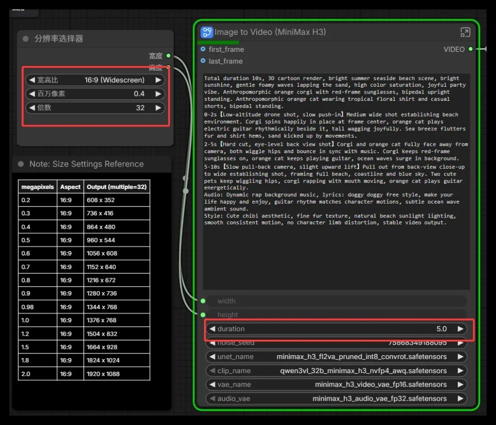

> 本页为「AI 视频制作合集」3 篇的合订本；原文章链接会自动跳转到本页。


## 白板手绘视频能续跑，靠的是 project.json

一句「帮我做个《小马过河》」不够——真正难的是目录不散、分镜可改、坏图只返工一幕、旁白驱动时长、渲染可质检。维克兹开源的 create-whiteboard-video（MIT）把这条链路收成可续跑的 `project.json` 工程，给 Codex / Claude / 同类 Agent 用。

::github{repo="Weikezi-AI/create-whiteboard-video"}

作者自称测速烧约 3 亿 Token；样例 8 幕约 100 秒普通话女声 + 烧录字幕。数字当故事背景，选型看工作流。


## 先对上这些疼点

| 痛点 | Skill 做法 |
|---|---|
| 文件散落 / C 盘炸 | **先确认项目根目录**，素材·venv·成片全进该目录 |
| 图文两层皮 | 口播稿 → 语义分镜 → 每幕一个主动作 |
| 八张一起返工 | 先第 1 幕定画风与角色，再批量 |
| 四肢/拟人手势翻车 | 逐幕结构与故事逻辑检查，不合格不进工程 |
| 画面干等旁白 | **先锁定旁白**，再按真实时长重算各幕 |
| 「画了两遍轨迹」 | 默认对角扫描：轮廓与铺色**同路径** |


## 默认画法：整图斜着扫过去

仓库默认 `diagonal-scan`：

- 整幕从左上推进到右下
- 每条笔触从左下画向右上
- `--ink-path diagonal` 与 `--color-fill diagonal` **必须成对**，否则脚本拒绝
- 固定手部素材跟落墨；可选语义分层（`semantic-stream`）才走 Alpha 蒙版

```powershell
python scripts/video_project.py render <project.json> `
  --ink-path diagonal --color-fill diagonal --pointer hand --pause auto
```


有人吐槽「不是按笔画先后的真手绘」——作者也认：当前是扫描揭示 + 手部跟笔，不是书法笔顺模拟。叫白板流水线更贴切。

## 作者实测路径，可当验收清单

```text
确认目录 → 故事/口播 → 分镜（可 6→8 校准）
→ 第1幕画风测试（五条腿之类当场打回）
→ 批量其余幕 + 质检
→ 旁白/字幕 → 时长重算 → 交付方式确认（烧录/旁挂/无）
→ 渲染 → 拼接 → 首中末帧质检
```

《小红帽》同路径约 10 幕、2 分多——说明可复用的是流水线，不是这一套马年素材。

## 安装边界，别塞错目录

- 读仓库 `SKILL.md`；项目物在**用户确认目录**，不塞进 Skill 安装目录。
- 校验：`python -m unittest scripts/test_video_project.py`
- 生图/配音依赖你的 Agent 环境与额度；作者留言称样例图用 **GPT Image 2**，顺利时大约吃 **Plus 周额度的一成量级**（非 SLA）。
- 仓库不含示例成片二进制；成片属于各项目目录生成物。

## 和本机手绘轨怎么分家

| | create-whiteboard-video | [story-to-handdrawn-video](/posts/story-to-handdrawn-video/)（本机已有） |
|---|---|---|
| 形态 | 完整项目制：分镜·TTS·字幕确认·渲染·质检 | Remotion 图轨：文案/图 → 手绘日记风揭示 |
| 揭示 | 对角扫描 + 手部指针 | 左→右 BW→彩；可选翻页 |
| 声音 | 流程内旁白/字幕（可烧录） | 默认真静音，配音后期 |
| 续跑 | `project.json` + status/validate | 偏单次渲染脚本 |

不是二选一互斥：要「儿童故事白板片 + 旁白一体」看前者；要「已有分镜图快速做无声手绘轨」看后者。

外部视频 Skill 选型地图另见 [六件视频 Agent Skills](/posts/agent-skills-handbook/)。

## 值不值得 star 后再试

价值不在「第一次居然能播」，而在**可停、可改一幕、可续跑**的生产线。人盯分镜和坏图，Agent 把长流程跑完——这才值得 star 后再本地试一发烟雾测试。


## 中文故事进竖屏手绘轨：这仓库把 Skill 和 Remotion 焊在一起

GitHub 上这仓库一句定位很清楚：中文故事文案，或一组有序图片 → 3:4 竖屏手绘日记漫画动画（静音 MP4）。核对日 2026-08-11，约 1190★（MIT）。公众号水印来自 CodeAI研习社。

::github{repo="gnipbao/story-to-handdrawn-video"}

它不是「再写一个 prompt 模板」。根目录是 Remotion 渲染器；`skill-package/` 才是可拷进 `~/.codex/skills/`（或 `~/.claude/skills/`）的 Agent Skill。自然语言驱动，底层仍走 `scripts/run_story_video.py`。

跟 baoyu-comic 知识漫画拆解别并成一篇：那边是翻页漫画 PDF；这边是竖屏揭示/翻书视频轨。本机若已有同名 skill 目录，那是可执行包——本篇是开源项目文档提炼，勿与本地 skill 目录混淆，也别往 Firefly 仓里装。

仓库示例故事带医院冲突画面——样例叙事敏感，仅技术演示。

## 两条进线，六种模式

| 输入 | 结果 |
|---|---|
| 中文故事 | 分句 → 分镜 → 生图 → 渲染 |
| 有序图片 | 直切揭示，或翻书（要完整页） |

入口永远是 `scripts/run_story_video.py`。模式：`plan` / `preview` / `full` / `generate` / `import` / `render`。

文本默认走 Codex Image2；OpenAI 要显式选 API 生成器并自备 Key。敏感情节（时间跳跃、指代乱、医疗、年龄）先 `--mode plan` 或丢 `--visual-plan` JSON，人眼过一遍再生图——别一上来 `full`。

## 画面怎么动

正式画布 1080×1440（预览 720×960），字幕在上、插画在下，插画 `contain` 不裁。

直切节拍从左到右：

```text
文字 → 黑白画稿 → 彩色插画
```


翻书另一套规矩：上传页原样静置，再从右下角卷页；不要再叠字幕/黑白/上色。纸背留淡化原页。翻书素材必须是完整页，别塞半截裁图。

成片是 H.264 静音画面轨——配音和 BGM 是后期的事。

彩铅日记四格（字幕+插画）长这样：


## 20 种风格，默认彩铅日记

风格库二十档，编号 / 英文 id / 中文名 / 别名都能查；默认 `colored-pencil-diary`（彩铅日记漫画）。同场景对照网格一眼能选风：



完整表与 prompt 块在仓库 `references/handdrawn-style-library.json`，笔记里不复读二十段形容词。

## 装起来怎么预览

环境：Node 20+、Python 3.10+、FFmpeg、npm、Chrome/Remotion。

```bash
git clone https://github.com/gnipbao/story-to-handdrawn-video.git
cd story-to-handdrawn-video
npm ci && npm run check

cp -R skill-package/story-to-handdrawn-video ~/.codex/skills/
export STORY_VIDEO_PROJECT=/absolute/path/to/story-to-handdrawn-video
```

Agent 里：

```text
使用 $story-to-handdrawn-video 先给这个故事生成一个预览版。
```

或脚本：`--mode preview` 看 720×960，确认后再正式渲染。

## 边界写在前面

- 故事文本路径只认中文；无内置配音。
- 复杂分格不会自动拆成多镜。
- 留言区老问题：烧 Token——多镜多风格会啃额度；先 plan/preview。换其它大模型不在默认契约里，得自己改生成器。
- 易翻车点：时间跳跃、指代、医疗与年龄敏感 → 先 JSON 规划，人工确认。

认清它卖的是「Skill 契约 + Remotion 画面轨」，不是万能漫剧工作室，选型会轻松很多。


## 33B 的 MiniMax H3，16G 显存靠量化能本地跑

公众号「AIGC小顽童」2026-08-11 这篇，核心不是安利，是一条个人机能不能落地的实测路径：H3 开源权重很大，满血 BF16 别想了；走秋叶/桌面 ComfyUI + INT8/NVFP4 四文件，作者称 16G 推荐可用。

下面只留能带走的：档位、文件落点、关键参数、提示词骨架、坑，以及和官方 API 的分界。文中数字均标作者实测/转述，本机未复跑。


## H3 本地到底开了什么

| 项 | 口径 |
|---|---|
| 体量 | 33.1B dense Omni（非 MoE） |
| 时间线 | 约 2026-07-31 发布 · 08-03 开源权重 |
| 同 pass | 文/图/参考 → 视频 + 原生立体声 |
| 文本塔 | Qwen3-VL-32B |
| 本地分辨率 | 默认约 768p；2K / Context-IR 作者称仅 API |
| 帧/声 | 帧数 17n+5 · 24fps · 音频 32kHz 立体声 |
| 开源 | FL2VA、Ref2VA |
| 未开源 | Context-IR、Regenerate-2K（作者口径） |

许可证别跟着软文拍板：作者转述「排除美/欧/英/韩本地」+「社区许可年营收 <$20M 商用」——以官方 LICENSE 为准，本稿只记风险。

## 显存 / 内存：个人机认量化档

| 显存 | 作者结论 |
|---|---|
| 8G + NF4 | 勉强 |
| 12G + INT8 | 能跑 |
| 16G | 推荐 |
| 24G+ | 舒服 |
| 满血 BF16 | 集群；个人别硬刚 |

系统内存：32G 底线，64G 甜点（动态卸载）。作者踩坑原话级别的提醒——内存往往要比「显卡够不够」更先爆。

正文里出现过 `RTX 6060` / `34G` 一类字样，留言也在嘲；对照留言环境更像 4060 系。当审核口误存疑，别按字面买卡。

## 部署：Comfy 模板 + 四个文件约 42.5GB

路径很短：

1. 秋叶启动器或桌面版先更新内核/依赖（原文配图：版本管理 / 一键更新）
2. 侧栏模板 → 加载 MiniMax H3（文生 / 图生 / 参考生）
3. 按 Model Links 把权重丢进对应目录


| 文件 | 放哪 |
|---|---|
| `minimax_h3_video_vae_fp16.safetensors` | `models/vae/` |
| `minimax_h3_audio_vae_fp32.safetensors` | `models/vae/` |
| `minimax_h3_fl2va_pruned_int8_convrot.safetensors` | `models/diffusion_models/` |
| `qwen3vl_32b_minimax_h3_nvfp4_awq.safetensors` | `models/text_encoders/` |

目录名错一个，节点就空白——这是最高频的「下完了却跑不起来」。

## 参数先钉这几个



配图分辨率表（Multiple=32）：

| MP | 约像素 |
|---|---|
| 0.4 | 864×480（低分试词） |
| 0.98 | 1344×768（≈768p） |
| 2.0 | 1920×1088（≈1080p） |

另记：

- 时长看节点 `duration`（配图示例 5.0；提示词里若写 10s，以节点为准或自行对齐）
- 帧数合法集：17n+5
- 本地别指望文里吹的 2K 满血——那条在 API 侧

## 提示词：主题 / 时间轴 / 镜头 / 声音

作者推「四行法」——时间段连续且不重叠：

```text
主题：…
主体时间轴：0-As …；A-Bs …；B-Xs …
镜头：…
声音：…
```


和站内「把 MiniMax 当制片」那条（API 侧三字段/五模式）是同一家模型、两条轨：那边管云端提示词结构，这篇管本机权重与显存档。旁链即可，别硬并。

## 坑与迭代节奏

| 坑 | 怎么处理 |
|---|---|
| OOM | 降 MP / 缩短 duration；先查系统内存是否 <32G |
| 找不到模型 | 对照上表四路径，vae 别塞进 checkpoints |
| 糊 | 低分只负责定稿词；母版再抬到 ~0.9MP |
| 音画飘 | 时长、帧数规则、音频 VAE 是否挂上 |
| SageAttention | 留言当加速手段；新手慎开，出问题先关 |

作者建议的四轮：低分试词 → 加参考 → ~0.9MP 母版 → 外部超分或 API 2K。

留言可采信程度一般，但有用数量级：768p + 16G 至少约 25 分钟（作者/读者口径）；另有 torch cu130 / TeaCache / SageAttention 加速讨论；Mac 体验差。

## 本地和 API 怎么分

| 要这个 | 走哪 |
|---|---|
| 个人练手、省额度、FL2VA/Ref2VA/文生+立体声 | 本地量化 Comfy |
| Context-IR、Regenerate-2K、正经 2K | 官方 API |
| Firefly 站内出片额度/脚本 | `firefly-minimax-media`（API 链路，与本文 Comfy 本地无关，勿混改） |

网盘「全家桶福利」、加群领模型——原文若有，不要当知识收录。权重去官方/可信镜像自己核哈希。
