> 本页为「AI 视觉创作合集」12 篇的合订本；原文章链接会自动跳转到本页。


## 四套 Image2 口令：换槽位比换风格更值钱

公众号甩了四组 GPT Image 2（作者口径）提示词 + 七张示例。完整口令留在源素材里，这里只留对照骨架、可改槽位、身份一致性怎么钉。

同模型案例合集（玩法盘点 55–75）和「七种高张力海报」是另一类货——配方库 / 海报张力 ≠ 本篇四风格骨架；旁链一眼，别整包并进来。站内已发的 [UI 分层切图](/posts/gpt-image2-ui-layer-slice/) 也是同模型、另一条交付线。


## 四风格对照

| # | 风格 | 视觉锚 | 比例 / 参考 | 真正可复用的旋钮 |
|---|---|---|---|---|
| 1 | 极简动漫吉他少女 | Lo-fi × 吉卜力 × 新海诚；珊瑚橙 Strat、红耳机、米色卫衣 | 横幅插画感；奶油底留白 | 发色 / 乐器色 / 服装件套；线稿+赛璐珞+粉彩点缀先钉死 |
| 2 | 另类图形角色 | 夸张五官、硬边赛璐珞、旧纸纹理 | 4:5 | `[CLOTHING]` / `[BACKGROUND]` / `[TEXT]` 三槽；脸型牙缝结构别动 |
| 3 | 水墨水彩肖像 | 狂墨线 + 暖棕赭水彩 + 红橙蝴蝶 | `--ar 9:16`；可上传人像 | 「主体身份」用参考图；蝴蝶色 / 负空间白底当对比旋钮 |
| 4 | 博物馆展览肖像 | 对角聚光、日式壁画、Portra | 中近景；身份一致性参考图 | 服装色块 + 光束方向 + 负面提示；脸/发型锁参考 |


## 槽位怎么写（别整段重写）

另类角色是本包最「模板」的一组：脸与线稿语法固定，换三槽就出系列海报。

| 槽位 | 干什么 | 成图示例 |
|---|---|---|
| `[CLOTHING]` | 宽大图形块衣服 + 少褶皱 | 连帽衫 / 背心 / 外套…… |
| `[BACKGROUND]` | 大面积平涂底，细节克制 | 色块墙、抽象平面 |
| `[TEXT]` | 粗糙手绘大字 | BAD SIGNAL · PERMANENT VACATION · MAKE NOISE |

吉他少女没有方括号槽，但可变项同样清晰：发色（黑 / 棕两变体）、Strat 珊瑚色、耳机红、米色连帽衫——改一项就能出变体，不必推翻「Lo-fi + 吉卜力 + 新海诚」句。

水墨组把主体写成「男人（已上传图片）」——口令默认走图生/参考；没参考就先换成具体外貌描述，别空喊「男人」。


## 身份一致性：博物馆组在教什么

第 4 组开头不是氛围词，是合同：

1. 先喂参考图，再写场景
2. 明示锁定：面部、发型、刘海、比例、肤色、姿态、轮廓
3. 场景侧用对角聚光 + 日式壁画 + Portra 胶片拉情绪
4. 负面提示清动漫/多肢体/霓虹/糊脸——写实肖像比插画更吃这一刀

商用前：参考人脸与示例图都要过授权；本帖示例只供学习，不授权二创出货。


## 什么时候抄哪一套

- 要干净二次元海报、好物点缀清楚 → 吉他少女
- 要角色 IP / 系列字报、同一张脸换衣服换标语 → 另类图形 + 三槽
- 要手绘感肖像、竖版封面 → 水墨水彩 + 9:16
- 要电影感环境人像、同一个人多场景 → 博物馆 + 参考图锁身份

完整四段 Prompt 与七张原图顺序映射见源素材；未在本机重跑生图。玩法盘点 / 高张力海报仍待发布，链接后补。


## 3 分钟交切图：GPT Image 2 把 UI 从灵感图做成可编辑资产

以前拿 AI 出 UI，多半是「看起来像 App」的一张扁图：中文糊、结构飘、前端没法拆。GPT Image 2 这次把口子拧到交付侧——文字能读、懂导航/卡片/Tab，还能按背景 / 组件 / 图标 / 文字分层导出。跑通一轮大约三分钟：先把整体对上，再抠细节，最后交切图。

---

## 为什么这次不一样

图面原话写得很直：**不只是画图，是生产素材**。左边便签三条：更懂中文、更像设计师、直接出素材。中间那条箭头才是重点——从灵感图到可交付 UI 资产（分层资源）。


三刀能力，对照着用：

| 能力 | 图面说法 | 你要盯的结果 |
|---|---|---|
| 文字清晰 | 中文也能稳定出清 | 按钮「确认」、输入框「请输入用户名」一类字能直接读 |
| 懂 UI 结构 | 导航 / 卡片 / Tab | 顶栏、内容区、底栏各归其位，不是一张海报硬塞控件 |
| 分层可编辑 | 背景 / 组件 / 图标 / 文字 | 导出 PNG 分层，能改、能交、能进 Figma |

底下一行流程也写死了：`prompt → screen → refine → layers`。别指望一句提示词同时完成构图和像素级细节。

---

## 3 分钟四步

口诀跟图底虚线框一致：**整体先对 → 再抠细节 → 最后交付切图**。

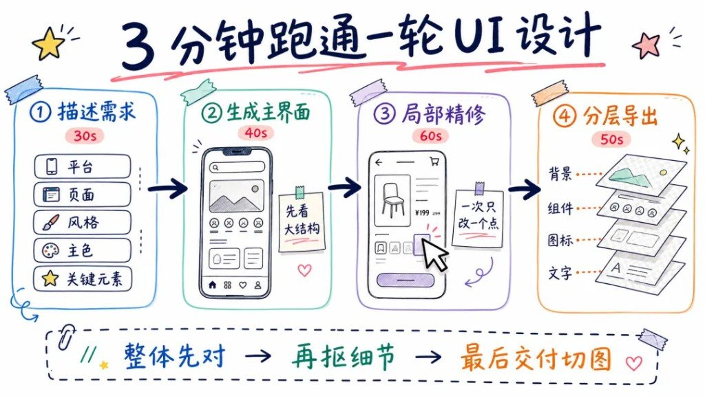

| 步 | 耗时（图面） | 你该干什么 |
|---|---|---|
| ① 描述需求 | 30s | 钉死平台 / 页面 / 风格 / 主色 / 关键元素 |
| ② 生成主界面 | 40s | **先看大结构**，别急着抠图标圆角 |
| ③ 局部精修 | 60s | **一次只改一个点** |
| ④ 分层导出 | 50s | 背景 · 组件 · 图标 · 文字 分开出 |

### 需求模板（五字段）

图里空白框就是这五项，先填满再喂模型：

```text
平台：
页面：
风格：
主色：
关键元素：
```

成句版（把五项串进一句需求单）：

```text
请设计一个【平台】的【页面】。
风格：【风格】
主色：【主色】
关键元素：【关键元素，逗号分隔】
要求：中文文字清晰可读；界面具备真实 App 的导航 / 卡片 / Tab 结构；输出适合后续分层（背景 / 组件 / 图标 / 文字）。
```

### 精修例句（一次一个点）

```text
只修改底部导航的图标样式，其它布局、配色、文案全部保持不变。
```

```text
只把主操作按钮改成暖橙色高亮，卡片与顶栏不动。
```

```text
只校正标题字号层级（更大标题、更小辅助说明），不要改版式结构。
```

### 双交付路径

| 路径 | 图面说法 | 适合何时 |
|---|---|---|
| 直接切图给前端 | 分层导出 PNG 直接交付开发 | 结构已定、要快速进开发 |
| 导入 Figma 二次编辑 | 组件化调整，复用更高效 | 还要改文案、对齐品牌组件库 |

---

## 外卖商家详情页完整示例

工具箱底部示例组合 verbatim：**iOS + 商家详情页 + 暖橙 + 底部购物车**。下面按五字段填满，可直接粘贴开跑。

```text
请设计一个 iOS 外卖 App 的商家详情页。
风格：现代清爽、偏餐饮食欲感，信息层级清楚
主色：暖橙
关键元素：顶部商家头图与评分、菜品列表卡片、优惠标签、底部固定购物车栏（含合计与去结算）
要求：中文文字清晰可读；顶栏 / 内容卡片 / 底部栏结构完整；适合后续按背景、组件、图标、文字分层导出。
禁止：文字乱码、控件挤成一团、把整页画成海报、一次塞多个无关页面。
```

精修可以接着丢：

```text
在上一版基础上，只加强底部购物车栏的暖橙高亮与「去结算」按钮对比度，其它区域保持不变。
```

交付时二选一：分层 PNG 直接给前端；或导入 Figma 把购物车、菜品卡做成可复用组件。

---

## 提示词速查表

先看整张工具箱，再按下表取词。


### 风格关键词

| 方向 | 可拼词 |
|---|---|
| 清爽工具感 | 现代扁平、大量留白、细分割线、低阴影 |
| 餐饮食欲 | 暖色点缀、食物摄影质感、圆角卡片、轻投影 |
| 高端克制 | 低饱和、强层级、少装饰、品牌主色点到为止 |

### 结构关键词

| 模块 | 可拼词 |
|---|---|
| 导航 | 顶部导航、底部 Tab、返回与标题栏 |
| 内容 | 卡片列表、双列网格、分段标题、空状态 |
| 操作 | 主按钮、次按钮、底部固定栏、角标 |

### 输出控制关键词

| 目的 | 可拼词 |
|---|---|
| 文字 | 中文清晰可读、禁止乱码、字号层级明确 |
| 结构 | 真实 App UI、导航/卡片/Tab、单页单屏 |
| 分层 | 可分层导出、背景/组件/图标/文字分离、透明底 PNG |
| 边界 | 一次只出一页、不要海报构图、保持上版未改区域不变 |

短拼示例（与图底一致）：

```text
iOS + 商家详情页 + 暖橙 + 底部购物车
```

---

## 避坑：五条就够卡住质量

图面「避坑小贴士」五条，照做：

1. **一次一页** —— 多页同屏生成，结构和文字都会糊。
2. **校对字号** —— 模型偶尔把辅助说明写得比标题还大，过一眼层级。
3. **给品牌色** —— 不写主色就容易落到默认蓝紫；暖橙、品牌 HEX 写进提示词。
4. **复杂页回 Figma** —— 多状态、长列表、设计系统对齐，分层进 Figma 再组件化。
5. **商用看授权** —— 出图能用 ≠ 账号/平台条款允许商用，交付前自己核。

再叠一句四步纪律：**一次只改一个点**。结构还飘就回头改需求，别在精修里 simultaneous 改五个地方。

---

## 认清你要的是灵感还是切图

GPT Image 2 在 UI 这条线上，值钱的不是「又一张好看的手机框」，而是：**字能读、结构像真 App、层能拆开交给人或前端**。三分钟四步够你验证方向；真要进生产，复杂页回 Figma、商用核授权，这两步别省。

### 旁链（不合并）

| 你想解决的事 | 去哪篇 |
|---|---|
| 案例合集抄板子（55–75） | GPT Image2 案例 55–75（待发布） |
| 海报要「狠」 | 七种高张力海报（待发布） |
| 前端别 AI 紫 | Taste Skill 反模板审美（待发布） |
| 好图怎么反推 | AI 图片提示词反推公式（待发布） |
| 卡通文旅海报 | [五个槽填完就能出图](/posts/gpt-cartoon-travel-poster-prompt/) |


## 用 GPT 做卡通文旅海报：五个槽填完就能出图

文旅海报一旦写成「风景好看、人物开心」，模型只会给你一张正确但没记忆点的插画。

这套模板把风格钉死在**扁平矢量海报**：粗黑轮廓、圆角几何、纯色块、极简五官、彩带涂鸦、干净留白、竖版 4:5。你只管填五个槽——人、动物、姿势、服装、风景——外加一块调色板。填完直接贴进 GPT 出图。

原料是一篇微信短文 + 三张效果图；关注引流已删，只留模板和例证。出处链接原文未附，见文末脚注。[^1]

---

## 先看三张填槽结果

同一骨架，换主体和场景，气质就从「红河瓦猫」跳到「大理丽江路牌」，再到「多孩动物合影」。

### 云南红河 · 瓦猫

孩童 + 瓦猫，梯田、石桥、灰瓦屋顶；标题区「云南红河」。

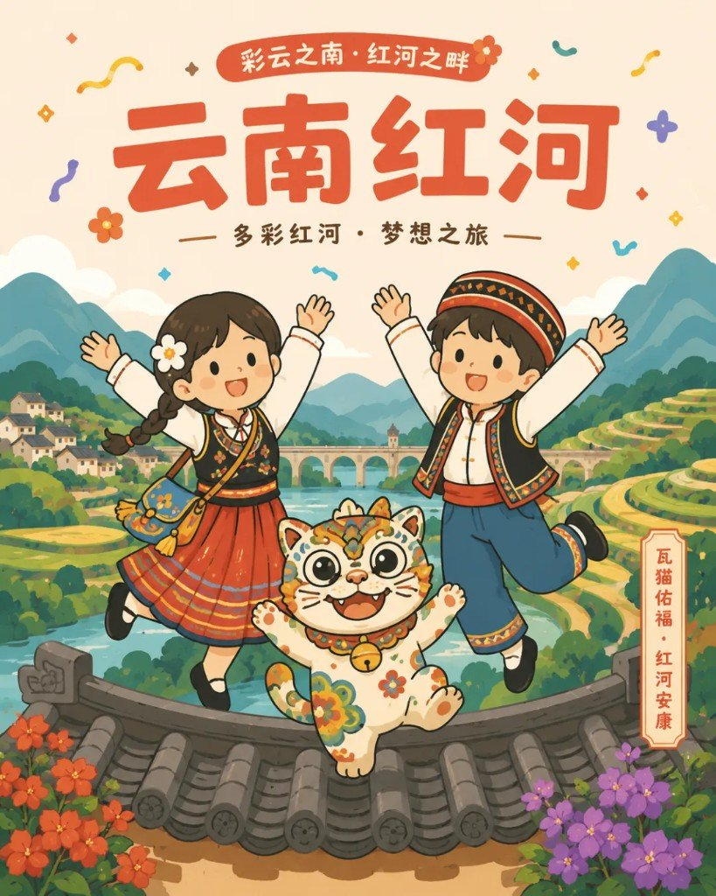

### 云南 · 大理 / 丽江路牌

女孩 + 花猫，大理门楼、雪山、路牌指向大理 / 丽江 / 香格里拉。

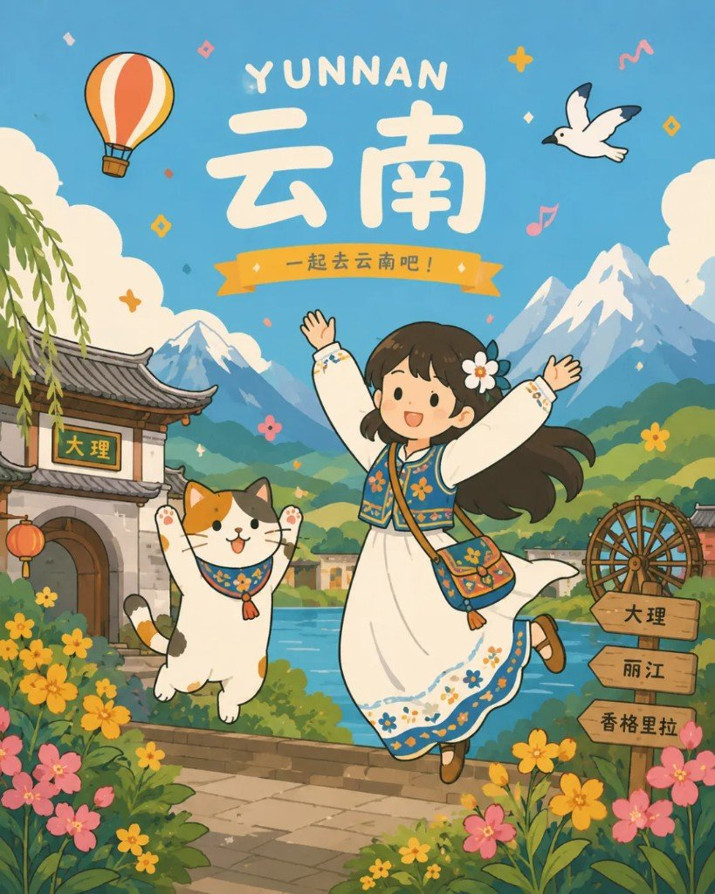

### 草地合影 · 多孩多动物

四人与北极熊、长颈鹿、棕熊、企鹅、狐狸、兔子、花猫等排成竖版合影；色块更偏黄绿橙。

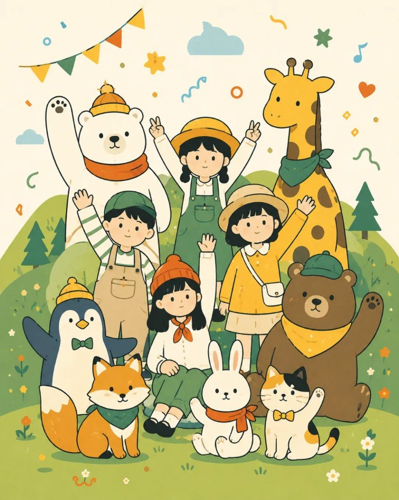

评论区有人要科普图 / 流程图，有人吐槽国内 GPT 贵——那是另一条需求；本篇只锁这套文旅卡通海报槽。

---

## 完整提示词（逐字可复制）

占位符保留方括号，用中文具体名词替换后再提交。

```text
一张趣味十足的扁平矢量海报插画，描绘了[人类]与[动物]以[姿势]摆出各种姿势，身着[服装]，置身于[风景]之中。使用干净利落的粗黑轮廓线、简洁的圆角几何图形、扁平的纯色填充、极简的面部细节、小巧的中性眼神、平静的表情、简化的手部和身体比例、柔和的色块、零星的彩带涂鸦、小巧的抽象图标、干净的留白、清晰的图形海报布局以及精心控制的[调色板]。竖版 4:5 构图。
```

### 槽怎么填

| 占位符 | 填什么 | 例（对照上图） |
|---|---|---|
| `[人类]` | 人数、年龄、关系 | 一对穿民族服饰的孩童 / 一名女孩 / 四个孩子 |
| `[动物]` | 品种 + 是否拟人配饰 | 云南瓦猫 / 戴围巾的花猫 / 熊·长颈鹿·企鹅等 |
| `[姿势]` | 动态或队形 | 跳跃举手 / 路牌前合影式挥手 / 草地排排坐挥手 |
| `[服装]` | 地域或季节特征 | 绣花马甲与条纹裙 / 蓝绣花白裙 / 背带裤与针织帽 |
| `[风景]` | 地标 + 前景物 | 红河梯田与石桥 / 大理门楼与雪山路牌 / 草地丘陵彩旗 |
| `[调色板]` | 主色 3–5 个，写死 | 红橙绿梯田色 / 天蓝金黄民族蓝 / 黄绿橙米色 |

风格句已经很长，**别再往模板里塞「高级、震撼、电影感」**——那些词会冲掉扁平矢量约束。要改气质，动槽位和调色板就够。

下期风格征集原文提到：国风 / 赛博朋克 / 日漫 / 写实人像 / 美食 / 建筑——需要哪条再单独开篇，别和这篇扁平文旅槽硬揉。

---

## 相关笔记（旁链，不合并）

- GPT-Image2 玩法盘点（待发布）—— 同模型族案例合集
- [UI 设计分层切图](/posts/gpt-image2-ui-layer-slice/) —— 出可编辑 UI 资产
- 七种高张力海报（待发布）—— 狠封面 vs 本篇软萌文旅
- AI 图片提示词反推公式（待发布）—— 按维拆图反推；本篇是直接可复制槽模板


## 短剧男主总撞脸？60 种脸型风格提示词按气质选型

AI 出男主，最烦的不是「不够帅」，是**怎么生成都像同一个人**。根因多半不是模型抽风，是脸型风格跟人设没对上——冷峻复仇线却塞了元气犬系脸，画面再精致也像串戏。

用法很简单：**先定人设性格与身份，再挑脸型气质**，别先丢「帅哥」三个字碰运气。冷峻型、清爽型、清冷型、反派型、贵气型、破碎型、野痞型……方向对了，撞脸概率会低一截。

---

## 先定人设，再对脸

把角色拆成三件事再开生成：性格（冷 / 暖 / 邪 / 碎）、身份（学长 / 总裁 / 反派 / 将军）、题材场（校园 / 商战 / 仙侠 / 年代）。三件事定完，从表里挑气质最近的一款，把「提示词」当五官锚、「适合造型」当服装镜头锚。

同一部剧换装可以，**脸型气质锚别一场戏换三种**——观众认的是骨相情绪，不是衣服。

---

## 60 款速查（编号 · 风格名）

| 区段 | 风格 |
|---|---|
| 01–06 | 冷峻电影脸 · 清爽初恋脸 · 阳光少年脸 · 清冷校草脸 · 都市精英脸 · 轻熟总裁脸 |
| 07–12 | 白月光学长脸 · 港风浓颜脸 · 元气犬系脸 · 清冷骨相脸 · 豪门贵公子脸 · 反派野心脸 |
| 13–18 | 狐系钓系脸 · 邻家治愈脸 · 破碎感男主脸 · 禁欲撩人脸 · 猫系慵懒脸 · 温柔知性脸 |
| 19–24 | 清贫倔强脸 · 事业掌控脸 · 病弱白月光脸 · 复仇黑莲脸 · 文艺淡颜脸 · 高智学霸脸 |
| 25–30 | 混血立体脸 · 明艳贵公子脸 · 温柔人夫脸 · 厌世疏离脸 · 甜飒贵少脸 · 学院清冷脸 |
| 31–36 | 清冷仙气脸 · 逆袭大男主脸 · 无辜奶狗脸 · 机灵甜弟脸 · 飒爽律师脸 · 复古名流脸 |
| 37–42 | 禁欲高岭草脸 · 纯真鹿系脸 · 清醒事业脑脸 · 暗黑病娇脸 · 温柔哥哥脸 · 精致王子脸 |
| 43–48 | 落魄少爷脸 · 冷感模特脸 · 柔弱哭包脸 · 清醒复仇脸 · 古早白月光脸 · 飒气太子脸 |
| 49–54 | 书卷温柔脸 · 清冷科研脸 · 野痞荷尔蒙脸 · 斯文败类类型脸 · 少年将军脸 · 腹黑军师脸 |
| 55–60 | 异域锋锐脸 · 漫撕贵公子脸 · 忠犬守护脸 · 冷面法医脸 · 狼系狠戾脸 · 少年帝王脸 |

---

## 01–06

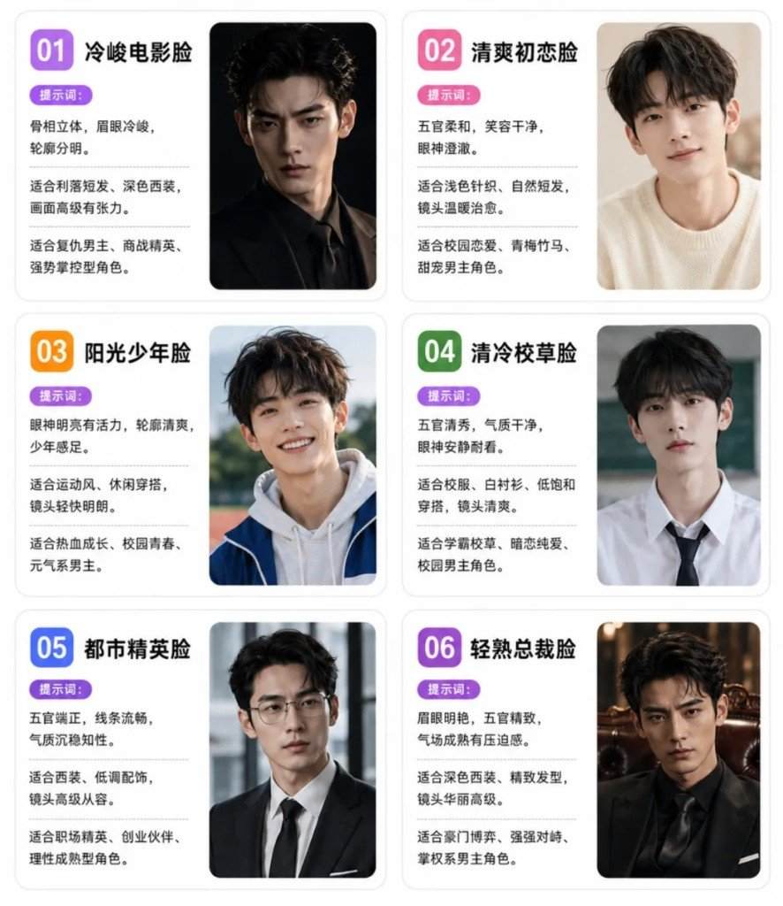

| # | 风格名 | 提示词 | 适合造型 | 适合角色 |
|---|---|---|---|---|
| 01 | 冷峻电影脸 | 骨相立体，眉眼冷峻，轮廓分明。 | 适合利落短发、深色西装，画面高级有张力。 | 适合复仇男主、商战精英、强势掌控型角色。 |
| 02 | 清爽初恋脸 | 五官柔和，笑容干净，眼神澄澈。 | 适合浅色针织、自然短发，镜头温暖治愈。 | 适合校园恋爱、青梅竹马、甜宠男主角色。 |
| 03 | 阳光少年脸 | 眼神明亮有活力，轮廓清爽，少年感足。 | 适合运动风、休闲穿搭，镜头轻快明朗。 | 适合热血成长、校园青春、元气系男主。 |
| 04 | 清冷校草脸 | 五官清秀，气质干净，眼神安静耐看。 | 适合校服、白衬衫、低饱和穿搭，镜头清爽。 | 适合学霸校草、暗恋纯爱、校园男主角色。 |
| 05 | 都市精英脸 | 五官端正，线条流畅，气质沉稳知性。 | 适合西装、低调配饰，镜头高级从容。 | 适合职场精英、创业伙伴、理性成熟型角色。 |
| 06 | 轻熟总裁脸 | 眉眼明艳，五官精致，气场成熟有压迫感。 | 适合深色西装、精致发型，镜头华丽高级。 | 适合豪门博弈、强强对峙、掌权系男主角色。 |

---

## 07–12

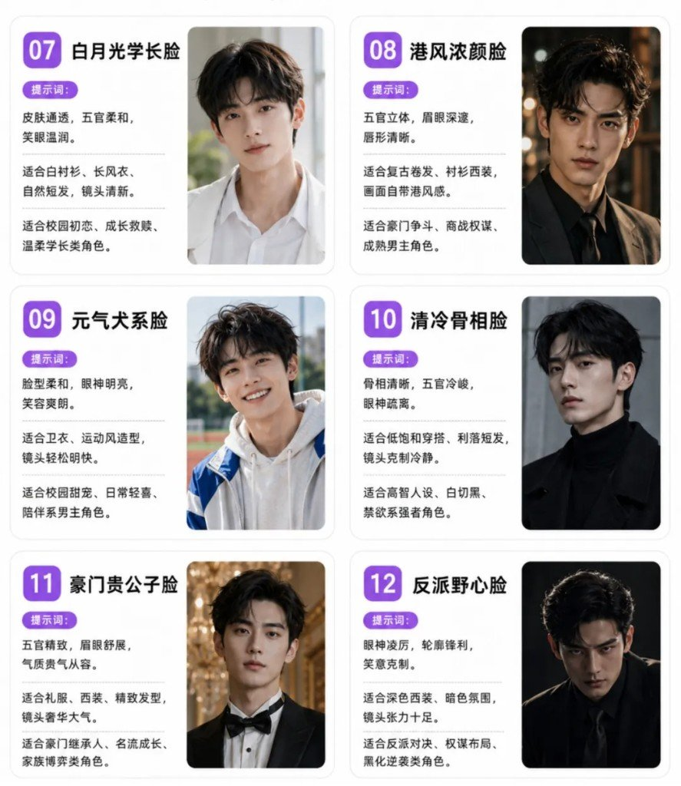

| # | 风格名 | 提示词 | 适合造型 | 适合角色 |
|---|---|---|---|---|
| 07 | 白月光学长脸 | 皮肤通透，五官柔和，笑眼温润。 | 适合白衬衫、长风衣、自然短发，镜头清新。 | 适合校园初恋、成长救赎、温柔学长类角色。 |
| 08 | 港风浓颜脸 | 五官立体，眉眼深邃，唇形清晰。 | 适合复古卷发、衬衫西装，画面自带港风感。 | 适合豪门争斗、商战权谋、成熟男主角色。 |
| 09 | 元气犬系脸 | 脸型柔和，眼神明亮，笑容爽朗。 | 适合卫衣、运动风造型，镜头轻松明快。 | 适合校园甜宠、日常轻喜、陪伴系男主角色。 |
| 10 | 清冷骨相脸 | 骨相清晰，五官冷峻，眼神疏离。 | 适合低饱和穿搭、利落短发，镜头克制冷静。 | 适合高智人设、白切黑、禁欲系强者角色。 |
| 11 | 豪门贵公子脸 | 五官精致，眉眼舒展，气质贵气从容。 | 适合礼服、西装、精致发型，镜头奢华大气。 | 适合豪门继承人、名流成长、家族博弈类角色。 |
| 12 | 反派野心脸 | 眼神凌厉，轮廓锋利，笑意克制。 | 适合深色西装、暗色氛围，镜头张力十足。 | 适合反派对决、权谋布局、黑化逆袭类角色。 |

---

## 13–18

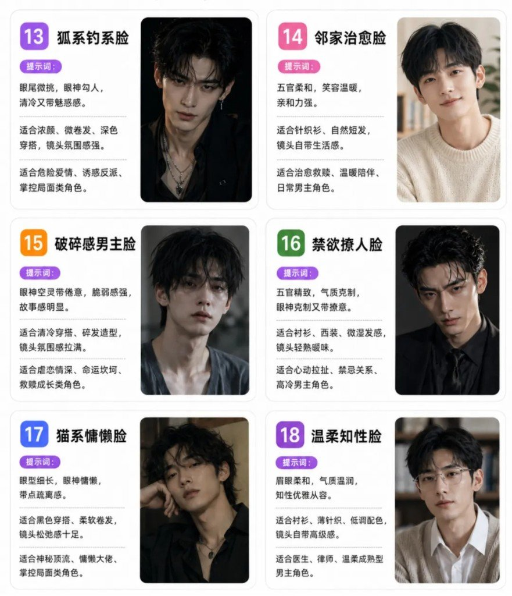

| # | 风格名 | 提示词 | 适合造型 | 适合角色 |
|---|---|---|---|---|
| 13 | 狐系钓系脸 | 眼尾微挑，眼神勾人，清冷又带魅惑感。 | 适合浓颜、微卷发、深色穿搭，镜头氛围感强。 | 适合危险爱情、诱惑反派、掌控局面类角色。 |
| 14 | 邻家治愈脸 | 五官柔和，笑容温暖，亲和力强。 | 适合针织衫、自然短发，镜头自带生活感。 | 适合治愈救赎、温暖陪伴、日常男主角色。 |
| 15 | 破碎感男主脸 | 眼神空灵带倦意，脆弱感强，故事感明显。 | 适合清冷穿搭、碎发造型，镜头氛围感拉满。 | 适合虐恋情深、命运坎坷、救赎成长类角色。 |
| 16 | 禁欲撩人脸 | 五官精致，气质克制，眼神克制又带撩意。 | 适合衬衫、西装、微湿发感，镜头轻熟暧昧。 | 适合心动拉扯、禁忌关系、高冷类男主角色。 |
| 17 | 猫系慵懒脸 | 眼型细长，眼神慵懒，带点疏离感。 | 适合黑色穿搭、柔软卷发，镜头松弛感十足。 | 适合神秘顶流、慵懒大佬、掌控局面类角色。 |
| 18 | 温柔知性脸 | 眉眼柔和，气质温润，知性优雅从容。 | 适合衬衫、薄针织、低调配色，镜头自带高级感。 | 适合医生、律师、温柔成熟型男主角色。 |

---

## 19–24


| # | 风格名 | 提示词 | 适合造型 | 适合角色 |
|---|---|---|---|---|
| 19 | 清贫倔强脸 | 骨相清瘦，眼神坚定，嘴唇微抿。 | 适合素朴穿搭、自然碎发，镜头朴实动人。 | 适合底层奋斗、逆袭成长、坚韧励志类角色。 |
| 20 | 事业掌控脸 | 五官凌厉，眼神锐利，下颌清晰。 | 适合精致西装、成熟发型，镜头冷峻高级。 | 适合职场掌权人、商战精英、强势男主角色。 |
| 21 | 病弱白月光脸 | 肤色偏白，五官柔弱，眼神安静。 | 适合浅色衬衫、黑色碎发，镜头柔光朦胧。 | 适合病弱少爷、坎坷身世、被守护类角色。 |
| 22 | 复仇黑莲脸 | 五官深邃，眼神凌厉，冷感神秘。 | 适合黑衬衫、暗色光影，镜头暗黑有张力。 | 适合复仇逆袭、心机谋略、暗中布局类角色。 |
| 23 | 文艺淡颜脸 | 五官清淡，线条柔和，气质安静。 | 适合毛衣、低饱和穿搭，镜头自然治愈。 | 适合文艺青年、平凡日常、慢热成长类角色。 |
| 24 | 高智学霸脸 | 五官端正，眼神清亮，气质沉稳理性。 | 适合眼镜、衬衫、低调学院风，镜头理智清冷。 | 适合学霸精英、科研天才、冷静谋略类角色。 |

---

## 25–30


| # | 风格名 | 提示词 | 适合造型 | 适合角色 |
|---|---|---|---|---|
| 25 | 混血立体脸 | 骨相立体，眉骨清晰，五官深邃。 | 适合西装、金属配饰、利落发型，镜头感强。 | 适合跨国继承人、神秘贵少、强势男主角色。 |
| 26 | 明艳贵公子脸 | 五官明艳大气，眉眼有神，气质华贵。 | 适合礼服、西装、卷发造型，镜头存在感强。 | 适合贵公子、掌权少爷、高段位男主角色。 |
| 27 | 温柔人夫脸 | 五官柔和，笑眼温润，整体温暖亲和。 | 适合淡色针织、低调发型，镜头温暖治愈。 | 适合贤夫人设、婚恋成长、暖心陪伴类角色。 |
| 28 | 厌世疏离脸 | 表情冷淡，眼神疏离，轮廓清冷。 | 适合黑色穿搭、直发碎发，镜头自带故事感。 | 适合黑化复仇、孤傲少爷、天才型男主角色。 |
| 29 | 甜飒贵少脸 | 五官精致灵动，眼神明亮，带点小傲气。 | 适合精致穿搭、轻奢配饰，镜头甜飒兼具。 | 适合傲娇少爷、校园男神、反差萌男主角色。 |
| 30 | 学院清冷脸 | 五官清秀，线条干净，气质清冷书卷。 | 适合校服、西装马甲或衬衫，镜头清新自然。 | 适合学霸校草、理性科研、校园男主角色。 |

---

## 31–36


| # | 风格名 | 提示词 | 适合造型 | 适合角色 |
|---|---|---|---|---|
| 31 | 清冷仙气脸 | 肤色通透，轮廓柔净，眼神安静。 | 适合浅色长风衣、柔光造型，镜头空灵轻盈。 | 适合仙侠转世、白月光、宿命羁绊类男主。 |
| 32 | 逆袭大男主脸 | 骨相分明，眼神坚韧，气质清醒。 | 适合利落短发、淡冷妆感，镜头有成长张力。 | 适合逆袭翻盘、创业奋斗、觉醒反击类角色。 |
| 33 | 无辜奶狗脸 | 五官柔软，眼神无辜，表情干净。 | 适合浅色毛衣、自然碎发，镜头柔和清爽。 | 适合替身文学、误会虐恋、被偏爱型男主。 |
| 34 | 机灵甜弟脸 | 眼神活泼，笑容明亮，五官灵巧。 | 适合亮色休闲穿搭、俏皮发型，镜头轻松灵动。 | 适合欢喜冤家、搞笑甜宠、直球追爱类角色。 |
| 35 | 飒爽律师脸 | 眉眼利落，神情坚定，专业感强。 | 适合西装、衬衫、低调发型，镜头冷静可靠。 | 适合法政题材、翻案主线、理性开挂型男主。 |
| 36 | 复古名流脸 | 五官精致，气质华丽，举止优雅。 | 适合卷发、领带、复古西装，镜头复古精致。 | 适合年代豪门、家族秘辛、名流成长类角色。 |

---

## 37–42


| # | 风格名 | 提示词 | 适合造型 | 适合角色 |
|---|---|---|---|---|
| 37 | 禁欲高岭草脸 | 骨相清冷，眉眼淡漠，气质克制。 | 适合极简西装、低饱和造型，镜头高级冷冽。 | 适合高岭之草、禁欲上司、冷面强者类角色。 |
| 38 | 纯真鹿系脸 | 眼神清亮柔软，五官圆润，整体轻盈。 | 适合校服、针织背心、清新短发，镜头自然可爱。 | 适合治愈小太阳、校园青涩、陪伴成长类角色。 |
| 39 | 清醒事业脑脸 | 轮廓利落，神情果断，眼神稳定。 | 适合通勤西装、衬衫穿搭，镜头干练利落。 | 适合事业线男主、创业拍档、理智掌局类角色。 |
| 40 | 暗黑病娇脸 | 眼神偏执，五官浓艳，危险感强。 | 适合暗色系造型、微长发感，镜头压迫感强。 | 适合偏执爱恋、黑化占有、疯批反转类角色。 |
| 41 | 温柔哥哥脸 | 眉眼柔和，笑容从容，气质温暖。 | 适合毛衣、浅色衬衫，镜头温柔有安全感。 | 适合年上恋、治愈陪伴、引导成长类角色。 |
| 42 | 精致王子脸 | 五官精巧，肤感细腻，贵气华丽。 | 适合礼服、西装、精致配饰，镜头梦幻贵气。 | 适合豪门小王子、娇宠少爷、浪漫童话类角色。 |

---

## 43–48

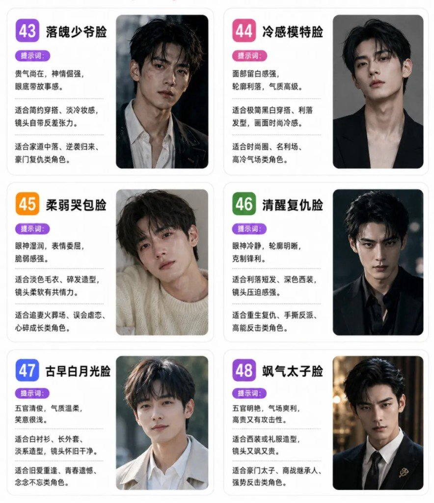

| # | 风格名 | 提示词 | 适合造型 | 适合角色 |
|---|---|---|---|---|
| 43 | 落魄少爷脸 | 贵气尚在，神情倔强，眼底带故事感。 | 适合简约穿搭、淡冷妆感，镜头自带反差张力。 | 适合家道中落、逆袭归来、豪门复仇类角色。 |
| 44 | 冷感模特脸 | 面部留白感强，轮廓利落，气质高级。 | 适合极简黑白穿搭、利落发型，画面时尚冷感。 | 适合时尚圈、名利场、高冷气场类角色。 |
| 45 | 柔弱哭包脸 | 眼神湿润，表情委屈，脆弱感强。 | 适合淡色毛衣、碎发造型，镜头柔软有共情力。 | 适合追妻火葬场、误会虐恋、心碎成长类角色。 |
| 46 | 清醒复仇脸 | 眼神冷静，轮廓明晰，克制锋利。 | 适合利落短发、深色西装，镜头压迫感强。 | 适合重生复仇、手撕反派、高能反击类角色。 |
| 47 | 古早白月光脸 | 五官清俊，气质温柔，笑意很浅。 | 适合白衬衫、长外套、淡系造型，镜头怀旧干净。 | 适合旧爱重逢、青春遗憾、念念不忘类角色。 |
| 48 | 飒气太子脸 | 五官明艳，气场爽利，高贵又有攻击性。 | 适合西装或礼服造型，镜头又飒又贵。 | 适合豪门太子、商战继承人、强势反击类角色。 |

---

## 49–54

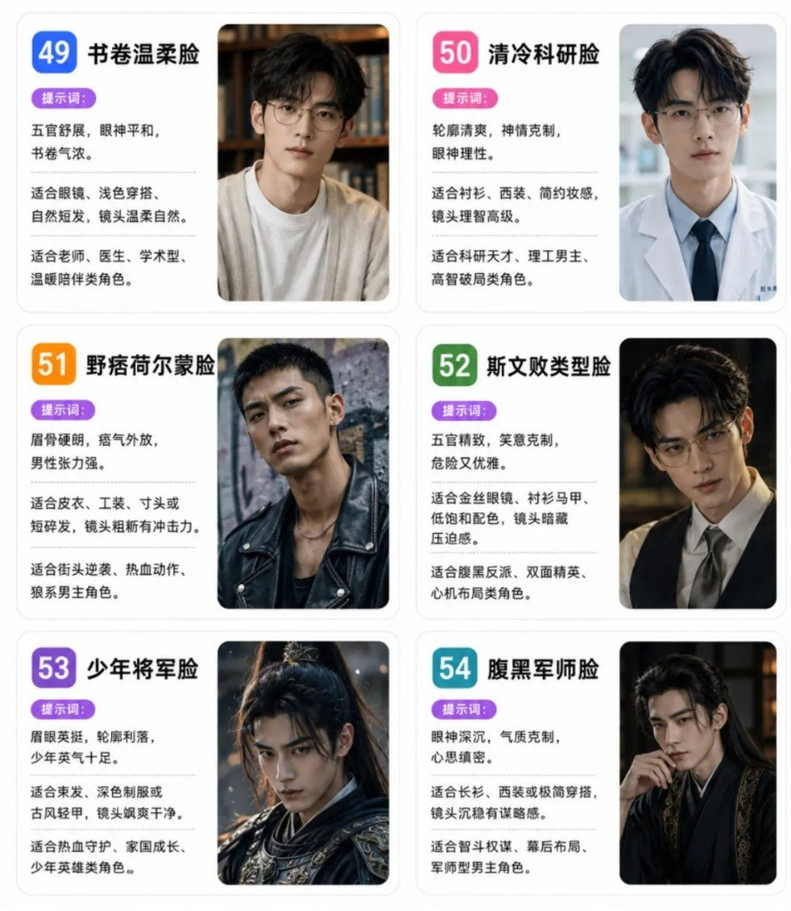

| # | 风格名 | 提示词 | 适合造型 | 适合角色 |
|---|---|---|---|---|
| 49 | 书卷温柔脸 | 五官舒展，眼神平和，书卷气浓。 | 适合眼镜、浅色穿搭、自然短发，镜头温柔自然。 | 适合老师、医生、学术型、温暖陪伴类角色。 |
| 50 | 清冷科研脸 | 轮廓清爽，神情克制，眼神理性。 | 适合衬衫、西装、简约妆感，镜头理智高级。 | 适合科研天才、理工男主、高智破局类角色。 |
| 51 | 野痞荷尔蒙脸 | 眉骨硬朗，痞气外放，男性张力强。 | 适合皮衣、工装、寸头或短碎发，镜头粗粝有冲击力。 | 适合街头逆袭、热血动作、狠系男主角色。 |
| 52 | 斯文败类类型脸 | 五官精致，笑意克制，危险又优雅。 | 适合金丝眼镜、衬衫马甲、低饱和配色，镜头暗藏压迫感。 | 适合腹黑反派、双面精英、心机布局类角色。 |
| 53 | 少年将军脸 | 眉眼英挺，轮廓利落，少年英气十足。 | 适合束发、深色制服或古风轻甲，镜头飒爽干净。 | 适合热血守护、家国成长、少年英雄类角色。 |
| 54 | 腹黑军师脸 | 眼神深沉，气质克制，心思缜密。 | 适合长衫、西装或极简穿搭，镜头沉稳有谋略感。 | 适合智斗权谋、幕后布局、军师型男主角色。 |

---

## 55–60

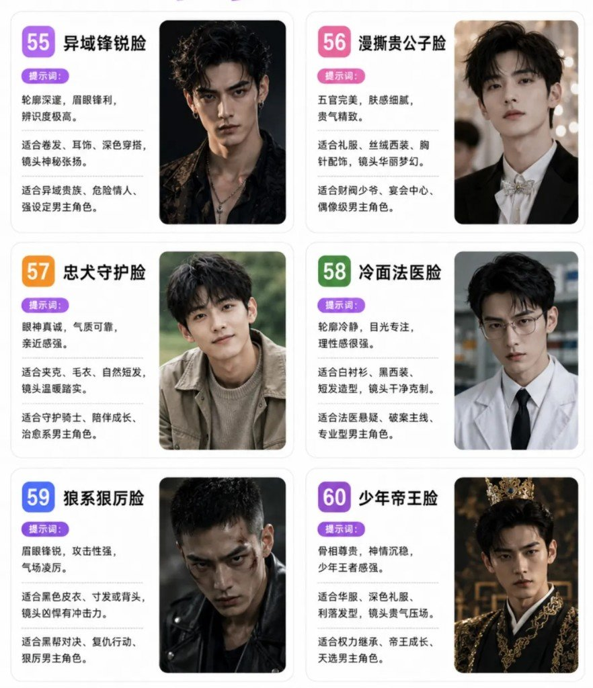

| # | 风格名 | 提示词 | 适合造型 | 适合角色 |
|---|---|---|---|---|
| 55 | 异域锋锐脸 | 轮廓深邃，眉眼锋利，辨识度极高。 | 适合卷发、耳饰、深色穿搭，镜头神秘张扬。 | 适合异域贵族、危险情人、强设定男主角色。 |
| 56 | 漫撕贵公子脸 | 五官完美，肤感细腻，贵气精致。 | 适合礼服、丝绒西装、胸针配饰，镜头华丽梦幻。 | 适合财阀少爷、宴会中心、偶像级男主角色。 |
| 57 | 忠犬守护脸 | 眼神真诚，气质可靠，亲近感强。 | 适合夹克、毛衣、自然短发，镜头温暖踏实。 | 适合守护骑士、陪伴成长、治愈系男主角色。 |
| 58 | 冷面法医脸 | 轮廓冷静，目光专注，理性感很强。 | 适合白衬衫、黑西装、短发造型，镜头干净克制。 | 适合法医悬疑、破案主线、专业型男主角色。 |
| 59 | 狼系狠戾脸 | 眉眼锋锐，攻击性强，气场凌厉。 | 适合黑色皮衣、寸发或背头，镜头凶悍有冲击力。 | 适合黑帮对决、复仇行动、狠厉男主角色。 |
| 60 | 少年帝王脸 | 骨相尊贵，神情沉稳，少年王者感强。 | 适合华服、深色礼服、利落发型，镜头贵气压场。 | 适合权力继承、帝王成长、天选男主角色。 |

---

## 怎么用，别整成词库堆砌

1. **人设三件套先写死**：性格 + 身份 + 题材场，再从表里挑气质最近的一款。
2. **提示词管五官情绪，造型栏管镜头服装**：两栏一起丢进生成，比单抄风格名稳。
3. **一部剧锁 1～2 个脸型锚**：正剧主线一款，黑化/回忆可再开一款；别六款混同一角色骨相。
4. **气质撞车时看编号邻居**：清冷系（04/10/28/37）、贵气系（11/26/42/56）、破碎系（15/21/45）各自成簇，比硬背 60 个名字快。

想压住镜头节奏，可看 [运镜提示词](/posts/ai-comic-camera-moves-prompts/)；女装造型见 [古风六风格](/posts/ancient-women-costume-six-styles/)。本篇只解决「这张脸该长什么样」。


## 古风女主别再写「汉服长发」：六风格三十六套提示词

做 AI 漫剧时，古代女角色最容易翻车：想仙气飘逸，出来却像普通古装；想江湖侠女，衣服又不利落。根子多半是提示词太笼统——「古风美女、长发、汉服」几乎等于没写身份。

---

## 为什么「古风美女」不够用

身份没写清，模型就往默认古装美女里收。仙侠要御剑与云海，宫廷要等级与纹样，江湖要劲装利落——气质差在角色、配色、服装、发饰、场景这五件事上，不在「再加一个美丽」。

生成时按人物身份拼关键词，画面辨识度更高，也更容易压住整部漫剧的角色统一。

---

## 六张风格页（原图）

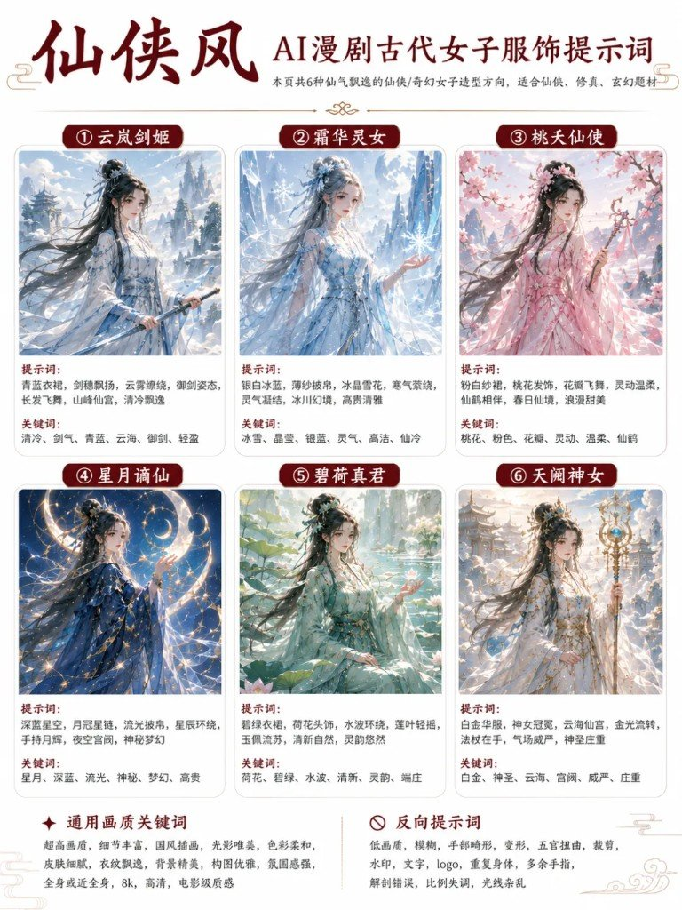

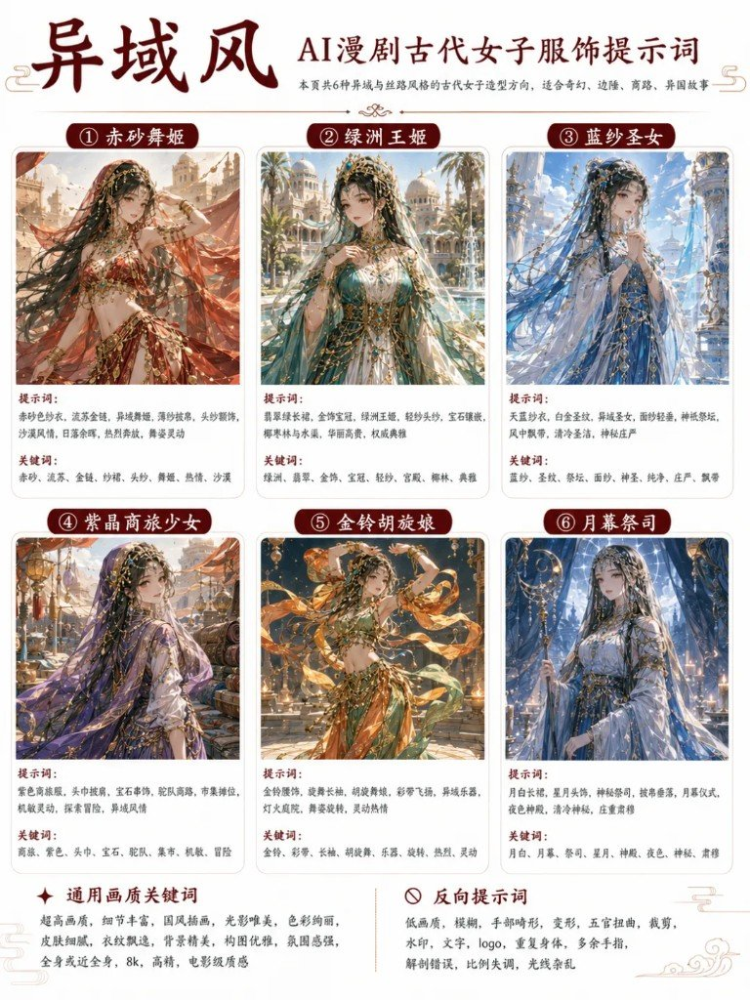


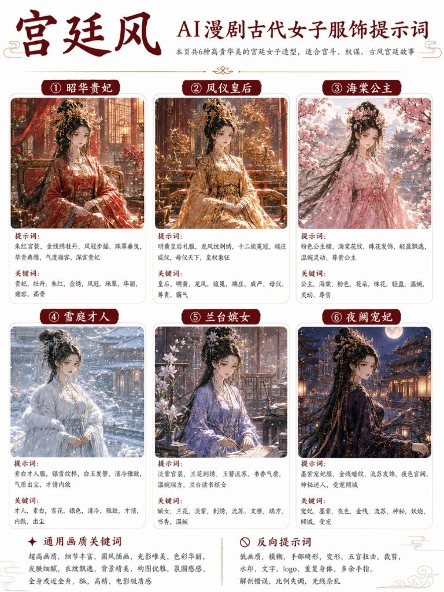


---

## ① 仙侠风

图面副题：本页共 6 种仙气飘逸的仙侠/奇幻女子造型方向，适合仙侠、修真、玄幻题材。

| # | 角色 | 提示词（图面原文） | 关键词 |
|---|---|---|---|
| 1 | 云岚剑姬 | 青蓝衣裙，剑穗飘扬，云雾缭绕，御剑姿态，长发飞舞，山峰仙宫，清冷飘逸 | 清冷、剑气、青蓝、云海、御剑、轻盈 |
| 2 | 霜华灵女 | 银白冰蓝，薄纱披帛，冰晶雪花，寒气萦绕，灵气凝结，冰川幻境，高贵清雅 | 冰雪、晶莹、银蓝、灵气、高洁、仙冷 |
| 3 | 桃夭仙使 | 粉白纱裙，桃花发饰，花瓣飞舞，灵动温柔，仙鹤相伴，春日仙境，浪漫甜美 | 桃花、粉色、花瓣、灵动、温柔、仙鹤 |
| 4 | 星月谪仙 | 深蓝星空，月冠星链，流光披帛，星辰环绕，手持月辉，夜空宫阙，神秘梦幻 | 星月、深蓝、流光、神秘、梦幻、高贵 |
| 5 | 碧荷真君 | 碧绿衣裙，荷花头饰，水波环绕，莲叶轻摇，玉佩流苏，清新自然，灵韵悠然 | 荷花、碧绿、水波、清新、灵韵、端庄 |
| 6 | 天阙神女 | 白金华服，神女冠冕，云海仙宫，金光流转，法杖在手，气场威严，神圣庄重 | 白金、神圣、云海、宫阙、威严、庄重 |

**角色怎么拆（从图面提示词归纳）**

| 角色 | 配色 | 服装/道具 | 发饰 | 场景气质 |
|---|---|---|---|---|
| 云岚剑姬 | 青蓝 | 衣裙、剑穗、御剑 | 长发飞舞 | 云雾、山峰仙宫、清冷 |
| 霜华灵女 | 银白冰蓝 | 薄纱披帛、冰晶 | —— | 冰川幻境、寒气 |
| 桃夭仙使 | 粉白 | 纱裙 | 桃花发饰 | 花瓣、仙鹤、春日仙境 |
| 星月谪仙 | 深蓝 | 流光披帛、月辉 | 月冠星链 | 夜空宫阙 |
| 碧荷真君 | 碧绿 | 衣裙、玉佩流苏 | 荷花头饰 | 水波、莲叶 |
| 天阙神女 | 白金 | 华服、法杖 | 神女冠冕 | 云海仙宫、威严 |

---

## ② 宫廷风

图面副题：本页共 6 种高贵华美的宫廷女子造型，适合宫斗、权谋、古风宫廷故事。

| # | 角色 | 提示词（图面原文） | 关键词 |
|---|---|---|---|
| 1 | 昭华贵妃 | 朱红宫装，金线绣牡丹，凤冠步摇，珠翠垂曳，华贵典雅，气度雍容，深宫贵妃 | 贵妃、牡丹、朱红、金绣、凤冠、珠翠、华丽、雍容、高贵 |
| 2 | 凤仪皇后 | 明黄皇后礼服，龙凤纹刺绣，十二旒冕冠，端庄威仪，母仪天下，皇权象征 | 皇后、明黄、龙凤、旒冕、端庄、威严、母仪、尊贵、霸气 |
| 3 | 海棠公主 | 粉色公主裙，海棠花纹，珠花发饰，轻盈飘逸，温婉灵动，尊贵公主 | 公主、海棠、粉色、花朵、珠花、轻盈、温婉、灵动、尊贵 |
| 4 | 雪庭才人 | 素白才人服，银雪纹样，白玉发簪，清冷雅致，气质出尘，才情内敛 | 才人、素白、雪花、银色、清冷、雅致、才情、内敛、出尘 |
| 5 | 兰台嫔女 | 淡紫宫装，兰花刺绣，玉簪流苏，书香气质，温婉端方，兰台读书嫔女 | 嫔女、兰花、淡紫、刺绣、流苏、文雅、端方、书香、温婉 |
| 6 | 夜阙宠妃 | 墨紫宠妃服，金线暗纹，流苏发饰，夜色宫阙，神秘迷人，受宠倾城 | 宠妃、墨紫、夜色、金线、流苏、神秘、妖娆、倾城、受宠 |

**角色怎么拆**

| 角色 | 配色 | 服装 | 发饰 | 场景/身份 |
|---|---|---|---|---|
| 昭华贵妃 | 朱红、金绣 | 宫装牡丹纹 | 凤冠步摇、珠翠 | 深宫贵妃 |
| 凤仪皇后 | 明黄 | 龙凤礼服 | 十二旒冕冠 | 母仪、皇权 |
| 海棠公主 | 粉色 | 公主裙海棠纹 | 珠花发饰 | 温婉灵动 |
| 雪庭才人 | 素白、银雪 | 才人服 | 白玉发簪 | 清冷出尘 |
| 兰台嫔女 | 淡紫 | 兰花刺绣宫装 | 玉簪流苏 | 书香兰台 |
| 夜阙宠妃 | 墨紫、金线暗纹 | 宠妃服 | 流苏发饰 | 夜色宫阙 |

---

## ③ 异域风

图面副题：本页共 6 种异域与丝路风格的古代女子造型方向，适合奇幻、边陲、商路、异国故事。

| # | 角色 | 提示词（图面原文） | 关键词 |
|---|---|---|---|
| 1 | 赤砂舞姬 | 赤砂色纱衣，流苏金链，异域舞姬，薄纱披帛，头纱飘饰，沙漠风情，日落余晖，热烈奔放，舞姿灵动 | 赤砂、流苏、金链、纱裙、头纱、舞姬、热情、沙漠 |
| 2 | 绿洲王姬 | 翡翠绿长裙，金饰宝冠，绿洲王姬，轻纱头纱，宝石镶嵌，椰枣林与水渠，华丽高贵，权威典雅 | 绿洲、翡翠、金饰、宝冠、轻纱、宫殿、柳林、典雅 |
| 3 | 蓝纱圣女 | 天蓝纱衣，白金圣纹，异域圣女，面纱轻垂，神祇祭坛，风中飘带，清冷圣洁，神秘庄严 | 蓝纱、圣纹、祭坛、面纱、神圣、纯净、庄严、飘带 |
| 4 | 紫晶商旅少女 | 紫色商旅服，头巾披肩，宝石串饰，驼队商路，市集摊位，机敏灵动，探索冒险，异域风情 | 商旅、紫色、头巾、宝石、驼队、集市、机敏、冒险 |
| 5 | 金铃胡旋娘 | 金铃腰饰，旋舞长袖，胡旋舞娘，彩带飞扬，异域乐器，灯火庭院，舞姿旋转，灵动热情 | 金铃、彩带、长袖、胡旋舞、乐器、旋转、热烈、灵动 |
| 6 | 月幕祭司 | 月白长裙，星月头饰，神秘祭司，披帛垂落，月幕仪式，夜色神殿，清冷神秘，庄重肃穆 | 月白、月幕、祭司、星月、神殿、夜色、神秘、肃穆 |

**角色怎么拆**

| 角色 | 配色 | 服装/饰 | 发饰/头饰 | 场景 |
|---|---|---|---|---|
| 赤砂舞姬 | 赤砂 | 纱衣、流苏金链、披帛 | 头纱飘饰 | 沙漠日落 |
| 绿洲王姬 | 翡翠 | 长裙、宝石 | 金饰宝冠、轻纱头纱 | 椰枣林与水渠 |
| 蓝纱圣女 | 天蓝、白金圣纹 | 纱衣、飘带 | 面纱 | 神祇祭坛 |
| 紫晶商旅少女 | 紫色 | 商旅服、宝石串饰 | 头巾披肩 | 驼队、市集 |
| 金铃胡旋娘 | 彩带、金铃 | 长袖旋舞 | 金铃腰饰 | 灯火庭院、乐器 |
| 月幕祭司 | 月白 | 长裙、披帛 | 星月头饰 | 月幕仪式、夜色神殿 |

---

## ④ 江湖风

图面副题：本页共 6 种江湖风古代女子造型方向，适合武侠、侠客、江湖故事创作。

| # | 角色 | 提示词（图面原文） | 关键词 |
|---|---|---|---|
| 1 | 竹影女剑客 | 竹林深处，青衣劲装，腰佩长剑，衣袂随风，神色清冷，剑气凛然，山风吹拂，竹影婆娑 | 竹林、青衣、长剑、侠女、清冷、剑气 |
| 2 | 夜行影卫 | 夜色如墨，黑衣劲装，束发藏锋，轻功跃檐，月下潜行，目光如炬，剑匣暗藏，孤影无痕 | 夜色、黑衣、面巾、轻功、隐秘、冷峻 |
| 3 | 杏林医娘 | 药香袅袅，素衣纱裙，发间簪花，执药碾药，目光温柔，悬壶济世，仁心仁术，清雅恬静 | 医娘、药铺、素衣、草药、温婉、仁心 |
| 4 | 铁坊少掌柜 | 铁炉熊熊，劲装挽袖，汗珠微落，手持锤钳，目光果敢，掌铁坊生意，巾帼不让须眉 | 铁坊、锻造、劲装、挽袖、飒爽、果敢 |
| 5 | 酒肆女掌柜 | 红灯高挂，锦衣裙装，发饰华美，执杯迎客，谈笑风生，掌酒肆生意，豪爽大气，气场强大 | 酒肆、掌柜、红衣、杯酒、豪爽、气场 |
| 6 | 雪溪刀客 | 雪落溪畔，白衣披白，腰佩长刀，孤身行走，目光凌厉，行侠仗义，风雪相伴，傲骨铮铮 | 雪景、白衣、长刀、刀客、孤傲、侠义 |

**角色怎么拆**

| 角色 | 配色/装 | 道具 | 发饰 | 场景 |
|---|---|---|---|---|
| 竹影女剑客 | 青衣劲装 | 长剑 | —— | 竹林、山风 |
| 夜行影卫 | 黑衣劲装、面巾 | 剑匣 | 束发 | 月下屋檐、潜行 |
| 杏林医娘 | 素衣纱裙 | 药碾 | 发间簪花 | 药香、药铺气 |
| 铁坊少掌柜 | 劲装挽袖 | 锤钳 | —— | 铁炉 |
| 酒肆女掌柜 | 锦衣偏红 | 杯 | 华美发饰 | 红灯酒肆 |
| 雪溪刀客 | 白衣披白 | 长刀 | —— | 雪落溪畔 |

> 「白衣披白」按图面可见字形抄录；若实拍印刷更像「披帛」，以原图为准。

---

## ⑤ 妖族风

图面副题：本页共 6 种妖族/灵族的古代女子造型方向，适合仙侠、妖魔、玄幻题材。

| # | 角色 | 提示词（图面原文） | 关键词 |
|---|---|---|---|
| 1 | 雪尾狐灵 | 雪白狐耳，九尾如雪，红白狐纹妆，银发红瞳，冰雪霜花，红白狐裘，月夜神社，清冷灵动 | 狐耳、九尾、雪白、红瞳、冰雪、月夜、神社 |
| 2 | 炽羽凰姬 | 朱羽凤冠，金红羽衣，凤焰流光，火凤凰纹身，烈焰缠绕，金羽飘逸，〔图面文字不清〕，涅槃重生 | 凤凰、火焰、金红、羽翼、凤冠、涅槃、烈焰 |
| 3 | 青鳞蛇后 | 青鳞蛇身，蛇纹面饰，碧玉发冠，水潭薄雾，蛇影缭绕，鳞片流光，清冷妖冶，掌控水域 | 蛇身、鳞片、青绿、水潭、蛇影、冷艳、掌控 |
| 4 | 樱花花魅 | 樱花发饰，花瓣衣裙，花香萦绕，桃粉妆容，花影迷离，花瓣飘落，温柔魅惑，春日妖姬 | 樱花、花瓣、粉色、花魅、春日、飘落、魅惑 |
| 5 | 孔雀妖使 | 孔雀翎羽，翎冠发饰，宝蓝衣裙，孔雀开屏，翎羽联动，流光溢彩，优雅神秘，妖使降临 | 孔雀、翎羽、宝蓝、开屏、羽冠、神秘、妖使 |
| 6 | 幻夜蝶妖 | 蝶翼轻纱，紫黑蝶纹，夜色幻影，蝶发饰，幻夜流光，蝶群环绕，迷离梦境，魅惑妖姬 | 蝴蝶、蝶翼、紫黑、幻夜、蝶群、梦境、妖姬 |

**炽羽凰姬** 倒数第二组多轮 OCR 在「凤眸高贵 / 凤舞高贵」间摇摆，正文不硬选，见文末缺失项。

**角色怎么拆**

| 角色 | 族征/配色 | 服装 | 发饰 | 场景 |
|---|---|---|---|---|
| 雪尾狐灵 | 狐耳九尾、银发红瞳、红白 | 狐裘、狐纹妆 | —— | 月夜神社、冰雪 |
| 炽羽凰姬 | 金红、火焰、羽翼 | 羽衣、纹身 | 凤冠 | 烈焰、涅槃 |
| 青鳞蛇后 | 青绿鳞 | 蛇身、面饰 | 碧玉发冠 | 水潭、蛇影 |
| 樱花花魅 | 桃粉 | 花瓣衣裙 | 樱花发饰 | 花瓣飘落 |
| 孔雀妖使 | 宝蓝 | 衣裙、开屏翎羽 | 翎冠 | 流光、妖使 |
| 幻夜蝶妖 | 紫黑 | 蝶翼轻纱、蝶纹 | 蝶发饰 | 幻夜、蝶群 |

---

## ⑥ 敦煌风

图面副题：本页共 6 种敦煌风古代女子造型方向，适合壁画、丝路、神女、沙漠奇幻等故事创作。

| # | 角色 | 提示词（图面原文） | 关键词 |
|---|---|---|---|
| 1 | 反弹琵琶天女 | 天女反弹琵琶，飘带环绕，衣袂轻扬，壁画飞天彩绘质感，云气流动，姿态优美，灵动婉转 | 琵琶、飞天、反弹、飘带、壁画、彩云、乐伎、灵动、天衣、曲线美 |
| 2 | 莲灯壁画仙姬 | 壁画风仙姬，手持莲灯，衣带缠绕，莲花环绕，光影柔和，禅意清雅，壁画质感，庄严祥和 | 莲花、莲灯、壁画、仙姬、佛光、供养、文殊、菩萨、清雅、宁静 |
| 3 | 砂海圣行者 | 沙海行者，头纱披肩，手持法杖，丝路旅途，金砂漫天，孤寂辽阔，信仰坚定，神秘庄重 | 丝路、沙漠、行者、头纱、法杖、驼队、圣迹、远行、风沙、信仰 |
| 4 | 灵鹿守窟神使 | 灵鹿神使，洞窟壁画背景，鹿伴左右，衣饰华美，气质温柔，守护神圣，静谧灵动，壁画意境 | 灵鹿、洞窟、守护、神使、壁画、鹿角、慈悲、仙气、圣域、轻柔 |
| 5 | 飞绫舞天姬 | 舞动飞绫天姬，身姿轻盈，彩带飘逸，云天飞舞，壁画飞天风格，色彩明丽，飘逸灵动，仙乐悠扬 | 飞绫、天姬、舞姿、飘带、云天、飞天、壁画、仙乐、轻盈、色彩感 |
| 6 | 暮沙神谕者 | 暮色沙漠神谕者，手持星盘，预言未来，装饰繁复，神秘深邃，光影交错，庄严冷峻，宿命感强 | 神谕、星盘、沙漠、预言者、暮色、符文、神秘、高贵、宿命、深邃 |

> 「壁画风仙姬」：副题强调壁画风；若原图无「风」字，以原图为准（见缺失项）。

**角色怎么拆**

| 角色 | 质感/配色 | 道具/服装 | 头饰 | 场景 |
|---|---|---|---|---|
| 反弹琵琶天女 | 壁画飞天彩绘 | 琵琶、飘带、衣袂 | —— | 云气流动 |
| 莲灯壁画仙姬 | 壁画质感、禅意 | 莲灯、衣带 | —— | 莲花环绕 |
| 砂海圣行者 | 金砂 | 法杖、头纱披肩 | 头纱 | 丝路沙漠 |
| 灵鹿守窟神使 | 华美衣饰 | —— | —— | 洞窟壁画、灵鹿 |
| 飞绫舞天姬 | 明丽彩带 | 飞绫、舞姿 | —— | 云天飞舞 |
| 暮沙神谕者 | 暮色、繁复装饰 | 星盘 | 纱/头饰 | 沙漠神谕 |

---

## 通用画质词 & 反向词（图面页脚）

多数风格页页脚接近（仙侠页可见原文）：

```text
超高画质，细节丰富，国风插画，光影唯美，色彩柔和，皮肤细腻，衣纹飘逸，背景精美，构图优雅，氛围感强，全身或近全身，8k，高清，电影级质感
```

```text
低画质，模糊，手部畸形，变形，五官扭曲，裁剪，水印，文字，logo，重复身体，多余手指，解剖错误，比例失调，光线杂乱
```

**敦煌页**画质词单独一版（图面可见）：

```text
超高画质，细节丰富，敦煌壁画风格，矿物颜料质感，绢本肌理，金箔点缀，色彩典雅，光影柔和，构图讲究，8k高清，电影级氛围，东方美学，神圣庄严
```

异域页「色彩」处可见「绚丽」、宫廷页可见「华丽」——按题材换一两个色感词即可，不必六页死抄同一串。

---

## 怎么用才像一部戏里的人

1. **先定身份，再贴风格页**：女主是剑修还是贵妃，比先写「好看」重要。
2. **提示词 + 关键词叠一层**：提示词管画面事件与物件，关键词管气质标签；漫剧多镜可固定 3～5 个关键词当角色锚。
3. **画质词垫底、反向词拦住残肢水印**：敦煌题材优先换壁画那组画质词。
4. **别六套混进同一角色**：换装可以，族征（狐耳 / 十二旒 / 劲装面巾）别一场戏里互殴。


## 人物场景再精致，固定机位也只是会说话的插画

做 AI 漫剧时，人物和场景已经够精致了，镜头却一直钉死——成片还是很容易滑成「会说话的插画」。

真正把情绪带起来的，往往还是运镜本身。

这篇把常用运镜按六个方向拆开：推、拉、摇、移、跟、特殊。每条都是能直接丢进视频模型的提示词思路，不是概念课。

> **计数脚注**：原标题与导语写「36种」；六张信息图上可辨编号条目合计 **39**（推7 + 拉6 + 摇6 + 移6 + 跟7 + 特殊7）。下文按图面实录，不编造、不删条去凑 36。

旁链（不合并）：[静图 Prompt 反推](../2026-08-10_AI图片提示词反推公式/) · [baoyu-comic 分镜流水线](../2026-08-10_baoyu-comic知识漫画工作流拆解/) · [verysmallwoods 视频流水线](../2026-08-10_verysmallwoods视频流水线拆解/) · [MiniMax 当制片](../../Archive/2026-08-06_MiniMax生成体系优化/)

---

## 万用组合，比堆特效管用

```text
[景别] + [运镜动词] + [速度/半径/角度] + [主体动作] + [环境/光影] + [4K+防崩约束]
```

运镜不是越复杂越好，关键是对上剧情要的情绪：

| 想表达 | 更合适的方向 |
|---|---|
| 孤独 | 慢拉 |
| 突出细节 | 缓推 |
| 代入感 | 跟拍 |
| 空间关系 | 摇镜 / 移镜 |
| 爆发、记忆点 | 特殊运镜（别天天上） |

---

## 推镜头：控制距离，放大情绪

把观众的注意力慢慢推向重点。核心：**控制距离，放大情绪，聚焦重点。**

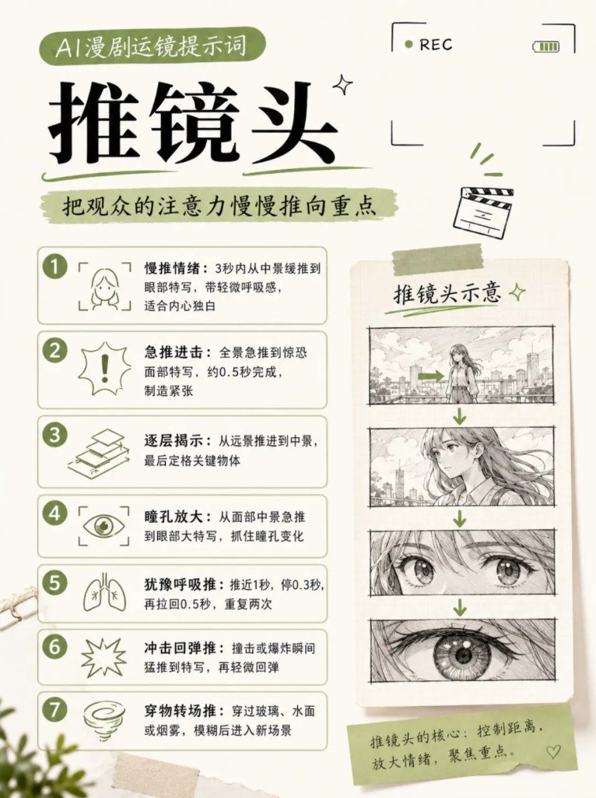

| # | 名称 | 提示词思路（图面原文） |
|---|---|---|
| ① | 慢推情绪 | 3秒内从中景缓推到眼部特写，带轻微呼吸感，适合内心独白 |
| ② | 急推进击 | 全景急推到惊恐面部特写，约0.5秒完成，制造紧张 |
| ③ | 逐层揭示 | 从远景推进到中景，最后定格关键物体 |
| ④ | 瞳孔放大 | 从面部中景急推到眼部大特写，抓住瞳孔变化 |
| ⑤ | 犹豫呼吸推 | 推近1秒，停0.3秒，再拉回0.5秒，重复两次 |
| ⑥ | 冲击回弹推 | 撞击或爆炸瞬间猛推到特写，再轻微回弹 |
| ⑦ | 穿物转场推 | 穿过玻璃、水面或烟雾，模糊后进入新场景 |

---

## 拉镜头：把人拉回环境

把人物拉回环境，让情绪和空间一起出现。

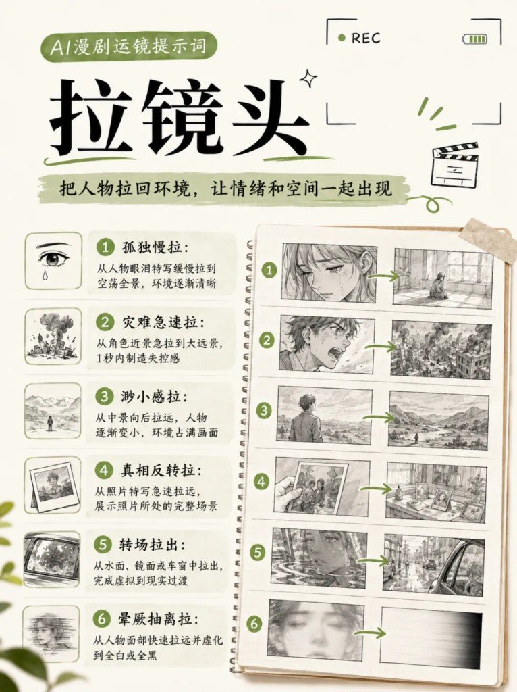

| # | 名称 | 提示词思路（图面原文） |
|---|---|---|
| ① | 孤独慢拉 | 从人物眼泪特写缓慢拉到空荡全景，环境逐渐清晰 |
| ② | 灾难急速拉 | 从角色近景急速拉到大远景，1秒内制造失控感 |
| ③ | 渺小感拉 | 从中景向后拉远，人物逐渐变小，环境占满画面 |
| ④ | 真相反转拉 | 从照片特写急速拉远，展示照片所处的完整场景 |
| ⑤ | 转场拉出 | 从水面、镜面或车窗中拉出，完成虚拟到现实过渡 |
| ⑥ | 晕厥抽离拉 | 从人物面部快速拉远并虚化到全白或全黑 |

---

## 摇镜头：核心是「流动」

通过摇动视角改变观察方式和画面节奏。先分清两件事：

- **摇（Pan）**：镜头水平移动，视野左右展开
- **仰/俯摇（Tilt）**：镜头上下移动，视野上下延展

摇镜头的核心是「流动」——让观众像被带着看，情绪也随之起伏。


| # | 名称 | 提示词思路（图面原文） |
|---|---|---|
| ① | 横摇扫全景 | 镜头水平缓慢摇动，扫过街道或战场全景 |
| ② | 全身展示摇 | 从脚底垂直摇到头顶，展示服饰和姿态 |
| ③ | 极速甩镜 | 急速横摇，制造强烈运动模糊，适合激烈转场 |
| ④ | 悠闲跟随摇 | 缓慢摇动跟随飞鸟、车流等移动物体 |
| ⑤ | 背后有人摇 | 从人物正面缓慢摇到背后并停住，暗示被跟踪 |
| ⑥ | 醉酒来回摇 | 镜头左右来回摇摆，频率渐快，表现眩晕感 |

---

## 移镜头：镜头在空间里走

让镜头在空间中移动，画面会更有现场感。


| # | 名称 | 提示词思路（图面原文） |
|---|---|---|
| ① | 平行跟移 | 镜头与人物平行移动，保持中景，速度匹配步伐 |
| ② | 360°环绕 | 镜头绕主体旋转一整圈，保持轻微仰角 |
| ③ | 滑轨横移 | 平滑横向平移，掠过墙壁、树丛或人群展示细节 |
| ④ | 穿墙转场移 | 横向移动并穿过门框或树丛，遮挡后进入新空间 |
| ⑤ | 弧形绕障移 | 沿弧形轨迹移动，绕过前景障碍物平滑过渡 |
| ⑥ | 垂直升降横移 | 下降的同时横移，形成楼上到楼下的视角切换 |

---

## 跟镜头：把观众拴在角色身上

让观众紧跟角色，代入行动和情绪变化。


| # | 名称 | 提示词思路（图面原文） |
|---|---|---|
| ① | 手持慌乱跟 | 轻微无规则晃动，跟随角色奔跑，增强纪实感 |
| ② | 侧面速度跟 | 在角色侧面平行移动，发丝衣角飘动，背景模糊 |
| ③ | 背影沉浸跟 | 镜头位于角色身后，代入角色视角，带呼吸起伏 |
| ④ | 正面压迫跟 | 角色直面镜头走来，表情逐渐清晰，适合反派登场 |
| ⑤ | 加速追逐跟 | 跟拍并逐渐提速，镜头与角色距离保持不变 |
| ⑥ | 第一人称跟 | 模拟角色眼睛所见，聚焦前方目标，周围虚化 |
| ⑦ | 低角度脚步跟 | 镜头贴近地面，跟拍快速脚步，表现匆忙或神秘 |

---

## 特殊运镜：爆点才上，别当日常调料

用更强烈的镜头语言制造记忆点和戏剧性。特殊运镜是情绪的放大器——用得好，故事会立刻记住你；天天上，观众只会觉得你在炫技。


| # | 名称 | 提示词思路（图面原文） |
|---|---|---|
| ① | 一镜到底 | 无剪辑连续镜头，跟随角色穿过3个以上场景 |
| ② | 希区柯克变焦 | 镜头后拉同时推焦，主体不变，背景压缩变形 |
| ③ | 子弹时间定格 | 镜头绕主体极速旋转，突然完全定格再恢复 |
| ④ | 眩晕旋转 | 以角色为轴心快速旋转，持续制造模糊感 |
| ⑤ | 坠落失重 | 镜头随角色一起下坠，背景快速上升 |
| ⑥ | 时间凝滞 | 高速运动中突然静止，所有元素短暂停格 |
| ⑦ | 残影分身移 | 镜头平移扫过多重残影，透明度由实到虚递增 |

---

## 怎么选，别怎么炫

固定机位再精致，也只是插画会说话。先问剧情要什么情绪，再选推 / 拉 / 摇 / 移 / 跟；只有真需要爆发或记忆点时，再动特殊运镜。

拼口令时按上方公式塞进景别、速度和防崩约束即可——方向对了，复杂运镜不是加分项。


## 黑金浮雕西游人物谱：六节点转一圈，看见的是人心

小时候看《西游记》，盯着的是降妖除魔；长大再翻，看见的是人心。

师徒五人，各记一句就够：

- **唐僧**：路可以难，心不能退。
- **悟空**：本事再大，也要有人肯收、有人敢用。
- **八戒**：贪嗔痴写在脸上，护师却从不缺席。
- **沙僧**：话少、担重，把队伍黏在一起。
- **白龙马**：多数时候不当主角，没有他路走不成。

有人把这套神魔长卷做成了**黑金浮雕风「西游人物谱」**：深底浮雕云纹，金线勾形，竖排大字旁盖着红印「书缝漫游」。单人页用**六节点环形叙事**——身份、经历、转折、归宿绕人物转一圈，读完像把一章人物传压成一张图。

文中作者列名 **17** 位；附件实际是 **19** 张图：1 张群像封面 + 18 张单人（含文称未计入的**女儿国王**）。群像封面标签亦为 17 人，**不含**女儿国王。脚注见文末。

---

## 风格怎么认

| 关键词 | 落在画面上 |
|---|---|
| 黑金浮雕 | 炭黑 / 青铜底，浮雕云纹与金属高光 |
| 六节点环形叙事 | ①→⑥ 虚线箭头绕人物一圈 |
| 书缝漫游 | 竖排题旁红印，系列统一标识 |

适合当「人物设定信息图」模板：中间立像，外围六格把生平压成可读环，比纯立绘多一层叙事。

---

## 群像封面


图面大题：**西游人物谱**。同框可见如来、唐僧、悟空、白龙马、观音、玉帝、太上老君、二郎神、哪吒、菩提、牛魔王、沙悟净、铁扇、八戒、红孩儿、六耳、白骨精等标签——**17** 人，无女儿国王。

---

## 大唐高僧 唐三藏

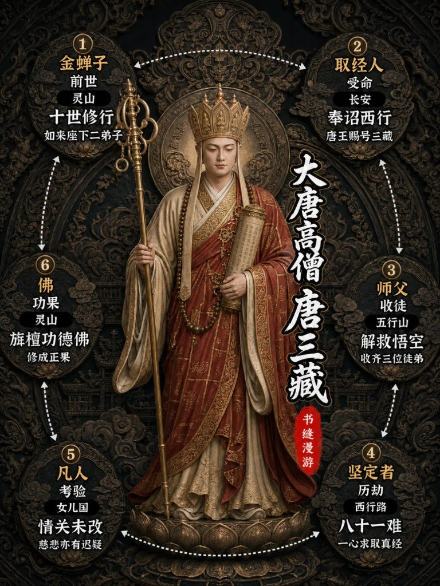

| # | 节点 | 标签 | 地点 | 主句 | 副句 |
|---|---|---|---|---|---|
| ① | 金蝉子 | 前世 | 灵山 | 十世修行 | 如来座下二弟子 |
| ② | 取经人 | 受命 | 长安 | 奉诏西行 | 唐王赐号三藏 |
| ③ | 师父 | 收徒 | 五行山 | 解救悟空 | 收齐三位徒弟 |
| ④ | 坚定者 | 历劫 | 西行路 | 八十一难 | 一心求取真经 |
| ⑤ | 凡人 | 考验 | 女儿国 | 情关未改 | 慈悲亦有迟疑 |
| ⑥ | 佛 | 功果 | 灵山 | 旃檀功德佛 | 修成正果 |

---

## 齐天大圣 孙悟空


| # | 节点 | 标签 | 地点 | 主句 | 副句 |
|---|---|---|---|---|---|
| ① | 石猴 | 诞生 | 花果山 | 石破天惊 | 天地孕育灵猴 |
| ② | 美猴王 | 称王 | 水帘洞 | 群猴归心 | 占山自在逍遥 |
| ③ | 齐天大圣 | 反叛 | 天宫 | 大闹天宫 | 斗诸神战天兵 |
| ④ | 行者 | 受戒 | 五行山 | 拜师护送 | 踏上西行之路 |
| ⑤ | 斗战者 | 降妖 | 取经路 | 七十二变 | 火眼金睛破幻 |
| ⑥ | 佛 | 功果 | 灵山 | 斗战胜佛 | 护师功成正果 |

---

## 天蓬元帅 猪八戒

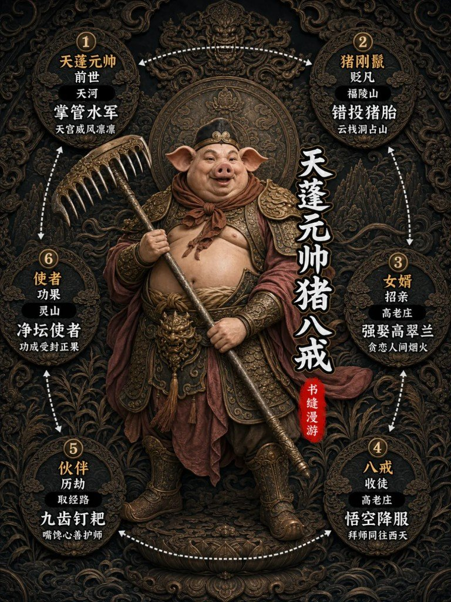

| # | 节点 | 标签 | 地点 | 主句 | 副句 |
|---|---|---|---|---|---|
| ① | 天蓬元帅 | 前世 | 天河 | 掌管水军 | 天宫威风凛凛 |
| ② | 猪刚鬣 | 贬凡 | 福陵山 | 错投猪胎 | 云栈洞占山 |
| ③ | 女婿 | 招亲 | 高老庄 | 强娶高翠兰 | 贪恋人间烟火 |
| ④ | 八戒 | 收徒 | 高老庄 | 悟空降服 | 拜师同往西天 |
| ⑤ | 伙伴 | 历劫 | 取经路 | 九齿钉耙 | 嘴馋心善护师 |
| ⑥ | 使者 | 功果 | 灵山 | 净坛使者 | 功成受封正果 |

---

## 卷帘大将 沙悟净


| # | 节点 | 标签 | 地点 | 主句 | 副句 |
|---|---|---|---|---|---|
| ① | 卷帘大将 | 前世 | 天宫 | 侍奉玉帝 | 镇守凌霄宝殿 |
| ② | 罪将 | 贬凡 | 流沙河 | 失手碎盏 | 七日飞剑穿胸 |
| ③ | 河妖 | 受苦 | 流沙河 | 吞食行人 | 颈挂九枚骷髅 |
| ④ | 悟净 | 皈依 | 流沙河 | 观音点化 | 拜师同往西天 |
| ⑤ | 伙伴 | 担当 | 取经路 | 挑担护师 | 任劳任怨 |
| ⑥ | 罗汉 | 功果 | 灵山 | 金身罗汉 | 修成正果 |

---

## 西海龙子 白龙马

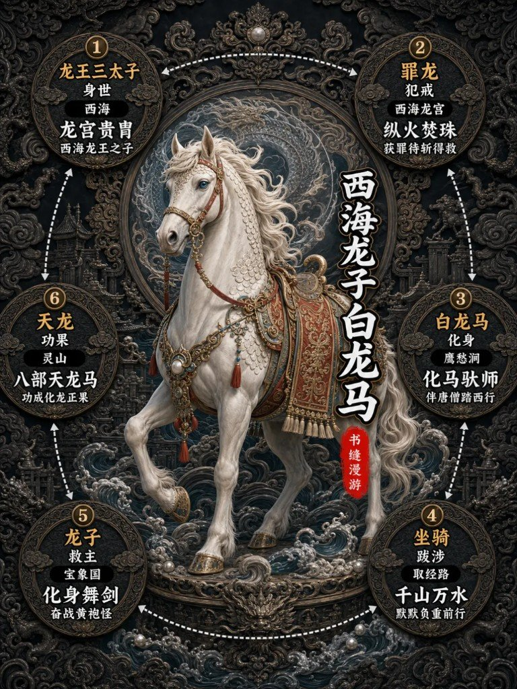

| # | 节点 | 标签 | 地点 | 主句 | 副句 |
|---|---|---|---|---|---|
| ① | 龙王三太子 | 身世 | 西海 | 龙宫贵胄 | 西海龙王之子 |
| ② | 罪龙 | 犯戒 | 西海龙宫 | 纵火焚珠 | 获罪待斩得救 |
| ③ | 白龙马 | 化身 | 鹰愁涧 | 化马驮师 | 伴唐僧踏西行 |
| ④ | 坐骑 | 跋涉 | 取经路 | 千山万水 | 默默负重前行 |
| ⑤ | 龙子 | 救主 | 宝象国 | 化身舞剑 | 奋战黄袍怪 |
| ⑥ | 天龙 | 功果 | 灵山 | 八部天龙马 | 功成化龙正果 |

---

## 大慈大悲 观音菩萨

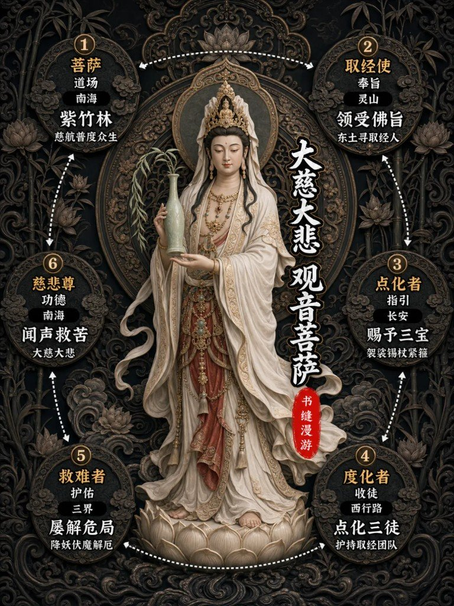

| # | 节点 | 标签 | 地点 | 主句 | 副句 |
|---|---|---|---|---|---|
| ① | 菩萨 | 道场 | 南海 | 紫竹林 | 慈航普度众生 |
| ② | 取经使 | 奉旨 | 灵山 | 领受佛旨 | 东土寻取经人 |
| ③ | 点化者 | 指引 | 长安 | 赐予三宝 | 袈裟锡杖紧箍 |
| ④ | 度化者 | 收徒 | 西行路 | 点化三徒 | 护持取经团队 |
| ⑤ | 救难者 | 护佑 | 三界 | 屡解危局 | 降妖伏魔解厄 |
| ⑥ | 慈悲尊 | 功德 | 南海 | 闻声救苦 | 大慈大悲 |

---

## 灵山世尊 如来佛祖

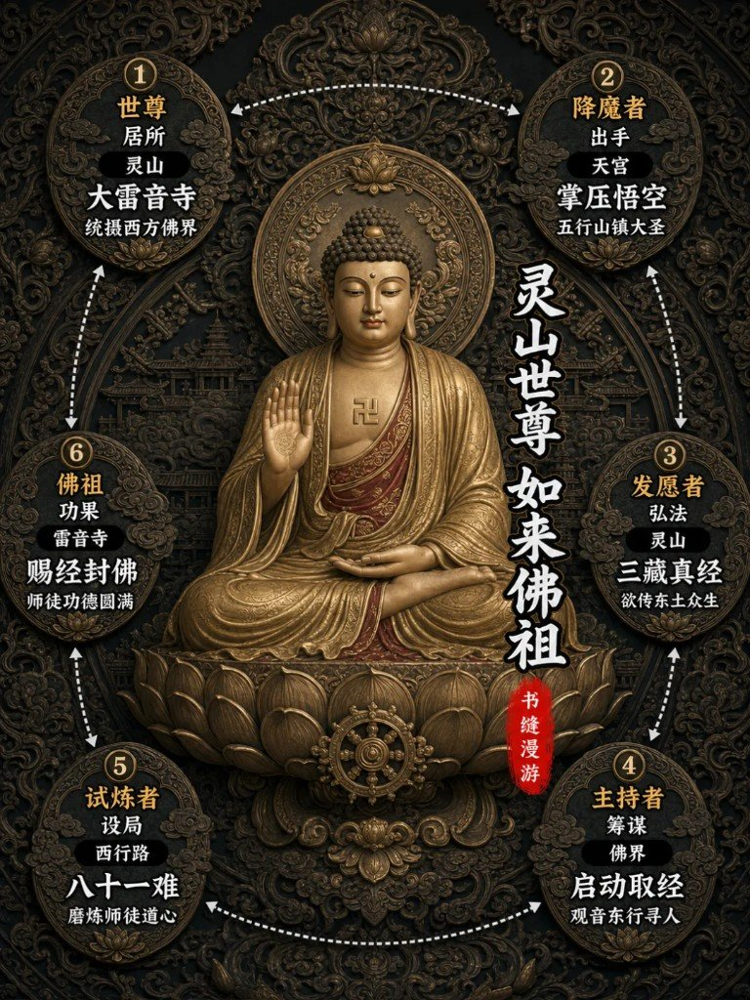

| # | 节点 | 标签 | 地点 | 主句 | 副句 |
|---|---|---|---|---|---|
| ① | 世尊 | 居所 | 灵山 | 大雷音寺 | 统摄西方佛界 |
| ② | 降魔者 | 出手 | 天宫 | 掌压悟空 | 五行山镇大圣 |
| ③ | 发愿者 | 弘法 | 灵山 | 三藏真经 | 欲传东土众生 |
| ④ | 主持者 | 筹谋 | 佛界 | 启动取经 | 观音东行寻人 |
| ⑤ | 试炼者 | 设局 | 西行路 | 八十一难 | 磨炼师徒道心 |
| ⑥ | 佛祖 | 功果 | 雷音寺 | 赐经封佛 | 师徒功德圆满 |

---

## 三界至尊 玉皇大帝


| # | 节点 | 标签 | 地点 | 主句 | 副句 |
|---|---|---|---|---|---|
| ① | 玉帝 | 身份 | 天庭 | 三界至尊 | 统领诸天神将 |
| ② | 主宰 | 居所 | 凌霄殿 | 御理天宫 | 众仙朝会听令 |
| ③ | 招安者 | 用人 | 天庭 | 封弼马温 | 召悟空入天 |
| ④ | 天帝 | 平乱 | 天宫 | 调兵遣将 | 围剿花果山 |
| ⑤ | 求援者 | 危局 | 凌霄殿 | 请来如来 | 镇压齐天大圣 |
| ⑥ | 天庭主 | 秩序 | 三界 | 维系纲常 | 掌管仙籍神职 |

---

## 三清道祖 太上老君

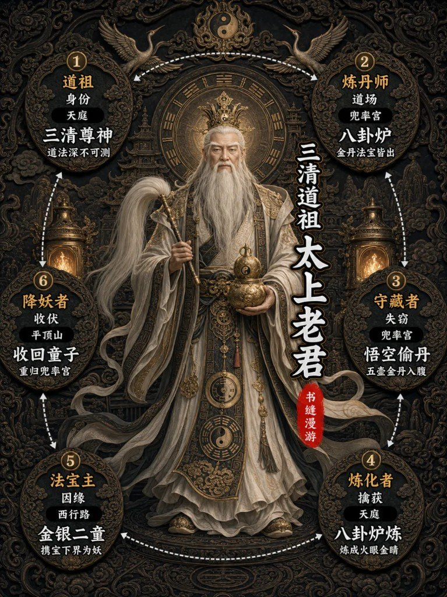

| # | 节点 | 标签 | 地点 | 主句 | 副句 |
|---|---|---|---|---|---|
| ① | 道祖 | 身份 | 天庭 | 三清尊神 | 道法深不可测 |
| ② | 炼丹师 | 道场 | 兜率宫 | 八卦炉 | 金丹法宝皆出 |
| ③ | 守藏者 | 失窃 | 兜率宫 | 悟空偷丹 | 五壶金丹入腹 |
| ④ | 炼化者 | 擒获 | 天庭 | 八卦炉炼 | 炼成火眼金睛 |
| ⑤ | 法宝主 | 因缘 | 西行路 | 金银二童 | 携宝下界为妖 |
| ⑥ | 降妖者 | 收伏 | 平顶山 | 收回童子 | 重归兜率宫 |

---

## 方寸山祖师 菩提祖师


| # | 节点 | 标签 | 地点 | 主句 | 副句 |
|---|---|---|---|---|---|
| ① | 祖师 | 道场 | 灵台山 | 斜月三星洞 | 门下弟子众多 |
| ② | 石猴 | 拜师 | 三星洞 | 赐名悟空 | 收入门墙修行 |
| ③ | 授业者 | 传法 | 深夜 | 七十二变 | 秘授地煞变化 |
| ④ | 引路人 | 传术 | 山门 | 筋斗云 | 一跃十万八千 |
| ⑤ | 严师 | 戒律 | 洞府 | 逐徒下山 | 警告不可提师名 |
| ⑥ | 隐世仙 | 影响 | 花果山 | 奠定神通 | 成就齐天大圣 |

---

## 灌江显圣 二郎神


| # | 节点 | 标签 | 地点 | 主句 | 副句 |
|---|---|---|---|---|---|
| ① | 真君 | 身份 | 灌江口 | 显圣二郎 | 天庭战神杨戬 |
| ② | 奉调者 | 出战 | 花果山 | 迎战悟空 | 七十二变斗法 |
| ③ | 神眼 | 神通 | 战场 | 天眼识变 | 看破大圣变化 |
| ④ | 擒猴者 | 合击 | 天宫 | 老君助阵 | 金刚琢击悟空 |
| ⑤ | 司法神 | 威名 | 三界 | 梅山六圣 | 哮天犬随行 |
| ⑥ | 助战者 | 再会 | 祭赛国 | 共战九头虫 | 与悟空联手 |

---

## 中坛元帅 哪吒三太子

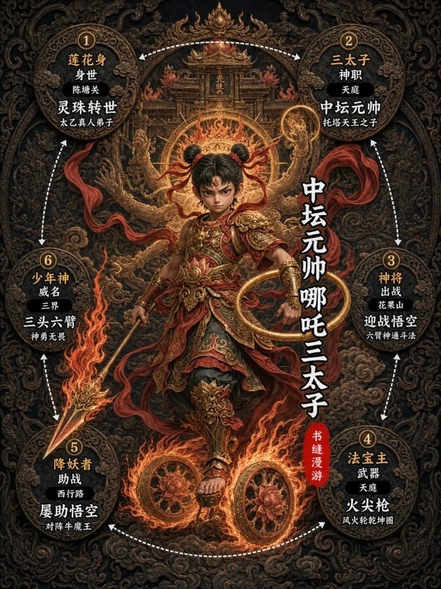

| # | 节点 | 标签 | 地点 | 主句 | 副句 |
|---|---|---|---|---|---|
| ① | 莲花身 | 身世 | 陈塘关 | 灵珠转世 | 太乙真人弟子 |
| ② | 三太子 | 神职 | 天庭 | 中坛元帅 | 托塔天王之子 |
| ③ | 神将 | 出战 | 花果山 | 迎战悟空 | 六臂神通斗法 |
| ④ | 法宝主 | 武器 | 天庭 | 火尖枪 | 风火轮乾坤圈 |
| ⑤ | 降妖者 | 助战 | 西行路 | 屡助悟空 | 对阵牛魔王 |
| ⑥ | 少年神 | 威名 | 三界 | 三头六臂 | 神勇无畏 |

---

## 平天大圣 牛魔王

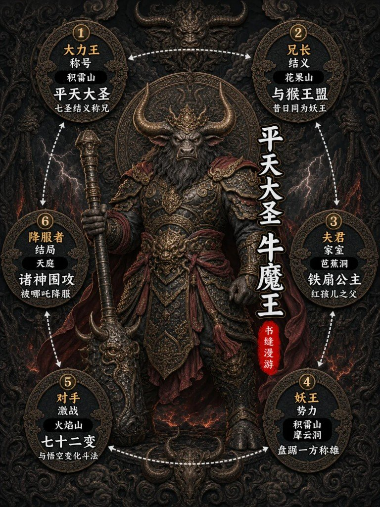

| # | 节点 | 标签 | 地点 | 主句 | 副句 |
|---|---|---|---|---|---|
| ① | 大力王 | 称号 | 积雷山 | 平天大圣 | 七圣结义称兄 |
| ② | 兄长 | 结义 | 花果山 | 与猴王盟 | 昔日同为妖王 |
| ③ | 夫君 | 家室 | 芭蕉洞 | 铁扇公主 | 红孩儿之父 |
| ④ | 妖王 | 势力 | 积雷山 / 摩云洞 | 盘踞一方称雄 | —— |
| ⑤ | 对手 | 激战 | 火焰山 | 七十二变 | 与悟空变化斗法 |
| ⑥ | 降服者 | 结局 | 天庭 | 诸神围攻 | 被哪吒降服 |

---

## 罗刹仙 铁扇公主


| # | 节点 | 标签 | 地点 | 主句 | 副句 |
|---|---|---|---|---|---|
| ① | 罗刹女 | 身份 | 芭蕉洞 | 铁扇公主 | 牛魔王正妻 |
| ② | 母亲 | 亲缘 | 火云洞 | 红孩儿之母 | 记恨悟空降子 |
| ③ | 扇主 | 法宝 | 翠云山 | 芭蕉扇 | 一扇熄灭火焰 |
| ④ | 阻路者 | 冲突 | 火焰山 | 三借芭蕉扇 | 屡次扇飞悟空 |
| ⑤ | 妻子 | 纠葛 | 摩云洞 | 牛魔王离心 | 与玉面公主争 |
| ⑥ | 修行者 | 结局 | 翠云山 | 归还宝扇 | 隐姓修持正果 |

---

## 圣婴大王 红孩儿


| # | 节点 | 标签 | 地点 | 主句 | 副句 |
|---|---|---|---|---|---|
| ① | 圣婴王 | 身份 | 火云洞 | 红孩儿 | 牛魔王之子 |
| ② | 妖王 | 占据 | 枯松涧 | 火云洞 | 统领山中小妖 |
| ③ | 火童 | 神通 | 战场 | 三昧真火 | 烧退悟空八戒 |
| ④ | 诱敌者 | 设局 | 山路 | 假扮孩童 | 捉走唐僧欲食 |
| ⑤ | 对手 | 激战 | 火云洞 | 火烧群英 | 龙王水亦难灭 |
| ⑥ | 善财童子 | 皈依 | 南海 | 观音收伏 | 戴金箍随侍 |

---

## 白虎岭尸魔 白骨精


| # | 节点 | 标签 | 地点 | 主句 | 副句 |
|---|---|---|---|---|---|
| ① | 白骨精 | 真身 | 白虎岭 | 白骨化妖 | 善于变化惑人 |
| ② | 村姑 | 一变 | 山野 | 送斋诱骗 | 被悟空识破 |
| ③ | 老妇 | 二变 | 山路 | 寻女哭诉 | 再遭金箍棒打 |
| ④ | 老翁 | 三变 | 岭前 | 寻妻索女 | 三次变化迷局 |
| ⑤ | 离间者 | 心计 | 师徒间 | 唐僧误解 | 悟空被逐回山 |
| ⑥ | 尸魔 | 结局 | 白虎岭 | 三打白骨精 | 悟空终除妖 |

---

## 真假猴王 六耳猕猴


| # | 节点 | 标签 | 地点 | 主句 | 副句 |
|---|---|---|---|---|---|
| ① | 灵猴 | 根脚 | 三界 | 六耳猕猴 | 四大神猴之一 |
| ② | 冒名者 | 变身 | 花果山 | 假扮悟空 | 形貌神通无二 |
| ③ | 夺经者 | 设局 | 水帘洞 | 组建假队 | 欲往西天取经 |
| ④ | 难辨者 | 争斗 | 三界 | 众神难识 | 照妖镜亦不明 |
| ⑤ | 谛听 | 识破 | 地府 | 听出真身 | 知情未敢明言 |
| ⑥ | 伏诛者 | 结局 | 灵山 | 如来揭底 | 被悟空一棒打死 |

---

## 西梁国主 女儿国王


文称 17 人名单里**没有**她；附件单独给了六节点页，叙事落在唐僧的「情关」。

| # | 节点 | 标签 | 地点 | 主句 | 副句 |
|---|---|---|---|---|---|
| ① | 女王 | 身份 | 西梁国 | 女儿国主 | 一国尽为女子 |
| ② | 国主 | 理政 | 王宫 | 威仪端庄 | 治下国泰民安 |
| ③ | 倾心者 | 相遇 | 驿馆 | 邂逅唐僧 | 一见倾心求亲 |
| ④ | 联姻者 | 挽留 | 王宫 | 愿让王位 | 与御弟共享江山 |
| ⑤ | 痴情人 | 离别 | 城门 | 含泪送别 | 情深不改 |
| ⑥ | 凡尘劫 | 象征 | 取经路 | 温柔情关 | 唐僧坚守西行 |

---

## 欲望、缺点、选择

这套谱好看在立像，更耐看在环上那六格：每个神魔都被压成「曾是谁 → 做错什么 → 怎么走 → 落何处」。降妖是壳，**欲望、缺点、选择**才是肉——八十一难不过是把这些反复摊开给人看。


## 展览海报是第一张名片：九种版式怎么各自说话

进美术馆之前，多数人先撞上的是海报——门口、朋友圈、地铁灯箱。海报不是说明书附件，是展览递出去的第一张名片：三秒里要让人感到「这展大概什么调性」。

下面按图鉴拆九种版式思路。首图是九宫格总览；后文一张一张对着单海报看。图上可见的展名 / 机构名照录，未见署名的不硬补作者。

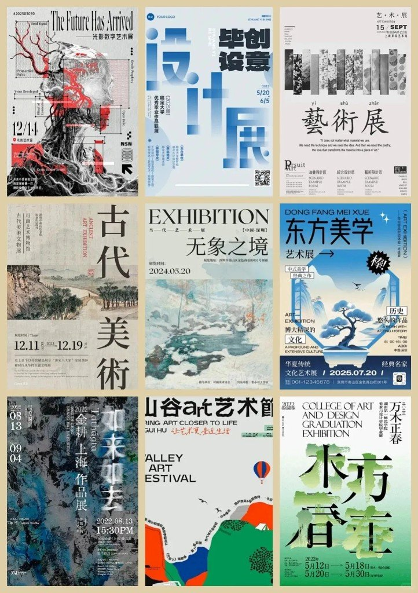

九格并排放，差异一眼就出来：有的靠赛博标注拆主体，有的靠书法叠层，有的干脆把场地画成地图。招数不同，但每张都在回答同一件事——**这张脸，配不配得上这场展**。

---

## 1. 光影数字艺术展 —— 赛博拼贴解构

主视觉是机械感人像侧脸，红线框、测量线、英文标注（Seed Signal、Veins Developed 一类）把主体拆成「可分析的零件」。右上 condensed 衬线英标题 *The Future Has Arrived*，中文副题「光影数字艺术展」压在下面；日期 12/14、地点「未来艺术馆」用大号数字钉住信息层。

适合数字艺术、科技向个展：信息密度高，但不靠堆特效，靠**解构标注**把「未来感」落到版式上。


---

## 2. 《万木正春》毕业展 —— 书法叠层

上半段留白清爽：英文字母标题 COLLEGE OF ART AND DESIGN GRADUATION EXHIBITION 与竖排中文机构信息并列；下半段绿底上，「万木正春」大字用淡墨/淡彩底笔触 + 实笔黑字叠两层，字既是标题也是主视觉。

毕业展常见两难：要学院信息完整，又要有作品气质。书法叠层把「写」本身做成展品语言，信息栏退到上下边缘，不抢笔势。

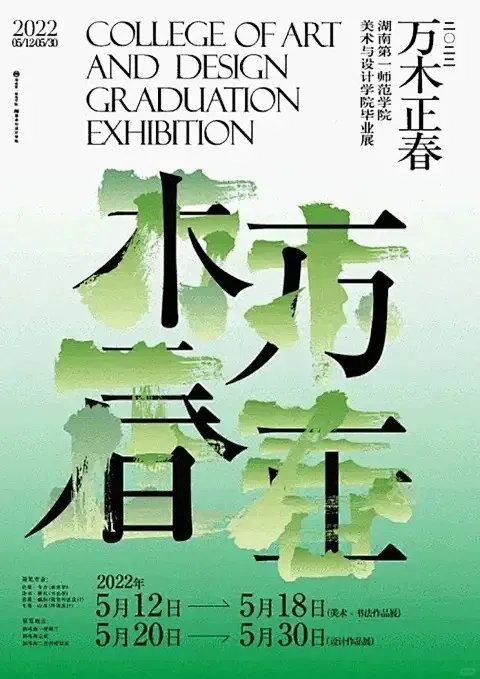

---

## 3. 山谷 art 艺术节 —— 扁平手绘地图

灰底大面积留白，底部红 / 绿 / 蓝 / 橙色块拼成山形「地图」；活动名沿山脊曲线走（摄影季、海报展、热气球、山中集市……）。上方「山谷art艺术节」+ BRING ART CLOSER TO LIFE，热气球和帐篷当图标锚点。

户外艺术节、市集、驻地项目吃这套：海报同时是**导览缩略图**，读者扫一眼就知道「去了能玩什么」。


---

## 4. 《如来如去》—— 肌理油画底 + 竖向错落

整张几乎是暗色油画肌理底。白字竖排错落：右侧大字「如来如去」带横向残影/快门感，旁侧 *Tathāgata*、展名「金耕「上海」作品展」等竖栏并置；日期 08 13 —— 09 04 顶左放大。图上可见策展人单增、管午画廊（XU GALLERY）等落款。

当代绘画个展常用这招：**让画面材质当版式底**，字只做层叠阅读路径，少画框感、多作品感。

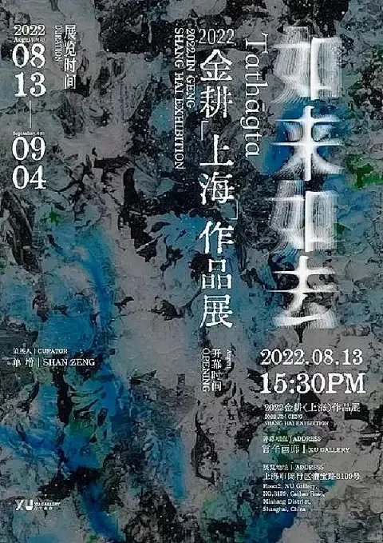

---

## 5. 东方美学 —— 国风扁平 + 八角窗

米色底，中央浅蓝八角窗框住扁平盆景松与远山；标题「东方美学」上方拼音 DONG FANG MEI XUE，周围散落「中式美学」「经典之作」等标签框，底栏日期 2025.07.20。

新中式活动海报的稳妥配方：传统窗棂当取景器，插画保持扁平，信息用气泡/色带点缀——文化符号在，但不堕成仿古描红。

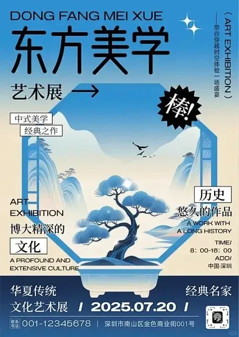

---

## 6. 《无象之境》—— 图文上下分割

上半灰底纯文字：大写 EXHIBITION、当代艺术展、主标题「无象之境」、地址与日期 2024.05.20；下半整幅风景油画出血，水色微微渗进上栏，软接缝。底缘可见指导 / 出品单位字样。

最「博物馆官网」的一种：信息区干净、作品区完整。适合作品本身够强、不必再用花活抢戏的当代展。

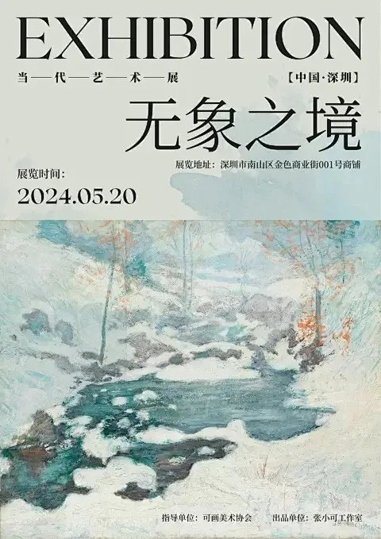

---

## 7. 古代美术文物展 —— 传统东方竖排

仿旧纸底，隐约草书纹理；中部横窗嵌山水画，右侧竖排大字「古代／美術」，英文 ANCIENT ART EXHIBITION 竖红细字陪跑；底部日期与馆方信息横排收束。

文物展、书画文献展的经典站位：竖排扛文化重量，横窗当「展柜切片」，现代信息落在底栏，古今分层清楚。


---

## 8. 黑白艺术展 —— 横向材质拼贴

浅灰底，中上一条由十余根高低不一的竖条拼成的材质带（大理石、植物纹、网点、几何……）；其下居中大字「藝術展」+ 拼音，再下一则英文短引谈材料与诗意。顶栏日期地点、底栏分区与名单用网格收纳。

严格黑白 + 横向材质节奏，气质接近网格系统那一路——偏理性、偏「国际印刷品」。和瑞士国际主义同场时可对照看，**主题仍是展览名片，不是网格教科书**，勿硬并。


---

## 9. 创意毕设展 —— 几何字体构成

浅冷蓝底，半透明圆与几何块叠出「设 / 计」结构感；「毕设」「创意」「展」字号层级拉开，字本身就是图形。日期、院校、专业列表、二维码贴在边缘，不进主形。

设计类毕业联展常见选择：用字体构成宣告「我们在做设计」，比再贴一张作品拼贴更干净。


---

## 没有标准答案，调性统一就够

九种招式并不是九道必背公式。赛博解构配数字展、书法叠层配学院毕业展、手绘地图配山谷艺术节——成立的原因都是**版式调性跟展览主题咬合**。

反过来也成立：把八角窗硬套进赛博数字展，或把材质拼贴条塞进山水文物展，招式再漂亮也像穿错衣服。

审美积累记这一句就够：先问这场展要递出去什么脾气，再选版式语言；统一服务于主题，比堆技巧安全。


## 一张卷轴盘活整版：主流报纸创意排版图鉴

报纸整版最怕什么？栏框密、字堆死、读者一眼就滑走。这几年不少党报、行业报、都市报，爱拿同一个器物救场——**卷轴**。

卷轴在版面上不只是装饰边框。它把「画卷 / 史册 / 蓝图 / 文脉」这几层意思压进一张纸：文化主题像在展画；成就回顾像在翻史册；规划部署像在铺蓝图；地方文旅像在续文脉。主题一对上，整版就有了主心骨。

下面按报题过一遍案例，再留六条共同手法与读者常吵的几句。


开篇这张不是拼贴导览，是河南日报《奔腾吧 幸福河》：卷轴铺底，黄河以金黄丝带从卷面蜿蜒而出，把九省地标串成叙事线——卷轴当「柔性容器」的典型。

---

## 三类主题，卷轴各自怎么用

| 符号读法 | 适合主题 | 版面上像什么 |
|---|---|---|
| 画卷 | 文旅、节庆、民俗、诗词 | 卷面展开成风景 / 人物 / 节庆主视觉 |
| 史册 | 周年回顾、成就盘点、「十四五」答卷 | 卷体承托时间轴、数据条、大事记 |
| 蓝图 / 文脉 | 两会部署、规划开局、地方文脉 | 卷面像未写完的图，或把古今并置在同一卷芯 |

同一器物，映射不同；读者不用读完标题，也能感到「这页在讲展开、传承、还是向前画」。

---

## 图鉴：一张卷轴，各报各用

### 河南日报 · 中华经典诗词论坛

竖向长卷落下「此中有诗意」，城市诗签贴在卷缘，论坛报道与人物访谈绕卷排布——文化符号与正文真正咬合，不是贴一张 PNG。


### 中国气象报 · 立春

节气专版用卷轴托住「立春」意象，把气象新闻从冷数据拉回物候与时令。


### 人民日报 · 开封菊花节

斜置卷轴框住菊田人物大图，祥云与花瓣软化栏线；严肃报道里忽然有了节庆温度。


### 四川日报 · 安逸四川夏旅

夏旅主题用卷轴展「安逸」气质，文旅信息跟着卷势走，少了说明书感。

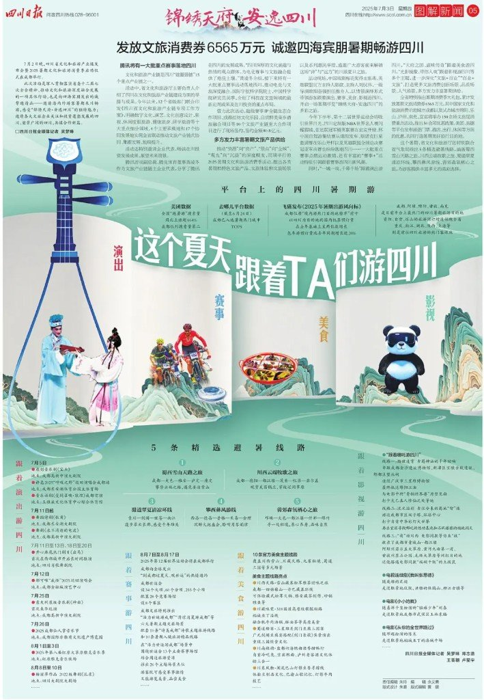

### 大同日报 · 一万平方公里看中国

大主题、大信息量时，卷轴负责收束视线，避免整版散成展板墙。

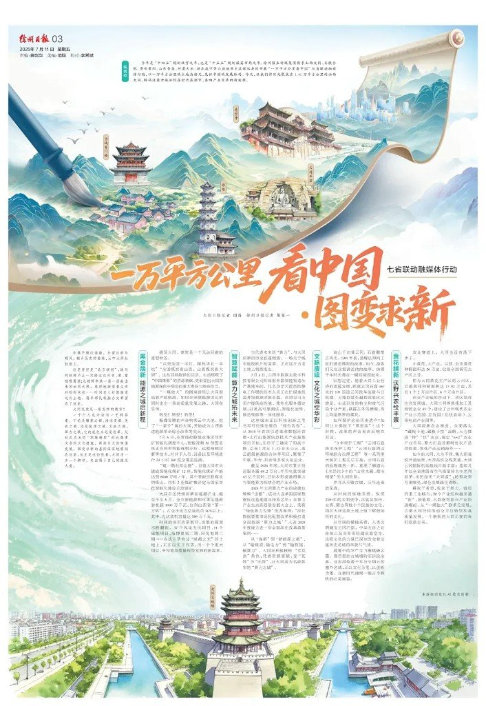

### 烟台日报 · 万亿之城碳路先锋

产业与「碳」叙事偏硬，卷轴把发展线画成可跟读的路径，而不是表格堆砌。

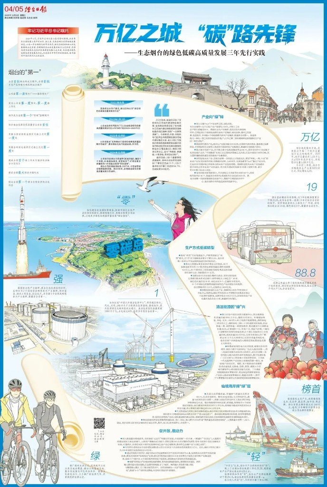

### 四川日报 · 中国旅游日

旅游日整版再度用卷：节日气氛 + 线路/活动信息，卷面当导览层。


### 浙江日报 · 「十四五」四件大事

省两会语境下，白色长卷在山水与城市场景间蜿蜒，四件大事写在卷上，成就块落在卷侧——史册感与蓝图感叠在一起。[^masthead-zj]

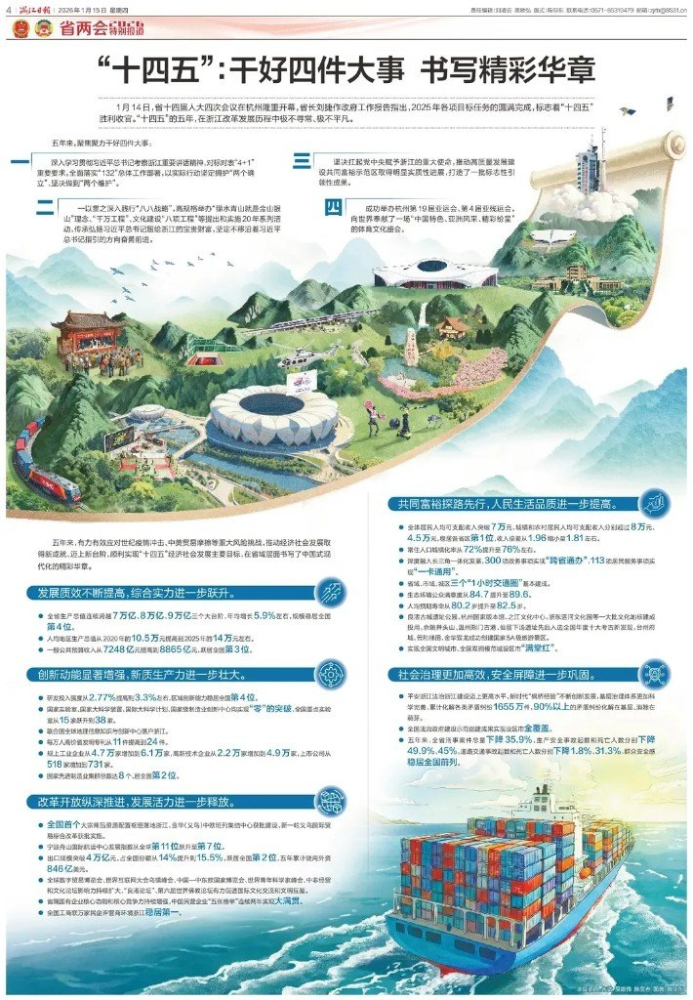

### 新华日报 · 震泽

地方专版用卷轴托「震泽」文脉与风貌，小切口也能做整版气势。


### 深圳特区报 · 两会蓝图

横展卷轴里画出城市场景，「蓝图已经绘就」直接落到器物上；两侧回顾 / 奋进数据夹着卷芯。[^masthead-sz]

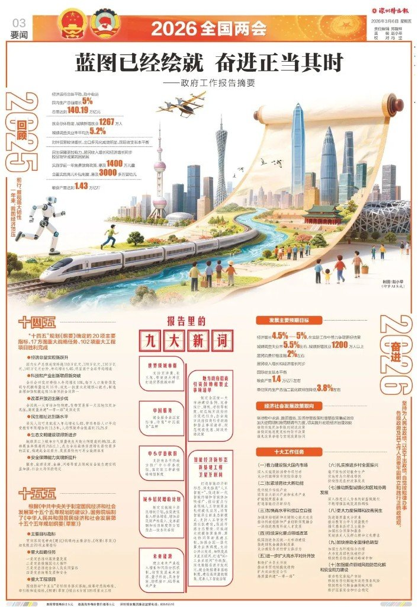

### 深圳特区报 · 中行「十四五 / 十五五」

金融答卷本该很硬。上方长卷山水城景，下方三枚红色短卷分栏「识 / 智 / 力」，严肃选题被中式容器接住。


### 钱江晚报 · 少年诗词大会

少年与诗词，卷轴回到「文脉」本义：活动报道带着书卷气，而不是赛场海报腔。

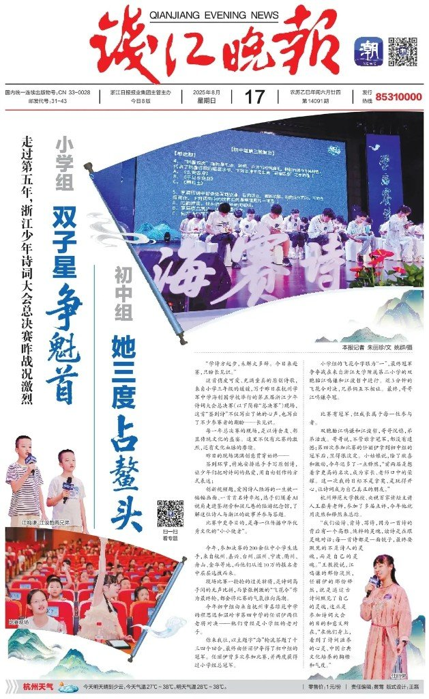

### 湖南日报 · 乡村振兴画卷

「画卷」二字写进主题，卷轴几乎是标题的视觉同义词——符号与文案对齐时，读者零成本读懂隐喻。


### 浙江日报 · 平阳

县域专题用卷展地方肌理，信息密度高时仍靠卷势分主次。


### 深圳特区报 · 阅读周刊民俗画卷

阅读周刊把民俗收进画卷形态，纸媒版式同时适合拆条发新媒体。

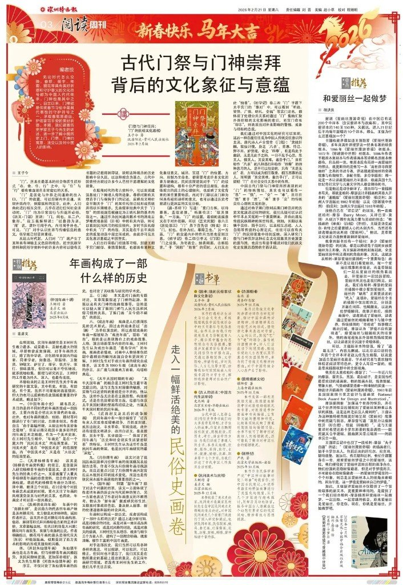

### 襄阳日报 · 「两资三能」

工业与招商报道里，卷轴分别框住江城风景与工地实景——柔性容器把硬新闻和软视觉缝在同一页。

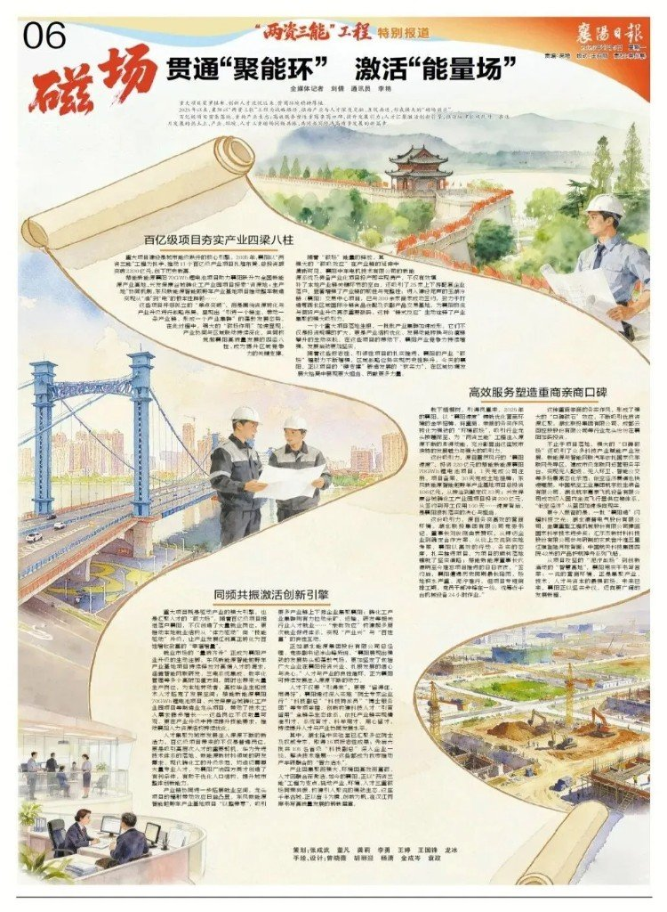

---

## 这些整版其实在干同一件事

六条共同特点，原文写得很全，这里原样压实留用：

1. **文化符号与图文一体**  
   卷轴不是角落贴纸，而是标题、照片、数据的承托结构；符号语义（展开、传承、书写）与稿件主题同向。

2. **柔性容器**  
   刚性栏框改成可弯曲、可斜置、可分叉的卷面，文字与图片跟着卷势走，信息再多也不像砌砖。

3. **形态多变**  
   竖卷、横卷、斜卷、短卷条、多卷并列……同一符号换形态，版式就不会一眼撞车。

4. **中式美学软化严肃选题**  
   两会、金融、产业、碳中和这类硬稿，靠卷轴、云纹、山水、翰墨气，把「必须读」变成「愿意看」。

5. **纸媒 + 新媒体双向**  
   整版在报上成立；拆成长图、九宫格、短视频封面时，卷轴主视觉仍可单独成立——一次设计，两端吃。

6. **构图核心、主次分明**  
   先立卷轴主视觉，再挂卫星信息块；读者先被器物抓住，再决定往哪一块钻。

拿去对照自己做的活动长图 / 年报内页也成立：先问「卷轴在这页到底代表画卷、史册还是蓝图」，再决定形态，比先找素材库 PNG 靠谱。

旁链（不合并）：哑光纸质杂志感与巨型裁切字，见 [`告别塑料感：哑光纸、偏心视窗、巨型裁切字`](../2026-08-10_告别塑料感_巨型裁切字海报/告别塑料感：哑光纸、偏心视窗、巨型裁切字.md)；冲击力海报七套，见 [`一眼很猛：GPT-Image2七种高张力海报提示词`](../2026-08-10_GPT-Image2高张力海报7风格/一眼很猛：GPT-Image2七种高张力海报提示词.md)；结构化出科普海报，见 [`输入一个名字：Coze三十秒出历史人物科普海报`](../2026-08-10_Coze历史人物科普海报工作流/输入一个名字：Coze三十秒出历史人物科普海报.md)。

---

## 评论区比版式本身还吵

有人说卷轴看多了会**视觉疲劳**——符号一旦成套路，就从巧思变成模板。这话公允：器物救得了单页，救不了整年审美。

也有人打出「**太卷了**」：一边夸版式真会「卷」，一边吐槽行业内卷。双关之所以好笑，是因为两种「卷」常常一起来。

还有人怀疑画面「**像 AI 风**」。真假不必在笔记里拍板；值得记的是：当中式符号被批量复用，读者会下意识用「是不是机器出的」来表达审美不适。

致谢向的留言里，**河南日报**等常被点名——说明读者认的是「符号用对了主题」，不是「谁先用了卷轴」。

---

## 什么时候别硬上卷轴

主题本身没有展开 / 传承 / 书写隐喻时，硬贴卷轴只会显得空。信息必须做成严格对照表、地图坐标、流程图时，柔性容器也可能拖慢检索。符号疲劳已经出现在同一系列里时，换器物比换配色更有用。

认清卷轴在这一页到底是画卷、史册还是蓝图，再决定要不要用——比收藏一百张「创意报纸」截图更能带走。


## 配图难在画不稳：ip-diagram-creator 先锁角色再出图

漂亮图到处能生，难的是主角明天还像今天。`ip-diagram-creator`（MIT，[GitHub](https://github.com/haloshin/ip-diagram-creator)）不是又一个生图按钮，而是一套 Agent Skill 工作流：**先定角色，再拆内容，最后生成图解。**

授权照片 / 主页截图 / 简介 → 极简手绘 IP 角色资产；再把长文、课程、观点或脚本拆成长文配图、知识卡、方法拆解图、手机海报或整页 PPT。


::github{repo="haloshin/ip-diagram-creator"}

## 官方怎么装

```bash
# 当前项目
npx skills add https://github.com/haloshin/ip-diagram-creator

# 全局
npx skills add https://github.com/haloshin/ip-diagram-creator -g
```

或不走安装器：把仓库丢进 Agent Skills 目录，让 Agent 读 `SKILL.md`。

推荐环境：能读图 + 较强推理 + 有图像生成工具。没有生图能力时，Skill 应输出可复制 prompt 和返修 prompt，**不假装已经出图**。

## 痛点：不是画不出，是画不稳

换一句提示词，眼镜没了、脸型变了、衣服颜色漂了——读者认不出「同一个人」。外包画师换人也一样。IP 立不起来，往往栽在主角漂移，不是缺一张「好看的图」。

## 角色三件套，先当固定资产

写完文章别先「找配图」——先固化角色：

| 资产 | 锁什么 |
|---|---|
| 01 角色主锚图 | 长什么样：发型、五官比例、服装、配色 |
| 02 角色规范说明图 | 不能跑偏：禁区、道具、配色、纠偏依据 |
| 03 动作/表情/小比例扩展 | 缩成米粒大也能认；复杂姿态与 Agent 协作区 |

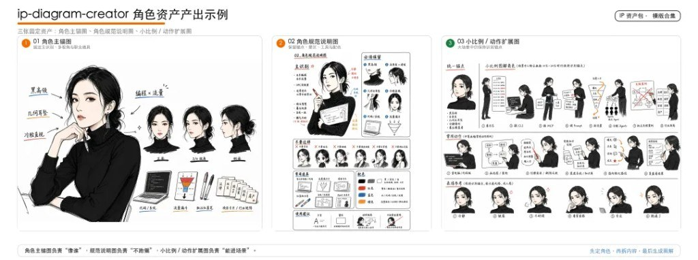

三张定下来，后面配图从资产里长，而不是每次重抽签。分水岭在这里：问「这张能不能用」还是「这张是不是我」。

引用优先级（仓库约定）：主锚图 > 动作扩展图 > 规范说明图 > 原始照片 > 临时图 > 自由发挥。

## 先写 shot list，再分模式出图

角色确认后，Agent 先读文，输出 **shot list**（几张、什么类型、各自信息职责），再生成。别一上来「配几张图」——那最容易图文两层皮。

| 模式 | 信息量 / 用途 |
|---|---|
| 手绘插图 | 低密度，大场景隐喻一个观点，偏情绪 |
| 知识卡 | 高密度，方法/步骤/风险/行动可收藏 |
| 长文 shot list | 控配图节奏与视觉权重 |
| PPT 演讲模式 | 先导演规划卡 → 样张 → 分批出页 → 整套 QA |


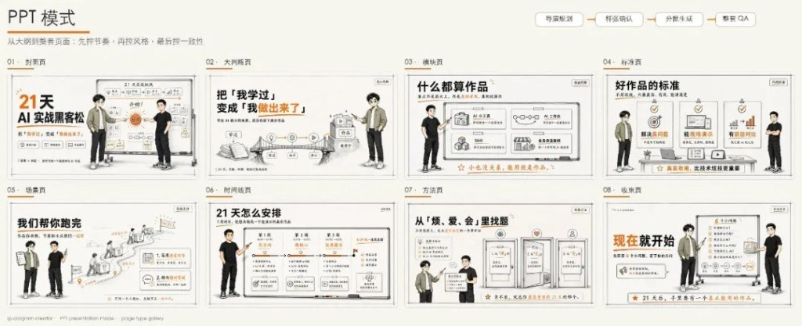

PPT 常见页型：封面、大纲/大判断、模块、标准、场景、时间线、方法、收尾。流程是「先控节奏，再定风格，最后保一致」，不是每页硬套知识卡。

## 质量闸门：过这三关再留

- 角色一致
- 文字准确（贴输入内容）
- 结构清楚

## 边界：别当万能外挂

- 不保证复刻真人；不作证件照 / 高拟真商业肖像
- 不吃未授权照片、他人私密截图、不可分发资料
- 不替代商标/肖像权/投放前人工审核
- 用户确认后的私有角色资产，不要塞进公共 Skill 包当默认皮肤

生成 PPT 若要可编辑文字，可接 `ppt-master` 等 skills；具体生图模型取决于你的 Agent 环境（有 `image_gen` / GPT Image 等则可直出）。

## 下一张图之前先问自己

工具会迭代，热点会凉；稳定可识别的「你」才是配图侧的复利。下一张图之前先问：这是「我」，还是又一张「图」？


## MiniMax 封面风格规范：通用与特定场景

## 这篇在说什么

本站用 MiniMax 生成卡片封面时，不只「随便出一张好看的图」，而是先按场景选风格池：

1. **通用场景** — 生成前列出选项，让你挑；不选则默认 **编辑静物（03）**
2. **特定场景** — 题材命中关键词时，直接走对应风格，不再弹通用菜单

下面样张共用同一主题锚点：**夜写字台 · 萤火 · 笔记本 · 台灯 · 咖啡杯**，方便只比风格、不比题材。

口味硬规范（生成时始终生效）：

- 极具创意，拒绝廉价 AI 味（尤其蓝紫渐变、紫粉霓虹）
- 艺术感 + 现代感
- 紧贴主题，或主题高度抽象
- 画面包含多种可辨要素

本地样张挑选页已下线；本文保留历史风格表与示例说明。

## 通用场景

换帖题也能撑住的风格。出封面时列出菜单；**不选 → 默认 03**。

| ID | 风格 | 菜单文案 | 适用主题 |
|----|------|----------|----------|
| 03★ | 编辑静物 | 印刷级静物（默认） | 几乎任意博文 |
| 09 | 35mm 胶片 | 胶片纪实 | 随笔 / 旅行 / 情绪 / 视频教程 |
| 16 | 水粉插画 | 杂志风插画 | 教程 / 科普 / 产品介绍 |
| 06 | Risograph | 孔版油墨 | 创作谈 / 科技人文 |
| 10 | 剪纸拼贴 | 剪纸拼贴 | 综述 / 多概念 / 抽象杂谈 |
| 05 | 包豪斯 | 几何抽象 | 系统设计 / 高度抽象贴题 |
| 08 | 等轴微缩 | 等轴微缩场景 | 流程 / 架构 / 工具链 |

### 03★ 编辑静物（默认）

印刷级静物，博物馆图录感；几乎任意博文的稳妥底盘。

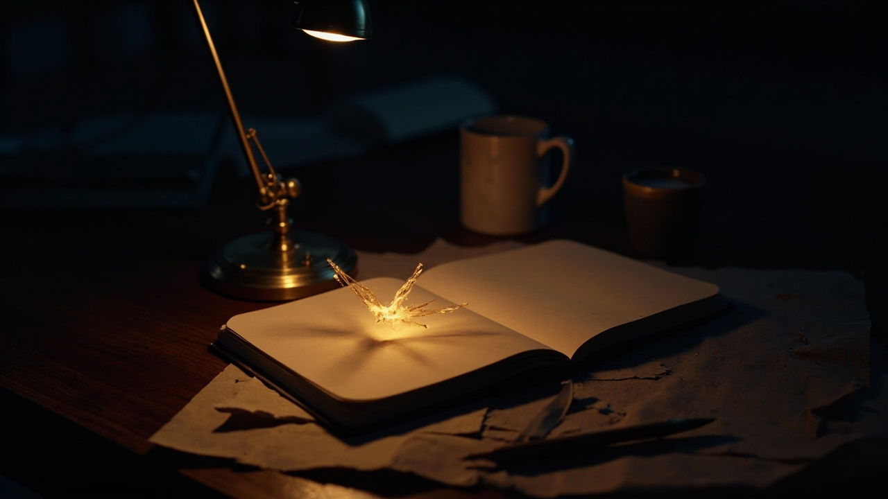

### 09 35mm 胶片

纪实亲密感与颗粒；适合随笔、旅行、情绪向与视频教程封面。


### 16 水粉插画

杂志风手绘插画；适合教程、科普、产品介绍。


### 06 Risograph 孔版

独立杂志油墨叠印质感；适合创作谈、科技人文。


### 10 剪纸拼贴

手撕纸层与多物件拼合；适合综述、多概念杂谈。


### 05 包豪斯几何

圆 / 矩 / 三角重构物件；适合系统设计与高度抽象贴题。


### 08 等轴微缩

干净 isometric 微缩场景；适合流程、架构、工具链。


## 特定场景

题材命中下表关键词时，**默认直出对应风格**（除非你明确改口）。

| ID | 风格 | 触发主题 |
|----|------|----------|
| 01 | 像素 | 像素 / 8·16-bit / 复古掌机 / retro game |
| 02 | 体素 | Minecraft / 方块 / 沙盒 |
| 13 | Low-poly | 低面数 / 3D 游戏美术 |
| 07 | 浮世绘 | 和风 / 浮世绘 / 日式美学 |
| 11 | 水墨 | 书法 / 古典 / 禅意 / 水墨 |

### 01 像素风


### 02 我的世界 / 体素

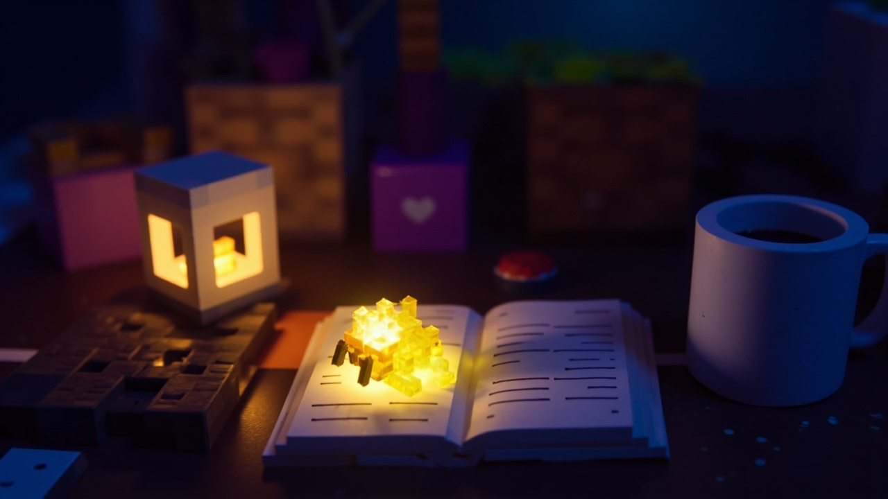

### 13 Low-poly 3D


### 07 当代浮世绘


### 11 当代水墨

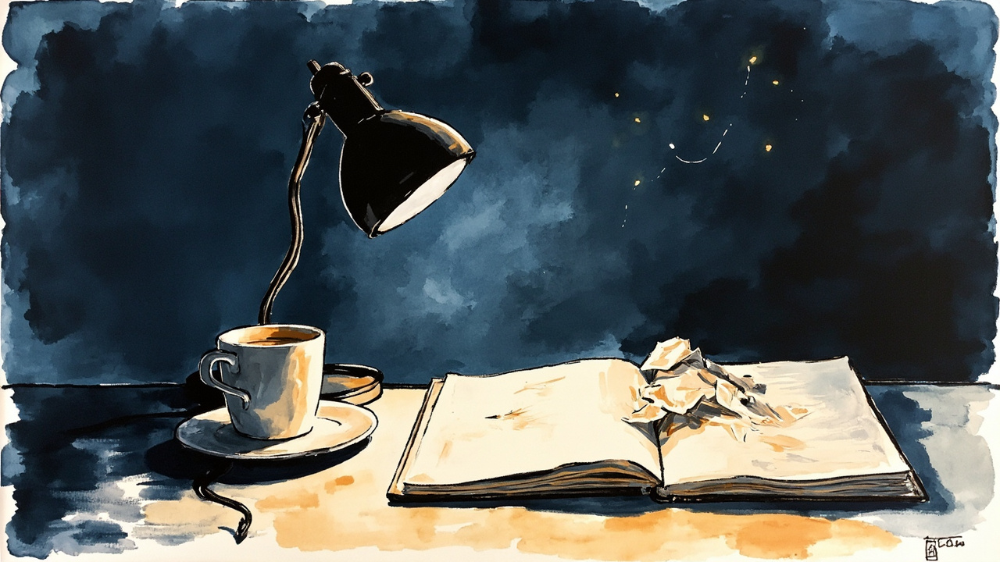

## 怎么分流

1. 先看题材是否命中「特定场景」表  
2. 命中 → 直接用对应 ID 写 prompt 出图  
3. 未命中 → 列出通用 7 选项；不选则用 03  
4. 任何风格都套用文首口味硬规范，并避开蓝紫廉价 AI 味  
5. **索引 / 章节信息图**：与封面共用本表；须按章显式选 ID，禁止整帖/整批同材质（含水粉 16 当默认）。

未纳入本规范的样张（默认不用）：04 瑞士海报 · 12 黏土 · 14 粗野 · 15 陶瓷。

## 相关资产

| 资产 | 路径 |
|------|------|
| 风格挑选页 | 已下线（历史样张表仍保留在本文） |
| Skill 工艺说明 | 已下线 |
| 本帖封面 | `./cover.jpg`（与 03 编辑静物同图） |


## 瑞士网格那一套：国际主义风格五条原则

国际主义风格（International Typographic Style），也就是常说的瑞士风格。网格、无衬线、形式服从功能、黑白灰加几何色块——这套语言一旦上手，信息会排得极清楚；代价是谁都会用，海报看起来也容易撞车。


封面直接戏仿了瑞士杂志 *werk* 1960 年 10 月刊的版式语言：红底、建筑网格照片、大号无衬线刊名。系列期号钉在 **vol.081**。

网格不是装饰线。Josef Müller-Brockmann 那句被反复引用的话——*same size margins never make an interesting page*——说的是：等宽页边不等于好版面，真正有趣的页来自严格又敢用的网格。


---

## 01 · 严格网格系统排版

把画面切成可计算的栏与行，字、图、色块都贴着轴线落位。信息不靠「感觉摆」，靠对齐关系自己长出秩序。


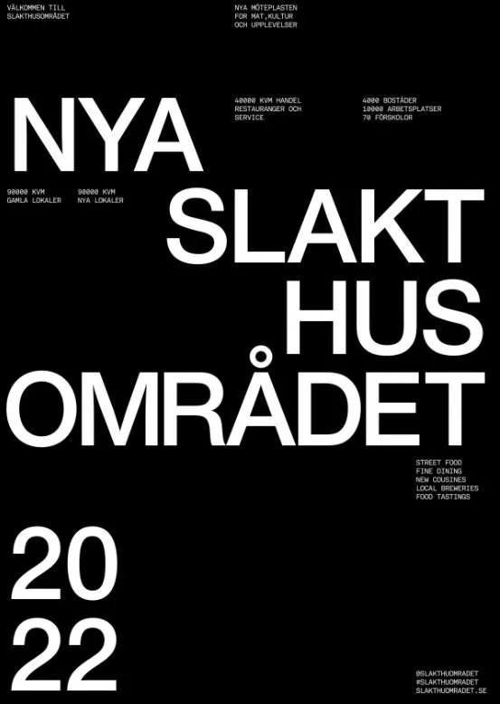


---

## 02 · 推崇无衬线字体

Akzidenz-Grotesk、Helvetica、Univers 这一路：笔画均匀、字腔开放、少装饰。字本身尽量不抢戏，让层级靠字号、字重、位置说话。


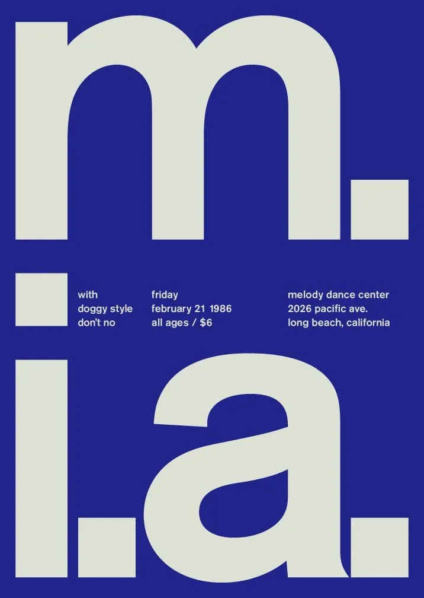

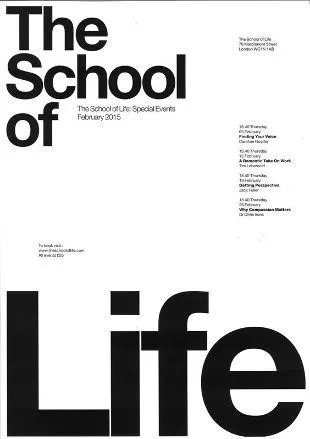


---

## 03 · 极简视觉，形式追随功能

能删的装饰先删。版面存在的理由是把事说清楚：日期、人名、价格、换算表——功能在前，样子跟在后面。

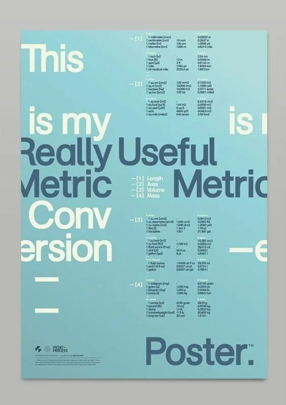

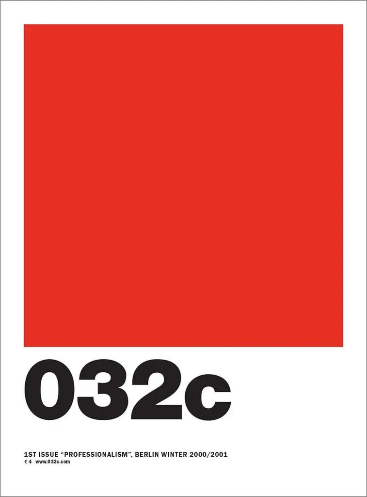

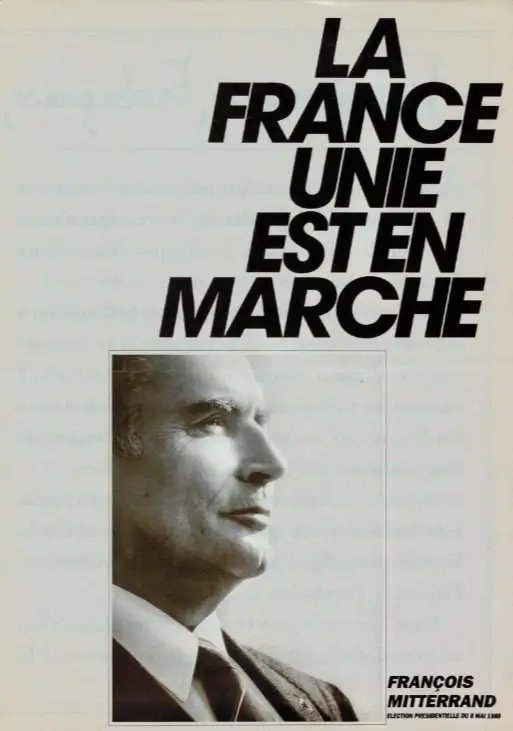

---

## 04 · 客观视觉要素，对比建层级

照片倾向客观、少修饰；层级靠大小、黑白、疏密、对齐，而不是花边和渐变。字和图被当成同一套几何零件来拼。


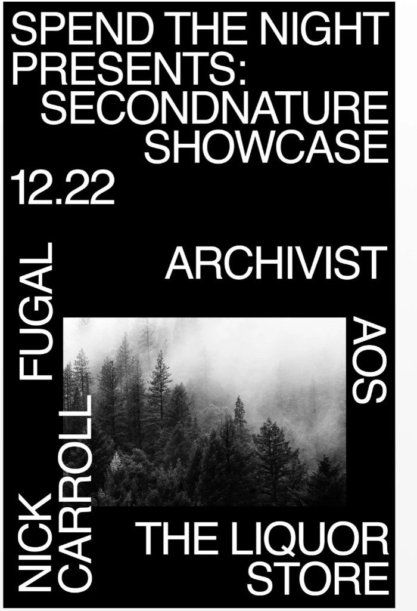


Hofmann 这张 *Giselle*：竖排大字 + 运动模糊的舞者照片，几乎把「客观摄影当色块」写进教科书。

---

## 05 · 极强通用性，也容易刻板

博物馆征集、奥运会申办、杂志创刊号、剧场季、独立活动——同一套语法都能套。这是它厉害的地方，也是它闷的地方：人人网格 + Helvetica，辨识度会被冲淡。

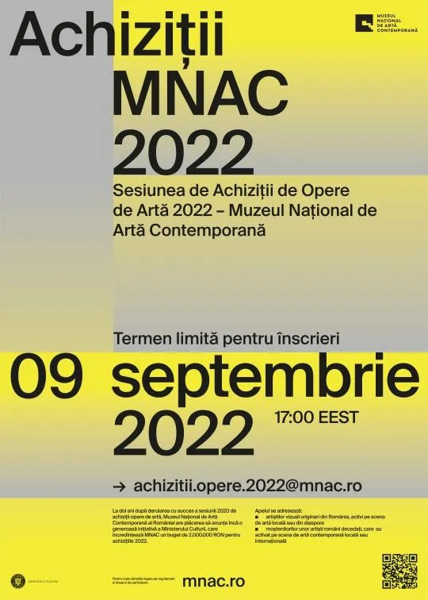

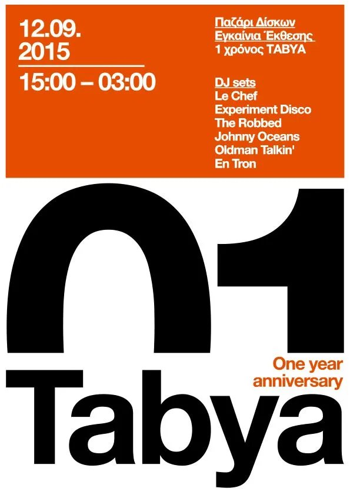

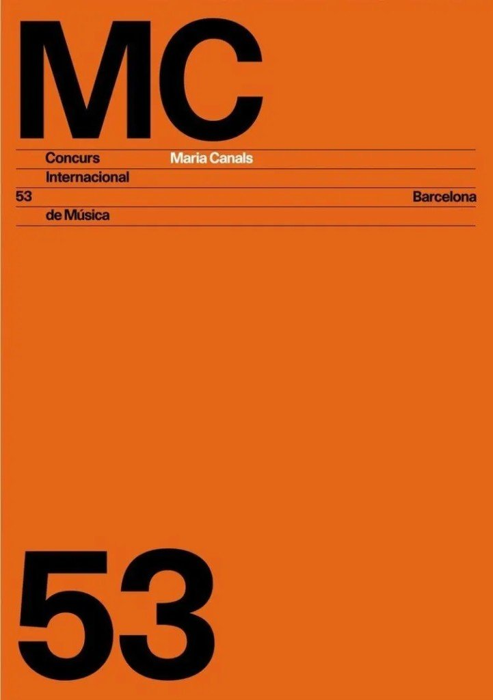

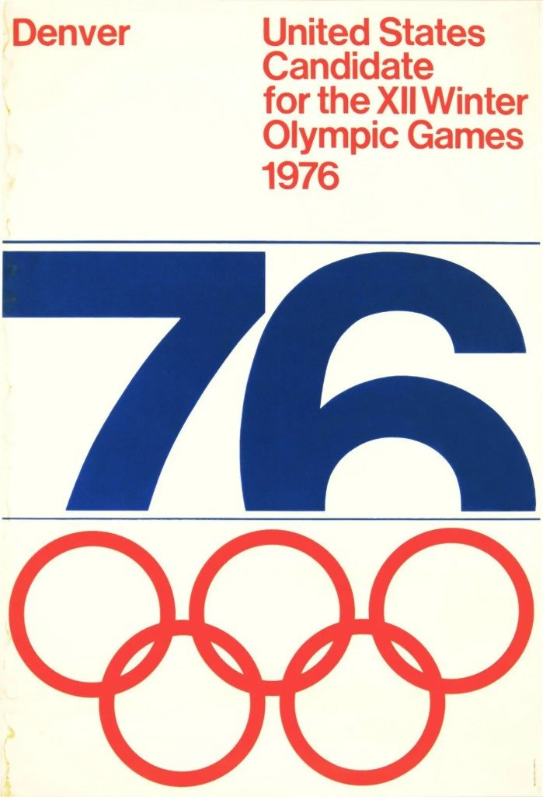


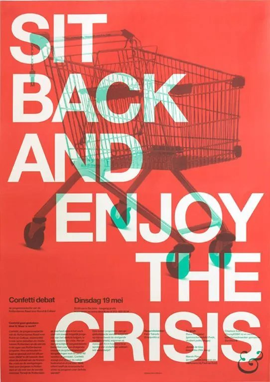

学这套时，先把「清楚」练稳；真要做出辨识度，得在网格内部找非常规切口（字阶跳跃、摄影裁切、单一强调色），而不是再堆装饰。

---

## 四段史：从萌芽到被后现代冲，网格原则还在

| 阶段 | 大致时间 | 带走什么 |
|---|---|---|
| 萌芽 | 1920s 前后 | 包豪斯、俄国构成主义、荷兰风格派：几何、功能、去掉多余装饰 |
| 形成 | 1940–50s | 瑞士设计学校与实践者（如 Müller-Brockmann 等）把网格与无衬线体系化 |
| 鼎盛 | 1960–70s | 机构、杂志、公共信息大规模采用；国际传播把「瑞士」做成通用语 |
| 革新 | 1980s 起 | 后现代冲击对称与冷感，风格不再「唯一正解」；网格/层级原则却渗进日常 UI 与品牌系统 |


黄底那张把 Bauhaus、Swiss Modernism、International Typographic Style、Constructivism 串在同一信息架构里——本身就是用瑞士语法讲瑞士史。
