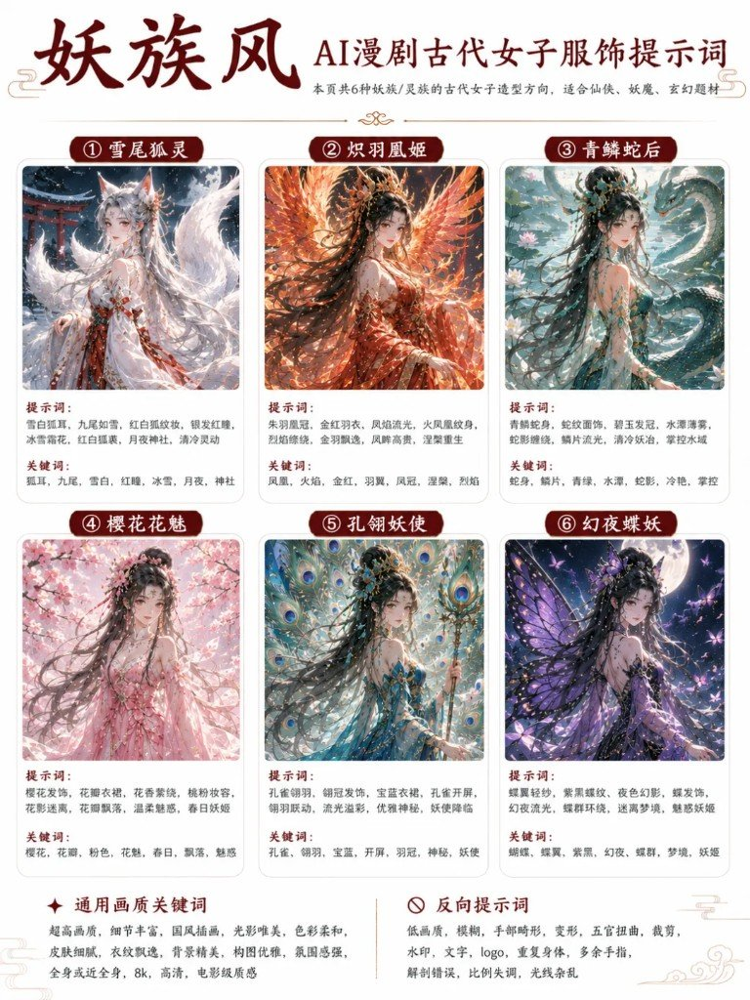
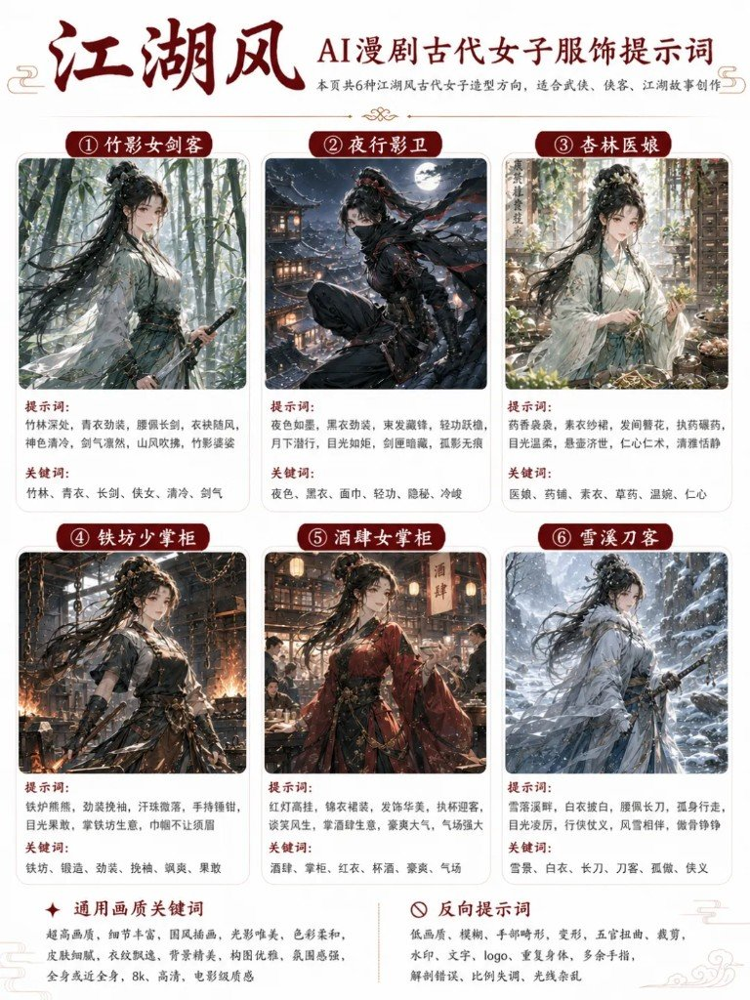
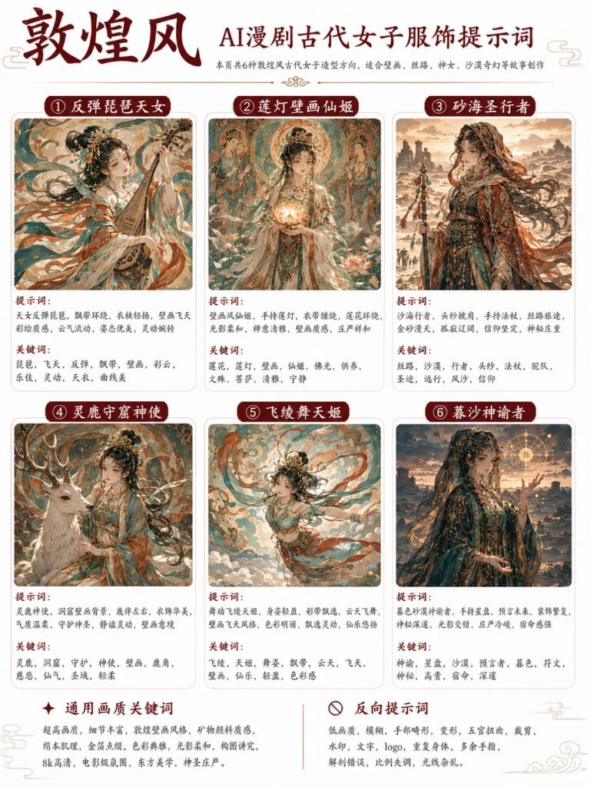

做 AI 漫剧时，古代女角色最容易翻车：想仙气飘逸，出来却像普通古装；想江湖侠女，衣服又不利落。根子多半是提示词太笼统——「古风美女、长发、汉服」几乎等于没写身份。

---

## 为什么「古风美女」不够用

身份没写清，模型就往默认古装美女里收。仙侠要御剑与云海，宫廷要等级与纹样，江湖要劲装利落——气质差在角色、配色、服装、发饰、场景这五件事上，不在「再加一个美丽」。

生成时按人物身份拼关键词，画面辨识度更高，也更容易压住整部漫剧的角色统一。

---

## 六张风格页（原图）









---

## ① 仙侠风

图面副题：本页共 6 种仙气飘逸的仙侠/奇幻女子造型方向，适合仙侠、修真、玄幻题材。

| # | 角色 | 提示词（图面原文） | 关键词 |
|---|---|---|---|
| 1 | 云岚剑姬 | 青蓝衣裙，剑穗飘扬，云雾缭绕，御剑姿态，长发飞舞，山峰仙宫，清冷飘逸 | 清冷、剑气、青蓝、云海、御剑、轻盈 |
| 2 | 霜华灵女 | 银白冰蓝，薄纱披帛，冰晶雪花，寒气萦绕，灵气凝结，冰川幻境，高贵清雅 | 冰雪、晶莹、银蓝、灵气、高洁、仙冷 |
| 3 | 桃夭仙使 | 粉白纱裙，桃花发饰，花瓣飞舞，灵动温柔，仙鹤相伴，春日仙境，浪漫甜美 | 桃花、粉色、花瓣、灵动、温柔、仙鹤 |
| 4 | 星月谪仙 | 深蓝星空，月冠星链，流光披帛，星辰环绕，手持月辉，夜空宫阙，神秘梦幻 | 星月、深蓝、流光、神秘、梦幻、高贵 |
| 5 | 碧荷真君 | 碧绿衣裙，荷花头饰，水波环绕，莲叶轻摇，玉佩流苏，清新自然，灵韵悠然 | 荷花、碧绿、水波、清新、灵韵、端庄 |
| 6 | 天阙神女 | 白金华服，神女冠冕，云海仙宫，金光流转，法杖在手，气场威严，神圣庄重 | 白金、神圣、云海、宫阙、威严、庄重 |

**角色怎么拆（从图面提示词归纳）**

| 角色 | 配色 | 服装/道具 | 发饰 | 场景气质 |
|---|---|---|---|---|
| 云岚剑姬 | 青蓝 | 衣裙、剑穗、御剑 | 长发飞舞 | 云雾、山峰仙宫、清冷 |
| 霜华灵女 | 银白冰蓝 | 薄纱披帛、冰晶 | —— | 冰川幻境、寒气 |
| 桃夭仙使 | 粉白 | 纱裙 | 桃花发饰 | 花瓣、仙鹤、春日仙境 |
| 星月谪仙 | 深蓝 | 流光披帛、月辉 | 月冠星链 | 夜空宫阙 |
| 碧荷真君 | 碧绿 | 衣裙、玉佩流苏 | 荷花头饰 | 水波、莲叶 |
| 天阙神女 | 白金 | 华服、法杖 | 神女冠冕 | 云海仙宫、威严 |

---

## ② 宫廷风

图面副题：本页共 6 种高贵华美的宫廷女子造型，适合宫斗、权谋、古风宫廷故事。

| # | 角色 | 提示词（图面原文） | 关键词 |
|---|---|---|---|
| 1 | 昭华贵妃 | 朱红宫装，金线绣牡丹，凤冠步摇，珠翠垂曳，华贵典雅，气度雍容，深宫贵妃 | 贵妃、牡丹、朱红、金绣、凤冠、珠翠、华丽、雍容、高贵 |
| 2 | 凤仪皇后 | 明黄皇后礼服，龙凤纹刺绣，十二旒冕冠，端庄威仪，母仪天下，皇权象征 | 皇后、明黄、龙凤、旒冕、端庄、威严、母仪、尊贵、霸气 |
| 3 | 海棠公主 | 粉色公主裙，海棠花纹，珠花发饰，轻盈飘逸，温婉灵动，尊贵公主 | 公主、海棠、粉色、花朵、珠花、轻盈、温婉、灵动、尊贵 |
| 4 | 雪庭才人 | 素白才人服，银雪纹样，白玉发簪，清冷雅致，气质出尘，才情内敛 | 才人、素白、雪花、银色、清冷、雅致、才情、内敛、出尘 |
| 5 | 兰台嫔女 | 淡紫宫装，兰花刺绣，玉簪流苏，书香气质，温婉端方，兰台读书嫔女 | 嫔女、兰花、淡紫、刺绣、流苏、文雅、端方、书香、温婉 |
| 6 | 夜阙宠妃 | 墨紫宠妃服，金线暗纹，流苏发饰，夜色宫阙，神秘迷人，受宠倾城 | 宠妃、墨紫、夜色、金线、流苏、神秘、妖娆、倾城、受宠 |

**角色怎么拆**

| 角色 | 配色 | 服装 | 发饰 | 场景/身份 |
|---|---|---|---|---|
| 昭华贵妃 | 朱红、金绣 | 宫装牡丹纹 | 凤冠步摇、珠翠 | 深宫贵妃 |
| 凤仪皇后 | 明黄 | 龙凤礼服 | 十二旒冕冠 | 母仪、皇权 |
| 海棠公主 | 粉色 | 公主裙海棠纹 | 珠花发饰 | 温婉灵动 |
| 雪庭才人 | 素白、银雪 | 才人服 | 白玉发簪 | 清冷出尘 |
| 兰台嫔女 | 淡紫 | 兰花刺绣宫装 | 玉簪流苏 | 书香兰台 |
| 夜阙宠妃 | 墨紫、金线暗纹 | 宠妃服 | 流苏发饰 | 夜色宫阙 |

---

## ③ 异域风

图面副题：本页共 6 种异域与丝路风格的古代女子造型方向，适合奇幻、边陲、商路、异国故事。

| # | 角色 | 提示词（图面原文） | 关键词 |
|---|---|---|---|
| 1 | 赤砂舞姬 | 赤砂色纱衣，流苏金链，异域舞姬，薄纱披帛，头纱飘饰，沙漠风情，日落余晖，热烈奔放，舞姿灵动 | 赤砂、流苏、金链、纱裙、头纱、舞姬、热情、沙漠 |
| 2 | 绿洲王姬 | 翡翠绿长裙，金饰宝冠，绿洲王姬，轻纱头纱，宝石镶嵌，椰枣林与水渠，华丽高贵，权威典雅 | 绿洲、翡翠、金饰、宝冠、轻纱、宫殿、柳林、典雅 |
| 3 | 蓝纱圣女 | 天蓝纱衣，白金圣纹，异域圣女，面纱轻垂，神祇祭坛，风中飘带，清冷圣洁，神秘庄严 | 蓝纱、圣纹、祭坛、面纱、神圣、纯净、庄严、飘带 |
| 4 | 紫晶商旅少女 | 紫色商旅服，头巾披肩，宝石串饰，驼队商路，市集摊位，机敏灵动，探索冒险，异域风情 | 商旅、紫色、头巾、宝石、驼队、集市、机敏、冒险 |
| 5 | 金铃胡旋娘 | 金铃腰饰，旋舞长袖，胡旋舞娘，彩带飞扬，异域乐器，灯火庭院，舞姿旋转，灵动热情 | 金铃、彩带、长袖、胡旋舞、乐器、旋转、热烈、灵动 |
| 6 | 月幕祭司 | 月白长裙，星月头饰，神秘祭司，披帛垂落，月幕仪式，夜色神殿，清冷神秘，庄重肃穆 | 月白、月幕、祭司、星月、神殿、夜色、神秘、肃穆 |

**角色怎么拆**

| 角色 | 配色 | 服装/饰 | 发饰/头饰 | 场景 |
|---|---|---|---|---|
| 赤砂舞姬 | 赤砂 | 纱衣、流苏金链、披帛 | 头纱飘饰 | 沙漠日落 |
| 绿洲王姬 | 翡翠 | 长裙、宝石 | 金饰宝冠、轻纱头纱 | 椰枣林与水渠 |
| 蓝纱圣女 | 天蓝、白金圣纹 | 纱衣、飘带 | 面纱 | 神祇祭坛 |
| 紫晶商旅少女 | 紫色 | 商旅服、宝石串饰 | 头巾披肩 | 驼队、市集 |
| 金铃胡旋娘 | 彩带、金铃 | 长袖旋舞 | 金铃腰饰 | 灯火庭院、乐器 |
| 月幕祭司 | 月白 | 长裙、披帛 | 星月头饰 | 月幕仪式、夜色神殿 |

---

## ④ 江湖风

图面副题：本页共 6 种江湖风古代女子造型方向，适合武侠、侠客、江湖故事创作。

| # | 角色 | 提示词（图面原文） | 关键词 |
|---|---|---|---|
| 1 | 竹影女剑客 | 竹林深处，青衣劲装，腰佩长剑，衣袂随风，神色清冷，剑气凛然，山风吹拂，竹影婆娑 | 竹林、青衣、长剑、侠女、清冷、剑气 |
| 2 | 夜行影卫 | 夜色如墨，黑衣劲装，束发藏锋，轻功跃檐，月下潜行，目光如炬，剑匣暗藏，孤影无痕 | 夜色、黑衣、面巾、轻功、隐秘、冷峻 |
| 3 | 杏林医娘 | 药香袅袅，素衣纱裙，发间簪花，执药碾药，目光温柔，悬壶济世，仁心仁术，清雅恬静 | 医娘、药铺、素衣、草药、温婉、仁心 |
| 4 | 铁坊少掌柜 | 铁炉熊熊，劲装挽袖，汗珠微落，手持锤钳，目光果敢，掌铁坊生意，巾帼不让须眉 | 铁坊、锻造、劲装、挽袖、飒爽、果敢 |
| 5 | 酒肆女掌柜 | 红灯高挂，锦衣裙装，发饰华美，执杯迎客，谈笑风生，掌酒肆生意，豪爽大气，气场强大 | 酒肆、掌柜、红衣、杯酒、豪爽、气场 |
| 6 | 雪溪刀客 | 雪落溪畔，白衣披白，腰佩长刀，孤身行走，目光凌厉，行侠仗义，风雪相伴，傲骨铮铮 | 雪景、白衣、长刀、刀客、孤傲、侠义 |

**角色怎么拆**

| 角色 | 配色/装 | 道具 | 发饰 | 场景 |
|---|---|---|---|---|
| 竹影女剑客 | 青衣劲装 | 长剑 | —— | 竹林、山风 |
| 夜行影卫 | 黑衣劲装、面巾 | 剑匣 | 束发 | 月下屋檐、潜行 |
| 杏林医娘 | 素衣纱裙 | 药碾 | 发间簪花 | 药香、药铺气 |
| 铁坊少掌柜 | 劲装挽袖 | 锤钳 | —— | 铁炉 |
| 酒肆女掌柜 | 锦衣偏红 | 杯 | 华美发饰 | 红灯酒肆 |
| 雪溪刀客 | 白衣披白 | 长刀 | —— | 雪落溪畔 |

> 「白衣披白」按图面可见字形抄录；若实拍印刷更像「披帛」，以原图为准。

---

## ⑤ 妖族风

图面副题：本页共 6 种妖族/灵族的古代女子造型方向，适合仙侠、妖魔、玄幻题材。

| # | 角色 | 提示词（图面原文） | 关键词 |
|---|---|---|---|
| 1 | 雪尾狐灵 | 雪白狐耳，九尾如雪，红白狐纹妆，银发红瞳，冰雪霜花，红白狐裘，月夜神社，清冷灵动 | 狐耳、九尾、雪白、红瞳、冰雪、月夜、神社 |
| 2 | 炽羽凰姬 | 朱羽凤冠，金红羽衣，凤焰流光，火凤凰纹身，烈焰缠绕，金羽飘逸，〔图面文字不清〕，涅槃重生 | 凤凰、火焰、金红、羽翼、凤冠、涅槃、烈焰 |
| 3 | 青鳞蛇后 | 青鳞蛇身，蛇纹面饰，碧玉发冠，水潭薄雾，蛇影缭绕，鳞片流光，清冷妖冶，掌控水域 | 蛇身、鳞片、青绿、水潭、蛇影、冷艳、掌控 |
| 4 | 樱花花魅 | 樱花发饰，花瓣衣裙，花香萦绕，桃粉妆容，花影迷离，花瓣飘落，温柔魅惑，春日妖姬 | 樱花、花瓣、粉色、花魅、春日、飘落、魅惑 |
| 5 | 孔雀妖使 | 孔雀翎羽，翎冠发饰，宝蓝衣裙，孔雀开屏，翎羽联动，流光溢彩，优雅神秘，妖使降临 | 孔雀、翎羽、宝蓝、开屏、羽冠、神秘、妖使 |
| 6 | 幻夜蝶妖 | 蝶翼轻纱，紫黑蝶纹，夜色幻影，蝶发饰，幻夜流光，蝶群环绕，迷离梦境，魅惑妖姬 | 蝴蝶、蝶翼、紫黑、幻夜、蝶群、梦境、妖姬 |

**炽羽凰姬** 倒数第二组多轮 OCR 在「凤眸高贵 / 凤舞高贵」间摇摆，正文不硬选，见文末缺失项。

**角色怎么拆**

| 角色 | 族征/配色 | 服装 | 发饰 | 场景 |
|---|---|---|---|---|
| 雪尾狐灵 | 狐耳九尾、银发红瞳、红白 | 狐裘、狐纹妆 | —— | 月夜神社、冰雪 |
| 炽羽凰姬 | 金红、火焰、羽翼 | 羽衣、纹身 | 凤冠 | 烈焰、涅槃 |
| 青鳞蛇后 | 青绿鳞 | 蛇身、面饰 | 碧玉发冠 | 水潭、蛇影 |
| 樱花花魅 | 桃粉 | 花瓣衣裙 | 樱花发饰 | 花瓣飘落 |
| 孔雀妖使 | 宝蓝 | 衣裙、开屏翎羽 | 翎冠 | 流光、妖使 |
| 幻夜蝶妖 | 紫黑 | 蝶翼轻纱、蝶纹 | 蝶发饰 | 幻夜、蝶群 |

---

## ⑥ 敦煌风

图面副题：本页共 6 种敦煌风古代女子造型方向，适合壁画、丝路、神女、沙漠奇幻等故事创作。

| # | 角色 | 提示词（图面原文） | 关键词 |
|---|---|---|---|
| 1 | 反弹琵琶天女 | 天女反弹琵琶，飘带环绕，衣袂轻扬，壁画飞天彩绘质感，云气流动，姿态优美，灵动婉转 | 琵琶、飞天、反弹、飘带、壁画、彩云、乐伎、灵动、天衣、曲线美 |
| 2 | 莲灯壁画仙姬 | 壁画风仙姬，手持莲灯，衣带缠绕，莲花环绕，光影柔和，禅意清雅，壁画质感，庄严祥和 | 莲花、莲灯、壁画、仙姬、佛光、供养、文殊、菩萨、清雅、宁静 |
| 3 | 砂海圣行者 | 沙海行者，头纱披肩，手持法杖，丝路旅途，金砂漫天，孤寂辽阔，信仰坚定，神秘庄重 | 丝路、沙漠、行者、头纱、法杖、驼队、圣迹、远行、风沙、信仰 |
| 4 | 灵鹿守窟神使 | 灵鹿神使，洞窟壁画背景，鹿伴左右，衣饰华美，气质温柔，守护神圣，静谧灵动，壁画意境 | 灵鹿、洞窟、守护、神使、壁画、鹿角、慈悲、仙气、圣域、轻柔 |
| 5 | 飞绫舞天姬 | 舞动飞绫天姬，身姿轻盈，彩带飘逸，云天飞舞，壁画飞天风格，色彩明丽，飘逸灵动，仙乐悠扬 | 飞绫、天姬、舞姿、飘带、云天、飞天、壁画、仙乐、轻盈、色彩感 |
| 6 | 暮沙神谕者 | 暮色沙漠神谕者，手持星盘，预言未来，装饰繁复，神秘深邃，光影交错，庄严冷峻，宿命感强 | 神谕、星盘、沙漠、预言者、暮色、符文、神秘、高贵、宿命、深邃 |

> 「壁画风仙姬」：副题强调壁画风；若原图无「风」字，以原图为准（见缺失项）。

**角色怎么拆**

| 角色 | 质感/配色 | 道具/服装 | 头饰 | 场景 |
|---|---|---|---|---|
| 反弹琵琶天女 | 壁画飞天彩绘 | 琵琶、飘带、衣袂 | —— | 云气流动 |
| 莲灯壁画仙姬 | 壁画质感、禅意 | 莲灯、衣带 | —— | 莲花环绕 |
| 砂海圣行者 | 金砂 | 法杖、头纱披肩 | 头纱 | 丝路沙漠 |
| 灵鹿守窟神使 | 华美衣饰 | —— | —— | 洞窟壁画、灵鹿 |
| 飞绫舞天姬 | 明丽彩带 | 飞绫、舞姿 | —— | 云天飞舞 |
| 暮沙神谕者 | 暮色、繁复装饰 | 星盘 | 纱/头饰 | 沙漠神谕 |

---

## 通用画质词 & 反向词（图面页脚）

多数风格页页脚接近（仙侠页可见原文）：

```text
超高画质，细节丰富，国风插画，光影唯美，色彩柔和，皮肤细腻，衣纹飘逸，背景精美，构图优雅，氛围感强，全身或近全身，8k，高清，电影级质感
```

```text
低画质，模糊，手部畸形，变形，五官扭曲，裁剪，水印，文字，logo，重复身体，多余手指，解剖错误，比例失调，光线杂乱
```

**敦煌页**画质词单独一版（图面可见）：

```text
超高画质，细节丰富，敦煌壁画风格，矿物颜料质感，绢本肌理，金箔点缀，色彩典雅，光影柔和，构图讲究，8k高清，电影级氛围，东方美学，神圣庄严
```

异域页「色彩」处可见「绚丽」、宫廷页可见「华丽」——按题材换一两个色感词即可，不必六页死抄同一串。

---

## 怎么用才像一部戏里的人

1. **先定身份，再贴风格页**：女主是剑修还是贵妃，比先写「好看」重要。
2. **提示词 + 关键词叠一层**：提示词管画面事件与物件，关键词管气质标签；漫剧多镜可固定 3～5 个关键词当角色锚。
3. **画质词垫底、反向词拦住残肢水印**：敦煌题材优先换壁画那组画质词。
4. **别六套混进同一角色**：换装可以，族征（狐耳 / 十二旒 / 劲装面巾）别一场戏里互殴。
