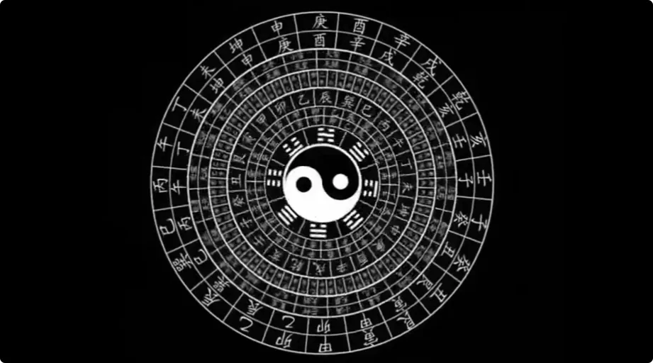
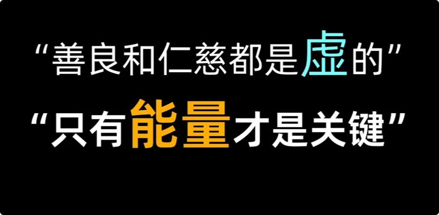
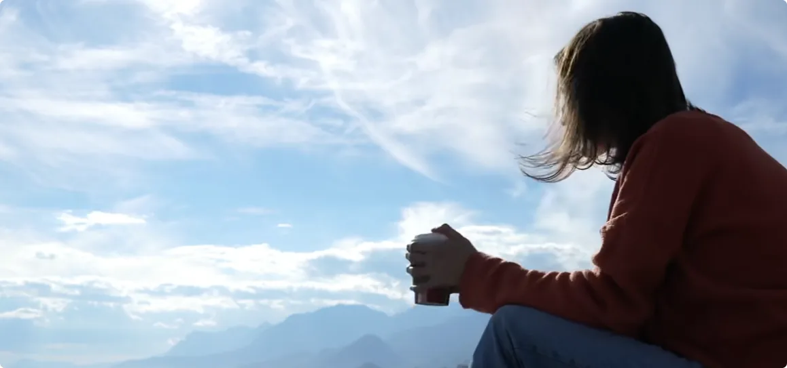

> _**命运就好像一个系统，个体则像蛋壳里的雏鸟。靠自己学会啄破蛋壳，是个体觉醒、成长的必经之路。**_

## 1. 川西遇仙友：一个已经逐渐脱离“人类命运系统”的人

大家好，我是修炼者小烨。今天我来给大家介绍一位**能修改命运的人**。

首先，我本身是一个修炼之人。跟埋头打坐、念经的那些人不一样，我不相信任何宗教。这些年游走四方，偶尔会遇到一两个真正的散修。

今天我要介绍的这位仙友，是一位在修为上已经能够修改命运的人。他跟社会其实已经没有什么牵连，所以身上的各种表象也不再固定受到命理的影响。
比如他的掌纹，这周是一个样，下周可能就变了，**手相已经是浮动的，一般的人类命运已经框不住他了。**

之所以今天想讲“命运”这个话题，主要是因为现在很多人过得非常苦，历经坎坷、饱经沧桑，开始想要了解：

> **修行到底能不能改变自己的命运？**

今天我便借他之口，给大家聊聊修改命运到底是怎么回事。

### 真正的修行人，为什么总是在山野之间

遇到这位仙友的契机，是我去年的川西之行。

因为真正的修行都是穿梭在山野之间，一定不是一直待在同一个地方。这一次碰巧我们在同一座山上，因为感知到了彼此气场都比较干净，所以便知道对方也是同道中人，随之多聊了几句。

他其实挺年轻的，也才三十来岁。

我问他：

> “当初是怎么想到走修炼这条路的呢？”

我本以为他会跟大多数选择修行的人一样，要么是因为人生太坎坷，要么是生来就感兴趣。

结果他说：

> _**“我不想再被人类命运系统给玩弄了。倘若人无法完全按照自己的意思活着，那做人就没有意义。”**_

他曾接触过各种命理大师，结果这些人除了让他**安于命**，都拿不出真正有用的办法。

再后来，他想明白了：

> **与其找这些解答人生的大师，不如自己想想，能跳出命运的办法是什么。**

---

## 2. 离开人类社会后，命理为什么也开始失效

他说，现在的他早已不掺和人类社会什么事了，没有家人，也没有牵挂，平时都是自己在山上过着自己的田园生活。

而且比人类更有灵性、智慧的生灵多的是，万物作伴，也不会觉得孤独。

正因为他和世人没什么联系，所以气场上也不会出现那种连接他人关系的**姻缘线**，身上也不会再出现跟他人、跟社会有关的相。算命先生看了，也要一头雾水。

出于好奇，我问他：

> “所以在真正踏入修炼门槛之前，你能想到跳出命运的办法是什么呢？”

他说，他曾拜读过很多古籍，但是很多都被后来者篡改得面目全非。

> _**真传一句话，假传万卷书。**_

本来写下真相，只需要薄薄一页纸。但是每个贪婪的人都想写下自己的见解，最后书本变得越来越厚，后人寻找真理的难度也越来越高。

他当初也是吃了很多亏，什么不该尝试的都尝试了，最后才悟出那些书里最重要、最关键的那句话：

> **善良和仁慈都是虚的，只有能量才是关键。**

---

## 3. 人为什么很难撼动命运：大能量始终带着小能量运转

紧接着他说，人不可撼动自己的命运，主要因为有**三重枷锁**。

### 第一重：人体的能量场，远小于周围的时空

这个世界的运转，是基于能量运作的。
大能量带动着小能量运转。

怎么运转的呢？抽象地理解，可以表现为五种形式：
- 向外的**生发**；
- 向内的**蕴藏**；
- 向上的**升华**；
- 向下的**浸润**；
- **静止不动**。

不同能量之间又构成了相生、相克的关系。所以当两种不同的能量相接触，就一定会产生催生或者消灭的作用。

而人体作为一个独立的能量场，自然要受周围时空中**比自己更大的能量**影响。

人有好运的时候，那是因为周围世界的能量与自己同频，自己得势；相反，外部能量与自己相克，而它的量级又比人大，自然就会给自己带来灾难。

问题就在于：

> _**人的能量场太小了，所以根本没有选择权，只能随波逐流。**_

---

## 4. 第二重枷锁：弱小的意识必须依附肉身，在轮回中反复重来

其实，人或者任何有灵性的动植物，本质上就是一团**有自我意识的能量**。

刚开始，能量弱的意识需要依附在有形的躯体上。
而那些能量强的意识，知道如何壮大自己的能量场，能够保护好自己，就不需要依附在有形的躯体上了。

所谓灵魂，就是专门为能量弱的意识打造的一副临时外壳，保证它在大多数情况下，不会被外部大环境彻底“干没了”。
肉身死了，可以轮回再来一次。
*一次又一次。*

直到这个个体被外部的大世界反反复复摧残，吃尽了作为弱者的苦，终于知道什么才是真正重要的，开始学习：
1. **如何找到能量；**
2. **如何聚合能量；**
3. **如何完成自身能量体的成长。**

直到能够保护好无形的自己，不再是**象群里的蚂蚁**。
如此一来，人才有资格脱离肉身、灵魂和轮回之苦。

---

## 5. 第三重枷锁：你不仅活在自己的命运里，还活在众生的“大八音盒”中

其实，命运只是一种**能量因果的结算**。
如果把世界上大大小小的能量运作看成是八音盒的齿轮，那么这个世界就是：

> **大八音盒套着小八音盒。**

谁转动了它，谁就必须等待齿轮转完，把音乐听完。
所谓的命数和运势，无非就是：

> **谁拨动了八音盒而已。**

各人有各业，众生有共业。
很多人觉得，自己不种因果就相安无事了。

可是：

> _**他都还在众生的大八音盒里，又怎么会听不到巨大的声响呢？**_

很多人看似在修行，其实根本没有提升自己**扛住大世界能量的能力**，只是自己骗自己罢了。

---

## 6. 为什么真正想改变命运的人，最后反而要放下对“命理”的执念

正是想到这一步，他才放下了对玄学的执念。
因为他知道，能带他找到真正能量的人，一定只有少数。
这个人可能在深山里，可能一辈子都遇不到，也可能必须有机缘才能相见。

但无论如何：

> _**寻找能量的办法，绝对不会出现在书上。**_

为什么？
如果获取能量的办法随随便便就公布于众，那岂不是什么人都能去要？

**错误的人拿到了正确的办法，无疑会打破自然能量的平衡。**

好在最后，仙缘还是给到了他。

他走上了仙道。

在踏入仙门之后，他也终于能够验证自己过去的想法。

现在的他，身上一半以上的寒气已经去除，再等最后的机缘。

以上就是这位仙友的故事。

---

## 7. 普通人真的可以修改命运吗：关键不是预测，而是让自己变强

有人会问：

> **“凡人真的能修改命运吗？真的能逃离这套系统吗？”**

如果你深受“命运”二字困扰，那你一定听过这么一句话：

> _**三分人为，七分天意。**_

冥冥之中，好像我们都听过这个道理。

**个人的主观意愿，仍然是个体发展的关键因素。**

一旦个体哪天领悟了真谛，学会了如何升级自己的能量，摆脱当前时空束缚，那就不必再受世间之苦了。
这句话，是不是逃离命运系统的那群前辈透露给大家的呢？
这是不是世界本源的意思呢？

### 命运像蛋壳，而人必须自己把它啄开

系统就好像**蛋壳**，个体则是里面的雏鸟。

如果一直待在壳里，蛋壳就是整个世界。
它限定了你能够看到什么、接触什么、去往哪里。
但真正的成长，不是等待别人从外面帮你把壳敲碎，而是：

> _**靠自己学会啄破蛋壳。**_

这是个体觉醒、成长的必经之路。
所以，普通人真正想改变命运，重点或许根本不是再找一个算命先生告诉自己未来会发生什么，而是要面对最后两个问题：

> **能修改命运的能量，到底在哪里找？**
> 
> **真正修成的那群少数人，又是怎么脱困的？**

