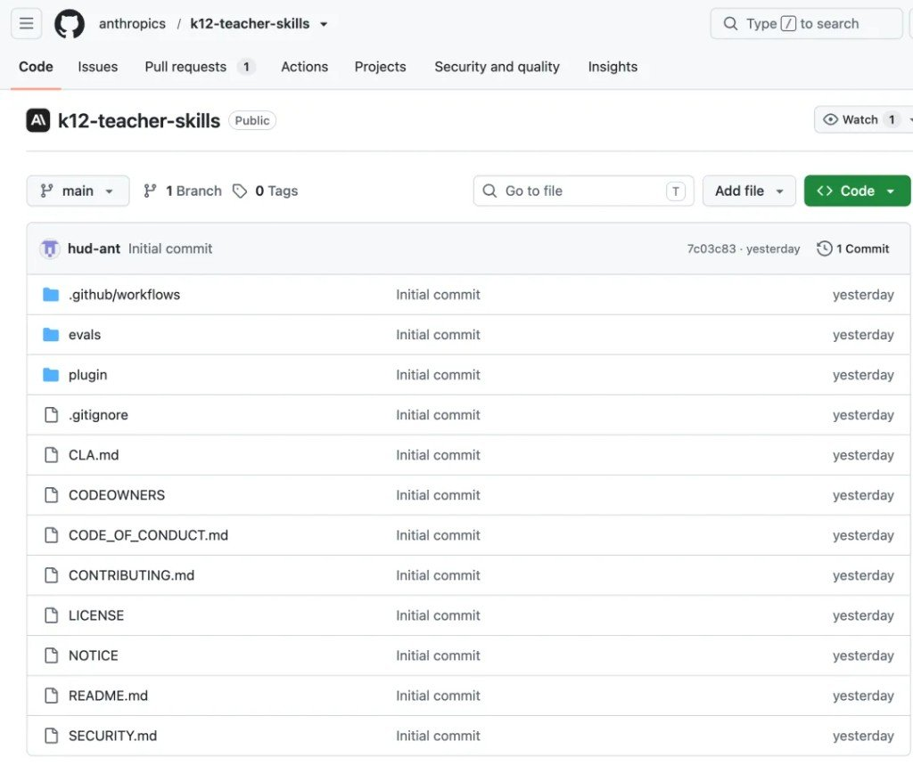
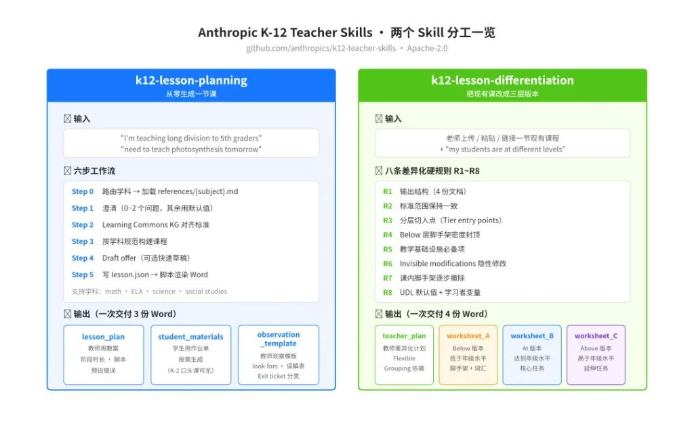
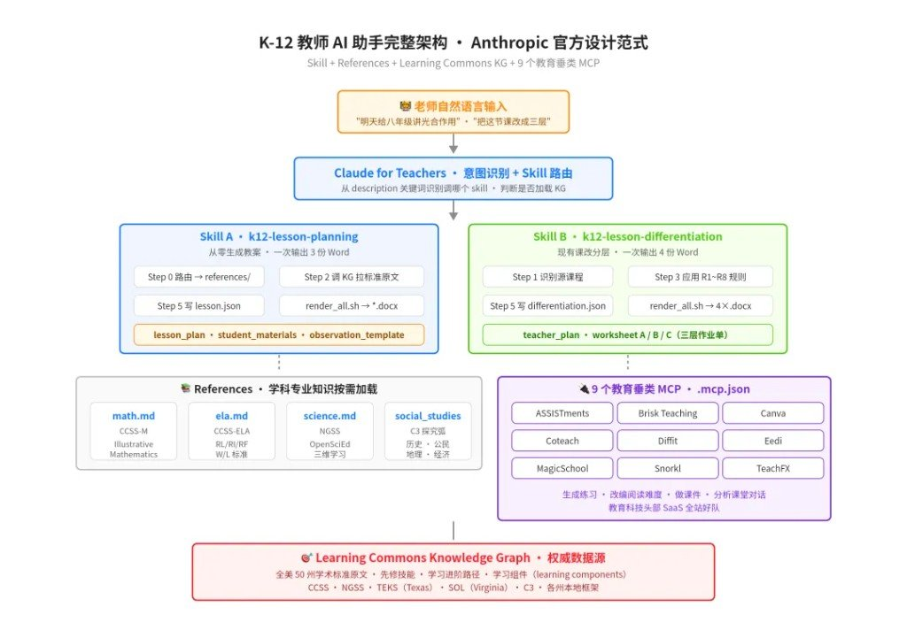

大家好，我是 Ai 学习的老章。

Anthropic 悄悄开了个仓库，叫 [k12-teacher-skills](https://github.com/anthropics/k12-teacher-skills)，把 Claude for Teachers 里两个官方 Agent Skill 的源码整个丢了出来。



我一开始以为就是两个「AI 帮老师备课」的普通 skill，扒完源码之后有点绷不住——Anthropic 这次是亲自下场，把一份生产级 skill 该长成什么样，从心法到工程细节，明明白白摆在你面前了。

做 skill 的人不看一眼真的可惜。

---

## 先钉住定位

Anthropic 联合 Learning Commons 给中小学老师做了两个 Agent Skill，打包在 Claude for Teachers 里跑，同时把源码全开出来了。

两个 skill 分工特别清楚：

| Skill | 干什么 | 一次性交付 |
|---|---|---|
| `k12-lesson-planning` | 从零生成一节课的教案 | **3** 份 Word（教师用教案 + 学生用材料 + 观察模板） |
| `k12-lesson-differentiation` | 拿到一节现成的课，改编成三层版本（低于 / 达到 / 高于年级水平） | **4** 份 Word（教师差异化计划 + 三个分层作业单） |

配套还接了个叫 **Learning Commons Knowledge Graph** 的 Connector，直接对齐学术标准——CCSS、NGSS、TEKS、SOL 一网打尽。

另外 `.mcp.json` 里塞了 **9** 个教育垂类 MCP：ASSISTments、Brisk Teaching、Canva、Coteach、Diffit、Eedi、MagicSchool、Snorkl、TeachFX——教育科技那帮 SaaS 全站好了队。

**为什么值得看：**

- 官方产品原封不动的 skill 源码，不是 demo、不是 tutorial，是真正在跑的东西
- Anthropic 亲自示范怎么处理垂类知识、内容源分离、模板渲染这些工程难题
- 有配套的 `evals/` 目录，连怎么评测 skill 都给你抄好了

---

## 两个 Skill 分别在干嘛

先用一张图看清两个 skill 的分工——左边从零生成一节课，右边把现有课改成三层版本：



### k12-lesson-planning：一句话给我一节课

老师只需要说一句「我明天要给八年级讲光合作用」，这个 skill 就会跑完下面一整套流程：

| 步骤 | 干什么 |
|---|---|
| **Route**（静默路由） | 识别学科（math / ELA / science / social studies），加载对应的 `references/{subject}.md`；这一步不做视为「关键失败」 |
| **Clarify**（澄清） | 最多问 0~2 个关键问题，别的都用默认值 |
| **Ground**（对齐标准） | 如果 Learning Commons KG 接上了，先调 `find_standard_statement` 拉标准原文 |
| **Draft offer** | 让老师选「直接出完整版」还是「先看聊天草稿」，默认走完整版 |
| **Build** | 按学科文件里的规范搭课程结构 |
| **Output** | 写一份 `lesson.json`，跑一个脚本，Word 全部生成 |

最后交付到老师手上的东西是这样的：

| 文件 | 内容 |
|---|---|
| `lesson_plan.docx` | 教师用教案，含 phase 分段、时间分配、脚本、预设错误 |
| `student_materials.docx` | 学生用作业单，只在需要打印时才生成（K-2 口头课就没这份） |
| `observation_template.docx` | 观察记录模板，含 look-fors、误解表、Exit ticket 分类桶 |

Skill 里最狠的一句约束是这个：

> Word 里出现的每一个数字、每一道题、每一个 exit ticket 分类桶，都必须能被老师亲手验算通过。

模型自己算错的答案上课要炸场的，Anthropic 直接把「输出前必须验算」写进硬规则。

### k12-lesson-differentiation：把一节课改成三层

有个通行做法叫 **Tiered Instruction**，同一节课要为不同水平的学生准备不同版本。

这个 skill 干的就是这活。输入是老师现有的一节课（上传 / 粘贴 / 链接 / 命名一个课程库里的课），输出是：

| 文件 | 内容 |
|---|---|
| `teacher_plan.docx` | 教师差异化计划，含每层学生的切入点、Flexible Grouping 依据 |
| `worksheet_group_a.docx` | Below（低于年级）版本作业单 |
| `worksheet_group_b.docx` | At（达到年级）版本作业单 |
| `worksheet_group_c.docx` | Above（高于年级）版本作业单 |

三个版本干同一件事、用同一段材料、给同一份 exit ticket，只在脚手架密度和延伸问题上有差异——这套设计学名叫 **Tomlinson 差异化框架**。

#### 硬规则 R1–R8（要点）

图面上八条硬规则一览；作者后文展开了其中几条最有意思的：

| 规则 | 要点 |
|---|---|
| **R1** | 输出结构固定为 4 份文档 |
| **R2** | 各层标准范围必须一致（不能偷换学习目标） |
| **R3** | 各层切入点（tier entry points） |
| **R4** | Below-tier 脚手架密度封顶——支架太多反而变成依赖的拐杖 |
| **R5** | 教学基础设施必选项（instructional infrastructure essentials） |
| **R6** | Invisible modifications——作业单不能暴露学生「在哪一层」 |
| **R7** | 渐进脚手架——课内 Task 1→2→3 逐步撤支架 |
| **R8** | UDL 默认值 + learner variables——没提障碍也默认配 sentence supports / 词汇表 |

作者挑几条最有意思的展开：

- **R6：Invisible modifications** —— 学生看到的作业单不能暴露自己是「哪一层」，Group A/B/C 只用组名，绝不能出现 Scaffolded / Guided / Independent 这种词
- **R7：渐进脚手架** —— 一节课内 Task 1 有脚手架、Task 2 更轻、Task 3 撤掉，让学生逐步独立
- **R4：Below-tier 脚手架密度封顶** —— 支架太多反而变成学生依赖的拐杖，Anthropic 直接写死了密度上限
- **R8：UDL 默认值** —— 老师没提学习障碍时，默认所有层都配 sentence supports 和词汇表，符合通用设计原则

特别戳人的一段设计哲学：

> 学生页面上不允许出现任何教学术语，「CER」要写成 Claim / Evidence / Reasoning，「sensemaking check」要改成 "Check your thinking"，「scaffold / tier / differentiation」这种词学生一个都看不到。

老师的话是给老师说的，学生的话是给学生说的，两套语言严格分离——这种颗粒度的规范，估计是 Anthropic 和 Learning Commons 一起坐下来磨了不知道多少版。

---

## 三个惊艳设计，做 Skill 的人务必抄一遍作业

看完源码，作者把它当 skill 工程学的教材反复读了两遍，扒出三个可以直接抄作业的设计。

### 设计一：JSON-driven 内容源分离

这个 skill 完全不让 LLM 直接生成 Word 文档。做法是这样：

```text
LLM 写 lesson.json（内容源）
    ↓
bash scripts/render_all.sh lesson.json $OUTPUT_DIR
    ↓
Word 文档（渲染产物）
```

`lesson.json` 只有两个顶层字段：

| 字段 | 作用 |
|---|---|
| `shared` | 内容注册表：题目、标准原文、词汇表、误解表——但凡在多个文档出现的内容，只在这里写一次，起个 key（比如 `t1`、`stamp_act_petition`、`prices_table`） |
| `documents[]` | 文档数组，每个文档用 `{"type": "from_shared", "key": "t1"}` 引用共享内容 |

这样做的好处直接爆炸：

- 老师改一个题目数字，`shared` 改一处，所有 4 份文档同步刷新
- 三层作业单的核心任务文本永远一模一样（R6 从架构上保证）
- Word / HTML / JSON 一次全出，格式绝不漂移

Anthropic 甚至在 SKILL.md 里明确警告：

> Do not open, cat, head, or grep the renderer scripts —— 脚本行为已经在文档里完全规定清楚了，读源码只会分散注意力。

意思很直接：LLM 你别去研究渲染引擎，专心把 JSON 写对就行。

很多自研 skill 都栽在 LLM 越权尝试理解一切；Anthropic 官方是明确告诉模型「不该看的别看」。

### 设计二：学科 references 按需加载

这个 skill 里最重要的目录不是 `SKILL.md`，是 `references/`：

```text
plugin/skills/k12-lesson-planning/references/
├── math.md                 # 数学教学法 + IM 课程结构
├── ela.md                  # 英语语言艺术教学法
├── science.md              # NGSS + OpenSciEd 三维学习
├── social_studies.md       # 历史/公民/地理/经济 + C3 探究弧
├── learning-commons-kg.md  # KG 调用规范
├── example_lesson.json     # 完整可运行示例
└── NOTICE
```

每个学科几十 KB 的教学法专属规范，包含课程分段结构、非商量选项（non-negotiables）、和 `lesson.json` 的映射。

Skill 主文件只做一件事：**路由**。

看到 math → 加载 `math.md`，看到 science → 加载 `science.md`，加载完就把 references 当成本轮完整指令来跑。

这套结构解决了 skill 工程的核心矛盾：你既想覆盖多个垂类，又不想把所有专业知识塞进一个巨大的 `SKILL.md` 让模型看瞎。

按需加载既控制了 context 长度，又让每个学科的规范可以独立演进——数学专家改 `math.md`，理科专家改 `science.md`，互不干扰。

### 设计三：Density rules 和语言规范

做 skill 最常翻车的地方，就是输出物看起来「太 AI 味」——一堆并列排比、一段接一段长句、把简单事情说得像论文。

Anthropic 的做法是把可读性直接写成硬约束：

- 一个段落 / labeled 块最多 **3** 句，超了就拆、就列、就上表格
- 列表项是 fragment，一句一想法、≤ **15** 词、绝不用分号连缀从句
- 平行的分层内容（三个 tier 做同一件事）必须用一个 table 块，行 = 阶段、列 = 层级、每格 ≤ **25** 词，绝不能用三段并列长文
- 一段连续散文超过半页就必须重构（拆表格、拆列表、拆成两节）
- 标准原文只允许在 `target-standard` callout 里逐字出现一次，其它地方引用只写代码 + 十词以内的要点

还有专门的 **Copyright guardrail**：如果参考了 IM（Illustrative Mathematics）或 OpenSciEd 这类现有课程，绝不能逐字复制学生用文本、教师笔记、探究提示——只能借鉴结构，原创措辞。

再看一眼这份 SKILL.md 的语言，就明白 Anthropic 内部对「AI 内容质量」有多严格。

---

## 集成能力：不只是备课工具

先给一张完整的架构图——这个仓库到底把哪些东西连起来了，看这一张就够：



这个仓库最容易被忽略的部分，是 `.mcp.json`。

它提供了 **9** 个教育垂类 SaaS，全都以 HTTP MCP 的形式接进来。老师在 Claude 里可以直接调 MagicSchool 生成练习、调 Canva 做课件、调 Diffit 改编阅读难度、调 TeachFX 分析课堂对话。

再叠加 Learning Commons Knowledge Graph connector，Claude 拿到的信息量是：

- 每一条教育标准的原文
- 每条标准的先修技能 / 学习进阶路径
- 每条标准对应的具体学习组件（learning components）

给老师一个 prompt，Claude 就能自动路由到对的 MCP、拉对的标准、生成对的产物。

教育垂类的 AI 落地，Anthropic 用这个仓库演示了一遍完整解法：

> **Skill（专业工作流） + References（垂类知识） + MCP（第三方能力） + Connector（权威数据源） = 一个真正能替代半个备课组的助手**

---

## 怎么用起来

如果你是 Claude for Teachers 用户，两个 skill 已经默认装好了，直接对话就行。

如果不是，用 Claude Code 也能装：

```bash
git clone  github. com/anthropics/k12-teacher-skills
claude plugin marketplace add ./k12-teacher-skills/plugin
claude plugin install k12-teacher-skills@k12-teacher-skills
```

> `git clone https://github.com/anthropics/k12-teacher-skills`

装完之后，只要说一句话就能触发：

| 例句 | 触发 |
|---|---|
| `"I'm teaching long division to 5th graders"` | lesson-planning |
| `"need to teach photosynthesis tomorrow"` | lesson-planning |
| `"my students are at different levels"` | lesson-differentiation |
| `"adapt this lesson for below and above grade"` | lesson-differentiation |

description 里对触发条件的定义细致到什么程度：

> "A new lesson that asks for differentiated, tiered, or leveled materials is still ONE planning request —— this skill produces those materials inside the lesson package; do not also invoke k12-lesson-differentiation"

Anthropic 甚至在 skill 描述里直接告诉模型：新课要分层不要重复调用另一个 skill——把 skill 之间可能的冲突都提前写死了。

---

## 对中文教育场景能不能用

有老师问：这套东西国内老师能用吗？

作者的判断分三档：

1. **底层设计能借鉴**：JSON-driven 内容源分离、references 按需加载、density rules、师生语言分离——这些都是语言无关的工程模式，中文语文数学老师完全可以复用
2. **或者国家中小学智慧教育平台**[^cn-gap]
3. **MCP 生态要建**：中国目前还没有 MagicSchool、Brisk Teaching、Diffit 这种规模的教育垂类 MCP，谁先在国内做起来这一层，谁就是中国的 Claude for Teachers

有做教育 AI 的老板可以认真看看这个仓库，路径已经很清楚了。

[^cn-gap]: 原料自称「分三档」，粘贴到第二档时仅残留「或者国家中小学智慧教育平台」一句，前后句缺失；此处**不脑补**完整表述，待补原文 permalink 后再补齐。

---

## Anthropic 开源这两个 skill 到底想干嘛

表面：给全美老师一份产品级 AI 备课工具。

深层：给整个 skill 开发者社区上一堂公开课——生产级 skill 应该长什么样。

这个仓库里能学到的东西，比 Anthropic 官方 skill 教程文档还多：

| 能抄走的 | 对应做法 |
|---|---|
| 垂类知识 | `references/` 按需加载 |
| 多文档一致 | JSON-driven + `shared` 引用 |
| 输出质量 | density rules + copyright guardrail |
| 触发条件 | description 写得像法律条文 |
| MCP / Connector | `.mcp.json` + KG 调用规范 |
| 评测 | `evals/` 目录里有完整框架 |

作者给这个仓库 **95** 分，扣 5 分是因为 SKILL.md 写得太密、初读上手门槛偏高，但每一句都是干货。

做 skill 的老板务必去 clone 一份，把两个 SKILL.md 逐字读完——读完 30k 字胜过看 30 篇教程。

---

## 跟旁边几篇别搅成一锅

| 旁链 | 它管啥 | 别跟本篇混的原因 |
|---|---|---|
| [不会写代码也能搭 Agent：Skills 按这七格收](../2026-08-10_Skills文件结构七目录/不会写代码也能搭Agent：Skills按这七格收.md) | Skills 目录怎么收纳 | 通用文件夹约定 ≠ 本仓教育垂类官方源码 |
| [一张图看懂：MCP、Skills、CLI](../2026-08-10_MCP_Skills_CLI三者关系/一张图看懂：MCP、Skills、CLI.md) | 连接 / 方法 / 执行三件套 | 概念选型卡 ≠ K-12 产品架构拆解 |
| [Awesome-AI-Skills / yichen-skills22](../2026-08-10_Awesome-AI-Skills_yichen-skills22/) | 社区技能清单 | 索引向；本篇是单仓深拆 |
| [Agent 工程 20 概念 · 运行机制篇](../2026-08-10_Agent工程20概念_运行机制篇/) | Agent 运行机制词表 | 概念层；本篇是可 clone 的生产源码 |
| [Claude Code 自动化十大 Skill](../2026-08-10_ClaudeCode自动化十大Skill/) | CC 自动化刀架 | 开发者工作流 ≠ 教师备课垂类 |

高度同构才合并；本篇是 Anthropic 教育产品官方源码拆解，**新建不硬并**。

---

## 附录：评论区择要

| 谁 | 说啥 | 入档要点 |
|---|---|---|
| 田芮溪 | 别的模型可以用吗？ | 作者答：**skills 不挑模型**；另有评论「如果不能用，那是模型的问题」 |
| 盐伟 / 陈九书 / 仨字名… | 开源安不安全 | 开源可审；不展开站队 |
| 人文珞珈山 | 自搓语文学伴/数学学伴 vs 官方 | 自认小巫见大巫——侧面印证本仓工程密度 |

评论区其余空评 / 表情不入档。
