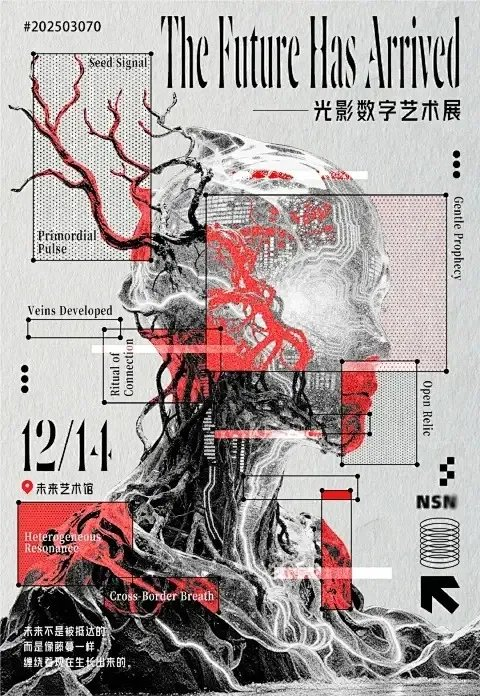
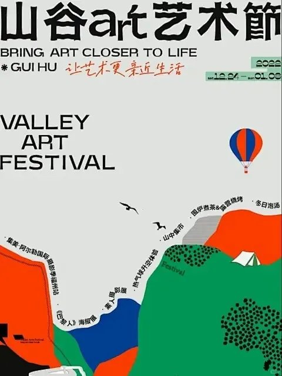
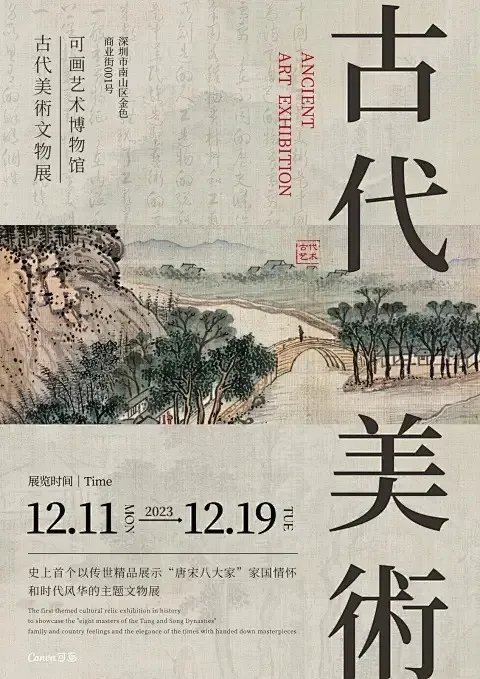
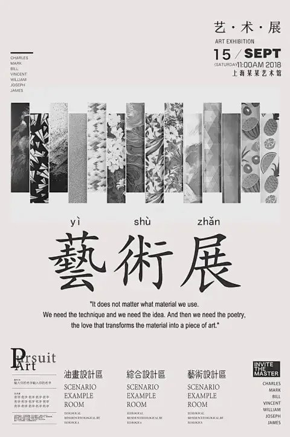
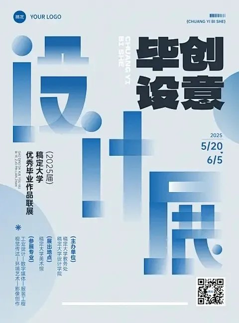

进美术馆之前，多数人先撞上的是海报——门口、朋友圈、地铁灯箱。海报不是说明书附件，是展览递出去的第一张名片：三秒里要让人感到「这展大概什么调性」。

下面按图鉴拆九种版式思路。首图是九宫格总览；后文一张一张对着单海报看。图上可见的展名 / 机构名照录，未见署名的不硬补作者。

九格并排放，差异一眼就出来：有的靠赛博标注拆主体，有的靠书法叠层，有的干脆把场地画成地图。招数不同，但每张都在回答同一件事——**这张脸，配不配得上这场展**。

---

## 1. 光影数字艺术展 —— 赛博拼贴解构

主视觉是机械感人像侧脸，红线框、测量线、英文标注（Seed Signal、Veins Developed 一类）把主体拆成「可分析的零件」。右上 condensed 衬线英标题 *The Future Has Arrived*，中文副题「光影数字艺术展」压在下面；日期 12/14、地点「未来艺术馆」用大号数字钉住信息层。

适合数字艺术、科技向个展：信息密度高，但不靠堆特效，靠**解构标注**把「未来感」落到版式上。

---

## 2. 《万木正春》毕业展 —— 书法叠层

上半段留白清爽：英文字母标题 COLLEGE OF ART AND DESIGN GRADUATION EXHIBITION 与竖排中文机构信息并列；下半段绿底上，「万木正春」大字用淡墨/淡彩底笔触 + 实笔黑字叠两层，字既是标题也是主视觉。

毕业展常见两难：要学院信息完整，又要有作品气质。书法叠层把「写」本身做成展品语言，信息栏退到上下边缘，不抢笔势。

---

## 3. 山谷 art 艺术节 —— 扁平手绘地图

灰底大面积留白，底部红 / 绿 / 蓝 / 橙色块拼成山形「地图」；活动名沿山脊曲线走（摄影季、海报展、热气球、山中集市……）。上方「山谷art艺术节」+ BRING ART CLOSER TO LIFE，热气球和帐篷当图标锚点。

户外艺术节、市集、驻地项目吃这套：海报同时是**导览缩略图**，读者扫一眼就知道「去了能玩什么」。

---

## 4. 《如来如去》—— 肌理油画底 + 竖向错落

整张几乎是暗色油画肌理底。白字竖排错落：右侧大字「如来如去」带横向残影/快门感，旁侧 *Tathāgata*、展名「金耕「上海」作品展」等竖栏并置；日期 08 13 —— 09 04 顶左放大。图上可见策展人单增、管午画廊（XU GALLERY）等落款。

当代绘画个展常用这招：**让画面材质当版式底**，字只做层叠阅读路径，少画框感、多作品感。

---

## 5. 东方美学 —— 国风扁平 + 八角窗

米色底，中央浅蓝八角窗框住扁平盆景松与远山；标题「东方美学」上方拼音 DONG FANG MEI XUE，周围散落「中式美学」「经典之作」等标签框，底栏日期 2025.07.20。

新中式活动海报的稳妥配方：传统窗棂当取景器，插画保持扁平，信息用气泡/色带点缀——文化符号在，但不堕成仿古描红。

---

## 6. 《无象之境》—— 图文上下分割

上半灰底纯文字：大写 EXHIBITION、当代艺术展、主标题「无象之境」、地址与日期 2024.05.20；下半整幅风景油画出血，水色微微渗进上栏，软接缝。底缘可见指导 / 出品单位字样。

最「博物馆官网」的一种：信息区干净、作品区完整。适合作品本身够强、不必再用花活抢戏的当代展。

---

## 7. 古代美术文物展 —— 传统东方竖排

仿旧纸底，隐约草书纹理；中部横窗嵌山水画，右侧竖排大字「古代／美術」，英文 ANCIENT ART EXHIBITION 竖红细字陪跑；底部日期与馆方信息横排收束。

文物展、书画文献展的经典站位：竖排扛文化重量，横窗当「展柜切片」，现代信息落在底栏，古今分层清楚。

---

## 8. 黑白艺术展 —— 横向材质拼贴

浅灰底，中上一条由十余根高低不一的竖条拼成的材质带（大理石、植物纹、网点、几何……）；其下居中大字「藝術展」+ 拼音，再下一则英文短引谈材料与诗意。顶栏日期地点、底栏分区与名单用网格收纳。

严格黑白 + 横向材质节奏，气质接近网格系统那一路——偏理性、偏「国际印刷品」。和瑞士国际主义同场时可对照看，**主题仍是展览名片，不是网格教科书**，勿硬并。

---

## 9. 创意毕设展 —— 几何字体构成

浅冷蓝底，半透明圆与几何块叠出「设 / 计」结构感；「毕设」「创意」「展」字号层级拉开，字本身就是图形。日期、院校、专业列表、二维码贴在边缘，不进主形。

设计类毕业联展常见选择：用字体构成宣告「我们在做设计」，比再贴一张作品拼贴更干净。

---

## 没有标准答案，调性统一就够

九种招式并不是九道必背公式。赛博解构配数字展、书法叠层配学院毕业展、手绘地图配山谷艺术节——成立的原因都是**版式调性跟展览主题咬合**。

反过来也成立：把八角窗硬套进赛博数字展，或把材质拼贴条塞进山水文物展，招式再漂亮也像穿错衣服。

审美积累记这一句就够：先问这场展要递出去什么脾气，再选版式语言；统一服务于主题，比堆技巧安全。

