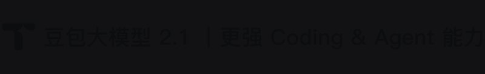
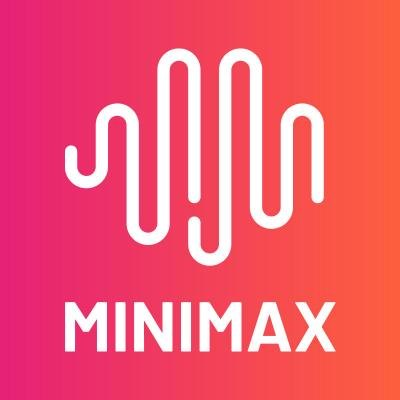
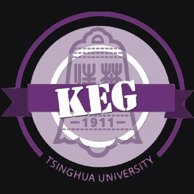
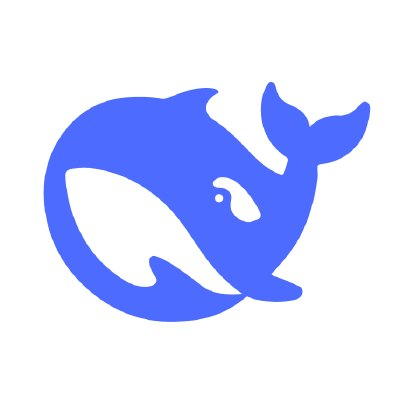
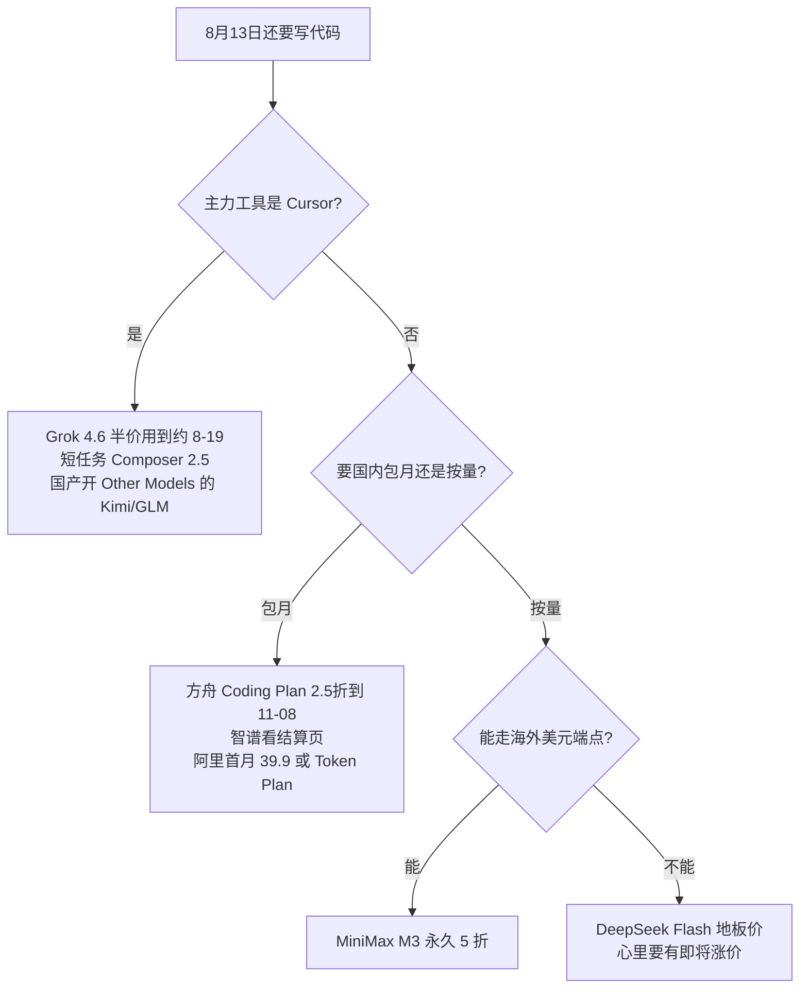

数字都是 **2026-08-13** 对着官网核的。价格会改，优惠会过期，过期活动单独标了「已结束」。别拿上周截图对这周账单。

这周窗口很窄。Cursor 的 Grok 4.6 刚在 8 月 12 日开了一周 50% 首发折扣；**方舟 Coding Plan 2.5 折用到 11 月 8 日**（Lite 9.9 / Pro 49.9）；Qoder 周年赠 800-2000 次 3.8-Max 调用领到 **9 月 3 日**。通义 Qoder 里 Qwen3.8-Max-Preview 的 1 折已经在 **8 月 3 日**关掉。DeepSeek 官方定价页还写着「计划近期整体上调 API 定价，预计涨幅较大」。

API 价默认按 **每百万 tokens** 写。人民币写 ¥，美元写 $，不互相换算当账单。Coding Plan 是包月积分 / 次数，不是把 API 单价乘个折扣那么简单。

*图：火山引擎豆包产品页主视觉。来源：[volcengine.com/product/doubao](https://www.volcengine.com/product/doubao)（2026-08-13 抓取）。版权归字节跳动 / 火山引擎。*

## 先分清你在付哪一层钱

同一家模型，进不同工具，账单完全不是一回事。

| 层 | 你在买什么 | 典型入口 | 坑 |
|---|---|---|---|
| 官方 API 按量 | input / output / cache | 百炼、方舟、智谱开放平台、Kimi Platform、MiniMax PayGo、DeepSeek 官方 | 长 Agent 一轮就能把输出打满 |
| Coding Plan / Token Plan | 固定月费 + 5 小时 / 周额度 | 阿里百炼 Coding Plan、智谱 GLM Coding Plan、MiniMax Token Plan、火山 Agent/Coding Plan | **禁止当通用 API**；Key 前缀和 Base URL 用错会按量扣费 |
| IDE 自有池 | 订阅里的「含用量」 | Cursor Models（Grok / Composer）、Trae Basic usage、Copilot AI Credits | 国产模型 **进不了 Cursor Models 池**；Kimi / GLM-5.2 可以进 **Other Models** |

Cursor 文档把池子拆成两块：[Models & Pricing](https://cursor.com/docs/models-and-pricing)（核对 2026-08-13）。**Cursor Models** 现在是 Grok 4.5、Grok 4.6、Composer 2.5（Composer 基座是 Moonshot Kimi K2.5，但选择器里不是 Kimi）。**Other Models** 除了 Claude / Gemini / GPT，还挂了 **Kimi K2.7 Code**（$0.95 / cache $0.19 / $4）、**Kimi K3**（$3 / $0.30 / $15）、**GLM 5.2**（Z.ai，$1.4 / $0.26 / $4.4，默认隐藏）。这三档和对应国际 API 标价一致，从 Pro 起的 Other Models 含用量里扣。Qwen、豆包、MiniMax、DeepSeek **仍不在官方表里**，要 BYOK / 各家 Coding Plan 自定义端点。印度 Start 计划 Other Models 为 $0，这三档也用不了。

## 一张表看完：厂商 × 模型 × API 价 × 工具 × 优惠

价格均为官网原价（或官网标明的永久折扣价）。「仍有效」相对 **2026-08-13**。

| 厂商 | 最新相关模型 | API 价（/M tokens） | 编程工具怎么进 | 相对 8-13 的优惠 |
|---|---|---|---|---|
| 阿里 通义千问 | qwen3.8-max | 北京 ¥12 / ¥36 / 隐式命中 ¥1.5；新加坡国际 **$2 / $6** / 隐式 $0.25 | Qoder CN、百炼 **Token Plan**（含 3.8-max）、Qwen Code。**Coding Plan 白名单没有 3.8-max** | Preview 1 折 **已结束**。Qoder 周年赠 800-2000 次调用领到 **9-03**。Token Plan 夜间 22：00-08：00 Credits **5 折**（页上无结束日） |
| 阿里 通义千问 | qwen3.7-plus（≤256k） | ¥2 / ¥8 / 缓存命中 ¥0.4 | Coding Plan 白名单推荐；Qoder | 百炼价目表仍标 **限时 8 折**（无结束日，以控制台为准） |
| 阿里 通义千问 | qwen3-coder-plus（≤32k） | ¥4 / ¥16 / 缓存命中 ¥0.8 | 同上 | 更长上下文分档涨价，256k-1M 输出到 ¥200 |
| 字节 豆包 | Doubao-Seed-Evolving | ¥6 / ¥30 / 命中 ¥1.2；缓存存储 ¥0.017/M/小时。AI Hub 上下文 **256k** | Trae 内置；方舟 Coding Plan 接 Cursor（须 Pro+）/ Cline / Claude Code。**Copilot / Continue 官方未列** | **方舟 Coding Plan 2.5 折至 2026-11-08**：Lite **¥9.9**（刊例 40）、Pro **¥49.9**（刊例 200），最多首两月。豆包 App 学生特惠是 C 端，别混 |
| 字节 豆包 | Seed-2.1-pro / turbo | pro ¥6/¥30/命中 ¥1.2；turbo ¥3/¥15/命中 ¥0.6 | Coding Plan 文档点名的 Doubao 是 **2.1-turbo、2.0-lite**，不是 Evolving | 每模型 50 万免费 tokens（产品页仍展示） |
| MiniMax | M3（≤512k，永久 5 折） | **$0.30 / $1.20 / cache read $0.06**（划线 $0.60/$2.40/$0.12） | MiniMax Code、Token Plan、Trae 国际内置、OpenRouter；Cursor 仅 BYOK（文档要求 Pro+） | **永久 5 折**。推荐返佣 10% 至 **8-31**。OpenRouter 展示价常更低（抓取时 M3 约 $0.24/$0.96），对账分渠道 |
| MiniMax | M2.7 | $0.30 / $1.20 / cache read $0.06 / write $0.375 | 同上 | highspeed 输入输出加倍 |
| Kimi / Moonshot | K3 | 中国站 ¥2 / ¥20 / ¥100；国际站 **$0.30 / $3 / $15** | Cursor / Copilot Other Models 原生（国际价）；Kimi Code；Cline | 中美两套账。K2.5 与 moonshot-v1 **8-31 下线** |
| Kimi / Moonshot | K2.7 Code | 中国站 ¥1.30 / ¥6.50 / ¥27；国际站 **$0.19 / $0.95 / $4** | 同上；百炼托管中国站同档 | 仅思考模式。HighSpeed 为标准价 **2×**。Cursor 价目无高速版 |
| 智谱 GLM | GLM-5.2 | 国内 ¥8 / ¥28 / 命中 ¥2；国际 / Cursor **$1.4 / $0.26 / $4.4** | Cursor Other Models（默认隐藏）；Coding Plan；ZCode；Trae 中国 | 订阅页仍展示包季 8 折 / 包年 7 折；新闻写至 8-15，**官方 docs 无此截止日**。ZCode 1.5 倍至 **8-31**（IT之家 8-11） |
| 智谱 GLM | GLM-4.7-Flash | **免费** | 开放平台 API | 免费档，别和 Coding Plan 积分混为一谈 |
| DeepSeek | V4-Flash（Flash-0731） | 英 **$0.0028 / $0.14 / $0.28**；中 **¥0.02 / ¥1 / ¥2** | 官方 API、Cline、Trae 中国内置、百炼 Token Plan。Cursor / Copilot **无原生** | 官方 API 只卖 V4。预告近期大幅上调。夜间错峰 **2025-09 已取消** |
| DeepSeek | V4-Pro（Pro-0813） | 英 **$0.003625 / $0.435 / $0.87**；中 **¥0.025 / ¥3 / ¥6** | 同上 | 硅基流动中英站点与模型页互相打架，下单前打开控制台 |
| Cursor（对照） | Grok 4.6 Standard / Fast | $2/$0.50/$6 ；Fast $4/$1/$12 | Cursor Models 池 | **8-12 起一周 50% 首发折扣，8-13 仍有效，约到 8-19** |
| Cursor（对照） | Composer 2.5 Standard / Fast | $0.50/$0.20/$2.50 ；Fast $3/$0.50/$15 | Cursor Models 池 | 无首发折扣声明 |
| Cursor（对照） | Grok 4.5 Fast | 总表 **$4/$1/$18**；专页表 **$4/$1/$12** | Cursor Models 池 | **口径冲突，见文末** |
| Cursor Other Models | Kimi K2.7 Code / K3 | **$0.95/$0.19/$4** ；**$3/$0.30/$15** | 原生，默认隐藏 | 等于国际 API，≠ 中国站 ¥ |
| Cursor Other Models | GLM 5.2 | **$1.4 / $0.26 / $4.4** | 原生，默认隐藏；Fireworks | 等于 Z.AI 国际价 |

## 阿里：旗舰按量不便宜，便宜的是套餐和已经结束的 1 折

*图：QwenLM GitHub 组织头像。来源：[github.com/QwenLM](https://github.com/QwenLM)。版权归阿里云 / Qwen 团队。*

qwen3.8-max 是现在的旗舰卡：2.4T MoE，1M 上下文，Function Calling、视觉、联网、前缀续写、上下文缓存都在模型页能力表里。华北 2（北京）原价 **¥12 / ¥36**，隐式缓存命中 ¥1.5，显式缓存创建 ¥15、命中 ¥1。[模型页](https://help.aliyun.com/zh/model-studio/qwen3-8-max)写得很清楚：文档只给原价，限时优惠去百炼控制台看。Batch File 半价，缓存折扣和 Batch **不能叠**。

日常写代码更常摸到的是 qwen3.7-plus：**≤256k 为 ¥2 / ¥8 / 命中 ¥0.4**，超过 256k 跳到 ¥6 / ¥24。[qwen3.7-plus](https://help.aliyun.com/zh/model-studio/qwen3-7-plus) 同样 1M 上下文。百炼总价表 8-13 仍标它 **限时 8 折**、qwen3.7-max **限时 5 折**，都没写结束日，以控制台实扣为准。代码专用 qwen3-coder-plus 按输入长度分四档，短上下文 **¥4 / ¥16**，拉到 256k-1M 输出直接 **¥200 / M**，长仓库硬塞全上下文会很疼。[coder-plus](https://help.aliyun.com/zh/model-studio/qwen3-coder-plus) 没有官方独立型号叫 `Qwen3.5-Coder`，那是模型自报名，真实 ID 是 `qwen3.5-plus` 或 `qwen3-coder-plus`。

编程工具侧，通义灵码已经并进 **Qoder CN**。个人专业版 **¥59/月**、2000 credits（[计费说明](https://help.aliyun.com/zh/lingma/product-overview/billing-description)）。Qoder 里那波「Qwen3.8-Max-Preview 限时 1 折」官方写明：**2026-07-19 至 2026-08-03 10：00**，**已结束**。[旧活动页](https://help.aliyun.com/zh/lingma/qwen3-8-max-preview-limited-time-offer)

还在窗口里的是周年赠次：[docs.qoder.cn/events/qwen-max](https://docs.qoder.cn/events/qwen-max.md) 写新注册 / 老付费 **800 次**，活动期下单再 **2000 次**，领取到 **2026-09-03 23：59**，次数用到 **09-30**。3.8-Max 错峰倍率中国站标准 1x、错峰 0.5x（国际站 0.5x / 0.25x，中英不是同一套）。

真正按月封顶的是百炼两套互不迁移的计划：

**Coding Plan** [概述页](https://help.aliyun.com/zh/model-studio/coding-plan)：现售 **Pro ¥200/月**（国际 $50），5 小时 6000 次 / 周 45000 / 月 90000。新客首月 **¥39.90**。白名单是精确字符串：qwen3.7-plus、qwen3.6-plus、kimi-k2.5、glm-5、MiniMax-M2.5、qwen3.5-plus、qwen3-coder-plus/next、glm-4.7 等。**没有 qwen3.8-max / qwen3.7-max。** Key 必须 `sk-sp-`，Base URL 含 `coding.dashscope.aliyuncs.com`。Lite 已停售。首次续费 5 折 **2026-04-01 已结束**。

**Token Plan 个人** [概述](https://help.aliyun.com/zh/model-studio/token-plan-personal-overview)：早鸟 Lite **¥39** / Standard **¥139** / Pro **¥499**（划线 60/180/600）。模型含 **qwen3.8-max**、DeepSeek-V4、glm-5.2，**不含 coder-plus**。3.8-max 夜间 22：00-08：00 Credits **5 折**（页上无结束日）。

Cursor / GitHub Copilot 官方托管列表里没有千问。Cline、Claude Code、Qwen Code 用 Coding Plan 或 Token Plan 才是正路。Token Plan 文档写「适配 Cursor」，走的是套餐网关，不是 Cursor 原生模型表。

## 字节：方舟按量中等偏贵，学生折扣别写进 Trae 账单

*图：豆包产品 logo。来源：[火山引擎豆包产品页](https://www.volcengine.com/product/doubao)。版权归字节跳动。*

[产品页](https://www.volcengine.com/product/doubao)（核对 2026-08-13）把文本推理主推三档写在明面上：

- **Doubao-Seed-Evolving**：¥6 / ¥30 / 缓存命中 ¥1.2
- **Doubao-Seed-2.1-pro**：同样 ¥6 / ¥30 / ¥1.2
- **Doubao-Seed-2.1-turbo**：¥3 / ¥15 / ¥0.6

缓存存储都是 **¥0.017 / 百万 tokens / 小时**。Evolving 的卖点是统一 Model ID、对着 Coding & Agent 持续升级（[Seed-Evolving](https://www.volcengine.com/docs/82379/2549861)）。AI Hub 卡片写上下文 **256k / 最大输出 256k**，和社区「1M」不是同一口径，**采信 AI Hub**。价目总表（[1544106](https://www.volcengine.com/docs/82379/1544106)）2026-08-12 更新但是 JS 页，正文抽不出；按量数字以产品页 / AI Hub 为准。

TRAE 企业版价目还单列了 **Doubao-Seed-2.0-Code**（≤32k **¥3.2 / ¥16 / 命中 ¥0.64**，更长输入分档到 ¥9.6/¥48）和更老的 **Doubao-Seed-Code**（≤32k **¥1.2 / ¥8**，缓存列为空）。[enterprise_billing-items](https://docs.trae.cn/enterprise_billing-items) 2.0-Code 三档和扣子里的 `doubao-seed-2.0-pro` **同价不同名**，调用前对控制台 ID。

能力上，方舟有 Function Calling、**GUI Agent**（不是 OpenAI Computer Use 商标）、视觉 Grounding。Trae 国际站内置 **Seed-2.1-Turbo**，USD 刊例 **$0.50 / cache $0.10 / $2.50**（[docs.trae.ai/ide/models](https://docs.trae.ai/ide/models)），和国内 ¥3/¥15 **不是同一张表**。中国站 TraeCode 内置 Seed-2.1-Pro（Pro 档起）、Turbo、Seed-Code。

**写代码别再把「9.9 元」当成小道消息。** 方舟 [Coding Plan 2.5 折](https://www.volcengine.com/docs/82379/2525065?lang=zh) 写明：**2026-06-08 至 2026-11-08**，Lite 刊例 ¥40 → **¥9.9**，Pro ¥200 → **¥49.9**，最多首两个月，第三月原价；可与邀请 **9.5 折**叠加（邀请活动至 **2026-11-19**，[2479140](https://www.volcengine.com/docs/82379/2479140?lang=zh)）。落地页：[ai.volcengine.com/activity/codingplan](https://ai.volcengine.com/activity/codingplan)。官方接入：Cursor（**须 Pro 及以上**自定义模型）、Cline、Roo、Kilo、Claude Code、TRAE（服务商选「火山引擎 Plan」）。Coding Plan 文档点名的 Doubao 是 `doubao-seed-2.1-turbo`、`doubao-seed-2.0-lite`，**没写 Evolving / 2.1-pro**。Agent Plan 落地页仍写「9.9 元起」，规则正文未抽出完整日期，和 Coding Plan 不是同一张 SKU。

Trae 中国站套餐这次从文档抽出了：[ide_plans-and-billing](https://docs.trae.cn/ide_plans-and-billing.md) Lite **¥49** / 连续 **¥45**（新客首月 **¥9.9**）；Pro **¥99** / 连续 **¥89**（首月 **¥59**）；Pro+ ¥239/219；Ultra ¥699/629。全档会员对 Seed-2.1-Turbo、Seed-Code **计费 2.5 折**（文档没写结束日）。企业版内置模型套餐内用量半价至 **2026-12-31**。国际站 Pro **$10**（7 天试用）。

**学生特惠是豆包 App，不是编程 API。** 2026-08-12 起：认证学生免费额度 **2.5 倍**；专业版标准套餐 **¥38/月**（原价 ¥68）。例如 [界面新闻](https://www.jiemian.com/article/14913076.html)。拿 Trae 或方舟 Key 去对这 38 元，会买错 SKU。

## MiniMax：PayGo 页把「永久 5 折」印在现价上

*图：MiniMax-AI GitHub 组织头像。来源：[github.com/MiniMax-AI](https://github.com/MiniMax-AI)。版权归 MiniMax。*

[Pay as You Go](https://platform.minimax.io/docs/guides/pricing-paygo) 对 M3 写的是 **Permanent 50% off**：

- ≤512k：**$0.30 / $1.20 / cache read $0.06**（划线 $0.60 / $2.40 / $0.12）
- \>512k：$0.60 / $2.40 / $0.12

Priority（`service_tier=priority`）是标准价 **1.5 倍**。M2.7 为 $0.30 / $1.20 / read $0.06 / write $0.375；highspeed 输入输出加倍。M2.5 及更早标 Legacy，价位接近，cache read 更低（$0.03）。

包月走 [Token Plan](https://platform.minimax.io/docs/guides/pricing-token-plan)：Plus **$20** / Max **$50** / Ultra **$120**，年付页仍展示「送 2 个月」。5 小时滚动 + 周窗口，覆盖 M3 / M2.7 及图像语音音乐（H3、声音设计等少数特殊模型除外）。官方 Cursor 接入文档要求 **Pro+** 自定义模型，模型名精确 `MiniMax-M3`；它不在 Cursor / Copilot 官方表里。Trae 国际站内置 M3 / M2.7。OpenRouter 抓取时 M3 展示约 **$0.24 / $0.96**（第三方 60% off 标签），和官方已 5 折后的 $0.30/$1.20 不是同一张表。推荐活动 Co-builder Referral **10% off 至 2026-08-31**。[promotion](https://platform.minimax.io/docs/token-plan/promotion)

M3 这档按量，已经比国内多数旗舰 API 便宜一截，还带 1M 上下文和工具 / 多模态。写代码如果接受美元结和海外端点，这是目前「官方自己打折且不写截止日期」的少数几家之一。

## Kimi：K3 按量很贵，写代码应对准 K2.7 Code

*图：MoonshotAI GitHub 组织头像。来源：[github.com/MoonshotAI](https://github.com/MoonshotAI)。版权归月之暗面。*

[中国开放平台首页](https://platform.kimi.com) 与 [国际站](https://platform.kimi.ai) 是两套账，Key 不能混：

- **K3**：中国站缓存命中 **¥2** / 输入 **¥20** / 输出 **¥100**；国际站 **$0.30 / $3 / $15**。1M 上下文，始终思考。
- **K2.7 Code**：中国站 **¥1.30 / ¥6.50 / ¥27**；国际站 **$0.19 / $0.95 / $4**。256k，仅思考模式。HighSpeed 为标准价 **2×**。
- **K2.6**：中国站命中 ¥1.10 / 输入 ¥6.50 / 输出 ¥27。
- **K2.5 与 moonshot-v1**：新用户已不可用，全平台下线 **2026-08-31**。

K3 输出按量很贵，写代码默认 K2.7 Code。新用户中国站 ¥15 代金券 **不能打 K3**，K3 要实充 ¥10+。Batch 支持 K2.7 / K2.6 / K2.5，**未写 K3**。

**Cursor 和 Copilot 都已原生挂 Kimi**，标价等于国际 API：K2.7 Code $0.95/$0.19/$4，K3 $3/$0.30/$15，走 Other Models / AI Credits，默认隐藏。这不是中国站人民币价换汇。Kimi Code 会员是第三套账（中国 Andante ¥49 起，国际 Moderato $19 起），和开放平台余额不通。腾讯云 Coding Plan 里的 Kimi-K2.5 **8-31 下线**。

## 智谱：API 中档，订阅页折扣还在，截止日别只信新闻

*图：THUDM GitHub 组织头像（智谱开源组织）。来源：[github.com/THUDM](https://github.com/THUDM)。版权归智谱华章 / 清华 KEG。*

[开放平台定价](https://open.bigmodel.cn/pricing)（2026-08-13）：

- **GLM-5.2**：1M 上下文，国内 **¥8 / ¥28 / 命中 ¥2**；国际 Z.AI / Cursor **$1.4 / $0.26 / $4.4**。缓存存储限时免费（页上无结束日）
- **GLM-5.1**：≤32k 为 ¥6/¥24/命中 ¥1.3；更长输入按 5.2 同档
- **GLM-5-Turbo**：≤32k ¥5/¥22
- **GLM-5**：≤32k ¥4/¥18
- **GLM-4.7**：短输出 ¥2/¥8
- **GLM-4.7-Flash：免费**

写代码别只看 Flash 免费。长任务旗舰是 5.2。Coding Plan 才是开发者主入口。[套餐概览](https://docs.bigmodel.cn/cn/coding-plan/overview)：

- 模型：GLM-5.2、GLM-5-Turbo、GLM-4.7；调 5.1/5 会切到 5.2
- 工具：Claude Code、Cline、Roo、TRAE、OpenCode、OpenClaw、ZCode、CodeBuddy 等。**规定工具之外当通用 API 不给套餐额度**
- 积分：Lite 5h 2000 / 周 10000；Pro 12000 / 60000；Max 28000 / 140000
- 高峰：周一至周五 14：00-18：00 按 1 倍；其余时段 **50% 积分**
- 官方估算（全用 5.2、缓存命中 90.9%）：Lite 每周约 0.43-0.87 亿 tokens，非高峰相对标准 API 最高可省约 92%

人民币刊例在订阅页 [bigmodel.cn/glm-coding](https://www.bigmodel.cn/glm-coding)：Lite **¥118** / Pro **¥538** / Max **¥1078**。页上仍展示连续包季 8 折、包年 7 折（Lite 折后月等价约 ¥94.4）。IT之家（[2026-07-31](https://www.ithome.com/0/983/934.htm)）把 7 折 / 8 折写成 **至 2026-08-15**；**官方 docs 没有写这一天**。带邀请参数的页面还出现过 9 折 / 8 折。以结算页为准，别把新闻截止日期当合同。老用户 V2 可按原 ¥49/149/469 续，见 [usage-revision](https://docs.bigmodel.cn/cn/coding-plan/notice/usage-revision)。

Cursor 原生只有 **GLM 5.2**，走 Other Models，默认隐藏，托管 Fireworks，价等于国际 API。4.x / 5 / 5.1 要自备 Key。

ZCode（2026-08-11）：全员额度重置；至 **2026-08-31** 在 ZCode 内用 Coding Plan 给 **1.5 倍额度**。[IT之家](https://www.ithome.com/0/988/276.htm)。不要和 5.2 发布博文里「至 6 月 30 日」那一波已经过期的 1.5 倍搞混。

## DeepSeek：按量仍然最便宜，官方已经在说要涨

*图：deepseek-ai GitHub 组织头像。来源：[github.com/deepseek-ai](https://github.com/deepseek-ai)。版权归深度求索。*

[官方 Models & Pricing](https://api-docs.deepseek.com/quick_start/pricing)（2026-08-13）：

| | Flash = DeepSeek-V4-Flash-0731 | Pro = DeepSeek-V4-Pro-0813 |
|---|---|---|
| 上下文 | 1M | 1M |
| 最大输出 | 384k | 384k |
| cache hit | **$0.0028** / **¥0.02** | **$0.003625** / **¥0.025** |
| cache miss | **$0.14** / **¥1** | **$0.435** / **¥3** |
| output | **$0.28** / **¥2** | **$0.87** / **¥6** |
| 并发 | 2500 | 500 |

英文页 https://api-docs.deepseek.com/quick_start/pricing ，中文页 https://api-docs.deepseek.com/zh-cn/quick_start/pricing 。官方 API **只卖这两档 V4**；`deepseek-chat` / `deepseek-reasoner` 已于 **2026-07-24** 停用。V3 / R1 / Coder 权重还在 Hugging Face，官方 API 没有这些 ID。

Tool Calls、Anthropic API、FIM（非思考）两边都有。页脚原文：**We plan to raise the overall pricing for DeepSeek API services in the near future, with a significant increase expected.** 具体方案未出。夜间 / 错峰折扣已于 **2025-09-05/06** 取消。社区说的「高峰 2 倍」**官方定价页没有**。

硅基流动 **有** 价目，但内部打架：中国站价格页 V4-Pro **¥6/¥12** vs 模型页 **¥12/¥24**；国际站 V4-Pro 约 **$1.50/$3.14**，远高于官方。下单前打开你实际用的那个站点。Trae 中国站内置 V4-Pro/Flash；百炼 Token Plan 也带 V4。Cursor / Copilot 官方表没有 DeepSeek。

## 编程工具对照：哪里更便宜，取决于你能不能进池

*图：Cursor 站点图标。来源：[cursor.com](https://cursor.com/apple-touch-icon.png)。版权归 Anysphere / Cursor。*

| 工具 | 国产模型怎么进 | 计费 | 8-13 值得盯的点 |
|---|---|---|---|
| **Cursor** | Cursor Models 无国产。Other Models **有** Kimi K2.7/K3、GLM 5.2。其余 BYOK | Pro $20 含 $20 第三方；Pro+ $60/$70；Ultra $200/$400 | Grok 4.6 **一周 50%**。Claude Sonnet 5 $2/$10 至 **8-31** |
| **GitHub Copilot** | 官方有 **Kimi K2.7/K3**（价同国际 API）。无 Qwen/豆包/MiniMax/GLM/DeepSeek | Pro **$10**（1500 credits）；Pro+ $39；Max $100。1 credit=$0.01 | 学生免费档。Sonnet 5 促销至 8-31 |
| **Windsurf / Devin** | 文档抽出 Claude/GPT，未见国产一等公民 | 博文 Pro **$20/月**（2026-03-19） | 定价页 JS，以产品内选择器为准 |
| **Trae 国际** | 内置 Seed-2.1-Turbo、MiniMax M3/M2.7、Kimi-K2.5 | Pro **$10**（7 天试用）含 $20 Basic | 美国不可用 GPT 与 MiniMax |
| **Trae 中国** | 内置 Seed、DeepSeek V4、GLM-5.x、Kimi K3/K2.7、MiniMax-M3、Qwen3.7-Plus | Lite ¥49（连续 45，首月 9.9）；Pro ¥99（连续 89，首月 59） | Seed-Turbo / Seed-Code **2.5 折**（文档无结束日）。企业内置半价至 **12-31** |
| **火山方舟 Coding Plan** | 文档点名 2.1-turbo、2.0-lite，以及 MiniMax/GLM/DeepSeek/Kimi | 刊例 Lite ¥40 / Pro ¥200 | **2.5 折至 11-08**：9.9 / 49.9，最多首两月。须 Cursor Pro+ |
| **Qoder CN** | 千问原生 + Credits | Pro **¥59/月** · 2000 Credits | 周年赠次领到 **9-03**。Preview 1 折已结束 |
| **Cline** | 原生 DeepSeek / MiniMax / Moonshot + 任意兼容端点 | 扩展免费；ClinePass **$9.99/月** 另计 | Roo Code 扩展 **2026-05-15 已关停** |
| **Continue** | BYOK | 已被 Cursor 收购，现站无付费档 | 文档仍滞后（Kimi/GLM ID 过时） |
| **Claude Code 类** | 官方只卖 Claude；国内模型走各家 Anthropic 兼容网关 | Pro $20 起（无 Code 的档要看清） | 阿里 / 智谱 / Kimi / DeepSeek 都有官方接入页 |
| **阿里 Coding / Token Plan** | Coding 白名单无 3.8-max；Token Plan 有 3.8-max 和 DeepSeek V4 | Coding Pro ¥200（首月 39.90）；Token 个人 39 起 | 两套不能互迁 |
| **腾讯 TokenHub Coding Plan** | Auto、Kimi-K2.5、GLM-5 | Lite **¥40** / Pro **¥200** | K2.5 **8-31 下线**。无 Qwen/豆包/DeepSeek |

Cursor 一党池现价（[models-and-pricing](https://cursor.com/docs/models-and-pricing)、[grok-4-6](https://cursor.com/docs/models/grok-4-6)）：

- Grok 4.6 Standard **$2 / cache $0.50 / $6**；Fast **$4 / $1 / $12**。原文：*A 50% launch discount applies for one week starting August 12, 2026.*
- Composer 2.5 Standard **$0.50 / $0.20 / $2.50**；Fast **$3 / $0.50 / $15**
- Grok 4.5 Standard **$2 / $0.50 / $6**；Fast 见文末冲突

套餐文档还写了 Start（仅印度）、Pro / Pro Plus / Ultra；第三方池 Pro 起至少 $20。具体档位数字以定价页当时为准。

## 现在该把钱放哪

按场景，不按品牌忠诚。

**这周还在 Cursor 里高强度写。** 先把 Grok 4.6 的 50% 用掉，窗口大约到 8 月 19 日。短改用 Composer 2.5 Standard。要国产旗舰，直接开 Other Models 里的 **Kimi K2.7 Code** 或 **GLM 5.2**（默认隐藏），价等于国际 API，从 $20 第三方池扣。Qwen / 豆包 / MiniMax / DeepSeek 继续 BYOK。

**要包月、要国内发票、工具是 Claude Code / Cline / Qoder / Trae。** 方舟 Coding Plan **2.5 折用到 11-08**（Lite 9.9 / Pro 49.9，最多首两月），窗口比智谱新闻里的 8-15 长得多。智谱订阅页折扣还在展示，但截止日只出现在新闻里，下单看结算页。阿里 Coding Plan 新客首月 ¥39.90 适合试水，**别指望白名单里有 qwen3.8-max**；要 3.8-max 走 Token Plan 或 Qoder 周年赠次（领到 9-03）。

**按量压成本、Agent 轮次很多。** DeepSeek V4-Flash 仍是地板（官方中文页 ¥1/¥2），但已经预告大涨。MiniMax M3 永久 5 折写在定价页上。GLM-4.7-Flash 免费当轻量补全，不当主力长任务。

**学生。** 豆包 App 38 元专业版 + 2.5 倍额度是 C 端。写代码另外用 Trae 中国版内置池或 Copilot 学生计划。

**只要最强旗舰、不计较按量。** qwen3.8-max 和 K3 都能打。K3 在 Cursor 里按 $15 输出扣国际价，比中国站 ¥100 好看，但仍不适合无缓存的多轮 Agent。

## 口径冲突，以及不要再转发的过期海报

**Grok 4.5 Fast 输出价。** [总表](https://cursor.com/docs/models-and-pricing) 和 Help FAQ 写 Fast **$18**。[专页](https://cursor.com/docs/models/grok-4-5) 正文和表格写 **$12**。4.6 Fast 明确是 $12，4.5 专页可能从 4.6 粘过来。冲突未消。对账看 usage dashboard；做预算按 **$18** 上界更稳。

**智谱 Coding Plan 折扣截止。** 订阅页 8-13 仍展示 8 折 / 7 折；IT之家写至 8-15；官方 docs 无此日；带 `ic=` 的页出现过 9 折 / 8 折。以结算页为准。

**DeepSeek 中英官价。** 中文页就是 ¥0.02/¥1/¥2 和 ¥0.025/¥3/¥6，不是媒体换算。USD 与 CNY 不是严格同一汇率（Pro 未命中 $0.435×7.14≈¥3.11 vs 标 ¥3）。

**硅基流动 DeepSeek。** 价格页与模型页差 2 倍；国际站 V4-Pro 远高于官方。不是「没价目表」，是 **同一家两张表对不上**。

**Cursor Other Models 不是「全无国产」。** 有 Kimi 与 GLM-5.2；没有 Qwen / 豆包 / MiniMax / DeepSeek。

**Coding Plan 不含 qwen3.8-max；Token Plan 不含 coder-plus。** 两套不能互迁。

**火山 Coding Plan 9.9 元。** 已有官方活动页：Lite/Pro 2.5 折至 **2026-11-08**，最多首两月。Agent Plan 落地页「9.9 元起」仍在，规则正文日期未抽出，不要和 Coding Plan 混成一个套餐。

**Evolving 上下文。** AI Hub 写 256k；社区文章写 1M。本文按 AI Hub。

**Seed-Code vs 2.0-pro vs 2.0-Code。** TRAE 企业表与扣子同价三档、名字不同；Coding Plan Model Name 列表当前 Doubao 是 2.1-turbo / 2.0-lite。

**glm-5.2 方舟加量。** 文档日期写到 2026-08-08，落地页 8-13 仍宣传。以日期字段为过期，下单看控制台。

已经结束、别再当新闻的：

- Qoder Qwen3.8-Max-Preview 1 折：止 **2026-08-03 10：00**
- 百炼 Coding Plan 首次续费 5 折：止 **2026-04-01**
- Coding Plan Lite 新购 / 续费：3-4 月已停
- Qwen OAuth 免费：止 **2026-04-15**
- DeepSeek 夜间错峰：止 **2025-09**
- Roo Code 扩展：关停 **2026-05-15**
- GLM-5.2 博文里 ZCode 1.5 倍：止 **2026-06-30**（8-11 那波是新的，到 8-31）

同一晚还有一期 [AI 早报](/posts/ai-morning-brief-2026-08-13/)：DeepSeek 文档切到 Pro-0813、千问把 2.4T 权重开放出来、Grok 4.6 对上 GPT-5.6 Sol。对账用这篇，看热闹用那篇。

## 我对着核对的官网

1. Cursor Models & Pricing：https://cursor.com/docs/models-and-pricing
2. Cursor Grok 4.6：https://cursor.com/docs/models/grok-4-6
3. Cursor Grok 4.5：https://cursor.com/docs/models/grok-4-5
4. 阿里云百炼模型价格：https://help.aliyun.com/zh/model-studio/model-pricing
5. qwen3.8-max：https://help.aliyun.com/zh/model-studio/qwen3-8-max
6. qwen3.7-plus：https://help.aliyun.com/zh/model-studio/qwen3-7-plus
7. qwen3-coder-plus：https://help.aliyun.com/zh/model-studio/qwen3-coder-plus
8. 百炼 Coding Plan：https://help.aliyun.com/zh/model-studio/coding-plan
9. 百炼 Token Plan 个人：https://help.aliyun.com/zh/model-studio/token-plan-personal-overview
10. Qoder 周年 3.8-Max 赠次：https://docs.qoder.cn/events/qwen-max.md
11. Qoder Qwen3.8-Max-Preview 限时优惠（已结束）：https://help.aliyun.com/zh/lingma/qwen3-8-max-preview-limited-time-offer
12. 火山引擎豆包产品页：https://www.volcengine.com/product/doubao
13. 方舟模型价格：https://www.volcengine.com/docs/82379/1544106
14. Seed-Evolving：https://www.volcengine.com/docs/82379/2549861
15. 豆包学生特惠快讯（界面，2026-08-12）：https://www.jiemian.com/article/14913076.html
16. 方舟 Coding Plan 2.5 折：https://www.volcengine.com/docs/82379/2525065?lang=zh
17. 方舟 Coding Plan 落地页：https://ai.volcengine.com/activity/codingplan
18. 方舟邀请活动：https://www.volcengine.com/docs/82379/2479140?lang=zh
19. 方舟接 Cursor/Cline：https://www.volcengine.com/docs/82379/2188959?lang=zh
20. Trae 中国套餐：https://docs.trae.cn/ide_plans-and-billing.md
21. Trae 企业内置半价：https://docs.trae.cn/enterprise_half-price-campaign-for-trae-built-in-models
22. MiniMax PayGo：https://platform.minimax.io/docs/guides/pricing-paygo
23. MiniMax Token Plan：https://platform.minimax.io/docs/guides/pricing-token-plan
24. MiniMax 推荐活动：https://platform.minimax.io/docs/token-plan/promotion
25. Kimi 中国开放平台：https://platform.kimi.com
26. Kimi 国际开放平台：https://platform.kimi.ai
27. Cursor Kimi K3：https://cursor.com/docs/models/kimi-k3
28. Cursor GLM 5.2：https://cursor.com/docs/models/glm-5-2
29. 智谱开放平台定价：https://open.bigmodel.cn/pricing
30. GLM Coding Plan 概览：https://docs.bigmodel.cn/cn/coding-plan/overview
31. 智谱套餐订阅页：https://www.bigmodel.cn/glm-coding
32. ZCode 升级（IT之家，2026-08-11）：https://www.ithome.com/0/988/276.htm
33. DeepSeek 官方定价（中）：https://api-docs.deepseek.com/zh-cn/quick_start/pricing
34. DeepSeek 官方定价（英）：https://api-docs.deepseek.com/quick_start/pricing
35. GitHub Copilot 模型价：https://docs.github.com/en/copilot/reference/copilot-billing/models-and-pricing
36. Trae 国际模型：https://docs.trae.ai/ide/models
37. Trae 中国模型：https://docs.trae.cn/ide/models
38. 腾讯云 Coding Plan：https://cloud.tencent.com/document/product/1823/130092

