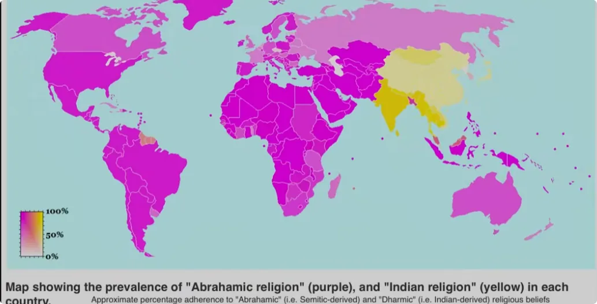

你以为《圣经》是一神教，其实《圣经》一直在讲修仙，讲一个人如何获得永生。

例如，《旧约》中描述以利亚登火车、驾火马、乘旋风升天，和东方神仙登车乘云、白日升天的场景如出一辙。此外，《圣经》里诸多教义与修仙佛的哲理别无二致。它们之间更多的像是拼图的两半。

可以说，《圣经》是末法时代修仙佛的最后一块拼图。而之所以将修长生拆分成两部分，分别放在东西方，其实也是神的本意。因为在末法时代，如果一个修行人只有区域性的视野，那么绝对是飞升不了的。

大部分有信仰的人基本都认同神爱世人，那么就应该知道，**神从来都不可能只偏爱单一民族，真理也不会完整地放在一本经书里，不会允许一个民族垄断真理的解释权。**

*只有拥有大爱、能兼顾古今中外的人，才有机会看懂全球的因果业力，才有机会领悟解困的终极办法。*
而这正是神明给末法时代的求道者设置的终极考题。

所以，尽管亚伯拉罕宗教体系覆盖了全球60%的人口，但能真正读明白《圣经》的人其实极少。

今天，作为修炼者，我给大家讲述最后一块拼图——**亚伯拉罕诸教**。本期我会先把《圣经》中跟修仙有关的部分挑出来讲，包括：
1. 修永生的原因
2. 寻道的方法
3. 对人的要求
4. 飞升的规则

对于东方的求道者来说，这里面有很多重要的信息差。除此以外，有些更深层的、难以公开的道理，则需要各位有缘人自己去探索了。

在讲解之前，我们还需要明确一点：
《圣经》的所有内容都不是神明亲自所写，跟原始佛经《阿含经》一样，都是其信徒记录下来的。

这是因为文字不是真理的完美载体，文字容易随情景变化而产生歧义。如果由神明亲自执笔，恐后世之人以神的名义冠冕堂皇地制造教条主义和排他主义。所以，神明若要保留教义的最终解释权，执笔之人只能是人本身。

人能理解多少，由人自己来书写。当教义被解释得混乱不堪的时候，神明就会再次降临，重新示意并指出新的方向。

因此，我们会发现，耶稣这位神在《新约》中采用了大量的故事、比喻来带出道理。不同悟性和不同诉求的人，解读出的道理就会变得不同。

耶稣是这么说的：

>天国的奥秘，也就是升天的奥秘，只让一部分有缘人知道，而不是让全天下的人都知道。这是因为大部分人的心性都不够，对真理麻木，听也听不进去，看也看不真切。何况还有许多心术不正的人对神权虎视眈眈。

如果讲得太直白，经书就容易被篡改或雪藏，变成少数人约束百姓的工具。
只有极少数人是真正有根底、真心求道的人。这些比喻就是为有根底的人准备的，让这些人找到答案，精进自我。

而那些没有真心、心术不正的人，不仅一点好处都不会让他们捞到，最终还要惩罚他们，让他们一无所有。

---

## 一、修永生的原因

### 1. 永生即道

在《新约·约翰福音》开篇，即点明耶稣下凡的缘由。

>在最初，世界都是由道创造出来的，人们都遵循着道生活。然而，如今地上的人却不再信道了，心中既没有道，也不敬重道。

所以，耶稣来就是让大家重新信仰道。耶稣所行所做，皆是要转达道的意思，而道的意思就是给他的子民指出一条永生的道路。

“信我者得永生”，本意其实是 -> “信道者得永生”。

### 2. 飞升的时机到了

耶稣刚开始传道的时候，就点明了飞升天国的契机。简单点说，就是时间到了。
如果你过去浑浑噩噩，或者猪油蒙了心，做了很多错事，那么现在听劝修行还来得及。

### 3. 决定去留的时间到了

耶稣在谈论人的罪的时候，用果树来比喻每一个人的结局。
他说，如果一棵果树白白站在土地上，却不结出相应的果实，那么土地的主人有权力砍掉它。
同时，他又暗示园主可以再放宽一点期限，让管园的人再栽培栽培。如果还是结不出好果，再决定砍掉。
以上就是修永生的原因，需要各位细细品味其中的深意。

如果你明白了修行的目的和意义，那么接下来我们说说如何找路、如何寻道。

---

## 二、寻道的方法

### 1. 走窄门

关于如何寻道这件事情，耶稣直接给大多数修行人判了死刑。
他直接说结果：
未来真正能领悟道的人、能结好果的人、能得永生之道的人，就是少数。

因为大多数人没有深刻的分辨能力，他们的底层逻辑仍然是基于名利，只信权威。谁名气大就信谁，谁的门场开得大就信谁。
他甚至给未来的基督信徒和神职人员判了死刑。
他说，未来有很多信徒要打着他的名号传道，到处搞神迹之事。这种行为其实是在作恶，因为耶稣说他从不是世界的主人，世人也不应该对他搞个人崇拜。

人们真正该做的是遵行道，这样才能真正进入永生的天国。
他提醒所有的修行人，未来会出现很多伪君子，行神奇之事，受人追捧。如果你们想要分辨他们的好坏，就别看他们说什么，要看他们结出过什么样的果。

因为好树结不出坏果，坏树也结不出好果。

耶稣也给那些读念经书的人判了死刑。
他说，想凭经书获得永生的人，心中其实都是没有道的。因为这些人不能体会道的真正想法，不懂遵循道行事，所以也不知道该去谁那里要永恒的生命。

最后，耶稣描述了走窄门是个什么情形。
窄门，也就是真正通往永生的那扇门，不是你发现了就能进，进了就稳妥了，而是要努力地进、持续地进。

因为未来会有许多人想走进这个窄门，道最后会根据每个人结出的果子安排前后顺序。晚来的人凭着勤勉，也有可能排到前面；原来先到的，则可能会落后，甚至被踢出门。

等门关了，引渡飞升的时机过了，你再磕多少个头也没有用。

### 2. 驱除污鬼

正如佛陀释迦牟尼、道教祖师张道陵，他们在传道的早期都通过驱鬼的方式救度苦难人、建立信，耶稣也是如此。

《圣经》中大量描述了耶稣在传道期间，通过驱除污鬼来治疗缠绵在人身上的阴病。
为什么要驱除缠在人身上的污鬼呢？
最核心的原因是，驱除了人身上的负面干扰，就相当于剥开了困在人头上的迷雾，人的本心、本性才能彻底展露出来。

此后，人说出来的话才是他真正的想法，他才真正有机会决定自己的去留。
那凭什么耶稣、佛陀、张天师他们有能力驱除污鬼？凭什么人间那些大师、神父不能真正做到驱鬼？
道理很简单，能审判众生的只有道本身，能驱赶和约束天下大鬼乃至鬼王的，唯有道给的权柄。

以上两点，如果你明白了该往什么方向寻道，那么接下来我们讲讲永生之道对求道之人有什么要求。

---

## 三、道对人的要求

### 1. 过名利关

哪怕是从天上下凡来的耶稣，他在传道前也要先经得住名利的考验。

道神派魔鬼去考验耶稣。魔鬼把全天下的荣华富贵都拿给耶稣看，对耶稣说：“只要你愿意臣服于我，我就能把全天下交到你手上。”

试问天底下有几个人经得住这样的诱惑？
那耶稣是怎么经受住考验的呢？

他说: 
道神才是天下主人，每个生灵都应该侍奉他、维护他，而不是他来侍奉我们、维护我们。

### 2. 放得下感情

想要从道那里得到永生，那么个人就是要有些取舍的。

当一个人把亲情和爱情看得比道还重，那将来遇到二选一的难题时，或遇到家人和爱人成为魔鬼的筹码时，这个人大概率是要背叛道的。

所以，如果只是普通的修行，想要修得人间安宁，那么可以放不下感情。但如果是要修上天、与道相伴，那这个人就必须要有感情上的觉悟了。

### 3. 放下世间执念

为什么都说修行人要放下世间的执念呢？
因为如果你放不下，那就算把你保送到天上，你的心也还在世间，你还是要重新下来渡劫历练。

神明劝世人放下尘世的执念，就好比老师劝一个贪玩的学生：只有收了贪玩的心，人才能真正地进步，去做对自己真正有价值、有意义的事情。
然而，旁观者清，当局者迷。想让贪玩的学生理解学习的重要性，最好的方法从来不是靠老师的戒尺，而是让他亲身承受贪玩带来的恶果。

所以，人的恶业不是不报，而是时候未到。

耶稣是这么说的：

> 你们不是因为见了我神奇才来信我、找我，而是终于不得不为了填饱肚子才来。直到那时，你们才能明白，世间的一切粮食都会腐朽，都可以随时从你们身上剥夺去。唯有那能让你们永生的粮食，才是值得你们去劳力的。

### 4. 根底好、道根好

耶稣最早使用，也是最核心的比喻，就是撒种的比喻。
撒种讲的是一个人的根底决定了他能否理解道、能否修成道。
他说，传道的过程就好比撒种，同样的种子落到了不同的人身上，结果是不一样的。根底不同，听到的道就不同。

- 有的人听见了道，但自己根本不信道，是信撒旦的，信的是功名利禄，心里根本没有过道。
- 有的人听见了道，虽然欢喜接受，但道根不坚，不肯为道受苦，受点挫折就会背弃道。
- 有的人听见了道，心里却放不下世上的种种念想，把道放一边，不愿尽力修出果实。
- 最后，只有那些根底好的人听见了道，才愿意尽心地修出果实。

根据每个人的劳力，有的人能修出小果，有的人能修出大果，不尽相同。

耶稣又继续讲种子长大的比喻。

有道根的人，既给了土壤，就应当尽力生长，结出丰盛的果实，好在收割之日得到自己应有的报酬，也就是永生。

### 5. 求道的态度

那是不是有根底的人，就一定能辨识出永生之道？是不是就拥有更多的优势和优待呢？
耶稣说，不是的。
他用了这样一个比喻，说天国的王备好了筵席，派仆人去请被召的人来赴宴。结果很多人根本就不搭理国王：

- 有的人只管眼前一亩三分地；
- 有的人只想做生意；
- 还有的人把国王派去的仆人一顿羞辱，甚至把仆人也给杀了。

于是国王就怒了。他原先要召的人如今竟蠢破天际、有眼无珠，不识东家，不再追随他。于是国王要毁掉这些人所在乎的。

既然原先该赴宴的人不来了，国王就把筵席的座位开放给了更多的人。凡仆人在岔路口遇见的，且想来赴宴的人，都有机会坐到筵席上。

那是不是来赴宴了就有座位了呢？也不是。
国王就把那些态度不端的人给扔了出去。为什么呢？
因为给了你上好的机会，你竟然毫无敬畏之心，毫无珍惜的心。当赴宴的人越来越多的时候，当候选人越来越多的时候，那些态度本身就有问题的人，自然会被舍弃了。

### 6. 心性好

除了要端正态度，还要心性够好。
耶稣用葡萄园的故事来作比喻，说有个园主雇人做工，约定好每人一天一钱。
他看见市场上无业的人，就招呼他们进葡萄园做工。那些没有人要的闲工，园主也给他们机会。就这样，园主分别在早、中、晚雇用了几批人干活。一直到晚上结算工钱的时候，园主特意安排先结算晚来的人，最后再结算早来的人。

早来的人看见晚来的人得到一钱银子，就觉得自己理应得到更多。结果园主无论每个人工作多长时间，都只给了一钱。

果然，早来的人心里就过意不去了。他们觉得自己辛苦付出那么多，凭什么别人跟自己一样的报酬呢？

园主回复道：

> 你跟我约定好的不就是一钱银子吗？怎么又要开口多要了呢？因为看见别人比你轻松，你就眼红吗？你觉得你就应该比别人得到更多吗？你是在教我该怎么分配我自己的东西吗？

这个故事其实就是在讲，道怎么**考验求道者的贪嗔痴**。

首先，道给了你入门的机会，你就该知恩知足了，不该继续向道索取回报。
再者，细想一下，难道道看不见你的辛苦付出吗？难道道不清楚与你匹配的报酬是多少吗？
当然是清楚的。
但是，道若要赐予修行人更好的回报，那么就需要先考验这个人的心性接不接得住。如果只是这么一个小小测试，你的心态就崩了，那就说明你德不配位了，你该有的赏赐也得先收回了。
所以才说，原先走在前面的人就要挪到后面去了，后来的人就要走到前面了。

### 7. 如孩童般纯粹

那哪种人心性最好呢？
耶稣在《新约》中多次强调要像小孩子那样。

>他说，天上的那些子民，都是像小孩子那般内心纯粹和谦卑的人。只有这样的人，才能到天上去。

因为孩童的内心不会有那么多的心计，不会像大人那样整天计算自己有没有吃亏、付出后多久能得到报酬。

毕竟，求道者面对的可是道本身。若戒备道、猜忌道，对道的付出斤斤计较，这样的人怎么能得到呢？
所以，能真心帮助无地位、无收益的弱小群体，就是真正做到不慕名利的人了。能做到这一点的人，就是心中有道、能服务于道的人了。
相对的，道也只青睐这种内心纯粹的人。
如果一个人的内心填满了自己的谋算，就听不进道的声音。从这一点看，绝大多数修行人的心境，可能真不如一个小朋友。

所以，求道者在道面前，无心才生大用。

### 8. 谦卑

有一次，耶稣的门徒在争论谁的位置更大。
耶稣说，你们若谁想争最大的那个位置，那就必然先做大家的仆人。
正所谓厚德者载物，上善者若水。真正高大之人，必然扎根于最低处，做着大众的仆人。
连耶稣下凡来，也是来服务大家的，不是来被服务的。他还要舍命给人类赎罪。他以身作则，教大家何为谦卑的真谛。
在最后的晚餐，耶稣亲自给他的门徒们洗脚。门徒就非常惶恐，不敢承受。

耶稣说：

> 如果你们没有经历过这件事情，你们就永远无法体会其中的深意，那你们离升天就远了。

耶稣挨个洗完脚后，继续解释道：

> 我是你们的主，尚且低下身子给你们洗脚，那仆人的架子能比主人大吗？当然不能。经历过这事后，你们能时时记得我低下身子为你服务的情境，未来你们的架子自然不能比我高了。如此，你们能学会务实的谦卑。

耶稣又说，我是道派遣我来的。换而言之，相当于道为大家洗过脚了。你们作为求道之人，架子不能比道还大。

### 9. 大爱为道

前面讲过，道即神，神即道。

《圣经》所记载的道神和东方其实是一样的。神终究是爱世人的。
耶稣也好，神仙、佛菩萨也好，各路差遣下来的神灵都在教导人慈爱、救度众生。这表达了道神的本意。

耶稣在《圣经》中说，想要获得永生：
1. 第一要务是尽心、尽性、尽力、尽意去爱护道，不论道的位格。
2. 第二要务就是善待那些良善的人，待他们如同对待自己。

这件事重要。换句话说，大爱是通往永生之道的必选项。
不过，大爱并不代表没有章法的溺爱。要做到什么程度？如果你搞不清楚，那就看道打算怎么做，就总不会错。

### 10. 德行

正因理解了道的大爱，历史上才会有这么多神灵下凡，劝人悔改、劝人良善。
耶稣也多次通过比喻来说明这件事的必要性。
他比喻说，升天这事就好比家主临时不在，把家业交给了三个不同才干的仆人。
领最多的那个仆人，拿着钱为家主挣下更多的家业；领较多的那个仆人，也拿着钱挣下较多的家业；只有领最少的那个仆人，原封不动地保管原来的家业。

过了一段时间，家主回来了，开始算账。
能干的两个仆人汇报了自己的所作所为。家主对他们说：

> 你们在这件小事上能上心，说明你们对我有真心。以后我把更多的家业给你们管，你们可以享受主人的快乐了。

然而，那个最不能干的仆人却说：

> 主人，我觉得你是个严苛的人。你没有播种过的田地，却想着去收割；你没有投资过的地方，却想着去敛财。我有点怕你，你的银子原封不动地在这呢。

家主就生气了，说：

> 你既然知道我是严苛的人，知道我没有可收割的田地，知道我没有可收益的地方，你却什么事都不帮我办吗？那你真是又坏又懒。

于是，家主就把这仆人身上的一千银钱，给了身上银钱最多的仆人。

因为有真心又能干的人，就要多给他，好让他管理家业。反之，不上心且无动于衷的人，连他原有的也要剥夺。

最后，家主不仅抛弃了这个无用的仆人，还把他扔到黑暗中反思。

在这个故事里：

- 家主就是道；
- 家业就是道的资源；
- 仆人就是道的仆人。

作为道的仆人，拿着道给的资源，却不开拓道的道路，反而袖手旁观，那此人的结局就是被抛弃。
从最后道的奖赏来看，道就是奖罚分明的。对于勤勉的人来说，道始终是仁慈和庇佑的；而对于懒惰的人来说，他的第一反应是道严苛又无情，甚至霸道。
因为道的奖罚原则在于，道把资源多给了谁，就要对谁多要求、多索取。
所以，那些拿着道的大量资源，根系占着土壤却不结果的人，内心自然害怕道。反之，那些能结果的人，就是在顺道而行了。
有的人可能会说：“那我能力有限，行得少、得得少，是否也就微乎其微呢？”

耶稣说，不是的。

同样是奉献一块金币，对于那些资源丰富、条件优渥的人来说，不过是轻松就能完成的事情；而对于那些贫穷、困苦的人来说，则需要下定更大的决心，做出更大的牺牲和让步。
前者只付出自身的1%，而后者却付出了自身的90%。这样看，反倒是后者对道已经尽力了，道自然也不会亏待他。

### 11. 道义

那为道付出，或者说奉献的上限是什么呢？
换句话来问，你拥有且舍得付出的最高上限是什么呢？
这个不太好在当下环境讲，容易让人产生误会，大家自己看看《圣经》所说就好。

### 12. 从始至终的准备

现在很多人都迷信“缘会自来”“一切都是最好的安排”。
对于任何阶段的修行人来说，这种观念都弊大于利。因为它削弱了主观能动性和个人责任，会让人不努力、不作为、不规划。

耶稣讲了一个比喻。

>他说，升天这件事情，就好像有一群求道者出门迎接引渡人。有的求道者愚昧笨拙，不好好做准备；有的求道者聪慧，知道要随时准备好。

当引渡人还没出现的时候，所有的求道者都打盹了，因为暂时没什么可做的。直到有人开始发声：“引渡人来了，大家可以去迎接他了。”

这群求道者就惊醒了，都想跟着引渡人一起离开。
那些没准备好的人发现自己的不足，就求那些准备好的人帮帮他们。
那些准备好的人想得通透，知道自己所准备的可能都不够自己用，况且这本该是个人分内之事，于是就婉拒了。
等那群偷懒的人再去做准备时，引渡的时机已经到了。那些准备齐全的人顺利登上了升天的马车，随后车门就关了。

等门关了后，不管准备得再好，不管曾经相不相识，道都不再引渡了。
因为该得到的人，必然时刻警醒、时刻自勉、时刻准备着。因为道有自己的安排，主人的时间可不等仆人。
能顺道而行的人，才称得上得道之人。反之，那些迟到的人，等着被通知，等着时间来顺应自己，这种觉悟就不足以得道。

### 13. 机缘的本质

耶稣作为下凡引渡世人的神，他是这么说的：
如果不是道的恩赐，没有任何求道之人能够冥冥之中来到他面前。
那些不是真心求道的门徒，最后都一一离开了他。

耶稣甚至试探他的十二门徒：“你们要不也回去好好生活吧？”

他的门徒说：

> 除了你给的这条路，我想不出更好的归途了。

所以说，能走上这条路的人，都是有些缘由、有些来历的。但能走到最后的人，往往不是来历有多好，反倒是谁有尽心尽力、谁在坚定勤勉地前行，才能走到最后。

如果你不努力走到最后，可能有缘也要变无缘了。

那一个人怎么看出自己有无缘分求仙问道呢？

耶稣说，求道者来到这世界，仿佛世界都在排斥他，他也会觉得自己不属于人的世界。这就是有缘人的特征了。

耶稣在离别门徒的那一晚，为门徒做了一个漫长且深刻的祷告。

他向道祷告说：

> 道啊，您所行一切就是真理，请您用真理让有缘人成圣。我耶稣下凡引渡之人，只不过是有缘人的药引子、催化剂。有缘人终究要各自让自己成圣，靠真理成圣。

---

## 四、飞升的规则

讲完了永生之道对求道者的要求，那么我们最后来讲讲飞升的规则，作为本篇的收尾。

从《新约》来看，哪怕是耶稣的十二门徒，最后也没有升天。甚至连耶稣最爱的门徒约翰，也要等下次机会再飞升。

因为在当时，飞升的时机还没到。可见，飞升的规则卡得很严。

以下是唯二在《圣经》中提到过飞升的人，大家好好听了：

1. **以诺**：与神同行三百年，没有经历死亡，直接被神接走。
2. **以利亚**：为神作证，与魔鬼对决，最终在他徒弟面前白日飞升。

我是修炼者小烨，我们下集再见。