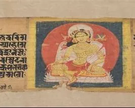
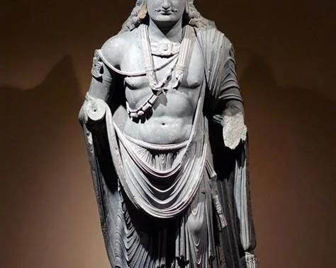
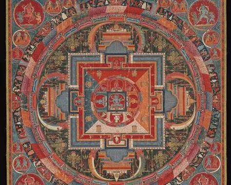

 >[!note]
 >“我是觉悟者，而非神灵；我所指出的道路，需你们自己行走。”
 
 
## 1. 佛陀时代与经典结集

**佛陀在世时期（约前6-前5世纪）**：
原始教义通过口头传诵。佛灭后，教义经信徒多次结集和整理，后形成《阿含经》。

**第一次结集（佛灭后3个月～1年，约前486～前483年）**：
500阿罗汉在王舍城结集，确立原始佛教核心教法与戒律（《阿含经》雏形）。

**《阿含经》（内容形成于前5-前3世纪）**：
《阿含经》被认为是“最接近佛陀原始教法”的经典。记录了佛陀的原始教义：
- **核心思想**：强调“无我”“缘起”和现世修行证果。
- **修行目标**：以个人解脱（阿罗汉果）为最高成就。
- **修行有先后**：先求自身觉悟（自渡），后发心渡人。

## 2. 部派分裂：上座部与大众部

**第二次结集（佛灭后100年，约前386年）**：
佛教内部首次分裂——**上座部（长老派）** 和 **大众部（多数派）**。

**上座部以资深长老比丘为主：**
1. 坚持原始佛陀教法。
2. 坚持先证阿罗汉果（先自证/自渡）。
3. 视《阿含经》为终极权威。

**大众部代表多数青年比丘、在家信众和边缘地区信众：**
1. 主张革新，适应时代，允许简化戒律。
2. 批评上座部追求个人解脱是“自私”，不主动渡化众生。提出“菩萨”概念。
3. 开始神化佛陀。

**大众部在教义方面提出创新：**
1. **神化佛陀**：提出“法身”概念，认为佛陀是永恒存在的真理本体，主张佛陀全知全能（在佛经中增补大量佛陀前世如《本生经》的神通事迹，强化其超凡性）。
2. 鼓励对佛陀遗物、象征物的崇拜，认为可得功德。发展“念佛”修行，强调忆念佛陀功德。
3. 提出**心性本净论**：认为众生的心本清净，认为解脱是恢复本性而非“获得”清净。该观点成为后续“众生皆具佛性”的基础。
4. 认为阿罗汉果不如“佛果”圆满，只是“弟子位”；提出“菩萨道”普渡众生，认为菩萨（未来佛）的修行比阿罗汉更殊胜，强调“利他”而非仅“自渡”。

**上座部的立场（一）：**
严格遵循原始佛教“无我”与“解脱道”框架，反对神化佛陀，反对菩萨道理念。
1. 坚持“无我”原则：佛陀是觉悟者，非神性存在，其伟大在于发现真理而非创造真理。
2. 认为神化佛陀会导致信仰取代实修。“若执佛为救世主，则戒定慧三学荒废。”
3. 阿罗汉已断尽烦恼，与佛陀在解脱境界上平等（差异仅在智慧广度）。
4. 批评菩萨道“有我论”违背“无我”核心教义，追求“佛果”本质是另一种贪欲。真正的解脱应破除“我执”，连“渡众生”的执着也需舍弃。

**上座部的立场（二）：**
1. 批评菩萨道“不切实际”：
> 1) 没有现实验证，修行者无法确认自己是否在“菩萨道”上。
> 2) 以“未来(世)成佛”为借口，延缓当下精进。
> 3) 菩萨道有意保留烦恼以轮回渡众，违背佛教“断烦恼”的根本目标，以渡生之名行贪欲之实。“未断结者，欲断他结，终无是处。”
2. 菩萨道强调“积累福德资粮”，易演变为追求形式化供养（如盲目建寺造像）、将“利他”工具化（为功德而行善，而非发心）。“执着善行，亦是束缚。”
3. 菩萨道允许凡夫发菩提心，但凡夫缺乏智慧辨别真正的利他行为，可能造成“好心办坏事”。应先自证/自渡/自精进。

## 3. 大乘佛教的兴起与演变

**大乘佛教继承和发展了大众部的部分教义，于公元1世纪后成体系。** 大乘将上座部等佛教贬为“自了汉”、“小乘”，自称“大乘”。大乘强调拯救一切众生，旨在解决更广泛的众生根器问题，为不同根器众生提供适应性法门。

**早期大乘（1-3世纪）**：
核心特点：批评上座部，确立菩萨道、空性思想，推动佛教平民化。主要新观点：
1. 菩萨道：修行目标从阿罗汉转向成佛，强调“普度众生”。
2. 空性思想：提出“一切法空”，首次将“空”扩展至一切法。
3. 佛身论：提出“法身”概念，认为佛陀是宇宙真理的化身。
4. 净土论：提出“净土（极乐净土、极乐世界）”概念，认为佛陀可创造净土接引众生，提出佛菩萨愿力成就净土。
5. 易行道与他力救济：提出依靠佛菩萨的愿力加持，通过简易的修行方法（如念佛往生、持咒消灾、忏悔灭罪等）快速获得解脱或往生净土的修行路径。

**中期大乘（4-6世纪）**：
核心特点：体系化空性思想，发展唯识学，确立“末法”观念。主要新观点：
1. **中观学派**：彻底否定一切对立概念，连“空”本身亦不可执，否定一切修行果位执着。
2. **唯识学派**：主张“万法唯识”，认为一切现象都由意识变现出来，所以虚假，不是实在的。
3. **如来藏思想**：认为众生本具清净佛性。《维摩诘经》提出“唯心净土”，将往生净土归于心性，“心净则佛土净”。
4. **末法时代**：明确划分正法、像法、末法三期，为“易行道”提供合理化依据——称是佛陀为适应不同时代众生根器而隐秘传授的教义。称外道兴盛是因“末法魔强法弱”，激励信徒坚守大乘。

**后期大乘（7世纪后）**：
核心特点：密教化，强调即身成佛，融合印度教仪轨。主要新观点：
1. **密教**：主张“即身成佛”，通过结手印、诵真言、观想本尊的方式与佛相应，将凡夫身直接转化为佛身。引入曼荼罗、真言（咒语）、灌顶等仪轨。
2. **佛性论深化**：提出“众生即佛”，烦恼即菩提，转化欲望为修行能量。
3. **易行道极致化**：彻底否定自力修行，往生完全由佛力决定，与修行者行为无关，“信心即往生”、“信即得救”、“一念往生”、“十念必生”。救度无条件，恶人直接往生。

## 4. 核心教义的分歧对比
**因果与轮回：**
- 原始佛教强调现世修行证果，证阿罗汉果，断烦恼、彻底脱离轮回。
- 大乘主张未来成佛，证未来佛果，以菩萨行愿主动入轮回，直到渡尽众生。

**修行核心与发心：**
- 原始佛教以“自证解脱”为核心，随缘利他（非必要），应机施教。“自未渡不能渡他”，不主动发愿普渡一切众生。
- 大乘主张“自他共渡”，甚至将普渡众生置于个人解脱之上，要“菩萨发心”，主张“无休止菩萨行”的“无尽誓愿”。

**佛陀观与净土观：**
- 原始佛教中佛陀明确反对被神化，否定自己“恒常不变”，认为自己只是“人间导师”“我也是人”，且涅槃后不再以任何形式常住世间。并无“净土”概念。
- 大乘提出佛陀“法身”概念，将佛陀升华为宇宙性真理化身，与空性、法界等同，永恒普遍。净土是佛愿力所成。

**解脱路径与自力：**
- 原始佛教的解脱之道虽普适，但根器利者可直指核心，钝根者则需次第修习。并强调无论根器利钝都当**自力修行**——“汝当自努力，如来唯导师”。
- 大乘为适应众生根器，开创简易方便法门。并主张“可仰仗阿弥陀佛愿力往生净土”，甚至彻底否定自力。

**无我与佛性：**
- 原始佛教强调“无我”，主张众生仅是“色受想行识”五蕴的和合，“众生是未解脱的凡夫”，需断五蕴以解脱，彻底否定本体（如梵我、神我）。
- 大乘主张“众生本具佛性”，众生是未觉悟的佛，肯定本体，需向内返观自性，返本还源。

**业力与忏悔：**
- 原始佛教讲“业必受报”，即使忏悔可减轻，但无法完全消除。
- 大乘提出“罪性本空”，允许通过忏悔、诵经完全灭除重罪。

**相互评价（对立场认知）：**
> **大乘认为原始教派：**
> 只求个人解脱，没有普渡众生的心；对钝根众生摄受不足，没有简单方法。
> 
> **原始教派认为大乘：**
> 非佛亲说，后世伪造；违背佛陀“我也是人”的原始教导；依赖“念佛往生”、“本尊加持”，弱化自力修行；空性论导致虚无主义，破坏业报伦理。

## 5. 结尾

最后，以佛陀留下的原始教导作为结尾：
> “汝当自努力，如来唯导师。”
> ——《法句经》（前5-前3世纪）

