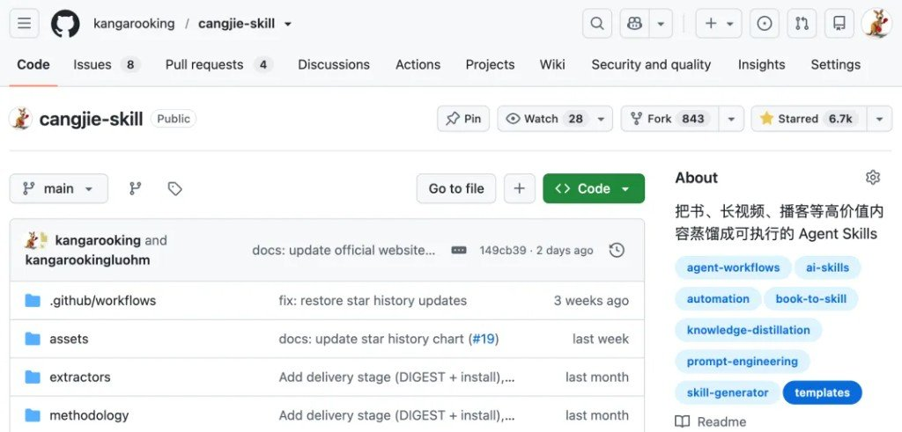
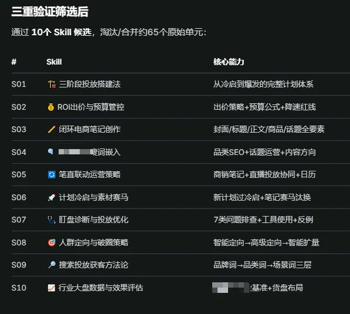
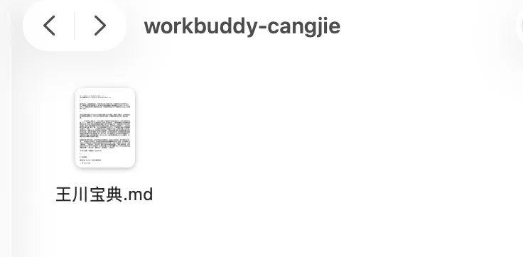
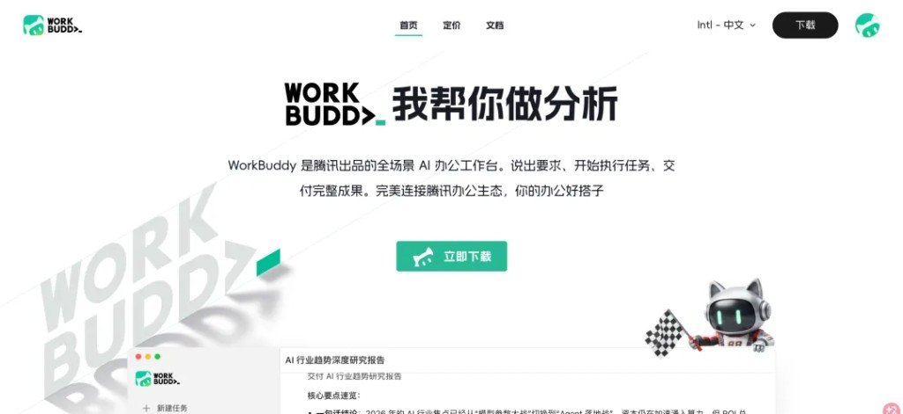
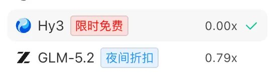
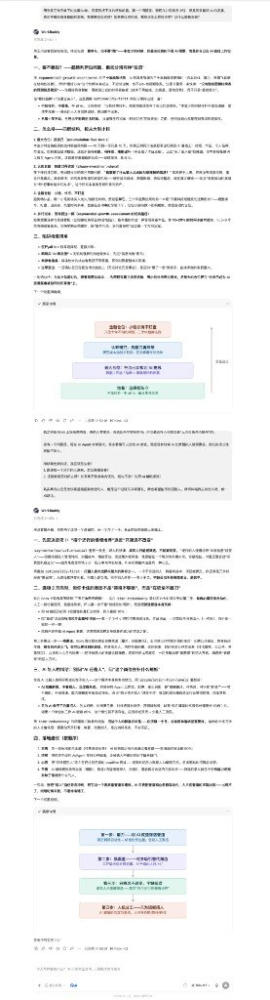

收藏一万本，不如蒸出一套能触发的 Skill。这篇保姆级教程讲的是用开源仓颉 Skill（`cangjie-skill`）挂在腾讯 WorkBuddy 上，把 PDF/MD 资料蒸馏成可安装、可复用的 Agent Skills——不是再写一份读书笔记，也不是手写 `AGENTS.md`。

仓库：[github.com/kangarooking/cangjie-skill](https://github.com/kangarooking/cangjie-skill)（文中时点约 **6.7K Star**）。仓库自述：「蒸馏所有值得蒸馏的高价值内容」。

> **投资免责（原文保留）**：后文演示问答里 AI 的回答「不构成任何投资建议」。

---

## 先想清楚：蒸出来能干啥

一开始自己也想不出多少场景，后来在交流群里收了一波反馈[^missing-group]，挑了几类：

| 场景 | 场景说明 |
|---|---|
| 小红书商家投流指导 | 蒸馏+优化出 **10 个 Skill**（见下表） |
| AI4science | 称获博士认可[^missing-ai4s] |
| 卖 Skill | 约 **29.9** 价位的售卖例子[^missing-sell] |
| 其他 | 课程 / 剧本 / 金融分析 / 企业规章 / 科学访谈… |

企业侧：有行业私有资料时，场景更密。个人侧：最直接的入口仍是**蒸馏一本书**。文中还提到入驻 WorkBuddy 那篇在 AI 社群里被传[^missing-spread]。

### 小红书投流：S01–S10（从图抄）

图题「三重验证筛选后」：约 65 个原始单元筛成 **10 个 Skill 候选**。

| # | Skill（图面） | 核心能力（图面） |
|---|---|---|
| S01 | 三阶段投放搭建法 | 从冷启到爆发的完整计划体系 |
| S02 | ROI出价与预算管控 | 出价策略+预算公式+降速红线 |
| S03 | 闭环电商笔记创作 | 封面/标题/正文/商品/话题全要素 |
| S04 | 「图面不清」…词嵌入 | 品类SEO+话题运营+内容方向 |
| S05 | 笔记联动运营策略（图面似「笔直」，按语境判为笔记） | 商销笔记+直播投放协同+日历 |
| S06 | 计划冷启与素材赛马 | 新计划过冷启+笔记赛马汰换 |
| S07 | 盯盘诊断与投放优化 | 7类问题排查+工具使用+反例 |
| S08 | 人群定向与破圈策略 | 智能定向→高级定向→智能扩量 |
| S09 | 搜索投放获客方法论 | 品牌词→品类词→场景词三层 |
| S10 | 行业大盘数据与效果评估 | 「图面不清」…基准+货盘布局 |

S04 / S10 有像素糊块，上表已标「图面不清」，不脑补。

---

## 官网：收藏变成可调用

官网：[cangjie-skill.com](https://cangjie-skill.com)  
标语大意：把看过的知识，变成 Agent 真正能调用的能力；书 / 视频 / 播客 / 课程 → 可安装 Skill Pack。

---

## 四步开蒸（教程主体）

### 1. 准备资料：PDF → MD/TXT，一次一类

示例书：《王川宝典》。文中称大佬推荐线：巴菲特、芒格、段永平，以及这本。

- PDF 转 Markdown / TXT（文中：Google 搜「PDF 免费转 MD」等）
- 图里有关键信息 → OCR；也可试豆包 **Seed-Evolving**，或收费但效果不错的 **Doc2X**
- **一次只蒸馏一本书，或一类资料**（反复强调）

### 2. 安装 WorkBuddy

下载：[workbuddy.ai](https://workbuddy.ai)（文中写 workbuddy.ai / WorkBuddy；腾讯出品全场景 AI 办公工作台）。傻瓜式安装，微信扫码登录。

### 3. 找到仓颉 Skill →「去试试」；模型怎么选

路径（操作路径）：技能 → 搜索「仓颉 skill」→ 推荐 → 仓颉 skill → **去试试**[^missing-wb-search]。

- 指令：让仓颉直接蒸馏；把书文件路径/内容丢进对话框
- 可自定义 API / Coding Plan / 中转[^missing-api]——文中夸开放灵活
- **耗 token**：蒸馏书本身就贵，别当闲聊额度

| 模型选择（实测口径） | 用途 |
|---|---|
| **Hy3** | 限时免费，适合第一次试水 |
| **DeepSeek V4 Flash**（WB 内置正式版） | 效果/速度/价格兼顾，本次开蒸选用 |
| 自定义接官方 DeepSeek API | **不能识图**；内置版可以 |
| **Kimi K3** 反例 | 跑到约 2/3 已耗 **~2000 积分**[^missing-credits] |

### 4. 开蒸：约 30 分钟 · 12 Skill · 65 积分

本次：WB 内置 DeepSeek V4 Flash。

- 过程约 **30 分钟**
- 产出约 **12 个 skill**
- 积分约 **65**（文称每日可免费领 **100** 积分 → 几乎等于白嫖一本书；想彻底免费就用 Hy3）[^missing-credits]

工作方式：按**项目文件夹**开工作空间——书/资料一份夹，蒸馏产物也落在同一空间，用的时候仍以该夹为工作区（避免 Skill 越积越乱）。

---

## 蒸完怎么用：确定性，不是「听着有点道理」

演示：同一问题，加载《王川宝典》蒸馏 Skill 的答卷 vs 裸 **Kimi K3**（不挂工具）[^missing-kimi-cmp]。

他自己的对比结论：

- 裸模型也能说得过去，但**确定性不够**——「有道理，又好像差点什么」
- 挂上蒸馏 Skill 后，更容易给出**关键、建设性、更敢拍板**的建议
- 通用问题已能拉开差距；**私有资料 / 模型未训练过的新料**，差距会更大
- 换**本地小模型**时，差异通常更醒目 → 适合有私有化部署需求的企业

用法一句话就够：**把问题丢给挂了该项目 Skill 的 Agent**，别指望自己背完整本书。

---

## 视频蒸馏：预告，不是本期主菜

文中称已用字节 **Seed-Evolving** 试过：视觉强 → 视频信息抽得更完整 → 视频蒸馏更稳。完整教程未展开，等三连催更[^missing-video]。

---

## 评论区择要（作者征集反馈里常见的几问）

| 问法 | 可带走的判断 |
|---|---|
| 动态知识库更新了，要不要重蒸？ | 方法论变了 / 触发条件变了 → 值得重蒸或增量蒸馏；纯事实补丁未必每次全量重跑 |
| 蒸馏 Skill vs 外挂知识库（RAG） | RAG 擅长「你知道该问什么时的检索」；Skill 带触发条件，会在对的情境自己跳出来——两者不是同一层 |
| 什么样的书更合适？ | **工具类 / 方法论密度高**的书更合适；金句散文型往往蒸不实 |
| 日常怎么用？ | 按项目空间挂载 → **丢给 Agent** 直接干，而不是把 SKILL.md 当阅读材料 |

（评论原文未完整收录在转载页；上表按作者征集反馈主题与文中论点择要，不当逐条引用。）

---
