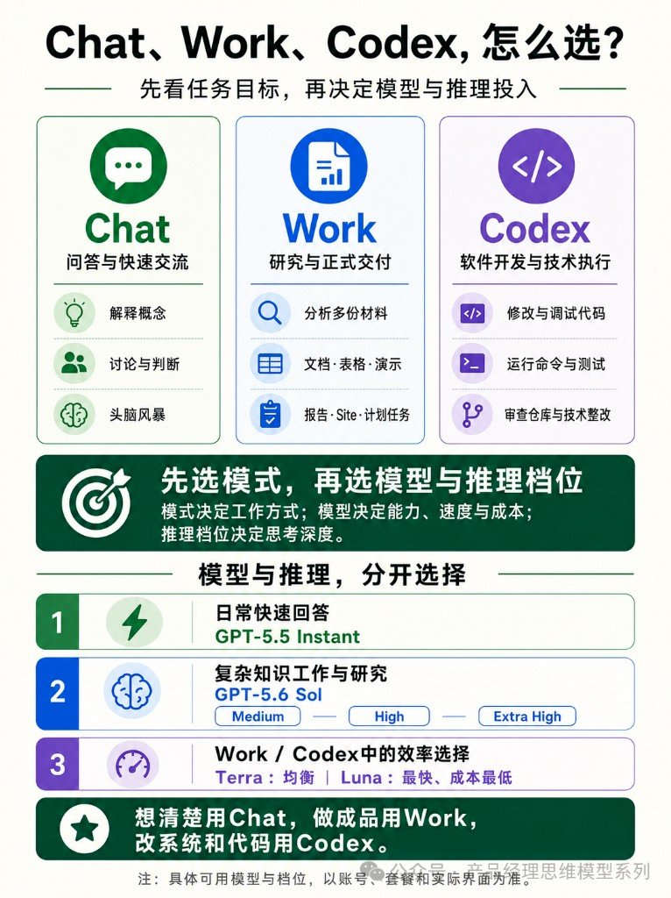

很多人一打开 ChatGPT，先纠结「用哪个模型、推理开多高」。图卡把顺序拧回来了：**先选模式，再选模型与推理档位。**

模式决定工作方式；模型决定能力、速度与成本；推理档位决定思考深度。下面按图面完整转录，不当完整产品手册。

---

## 三个模式各管什么

| 模式 | 定位（图面） | 典型用途（图面） |
|---|---|---|
| **Chat**（绿） | 问答与快速交流 | 解释概念 · 讨论与判断 · 头脑风暴 |
| **Work**（蓝） | 研究与正式交付 | 分析多份材料 · 文档·表格·演示 · 报告·Site·计划任务 |
| **Codex**（紫） | 软件开发与技术执行 | 修改与调试代码 · 运行命令与测试 · 审查仓库与技术整改 |

分不清时先问自己：是在**想清楚**，还是在**交成品**，还是在**改系统和代码**。

---

## 选型逻辑：模式在前

图中部那条够硬：

> **先选模式，再选模型与推理档位。**  
> 模式决定工作方式；模型决定能力、速度与成本；推理档位决定思考深度。

别把「模型更强」当成万能开关——工作方式选错，再贵的档位也只是更快地做错事。

---

## 模型与推理，分开选

图面标题：**模型与推理，分开选择。** 三档对照如下（名称按图面照录[^models]）：

| 场景 | 图面建议 | 备注 |
|---|---|---|
| 日常快速回答 | **GPT-5.5 Instant** | 快答档 |
| 复杂知识工作与研究 | **GPT-5.6 Sol**，推理可选 **Medium / High / Extra High** | 深度档，推理强度单独拧 |
| Work / Codex 中的效率选择 | **Terra**（均衡）· **Luna**（最快、成本最低） | 交付/执行场景下的效率档 |

Instant 管「说得快」；Sol + 推理档管「想得深」；Terra / Luna 管 Work、Codex 里要不要压成本和延迟。

---

## 口诀够用了

图底那句直接背：

**想清楚用 Chat，做成品用 Work，改系统和代码用 Codex。**

进了 Codex 还要写规矩、派活、少走偏，旁边几篇管用法，不跟本篇抢选型。

---

## 跟旁边几篇别搅成一锅

| 旁链 | 它管啥 | 别跟本篇混的原因 |
|---|---|---|
| [7 天烧掉 230 亿 Token：这 50 条 Codex 心得](../2026-08-10_Codex实战心得50条/7天烧掉230亿Token：这50条Codex心得够用了.md) | Codex 实战清单 | 用法心得 ≠ ChatGPT 三模式选型 |
| [Codex 官方十条：边界越清楚越像靠谱搭子](../2026-08-10_Codex官方高效用法10条/Codex官方十条：边界越清楚越像靠谱搭子.md) | 派活边界 | 进 Codex 之后怎么用；本篇先问进哪个模式 |
| [好 AGENTS.md 不让 Codex 更聪明，但少走偏](../2026-08-10_高质量AGENTS.md模板原则与6场景/好AGENTS.md不让Codex更聪明但少走偏.md) | 项目指令路由 | 仓库规矩文件 ≠ 产品界面模式 |
| [一张图看懂：MCP、Skills、CLI](../2026-08-10_MCP_Skills_CLI三者关系/一张图看懂：MCP、Skills、CLI.md) | 连接 / 方法 / 执行 | 同是选型卡，对象不是 Chat/Work/Codex |
| [Claude Code 四类 Loop：你到底交出哪一段](../2026-08-10_ClaudeCode四类循环工作流/Claude-Code四类Loop：你到底交出哪一段.md) | CC 交权 | 工具不同；本篇钉 ChatGPT 三模式 |
| [手机里那九个 AI 其实是一个班](../2026-08-10_有趣的AI大模型一班/手机里那九个AI其实是一个班.md) | 消费侧模型拟人 | 点名梗 ≠ 模式/档位怎么选 |

本篇只做「Chat = 想清楚 · Work = 做成品 · Codex = 改系统与代码」的图卡速记；原帖 URL 用户未给，按粘贴图卡处理。

[^models]: 图中模型名（如 GPT-5.5 Instant / GPT-5.6 Sol / Terra / Luna）及推理档位按图面照录；**以账号、套餐与界面实际可选为准**。
