为什么城市中的很多建筑看起来怪怪的？

这是长得像三口棺材的客运中心
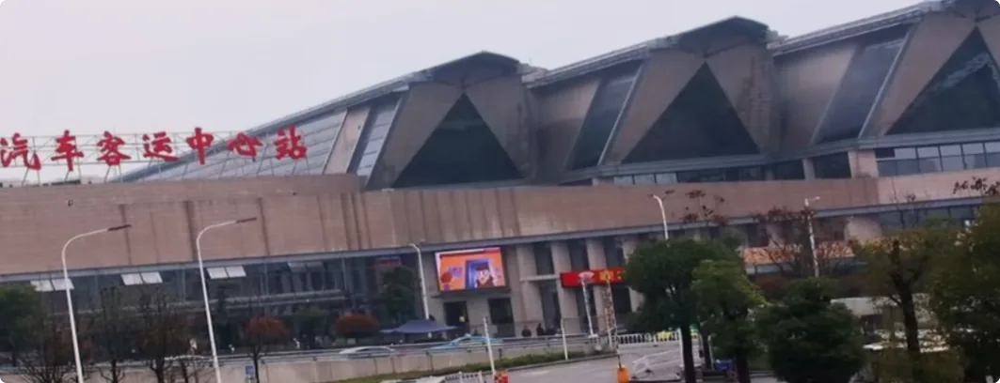

这是长得像三炷香的小区
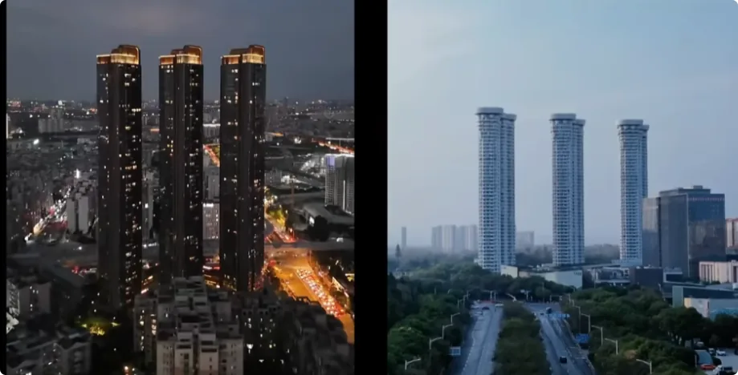

这是长得像六根蜡烛的某银行大厦
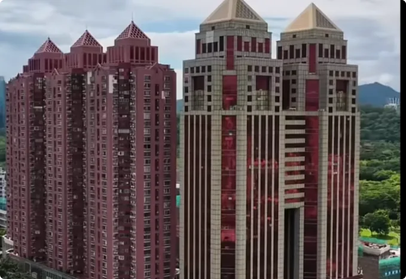

这是长得像大砍刀的国际金融中心。
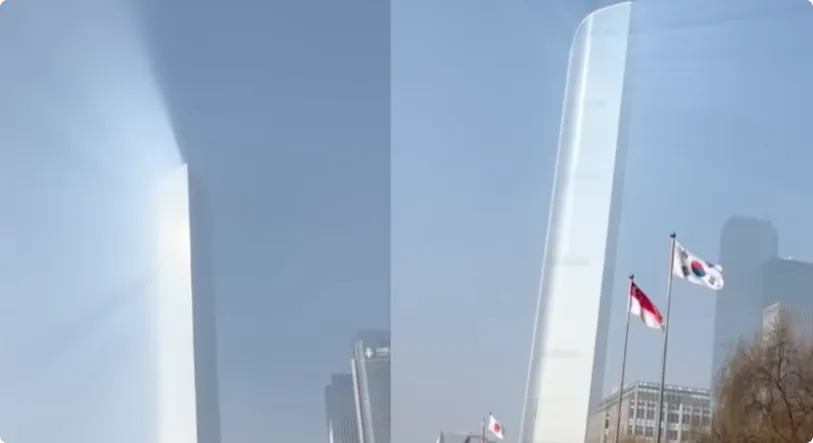

看起来都非常不吉利，对吧？你想一下，连你都能看出来，难道那些比你心思重的商人看不出来吗？

作为修仙之人，我是很明显能感受到哪些建筑散发着浊气。我也能猜到为什么那些商人要修这种建筑。估计很多人听过一种说法，说这种建筑都是在借运，把普通人的运借到自己身上。

其实这种说法并不完全正确。
**运并不是从他人身上直接借到自己身上的，而是通过将这群人当作交易品，和那些看不见的超自然力量做了交易后，得到了超自然力量的帮衬，而这种帮衬看起来就像是得到了运势。**

理解这一点后，接下来我就跟大家聊聊，不同的建筑形状和格局，其背后与超自然力量交易的原理是什么，分别对普通人的伤害有多大。

不过我要先重申一遍，我的频道始终是为了劝大家修行，大家不要去干涉别人的事情。

目前我见过的、常见的带有超自然能量的建筑形状和格局，大致可以分为五种范式。

## 第一种范式：刀俎式

香港某银行大厦设计了九面刀锋，意图送走敌人——港督、英军部队。

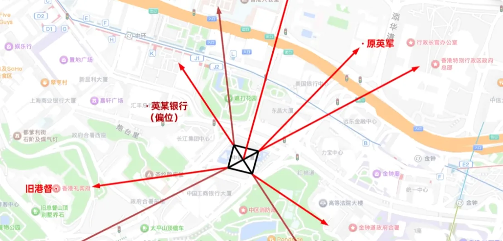

英国某银行这种建筑我经常拿出来讲，之前也专门讲过香港某银行大厦的事情。不过简体中文区的任何建筑我都不好讲，大家体谅体谅。

如果有国外的建筑案例，希望我帮忙看看，大家可以分享到评论区。

刀俎式建筑背后的原理，之前我讲的是：流动的浊气附着在建筑上，最后会在交界处汇聚、挤压并释放出去。

刀锋越尖，煞气越大；体积越大，辐射越广。如果你在生活中遇到了，记得避开锋芒。而且不是避开刀锋的正对面就完事儿了，只要以你的视觉觉得刺眼、锋利，那就是带煞气的，就是能杀你的。

现在我们来做一个思维实验。假如你希望这个建筑的攻击力是两千，但是城市能汇聚到的浊气只有五百，那么力量就要大打折扣，好比打造了一把钝刀。

那么，如何才能确保超载力量显著呢？

>答案是借势。
> 第一种最直接的方式，就是让高级别的超自然力量住进去，这样建筑就拥有强大的浊煞之气。很多高楼里面其实都住着灵界大佬。我去过的一些商场，没修炼过的人可能感受不出来那种大妖大魔趴在整个天花板、盯着大家的感觉。我经常刚走进大门就想赶紧跑，因为太伤人的煞气了。
> 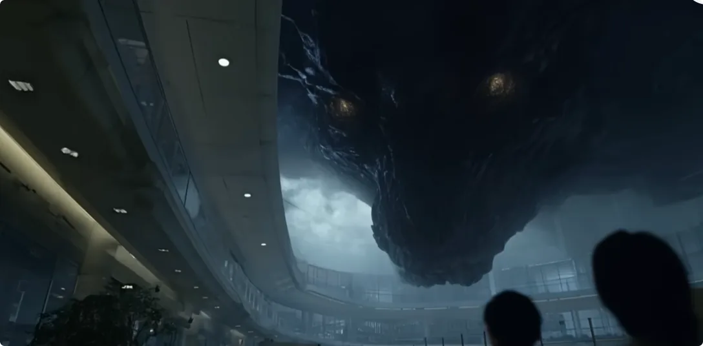
第二种方法，就是使用一些本身就带有浊气的物质去修这个建筑。比如之前我说过的云铁、石雷、金木，这种物品就是普通人经常能接触到的、自带煞气的材料。但还有很多普通人接触不到、带有毒煞之气的化工材料。通过这些材料，把这栋建筑锻造成一把邪刀。
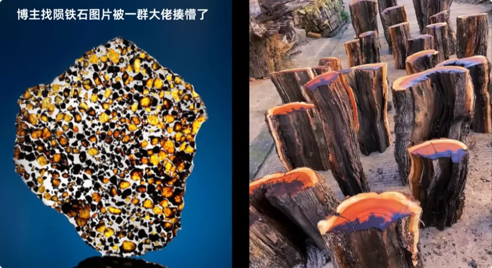

然后，最次的做法就是改变建筑的颜色、形状，比如深色、金属色、阴间造型等，让它们看起来更讨嗜煞成性的阴性生灵喜欢。
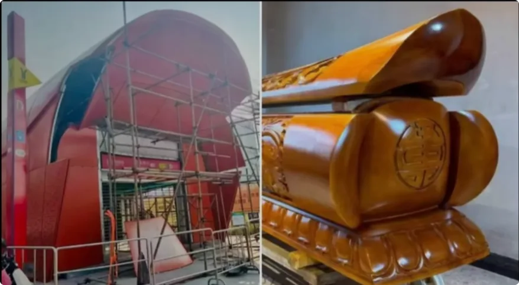

总之，最后这把大邪刀是锻造好了。那这把刀有什么用呢？给谁用呢？

答案是谁得利谁用。

为什么我称之为刀俎式？因为魔为刀俎，人为鱼肉。

大砍刀其实是一个交易的平台。既然是交易，那我们就要理解交易双方的需求是什么。

### 其一，对于超自然力量来说

也就是我一直称呼的灵界大佬。他们跟人不是一个维度，不是一个物种。他们只在意修炼的能量资源，或者说气资源。因为只有切实的能量、切实的气，才能帮助他们爬上灵界的金字塔。

记住我说的是“资源”两个字。资源这个概念意味着什么？大家要认真想想。

>对于无形维度来说，人的生气就是一种不错的能量资源。注意，我说的是不错，不是唯一，也不是最贵。好比煤矿、金矿、稀土矿，人的生气就是煤矿，价值不算高，但体量巨大。

不过，超自然力量想从健康人士身上掠夺生气并非易事。比如之前我们说过，黄赌毒都是一点点让人堕落下去，才能拿到人释放出来的生气。

但是如果能修建一把大砍刀，直接大范围砍下去，刮掉一群人的生气，岂不更有效率？
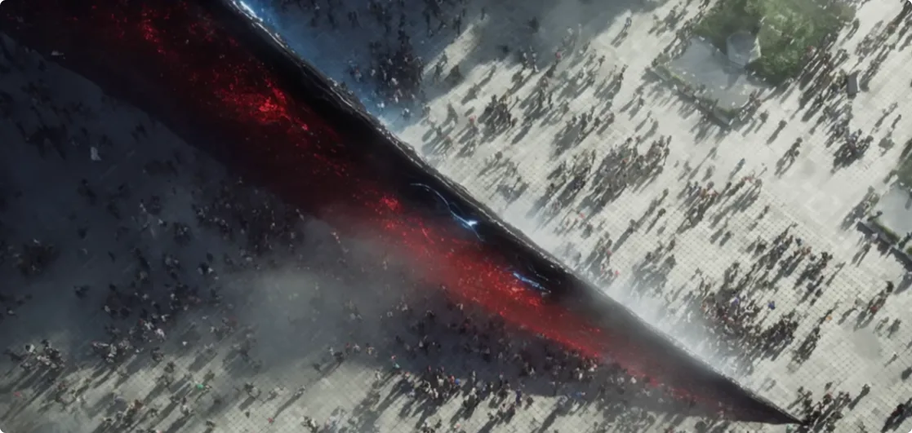

### 其二，对于某些人来说

他们知道有超自然力量存在，知道对方能给自己想要的运势，也知道对方的需求，知道自己能满足对方的需求，那么他们之间肯定是要合作的。
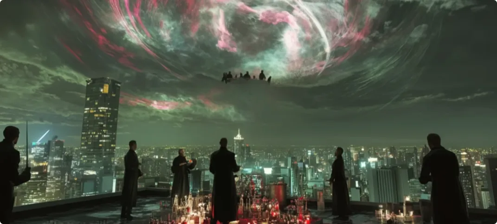

我们不可能要求缺乏道德、正道意识的一群人，去守护什么正邪有别的底线。
人为财死，鸟为食亡。只要存在超自然力量，那么人和超自然力量之间一定有合作，而且一直都有。

大家还要注意的是，合作不是指两个人握手言谈，合作是指一种知识。

什么知识？

与神秘力量建立桥梁的知识，包括：
- 如何联系到对方；
- 如何使用对方的力量；
- 如何确保只有自己能使用对方的力量。

这叫
***通过对无形世界信息差的垄断，实现对有形世界物质资源的垄断。***

听明白了吗？

从古至今都有这样的角色出现，人家从来没有退出历史的舞台，比如大家熟知的共济会、光明会等等。
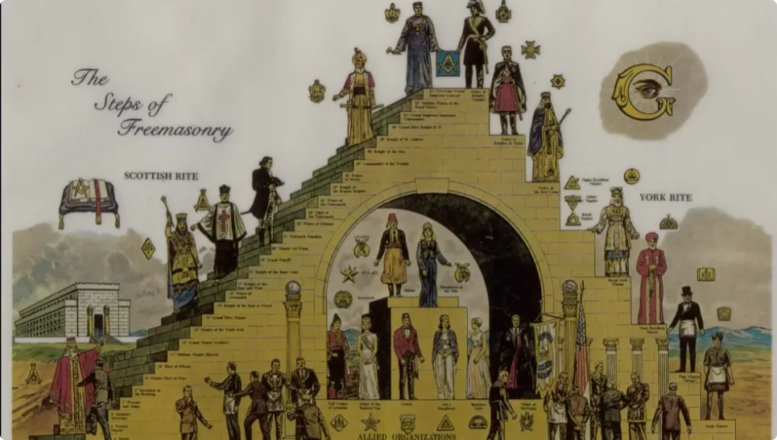

你以为别人是迷信的有神论者，其实是有莫大的利益在里头。这叫人性趋利的丑态，不叫有信仰。

> Man Koman moment die werdie alnoda vertoum mit  
> handling an in.  
> That's was a bregprint.  
> Da Werich gefraged Yeah, ich kode mit?

从古至今，这些知识都不被普通人知晓，因为好事轮不到你，就这么简单。

就基于这么一条简单的底层逻辑，整条链路的实用神秘学知识都完全垄断及关闭。这件事情不难理解？

所以回过头来我们继续说，市面上所谓借运的说法是不准确的，一般都是那些不懂行的商人才信这套说辞。

实际情况是，你得先认识中间人，才能认识到超自然大佬。然后你搭好一个台子，请超自然大佬上桌吃饭。吃饱、吃满意了，他再回头帮衬你，在某些时间节点上保你抓住新的机会，或者渡过难关。

这样，在旁人看来，这就是屹立不倒的好运。
换句话说，所谓帮大佬修建筑、请大佬吃饭，也不过是其中一种交易方式，不占大头。所以对于这第一种建筑范式，我的评价是：**恶毒程度四颗星**。

## 第二种范式：供台式

如果你看到某些像上香的建筑，那你不妨把视野往后再挪一挪，挪到一个视野相对比较正的位置，就能知道是谁在上香、谁在吃这炷香。
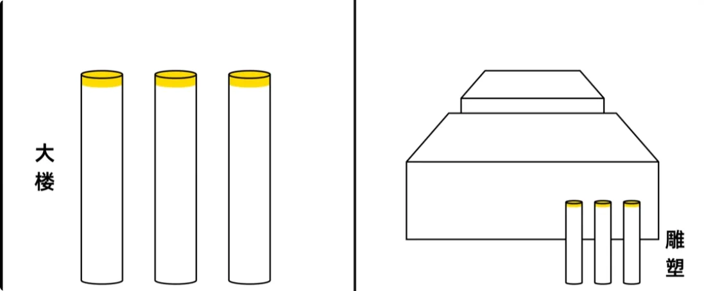

一般来说，被吃掉的可能是这座香形建筑里面的人，也可能是香后面那片区域的人。

不过，目前我看到很多的这种做法，其实都是某些商人的一厢情愿。他们只学了一个样式，自顾自地上香，以为能够以物换物，实际上他们连交易对象都没找到。

所以很多时候这种建筑是无效的，空有一个形，都没有大佬在上桌吃饭。

其次是一些像棺材的建筑。这种建筑确实很阴，背后的道理很简单，就跟人一样：

- 有些人会被潮玩店吸引；
- 有些人会被鬼屋吸引；
- 有些人会被酒吧、夜店吸引。

灵界有那么多千奇百怪的灵体，人家也各有各的喜好。
所以棺材形的建筑确实很吸引一些鬼住进去，但也仅此而已。没有交易对象的话，也是借不到运的。

综上，第二种建筑范式的**恶毒程度为两颗星**。

## 第三种范式：朝拜式

如果一栋大楼、一片小区朝着远处一座庙塔看过去，那么这就是朝拜式建筑。

大家不要以为这样很神圣。之前我就说过，成仙成佛在山上，但不见得在庙观里。

那些香火旺盛的地方，从来都是凡人拿钱祈求超自然力量满足自己的愿望。这些人从来不管是不是真神、正神，反正能实现他的愿望就是好神。

所以那种建筑只能吸引来妖魔鬼怪。

你们上网搜一搜照片，那些地方是不是都黑漆漆、阴森森的，有一种油油的、昏昏沉沉的感觉？这就是典型的魔鬼之气。
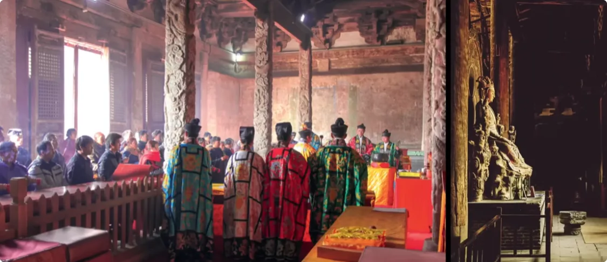

我说得直白点，每一座庙塔至少都有一位灵界大佬坐镇。

接下来我要普及一个神秘学知识。
在神秘学领域，也就是无形的这个世界，视觉线是非常重要的元素。

正是因为在视觉上看到了两个独立的个体之间，才会观察到对方，才会意识到对方，然后产生交互。而且越是在视觉上显眼，越是会引发关注。

好比餐桌上的菜，其他盘子都斜着摆，离你很远或者很偏。唯独有一盘菜，它端正地摆在你的正前方，远近距离都很合适，上面还雕了一朵花，那朵花还朝着你，好像这盘菜就是刻意呈现给你的，你肯定会产生伸手去品尝的冲动。

这就叫视觉上的布局，引发意识上的倾向。

在朝拜式建筑布局里，寺庙和寺塔的位置会更高，经常在山上。当灵界大佬从山上看下去，恰好有一片楼房把阳台、窗户都正对着它，里面的人都看得清清楚楚。

当人的生气从身体剥离的时候，它可以第一时间观察到，并远程牵引、吸收掉，非常方便。
如果这片小区周围刚好有刀俎式建筑，帮忙把人气刮下来，这样就更完美了。

对于这第三种建筑范式，我的评价是：**恶毒程度三颗星**。

## 第四种范式：圈养式

**恶毒程度五颗星。**

这种范式实在太不人性。为了评论区的和谐，恕我只能简单聊聊。
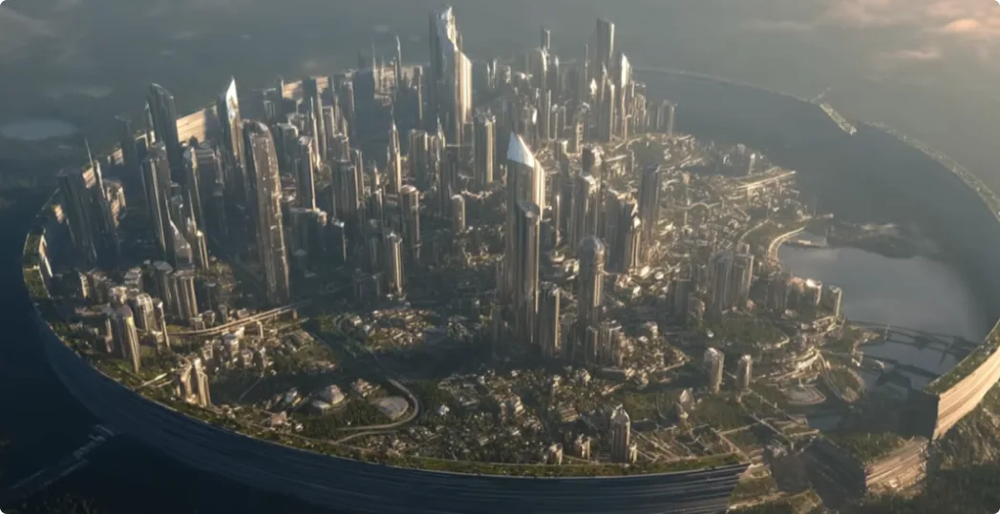

提问：如何让蜗牛在一个地方乖乖待着，跑不出去呢？

>答案是在蜗牛周围撒一圈盐巴，因为盐巴是蜗牛的克星。

但撒盐巴这种方式太直白了，目的昭然若揭，蜗牛们肯定会团结协作，逃离这里。

那么，如何让蜗牛毫无察觉地接触盐巴，既能削弱它们的生命力，让它们跑不动，又能让它们持续创造价值呢？

方法是营造一个看起来适宜的环境，在中间放上新鲜食物，然后偷偷地在泥土中铺上淡盐水。这样蜗牛就能保持虚弱的状态，又不耽误繁衍。最重要的是，它们没有离开故土的动机。

那么，世界上存不存在这样一种针对人的盐巴呢？

>答案是存在的。

我在国外就见过这种地方，是一个小乡村，乡村的中间就是教堂。

当我从中央街道穿过的时候，我的感受是，寂静岭都比这里好。寂静岭的鬼我起码可以应对，可是这满地的危毒，我实在招架不住一点。
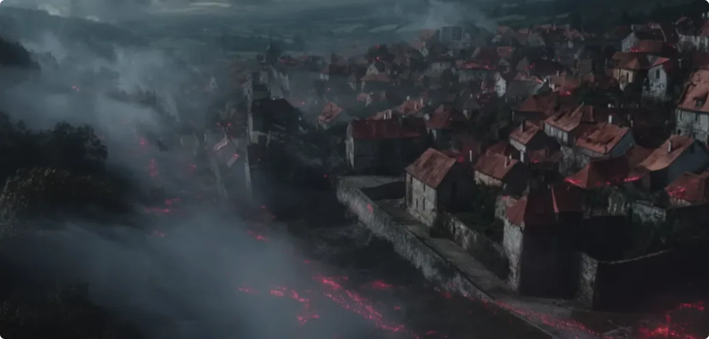

多待一分钟，那天我就算是白修炼了。所以我让司机赶紧带我离开这个地方。

## 第五种范式：阵法式

顾名思义，这套东西只能属于顶级妖魔的本事了。

**恶毒程度有六颗星以上。**

由于里面的东西过于超标，我就简单放几个图片和视频片段好了。各位就当是看玄幻作品，不过我也相信有些商人能看得明白，毕竟接触多了能触类旁通。

## 凡人，被一菜两吃

以上五个建筑范式我就讲完了。

总的来说，**普通人或者说凡人，就是被一菜两吃的。**

你不修行、不修炼，那就是温水煮蛙。
温水煮蛙最后的结局是什么？就是到死都挣扎不了。

生死是你自己的事情，神仙、佛菩萨顶多同情你，但不会干涉你。关键还在于你自己想不想解脱。

之前有人说小叶恐吓大家修行，其实我是真的不在意大家修不修行，因为你的生死大事跟我没有关系。

我很早之前就说过，我引渡人纯粹是出于修行人的情怀，不是针对某个修行人，而是针对修行的集体。

很多人不知道，我邮箱中有很多来信问我怎么修行的人，我都是不回复的。

因为如果你这个人给我第一感觉很不靠谱，那无论你多大咖位、多有才华、多有钱、多有名，我都引渡不了。

因为如果你不是真心的、有觉悟的、准备好修行的人，从根本上讲，你就是还不想解脱。你经受不住后面修行的考验，你一定会回到尘世，我的一切付出都将是打水漂。
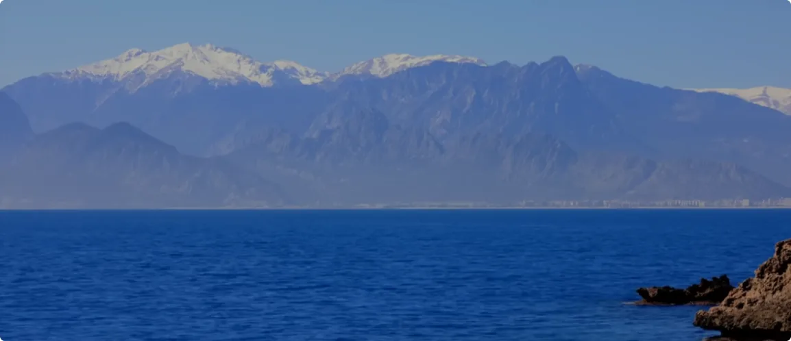

所以不要觉得博主无情。情义是双方的，你未付出、未证明，又怎么能要求陌生人给你情义和重视呢？
最后，我们来给本期视频收个尾。

想必有观众朋友会问，那到底什么建筑住着好呢？

我们不妨看看那些生活得比较好，也就是富人区的房子。它们有一些视觉上的共通点：
- 低矮的楼层；
- 明亮的装修；
- 干净的活水；
- 周边几乎没有高楼大厦。

但是普通人确实住不起，所以还是修行吧。
能分辨出舒适的地方，已经比大多数人好太多了。

我是修炼者小烨，我们下期再见。