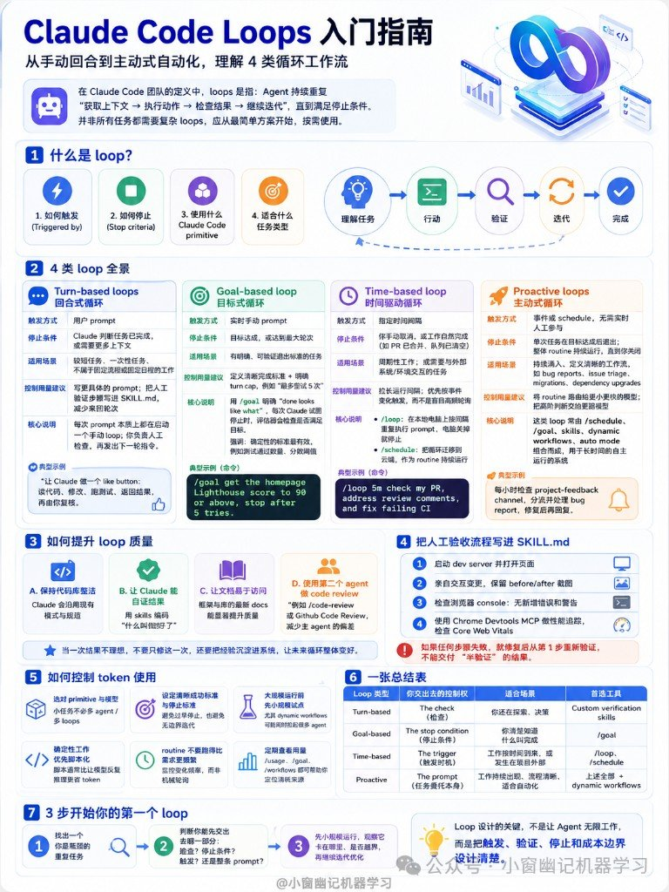

Claude Code 要是只停在「你问一句，它改一次」，那还是聊天窗口。真能扛事的 Agent，会围着目标转圈：拿上下文 → 动手 → 验结果 → 再迭代，直到撞上停止条件。

这张图把 Claude Code Loop 压成一张速查卡——日常开发时翻一眼就够：

- **回合式**：你负责检查
- **目标式**：你交出停止条件
- **时间式**：你交出触发时机
- **主动式**：你交出整条任务流程

顺带覆盖 `/goal`、`/loop`、`/schedule`、SKILL.md、代码审查和 Token 边界。

## Loop 到底在转什么

Agent 持续重复：**获取上下文 → 行动 → 验证 → 迭代**，直到停止条件成立。

简单任务别一上来就上重型循环——先从简单方案开始；真要自动化，再把触发、验证、停止写清楚。

四要素记死：

| 要素 | 管什么 |
|---|---|
| 触发 | 什么时候开始转 |
| 停止条件 | 什么时候准停 |
| Claude Code 原语 | `/goal`、`/loop`、`/schedule`、skills… |
| 任务类型 | 短一次性 / 达标迭代 / 定时巡检 / 无人值守 |

路径同一条：理解任务 → 行动 → 验证 → 迭代 → 完成。

## 四类 Loop：交出的权力不一样

| 类型 | 谁触发 | 何时停 | 原语 | 适合啥 | 你交出什么 |
|---|---|---|---|---|---|
| **回合式** | 用户 prompt | Claude 认为完成，或需要更多上下文 | 普通对话；建议把验证写进 SKILL.md | 短、一次性（例：做个点赞按钮） | **检查** |
| **目标式** | 实时手动 prompt | 目标达成，或达最大回合 | `/goal` | 有明确成功标准的迭代（例：`/goal get homepage Lighthouse ≥90, stop after 5 tries`） | **停止条件** |
| **时间式** | 按时间间隔 | 手动取消，或工作完成 | `/loop`（本地）或 `/schedule`（云） | 定时巡检（例：`/loop 5m check PR...`） | **触发时机** |
| **主动式** | 日程触发，无需实时人工 | 目标 + 日程策略共同约束 | `/schedule` + `/goal` + skills + 动态工作流 | 无人值守（例：每小时检查 feedback 频道） | **整条任务流** |

从左到右，人从「每步盯着」退到「只设计规则」——权力交出去多少，成本与失控面也跟着涨多少。

## 想让 Loop 别瞎转：质量、验收、Token

**提升质量（图上四条）**

1. 代码整洁——乱仓库里循环只会放大乱
2. 自验证 skills——别指望「我觉得好了」当验收
3. 上下文可达——它够不着的文件/环境，再转也白转
4. 双 Agent 审查——一个写、一个挑刺，比单人自嗨稳

**把人工验收写进 SKILL.md**（失败就从第 1 步重来）

- 起 / 盯本地 dev server
- UI 对比（改前改后）
- 看 console 有没有炸
- 有条件就接 Chrome DevTools MCP

验收不进 skill，回合式也会变成「你口头复查」的体力活；进了 skill，目标式 / 主动式才敢放手。

**Token 别被 routine 吃干**

- 小任务用小 loop
- 成功标准写死
- 先 dry run
- 确定性工作优先脚本，别全塞给模型
- routine 别过度频繁
- 用 `/usage` 盯消耗

设计哲学其实就一句：**关键不是让 Agent 无限干活，而是设计好触发、验证、停止条件与成本边界。**

## 三步上手，别一上来就全自动

1. **找瓶颈**——现在卡在检查、停不准、触发烦，还是整条流都得你人肉推？
2. **决定交出哪一段**——对照上表：检查 / 停止条件 / 触发时机 / 整条任务流
3. **小规模试跑**——先短任务、少回合、宽一点的 `/usage` 观察，再收紧节奏

图脚那句够当座右铭：不是无限转，是把边界设计进循环。
