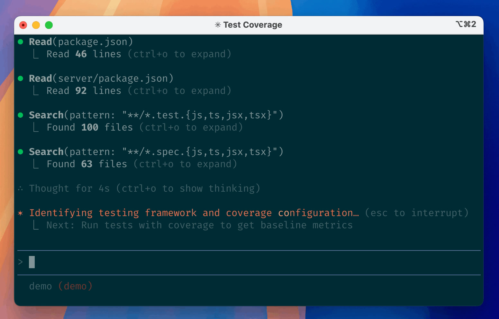

Claude Code 这个工具，这两年的迭代速度是肉眼可见的疯。今天这个版本是 2.1.223，距离它还是 0.2.21 的时候，已经过去了 356 个版本。我把官方变更日志从头到尾翻了一遍，又对照官方文档把它的能力体系拆开看，最后落成这么一份东西：版本是怎么进化到今天的、现在到底有哪些功能模块、每个模块该怎么用、以及放到真实场景里该怎么组合。

先说结论，免得到处找：现在的 Claude Code 早已不是"终端里帮你写代码的助手"，而是一套覆盖 CLI / IDE / 桌面 / 浏览器 / 云端，带多智能体编排、企业级安全治理、可编程 SDK 的 AI 软件开发平台。它最值钱的地方不是某个单点功能，而是这一整套东西咬合起来的能力。

---

## 一、进化史：从终端 REPL 到 AI 原生平台

### 六个阶段，一路从小工具长成平台

| 阶段 | 时间 | 版本区间 | 在干什么 | 标志性能力 |
|---|---|---|---|---|
| ① 早期原型 | 2025-04 ~ 2025-05 | 0.2.21 → 0.2.125 | 把"agent 在终端里干活"这套交互范式定下来 | @-mention 文件、斜杠命令、MCP 客户端、Todo 列表、会话继续/恢复 |
| ② GA 与基座 | 2025-05 ~ 2025-09 | 1.0.0 → 1.0.126 | 正式发布，开始长平台的地基 | Hooks、自定义子代理、TS/Python SDK、权限管理、Windows 原生支持 |
| ③ 界面与生态 | 2025-09 ~ 2025-12 | 2.0.0 → 2.0.76 | 换新 UI，开始做生态 | 原生 VS Code 扩展、Skills、插件系统 + Marketplace、后台 agent、Desktop、Chrome 集成 |
| ④ 多智能体与上下文 | 2026-01 ~ 2026-05 | 2.1.0 → 2.1.98 | 上下文上限突破，多 agent 协作爆发 | 1M 上下文、fast mode、auto-memory、/plan、SendMessage、Agent Teams |
| ⑤ 平台化与后台 | 2026-05 ~ 2026-06 | 2.1.101 → 2.1.169 | 后台体系和企业治理成熟 | agent view、/code-review、动态工作流、Managed Settings |
| ⑥ AI 原生完善期 | 2026-06 ~ 2026-08 | 2.1.170 → 2.1.223 | 前沿模型 + 安全/无障碍收尾 | Fable 5 / Sonnet 5 / Opus 5 原生 1M、子代理默认后台化、Chrome GA |

版本节奏是明显加速的：0.x 到 1.x 是低频打磨，2.1.x 一个段就发了 178 个版本，占总数一半。说明产品从"慢慢做"切换到了"小步快跑、持续交付"。今天你看到的很多能力，都是最近 3 个月里叠出来的。

### 七条贯穿的主线

1. **从单会话到多智能体协作**：从"一个终端对话"到子代理、后台 agent、agent view、动态工作流，再到子代理默认后台化。拐点是 2.0.60（后台 agent）和 2.1.139（agent view）。
2. **从命令行到全端覆盖**：CLI 之外，原生 VS Code 扩展、Desktop 独立应用、浏览器扩展，同一套引擎到处跑。
3. **从本地到云端跨设备**：本地会话 → /teleport 云会话 → 手机 Remote Control，人换设备任务不丢。
4. **从手动点批准到安全默认**：早期全靠人审，后来有自动分级分类器（auto mode）、沙箱隔离、企业策略，2.1.214 之后连续多个版本都在堵权限绕过漏洞。
5. **上下文从固定 200K 到无限会话**：自动压缩（autocompact）让会话"永远聊得下去"，1M 原生窗口再往上抬了一截，最后用自动压缩约束超限。
6. **从裸 CLI 到可编程可管控**：SDK、Hooks、OpenTelemetry、插件市场、企业 managed settings，变成能被组织和程序调用的平台。
7. **从单一模型到模型家族经济学**：Opus / Sonnet / Fable 三代同堂，再加 effort（努力度）和 fast mode（快模式），组成了"速度-智能-成本"的三角开关。

### 几个值得记住的里程碑

| 特性 | 版本 / 日期 | 当时解决什么 |
|---|---|---|
| Hooks | 1.0.38（2025-06-30） | 让自动化动作变成"每次都发生"的强制保障 |
| 自定义子代理 | 1.0.60（2025-07-24） | 任务委托给独立上下文的专业助手，省主会话上下文 |
| SDK | 1.0.23（2025-06-16） | 把整个 agent loop 当库嵌进自己的应用 |
| 插件系统 + Marketplace | 2.0.12（2025-10-09） | 技能/代理/钩子/MCP 打包成可分发单元 |
| Skills | 2.0.20（2025-10-16） | 把反复粘贴的清单沉淀成按需加载的能力 |
| 后台 agent | 2.0.60（2025-12-06） | 关掉终端任务也继续跑 |
| /code-review | 2.1.147（2026-05-21） | 从 /simplify 改名而来，统一"审查-修复-PR 评论"链路 |
| 1M 上下文 | 2.1.50（2026-02-20） | 突破 200K 天花板 |
| fast mode | 2.1.36（2026-02-07） | 约 2 倍费率换 2.5 倍速度 |
| agent view | 2.1.139（2026-05-11） | 单屏管理所有后台会话 |

小提醒：`/teleport` 这个功能，`claude --teleport` 的命令行标志其实 2.0.x 就有了，但作为会话内斜杠命令是 2.1.0 才加的。网上不少资料把这两个搞混。

---

## 二、17 个功能模块逐个说透

这一节是重头戏。每个模块按"是什么 → 能干什么 → 怎么用 → 什么时候用"来讲。

### 1. Skills：把反复粘贴的东西变成一条命令

本质是"按需加载的指令包"。一个技能就是一个目录，里面放一个 `SKILL.md`（带元信息 + 正文说明），目录名就是命令名。比如你在 `.claude/skills/deploy-staging/` 放一个 `SKILL.md`，会话里就能输入 `/deploy-staging` 调用。

最关键的设计是**渐进加载**：技能的简介常驻在上下文里，正文用到才真正加载。这意味着你可以在一个项目里塞几十个技能，但平时几乎不占上下文。适合放"同一套操作贴第三次"的东西：部署清单、PR 审查要点、API 风格规范、团队工作流。

几个控制项值得记：`disable-model-invocation: true` 表示只能人手动调（防止 Claude 自己把部署流程跑了）；`context: fork` 让技能在独立子代理上下文里跑；还能在加载前执行命令把真实输出注入进去（比如先跑个 `git diff`）。官方自带了一批内置技能，包括 `/doctor`、`/code-review`、`/batch`、`/debug`、`/loop`。

### 2. Subagents：独立上下文的专业助手

子代理有自己独立的上下文窗口、独立的系统提示和工具权限，干完只把摘要带回主会话。这是省上下文最重要的工具之一，官方原话"上下文是根本约束时，subagents 是最强大的工具之一"。

内置几个常用的：**Explore**（只读快速研究代码库）、**Plan**（计划模式的研究助手）、**general-purpose**（全工具复杂任务）、**claude**（兜底 + 后台会话默认代理）。你可以自己定义 `.claude/agents/<名字>.md`，指定它的工具白名单、模型（比如用 haiku 省钱）、权限模式。

调用方式有四种：直接说"让 subagent 调研一下 X"、`@agent-名字` 强制指定、整会话切换 `claude --agent 名字`、或者临时定义。嵌套默认 3 层，每会话最多 200 个，并发 20。

2.1.198 之后子代理默认在后台跑，主会话更清爽。`.claude/agents/` 里定义的代理还能指定 `tools:` 限权，这是很强的安全手段——比如审查代理只给只读工具。

### 3. Hooks：让动作"每次都发生"

钩子是生命周期事件的确定性自动化层。区别于 CLAUDE.md 的"建议"性质，hook 是"强制"：只要事件发生，脚本必跑。这是它不可替代的原因。

事件有 30 多种，最常用的是：`SessionStart/End`（会话开始/结束）、`UserPromptSubmit`（用户提交提示词）、`PreToolUse`（工具调用前，可以拦下）、`PostToolUse`、`PermissionRequest`、`Stop`。配置结构是三层：事件 → matcher 组 → handler，写在 `settings.json` 里。

handler 有五种类型：shell 命令、HTTP 调用、调用已连接的 MCP 工具、让 LLM 决策、派子代理。退出码决定行为：0 成功，2 阻塞并把 stderr 喂回给 Claude。

最典型的用法：拦截危险命令（比如 `rm -rf`）、每次编辑后自动格式化/lint、桌面通知、把 CI 结果注入上下文。官方一句点破："想做的事每次都发生，别写在 CLAUDE.md 里，写成 hook。"

### 4. MCP：接到外部世界的万能插头

Model Context Protocol 是 Anthropic 开放的协议，让 Claude 能调用外部工具和数据源。你的项目可以接 Jira、GitHub、Slack、数据库、浏览器、设计稿，什么都有现成服务器。

配置命令很直接：`claude mcp add --transport http notion <url>`。传输方式推荐 http，老旧的 sse 已弃用，本地进程用 stdio（参数用 `--` 分隔）。接进来的工具会以 `mcp__服务器名__工具名` 的格式进 Claude 的工具箱。默认开了 Tool search，闲置服务器几乎不占上下文。

企业环境可以用 managed-mcp 做 allowlist/denylist 白黑名单控制。有意思的是 `claude mcp serve` 能把 Claude Code 自身也暴露成一个 MCP 服务器，别人/别工具也能调它。

### 5. CLAUDE.md：每次会话自动加载的"项目记忆"

这是 Claude 每次会话都会读的持久上下文。四个层级从高到低：企业 managed policy → 个人 `~/.claude/CLAUDE.md` → 项目 `./CLAUDE.md` 或 `./.claude/CLAUDE.md` → 个人项目专属 `CLAUDE.local.md`。会自动向上找目录树，monorepo 里子目录的 CLAUDE.md 按需加载。

放什么？放"Claude 从代码里猜不到的东西"：构建命令、非常规代码风格、测试命令、仓库礼仪、架构决策、环境坑。别放它能自己从代码里推出来的东西。官方建议压到 200 行以内，超长反而会让 Claude 忽略你的真实指令。

配套能力：`@path` 导入其他文件（最深 4 层）、`.claude/rules/` 按文件路径条件加载（省上下文）、`/init` 自动生成初稿、`/context` 验证是否真的加载了。还有 **auto-memory**：Claude 会把学到的构建命令、调试洞察自动写进项目级 memory 目录，`MEMORY.md` 前 200 行每会话自动加载，相当于它自己的"工作记忆"。

### 6. 权限与审批：安全护栏的核心

决定 Claude 什么时候能改文件、跑命令的体系。六种权限模式（Shift+Tab 循环）：

- **default / Manual**：全部询问
- **acceptEdits**：自动批准文件编辑
- **plan**：只读，只能看不能改
- **auto**：独立分类器模型审查动作，自动放行安全的，拦截危险的
- **dontAsk**：只跑预批准的工具
- **bypassPermissions**：全部跳过（最危险，慎用）

细粒度规则可以写成 `permissions.allow / ask / deny`，语法形如 `Bash(git *)`、`Edit(*.ts)`、`Skill(deploy *)`、`Agent(Explore)`。auto mode 里的分类器会默认拦截这类动作：`curl | bash`、`rm -rf /`、强推分支、生产部署、泄漏类推送。拦截次数多了会自动降级回询问模式。还有一些 protected paths（`.git`、`.claude`、`.envrc`）任何模式下都不会自动批准。

### 7. Plan 模式：先想清楚再动手

进 plan 模式后 Claude 只读代码库、写方案，批准后才开始编辑。进入方式：Shift+Tab 切到 plan、单条提示前缀 `/plan`、或启动时 `claude --permission-mode plan`。

Plan 子代理负责调研，研究过程在独立上下文进行，不占主会话。方案给出来后有三种选择：直接用 auto mode 执行、手动逐步批准编辑、继续完善方案。Ctrl+G 能在编辑器里直接改计划。

有个省钱的别名 `opusplan`：计划阶段用 Opus（聪明），执行阶段自动切 Sonnet（便宜）。对"本地计划、云端执行"这种分工模式也很有用。

### 8. Background agents：关掉终端任务照跑

后台代理是没有终端附着的完整会话，由 per-user 的 supervisor 进程托管。启动方式 `claude --bg "提示词"`，会话内 /bg 转后台、/fork 复制成后台新会话。

管理入口是 `claude agents` 打开的 **agent view**，单屏按状态分组显示所有后台会话（需要输入 / 工作中 / 空闲 / 完成 / 失败），每行有 Haiku 生成的摘要。管理命令有 attach、logs、stop、respawn（保留对话重启）、rm。

一个重要的细节：后台会话改文件前会先移进 `.claude/worktrees/` 独立 worktree，并行会话互不干扰。遇到权限询问会进"需要输入"状态，你可以在面板里直接回复。Notification hook 能推送"需要你输入"和"任务完成"的通知。适合长跑测试、隔夜 CI 失败分析、离开电脑任务继续。

### 9. Teleport：把任务从终端搬到云端再搬回来

`claude --cloud "任务"` 会在当前目录的 GitHub 远端上开一个云会话（跑在隔离 VM 里），本地继续干别的；`claude --teleport [id]` 把云会话连同分支、对话历史一起拉回终端。会话里也能用 `/teleport`（简写 /tp）切换。

teleport 有四个前置条件：干净的 git 状态、同一仓库（不能是 fork）、分支已推送、同一个 claude.ai 账户。注意 `--cloud` 需要 claude.ai 订阅。它和 **Remote Control** 互补：teleport 是把任务搬到云端跑，remote control 是把本地会话暴露到手机监控。适合"本地计划 + 云端自主执行"、关笔记本后任务继续跑。

### 10. Agent SDK：把整个 Claude Code 当库用

SDK 让开发者把 Claude Code 的整套能力（工具、agent loop、上下文管理、权限、hooks、subagents、MCP）嵌进自己的应用。官方支持 Python 和 TypeScript，`pip install claude-agent-sdk` / `npm install @anthropic-ai/claude-agent-sdk`。其他语言可以用 `claude -p` 子进程方式驱动同一个 agent loop。

生产级特性很全：结构化输出（JSON Schema / Zod / Pydantic 校验）、实时流式、上千工具的搜索、OpenTelemetry 可观测、会话转录镜像到 S3/Redis、多租户隔离。定位上，CLI 面向人交互式的日常开发，SDK 面向要自己实现编排和权限的自定义 agent 产品。

### 11. 插件系统 + Marketplace：能力的打包分发

插件把 skills / agents / hooks / MCP servers 打包成一个可安装、可版本化的单元。目录结构是 `.claude-plugin/plugin.json` 清单，加上 skills、commands、agents、hooks、.mcp.json、.lsp.json 等子目录。

命名空间机制解决了冲突：插件的技能以 `/插件名:技能名` 形式调用，多插件共存不打架。安装管理用 `/plugin install`、`/plugin marketplace add`，还有 `claude plugin init`（脚手架）和 `claude plugin validate`（提交前校验）。两个官方市场：Anthropic 精选的 `claude-plugins-official` 和社区评审的 `claude-community`。适合团队跨仓库复用同一套配置、社区分发、按语言装代码智能（LSP）插件。

### 12. 会话管理：续上、压缩、分支、回滚

会话全家桶。恢复：`claude --continue`（最近会话）、`claude --resume`（选择器）、`--from-pr <号>`（从某个 PR 关联）。分支：`/branch <名字>` 复制当前会话另起一条，`/subtask` 可以 fork 成后台子代理。

上下文控制：`/clear` 清空重开、`/compact [指令]` 总结腾上下文（可以指定保留什么）、`/context` 可视化查看占用、`/autocompact` 配置自动压缩窗口（100k 到 1M token）。审查回滚：`/diff` 交互查看 diff、`/rewind` 回到检查点（代码和对话都能回滚）。转录存在 `~/.claude/projects/`，默认保留 30 天。worktree 并行用 `--worktree <名字>`，每个 worktree 独立分支和文件。

### 13. 代码审查：从本地自查到云端 PR 审查

`/code-review` 是目前内置的核心审查入口，审当前分支的 diff，聚焦正确性 bug 和复用/简化/效率问题。它可以 `--fix` 直接应用修复、`--comment` 把发现发成 PR 行内评论、`ultra` 升级到云端深度审查。现在它以后台子代理形式运行，不占主会话上下文。2.1.223 起 `/review` 是它的别名，不写等级会复用上次的等级。

云端版 **Code Review**（Team/Enterprise 预览）更强：装上 GitHub App 后，PR 打开、每次 push、或评论 `@claude review` 都会触发，多个 agent 在 Anthropic 基建上并行分析整个代码库，产出行内评论 + check run，严重度分级（🔴 Important / 🟡 Nit / 🟣 Pre-existing），平均 20 分钟左右出结果。仓库根放一个 `REVIEW.md` 可以定制审查规则（压 Nit 数量、跳过生成代码、加仓库特有检查），它会以最高优先级注入每个审查 agent。

### 14. fast mode 与 1M context：速度与容量

两个运行增强。**fast mode**（/fast 切换）用 Opus 的高速配置，响应快至 2.5 倍、质量不降，按 usage credits 计费（$10/$50 每百万 token，不入订阅额度）。开启时终端有 `↯` 图标，触发速率限制会自动降回普通档。适合快速迭代、直播调试。

**1M token 上下文**：Sonnet 5 / Fable 5 / Opus 4.6+ 支持百万级窗口，Max/Team/Enterprise 计划下 Opus 自动升级无需配置。模型名带 `[1m]` 后缀（如 `sonnet[1m]`）。配套 effort 档位（low 到 max）控制推理深度。注意 2.1.223 之后，1M 窗口模型会通过自动压缩被约束回 200K 以内，防止把配额撑爆——这个设计要心里有数。

### 15. IDE 集成：VS Code / JetBrains / Desktop

同一套引擎嵌进编辑器。**VS Code 扩展**功能最全：内联 diff 对比 + 直接改提案、@-mention 带行号选区（`@auth.ts#5-10` 直接引用文件某几行）、plan 以 Markdown 打开可加批注、会话历史恢复、checkpoint rewind、图形化插件管理器、`@browser` 浏览器自动化。**JetBrains 插件**支持 IntelliJ/PyCharm/WebStorm/GoLand/Android Studio，有 IDE diff viewer、选区 + 诊断自动共享、Cmd+Esc 快速唤起。**Desktop 独立应用**提供并行会话窗格、可视化 diff、定时任务、内置浏览器、iOS Simulator 面板。

所有 surface 共享同一套配置：CLAUDE.md、settings、MCP、hooks 全通用，不存在"换个入口配置就丢了"。

### 16. Claude in Chrome：让 Claude 操作你的真实浏览器

装上 Chrome 扩展 + `claude --chrome` 启动（VS Code 里也能直接用），Claude 就能操作你的真实 Chrome/Edge 浏览器。能力包括：导航/点击/输入、读控制台日志和网络请求、截图存盘、填表单、本地文件上传（≤10MB）、GIF 会话录制、结构化数据提取。

最有价值的一点：**共享浏览器登录态**。可以操作已登录的 Google Docs / Gmail / Notion 等，不用配 API connector。遇到登录页或 CAPTCHA 会暂停请你手动处理。plan mode 下区分了只读调用（读页面/截图免提示）和状态改变调用（点击/输入要审批）。支持 Chromium 系浏览器，不支持 WSL。适合本地 Web 应用端到端验证、控制台报错调试、CRM 数据录入自动化。

### 17. 其他值得知道的工程特性

- **`--add-dir`**：追加授予工具访问的工作目录（连带它的 skills）
- **@-mention**：快速引用文件/文件夹/代理/`@browser`/`@terminal`，把选中内容和行号带进上下文
- **monorepo 支持**：`.claude/rules/` 路径化规则、`claudeMdExcludes` 跳过无关团队的 CLAUDE.md
- **CLAUDE_CODE_\* 环境变量家族**：关后台任务、关 auto-memory、调子代理数量上限、关 1M 上下文等，全都可配
- **MCP 开发工具链**：`mcp-server-dev` 插件、`claude mcp serve`、`/mcp` 调试面板
- **诊断**：`--safe-mode`（禁用全部自定义配置排查）、`claude doctor`
- **自动化周边**：`/goal`（持续目标）、`/loop`（循环）、Routines（定时任务）、Channels（外部事件推入会话）、Artifacts（把输出发布成交互网页）
- **辅助**：语音听写、屏幕阅读器、tmux、自定义主题和状态栏

### 交互细节速查：快捷键、前缀命令、Vim 与输出风格

这些是每天都会用到的交互细节，单独背一遍值得。

**键盘快捷键速查**（macOS 的 Option 键需在终端里配置为 Meta 才能用 Alt 系列）：

| 快捷键 | 作用 |
|---|---|
| Ctrl+C | 中断当前操作；无操作时第一次清空输入、第二次退出 |
| Ctrl+D | 退出会话（输入框有文字时改为删除光标后的字符） |
| Ctrl+R | 反向搜索历史（类 bash/zsh） |
| Ctrl+O | 切换 transcript 视图（看工具详情与时间戳） |
| Ctrl+B | 把当前 bash 命令或 agent 后台化 |
| Ctrl+G | 用外部编辑器编辑 prompt |
| Ctrl+S | 暂存 / 恢复当前 prompt |
| Ctrl+T | 切换任务清单 |
| Ctrl+X Ctrl+K | 停止所有后台子代理（3 秒内按两次确认） |
| Shift+Tab | 循环权限模式（default → acceptEdits → plan → auto → bypass） |
| Alt+P / Alt+T / Alt+O | 切模型 / 切 extended thinking / 切 fast mode |

**Quick commands 前缀**（输入框首字符决定行为）：
- `/`：命令 / 技能
- `!`：shell 模式，直接跑命令并把输出带进上下文
- `@`：文件 / 文件夹 / 代理引用
- `:`：emoji 短码（2.1.217 起，如 `:thumbsup:`）
- `?`：空输入时切换快捷键帮助

**多行输入**：`\` + Enter、Shift+Enter、Option+Enter、Ctrl+J 都可以。

**Vim 模式**：`/config → Editor mode` 开启，完整支持 NORMAL / INSERT / VISUAL 与文本对象；2.1.208 起可用 `vimInsertModeRemaps` 把 `jj` 映射成 Esc。

**Output Styles（1.0.81）**：内置 Explanatory、Learning 两种面向教学的输出风格，`/config` 里切换，写教程和自学时很好用。

**其它值得记住的**：`/statusline` 定制状态栏；`/btw` 问侧边问题不占主上下文；2.1.169 起按住空格语音听写。

### 模块是怎么咬合在一起的

一个典型会话把这些模块像齿轮一样转起来：启动时按权限模式加载 CLAUDE.md 记忆，SessionStart 钩子做环境准备，MCP 服务器就位；复杂任务先进 plan 模式让 Plan 子代理隔离研究；执行阶段重复流程交给技能，大型部分委派给子代理或后台 agent；每次工具调用过权限层，PreToolUse 钩子做强制拦截；交付前 `/code-review` 把关；会话用 resume/fork/compact 延续，长任务搬到云端再 teleport 回来；最后规范沉淀进 CLAUDE.md、流程变成技能、成套配置打成插件共享。

说人话的总结：**记忆提供背景，技能和子代理提供能力与隔离，钩子和权限提供纪律，MCP 接外部世界，插件负责分发，SDK 是复用边界，会话/后台/Teleport/IDE 让你无论在哪儿都能继续。**

---

## 三、哪些模块最值得先上

不分场景空谈"哪个最强"没意义，按阶段给建议。

**第一天先用起来的**：核心交互（进项目直接提问、@-引用、贴图）、plan 模式、Esc 停手 / /rewind 回滚 / /clear 重置、`claude --continue`。这个阶段就把 Claude 当"超级结对工程师"用，先不开任何扩展。

**第一周建立基线**：`/init` 生成 CLAUDE.md（补上构建/测试命令）、装 `gh` CLI、配 1-2 个 hook（编辑后 lint / 通知）、装语言对应的 code intelligence 插件、每周固定用一次 `/code-review` 审自己的 diff。CLAUDE.md 压到 200 行以内。

**进阶规模化**：自定义 Skills（/commit、/deploy）、自定义 Subagents（security-reviewer、test-runner）、接 MCP（数据库/Figma/办公套件）、`claude -p` 接 CI + fan-out 批量、worktrees 并行、Writer/Reviewer 双会话、auto mode 无人值守、Agent Teams。

**判断要不要上某功能的铁律**：约定错两次 → 写进 CLAUDE.md；同一个 prompt 贴了三次 → 沉淀成 skill；侧任务刷屏主上下文 → 上 subagent；"想让它每次都发生" → 写成 hook。这套按需加载的思路，比一次性把所有功能堆上更省心。

---

## 四、11 个场景怎么落地

每个场景给出推荐的特性组合和操作步骤，照着做就行。

### 1. 新项目初始化
推荐：plan mode + AskUserQuestion 采访 + /init + Skill + Hook。
1. 新建目录 `git init`，把需求写 3-5 句
2. 启动 claude 说 "Interview me in detail using the AskUserQuestion tool"，让它把需求问透，产出 SPEC.md
3. 开新会话切 plan mode，让它读 SPEC + 空仓，给出技术选型和目录结构计划
4. 审批计划（Ctrl+G 可改），搭骨架：脚手架、依赖、首个可运行 demo
5. `/init` 生成 CLAUDE.md，补上构建/测试命令和约定
6. 建第一个 skill（如 /commit）和第一个 hook（编辑后跑 lint）
7. 写首个测试跑通，验证后提交

### 2. 学习/接管陌生代码库
推荐：Explore/Plan 子代理 + 提问式探索 + CLAUDE.md + /btw。
1. 进项目问 "give me an overview of this codebase"
2. 追问架构模式、数据模型、认证流程
3. 深挖用 "use a subagent to investigate how X works"，读大量文件不进主上下文
4. 让它产出 glossary、依赖关系、调用链，存成项目文档
5. 学新技术栈：把官方文档 URL 给它当导师
6. 把"猜不到"的约定写进 CLAUDE.md

### 3. 大型重构 / 跨文件迁移
推荐：plan mode + subagents 并行 + 验证回路 + worktrees + claude -p fan-out + 对抗式 review。
1. plan mode："refactor X to Y，列出影响文件/依赖/风险，先别改"
2. 用子代理并行调研各模块调用点
3. 审批后小步重构：每改一个模块就跑测试修失败
4. 上千文件走 fan-out：让它生成 files.txt，循环逐文件 `claude -p "Migrate $f" --allowedTools ...`，先试 2-3 个校准 prompt
5. 多人并行用 `claude --worktree <name>` 隔离
6. 收尾 /code-review 对照计划查缺口
7. 提交开 PR（gh）

### 4. 代码审查
推荐：/code-review + 自定义 review 子代理 + Writer/Reviewer 双会话。
1. 改动完跑 `/code-review`，在全新子代理上下文里审当前 diff
2. 逐条修复 findings 再复评一次
3. 安全/性能专项审查用自定义子代理（`@security-reviewer 看 auth 改动`）
4. 关键 PR 用双会话：A 写、B 在干净会话审、输出回灌 A——"新鲜上下文审查无偏见"
5. 团队流程接 GitHub Actions 自动审 PR

### 5. Bug 修复与调试
推荐：症状式 prompt + 先写失败测试 + 子代理隔离 + checkpoint + 截图比对 + auto-memory。
1. 贴症状和复现命令："fix it and verify the build succeeds, address the root cause don't suppress the error"
2. 让它先写能复现 bug 的失败测试
3. 读代码定位根因、修复、跑测试变绿
4. 测试套件很吵："use a subagent to run the tests, report only failures"
5. UI bug 给截图让它比对修复
6. 改砸了 Esc+Esc → /rewind 换路
7. 让根因记入 auto-memory 防复发

### 6. 测试驱动开发
推荐：CLAUDE.md（测试命令）+ 先测试后实现 + /debug + hook。
1. 给需求和测试偏好："write a test for foo.py covering the edge case where the user is logged out, avoid mocks"
2. 先写失败测试（会读你现有测试匹配风格）
3. 最小实现到变绿
4. 让它找遗漏边界："identify edge cases you might have missed"
5. 重构保持全绿
6. 全量测试 + 按约定提交

### 7. 自动化流水线 / CI
推荐：claude -p + --output-format json + Hooks + GitHub Actions + Routines + auto mode。
1. 本地验证 `claude -p "..." --output-format stream-json --verbose` 输出可解析
2. 预提交阶段：hook 每次编辑跑 lint；`git log -20 | claude -p "summarize"` 生成说明
3. GitHub Actions：PR 触发 `claude -p "review the diff, post findings"`
4. 定时任务：云端 Routines / 会话内 /loop / GHA cron，prompt 写清"成功长什么样"
5. 无人值守：`claude --permission-mode auto -p "fix all lint errors"`
6. 复杂多任务用 Agent teams 自动协调

### 8. 文档生成
推荐：Skill（规范）+ CLAUDE.md + @ 引用 + MCP + Artifact。
1. "find functions without proper JSDoc in the auth module" 定位欠文档处
2. "add JSDoc with examples" 指定风格
3. 团队文档规范做成 /docs skill 一键套用
4. "check if the docs follow our standards" 自检一致性
5. README 初稿让 Claude 读代码产出，批量文件 fan-out
6. 交互式输出（时间线/架构图网页）用 Artifact

### 9. 跨库多仓 / 批量任务
推荐：worktrees + claude -p fan-out + --add-dir + --allowedTools + Agent teams。
1. 让 Claude 生成任务清单："list all 2000 Python files that need migrating, save to files.txt"
2. 循环逐项 `claude -p "Migrate $f… Return OK or FAIL" --allowedTools "Edit,Bash(git commit *)"`
3. 先试 2-3 个校准 prompt 再全量
4. 跨仓访问 `claude --add-dir ../shared-config`，并行用 --worktree
5. 需要互相通信分工时升 Agent teams
6. 汇总 OK/FAIL 让 Claude 出总结报告

### 10. 日常 commit / PR 管理
推荐：commit 规范 Skill + gh CLI + CLAUDE.md + commit-msg hook。
1. "summarize the changes I've made to the auth module"
2. 让它按约定生成 Conventional Commit 信息，你审批后提交，**不自动提交**
3. "create a pr" 用 gh 建 PR + 描述 + 风险提示
4. `claude --from-pr 1234` 直接从该 PR 续聊
5. PR 有 review 反馈后 resume 原会话修一轮
6. commit-msg hook 强制提交信息规范

### 11. 视频 / 多模态内容生产【官方+生态】
推荐：图片拖拽 + ChromeDevTools MCP + subagents + 生成类 MCP。
1. 起草分镜表与每镜视觉描述
2. 把参考图拖进会话："Analyze this image / match this design"
3. 为每镜生成图/视频/语音的生成提示词，经生成类 MCP（如 MiniMax）产出素材
4. 各镜并行交给子代理，主会话收摘要拼装
5. 网页/文档类成品用浏览器截图或 Artifact 验证
6. 风格规范沉淀进 CLAUDE.md / skill，下次一键复用

---

## 结尾

把这 356 个版本扒完，最深的感受是：Claude Code 已经不只是一个"写代码的工具"，而是一套让你和 AI 在软件开发的每个环节都能协作的体系。它强在组合：单拎任何模块都有替代品，但把记忆、技能、子代理、钩子、权限、插件、后台、云端串成一个闭环的，目前独一份。

官方文档入口：[code.claude.com/docs](https://code.claude.com/docs)（best-practices、features-overview、skills、sub-agents、hooks、permission-modes 这几个页面最值得先看）。本文数据截止 Claude Code 2.1.223。
