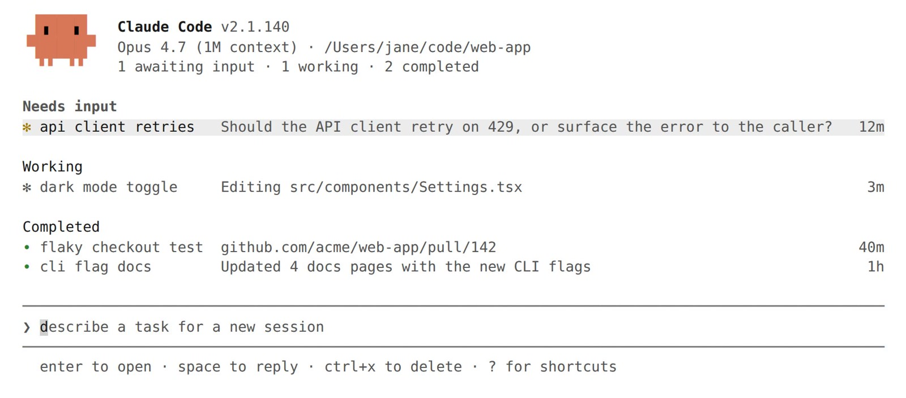
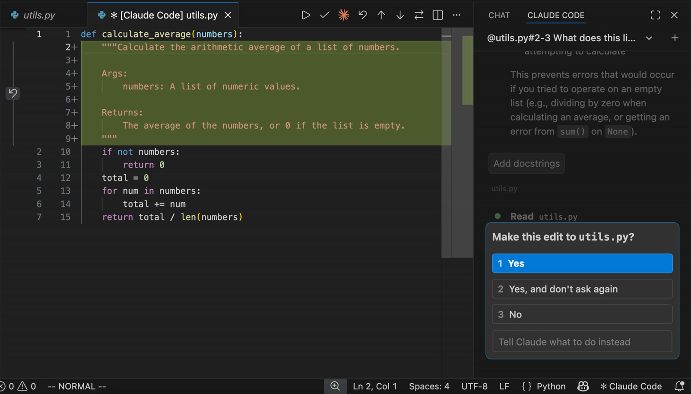
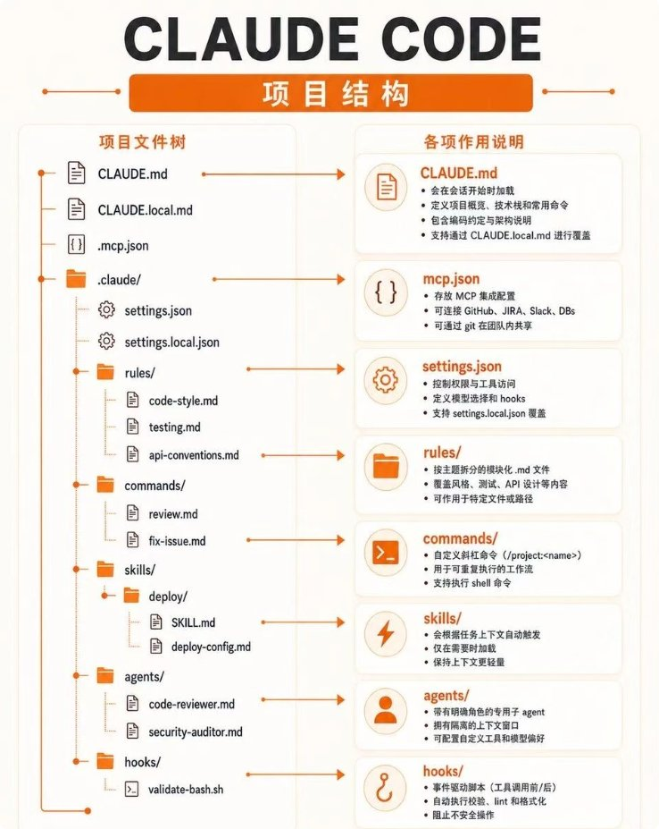
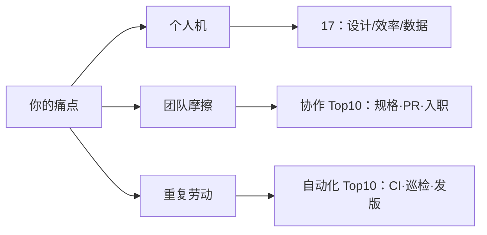
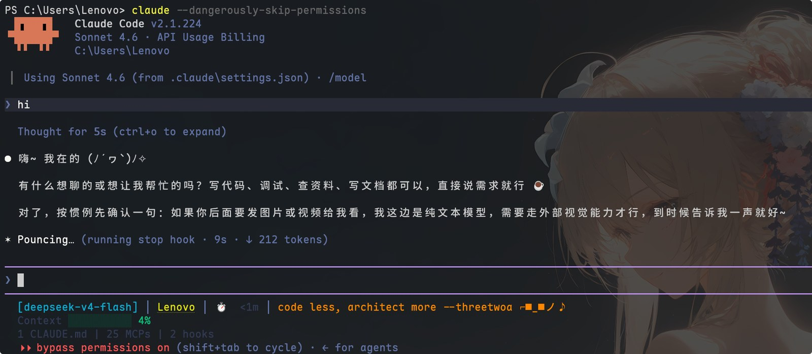
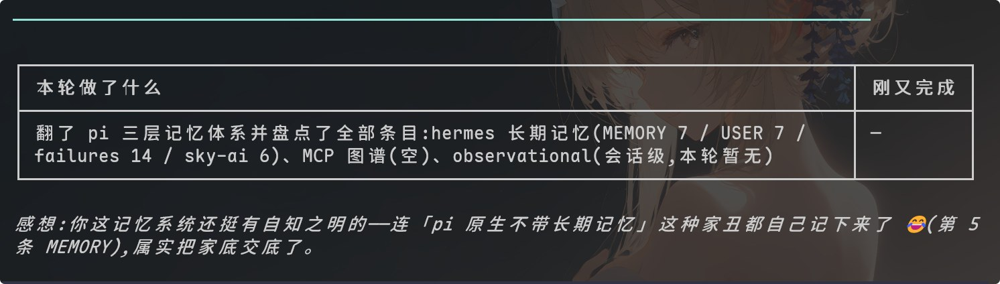
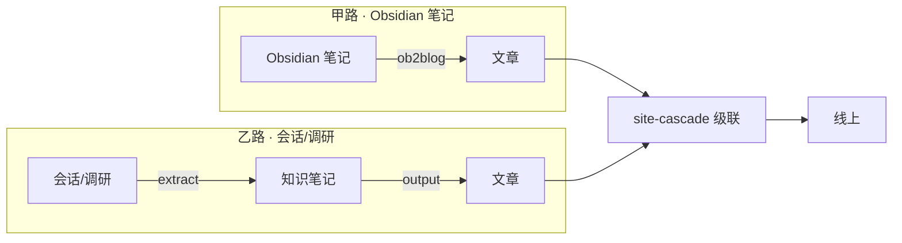

这篇是 **Claude Code 专题合订**：下面每个二级标题来自一篇原笔记的全文（不是空摘要）。按章节翻即可，不必再在站内东点西点。

---

## 能力全景：版本进化与十七大模块

> 合并自原帖 `claude-code-handbook`

Claude Code 这个工具，这两年的迭代速度是肉眼可见的疯。今天这个版本是 2.1.223，距离它还是 0.2.21 的时候，已经过去了 356 个版本。我把官方变更日志从头到尾翻了一遍，又对照官方文档把它的能力体系拆开看，最后落成这么一份东西：版本是怎么进化到今天的、现在到底有哪些功能模块、每个模块该怎么用、以及放到真实场景里该怎么组合。

先说结论，免得到处找：现在的 Claude Code 早已不是"终端里帮你写代码的助手"，而是一套覆盖 CLI / IDE / 桌面 / 浏览器 / 云端，带多智能体编排、企业级安全治理、可编程 SDK 的 AI 软件开发平台。它最值钱的地方不是某个单点功能，而是这一整套东西咬合起来的能力。

---

### 一、进化史：从终端 REPL 到 AI 原生平台

#### 六个阶段，一路从小工具长成平台

| 阶段 | 时间 | 版本区间 | 在干什么 | 标志性能力 |
|---|---|---|---|---|
| ① 早期原型 | 2025-04 ~ 2025-05 | 0.2.21 → 0.2.125 | 把"agent 在终端里干活"这套交互范式定下来 | @-mention 文件、斜杠命令、MCP 客户端、Todo 列表、会话继续/恢复 |
| ② GA 与基座 | 2025-05 ~ 2025-09 | 1.0.0 → 1.0.126 | 正式发布，开始长平台的地基 | Hooks、自定义子代理、TS/Python SDK、权限管理、Windows 原生支持 |
| ③ 界面与生态 | 2025-09 ~ 2025-12 | 2.0.0 → 2.0.76 | 换新 UI，开始做生态 | 原生 VS Code 扩展、Skills、插件系统 + Marketplace、后台 agent、Desktop、Chrome 集成 |
| ④ 多智能体与上下文 | 2026-01 ~ 2026-05 | 2.1.0 → 2.1.98 | 上下文上限突破，多 agent 协作爆发 | 1M 上下文、fast mode、auto-memory、/plan、SendMessage、Agent Teams |
| ⑤ 平台化与后台 | 2026-05 ~ 2026-06 | 2.1.101 → 2.1.169 | 后台体系和企业治理成熟 | agent view、/code-review、动态工作流、Managed Settings |
| ⑥ AI 原生完善期 | 2026-06 ~ 2026-08 | 2.1.170 → 2.1.223 | 前沿模型 + 安全/无障碍收尾 | Fable 5 / Sonnet 5 / Opus 5 原生 1M、子代理默认后台化、Chrome GA |

版本节奏是明显加速的：0.x 到 1.x 是低频打磨，2.1.x 一个段就发了 178 个版本，占总数一半。说明产品从"慢慢做"切换到了"小步快跑、持续交付"。今天你看到的很多能力，都是最近 3 个月里叠出来的。

#### 七条贯穿的主线

1. **从单会话到多智能体协作**：从"一个终端对话"到子代理、后台 agent、agent view、动态工作流，再到子代理默认后台化。拐点是 2.0.60（后台 agent）和 2.1.139（agent view）。
2. **从命令行到全端覆盖**：CLI 之外，原生 VS Code 扩展、Desktop 独立应用、浏览器扩展，同一套引擎到处跑。
3. **从本地到云端跨设备**：本地会话 → /teleport 云会话 → 手机 Remote Control，人换设备任务不丢。
4. **从手动点批准到安全默认**：早期全靠人审，后来有自动分级分类器（auto mode）、沙箱隔离、企业策略，2.1.214 之后连续多个版本都在堵权限绕过漏洞。
5. **上下文从固定 200K 到无限会话**：自动压缩（autocompact）让会话"永远聊得下去"，1M 原生窗口再往上抬了一截，最后用自动压缩约束超限。
6. **从裸 CLI 到可编程可管控**：SDK、Hooks、OpenTelemetry、插件市场、企业 managed settings，变成能被组织和程序调用的平台。
7. **从单一模型到模型家族经济学**：Opus / Sonnet / Fable 三代同堂，再加 effort（努力度）和 fast mode（快模式），组成了"速度-智能-成本"的三角开关。

#### 几个值得记住的里程碑

| 特性 | 版本 / 日期 | 当时解决什么 |
|---|---|---|
| Hooks | 1.0.38（2025-06-30） | 让自动化动作变成"每次都发生"的强制保障 |
| 自定义子代理 | 1.0.60（2025-07-24） | 任务委托给独立上下文的专业助手，省主会话上下文 |
| SDK | 1.0.23（2025-06-16） | 把整个 agent loop 当库嵌进自己的应用 |
| 插件系统 + Marketplace | 2.0.12（2025-10-09） | 技能/代理/钩子/MCP 打包成可分发单元 |
| Skills | 2.0.20（2025-10-16） | 把反复粘贴的清单沉淀成按需加载的能力 |
| 后台 agent | 2.0.60（2025-12-06） | 关掉终端任务也继续跑 |
| /code-review | 2.1.147（2026-05-21） | 从 /simplify 改名而来，统一"审查-修复-PR 评论"链路 |
| 1M 上下文 | 2.1.50（2026-02-20） | 突破 200K 天花板 |
| fast mode | 2.1.36（2026-02-07） | 约 2 倍费率换 2.5 倍速度 |
| agent view | 2.1.139（2026-05-11） | 单屏管理所有后台会话 |

小提醒：`/teleport` 这个功能，`claude --teleport` 的命令行标志其实 2.0.x 就有了，但作为会话内斜杠命令是 2.1.0 才加的。网上不少资料把这两个搞混。

---

### 二、17 个功能模块逐个说透

这一节是重头戏。每个模块按"是什么 → 能干什么 → 怎么用 → 什么时候用"来讲。

#### 1. Skills：把反复粘贴的东西变成一条命令

本质是"按需加载的指令包"。一个技能就是一个目录，里面放一个 `SKILL.md`（带元信息 + 正文说明），目录名就是命令名。比如你在 `.claude/skills/deploy-staging/` 放一个 `SKILL.md`，会话里就能输入 `/deploy-staging` 调用。

最关键的设计是**渐进加载**：技能的简介常驻在上下文里，正文用到才真正加载。这意味着你可以在一个项目里塞几十个技能，但平时几乎不占上下文。适合放"同一套操作贴第三次"的东西：部署清单、PR 审查要点、API 风格规范、团队工作流。

几个控制项值得记：`disable-model-invocation: true` 表示只能人手动调（防止 Claude 自己把部署流程跑了）；`context: fork` 让技能在独立子代理上下文里跑；还能在加载前执行命令把真实输出注入进去（比如先跑个 `git diff`）。官方自带了一批内置技能，包括 `/doctor`、`/code-review`、`/batch`、`/debug`、`/loop`。

#### 2. Subagents：独立上下文的专业助手


子代理有自己独立的上下文窗口、独立的系统提示和工具权限，干完只把摘要带回主会话。这是省上下文最重要的工具之一，官方原话"上下文是根本约束时，subagents 是最强大的工具之一"。

内置几个常用的：**Explore**（只读快速研究代码库）、**Plan**（计划模式的研究助手）、**general-purpose**（全工具复杂任务）、**claude**（兜底 + 后台会话默认代理）。你可以自己定义 `.claude/agents/<名字>.md`，指定它的工具白名单、模型（比如用 haiku 省钱）、权限模式。

调用方式有四种：直接说"让 subagent 调研一下 X"、`@agent-名字` 强制指定、整会话切换 `claude --agent 名字`、或者临时定义。嵌套默认 3 层，每会话最多 200 个，并发 20。

2.1.198 之后子代理默认在后台跑，主会话更清爽。`.claude/agents/` 里定义的代理还能指定 `tools:` 限权，这是很强的安全手段——比如审查代理只给只读工具。

#### 3. Hooks：让动作"每次都发生"

钩子是生命周期事件的确定性自动化层。区别于 CLAUDE.md 的"建议"性质，hook 是"强制"：只要事件发生，脚本必跑。这是它不可替代的原因。

事件有 30 多种，最常用的是：`SessionStart/End`（会话开始/结束）、`UserPromptSubmit`（用户提交提示词）、`PreToolUse`（工具调用前，可以拦下）、`PostToolUse`、`PermissionRequest`、`Stop`。配置结构是三层：事件 → matcher 组 → handler，写在 `settings.json` 里。

handler 有五种类型：shell 命令、HTTP 调用、调用已连接的 MCP 工具、让 LLM 决策、派子代理。退出码决定行为：0 成功，2 阻塞并把 stderr 喂回给 Claude。

最典型的用法：拦截危险命令（比如 `rm -rf`）、每次编辑后自动格式化/lint、桌面通知、把 CI 结果注入上下文。官方一句点破："想做的事每次都发生，别写在 CLAUDE.md 里，写成 hook。"

#### 4. MCP：接到外部世界的万能插头

Model Context Protocol 是 Anthropic 开放的协议，让 Claude 能调用外部工具和数据源。你的项目可以接 Jira、GitHub、Slack、数据库、浏览器、设计稿，什么都有现成服务器。

配置命令很直接：`claude mcp add --transport http notion <url>`。传输方式推荐 http，老旧的 sse 已弃用，本地进程用 stdio（参数用 `--` 分隔）。接进来的工具会以 `mcp__服务器名__工具名` 的格式进 Claude 的工具箱。默认开了 Tool search，闲置服务器几乎不占上下文。

企业环境可以用 managed-mcp 做 allowlist/denylist 白黑名单控制。有意思的是 `claude mcp serve` 能把 Claude Code 自身也暴露成一个 MCP 服务器，别人/别工具也能调它。

#### 5. CLAUDE.md：每次会话自动加载的"项目记忆"

这是 Claude 每次会话都会读的持久上下文。四个层级从高到低：企业 managed policy → 个人 `~/.claude/CLAUDE.md` → 项目 `./CLAUDE.md` 或 `./.claude/CLAUDE.md` → 个人项目专属 `CLAUDE.local.md`。会自动向上找目录树，monorepo 里子目录的 CLAUDE.md 按需加载。

放什么？放"Claude 从代码里猜不到的东西"：构建命令、非常规代码风格、测试命令、仓库礼仪、架构决策、环境坑。别放它能自己从代码里推出来的东西。官方建议压到 200 行以内，超长反而会让 Claude 忽略你的真实指令。

配套能力：`@path` 导入其他文件（最深 4 层）、`.claude/rules/` 按文件路径条件加载（省上下文）、`/init` 自动生成初稿、`/context` 验证是否真的加载了。还有 **auto-memory**：Claude 会把学到的构建命令、调试洞察自动写进项目级 memory 目录，`MEMORY.md` 前 200 行每会话自动加载，相当于它自己的"工作记忆"。

#### 6. 权限与审批：安全护栏的核心

决定 Claude 什么时候能改文件、跑命令的体系。六种权限模式（Shift+Tab 循环）：

- **default / Manual**：全部询问
- **acceptEdits**：自动批准文件编辑
- **plan**：只读，只能看不能改
- **auto**：独立分类器模型审查动作，自动放行安全的，拦截危险的
- **dontAsk**：只跑预批准的工具
- **bypassPermissions**：全部跳过（最危险，慎用）

细粒度规则可以写成 `permissions.allow / ask / deny`，语法形如 `Bash(git *)`、`Edit(*.ts)`、`Skill(deploy *)`、`Agent(Explore)`。auto mode 里的分类器会默认拦截这类动作：`curl | bash`、`rm -rf /`、强推分支、生产部署、泄漏类推送。拦截次数多了会自动降级回询问模式。还有一些 protected paths（`.git`、`.claude`、`.envrc`）任何模式下都不会自动批准。

#### 7. Plan 模式：先想清楚再动手

进 plan 模式后 Claude 只读代码库、写方案，批准后才开始编辑。进入方式：Shift+Tab 切到 plan、单条提示前缀 `/plan`、或启动时 `claude --permission-mode plan`。

Plan 子代理负责调研，研究过程在独立上下文进行，不占主会话。方案给出来后有三种选择：直接用 auto mode 执行、手动逐步批准编辑、继续完善方案。Ctrl+G 能在编辑器里直接改计划。

有个省钱的别名 `opusplan`：计划阶段用 Opus（聪明），执行阶段自动切 Sonnet（便宜）。对"本地计划、云端执行"这种分工模式也很有用。

#### 8. Background agents：关掉终端任务照跑



后台代理是没有终端附着的完整会话，由 per-user 的 supervisor 进程托管。启动方式 `claude --bg "提示词"`，会话内 /bg 转后台、/fork 复制成后台新会话。

管理入口是 `claude agents` 打开的 **agent view**，单屏按状态分组显示所有后台会话（需要输入 / 工作中 / 空闲 / 完成 / 失败），每行有 Haiku 生成的摘要。管理命令有 attach、logs、stop、respawn（保留对话重启）、rm。

一个重要的细节：后台会话改文件前会先移进 `.claude/worktrees/` 独立 worktree，并行会话互不干扰。遇到权限询问会进"需要输入"状态，你可以在面板里直接回复。Notification hook 能推送"需要你输入"和"任务完成"的通知。适合长跑测试、隔夜 CI 失败分析、离开电脑任务继续。

#### 9. Teleport：把任务从终端搬到云端再搬回来

`claude --cloud "任务"` 会在当前目录的 GitHub 远端上开一个云会话（跑在隔离 VM 里），本地继续干别的；`claude --teleport [id]` 把云会话连同分支、对话历史一起拉回终端。会话里也能用 `/teleport`（简写 /tp）切换。

teleport 有四个前置条件：干净的 git 状态、同一仓库（不能是 fork）、分支已推送、同一个 claude.ai 账户。注意 `--cloud` 需要 claude.ai 订阅。它和 **Remote Control** 互补：teleport 是把任务搬到云端跑，remote control 是把本地会话暴露到手机监控。适合"本地计划 + 云端自主执行"、关笔记本后任务继续跑。

#### 10. Agent SDK：把整个 Claude Code 当库用

SDK 让开发者把 Claude Code 的整套能力（工具、agent loop、上下文管理、权限、hooks、subagents、MCP）嵌进自己的应用。官方支持 Python 和 TypeScript，`pip install claude-agent-sdk` / `npm install @anthropic-ai/claude-agent-sdk`。其他语言可以用 `claude -p` 子进程方式驱动同一个 agent loop。

生产级特性很全：结构化输出（JSON Schema / Zod / Pydantic 校验）、实时流式、上千工具的搜索、OpenTelemetry 可观测、会话转录镜像到 S3/Redis、多租户隔离。定位上，CLI 面向人交互式的日常开发，SDK 面向要自己实现编排和权限的自定义 agent 产品。

#### 11. 插件系统 + Marketplace：能力的打包分发

插件把 skills / agents / hooks / MCP servers 打包成一个可安装、可版本化的单元。目录结构是 `.claude-plugin/plugin.json` 清单，加上 skills、commands、agents、hooks、.mcp.json、.lsp.json 等子目录。

命名空间机制解决了冲突：插件的技能以 `/插件名:技能名` 形式调用，多插件共存不打架。安装管理用 `/plugin install`、`/plugin marketplace add`，还有 `claude plugin init`（脚手架）和 `claude plugin validate`（提交前校验）。两个官方市场：Anthropic 精选的 `claude-plugins-official` 和社区评审的 `claude-community`。适合团队跨仓库复用同一套配置、社区分发、按语言装代码智能（LSP）插件。

#### 12. 会话管理：续上、压缩、分支、回滚

会话全家桶。恢复：`claude --continue`（最近会话）、`claude --resume`（选择器）、`--from-pr <号>`（从某个 PR 关联）。分支：`/branch <名字>` 复制当前会话另起一条，`/subtask` 可以 fork 成后台子代理。

上下文控制：`/clear` 清空重开、`/compact [指令]` 总结腾上下文（可以指定保留什么）、`/context` 可视化查看占用、`/autocompact` 配置自动压缩窗口（100k 到 1M token）。审查回滚：`/diff` 交互查看 diff、`/rewind` 回到检查点（代码和对话都能回滚）。转录存在 `~/.claude/projects/`，默认保留 30 天。worktree 并行用 `--worktree <名字>`，每个 worktree 独立分支和文件。

#### 13. 代码审查：从本地自查到云端 PR 审查

`/code-review` 是目前内置的核心审查入口，审当前分支的 diff，聚焦正确性 bug 和复用/简化/效率问题。它可以 `--fix` 直接应用修复、`--comment` 把发现发成 PR 行内评论、`ultra` 升级到云端深度审查。现在它以后台子代理形式运行，不占主会话上下文。2.1.223 起 `/review` 是它的别名，不写等级会复用上次的等级。

云端版 **Code Review**（Team/Enterprise 预览）更强：装上 GitHub App 后，PR 打开、每次 push、或评论 `@claude review` 都会触发，多个 agent 在 Anthropic 基建上并行分析整个代码库，产出行内评论 + check run，严重度分级（🔴 Important / 🟡 Nit / 🟣 Pre-existing），平均 20 分钟左右出结果。仓库根放一个 `REVIEW.md` 可以定制审查规则（压 Nit 数量、跳过生成代码、加仓库特有检查），它会以最高优先级注入每个审查 agent。

#### 14. fast mode 与 1M context：速度与容量

两个运行增强。**fast mode**（/fast 切换）用 Opus 的高速配置，响应快至 2.5 倍、质量不降，按 usage credits 计费（$10/$50 每百万 token，不入订阅额度）。开启时终端有 `↯` 图标，触发速率限制会自动降回普通档。适合快速迭代、直播调试。

**1M token 上下文**：Sonnet 5 / Fable 5 / Opus 4.6+ 支持百万级窗口，Max/Team/Enterprise 计划下 Opus 自动升级无需配置。模型名带 `[1m]` 后缀（如 `sonnet[1m]`）。配套 effort 档位（low 到 max）控制推理深度。注意 2.1.223 之后，1M 窗口模型会通过自动压缩被约束回 200K 以内，防止把配额撑爆——这个设计要心里有数。

#### 15. IDE 集成：VS Code / JetBrains / Desktop



同一套引擎嵌进编辑器。**VS Code 扩展**功能最全：内联 diff 对比 + 直接改提案、@-mention 带行号选区（`@auth.ts#5-10` 直接引用文件某几行）、plan 以 Markdown 打开可加批注、会话历史恢复、checkpoint rewind、图形化插件管理器、`@browser` 浏览器自动化。**JetBrains 插件**支持 IntelliJ/PyCharm/WebStorm/GoLand/Android Studio，有 IDE diff viewer、选区 + 诊断自动共享、Cmd+Esc 快速唤起。**Desktop 独立应用**提供并行会话窗格、可视化 diff、定时任务、内置浏览器、iOS Simulator 面板。

所有 surface 共享同一套配置：CLAUDE.md、settings、MCP、hooks 全通用，不存在"换个入口配置就丢了"。

#### 16. Claude in Chrome：让 Claude 操作你的真实浏览器

装上 Chrome 扩展 + `claude --chrome` 启动（VS Code 里也能直接用），Claude 就能操作你的真实 Chrome/Edge 浏览器。能力包括：导航/点击/输入、读控制台日志和网络请求、截图存盘、填表单、本地文件上传（≤10MB）、GIF 会话录制、结构化数据提取。

最有价值的一点：**共享浏览器登录态**。可以操作已登录的 Google Docs / Gmail / Notion 等，不用配 API connector。遇到登录页或 CAPTCHA 会暂停请你手动处理。plan mode 下区分了只读调用（读页面/截图免提示）和状态改变调用（点击/输入要审批）。支持 Chromium 系浏览器，不支持 WSL。适合本地 Web 应用端到端验证、控制台报错调试、CRM 数据录入自动化。

#### 17. 其他值得知道的工程特性

- **`--add-dir`**：追加授予工具访问的工作目录（连带它的 skills）
- **@-mention**：快速引用文件/文件夹/代理/`@browser`/`@terminal`，把选中内容和行号带进上下文
- **monorepo 支持**：`.claude/rules/` 路径化规则、`claudeMdExcludes` 跳过无关团队的 CLAUDE.md
- **CLAUDE_CODE_\* 环境变量家族**：关后台任务、关 auto-memory、调子代理数量上限、关 1M 上下文等，全都可配
- **MCP 开发工具链**：`mcp-server-dev` 插件、`claude mcp serve`、`/mcp` 调试面板
- **诊断**：`--safe-mode`（禁用全部自定义配置排查）、`claude doctor`
- **自动化周边**：`/goal`（持续目标）、`/loop`（循环）、Routines（定时任务）、Channels（外部事件推入会话）、Artifacts（把输出发布成交互网页）
- **辅助**：语音听写、屏幕阅读器、tmux、自定义主题和状态栏

#### 交互细节速查：快捷键、前缀命令、Vim 与输出风格

这些是每天都会用到的交互细节，单独背一遍值得。

**键盘快捷键速查**（macOS 的 Option 键需在终端里配置为 Meta 才能用 Alt 系列）：

| 快捷键 | 作用 |
|---|---|
| Ctrl+C | 中断当前操作；无操作时第一次清空输入、第二次退出 |
| Ctrl+D | 退出会话（输入框有文字时改为删除光标后的字符） |
| Ctrl+R | 反向搜索历史（类 bash/zsh） |
| Ctrl+O | 切换 transcript 视图（看工具详情与时间戳） |
| Ctrl+B | 把当前 bash 命令或 agent 后台化 |
| Ctrl+G | 用外部编辑器编辑 prompt |
| Ctrl+S | 暂存 / 恢复当前 prompt |
| Ctrl+T | 切换任务清单 |
| Ctrl+X Ctrl+K | 停止所有后台子代理（3 秒内按两次确认） |
| Shift+Tab | 循环权限模式（default → acceptEdits → plan → auto → bypass） |
| Alt+P / Alt+T / Alt+O | 切模型 / 切 extended thinking / 切 fast mode |

**Quick commands 前缀**（输入框首字符决定行为）：
- `/`：命令 / 技能
- `!`：shell 模式，直接跑命令并把输出带进上下文
- `@`：文件 / 文件夹 / 代理引用
- `:`：emoji 短码（2.1.217 起，如 `:thumbsup:`）
- `?`：空输入时切换快捷键帮助

**多行输入**：`\` + Enter、Shift+Enter、Option+Enter、Ctrl+J 都可以。

**Vim 模式**：`/config → Editor mode` 开启，完整支持 NORMAL / INSERT / VISUAL 与文本对象；2.1.208 起可用 `vimInsertModeRemaps` 把 `jj` 映射成 Esc。

**Output Styles（1.0.81）**：内置 Explanatory、Learning 两种面向教学的输出风格，`/config` 里切换，写教程和自学时很好用。

**其它值得记住的**：`/statusline` 定制状态栏；`/btw` 问侧边问题不占主上下文；2.1.169 起按住空格语音听写。

#### 模块是怎么咬合在一起的

一个典型会话把这些模块像齿轮一样转起来：启动时按权限模式加载 CLAUDE.md 记忆，SessionStart 钩子做环境准备，MCP 服务器就位；复杂任务先进 plan 模式让 Plan 子代理隔离研究；执行阶段重复流程交给技能，大型部分委派给子代理或后台 agent；每次工具调用过权限层，PreToolUse 钩子做强制拦截；交付前 `/code-review` 把关；会话用 resume/fork/compact 延续，长任务搬到云端再 teleport 回来；最后规范沉淀进 CLAUDE.md、流程变成技能、成套配置打成插件共享。

说人话的总结：**记忆提供背景，技能和子代理提供能力与隔离，钩子和权限提供纪律，MCP 接外部世界，插件负责分发，SDK 是复用边界，会话/后台/Teleport/IDE 让你无论在哪儿都能继续。**

---

### 三、哪些模块最值得先上

不分场景空谈"哪个最强"没意义，按阶段给建议。

**第一天先用起来的**：核心交互（进项目直接提问、@-引用、贴图）、plan 模式、Esc 停手 / /rewind 回滚 / /clear 重置、`claude --continue`。这个阶段就把 Claude 当"超级结对工程师"用，先不开任何扩展。

**第一周建立基线**：`/init` 生成 CLAUDE.md（补上构建/测试命令）、装 `gh` CLI、配 1-2 个 hook（编辑后 lint / 通知）、装语言对应的 code intelligence 插件、每周固定用一次 `/code-review` 审自己的 diff。CLAUDE.md 压到 200 行以内。

**进阶规模化**：自定义 Skills（/commit、/deploy）、自定义 Subagents（security-reviewer、test-runner）、接 MCP（数据库/Figma/办公套件）、`claude -p` 接 CI + fan-out 批量、worktrees 并行、Writer/Reviewer 双会话、auto mode 无人值守、Agent Teams。

**判断要不要上某功能的铁律**：约定错两次 → 写进 CLAUDE.md；同一个 prompt 贴了三次 → 沉淀成 skill；侧任务刷屏主上下文 → 上 subagent；"想让它每次都发生" → 写成 hook。这套按需加载的思路，比一次性把所有功能堆上更省心。

---

### 四、11 个场景怎么落地

每个场景给出推荐的特性组合和操作步骤，照着做就行。

#### 1. 新项目初始化
推荐：plan mode + AskUserQuestion 采访 + /init + Skill + Hook。
1. 新建目录 `git init`，把需求写 3-5 句
2. 启动 claude 说 "Interview me in detail using the AskUserQuestion tool"，让它把需求问透，产出 SPEC.md
3. 开新会话切 plan mode，让它读 SPEC + 空仓，给出技术选型和目录结构计划
4. 审批计划（Ctrl+G 可改），搭骨架：脚手架、依赖、首个可运行 demo
5. `/init` 生成 CLAUDE.md，补上构建/测试命令和约定
6. 建第一个 skill（如 /commit）和第一个 hook（编辑后跑 lint）
7. 写首个测试跑通，验证后提交

#### 2. 学习/接管陌生代码库
推荐：Explore/Plan 子代理 + 提问式探索 + CLAUDE.md + /btw。
1. 进项目问 "give me an overview of this codebase"
2. 追问架构模式、数据模型、认证流程
3. 深挖用 "use a subagent to investigate how X works"，读大量文件不进主上下文
4. 让它产出 glossary、依赖关系、调用链，存成项目文档
5. 学新技术栈：把官方文档 URL 给它当导师
6. 把"猜不到"的约定写进 CLAUDE.md

#### 3. 大型重构 / 跨文件迁移
推荐：plan mode + subagents 并行 + 验证回路 + worktrees + claude -p fan-out + 对抗式 review。
1. plan mode："refactor X to Y，列出影响文件/依赖/风险，先别改"
2. 用子代理并行调研各模块调用点
3. 审批后小步重构：每改一个模块就跑测试修失败
4. 上千文件走 fan-out：让它生成 files.txt，循环逐文件 `claude -p "Migrate $f" --allowedTools ...`，先试 2-3 个校准 prompt
5. 多人并行用 `claude --worktree <name>` 隔离
6. 收尾 /code-review 对照计划查缺口
7. 提交开 PR（gh）

#### 4. 代码审查
推荐：/code-review + 自定义 review 子代理 + Writer/Reviewer 双会话。
1. 改动完跑 `/code-review`，在全新子代理上下文里审当前 diff
2. 逐条修复 findings 再复评一次
3. 安全/性能专项审查用自定义子代理（`@security-reviewer 看 auth 改动`）
4. 关键 PR 用双会话：A 写、B 在干净会话审、输出回灌 A——"新鲜上下文审查无偏见"
5. 团队流程接 GitHub Actions 自动审 PR

#### 5. Bug 修复与调试
推荐：症状式 prompt + 先写失败测试 + 子代理隔离 + checkpoint + 截图比对 + auto-memory。
1. 贴症状和复现命令："fix it and verify the build succeeds, address the root cause don't suppress the error"
2. 让它先写能复现 bug 的失败测试
3. 读代码定位根因、修复、跑测试变绿
4. 测试套件很吵："use a subagent to run the tests, report only failures"
5. UI bug 给截图让它比对修复
6. 改砸了 Esc+Esc → /rewind 换路
7. 让根因记入 auto-memory 防复发

#### 6. 测试驱动开发
推荐：CLAUDE.md（测试命令）+ 先测试后实现 + /debug + hook。
1. 给需求和测试偏好："write a test for foo.py covering the edge case where the user is logged out, avoid mocks"
2. 先写失败测试（会读你现有测试匹配风格）
3. 最小实现到变绿
4. 让它找遗漏边界："identify edge cases you might have missed"
5. 重构保持全绿
6. 全量测试 + 按约定提交

#### 7. 自动化流水线 / CI
推荐：claude -p + --output-format json + Hooks + GitHub Actions + Routines + auto mode。
1. 本地验证 `claude -p "..." --output-format stream-json --verbose` 输出可解析
2. 预提交阶段：hook 每次编辑跑 lint；`git log -20 | claude -p "summarize"` 生成说明
3. GitHub Actions：PR 触发 `claude -p "review the diff, post findings"`
4. 定时任务：云端 Routines / 会话内 /loop / GHA cron，prompt 写清"成功长什么样"
5. 无人值守：`claude --permission-mode auto -p "fix all lint errors"`
6. 复杂多任务用 Agent teams 自动协调

#### 8. 文档生成
推荐：Skill（规范）+ CLAUDE.md + @ 引用 + MCP + Artifact。
1. "find functions without proper JSDoc in the auth module" 定位欠文档处
2. "add JSDoc with examples" 指定风格
3. 团队文档规范做成 /docs skill 一键套用
4. "check if the docs follow our standards" 自检一致性
5. README 初稿让 Claude 读代码产出，批量文件 fan-out
6. 交互式输出（时间线/架构图网页）用 Artifact

#### 9. 跨库多仓 / 批量任务
推荐：worktrees + claude -p fan-out + --add-dir + --allowedTools + Agent teams。
1. 让 Claude 生成任务清单："list all 2000 Python files that need migrating, save to files.txt"
2. 循环逐项 `claude -p "Migrate $f… Return OK or FAIL" --allowedTools "Edit,Bash(git commit *)"`
3. 先试 2-3 个校准 prompt 再全量
4. 跨仓访问 `claude --add-dir ../shared-config`，并行用 --worktree
5. 需要互相通信分工时升 Agent teams
6. 汇总 OK/FAIL 让 Claude 出总结报告

#### 10. 日常 commit / PR 管理
推荐：commit 规范 Skill + gh CLI + CLAUDE.md + commit-msg hook。
1. "summarize the changes I've made to the auth module"
2. 让它按约定生成 Conventional Commit 信息，你审批后提交，**不自动提交**
3. "create a pr" 用 gh 建 PR + 描述 + 风险提示
4. `claude --from-pr 1234` 直接从该 PR 续聊
5. PR 有 review 反馈后 resume 原会话修一轮
6. commit-msg hook 强制提交信息规范

#### 11. 视频 / 多模态内容生产【官方+生态】
推荐：图片拖拽 + ChromeDevTools MCP + subagents + 生成类 MCP。
1. 起草分镜表与每镜视觉描述
2. 把参考图拖进会话："Analyze this image / match this design"
3. 为每镜生成图/视频/语音的生成提示词，经生成类 MCP（如 MiniMax）产出素材
4. 各镜并行交给子代理，主会话收摘要拼装
5. 网页/文档类成品用浏览器截图或 Artifact 验证
6. 风格规范沉淀进 CLAUDE.md / skill，下次一键复用

---

### 结尾

把这 356 个版本扒完，最深的感受是：Claude Code 已经不只是一个"写代码的工具"，而是一套让你和 AI 在软件开发的每个环节都能协作的体系。它强在组合：单拎任何模块都有替代品，但把记忆、技能、子代理、钩子、权限、插件、后台、云端串成一个闭环的，目前独一份。

官方文档入口：[code.claude.com/docs](https://code.claude.com/docs)（best-practices、features-overview、skills、sub-agents、hooks、permission-modes 这几个页面最值得先看）。本文数据截止 Claude Code 2.1.223。

---

## 四类 Loop：你到底交出哪一段

> 合并自原帖 `claude-code-handbook`

Claude Code 要是只停在「你问一句，它改一次」，那还是聊天窗口。真能扛事的 Agent，会围着目标转圈：拿上下文 → 动手 → 验结果 → 再迭代，直到撞上停止条件。

这张图把 Claude Code Loop 压成一张速查卡——日常开发时翻一眼就够：

- **回合式**：你负责检查
- **目标式**：你交出停止条件
- **时间式**：你交出触发时机
- **主动式**：你交出整条任务流程

顺带覆盖 `/goal`、`/loop`、`/schedule`、SKILL.md、代码审查和 Token 边界。


### Loop 到底在转什么

Agent 持续重复：**获取上下文 → 行动 → 验证 → 迭代**，直到停止条件成立。

简单任务别一上来就上重型循环——先从简单方案开始；真要自动化，再把触发、验证、停止写清楚。

四要素记死：

| 要素 | 管什么 |
|---|---|
| 触发 | 什么时候开始转 |
| 停止条件 | 什么时候准停 |
| Claude Code 原语 | `/goal`、`/loop`、`/schedule`、skills… |
| 任务类型 | 短一次性 / 达标迭代 / 定时巡检 / 无人值守 |

路径同一条：理解任务 → 行动 → 验证 → 迭代 → 完成。

### 四类 Loop：交出的权力不一样

| 类型 | 谁触发 | 何时停 | 原语 | 适合啥 | 你交出什么 |
|---|---|---|---|---|---|
| **回合式** | 用户 prompt | Claude 认为完成，或需要更多上下文 | 普通对话；建议把验证写进 SKILL.md | 短、一次性（例：做个点赞按钮） | **检查** |
| **目标式** | 实时手动 prompt | 目标达成，或达最大回合 | `/goal` | 有明确成功标准的迭代（例：`/goal get homepage Lighthouse ≥90, stop after 5 tries`） | **停止条件** |
| **时间式** | 按时间间隔 | 手动取消，或工作完成 | `/loop`（本地）或 `/schedule`（云） | 定时巡检（例：`/loop 5m check PR...`） | **触发时机** |
| **主动式** | 日程触发，无需实时人工 | 目标 + 日程策略共同约束 | `/schedule` + `/goal` + skills + 动态工作流 | 无人值守（例：每小时检查 feedback 频道） | **整条任务流** |

从左到右，人从「每步盯着」退到「只设计规则」——权力交出去多少，成本与失控面也跟着涨多少。

### 想让 Loop 别瞎转：质量、验收、Token

**提升质量（图上四条）**

1. 代码整洁——乱仓库里循环只会放大乱
2. 自验证 skills——别指望「我觉得好了」当验收
3. 上下文可达——它够不着的文件/环境，再转也白转
4. 双 Agent 审查——一个写、一个挑刺，比单人自嗨稳

**把人工验收写进 SKILL.md**（失败就从第 1 步重来）

- 起 / 盯本地 dev server
- UI 对比（改前改后）
- 看 console 有没有炸
- 有条件就接 Chrome DevTools MCP

验收不进 skill，回合式也会变成「你口头复查」的体力活；进了 skill，目标式 / 主动式才敢放手。

**Token 别被 routine 吃干**

- 小任务用小 loop
- 成功标准写死
- 先 dry run
- 确定性工作优先脚本，别全塞给模型
- routine 别过度频繁
- 用 `/usage` 盯消耗

设计哲学其实就一句：**关键不是让 Agent 无限干活，而是设计好触发、验证、停止条件与成本边界。**

### 三步上手，别一上来就全自动

1. **找瓶颈**——现在卡在检查、停不准、触发烦，还是整条流都得你人肉推？
2. **决定交出哪一段**——对照上表：检查 / 停止条件 / 触发时机 / 整条任务流
3. **小规模试跑**——先短任务、少回合、宽一点的 `/usage` 观察，再收紧节奏

图脚那句够当座右铭：不是无限转，是把边界设计进循环。

---

## 项目结构越清晰越稳

> 合并自原帖 `claude-code-handbook`

分层越清晰，Claude Code 越稳定。

很多人仓库里只有一个胖 `CLAUDE.md`——项目概览、风格、命令、权限、临时私货全往里塞。能跑，但不耐长：上下文越来越重，改一条怕牵一片，团队也难共享。

可维护的做法是把配置拆成多层：会话记忆、MCP、权限设置、按主题 rules、斜杠 commands、按需 skills、角色 agents、事件 hooks。配置多了，别全塞一个文件。

下面这张「CLAUDE CODE 项目结构」信息图把左树右说明一次摊开；文案尽量跟图面走。



### 总览：一张树看完落点

图左是推荐树，图右是八块作用。路径示意（与图一致）：

```text
CLAUDE.md
CLAUDE.local.md
.mcp.json
.claude/
  settings.json
  settings.local.json
  rules/
    code-style.md
    testing.md
    api-conventions.md
  commands/
    review.md
    fix-issue.md
  skills/
    deploy/
      SKILL.md
      deploy-config.md
  agents/
    code-reviewer.md
    security-auditor.md
  hooks/
    validate-bash.sh
```

### CLAUDE.md：会话开箱的项目记忆

路径：仓库根 `CLAUDE.md`，可用 `CLAUDE.local.md` 覆盖。

图面作用：

- 会在会话开始时加载
- 定义项目概览、技术栈和常用命令
- 包含编码约定与架构说明
- 支持通过 `CLAUDE.local.md` 进行覆盖

只放「每次会话都成立」的高信号约定；细则按主题拆进 `rules/`，流程进 `skills/` / `commands/`。

### .mcp.json：MCP 集成怎么挂进仓库

路径：仓库根 `.mcp.json`。

图面作用：

- 存放 MCP 集成配置
- 可连接 GitHub、JIRA、Slack、DBs
- 可通过 git 在团队内共享

这是「连外部」的配置位，不是再往 `CLAUDE.md` 里贴一长串服务说明。和 [MCP / Skills / CLI 怎么分工](/posts/mcp-handbook/) 那篇分工不同：本篇只标落点。

### settings.json：权限、模型与 hooks 开关

路径：`.claude/settings.json`，可用 `.claude/settings.local.json` 覆盖。

图面作用：

- 控制权限与工具访问
- 定义模型选择和 hooks
- 支持 `settings.local.json` 覆盖

团队共享默认权限与模型偏好；本机私货进 `*.local.json`，别把个人密钥和临时放开写进会进 git 的那份。

### rules/：按主题拆的模块化规矩

路径：`.claude/rules/`（图例：`code-style.md`、`testing.md`、`api-conventions.md`）。

图面作用：

- 按主题拆分的模块化 `.md` 文件
- 覆盖风格、测试、API 设计等内容
- 可作用于特定文件或路径

风格、测试、接口约定各自成篇，比堆进一个巨型 `CLAUDE.md` 好改、好 review。

### commands/：可重复的斜杠工作流

路径：`.claude/commands/`（图例：`review.md`、`fix-issue.md`）。

图面作用：

- 自定义斜杠命令（`/project:<name>`）
- 用于可重复执行的工作流
- 支持执行 shell 命令

「每次都要走同一套审查 / 修 issue」→ 写成 command，别口头复读。

### skills/：按需加载，上下文更轻

路径：`.claude/skills/<name>/`（图例：`deploy/SKILL.md`、`deploy-config.md`）。

图面作用：

- 会根据任务上下文自动触发
- 仅在需要时加载
- 保持上下文更轻量

和「每次会话都加载」的 `CLAUDE.md` 对照着看：Skill 是任务触发才进场，不是常驻说明书。

### agents/：带角色、隔离上下文的子代理

路径：`.claude/agents/`（图例：`code-reviewer.md`、`security-auditor.md`）。

图面作用：

- 带有明确角色的专子 agent
- 拥有隔离的上下文窗口
- 可配置自定义工具和模型偏好

审查、安全审计这类「换一副脑子」的活，适合独立 agent，而不是在主会话里口头扮演。

### hooks/：工具前后的事件脚本

路径：`.claude/hooks/`（图例：`validate-bash.sh`）。

图面作用：

- 事件驱动脚本（工具调用前/后）
- 自动执行校验、lint 和格式化
- 阻止不安全操作

必须每次发生的强制门禁 → hooks；可重复但按需触发的流程 → commands / skills。

### 怎么拆：按主题拆、按需加载

选型就一句：**按主题拆文件，按需加载进上下文。**

| 放哪 | 典型信号 |
|---|---|
| `CLAUDE.md` | 每次会话都要成立的事实与禁令 |
| `.mcp.json` | 外部系统连接，可团队共享 |
| `settings*.json` | 权限、模型、hooks 开关 |
| `rules/` | 风格 / 测试 / API 等主题模块 |
| `commands/` | 斜杠可重复工作流 |
| `skills/` | 任务触发才加载的能力包 |
| `agents/` | 角色隔离的子代理 |
| `hooks/` | 工具前后强制校验 |

配置一多，优先拆层，而不是继续加厚那一个 `CLAUDE.md`。

先把树拆开，再谈某一层写多厚——顺序反了，又会回到「一个文件扛所有」。

---

## 插件选型：对照两张 Top10

> 合并自原帖 `claude-code-handbook`

模型开箱大家差不多。真拉开差距的，是 skill、CLI、插件装没装对——以及你有没有把三张宣传榜当成同一份购物车。

这篇文章只做一件事：**对照**。一张是作者自用 17 件套（设计 / 效率 / 数据），另外两张是团队协作 Top10 和自动化 Top10。名单几乎不重叠；硬并成「27 个必装」只是给上下文添堵。


### 三张榜各自吃哪口痛

| 榜 | 吃什么 | 装源诚实度 |
|---|---|---|
| 自用 17 | 个人机上的审美补丁、少写代码、喂外部信号 | 文中多给 CLI / 仓库线索；仍按「作者筛选」看 |
| 团队 Top10 | 规格、PR、评审、决策、入职、复盘 | **宣传名**；文内无仓库，是否可装未验证 |
| 自动化 Top10 | 开发测试、清洗数据、发版运维那类重复劳动 | 同上；公开检索也对不上同名可装包 |

先认能力与类别，再决定去哪找实现。名字好看不等于能 `npx skills add`。



### 17 件套：痛哪类拿哪类

一次装满没意义。痛哪类就从那类拿 1～2 个，跑通再加。

| 类 | 你在烦什么 | 先摸哪几个 |
|---|---|---|
| 设计 | 界面一眼塑料、落地页同质 | Taste、Impeccable、Awesome Design.md |
| 效率 | 代码写多、token 贵、浏览器 / GitHub 手点 | Ponytail、Playwright CLI、`gh`、Skill Creator |
| 数据 | 外部信号、网页进上下文、库 / 记忆 / 收款 | Last 30 Days、Firecrawl CLI、LightRAG、Stripe CLI |

设计类里，Taste 偏从零 / 重做观感，Impeccable 偏命令面 + 页内点选改——别两个一起上来搅浑。审美深潜另有专帖，这里只记它在 17 件里站「审美入口」位。

效率类真正可复用的，往往不是再塞三个 skill，而是 Ponytail 那套写前五问：真需要写吗？库里有没有？标准库够不够？平台原生有没有？已有依赖能否一行解决？`gh` + Skill Creator 我认作地基：issue / PR / release 能在终端闭环，你自己还能造轮子。

数据类按需开抽屉。常爬网页再上 Firecrawl CLI；常要外部热点再上 Last 30 Days。GWS / Stripe / Supabase 按你是否真的碰 Workspace、收款、后端再决定。说不出「它替我省掉哪一步」，就卸。

Playwright 选型口诀：Agent 长会话里偶发点网页，MCP 可能更省事；批跑、脚本化、控成本，优先 CLI。

### 两张 Top10：能力备忘，不是安装清单

协作榜堵的是对齐乱、PR 说不清、老人带不动新人。按痛点裁：

| 痛 | 先看哪几把（宣传名） |
|---|---|
| 对齐乱 | Spec Aligner、Issue Gardener |
| PR / 评审糊 | PR Narrator、Review Router |
| 决策会丢 | Decision Log |
| 新人进海 | Onboarding Map、Knowledge Base |
| 安全 / 设计核对 | Security Buddy、Design Sync |
| 复盘空转 | Retrospective Bot |

自动化榜堵的是重复劳动。按段拆开看：

| 段 | 宣传名 |
|---|---|
| 开发测试 | Agent Swarm、Playwright Scout、Terminal Sense、CI Fixer、Screenshot QA |
| 数据处理 | Data Cleaner |
| 发布运维 | Changelog Miner、Dependency Guard、Release Notes、Nightly Runner |

两张榜名单几乎不重叠。别当成同一表的续集，也别跟 17 件套逐条合并——切面不同。

### 差分一眼看完

| 维度 | 17 自用 | 团队 Top10 | 自动化 Top10 |
|---|---|---|---|
| 读者场景 | 个人工作台提效 | 协作摩擦 | 流水线重复劳动 |
| 典型物件 | CLI、审美 skill、喂料工具 | 规格 / PR / 入职类能力名 | CI / 巡检 / 发版类能力名 |
| 和另一榜重叠 | 几乎无（个别能力相近但名字不同） | 几乎无 | 几乎无 |
| 我怎么用 | 按痛点装 1～2 个可验证的 | 当「团队该覆盖哪些能力」备忘 | 当「重复劳动该外包哪段」备忘 |

撞名不等于可装。生态里能搜到能力相近的 Playwright / changelog / CI 修复类 skill，那是**别的仓库、别的名字**，不能偷换成「就是榜上这十个」。

### 我会怎么装

如果是我自己的机器，顺序大概是：

1. `gh` + Skill Creator（地基）
2. 痛 UI 再上 Taste 或 Impeccable 其中一个
3. 常爬网页再上 Firecrawl CLI；常要外部热点再上 Last 30 Days
4. Ponytail 当习惯补丁，数字当参考，五问当纪律
5. 团队侧先对照协作榜写清「我们缺哪段能力」，再去找可审仓库或自己写同名能力包
6. 自动化侧同理：先标重复劳动段落，再找可核实现

其余当工具抽屉。开了就要能说出替我省掉哪一步。

---

## Windows 赛博美化：五层配置

> 合并自原帖 `claude-code-handbook`

这套界面你们可能在我截图里见过：紫边输入框、底部一行 `[Sonnet 4.6] | Lenovo | code less, architect more`、毛玻璃后面垫着二次元壁纸，一眼赛博朋克。有人以为换张皮就完事，其实这玩意根本不是一张皮，是五层配置叠出来的，散在五个文件里。

这篇就把本机这套配置整个拆开：每一层管什么、改哪个文件、踩过哪些坑。重装机器照着抄一遍就行。

### 五层叠皮，缺一层都不对

我盘了下，这套「皮」从上到下是五层：

| 层 | 角色 | 配置文件 |
|---|---|---|
| ① Provider 切换 | CC Switch 桌面端：换 API 中转 + 本地代理 | `settings.json` 的 `env` 块 |
| ② Claude Code 本体 | 主题、HUD、快捷键、权限、hooks | `~/.claude/settings.json` + `keybindings.json` |
| ③ 深度美化 | tweakcc：直接改 Claude Code 的 `cli.js` | `~/.tweakcc/config.json` |
| ④ 终端外观 | 毛玻璃、壁纸、字体 | Windows Terminal 的 `settings.json` |
| ⑤ 素材层 | 桌面壁纸 + 已装字体 | 系统层 |


为什么要分层想？因为**每一层都有自己的配置文件和失效方式**。最常见的问题就是"改了一处不生效"，然后人懵了。先按层定位：是 provider 断了（401）、Claude 本体配置被冲了（功能消失）、tweakcc 补丁被升级覆盖了（美化没了）、还是终端外观没跟上（背景/字体不对）——大概率不是配置写错，是找错了层。

### 从装到跑：官方安装 + 两个第三方工具

Claude Code 在 Windows 上官方推荐的就一条命令（PowerShell）：

```powershell
irm https://claude.ai/install.ps1 | iex
```

装完二进制落在 `%USERPROFILE%\.local\bin\claude.exe`，原生安装后台会自动更新，`claude update` 手动更新。想停自动更新就在 `settings.json` 的 `env` 里设 `DISABLE_AUTOUPDATER=1`（只停后台检查，`claude update` 还能用）。想彻底关用 `DISABLE_UPDATES`。另外 `winget install Anthropic.ClaudeCode` 也行，但那个不自动更新。

两个第三方工具是这套配置的骨架：

- **tweakcc**（`npm install -g tweakcc`，或 `npx tweakcc`）：深度美化层，下文重点。
- **CC Switch**（桌面应用，Tauri 写的）：管 provider 切换，内置本地代理。装完它在 `~/.claude/settings.json` 的 `env` 里写 `ANTHROPIC_BASE_URL=http://127.0.0.1:15721` 和 `ANTHROPIC_AUTH_TOKEN=PROXY_MANAGED`，把模型请求都走它的本地代理转发。模型映射（比如把 Sonnet 的请求映射到别的模型）也是它管的。

验证一下装齐没有，`claude --version` 会同时打印两层：

```
2.1.220 (Claude Code)
4.3.2 (tweakcc)
```

tweakcc 连版本号都注进 claude 里了，一眼能看出补丁活着。

### tweakcc：把 cli.js 拆开、改完、再装回去

tweakcc 不是"皮肤包"，它是**直接改 Claude Code 的程序本体**。它把 minified 的 `cli.js` 解出来打补丁，原生安装则用 node-lief 从二进制里抽 JS、patch、再重新打包。本机 `~/.tweakcc/` 里躺着 `native-claudejs-orig.js` / `native-claudejs-patched.js`（各约 21MB）和一个 265MB 的 `native-binary.backup`，全是它干活留下的。

因为动的是本体，**Claude Code 一升级补丁就会被覆盖**，但配置还在——升级后重跑一遍 `npx tweakcc --apply` 就行（它自己会先恢复备份，保证从干净状态重新 patch）。注意它官方验证过的版本是 2.1.162，现在跑在 2.1.220 上，个别非系统提示类的 patch 可能失效，得留意。

> **2026-08-09 实测更新**：文章发布没几天，Claude Code 悄悄升到 2.1.224，天气思考动画果然又没了。这次验证方法都齐了——`claude --version` 只剩一行（没有 `(tweakcc)` 注入的版本行），`~/.tweakcc/config.json` 里的 `ccVersion` 还停在 2.1.220，一眼确认补丁被覆盖。重跑 `npx tweakcc --apply` 却报 `EBUSY：claude.exe locked`——claude 本体正开着，Windows 锁住 exe 不让写。所以顺序很重要：**先完全退出 Claude Code，再在新终端跑 apply**。跑完 `claude --version` 恢复两行输出，天气动画和思考动词随机一起回来。

它到底能改什么？挑值钱的几个：

**内置 7 套主题色**，截图里这套紫调对应 Dark mode。这套配色的逻辑很清晰：紫管结构（分隔线、提示符、autoAccept），蓝管身份（模型名、权限请求），橙管强调（Claude 品牌色、路径高亮），红管警示（错误、diff 删除）。

| 语义 | 颜色 | 语义 | 颜色 |
|---|---|---|---|
| autoAccept | 紫 `rgb(175,135,255)` | claude 品牌 | 橙 `rgb(215,119,87)` |
| planMode | 青 `rgb(72,150,140)` | 输入框边框 | 灰 `rgb(136,136,136)` |
| 正文 | 白 `rgb(255,255,255)` | 成功 | 绿 `rgb(78,186,101)` |
| 错误 | 红 `rgb(255,107,128)` | 警告 | 黄 `rgb(255,193,7)` |
| diff 新增 | 深绿底 `rgb(34,92,43)` | diff 删除 | 深红底 `rgb(122,41,54)` |
| 用户消息底 | `rgb(55,55,55)` | 额度条已用 | 淡紫 `rgb(177,185,249)` |

**思考动画**：把「Thinking...」换成一圈天气符号 ☀️→🌤→⛅️→🌥→☁️→🌧→🌨→⛈ 再倒着转回来，100ms 刷一次，很有"算力在涌"的既视感。

**思考动词随机**：三十多个动词轮着用——Thinking、Pondering、Brewing、Weaving、Distilling……不会再是千篇一律的 Thinking。

**输入框高亮**：正则把 URL（青）、路径（橙）、行内代码（粉）在输入时即时上色，多行贴代码时一眼能分清。

**其它开关**：会话标题、隐藏启动横幅、`mcpConnectionNonBlocking`（MCP 连接不阻塞启动）、`enableSwarmMode`、`enableVoiceMode`、`enableSessionMemory`，还有 `claudeMdAltNames` 让它在项目里读 `AGENTS.md` / `GEMINI.md` / `QWEN.md` 这些别名当指令文件。

### 主题字段：custom:dracula 是另一层皮

`settings.json` 里还有一行 `"theme": "custom:dracula"`，这是**另一套主题机制**——Claude Code 原生的插件主题，来自 `claude-themes` 插件（本机同时启用了 dracula 和 tokyo-night 两个）。主题字段的取值有 `auto` / `dark` / `light` 这几个内建档，`custom:` 前缀指插件或自定义主题，主题文件是 JSON，放着 `base` + `overrides` 的颜色 token。

所以这台机器实际是**两层主题同时存在**：tweakcc 改的是 Claude 程序内部渲染（思考动画、输入框、消息底色这些原生主题管不到的），`custom:dracula` 管的是 Claude 原生 UI 的颜色 token。改色的时候想清楚改哪个，别在 tweakcc 里调半天发现被 settings 的 theme 盖着，反过来也一样。

### 底部 HUD：statusLine 机制 + claude-hud 插件

截图底部那条状态栏是 **claude-hud 插件**（0.6.0）渲染的，走的是 Claude Code 原生的 `statusLine` 机制：`settings.json` 里配 `statusLine` 的 `type: "command"`，Claude 每次交互后把一个 JSON 从 stdin 喂给这个命令（里面有 `model.display_name`、`workspace.current_dir`、`context_window.used_percentage`、`cost.total_cost_usd`、`rate_limits` 这些），命令把它渲染成一行字打印出来。

本机这条 statusLine 命令有三处值得抄：

```bash
## 动态定位最新版插件目录，升级不用改配置
plugin_dir=$(ls -1d "$CLAUDE_CONFIG_DIR/plugins/cache"/*/claude-hud/*/ | sort -V | tail -1)
## 用 nvm4w 的 node 跑插件入口
exec "/c/nvm4w/nodejs/node" "${plugin_dir}dist/index.js"
```

claude-hud 的具体显示在 `~/.claude/plugins/claude-hud/config.json` 里配：`customLine` 是那句格言 `code less, architect more --threetwoa ⌐■_■ノ♪`，`showContextBar` 开 Context 进度条，`modelFormat: "compact"` 让模型名缩成 `[Sonnet 4.6]`，还能显示 `1 CLAUDE.md | 22 MCPs | 2 hooks` 这类配置计数。


这套东西我恢复过不止一次，坑浓缩成三句：

| 坑 | 现象 | 解法 |
|---|---|---|
| `statusLine` 只认 `command` 类型 | 写 `type: "default"` 直接被 schema 拒 | 只能 `type: "command"` + `command` |
| 外层必须是 bash 语法 | 写裸 PowerShell `$var` 被 bash 展开成空串，报错 | 外层 bash（Git Bash/Cygwin），PowerShell 内容塞引号里 |
| Node 路径会变 | nvm4w 切版本或路径变更，HUD 静默消失 | `statusLine.command` 里同步更新 `/c/nvm4w/nodejs/node` |

另外一个外部因素：**CC Switch 有时会整文件重写 `settings.json`**，把 `statusLine` / `enabledPlugins` / `extraKnownMarketplaces` 全冲掉。它只管 provider 的时候改 `env` 块，但接管模式是整文件覆盖。HUD 消失先查这三个块在不在。

### 顺手两件事：shift+enter 换行 和 权限放权

#### 换行键

`~/.claude/keybindings.json` 里我配了：

```json
{
  "bindings": [
    { "context": "Chat", "bindings": { "shift+enter": "chat:newline", "ctrl+enter": null } }
  ]
}
```

`shift+enter` 插换行、`ctrl+enter` 置 null 取消默认提交，这样回车是发送、Shift+回车是换行，写多行提示词不别扭。注意一个版本坑：**现在官方文档里 `chat:newline` 的默认键其实是 Ctrl+J**（早期版本才是 shift+enter），想用 shift+enter 就得像我这样显式绑。值设 `null` 就是取消默认绑定，改完热加载不用重启。Ctrl+C / Ctrl+D / Ctrl+M 和 Caps Lock 不可重绑。

另外 Windows Terminal 这层我还挂了个 `ShiftEnterNewline` 快捷键，往终端发 `\u001b[13;2u`（Shift+Enter 的 CSI 转义），等于终端和 Claude 两层都认这个键。

#### 权限放权

截图里启动命令是 `claude --dangerously-skip-permissions`。这个 flag 等于 `--permission-mode bypassPermissions`，把所有权限确认和安全检查全关了，跑起来最顺。配合的机制：

- **Shift+Tab 循环权限模式**：默认只在 `default → acceptEdits → plan` 之间切；`bypassPermissions` 得先激活（用 flag 或 `--allow-dangerously-skip-permissions` 只入环不激活）才会进循环。状态栏那个红字 `bypass permissions on (shift+tab to cycle)` 就是提示这个。
- **`/permissions`**：管理 allow / deny / ask 规则，还能看 "Recently denied" 列表一键重试。
- `settings.json` 里 `skipDangerousModePermissionPrompt: true` 会跳过首次启用 bypass 时的一次性责任确认弹窗（我就是这么关掉的）。

安全提醒照实说：bypass 模式官方口径是"只该在容器 / VM / 隔离环境用"，对 prompt injection 毫无防护。我自己的判断是——**自己这台机器、自己信任的会话里图方便没问题，但别在有敏感数据或共享终端的环境里裸奔**，也别把依赖它的命令写进会被复制的脚本里。

### Git Bash：hooks 和 statusLine 都走它

Windows 上 Claude Code 的 bash 工具、shell 形式的 hooks、statusLine，默认走的是 Git Bash——`settings.json` 的 `env` 里设 `CLAUDE_CODE_GIT_BASH_PATH` 指向它：

```json
"CLAUDE_CODE_GIT_BASH_PATH": "C:\\Program Files\\Git\\usr\\bin\\bash.exe"
```

不设的话，它找不到 Git Bash 会退到 PowerShell 工具。设了之后，**所有 shell-form hooks / statusLine 命令都由 Git Bash 执行，cmd.exe 永不参与**。

本机的 hooks 就两个：Notification 和 Stop 事件都触发同一个 PowerShell 脚本 `claude-hook-toast.ps1`，在 Windows 弹原生 Toast 通知（任务完成提醒）。脚本里还做了个判断，区分是不是 Cursor 在调它，避免误弹。

写这种跨 shell 的 command 有一个特别容易踩的坑：**外层命令是 bash 语法，就必须用正斜杠全路径、禁 `%VAR%`、禁 `cmd /c` 包装、禁反斜杠路径**（反斜杠会被 bash 转义吞字符，甚至建出 `nul` 残留文件）。正确姿势长这样：

```json
"command": "powershell -NoProfile -ExecutionPolicy Bypass -File C:/Users/Lenovo/.claude/claude-hook-toast.ps1"
```

### 终端那层：毛玻璃 + 壁纸 + Maple Mono

界面最外层的观感是 Windows Terminal 给的。截图那个 PowerShell profile 的关键配置：

| 配置 | 值 | 作用 |
|---|---|---|
| `backgroundImage` | `"desktopWallpaper"` | 直接把当前桌面壁纸当终端背景 |
| `backgroundImageOpacity` | `0.21` | 背景图压暗到 21% |
| `useAcrylic` | `true` + `opacity: 15` | 亚克力毛玻璃，透明度 15% |
| `font.face` | `Maple Mono NF CN`，13pt，medium | 带中文的 Nerd Font |
| `colorScheme` | `Dark+` | 终端配色 |
| `cursorColor` | `#E5E510` | 黄色光标 |

几个取舍和坑：

- **`desktopWallpaper` 是个彩蛋**：`backgroundImage` 填这个特殊值就直接垫桌面壁纸，换壁纸终端跟着变。壁纸 + 毛玻璃可以共存（背景图画在 acrylic 之上，`useAcrylic:false` 只有 Win11 支持纯透明无磨砂）。
- **中文等宽必须用带 CJK 的字体**。Maple Mono NF CN 是开源的圆角编程字体（仓库 subframe7536/maple-font），「NF」= Nerd Font 图标补丁版，「CN」= 内嵌中文字形（思源圆体底子），中英文按 **2:1 对齐**（一个汉字正好两个西文字宽），多语言混排和 Markdown 表格不会错位。Caskaydia Cove Nerd Font（Cascadia Code 打的 NF 补丁）**不含中文字形**，中文只能走系统 fallback——fallback 字体的字宽行高和主字体不一致，混排必错位。
- **终端不支持自定义 fallback 字体列表**（这个功能在官方 backlog 里躺很久了），所以最省事的办法就是主字体直接用自带 CJK 的：Maple Mono NF CN、Sarasa Term SC 这类。

### 改了一处不生效？按层对号入座

| 现象 | 先查哪层 |
|---|---|
| HUD 消失 | ② `statusLine` / `enabledPlugins` / `extraKnownMarketplaces` 三个块 + node 路径 |
| 401 / 连接失败 | ① CC Switch 代理 + `env` 的 base_url / token |
| 美化效果全没了 | ③ Claude 升级了，重跑 `npx tweakcc --apply` |
| 颜色不对 / 被盖住 | ② `settings.json` 的 `theme` 和 ③ tweakcc 主题，搞清楚谁在起作用 |
| 中文乱 / 字符被吞 | ④ hooks 外层 shell 语法（反斜杠、`%VAR%`、`cmd /c`） |
| 终端字混排错位 | ⑤ 字体没中文字形 → 换 Maple Mono NF CN 这类带 CN 的 |

---

这套配置最值钱的认知就一句话：**漂亮是结果，分层是原因**。五层各管各的，改哪儿查哪儿，比对着网上"复制这段配置"的教程靠谱得多。重装时按这个顺序抄：装 claude → 装 tweakcc 跑 `--apply` → 配 CC Switch → 写 settings.json（env / theme / statusLine / hooks）→ 调 Windows Terminal 外观 → 收工 ☕(￣▽￣)ノ

---

## Claude HUD 状态栏

> 合并自原帖 `claude-code-handbook`

聊着聊着回复突然变蠢，回头一看上下文快满了；跑到一半被限流，才发现 5 小时额度早见底；子 Agent 到底在干嘛，只能盯着日志翻。Claude HUD 干的事就一件：把这些数字钉在输入框下面，不用敲 `/context`。

项目：[jarrodwatts/claude-hud](https://github.com/jarrodwatts/claude-hud)

### 它比官方 statusLine 多了啥

官方 `statusLine` 每 ~300ms 把一段 JSON 从 stdin 喂给你指定的脚本，你自己解析再打印。HUD 就是把这个脚本写好了，还多读了 transcript JSONL（工具调用、子 Agent、Todo）。

| 你能看到 | 默认 | 开扩展后 |
|---|---|---|
| 模型 / 路径 / Git | 有 | 路径可到 2～3 层，Git 带脏标记 |
| Context + Usage 进度条 | 有 | 可加 7 天用量、时长、费用 |
| 工具活动 / Agent / Todo | 关 | Full 预设全开 |

上下文绿→黄→红，就是最直白的「该 `/compact` 了」。

### 怎么装才不踩雷

Claude Code ≥ v1.0.80，Node 18+ 或 Bun。

```text
/plugin marketplace add jarrodwatts/claude-hud
/plugin install claude-hud
/reload-plugins          ← 漏了会 Unknown skill
/claude-hud:setup
```

装完**重启** Claude Code（statusLine 启动时加载）。

| 坑 | 现象 | 解法 |
|---|---|---|
| 忘 `/reload-plugins` | setup 报 Unknown skill | 先 reload 再 setup |
| Linux `/tmp` 跨盘 | `EXDEV: cross-device link` | `TMPDIR=~/.cache/tmp claude` 再装 |
| Windows 找不到 runtime | setup 失败 | `winget install OpenJS.NodeJS.LTS`，重开终端 |
| API Key / Bedrock 用户 | Usage 行不出现 | 正常：只有订阅账户才有 `rate_limits` |
| 临时想看原生界面 | HUD 挡视线 | `CLAUDE_HUD_DISABLE=1 claude` |

### 怎么配好看

日常用 **Essential**；长任务 / 多 Agent 用 **Full**；小屏用 **Minimal**。交互配置：`/claude-hud:configure`（可预览）。

- `language: "zh"` 中文标签
- `lineLayout: "expanded"` 多行；窄终端改 `compact`
- `pathLevels: 2` 路径别只剩最后一级
- `display.showTools / showAgents / showTodos` 按场景开
- `customLine` 可挂欢迎语 / 格言（本站 Windows 美化帖里用过）
- 颜色支持色名 / 256 色 / `#rrggbb`，阈值到了用醒目红

### 和本站现有美化帖怎么叠

本站 [Claude Code Windows 美化](/posts/claude-code-handbook/) 已经用 HUD + tweakcc + 终端毛玻璃叠了一套。这边补的是「插件侧怎么选预设、哪些开关值钱、Usage 为什么空白」。Windows 上注意 `statusLine.command` 外层必须是 bash 语法，Node 路径会变（nvm），HUD 静默消失就先查这两处。

### 什么时候别开 Full

信息太多也会吵。单文件小改、窄终端、或者你根本不跑 subagent，Essential / Minimal 更合适。Usage 对中转 API 用户本来就没有，别为了凑齐两行进度条硬开。

### 相关阅读

- [ccstatusline：不想解析 JSON 时，用 TUI 拼状态栏](/posts/claude-code-handbook/)
- [不装插件也能有 statusLine：一段 Python 顶一行 HUD](/posts/claude-code-handbook/)

> 素材来源：[CSDN 原文](https://javaguide.blog.csdn.net/article/details/161505668)

---

## ccstatusline：TUI 拼状态栏

> 合并自原帖 `claude-code-handbook`

和 Claude HUD 走同一条原生 `statusLine` 管道，定位不一样：HUD 强在工具 / Agent / Todo 活动；ccstatusline 强在 **50+ 组件 + Powerline 皮肤 + 交互式 TUI**，更像「Claude Code 版 Oh My Posh」。

原版：[sirmalloc/ccstatusline](https://github.com/sirmalloc/ccstatusline) · 中文版：[huangguang1999/ccstatusline-zh](https://github.com/huangguang1999/ccstatusline-zh)

### 先装再挂进 settings

国内建议先换 npm 镜像（旧淘宝域名已废）：

```bash
npm config set registry https://registry.npmmirror.com
npm install -g ccstatusline-zh
```

也可用 `x install ccstatusline`（x-cmd）。

`~/.claude/settings.json`（Windows：`%USERPROFILE%\.claude\settings.json`）：

```json
{
  "statusLine": {
    "type": "command",
    "command": "ccstatusline-zh",
    "padding": 0
  }
}
```

不想全局装就用 `npx -y ccstatusline-zh@latest`。改完重启 Claude Code。

### 配好看：TUI 比手写 YAML 省事

```bash
ccstatusline-zh setup
```

| 键 | 干什么 |
|---|---|
| ↑↓ / Enter | 导航、确认 |
| a / d / e | 增删改组件 |
| w | 组件选项 |
| / | 搜索 |
| q | 退出 |

第一次别全开。够用的三件套：

1. 当前模型
2. 上下文占用率（油表）
3. Git 分支

上下文习惯：50% 随便聊；逼近 80% 就准备 `/compact` 或开新会话。第二行可以再挂思考力度、输入/输出速度、会话累计 Token。

Powerline 模式在「主菜单 → Powerline 设置」。分隔符用 `|` 最干净，花哨符号看心情。

### 和 Claude HUD 怎么选

| | Claude HUD | ccstatusline |
|---|---|---|
| 安装 | 插件市场 | npm / x-cmd |
| 杀手锏 | transcript：工具 / Agent / Todo | 组件库 + Powerline + TUI |
| 配置 | `/claude-hud:configure` 或 config.json | `setup` TUI / YAML |
| 更适合 | 盯 Agent 干活 | 盯 Token / 成本 / 外观 |

`statusLine` 同一时间只能挂一个 command。想换皮就改 `command` 字段，别两套配置叠着写指望都生效。

### 坑

- npm 官方源慢：先换 npmmirror，别用废弃淘宝域名
- 原版与 `-zh` 包名别混；TUI 语言跟包走
- 和 HUD 互斥：改 `settings.json` 的 `statusLine.command` 即切换
- 它不会让模型变聪明，只是把你本来要敲命令查的东西摊在底下

### 相关阅读

- [Claude HUD 装上以后，才知道自己以前多瞎](/posts/claude-code-handbook/)
- [不装插件也能有 statusLine：一段 Python 顶一行 HUD](/posts/claude-code-handbook/)

> 素材来源：[CSDN 原文](https://aidev.blog.csdn.net/article/details/161186514)

---

## 原生 statusLine 脚本

> 合并自原帖 `claude-code-handbook`

会话拖久了模型开始忘事，你需要一眼知道该不该 `/compact`。不想装 Claude HUD / ccstatusline 时，原生 `statusLine.type: "command"` + 自己的脚本就够用。

效果长这样：

```text
deepseek-v4-pro[1m] | enterprise_entry_ana (master) | █░░░░░░░░░ 19% | ↑1155.2k ↓76.6k tokens
```

模型名 · 目录 · Git 分支 · 上下文条 · 输入/输出 Token。

### 核心就一段 settings

路径：`~/.claude/settings.json`。`statusLine.command` 里塞一段 `python3 -c "..."`，从 stdin 读 JSON，stdout 打一行。

字段常用这些：

| JSON 路径 | 用途 |
|---|---|
| `model.display_name` | 当前模型 |
| `cwd` | 工作目录（取 basename） |
| `context_window.used_percentage` | 进度条 |
| `context_window.total_input_tokens` / `total_output_tokens` | Token 计数 |
| git（自己 `subprocess`） | 当前分支 |

### 怎么配好看一点

- 进度条宽度 10 格就够，别整 40 格挤爆窄终端
- Token 用 `1.2k` 这种缩写，别裸奔六位数
- 分支查不到就空着，别让脚本抛异常把整条 statusLine 搞没
- `git -C cwd` 加 `timeout=2`，大仓库别卡刷新（官方大约 300ms 一轮）

也可用官方 `/statusline` 自然语言生成脚本，再按上面字段改。

### 坑

| 坑 | 说明 |
|---|---|
| Windows 上 `python3` 找不到 | 改成 `py -3` 或绝对路径 |
| JSON 字段为 null | 首次发消息前用量常是 0 / 空，先发一轮再看 |
| 内联 `-c` 转义地狱 | 维护时用外部 `.py`，`command` 只写 `python path/to/statusline.py` |
| env 里写真 Key | 入库前打码；分享配置前换成占位符 |
| 和 HUD / ccstatusline 冲突 | `statusLine` 只能挂一个 command |

手写脚本的上限很清楚：拿不到 transcript 里的工具 / Agent 活动。要那些，换 HUD；要 Powerline 组件库，换 ccstatusline。这段 Python 适合「只要油表和模型名」。

### 相关阅读

- [Claude HUD 装上以后，才知道自己以前多瞎](/posts/claude-code-handbook/)
- [ccstatusline：不想解析 JSON 时，用 TUI 拼状态栏](/posts/claude-code-handbook/)

> 素材来源：[CSDN 原文](https://blog.csdn.net/qq_35167821/article/details/161290328)

---

## 会话自动标题

> 合并自原帖 `claude-code-handbook`

状态栏里的会话名从「排查 K12 503」变成「agent 评论」，又变成「工作 → 继续」——全程没人 `/rename` 过。翻会话记录才知道，Claude Code 一直在后台偷偷给会话起名，而且这个机制可以接管、可以定制，还能被一堆隐藏配置悄悄毁掉。

### 会话标题是客户端自动改的

Claude Code 会在会话的 jsonl 记录里写一个 `ai-title` 事件，值是后台模型根据对话内容总结出来的 kebab-case 标题。它显示在输入框右侧的 chip 上，也会出现在 `/resume` 列表里。

- 官方文档说「只按首条消息生成一次」，但实测（2.1.223）标题会随工作重心多次更新——这个会话就从「排查 K12 503」自己长成了「agent-collaborator-comments」
- 手动 `/rename` 会写一条 `custom-title`，优先级比自动标题高

核心收获：会话标题 = `custom-title`（手动）优先，`ai-title`（自动）兜底，都在 jsonl 里能直接读写。想自动改名，往 jsonl 写一条 `custom-title` 就行。

### 做成自动中文命名 hook

既然标题是写 jsonl 就能改的，就顺手做了个 Stop hook：每轮对话结束，读你最新一句话，提炼成「给谁 → 干什么」的中文标题。

格式是 A→B：A 是对象（项目/工具），B 是这轮在干什么。实测效果：

| 你说 | 标题 |
|---|---|
| 给 Pi 换个主题 | `Pi → 换个主题` |
| 沉淀记忆做成 hook | `记忆 → 做成hook` |
| 给 Codex 装配新号池 | `Codex → 装配新号池` |
| 把知识笔记发到博客 | `知识 → 发到博客动态` |

关键在「动词核心提炼」——抓动作+宾语，而不是整句截断。踩过的坑：

- 图片引用污染：用户消息里的 `[Image: source:...]` 会混进任务，标题变 `[Image:source:C` 这种鬼东西
- cwd 兜底误取：在插件目录执行命令后，cwd 会取到 `claude-hud/0.6.0` 这种，对象变版本号
- 动词误匹配：「触发」里的「发」会被当成任务动词

Stop hook 还有几个规范坑：无 matcher（每次模型 stop 都触发），工具循环会高频触发所以要按 prompt_id 去重；hook 必须 exit 0 且别往 stdout 打印非 JSON，否则污染状态栏。

### CC Switch 会吃掉你的 hooks

这是最阴的一个坑。CC Switch 切模型时，会用它数据库里的 provider 配置**重写整个 `~/.claude/settings.json`**。自定义 hooks / statusLine 只写在 settings.json 里，切一次模型就没了。

机制分两层：

| 类型 | 行为 | 处理 |
|---|---|---|
| 纯 env 的 provider（gpt k12 等） | 生成 settings.json 走 settings 表的 `common_config_claude` | 把 hooks 注入这个通用配置 |
| 完整配置的 provider（DeepSeek 等） | 用自己的完整 config 覆盖 | 逐个补 hooks |

解法是直接改 `cc-switch.db`：`common_config_claude` + 所有含完整配置的 claude provider 都注入 hooks，切任何模型都带。改 DB 前先备份。

### claude-hud 会话标题看不清

会话标题在状态栏里是最暗的一截——因为 claude-hud 用 `label()` 渲染它，默认色是 DIM 暗色。配置层没有 sessionName 独立色，`colors.label` 全局改又会让 Context、计数、时长全变亮，太花。

只能动源码：给 `sessionName()` 一个恒亮品红，两个渲染文件（compact 的 session-line 和 expanded 的 project-line）都换掉。插件更新会覆盖，得重打。

设计问题值得说：claude-hud 把「装饰性 slogan」做成最醒目的橙色，把「当前在哪个会话」做成最暗的灰色——视觉优先级整个反了。

### 沉淀成闭环

这个主题的完整链路：会话名被自动改（发现）→ 做成 Stop hook（定制）→ CC Switch 防丢（保护）→ claude-hud 高亮（显示）→ 记忆 + blog 动态记录（留存）。每一步的坑都沉淀进了记忆，下次同类问题能直接想到。

经验：Claude Code 的自定义机制（hooks、statusline、自动命名）都绕不开「配置文件会被谁重写」这个问题。配完一套，记得想清楚它活在哪个配置层——settings.json 会变，cc-switch.db 的 common_config 才是 claude 的稳定底座。

---

## 必装 MCP：先三件

> 合并自原帖 `claude-code-handbook`

别一口气装二十个 MCP。先全局挂三件基础，跑稳了再按技术栈加第二、三批。命令侧统一 `-s user` + `npx -y`，装完 `claude mcp list` 验一遍。

### 管理命令

```bash
claude mcp list
claude mcp add <名> -s user -- <启动命令>
claude mcp remove <名>
```

### 第一批（建议先装）

| 服务器 | 命令要点 | 干什么 |
|---|---|---|
| filesystem | `@modelcontextprotocol/server-filesystem` + 目录白名单 | 本地读写，别给整盘 |
| Context7 | `@upstash/context7-mcp@latest` | 库/框架最新文档 |
| Git/GitHub | 官方/社区 GitHub MCP | Issue/PR/协作 |

### 第二批 / 第三批

- **增强**：Sequential Thinking、mcp-run-python、数据库 MCP  
- **按需**：Playwright、Figma、Repomix/DeepWiki、Task Master  

Playwright 用 `@executeautomation/playwright-mcp-server`；Sequential Thinking 用 `@modelcontextprotocol/server-sequential-thinking`。

### 为啥这几件值得先装

| MCP | 值得装的理由 | 原文评分 |
|---|---|---|
| Filesystem | 全栈/数据几乎绕不开 | 5/5 |
| Context7 | 少翻墙查文档，像实时 API 字典 | 5/5 |
| Git/GitHub | 协作与托管项目 | 5/5 |
| Playwright | 前端测/截图/爬取 | 4/5 |
| Sequential Thinking | 复杂规划拆步 | 4/5 |
| 数据库 MCP | 查结构、出 SQL（注意只读/非生产） | 4/5 |
| Figma / Task Master | UI 对齐、脑暴规划 | 3/5 |

### 坑

- 一次装太多 → 资源占满、工具列表噪音大。  
- Windows 上裸 `npx` 可能截断 stdio；要 `cmd /c` 包一层（见 [Windows 上 MCP：先记住 cmd /c](/posts/mcp-handbook/)）。  
- 密钥走 `env`，别写进仓库；token 打码后再分享配置。

### 相关阅读

- [Windows 上 MCP：先记住 cmd /c](/posts/mcp-handbook/)
- [MCP、Skills、Plugin 不是三选一](/posts/mcp-handbook/)

> 素材来源：[CSDN 原文](https://channing.blog.csdn.net/article/details/151584549)

---

## 插件 Skill 不显示？目录层级

> 合并自原帖 `claude-code-handbook`

遇到个挺典型的坑：在 Claude Code 里装了个插件（mattpocock-skills，打包了他一整套方法论 skill），marketplace 加了、enabledPlugins 也启用了，可 `/grilling` 就是死活不出现。跑 `/reload-skills` 也没用，永远显示 "no changes"。查了一圈，最后发现是三层原因叠在一起，而且全都不在「安装步骤」上。

### 最反直觉的一点：reload-skills 不管插件

`/reload-skills` 只重载本地 `~/.claude/skills/` 和项目里的 skills 目录，**根本不碰插件**。这个命令官方文档甚至没收录（就是个本地扫描器）。要重载插件，正解是 `/reload-plugins`——而且在 2.1.220 上装了新插件必须手动跑它或重启才生效，2.1.221 起才安装即自动生效。

还有个隐藏坑：reload 后摘要写 "0 skills"，不代表插件 skills 没加载——那个计数只统计插件的 `commands/` 目录，不算 `skills/` 目录。看到 0 别慌，直接看 `/skills` 的实际列表。

### 主因：插件 skill 只认一层目录

Claude Code 发现插件 skill 的规则是死的：插件根下 `skills/<skill名>/SKILL.md`，只扫一层。mattpocock 的仓库把 skills 放在 `skills/<分类>/<skill名>/`，比如 `skills/productivity/grilling/`，多套了一层分类目录，默认扫描直接 miss。

对照实验很直观：同环境里 claude-mermaid 插件的 skill 是 `skills/mermaid-diagrams/SKILL.md`（一层），正常显示；mattpocock 全是两层，一个都不出。

### 再叠一层：显式数组 + source 指向根 = 文档盲区

mattpocock 的 plugin.json 显式声明了 24 个 skills 路径（形如 `./skills/engineering/xxx`）。按文档，显式路径指向含 SKILL.md 的目录本应注册成功。但它 marketplace 条目的 `source` 指向 marketplace 根，触发了「显式数组替换默认扫描」的分支——这个组合官方文档没覆盖，2.1.220 实测就是加载不出来。这更像插件作者踩了 Claude Code 的文档盲区（疑似 bug），不是你安装姿势的问题。

### 一条铁证

同样这批 skills，只有 `strategic-compact` 和 `ralph-loop` 两个出现在列表里——因为它们被作者自带的 `scripts/link-skills.sh` 软链进了 `~/.claude/skills/`（本地一层路径，能被扫到）。同插件、同布局，链进本地的能显示，没链的 grilling 就消失。「装了却路由不到」这事，证据全在这。

### 排查五步（下次直接照抄）

| 步骤 | 做什么 | 判读 |
|---|---|---|
| 1 | 看 `~/.claude/skills/` | 本地没有 ≠ 没装，别急着结论 |
| 2 | 看 `~/.claude/plugins/cache/<plugin>/` | 插件缓存是否完整、skills 目录是否都在 |
| 3 | 看 plugin.json 的 `skills` 字段 | 路径是 `skills/<名>` 还是 `skills/<分类>/<名>` |
| 4 | 对比例子：同环境哪个插件的 skill 显示正常 | 一层 vs 多层，差别一眼可见 |
| 5 | 跑 `/reload-plugins`（不是 /reload-skills） | 仍不显示 → 基本坐实布局问题，走解法 |

### 解法：绕开插件加载，链进本地

官方 troubleshooting 是清缓存（`rm -rf ~/.claude/plugins/cache`）重启重装，治标不治本，且缓存里带版本号，重装后 junction 又得重建。对二级目录的插件，作者自己的推荐是 `scripts/link-skills.sh`，把每个 skill 软链到 `~/.claude/skills/`。Windows 上等价物是 **junction**（目录联接，免管理员权限、对应用透明）：

> 把 plugin.json 声明的每个 skill 路径，以 junction 建到 `~/.claude/skills/<skill名>`，指向 `插件缓存/.../skills/<分类>/<skill名>`。一次 24 个，`/grilling` 立刻出现。

### 长期建议

这不是环境问题，是插件作者侧的兼容问题。正解两个方向：作者把布局压平成一层 `skills/<名>/SKILL.md`（对齐文档标准），或去掉显式 `skills` 数组走默认扫描。在那之前，junction 链进本地是最省事的 workaround。记得 junction 指向带版本号的缓存路径，插件升级后要重建一遍（一条命令的事）。

---

## 记忆：内置便签 vs claude-mem

> 合并自原帖 `claude-code-handbook`

项目一变大、多项目并行，最费脑子的就是会话记忆怎么管。每个新会话都从零开始，该记住的偏好、结论、上下文，换个会话就没了。两条路摆在这：Claude Code 内置的 Auto Memory，和社区 46k star 的 claude-mem。把这轮调研（官方文档、GitHub issue、安全审计、L站和 X 的社区反馈）拼起来看，结论有点反直觉。

### 内置 Auto Memory：agent 把关的便签本

文件落在 `~/.claude/projects/<project>/memory/`，一个 `MEMORY.md` 索引加一堆主题 md。每个会话注入索引前 200 行（或 25KB），主题文件按需读。

- 写入靠 agent 判断「值不值得记」——是便签本，不是档案柜
- 透明：全是你能改的 markdown；轻量：零额外依赖
- 局限：不适合大量/高频数据，超限会报错强制精简，也没有检索能力

这套的聪明处在「让 agent 自己筛」，代价是它永远只记「agent 觉得重要的」，记不了那些「当时没意识到、后来才想找」的东西。


### claude-mem：自动堆积的档案柜

5 个生命周期 hooks（SessionStart / UserPromptSubmit / PostToolUse / Stop / SessionEnd）全自动捕获每次工具调用，用 Claude Agent SDK 压缩成结构化「观测记录」，存本地 SQLite（全文检索）+ Chroma（向量）。下次开会话按任务检索注入相关上下文，另有 3 个 MCP 工具按需深查。

宣传口径是「省 ~10x token、20x 工具调用次数」——这是它火到 46k star 的原因。


### 社区真实反馈：两极，负面的不虚

L站和 X 的口径差距很大。X 上清一色「infinite memory」「省 95% token」的推广帖；L站实际用户是另一种说法：

| 反馈 | 来源 |
| --- | --- |
| 「不好用，对 CC 来说机制多余」；有人直呼「史上最垃圾插件」 | Linux.do |
| 「后台占用很多资源，直接用 --resume 接回会话就行」 | Linux.do |
| 「利大于弊，越来越懂我，每次省约 2250 token」 | Linux.do |
| 后台静默烧掉几千万到几亿 token | GitHub #2643、#2315 |
| 数据库膨胀到几十 GB | GitHub #2793 |
| 进程泄漏、资源占用高 | GitHub issue 持续累积 |

正面评价真实存在，但烧 token、膨胀数据库这些负面也实打实。宣传的「无限记忆」和实际体验，中间隔着这些坑。

### 对你（CC Switch 环境）最硬的一道坎

claude-mem 的压缩后端只支持御三家：`claude`（走 Claude Agent SDK）、`gemini`、`openrouter`。**不支持**任意 OpenAI 兼容中转、DeepSeek、或 CC Switch 自定义路由。

有用户实测把 provider 配成 openrouter 也跑不通——「observations 无法工作」「openrouter/auto 只能跑通测试，返回很不稳定」。

用 CC Switch 走三方中转的环境，claude-mem 大概率装上也跑不顺。这比「装即禁内置」更决定性，是硬限制不是偏好问题。

### 其他该知道的

- 装 claude-mem 会**静默写 `CLAUDE_CODE_DISABLE_AUTO_MEMORY=1`** 停用内置——不删文件，但 Claude Code 不再加载，用户会突然发现记忆全没了
- 安全审计评级 HIGH：本地 API（默认 37777 端口）大量接口无鉴权，任何本机进程都能读 settings（含 API key 明文）、读写污染记忆、清空队列
- 官方 SECURITY.md 承认内容会发往上游模型（Claude / Gemini / OpenRouter）

### 结论

内置是「精兵」——透明、轻量、已重度使用（偏好、hook 机制、项目上下文都沉淀进去了）。claude-mem 是「重炮」——全自动、可检索，但更重，还带安全与兼容风险。

对你这种 CC Switch + 三方中转环境，重炮大概率装上也打不响。保持内置，不换装。

---

## Windows 编码这关

> 合并自原帖 `claude-code-handbook`

中文 Windows 上跑 Claude Code、Cursor 这类 AI 编程工具，最烦的不是模型笨，是编码。系统默认代码页 936（GBK），工具默认 UTF-8，两边一打架就是终端乱码、写坏文件、git diff 满屏乱码。这篇是我实测后的一套解法，核心是三层防护，外加一个很多方案都没提到的坑：CC Switch 切模型会冲掉配置。

### 根因：代码页 936 vs 工具默认 UTF-8

中文 Windows 的系统区域是简体中文，控制台代码页 936（GBK）。而 Claude Code、Cursor 的读写工具、Python、Node、git 现代工具链，默认或强制 UTF-8。两个阵营碰一起，就两类事故：

- 已有 GBK 文件打开乱码
- 工具按 UTF-8 写入，或按系统默认（GBK）落盘，中文直接坏

「打开就乱码」具体发生在这层：同一串字节，按 GBK 解和按 UTF-8 解得到的是完全不同的字符。举个直观的例子，「编码」俩字 GBK 是 `E0 C2 C2 EB`，UTF-8 是 `E7 BC 96 E7 A0 81`——工具用哪套当真相，另一套读出来就是一堆不认识的字符或替换符 `�`。工具链默认 UTF-8，Windows 系统默认 GBK，真相永远对不上。

根本矛盾是**系统默认假设 vs 工具链假设不一致**。解决方向不是「改工具」，是「让编码统一到 UTF-8，并放在不会被工具搞丢的地方」。

### 为什么 Git Bash 比 PowerShell 稳

如果你在 Windows 上用了 Git Bash（装 Git for Windows 自带），Claude Code 检测到它，会把 bash 工具切到 Git Bash 执行。Git Bash 基于 MSYS2，locale 通常是 `zh_CN.UTF-8`，对 UTF-8 的处理比 PowerShell 5.1 和 CMD（默认 GBK）稳得多，终端输出中文不乱、POSIX 命令语法兼容性好。

PowerShell 5.1 的乱码根源在 Console API：程序往 stdout 写 UTF-8，终端却按 `[Console]::OutputEncoding`（默认跟系统代码页 936 走）显示，中文就被拆成两半。`chcp 65001` 能临时切到 UTF-8，但只管当前进程，换个会话又回到 936，管不长久。Git Bash 不做这套转换——MSYS2 的 locale 天生 UTF-8，stdout 写什么就显示什么，少一层心智负担。

所以第一原则：**优先让 AI 工具走 Git Bash**，而不是 PowerShell。Claude Code 通过 `CLAUDE_CODE_GIT_BASH_PATH` 指定 bash.exe 路径，hooks、bash 工具都会走它。

### 三层防护：把编码钉死在三个不会被搞丢的地方

我的核心结论：**编码变量不能只放一个地方，要放三层，层与层互补，哪一层被意外覆盖都还有兜底。**

#### 第一层：进程级 —— Windows 用户环境变量

`PYTHONUTF8=1` 和 `PYTHONIOENCODING=utf-8` 设进 Windows 用户环境变量。这是进程级继承，所有新开的进程（Claude Code、bash 子进程、Python）都能拿到，而且没有工具会去动系统环境变量。

这两个变量分工不同：`PYTHONUTF8=1` 打开 Python 的 UTF-8 模式，管 `open()` 默认编码和字符串读写；`PYTHONIOENCODING=utf-8` 专管 stdin/stdout/stderr 三个流。只设一个会漏掉另一面——比如文件读写对了，但 print 进管道还是按系统编码。

```
setx PYTHONUTF8 "1"
setx PYTHONIOENCODING "utf-8"
```

`setx` 有两个坑：一是**只对之后新开的进程生效**，当前终端不变，得重开一个；二是它把值写进注册表的用户环境，部分工具是启动时读一次环境，改完记得重开 Claude Code 这类长驻进程，别指望热生效。

#### 第二层：shell 级 —— .bashrc 固化 locale

Git Bash 的 `LANG=zh_CN.UTF-8` 默认是从系统区域「继承」来的，不是显式配置。一旦系统区域变动或换终端就退化。在 `.bashrc` 里显式固化：

```
export LANG=zh_CN.UTF-8
```

`.bashrc` 是 Bash **交互式会话**读的，Git Bash 登录时经 `.bash_profile` 里一句 `source ~/.bashrc` 带上。注意它管不了非交互脚本（工具直接 `bash -c '...'` 时不读 .bashrc），要兜住那类，靠第一层的环境变量继承就够。改完验证：`echo $LANG` 和 `locale` 都应是 `zh_CN.UTF-8`。

#### 第三层：行为级 —— CLAUDE.md 纪律

前两层管环境，管不住 agent 的**行为**。要把「默认 UTF-8 读写、遇 GBK 先确认原编码、禁止无脑改写、禁止 `> nul`、禁止反斜杠路径」写进全局 CLAUDE.md（或项目规则），让每个会话都遵守。

这几条不是空话，每一条背后都有真实事故：`> nul` 在 Git Bash 里不是 cmd 的「丢弃输出」，而是创建一个叫 `nul` 的垃圾文件，删都删不干净；反斜杠路径在 bash 里是转义符，`C:\Users\foo` 会被拆得面目全非。写进规则，是让 agent 一上来就避开这两类手雷。

#### git 补充

```
git config --global core.quotepath false
git config --global i18n.commitEncoding utf-8
git config --global i18n.logOutputEncoding utf-8
```

三条各管各的：`core.quotepath false` 让中文文件名在 git status/diff 里正常显示，而不是转成 `\346\226\207` 那种转义；`i18n.commitEncoding utf-8` 声明提交信息按 UTF-8 解释；`i18n.logOutputEncoding` 让 `git log` 输出也走 UTF-8。前一条影响最大，后两条补齐提交信息这一路的显示。

### 最大的坑：CC Switch 切模型会冲掉 settings.json

很多人把编码变量写进 `~/.claude/settings.json` 的 `env` 块，然后一切模型，配置没了，中文乱码又回来了。

原因是：**CC Switch（Claude Code 走三方模型的常用路由工具）的每个 provider 存一份 settings_config，切换时整文件覆写 `~/.claude/settings.json`**。你手写进去的 env 变量，切一次就被 provider 自己的配置顶掉。

这个坑的隐蔽性在于它不报错：settings.json 看起来还是那个文件，只是 env 块被换成了 provider 自带的那份，你写的 `PYTHONUTF8` 悄悄没了。想验证，切一次模型后 `cat ~/.claude/settings.json`，看 env 里还有没有你手写的那行。

所以关键纪律：**编码变量不能放 settings.json，要放上面三层里不被 CC Switch 触碰的地方**——Windows 用户环境变量、.bashrc、CLAUDE.md，CC Switch 一个都不碰。

CC Switch 数据在 `~/.cc-switch/`，provider 的 settings_config 存在它的 db 里（`config.json` / `db` 目录下）。真要动它自己的配置，去那里改，别往 settings.json 塞。

### 实测验证

新会话按顺序跑，都是几秒能出结果的命令：

```
echo $LANG                                        # 应为 zh_CN.UTF-8
python -c "import sys; print(sys.stdout.encoding)"   # 应为 utf-8
python -c "print('中文')" > /tmp/t.txt && cat /tmp/t.txt  # 中文不乱
git config --get core.quotepath                   # 应为 false
```

再加一条硬碰硬的：找个 GBK 编码的老文件让 Claude Code 读一次，确认它先识别原编码再展示，而不是直接按 UTF-8 读成乱码。前七步全过基本就能放心；唯一没法自测的是「切 provider 后复验」——需要手动切一次模型再开新会话。

### 我的判断

按投入产出排序：

- **新项目/可迁移代码**：全面统一 UTF-8，三层防护一次配好，一劳永逸
- **遗留 GBK 项目**：别硬改编码，用编辑器 `files.encoding` + 自动猜测 + 手动重开，或给 Claude Code 配 Pre/PostToolUse hooks 在读写文件时按需转码
- **系统 Beta UTF-8**（区域设置里的「使用 Unicode UTF-8 提供全球语言支持」）：能根治很多问题，但会影响依赖 GBK 的旧软件，别轻易开
- **别指望规则能根治写入问题**：CLAUDE.md/rules 是行为提示，管不住工具底层写文件的编码路径，真正稳的是环境变量那层

最值得带走的一点：**编码问题不是「配置一次就完」，是「要放在不会被工具重写的层」**。谁在覆写你的配置，谁的坑就要绕开谁。

---

## Windows 上 MCP：先记住 cmd /c

> 合并自原帖 `mcp-handbook`

官方明确说过：Windows 用 `npx` 起 MCP 时，要用 `cmd /c` 包一层，否则 stdio 管道会被命令解释器截断。这是本机最常见的「装了但连不上」。

### 传输与 scope

| 传输 | 场景 |
|---|---|
| stdio | 本地进程（默认，本文重点） |
| SSE | 远程长连接（旧路径，新接入慎用） |
| HTTP / streamable-http | 远程无状态 / 规范推荐名 |

| scope | 落盘 | 是否进 Git |
|---|---|---|
| local | 项目 `.mcp.json` | 通常不提交 |
| project | 项目 `.mcp.json` | 可提交共享 |
| user | `~/.claude/settings.json` → `mcpServers` | 仅本机 |

user：`claude mcp add / list / remove`；`-e` 传环境变量，`-H` 传 HTTP 头。

### 八件实用 MCP（Windows 命令形态）

| 名 | 要点 |
|---|---|
| filesystem | 白名单根目录，别给 `C:\` |
| memory | 跨会话知识图谱；和 `CLAUDE.md` 分工：规则 vs 事实 |
| git | `uvx mcp-server-git` 或 `python -m mcp_server_git` |
| github | Token 进 `env`，权限收紧到 repo/read:org |
| postgres | 连接串；只读 SELECT，别接生产写库 |
| puppeteer | 首次拉 Chromium，国内可能慢 |
| fetch | HTML→Markdown |
| brave-search | API Key；旧包可能归档，可换 `@anthropic-ai/brave-search-mcp-server` |

### 手写 `.mcp.json` 何时划算

批量改多台机器、或 CLI 一行写烦时，直接编 JSON 与 `claude mcp add` 等价。注意逗号/引号；密码与 token **只放本机**，入库前打码。

路径速查：

- 项目：`项目根\.mcp.json`
- 用户：`C:\Users\<用户>\.claude\settings.json` 的 `mcpServers`

### 和「必装推荐」怎么拼

清单选型看 [Claude Code 必装 MCP：先三件，再慢慢加](/posts/claude-code-handbook/)；Windows 可跑命令形态以本篇表格为准。

### 相关阅读

- [Claude Code 必装 MCP：先三件，再慢慢加](/posts/claude-code-handbook/)
- [Codex 想长期好用，得同时拴两根绳子](/posts/codex-handbook/)

> 素材来源：[CSDN 原文](https://blog.csdn.net/weixin_63132747/article/details/160740050)

---

## CLI 爬虫封装成 MCP

> 合并自原帖 `claude-code-handbook`

MediaCrawler 是个挺能打的爬虫项目，七个平台（小红书 / 抖音 / 快手 / B 站 / 微博 / 贴吧 / 知乎）都能采公开内容和评论，但日常使用得手动跑命令行：`python main.py --platform xhs --type search --keywords "xxx"`，登录态、翻页、存库全得自己伺候。

我的想法很直接：既然 Claude Code、Cursor 这些 AI 编程工具能读文件、能跑命令，为什么不把采集能力直接交给它们？让 AI 说一句「去小红书搜 AI 编程最近的热帖」，它自己就能把数据采回来、做分析、写报告。

中间缺的是一座桥：MCP Server。

### 最核心的取舍：子进程隔离，不搞进程内驱动

整个项目最关键的设计决策，根子在一个历史包袱上——MediaCrawler 的配置全挂在全局 `config` 模块上。CLI 解析完直接改写 `config.KEYWORDS`、`config.PLATFORM` 这些全局变量，平台采集代码内部也直接读它们。

这意味着什么？**一个进程里跑两个任务，全局配置互相污染。** 你给任务 A 设的关键词，任务 B 也跟着变。而 MCP Server 恰恰要支持多任务、要并发，跟「全局单例」天然冲突。

三条路摆面前：

| 方案 | 思路 | 代价 |
|---|---|---|
| 子进程隔离 | 每个任务独立 `subprocess` 跑 `main.py` CLI | 每次冷启动浏览器，慢几秒 |
| 进程内驱动 | import 后改 config 再跑 async 任务 | 全局状态共享，并发=数据竞争，只能退化成串行 |
| 常驻 worker 池 | 预登录 N 个子进程排队分发 | 要自己管进程池、崩溃回收，复杂度最高 |

我选了子进程隔离。理由特别实在：MediaCrawler 自带完整 CLI，子进程方案**零改动复用源码**，进程边界天然把 config 污染问题解决了，代价只是每次冷启动 Chromium 那几秒——完全可接受。为快那么一点去背进程池的复杂度，不划算。

MCP 侧最终暴露六件工具：`search_posts` / `get_post_detail` / `get_comments` 负责提交采集任务，`get_task_status` 轮询进度，`get_login_state` / `list_platforms` 查状态。

### 长任务必须拆成「提交 + 轮询」

采集是分钟级的活：一个关键词搜 20 条帖子带评论，三到五分钟很正常。而 MCP 工具调用是有超时约束的，同步阻塞不可行。

所以接口拆两类：

- **快操作**（查登录态、列平台、查任务状态）→ 同步返回
- **采集动作** → 提交后返回 `task_id`，AI 自己轮询 `get_task_status`

AI 拿到的是一套能自主编排的流程：提交 → 轮询 → 拿到 `save_dir` → 按需读文件。数据量大时绝不能整包塞回 MCP 返回值——会直接撑爆 agent 上下文，只回摘要和落盘路径。

### 登录态这关，直接复用它自己的机制

MediaCrawler 的登录态不是存个 cookie 文件，而是用 Playwright 的 `launch_persistent_context(user_data_dir="browser_data/{platform}")`——**整个 Chromium 用户目录落盘**。扫码登录一次，之后每次启动浏览器自动带上 cookie。

所以 MCP 侧根本不用管登录流程，只做两件事：

1. 让用户手动跑一次 `main.py --lt qrcode` 扫码，登录态落到 `browser_data/`
2. `get_login_state` 探测该目录在不在，就能判断有没有登录态

比自己在 MCP 里重新实现一遍登录流程省事得多，也稳得多。

### 四个坑，比方案本身值钱

#### 坑一：CLI 参数名必须跟上游 arg.py 对齐

照着自己的命名习惯拼了 `--crawler_max_comments_count_singlenotes`，结果子进程一启动就 `NoSuchOption` 崩溃。MediaCrawler 真实的参数名是 `--max_comments_count_singlenotes`——**没有 crawler 前缀**。拼参数前老老实实 grep 一眼上游 `cmd_arg/arg.py`，别猜。

#### 坑二：小红书 search 最小一页 20 条，max_notes 有硬下限

以为传 `--crawler_max_notes_count 3` 就只采 3 条，实际 `core.py` 里写死 `if CRAWLER_MAX_NOTES_COUNT < 20: 强制抬到 20`。于是 search 最少采一整页 20 条加评论，一个任务三到五分钟。想「只采几条试试」在 search 模式做不到，得用 detail（指定帖子）模式。这也意味着测试脚本的轮询超时得设得比服务器超时长，否则任务还在采，脚本先放弃了。

#### 坑三：Python 包结构影响类型检查

一开始 `config.py` 放在项目根，`core/` 子目录里 `import config`。运行时没问题（sys.path 能找到），但 Pyright 会把 `config` 解析成 `core.config`（包内同名模块优先），满屏红线。解法是把代码收进正式 package（`mediacrawler_mcp/`），用相对导入 `from .. import config`。注意 IDE 的语言服务器可能缓存旧解析，命令行 pyright 已经 0 错误了 IDE 还飘红，重启一下就好。

#### 坑四：Windows GBK 控制台打 emoji 会崩

测试脚本里 `print("✅ 通过")`，中文 Windows（代码页 936/GBK）控制台直接 `UnicodeEncodeError`。不是业务 bug，是测试打印的锅。要么启动时设 `PYTHONIOENCODING=utf-8`，要么打印内容别用 emoji。

### 防封号：少量、多类型、单并发

爬虫最怕封号，测试策略必须克制：**每种采集类型各测一次、量调到最小、严格串行**。

- 三种采集类型（search / detail / comments）各跑一次
- search 受平台限制最小 20 条，detail / comments 就 1 帖 5 评论
- 并发永远为 1（信号量控制），任务之间留间隔，绝不堆请求

验证到这一步，三条采集路径全部真实跑通：search 采到「AI编程」关键词的 20 条帖子加评论；detail / comments（指定帖子、指定帖子评论）在修好参数 bug 后也都成功，单个任务三到四分钟。

### 项目长这样

```
mediacrawler-mcp/
├── server.py                # MCP 入口，注册 6 个工具
├── mediacrawler_mcp/core/   # 子进程编排 + 任务状态机（并发/超时/回收）
├── tests/                   # 协议层冒烟 + 编排链路 + 场景 loop 测试
└── README.md                # 安装 / 登录 / 挂载到 Claude Code 的说明
```

整套做下来最大的感受：**CLI 项目封装成 MCP 的难度不在写工具，而在摸清上游的架构约束**——全局状态、参数命名、平台行为，每个都可能是坑。先把这些摸清楚，剩下就是把「拼参数、起进程、收日志」这种机械活写对而已。

---

## Obsidian 当记忆工具箱

> 合并自原帖 `claude-code-handbook`

把「Obsidian 装啥」塞进一张购物清单，最容易装错层。社区插件是给人用的；kepano 那包是给 Agent 读写开放格式的；「编译器 + 桥」又是另一层架构选型。三样都能让库变好用，但混着买只会越装越糊。

今晚把三份素材并成一篇，文内硬分三节。读的时候先问自己：你现在要解决的是**人用 Obsidian**，还是**Agent 会不会写 vault**，还是**第二大脑怎么编译、怎么连上**。

---

### 先分清三层，别叠成一锅

| 层 | 干啥 | 典型货 |
|---|---|---|
| 人用插件 | 结构、模板、剪藏、相关推荐 | Dataview / Templater / Excalidraw… |
| Agent Skills | Agent 按规范操作 Markdown / Bases / Canvas / CLI | [kepano/obsidian-skills](https://github.com/kepano/obsidian-skills) |
| 编译器 + 桥 | 知识编译沉淀 + Claude↔本地库通道 | LLM Wiki 系仓库 + second-brain MCP 系 |

Skills 在架构图里扮演「按需触发的能力包」；具体装哪几个，看第三节仓库实核。MCP 跟 Skills 为啥不能当同一层比，见待发布帖「MCP 和 Skills 不是一层」（`mcp-handbook`）。

---

### 人用五插件：先把空壳救活

装完 Obsidian 若啥都不加，它就是个会开 Markdown 的壳。潮汕炮王那张图说得很死：**真正好用全靠插件**。下面五个够把碎片接成能复利的库——注意，这是**插件清单**，别跟 Agent Skills 包混着装。

| # | 插件 | 你拿它换什么 |
|---|---|---|
| 01 | **Dataview** | 笔记当数据库：属性一填，列表自动刷 |
| 02 | **Templater** | 新建就套模板，还能跑脚本 |
| 03 | **Excalidraw** | 库里直接画白板 / 流程图，再嵌回笔记 |
| 04 | **Web Clipper** | 官方剪藏：网页一键进本地库 |
| 05 | **Smart Connections** | 侧栏推相关旧笔记，靠相似度长链路 |

个人库我会这么排：

1. **Dataview + Templater** 先立住；没有属性与模板，后面再炫也是散沙。
2. **Web Clipper** 打通入口；外面读的东西要进库，比先上 AI 推荐实在。
3. **Excalidraw** 你常画流程再装；纯文字库可以后置。
4. **Smart Connections** 库有一定存量再开；空库上 AI 相关推荐，噪声大于收益。

边界钉一次：这边的 **Web Clipper** 是人用剪藏插件；kepano 包里的 **defuddle**（以及口述里的 clipper）是给 Agent 吃网页的技能。名字像，层位不同。

---

### 编译器 + 桥：第二大脑先定这两样

闲游 AI 那张「Claude × Obsidian」架构图不教你装哪个社区插件，只钉死一层心法：**一个编译器 + 一座桥**。没有编译的 RAG，图上那句便签写得很损——只是带着氛围感的 grep。

三种逻辑别叠锅：

| 层 | 叫啥 | 实际在干嘛 |
|---|---|---|
| ① | **LLM Wiki** | 原料当源码 → AI 抽成互链 Wiki 页 → 后续查询省 token；偏沉淀 |
| ② | **Skills** | 论文精读、会议整理等拆成技能包，用时才加载；偏调用能力 |
| ③ | **MCP 桥** | Claude ↔ 本地库的实时通道；图里还分只读 / 读写；偏连接 |

进阶还有一条支线：时序知识图谱——沿 Past → Present → Future 追概念怎么变。本篇不展开企业向「六层验收」，只停在个人第二大脑选型卡。

#### 编译器 · 三选一（2026-08-11 已核仓库存在）

| 仓库 | stars（核对日） | 定位 |
|---|---|---|
| [AgriciDaniel/claude-obsidian](https://github.com/AgriciDaniel/claude-obsidian) | ~10.7k | Claude Code + Obsidian 自组织第二大脑；宣称跟 Karpathy LLM Wiki 模式 |
| [qhuang20/obsidian-skills](https://github.com/qhuang20/obsidian-skills) | ~27 | Obsidian 向 Claude Code 插件；首技能 llm-wiki |
| [ekadetov/llm-wiki](https://github.com/ekadetov/llm-wiki) | ~106 | Claude Code 插件：持久、可复利的 Obsidian 知识库 |

#### 桥 · 三选一

| 仓库 | stars（核对日） | 定位 |
|---|---|---|
| [eugeniughelbur/obsidian-second-brain](https://github.com/eugeniughelbur/obsidian-second-brain) | ~3.9k | vault 当多 CLI Agent 的持久记忆（Markdown） |
| [noesskeetit/second-brain-mcp](https://github.com/noesskeetit/second-brain-mcp) | ~5 | MCP：vault → 语义记忆，给任意 coding agent |
| [CoMfUcIoS/second-brain-mcp](https://github.com/CoMfUcIoS/second-brain-mcp) | ~12 | MCP：对 vault **智能只读**，当 LLM 第二大脑 |

星数只说明热度。个人库更常先问：要不要写回 vault、能不能接受只读、编译器是「插件技能」还是「整套脚手架」。

---

### kepano Skills：仓库实核 5 个，「九技能」口述未核

有人会把「9 个 Obsidian Agent Skills」和「五个最好用插件」放一张清单里——那就装错层了。kepano 这个仓库教的是 **Agent 怎么操作 Obsidian 开放格式与 CLI**，跟 Dataview / Templater 不是一路货。

官方仓库：[kepano/obsidian-skills](https://github.com/kepano/obsidian-skills)

**搜证（2026-08-11，已核）**：`gh api repos/kepano/obsidian-skills/contents/skills` → **正好 5 个目录**；仓库约 4.5 万 star，未 archived；遵循 [Agent Skills](https://agentskills.io/specification) 规范。公众号/口述里的「九技能」**未在仓库出现**，下文标「口述 / 未核」。

#### 官方仓库里实打实的 5 个（建议先装 · 已核）

| 简称 | 目录名 | 干什么 |
|---|---|---|
| markdown | `obsidian-markdown` | 写 Obsidian Flavored Markdown：wikilink、embed、callout、properties… |
| bases | `obsidian-bases` | 写 `.base`：视图、过滤、公式、汇总 |
| canvas | `json-canvas` | 写 `.canvas`：节点、边、组（JSON Canvas） |
| defuddle | `defuddle` | 网页去噪抽干净 Markdown，省 token |
| cli | `obsidian-cli` | 经 Obsidian CLI 读写库；也覆盖插件/主题开发辅助 |

装法（官方）：

```text
/plugin marketplace add kepano/obsidian-skills
/plugin install obsidian@obsidian-skills
```

或：`npx skills add https://github.com/kepano/obsidian-skills`

#### 「按需 4」——口述有，仓库暂无（未核）

用户策略常说：**5 先装，4 按需。** 口述名单是 `qmd` / `maintainer` / `obsidian` / `clipper`。

2026-08-11 查 `skills/`：**只有上面 5 个目录**，这四个名字没出现。可能是旧文预告、另一发行渠道、或把别的工具误算进包。实装以仓库为准；需要时再盯 upstream。

---

### 三层怎么并排读


- 要选 **人用插件** → 第二节那五个
- 要定 **编译器 / 桥仓库** → 第三节那六仓
- 要让 **Agent 会写 Obsidian 格式** → 先跑通已核的 5 个 Skills
- 要搞清 MCP 跟 Skills 谁管连接、谁管做法 → 待发布的层位概念帖

先把人用结构立住，再谈编译与桥；Agent Skills 最后装，别一上来把插件超市和技能包当成同一张采购单。

---

## 让回复有体温

> 合并自原帖 `claude-code-handbook`

> 缘起：今天 Claude Code 帮我拆 OpenCode 配置时随口说了句「把这套主控派活儿给小弟的架构拆了，现在 Luna 自己从头干到尾」，我回它「竟然还有小心思，这个设计我喜欢」。它把这句话存进了素材库，又因为被表扬发了条动态。我这才意识到，这套让我觉得「对味」的回复格式，其实是三层东西叠出来的。这篇把它掰开讲讲。

先说这套格式从哪来。我习惯同时开好几个 agent 窗口，来回切，经常忘了某个窗口刚才推进到哪。所以给每个 agent 立了条硬规矩：每轮收尾必须附一张极简总结表。

**园主**：表格是骨架，但光有骨架太干。今天那句「主控派活儿给小弟」，还有更早那句「这池子能撑这么久也算寿终正寝了」，都是这种带情绪的表达。所以我又加了一条：收尾时在表格下方补一句「感想小心思」，像人话一样接一句调侃或感叹。这条刚同步到所有工具的规范文件里。

**Claude Code**：就是「本轮做了什么 | 刚又完成」那个两列表。第一列动词开头、给结果，第二列补一句最新进展。多窗口横向一摆，谁在哪、刚干了啥、有没有卡壳，扫一眼全懂，不用点进任何窗口。


上面这张就是我某轮收尾的真实输出，表格管进度，下面那句「感想小心思」管人味。截图直接摆这儿，比空口讲有说服力。

### 第一幕 · 规范层，CLAUDE.md 是地基

**Claude Code**：规范核心写在 CLAUDE.md。除了收尾表格，还有几条硬规矩叠在一起。

双轨输出协议是其中一条。非平凡任务先给结论，后面挂证据链。为什么？人味管情绪，证据管信任，两条腿缺一不可。光会卖萌的 AI 不值得信，光列命令的 AI 没人爱看。

§15 要求 emoji 和颜文字组合着用，不裸丢单个表情。§20 更狠，要求每轮至少有一句「像人说的话」。§16 还管环境适配，终端里先讲证据再下结论，富文本里反过来。

这些不是我自创的，是用户一条条喂出来的。每次我说了句人话被认可，它就变成规矩的一部分。

### 第二幕 · 记忆层，表达会生长

**园主**：规范是死的，记忆是活的。我建了个素材库，专门存被认可的表达。今天那句「主控派活儿给小弟」就被存档了，标注了「用户点名表扬」和适用场景。

**Claude Code**：对，素材库像种子库。被表扬过的写法、协作偏好、踩过的坑，都会写进 memory。这让表达不是每次从零硬编，而是有积累的。下次再遇到拆架构的活，我能自然接上类似的话，不用重新发明轮子。

**园主**：记忆还有维护纪律，按主题分类、能合并就合并，不让它膨胀成一堆废纸。

### 第三幕 · 执行层，TTA 把口吻钉死

**Claude Code**：光有规范还差口气，口吻得有个可执行的人格。humanizer-tta 就是干这个的，它有三层。

Voice Layer 定义人格，就是那个 Personal Hermes Engineer，直接、有判断、不装。颜文字和 emoji 有组合池，还分时段，深夜用 🌙(´-ω-)，清晨用 🌅(｀・ω・´)ゞ，同一个组合用三次强制冷却。



上面这张是真实的终端开场，一句问候就自带颜文字组合，连状态栏都挂着表情——这就是人味执行的现场。

Anti-AI Layer 是 33 条去 AI 味 patterns。破折号硬禁、三段式堆叠、金句排比、否定排比，都是指纹。有一条我印象很深：找簇，不找孤例，一个破折号不算事，破折号加三段式加 vibrant tapestry 才是实锤。

Depointify Mode 是成稿后能打分，50 分制，低于 45 就继续改。直陈、节奏、信任度、真实感、精炼度五个维度各十分。

### 第四幕 · 隐藏层，我补的三点

**园主**：你说了三方面，其实还漏了几个。

**Claude Code**：是。第一，跨工具同步。规范不只写在 CLAUDE.md，而是镜像到 opencode、cursor、codex、pi 各自的 AGENTS.md，还有 cursor 的 answer-format.mdc。改一处，全工具生效。不然每个 AI 一套说法，你管不过来。




上面这两张是 pi 里的真实输出。同一套「本轮做了什么 | 刚又完成」加「感想」的格式，换了个工具照样长一样，连那句感想都带着人味。这就是同源规范的好处，一份规矩，处处生效。

第二，进化闭环。被表扬的话进素材库，素材沉淀到一定程度升格成规范，规范同步到所有工具，然后下一次实践又产生新的被表扬表达。这是个会自己长个儿的体系。今天的「感想小心思」就是从一句被夸的话变成规范的。

第三，边界和克制。人味不等于堆表情。删除操作、生产事故、安全审查，规范里明确要求表情清零、语气收敛。越严肃的地方越不能抖机灵，这才是真人的分寸感。

### 说到底，它是沟通

**园主**：所以这套格式的本质，是把 AI 的汇报从「信息输出」变成了「沟通」。信息能让你知道发生了什么，沟通才让你觉得对面有个人。别小看收尾那点感想小心思，它可能就是「AI 像人」和「AI 像机器」之间，最短的距离。

---

## 一键发博 workflow

> 合并自原帖 `claude-code-handbook`

一篇东西从「脑子里有点想法」到「线上别人能点开」，中间要过多少道手？以前得自己搭草稿、写正文、做封面、传图、改 frontmatter、跑统计、记笔记，一个流程下来少说半小时。现在我把这套拆成了几个只管一件事的小 skill，再串成一条流水线——说「一键发布」，其实是 agent 替你把这套流程跑完了。

### 两条内容流水线，收尾都是同一套

我的 blog 发布有两条入口，按「素材在哪」选：

| 路 | 素材来源 | 走法 |
| --- | --- | --- |
| 甲 | Obsidian vault 里的笔记 | `ob2blog` → `site-cascade` |
| 乙 | 会话/调研结论 | `knowledge-extract` → `knowledge-output` → `site-cascade` |



两条路互补：笔记已经躺在 Obsidian 里就走甲；素材是对话里现聊出来的就走乙。收尾都是同一个 `site-cascade`——它负责发文后的四件事：生成「新笔记」动态、更新站点统计、分类标签、热力图。

### 乙路全流程：从一句话到线上

这条是我最常用的（本博客最近的帖子几乎都走它）：


每个 skill 只干一件事，边界划得干净：

| skill | 只管什么 | 产出 |
| --- | --- | --- |
| knowledge-extract | 会话提炼成高密度笔记 | Knowledge\todo\ 草稿 |
| knowledge-output | 素材补成帖 + 落盘 + 校验 + 级联 + 归档 | posts\{slug}\ 成品 |
| ob2blog | Obsidian vault↔帖双边同步 | posts\ + manifest 映射 |
| site-cascade | 发文后级联四表面 | 动态/统计/分类/热力图 |
| dynamic-post | 即时短内容（不进 posts） | dynamic\ 动态 |
| firefly-minimax-media | MiniMax 生图（style-taste） | 封面/配图 |

### 调度依赖：谁等谁

这条链能流水线化，靠的是明确的上下游关系：

- **output 等 extract 的产物**——extract 不落笔记，output 没料可发
- **site-cascade 等任何一方的落盘**——ob2blog/output/手写 posts 都行
- **ob2blog 和 output 互补不互调**——一个管 vault 笔记，一个管会话素材
- **dynamic-post 独立**——发动态不触发级联，跟成帖互不干扰
- **output 复用 ob2blog 的模板**——frontmatter 结构和校验脚本是共享的

因为每个 skill 边界单一、依赖单向，才能像流水线一样一个接一个跑，中途任何一步出问题都能单独重跑。

### 配图：先扒现成，最后才生图

发文章避不开配图，这也是个独立的小规范：

1. **官方素材**——官方 README 的预览 gif / 截图，扒 GitHub raw 直链，带官方背书还省事（动图尤其值得扒，比如 claude-mem 的 `cm-preview.gif`）
2. **网上相关素材**——主题相关的图、素材包、合规网图
3. **生图兜底**——前两级都没有，才按 style-taste 用 MiniMax 生成（生图本身还有一套风格路由和 checklist）

先找现成的，不是什么都值得烧额度生图。

### 配套的两个小件

- **dynamic-post**：发「最新动态」这类即时短内容，独立于成帖流程，发完即出现在动态时间线
- **agent-comment**：文章/动态发完后，agent 能以协作者身份在评论区追加点评——这是另一个会话里做出来的「agent 评论机制」

### 这流水线是真跑过的

不是纸上设计。看 git log，这套是从 `feat(ob2blog)` 起步，逐步加 `feat(site-cascade)`、`Knowledge 引入 todo/Archive`，再一批批发文章发动态积累起来的。dynamic-post 还经历过「并入 output」又「还原独立」的反复，最后定型为独立 skill。最近连着发的「会话命名」「记忆方案」两篇，就是这条乙路流水线现跑的。

一句话收束：所谓「一键发布」，不是有个神奇按钮，是把「提炼 → 成帖 → 级联 → 归档」拆成可复用的积木，让 agent 按序拼装。积木越拆越稳，发帖就越接近一键。

---

## 官方坐标与补强备注

官方入口（随时可能改版，以官网为准）：

- Claude Code 文档与 Best practices：Anthropic 官方 docs
- Agent Skills 开放标准与 `SKILL.md` 字段：`name` / `description` 必填；长文建议拆 `references/`，官方建议 SKILL 正文别无限堆
- Skills 与 MCP：MCP 接外部工具与数据，Skills 教 agent「怎么用」；CLAUDE.md 常驻吃上下文，Skills 按需加载更省

本手册操作向细节以站内实测章节为准；与「规范专篇」重叠的 CLAUDE.md / Skills / MCP 条文，规范篇会再写完整模块。
