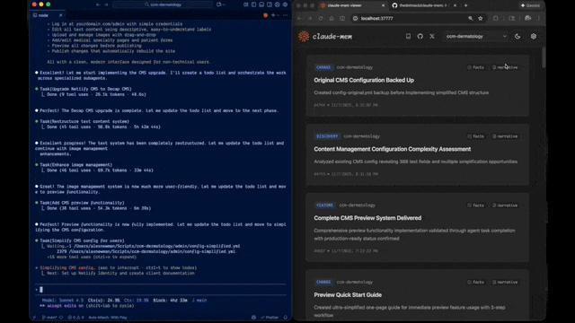

项目一变大、多项目并行，最费脑子的就是会话记忆怎么管。每个新会话都从零开始，该记住的偏好、结论、上下文，换个会话就没了。两条路摆在这：Claude Code 内置的 Auto Memory，和社区 46k star 的 claude-mem。把这轮调研（官方文档、GitHub issue、安全审计、L站和 X 的社区反馈）拼起来看，结论有点反直觉。

## 内置 Auto Memory：agent 把关的便签本

文件落在 `~/.claude/projects/<project>/memory/`，一个 `MEMORY.md` 索引加一堆主题 md。每个会话注入索引前 200 行（或 25KB），主题文件按需读。

- 写入靠 agent 判断「值不值得记」——是便签本，不是档案柜
- 透明：全是你能改的 markdown；轻量：零额外依赖
- 局限：不适合大量/高频数据，超限会报错强制精简，也没有检索能力

这套的聪明处在「让 agent 自己筛」，代价是它永远只记「agent 觉得重要的」，记不了那些「当时没意识到、后来才想找」的东西。

## claude-mem：自动堆积的档案柜

5 个生命周期 hooks（SessionStart / UserPromptSubmit / PostToolUse / Stop / SessionEnd）全自动捕获每次工具调用，用 Claude Agent SDK 压缩成结构化「观测记录」，存本地 SQLite（全文检索）+ Chroma（向量）。下次开会话按任务检索注入相关上下文，另有 3 个 MCP 工具按需深查。

宣传口径是「省 ~10x token、20x 工具调用次数」——这是它火到 46k star 的原因。

## 社区真实反馈：两极，负面的不虚

L站和 X 的口径差距很大。X 上清一色「infinite memory」「省 95% token」的推广帖；L站实际用户是另一种说法：

| 反馈 | 来源 |
| --- | --- |
| 「不好用，对 CC 来说机制多余」；有人直呼「史上最垃圾插件」 | Linux.do |
| 「后台占用很多资源，直接用 --resume 接回会话就行」 | Linux.do |
| 「利大于弊，越来越懂我，每次省约 2250 token」 | Linux.do |
| 后台静默烧掉几千万到几亿 token | GitHub #2643、#2315 |
| 数据库膨胀到几十 GB | GitHub #2793 |
| 进程泄漏、资源占用高 | GitHub issue 持续累积 |

正面评价真实存在，但烧 token、膨胀数据库这些负面也实打实。宣传的「无限记忆」和实际体验，中间隔着这些坑。

## 对你（CC Switch 环境）最硬的一道坎

claude-mem 的压缩后端只支持御三家：`claude`（走 Claude Agent SDK）、`gemini`、`openrouter`。**不支持**任意 OpenAI 兼容中转、DeepSeek、或 CC Switch 自定义路由。

有用户实测把 provider 配成 openrouter 也跑不通——「observations 无法工作」「openrouter/auto 只能跑通测试，返回很不稳定」。

用 CC Switch 走三方中转的环境，claude-mem 大概率装上也跑不顺。这比「装即禁内置」更决定性，是硬限制不是偏好问题。

## 其他该知道的

- 装 claude-mem 会**静默写 `CLAUDE_CODE_DISABLE_AUTO_MEMORY=1`** 停用内置——不删文件，但 Claude Code 不再加载，用户会突然发现记忆全没了
- 安全审计评级 HIGH：本地 API（默认 37777 端口）大量接口无鉴权，任何本机进程都能读 settings（含 API key 明文）、读写污染记忆、清空队列
- 官方 SECURITY.md 承认内容会发往上游模型（Claude / Gemini / OpenRouter）

## 结论

内置是「精兵」——透明、轻量、已重度使用（偏好、hook 机制、项目上下文都沉淀进去了）。claude-mem 是「重炮」——全自动、可检索，但更重，还带安全与兼容风险。

对你这种 CC Switch + 三方中转环境，重炮大概率装上也打不响。保持内置，不换装。
