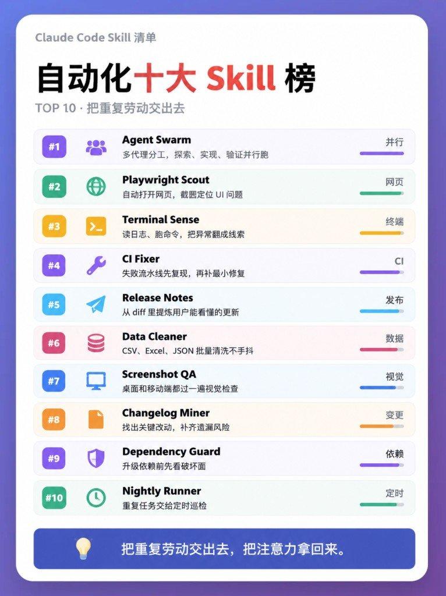
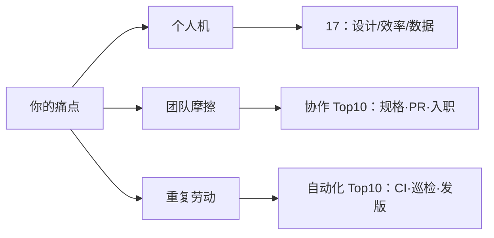

模型开箱大家差不多。真拉开差距的，是 skill、CLI、插件装没装对——以及你有没有把三张宣传榜当成同一份购物车。

这篇文章只做一件事：**对照**。一张是作者自用 17 件套（设计 / 效率 / 数据），另外两张是团队协作 Top10 和自动化 Top10。名单几乎不重叠；硬并成「27 个必装」只是给上下文添堵。

## 三张榜各自吃哪口痛

| 榜 | 吃什么 | 装源诚实度 |
|---|---|---|
| 自用 17 | 个人机上的审美补丁、少写代码、喂外部信号 | 文中多给 CLI / 仓库线索；仍按「作者筛选」看 |
| 团队 Top10 | 规格、PR、评审、决策、入职、复盘 | **宣传名**；文内无仓库，是否可装未验证 |
| 自动化 Top10 | 开发测试、清洗数据、发版运维那类重复劳动 | 同上；公开检索也对不上同名可装包 |

先认能力与类别，再决定去哪找实现。名字好看不等于能 `npx skills add`。

## 17 件套：痛哪类拿哪类

一次装满没意义。痛哪类就从那类拿 1～2 个，跑通再加。

| 类 | 你在烦什么 | 先摸哪几个 |
|---|---|---|
| 设计 | 界面一眼塑料、落地页同质 | Taste、Impeccable、Awesome Design.md |
| 效率 | 代码写多、token 贵、浏览器 / GitHub 手点 | Ponytail、Playwright CLI、`gh`、Skill Creator |
| 数据 | 外部信号、网页进上下文、库 / 记忆 / 收款 | Last 30 Days、Firecrawl CLI、LightRAG、Stripe CLI |

设计类里，Taste 偏从零 / 重做观感，Impeccable 偏命令面 + 页内点选改——别两个一起上来搅浑。审美深潜另有专帖，这里只记它在 17 件里站「审美入口」位。

效率类真正可复用的，往往不是再塞三个 skill，而是 Ponytail 那套写前五问：真需要写吗？库里有没有？标准库够不够？平台原生有没有？已有依赖能否一行解决？`gh` + Skill Creator 我认作地基：issue / PR / release 能在终端闭环，你自己还能造轮子。

数据类按需开抽屉。常爬网页再上 Firecrawl CLI；常要外部热点再上 Last 30 Days。GWS / Stripe / Supabase 按你是否真的碰 Workspace、收款、后端再决定。说不出「它替我省掉哪一步」，就卸。

Playwright 选型口诀：Agent 长会话里偶发点网页，MCP 可能更省事；批跑、脚本化、控成本，优先 CLI。

## 两张 Top10：能力备忘，不是安装清单

协作榜堵的是对齐乱、PR 说不清、老人带不动新人。按痛点裁：

| 痛 | 先看哪几把（宣传名） |
|---|---|
| 对齐乱 | Spec Aligner、Issue Gardener |
| PR / 评审糊 | PR Narrator、Review Router |
| 决策会丢 | Decision Log |
| 新人进海 | Onboarding Map、Knowledge Base |
| 安全 / 设计核对 | Security Buddy、Design Sync |
| 复盘空转 | Retrospective Bot |

自动化榜堵的是重复劳动。按段拆开看：

| 段 | 宣传名 |
|---|---|
| 开发测试 | Agent Swarm、Playwright Scout、Terminal Sense、CI Fixer、Screenshot QA |
| 数据处理 | Data Cleaner |
| 发布运维 | Changelog Miner、Dependency Guard、Release Notes、Nightly Runner |

两张榜名单几乎不重叠。别当成同一表的续集，也别跟 17 件套逐条合并——切面不同。

## 差分一眼看完

| 维度 | 17 自用 | 团队 Top10 | 自动化 Top10 |
|---|---|---|---|
| 读者场景 | 个人工作台提效 | 协作摩擦 | 流水线重复劳动 |
| 典型物件 | CLI、审美 skill、喂料工具 | 规格 / PR / 入职类能力名 | CI / 巡检 / 发版类能力名 |
| 和另一榜重叠 | 几乎无（个别能力相近但名字不同） | 几乎无 | 几乎无 |
| 我怎么用 | 按痛点装 1～2 个可验证的 | 当「团队该覆盖哪些能力」备忘 | 当「重复劳动该外包哪段」备忘 |

撞名不等于可装。生态里能搜到能力相近的 Playwright / changelog / CI 修复类 skill，那是**别的仓库、别的名字**，不能偷换成「就是榜上这十个」。

## 我会怎么装

如果是我自己的机器，顺序大概是：

1. `gh` + Skill Creator（地基）
2. 痛 UI 再上 Taste 或 Impeccable 其中一个
3. 常爬网页再上 Firecrawl CLI；常要外部热点再上 Last 30 Days
4. Ponytail 当习惯补丁，数字当参考，五问当纪律
5. 团队侧先对照协作榜写清「我们缺哪段能力」，再去找可审仓库或自己写同名能力包
6. 自动化侧同理：先标重复劳动段落，再找可核实现

其余当工具抽屉。开了就要能说出替我省掉哪一步。
