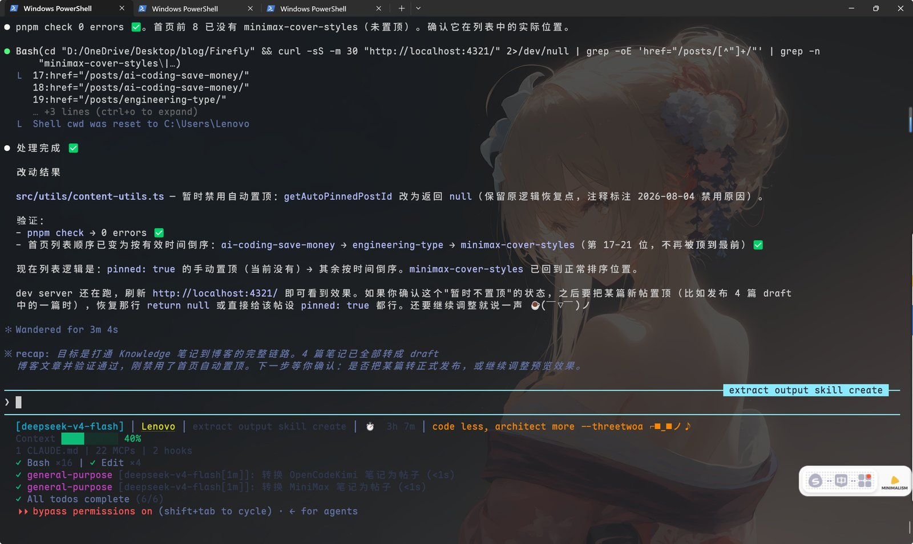

这套界面你们可能在我截图里见过：紫边输入框、底部一行 `[Sonnet 4.6] | Lenovo | code less, architect more`、毛玻璃后面垫着二次元壁纸，一眼赛博朋克。有人以为换张皮就完事，其实这玩意根本不是一张皮，是五层配置叠出来的，散在五个文件里。

这篇就把本机这套配置整个拆开：每一层管什么、改哪个文件、踩过哪些坑。重装机器照着抄一遍就行。

## 五层叠皮，缺一层都不对

我盘了下，这套「皮」从上到下是五层：

| 层 | 角色 | 配置文件 |
|---|---|---|
| ① Provider 切换 | CC Switch 桌面端：换 API 中转 + 本地代理 | `settings.json` 的 `env` 块 |
| ② Claude Code 本体 | 主题、HUD、快捷键、权限、hooks | `~/.claude/settings.json` + `keybindings.json` |
| ③ 深度美化 | tweakcc：直接改 Claude Code 的 `cli.js` | `~/.tweakcc/config.json` |
| ④ 终端外观 | 毛玻璃、壁纸、字体 | Windows Terminal 的 `settings.json` |
| ⑤ 素材层 | 桌面壁纸 + 已装字体 | 系统层 |


为什么要分层想？因为**每一层都有自己的配置文件和失效方式**。最常见的问题就是"改了一处不生效"，然后人懵了。先按层定位：是 provider 断了（401）、Claude 本体配置被冲了（功能消失）、tweakcc 补丁被升级覆盖了（美化没了）、还是终端外观没跟上（背景/字体不对）——大概率不是配置写错，是找错了层。

## 从装到跑：官方安装 + 两个第三方工具

Claude Code 在 Windows 上官方推荐的就一条命令（PowerShell）：

```powershell
irm https://claude.ai/install.ps1 | iex
```

装完二进制落在 `%USERPROFILE%\.local\bin\claude.exe`，原生安装后台会自动更新，`claude update` 手动更新。想停自动更新就在 `settings.json` 的 `env` 里设 `DISABLE_AUTOUPDATER=1`（只停后台检查，`claude update` 还能用）。想彻底关用 `DISABLE_UPDATES`。另外 `winget install Anthropic.ClaudeCode` 也行，但那个不自动更新。

两个第三方工具是这套配置的骨架：

- **tweakcc**（`npm install -g tweakcc`，或 `npx tweakcc`）：深度美化层，下文重点。
- **CC Switch**（桌面应用，Tauri 写的）：管 provider 切换，内置本地代理。装完它在 `~/.claude/settings.json` 的 `env` 里写 `ANTHROPIC_BASE_URL=http://127.0.0.1:15721` 和 `ANTHROPIC_AUTH_TOKEN=PROXY_MANAGED`，把模型请求都走它的本地代理转发。模型映射（比如把 Sonnet 的请求映射到别的模型）也是它管的。

验证一下装齐没有，`claude --version` 会同时打印两层：

```
2.1.220 (Claude Code)
4.3.2 (tweakcc)
```

tweakcc 连版本号都注进 claude 里了，一眼能看出补丁活着。

## tweakcc：把 cli.js 拆开、改完、再装回去

tweakcc 不是"皮肤包"，它是**直接改 Claude Code 的程序本体**。它把 minified 的 `cli.js` 解出来打补丁，原生安装则用 node-lief 从二进制里抽 JS、patch、再重新打包。本机 `~/.tweakcc/` 里躺着 `native-claudejs-orig.js` / `native-claudejs-patched.js`（各约 21MB）和一个 265MB 的 `native-binary.backup`，全是它干活留下的。

因为动的是本体，**Claude Code 一升级补丁就会被覆盖**，但配置还在——升级后重跑一遍 `npx tweakcc --apply` 就行（它自己会先恢复备份，保证从干净状态重新 patch）。注意它官方验证过的版本是 2.1.162，现在跑在 2.1.220 上，个别非系统提示类的 patch 可能失效，得留意。

它到底能改什么？挑值钱的几个：

**内置 7 套主题色**，截图里这套紫调对应 Dark mode。这套配色的逻辑很清晰：紫管结构（分隔线、提示符、autoAccept），蓝管身份（模型名、权限请求），橙管强调（Claude 品牌色、路径高亮），红管警示（错误、diff 删除）。

| 语义 | 颜色 | 语义 | 颜色 |
|---|---|---|---|
| autoAccept | 紫 `rgb(175,135,255)` | claude 品牌 | 橙 `rgb(215,119,87)` |
| planMode | 青 `rgb(72,150,140)` | 输入框边框 | 灰 `rgb(136,136,136)` |
| 正文 | 白 `rgb(255,255,255)` | 成功 | 绿 `rgb(78,186,101)` |
| 错误 | 红 `rgb(255,107,128)` | 警告 | 黄 `rgb(255,193,7)` |
| diff 新增 | 深绿底 `rgb(34,92,43)` | diff 删除 | 深红底 `rgb(122,41,54)` |
| 用户消息底 | `rgb(55,55,55)` | 额度条已用 | 淡紫 `rgb(177,185,249)` |

**思考动画**：把「Thinking...」换成一圈天气符号 ☀️→🌤→⛅️→🌥→☁️→🌧→🌨→⛈ 再倒着转回来，100ms 刷一次，很有"算力在涌"的既视感。

**思考动词随机**：三十多个动词轮着用——Thinking、Pondering、Brewing、Weaving、Distilling……不会再是千篇一律的 Thinking。

**输入框高亮**：正则把 URL（青）、路径（橙）、行内代码（粉）在输入时即时上色，多行贴代码时一眼能分清。

**其它开关**：会话标题、隐藏启动横幅、`mcpConnectionNonBlocking`（MCP 连接不阻塞启动）、`enableSwarmMode`、`enableVoiceMode`、`enableSessionMemory`，还有 `claudeMdAltNames` 让它在项目里读 `AGENTS.md` / `GEMINI.md` / `QWEN.md` 这些别名当指令文件。

## 主题字段：custom:dracula 是另一层皮

`settings.json` 里还有一行 `"theme": "custom:dracula"`，这是**另一套主题机制**——Claude Code 原生的插件主题，来自 `claude-themes` 插件（本机同时启用了 dracula 和 tokyo-night 两个）。主题字段的取值有 `auto` / `dark` / `light` 这几个内建档，`custom:` 前缀指插件或自定义主题，主题文件是 JSON，放着 `base` + `overrides` 的颜色 token。

所以这台机器实际是**两层主题同时存在**：tweakcc 改的是 Claude 程序内部渲染（思考动画、输入框、消息底色这些原生主题管不到的），`custom:dracula` 管的是 Claude 原生 UI 的颜色 token。改色的时候想清楚改哪个，别在 tweakcc 里调半天发现被 settings 的 theme 盖着，反过来也一样。

## 底部 HUD：statusLine 机制 + claude-hud 插件

截图底部那条状态栏是 **claude-hud 插件**（0.6.0）渲染的，走的是 Claude Code 原生的 `statusLine` 机制：`settings.json` 里配 `statusLine` 的 `type: "command"`，Claude 每次交互后把一个 JSON 从 stdin 喂给这个命令（里面有 `model.display_name`、`workspace.current_dir`、`context_window.used_percentage`、`cost.total_cost_usd`、`rate_limits` 这些），命令把它渲染成一行字打印出来。

本机这条 statusLine 命令有三处值得抄：

```bash
# 动态定位最新版插件目录，升级不用改配置
plugin_dir=$(ls -1d "$CLAUDE_CONFIG_DIR/plugins/cache"/*/claude-hud/*/ | sort -V | tail -1)
# 用 nvm4w 的 node 跑插件入口
exec "/c/nvm4w/nodejs/node" "${plugin_dir}dist/index.js"
```

claude-hud 的具体显示在 `~/.claude/plugins/claude-hud/config.json` 里配：`customLine` 是那句格言 `code less, architect more --threetwoa ⌐■_■ノ♪`，`showContextBar` 开 Context 进度条，`modelFormat: "compact"` 让模型名缩成 `[Sonnet 4.6]`，还能显示 `1 CLAUDE.md | 22 MCPs | 2 hooks` 这类配置计数。



这套东西我恢复过不止一次，坑浓缩成三句：

| 坑 | 现象 | 解法 |
|---|---|---|
| `statusLine` 只认 `command` 类型 | 写 `type: "default"` 直接被 schema 拒 | 只能 `type: "command"` + `command` |
| 外层必须是 bash 语法 | 写裸 PowerShell `$var` 被 bash 展开成空串，报错 | 外层 bash（Git Bash/Cygwin），PowerShell 内容塞引号里 |
| Node 路径会变 | nvm4w 切版本或路径变更，HUD 静默消失 | `statusLine.command` 里同步更新 `/c/nvm4w/nodejs/node` |

另外一个外部因素：**CC Switch 有时会整文件重写 `settings.json`**，把 `statusLine` / `enabledPlugins` / `extraKnownMarketplaces` 全冲掉。它只管 provider 的时候改 `env` 块，但接管模式是整文件覆盖。HUD 消失先查这三个块在不在。

## 顺手两件事：shift+enter 换行 和 权限放权

### 换行键

`~/.claude/keybindings.json` 里我配了：

```json
{
  "bindings": [
    { "context": "Chat", "bindings": { "shift+enter": "chat:newline", "ctrl+enter": null } }
  ]
}
```

`shift+enter` 插换行、`ctrl+enter` 置 null 取消默认提交，这样回车是发送、Shift+回车是换行，写多行提示词不别扭。注意一个版本坑：**现在官方文档里 `chat:newline` 的默认键其实是 Ctrl+J**（早期版本才是 shift+enter），想用 shift+enter 就得像我这样显式绑。值设 `null` 就是取消默认绑定，改完热加载不用重启。Ctrl+C / Ctrl+D / Ctrl+M 和 Caps Lock 不可重绑。

另外 Windows Terminal 这层我还挂了个 `ShiftEnterNewline` 快捷键，往终端发 `\u001b[13;2u`（Shift+Enter 的 CSI 转义），等于终端和 Claude 两层都认这个键。

### 权限放权

截图里启动命令是 `claude --dangerously-skip-permissions`。这个 flag 等于 `--permission-mode bypassPermissions`，把所有权限确认和安全检查全关了，跑起来最顺。配合的机制：

- **Shift+Tab 循环权限模式**：默认只在 `default → acceptEdits → plan` 之间切；`bypassPermissions` 得先激活（用 flag 或 `--allow-dangerously-skip-permissions` 只入环不激活）才会进循环。状态栏那个红字 `bypass permissions on (shift+tab to cycle)` 就是提示这个。
- **`/permissions`**：管理 allow / deny / ask 规则，还能看 "Recently denied" 列表一键重试。
- `settings.json` 里 `skipDangerousModePermissionPrompt: true` 会跳过首次启用 bypass 时的一次性责任确认弹窗（我就是这么关掉的）。

安全提醒照实说：bypass 模式官方口径是"只该在容器 / VM / 隔离环境用"，对 prompt injection 毫无防护。我自己的判断是——**自己这台机器、自己信任的会话里图方便没问题，但别在有敏感数据或共享终端的环境里裸奔**，也别把依赖它的命令写进会被复制的脚本里。

## Git Bash：hooks 和 statusLine 都走它

Windows 上 Claude Code 的 bash 工具、shell 形式的 hooks、statusLine，默认走的是 Git Bash——`settings.json` 的 `env` 里设 `CLAUDE_CODE_GIT_BASH_PATH` 指向它：

```json
"CLAUDE_CODE_GIT_BASH_PATH": "C:\\Program Files\\Git\\usr\\bin\\bash.exe"
```

不设的话，它找不到 Git Bash 会退到 PowerShell 工具。设了之后，**所有 shell-form hooks / statusLine 命令都由 Git Bash 执行，cmd.exe 永不参与**。

本机的 hooks 就两个：Notification 和 Stop 事件都触发同一个 PowerShell 脚本 `claude-hook-toast.ps1`，在 Windows 弹原生 Toast 通知（任务完成提醒）。脚本里还做了个判断，区分是不是 Cursor 在调它，避免误弹。

写这种跨 shell 的 command 有一个特别容易踩的坑：**外层命令是 bash 语法，就必须用正斜杠全路径、禁 `%VAR%`、禁 `cmd /c` 包装、禁反斜杠路径**（反斜杠会被 bash 转义吞字符，甚至建出 `nul` 残留文件）。正确姿势长这样：

```json
"command": "powershell -NoProfile -ExecutionPolicy Bypass -File C:/Users/Lenovo/.claude/claude-hook-toast.ps1"
```

## 终端那层：毛玻璃 + 壁纸 + Maple Mono

界面最外层的观感是 Windows Terminal 给的。截图那个 PowerShell profile 的关键配置：

| 配置 | 值 | 作用 |
|---|---|---|
| `backgroundImage` | `"desktopWallpaper"` | 直接把当前桌面壁纸当终端背景 |
| `backgroundImageOpacity` | `0.21` | 背景图压暗到 21% |
| `useAcrylic` | `true` + `opacity: 15` | 亚克力毛玻璃，透明度 15% |
| `font.face` | `Maple Mono NF CN`，13pt，medium | 带中文的 Nerd Font |
| `colorScheme` | `Dark+` | 终端配色 |
| `cursorColor` | `#E5E510` | 黄色光标 |

几个取舍和坑：

- **`desktopWallpaper` 是个彩蛋**：`backgroundImage` 填这个特殊值就直接垫桌面壁纸，换壁纸终端跟着变。壁纸 + 毛玻璃可以共存（背景图画在 acrylic 之上，`useAcrylic:false` 只有 Win11 支持纯透明无磨砂）。
- **中文等宽必须用带 CJK 的字体**。Maple Mono NF CN 是开源的圆角编程字体（仓库 subframe7536/maple-font），「NF」= Nerd Font 图标补丁版，「CN」= 内嵌中文字形（思源圆体底子），中英文按 **2:1 对齐**（一个汉字正好两个西文字宽），多语言混排和 Markdown 表格不会错位。Caskaydia Cove Nerd Font（Cascadia Code 打的 NF 补丁）**不含中文字形**，中文只能走系统 fallback——fallback 字体的字宽行高和主字体不一致，混排必错位。
- **终端不支持自定义 fallback 字体列表**（这个功能在官方 backlog 里躺很久了），所以最省事的办法就是主字体直接用自带 CJK 的：Maple Mono NF CN、Sarasa Term SC 这类。

## 改了一处不生效？按层对号入座

| 现象 | 先查哪层 |
|---|---|
| HUD 消失 | ② `statusLine` / `enabledPlugins` / `extraKnownMarketplaces` 三个块 + node 路径 |
| 401 / 连接失败 | ① CC Switch 代理 + `env` 的 base_url / token |
| 美化效果全没了 | ③ Claude 升级了，重跑 `npx tweakcc --apply` |
| 颜色不对 / 被盖住 | ② `settings.json` 的 `theme` 和 ③ tweakcc 主题，搞清楚谁在起作用 |
| 中文乱 / 字符被吞 | ④ hooks 外层 shell 语法（反斜杠、`%VAR%`、`cmd /c`） |
| 终端字混排错位 | ⑤ 字体没中文字形 → 换 Maple Mono NF CN 这类带 CN 的 |

---

这套配置最值钱的认知就一句话：**漂亮是结果，分层是原因**。五层各管各的，改哪儿查哪儿，比对着网上"复制这段配置"的教程靠谱得多。重装时按这个顺序抄：装 claude → 装 tweakcc 跑 `--apply` → 配 CC Switch → 写 settings.json（env / theme / statusLine / hooks）→ 调 Windows Terminal 外观 → 收工 ☕(￣▽￣)ノ
