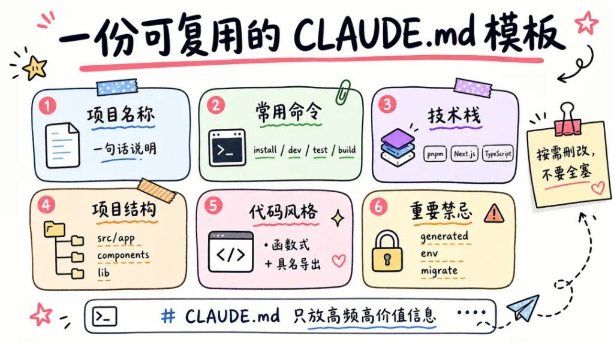
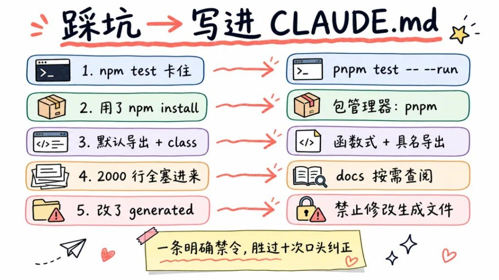

规范专篇之一：**只讲 CLAUDE.md**。工具里怎么点按钮见各工具手册；这里把「说明书怎么写」写透。

---

## 原则与模板

> 合并自原帖 `claude-md-handbook`

每次开新会话都要把「用 pnpm」「别改 generated」「测试怎么跑」再说一遍——说漏一次，它就按默认猜，猜错就返工。

CLAUDE.md 就是把这些**高频、高价值、猜不到**的约定钉死：会话一开就自动进上下文，少复读，默认做对事。

下面按「是什么 → 可复制模板 → 五原则 → 五个真实坑 → 对照表」拆开。

### CLAUDE.md 是项目记忆，不是说明书


它不是 README，也不是知识库。README 给人扫项目；CLAUDE.md 给 Agent 当**默认前提**——每次会话自动加载，在你开口前就生效。

图上压成一句话：**少量高信号信息，让 Claude 默认做对事。**

常见四块：

| 放什么 | 例子 |
|---|---|
| 常用命令 | `pnpm test`、`pnpm build` |
| 技术栈约定 | pnpm、TypeScript |
| 代码风格 | 具名导出、禁止 `any` |
| 踩坑禁忌 | 别改 generated、docs 按需读 |

#### 位置与加载

| 层级 | 典型路径 | 管啥 |
|---|---|---|
| 用户级 | `~/.claude/CLAUDE.md` | 跨项目个人习惯 |
| 项目级 | 仓库根 `CLAUDE.md` 或 `.claude/CLAUDE.md` | 团队共享约定 |
| 本地级 | `CLAUDE.local.md`（常 gitignore） | 本机私货，勿进远端 |

Claude Code 会沿目录树向上找；monorepo 里子目录还可再放一份，按需叠加上去。

#### 怎么起步、怎么追加

- **`/init`**：扫仓库生成初稿。当草稿用——删废话、补「只有本仓库才知道」的命令和禁忌。
- **`#` 追加**：会话里用 `#` 把当前纠正直接写进 CLAUDE.md；或口头说「把这条加进项目的 CLAUDE.md」，让它自己改文件。
- 空文件也能开工：先用起来，**同一条纠正说了两遍**再沉淀，比一上来写三百行强。

### 一份可复用模板（六节，按需删改）



图脚那句钉死：**CLAUDE.md 只放高频高价值信息**；侧栏便签：**按需删改，不要全塞。**

下面是按图卡六节还原的可复制模板，可直接粘进仓库再改成你的路径：

```markdown
## 项目名称

一句话说明这个仓库是干什么的（给 Agent 的地图，不是产品文案）。

### 常用命令

- 安装：`pnpm install`
- 开发：`pnpm dev`
- 测试：`pnpm test -- --run`
- 构建：`pnpm build`

### 技术栈

- 包管理器：pnpm（禁止 npm / yarn，除非任务明确要求）
- 框架：Next.js
- 语言：TypeScript（严格模式；禁止随意 `any`）

### 项目结构

- `src/app`：路由与页面
- `components`：可复用 UI
- `lib`：工具与共享逻辑
- `docs`：详细文档（**按需查阅，不要整份塞进上下文**）

### 代码风格

- 优先函数式写法
- 模块统一**具名导出**（避免默认导出 + class 混用）
- 改动保持外科手术式：只动任务相关文件

### 重要禁忌

- 禁止修改 `generated` / 自动生成目录下的文件
- 禁止提交或改写 `.env`、密钥、CI secrets（除非明确授权）
- 数据库 `migrate` 前先确认备份与回滚；不要擅自跑破坏性迁移
```

六节不够就加「验证怎么跑」「NEVER / ALWAYS」；六节太满就砍——**删掉后 Claude 不会因此犯错的行，都可以删。**

### 写好它的 5 条原则


中心句：**让 Claude Code 默认做对事。** 收口不是「写得多」，是**写得准**。

| # | 原则 | 落地 |
|---|---|---|
| 1 | **精简高信号** | 像漏斗：只留「不写就会错」的行；空泛「写高质量代码」一律删 |
| 2 | **写命令和约定** | build / test / 包管理器 / 命名风格写死成可执行句 |
| 3 | **踩坑变禁忌** | 纠正过一次 → 写成「禁止 / 务必」，别指望下次还记得口头嘱咐 |
| 4 | **保持正确海拔** | 太虚（愿景、公司介绍）没用；太细（整份 API 手册）该进 `docs/` 或 Skill，按需读 |
| 5 | **当活文档迭代** | 约定变了就改文件；过期规则比没有规则更坑 |

和 Skill / Hook 的分工也记一下：流程型重复劳动 → Skill；必须每次发生的强制动作 → Hook；**每次会话都成立的事实与禁令** → CLAUDE.md。

### 五个坑：错一次，就写进文件



图脚：**一条明确禁令，胜过十次口头纠正。**

| # | 踩坑（左） | 写进 CLAUDE.md（右） |
|---|---|---|
| 1 | `npm test` 卡住（常进 watch） | `pnpm test -- --run` |
| 2 | 随手 `npm install` | `包管理器：pnpm` |
| 3 | 默认导出 + class | `函数式 + 具名导出` |
| 4 | 把 2000 行 docs 全塞进记忆 | `docs 按需查阅` |
| 5 | 改了 generated | `禁止修改生成文件` |

模式就一条：你纠正 → 让它把规则写回 CLAUDE.md → 下个会话开箱即守。别把「我又说了一遍」当成协作。

### 该写 vs 不该写（对照）

| 该写（高信号） | 不该写（噪音） |
|---|---|
| 本仓库特有的 build / test / lint 命令 | 「写出干净优雅的代码」 |
| 包管理器、语言模式、导出约定 | 完整 API 文档、长篇背景故事 |
| NEVER：generated、env、误迁库 | Claude 读一眼仓库就能推断的目录常识 |
| 「细节在 `docs/…`，按需打开」 | 把整本 docs 内联进 CLAUDE.md |
| 上次踩坑沉淀的硬禁令 | 一次性任务流程（那是 Skill） |

先把测试命令、包管理器、三条硬禁忌写进仓库根的 CLAUDE.md，再谈 Loop、Skill、记忆插件——顺序反了，等于让 Agent 先猜再补课。

---

## 和 AGENTS.md 一起看：写给人的 README 不够

> 合并自原帖 `claude-md-handbook`

`README.md` 给人装环境看；AI 要的是「怎么构建、怎么测、踩过哪些坑、绝不能碰什么」。缺这份说明书，就会反复犯同样的风格错误，团队每人一套结果。

### 两个文件怎么站位

| 文件 | 定位 | 谁吃 |
|---|---|---|
| `CLAUDE.md` | Claude Code 专属记忆，启动自动加载 | Claude Code |
| `AGENTS.md` | 开放标准，跨工具项目说明 | Cursor / Codex / Copilot / Gemini CLI 等 |

只吃 Claude Code → 维护 `CLAUDE.md` 就够。多工具混用 → 优先 `AGENTS.md`，或两份共存、内容按工具微调。

### CLAUDE.md 的层级（从近到远）

1. 当前目录 `CLAUDE.local.md`（私有，勿提交）
2. 当前目录 `CLAUDE.md`（项目共享）
3. 父目录 `CLAUDE.md`（Monorepo 继承）
4. `~/.claude/CLAUDE.md`（全局）

在 `packages/frontend/` 干活时，会叠读子包 + 根目录配置。团队约定进 `CLAUDE.md`，个人偏好进 `CLAUDE.local.md`。

### 该写什么（两边差不多）

少写宣传稿，多写「命令 + 红线」：

- 常用命令：dev / build / test / lint / typecheck / db
- 代码风格与命名（ESM vs CJS、PascalCase 组件等）
- 目录地图与关键入口文件
- Git / PR 约定
- 环境变量前缀、禁止硬编码、统一走哪层封装
- 高频 FAQ（装依赖、连库失败之类）

语气可以硬一点：`IMPORTANT` / `YOU MUST` / `NEVER` 对关键红线有效。Claude Code 对话里按 `#` 能把当轮结论追加进 `CLAUDE.md`；`/init` 能生成骨架，但别指望骨架够用。

### AGENTS.md 的就近原则

聊天里的直接指令 > 离当前编辑文件最近的 `AGENTS.md` > 根目录 `AGENTS.md`。Monorepo 按 `web` / `api` / `shared` 各放一份，比堆一个巨型根文件干净。

和 `CLAUDE.md` 比：内容都是自由 Markdown；差别主要在工具覆盖面和优先级细节（CC 有 local 覆盖与全局档）。

### 写薄还是写厚

别一次灌满。像调 Prompt：先放命令和三条红线，跑几轮再补架构说明。配置越长，越容易互相打架、越吃上下文。能拆子目录就拆。

### 相关阅读

- [Cursor 规则别瞎塞：三层各管各的](/posts/cursor-handbook/)
- [还在「会聊天」阶段，就别指望 Vibe 封神](/posts/vibe-chat-to-workflow-system/)

> 素材来源：[CSDN 原文](https://blog.csdn.net/a18792721831/article/details/156729996)

---

## 官方坐标与补强备注

补强：

- CLAUDE.md 适合「每次都要遵守」的短约束；长流程、偶发工序放 Skills，避免常驻撑爆上下文
- 需要强保证（禁令、密钥、格式）时，用 Hooks / 权限规则补强，不要只靠散文嘱咐
- 与 AGENTS.md：多工具仓库可两份并存或一份共享根说明 + 工具侧薄覆盖
