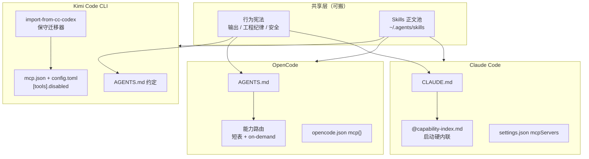
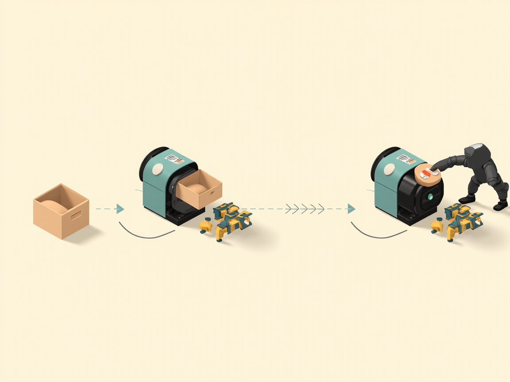

手里同时用着好几个 AI 编程工具（Claude Code、OpenCode、Kimi Code CLI），自然想把 Claude 那套攒下来的生态（CLAUDE.md 规范、能力路由、MCP、Skills）都搬过去。搬完回头看，最大的教训就一句话：**正文可以共享，能力路由和 MCP 开关必须按宿主重写。**

> OpenCode 靠改名 `AGENTS.md` + 重写能力路由活下来；Kimi 靠 `import-from-cc-codex` 保守迁移 + 大幅裁剪工具面。Kimi 还证明了一件事：迁移后最大的敌人不是「Claude 残留」，是「工具 / 技能过载」。

> 材料说明：OpenCode 侧那轮迁移的原始聊天记录没保留，所以 OpenCode 部分以配置产物和调研会话为准，结论颗粒度到「策略」级。

## 先看三家怎么分层



## OpenCode：改名 + 重写能力路由

Claude 的 `CLAUDE.md` 到 OpenCode 就是改名成 `AGENTS.md`（`~/.config/opencode/` 下），难点全在能力路由。

Claude 那套 `@capability-index.md` 启动硬内联，在 OpenCode 里得重写成**短路由**：Skills 先读再动手；文档走 Context7 → Tavily → Firecrawl，最后才 webfetch；浏览器用 ChromeDevTools、图谱用 GitNexus；密钥不回显。这不是 Claude 能力索引的缩略版，是把 OpenCode 自己的工具名写进宪法。

几个非照抄点值得记：
- 大索引不下锅，细节靠 skill 和 MCP on-demand
- MCP schema 要重声明，通用 `mcpServers` 模板不能原样丢进去
- Windows 进程形态是 `command: ["cmd","/c","npx",...]`
- Hooks 事件名全换，Claude 的 Pre/Post 对应 OpenCode 的 `tool.execute.before` 这类

## Kimi：真正有价值的坑都在这里

Kimi 走的是 `import-from-cc-codex` 保守迁移，只迁 instructions/skills/MCP，不迁 hooks。但真正让我学到东西的是它的**工具过载治理**。

> 会话原文精神：问题不是「Claude 残留污染」，而是「工具 / 技能过载」。

| 层 | 发现 | 动作 |
|----|------|------|
| MCP | filesystem 与内置 Read/Write 重复；gitnexus 语义词太「万能」易误触；icons 对 coding 噪音大 | `enabled: false` + `[tools].disabled` 双保险 |
| Skills | 曾到 338 个描述灌进系统提示 | 归档到约 141，砍商业/视频/LSP 噪音 |
| Claude 目录 | `~/.claude` Kimi 不读；skills junction 到 `~/.agents/skills` | 无害共存，别当成污染源乱删 |

落地后的黑名单长这样：

```toml
# ~/.kimi-code/config.toml
[tools]
disabled = [
  "mcp__filesystem__*",
  "mcp__icons__*",
  "mcp__gitnexus__*",
  "mcp__minimax-coding__understand_image",
]
```

MCP 启用只留 tavily / MiniMax / minimax-coding。「看图片」只留内置 ReadMediaFile。**338 个 skill 灌进系统提示，跟让一个程序员同时盯 338 个屏幕没区别**，注意力全被稀释。砍完反而好用。过载治理这事，Kimi 靠黑名单打出来了 (￣▽￣)


## 两家同题不同答卷

| 议题 | OpenCode | Kimi |
|------|----------|------|
| 入口文件 | `AGENTS.md` 已就位，能力路由重写 | 靠 import + 共享 skills |
| 迁移器 | 手工 + 插件化 | 内置 `import-from-cc-codex`（预览、追加、不覆盖）|
| 过载治理 | 配置里大量 `enabled:false` | 黑名单 + skills 归档 |
| gitnexus / filesystem | 仍启用 | 明确禁用（误触实证）|
| MiniMax | 可按需开 | 用户红线：必须保留 |

同一套 Claude 源，两个宿主裁成两套最小可用集。这说明迁移没有标准答案，只有「按你的使用习惯裁剪」这一条。


## 跨宿主迁移清单（可直接抄）



1. 复用行为宪法（§I-III 那类约束）
2. **重写能力路由**，写宿主真实工具名
3. MCP 按宿主 schema 重声明，密钥走环境变量
4. Skills 共享正文，调用面写映射表
5. hooks / agents / commands 不自动迁，按需重建
6. 迁完先做**误触审计**，找出与内置工具语义撞车的 MCP。这一步最容易被跳过，跳过必还账 🐛

Kimi 专用急救：`mcp.json` 关噪音服务器、`config.toml` 的 `[tools].disabled` 做黑名单、skills 归档比再装插件更管用、改完**重启会话**才生效、国内 API 用 `NO_PROXY` 加 kimi 域名别清全局代理。

---

把 Claude 的生态搬去别的工具，最不值钱的努力是复制文件，最值钱的是想清楚「哪些共享、哪些重写、哪些砍掉」。OpenCode 和 Kimi 已经用两种不同的答法证明这事了 ☕(￣▽￣)ノ
