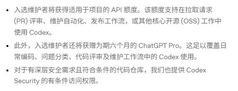
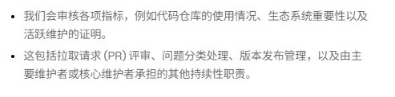
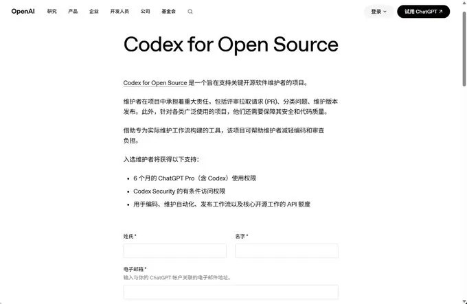

OpenAI 的 [Codex for Open Source](https://openai.com/zh-Hans-CN/form/codex-for-oss/) 面向**关键开源软件维护者**。入选不是「随便找个空仓库」，而是用维护工作流换工具与额度。作者 LeviDing 称自己过审并激活了 6 个月 Pro（约合文中说的 200 美金/月档；结账页样例为日区限时 0 日元）。

权益、门槛以官方表单页为准；下面是 2026-08-11 对照官方页 + 作者经验的浓缩版。**别滥用，也别走代申代充。**

## 能拿什么（官方表述）

| 项 | 说明 |
|---|---|
| ChatGPT Pro × 6 个月 | 含 Codex，覆盖日常编码 / triage / review / 维护 |
| API 额度 | 写代码、维护自动化、发布工作流、核心 OSS 工作 |
| Codex Security | **有条件**，看仓库安全需求是否达标 |

## 谁可以申，官方看重什么

角色下拉只有：**主要维护者** 或 **核心维护者**。没有写死「必须 N star」，但要能讲清用量、采用度或生态重要性。

官方要点：

- 活跃开源项目的维护者可申
- 找有实质用量、广泛采用、或对生态明确重要的项目
- 审核看：仓库使用、生态重要性、**活跃维护证明**（PR 评审、issue 分类、发版等持续性职责）

作者参考画像：某公开仓库 admin、约 10.8k star（[zh.javascript.info](https://github.com/javascript-tutorial/zh.javascript.info)）；印象中曾要求近三月积极维护（commit 等），后来表单未必仍写明——按**当前表单**填，旧记忆只当加分信号。

## 表单要填啥

- 姓名、**与 ChatGPT 账户关联的邮箱**
- GitHub 用户名（资料公开）、仓库 URL（仓库公开）
- 角色：主要 / 核心维护者
- 为何符合资格（star、月下载、生态重要性等，≤500 字）
- 兴趣：Codex Security / 项目 API 额度
- OpenAI Organization ID
- API 额度打算怎么用在项目上（≤500 字）
- 其他说明（可选）

提交即同意项目条款。滚动审核，**邮件通知**入选者。可申自己的项目，也可提名其他维护者；不完全符合但生态重要时，仍可申并写理由。

## 节奏与坑（经验，非 SLA）

- **审核**：官方滚动；作者 2 月底申、感觉以月计；也有人说更快——别按天估。
- **激活支付**：留言里多人提海外卡 / 支付校验变严；国内卡可能卡在升级页。以你账号地区实际结账为准。
- **风控**：有人称 OSS 相关权益用了几周被封。当福利用在真实维护，别当无限号池。
- **代充代申**：评论区已出现转账代认证——直接当诈骗/违规，不碰。

## 申之前先问自己

仓库公开吗？你是主要/核心维护者吗？能拿出 star/下载/生态重要性 + 持续维护证据吗？API 额度用途写得像**项目维护**还是像个人白嫖？

过了再谈「尽情发挥」；没过也正常——这是选拔制支持计划，不是通用折扣码。
