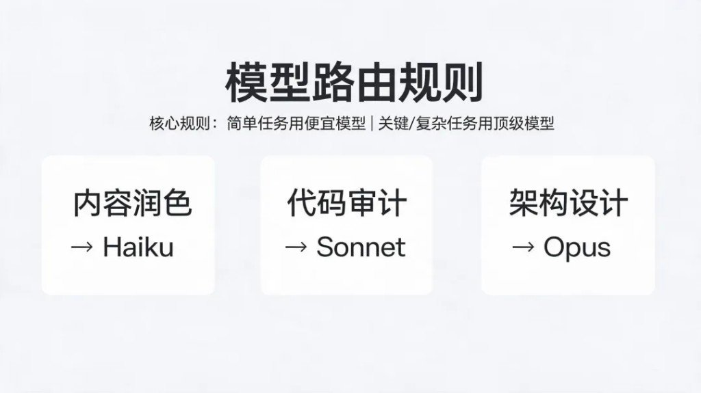
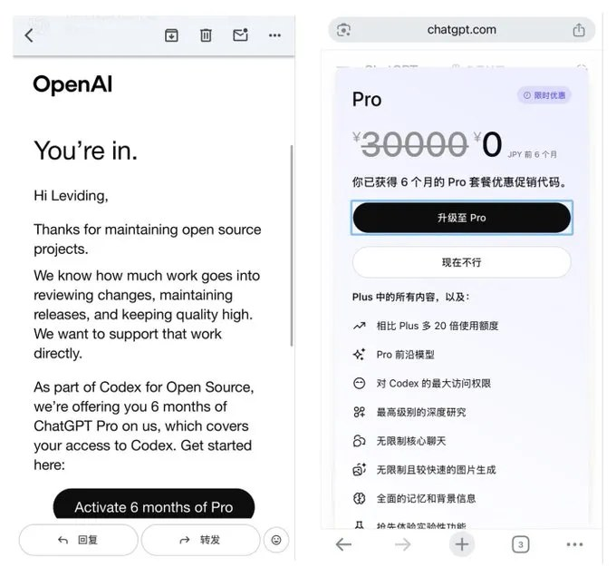
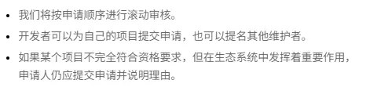

这篇是 **Codex 工具向合订**。作品演示（海报、3D、手绘视频等）不在此篇，避免一本手册胀成作品集。

---

## Chat / Work / Codex 怎么分工

> 合并自原帖 `codex-handbook`

很多人一打开 ChatGPT，先纠结「用哪个模型、推理开多高」。图卡把顺序拧回来了：**先选模式，再选模型与推理档位。**

模式决定工作方式；模型决定能力、速度与成本；推理档位决定思考深度。下面按图面完整转录，不当完整产品手册。

---

### 三个模式各管什么

| 模式 | 定位（图面） | 典型用途（图面） |
|---|---|---|
| **Chat**（绿） | 问答与快速交流 | 解释概念 · 讨论与判断 · 头脑风暴 |
| **Work**（蓝） | 研究与正式交付 | 分析多份材料 · 文档·表格·演示 · 报告·Site·计划任务 |
| **Codex**（紫） | 软件开发与技术执行 | 修改与调试代码 · 运行命令与测试 · 审查仓库与技术整改 |

分不清时先问自己：是在**想清楚**，还是在**交成品**，还是在**改系统和代码**。

---

### 选型逻辑：模式在前

图中部那条够硬：

> **先选模式，再选模型与推理档位。**  
> 模式决定工作方式；模型决定能力、速度与成本；推理档位决定思考深度。

别把「模型更强」当成万能开关——工作方式选错，再贵的档位也只是更快地做错事。

---

### 模型与推理，分开选

图面标题：**模型与推理，分开选择。** 三档对照如下（名称按图面照录[^models]）：

| 场景 | 图面建议 | 备注 |
|---|---|---|
| 日常快速回答 | **GPT-5.5 Instant** | 快答档 |
| 复杂知识工作与研究 | **GPT-5.6 Sol**，推理可选 **Medium / High / Extra High** | 深度档，推理强度单独拧 |
| Work / Codex 中的效率选择 | **Terra**（均衡）· **Luna**（最快、成本最低） | 交付/执行场景下的效率档 |

Instant 管「说得快」；Sol + 推理档管「想得深」；Terra / Luna 管 Work、Codex 里要不要压成本和延迟。

---

### 口诀够用了

图底那句直接背：

**想清楚用 Chat，做成品用 Work，改系统和代码用 Codex。**

进了 Codex 还要写规矩、派活、少走偏，旁边几篇管用法，不跟本篇抢选型。

---

---

## 50 条实践心得

> 合并自原帖 `codex-handbook`

看案例、听聚会，和真正把 Codex 当默认执行者，是两回事。

有位把 Codex 当默认执行者的实践者，把完整目标直接交给 Codex：持续调研、编写代码、运行测试、打开浏览器，最后交可直接用的文件或产品。7 天消耗 **230 亿 Token**（约 **$2.6 万**），消耗量一度排到榜一。落地数字也不含糊：可商用笔记日产 **100 → 1000**；内部提效工具开发期 **1 个月 → 3 天**；销售陪练考核系统 **1 天** 完成。

下面 50 条按原文六大部分收录——不是官方十条的翻版，是业务侧「敢把权限交出去」之后的实战清单。

相关阅读：官方十条边界气质、[Claude Code 四类循环](/posts/claude-code-handbook/)、Prompt→Harness→Loop 四站、Vibe Coding 流程纪律——见文末。

---

### AI Native 的工作方式

1. 相信未来是一个**普通人靠想法也能暴富的时代**，前提是你学会无限烧 Token 的方式。

2. 真正拉开差距的不是「会不会用 AI」，而是**拥有 AI Native 的思维**：不要让人成为瓶颈，思考怎么减少自己的参与；你敢不敢让 AI 连续工作几小时、几天，甚至长期替你推进一个目标。

3. **学会搭建稳定、低成本的模型调用方案。** Token 成本降不下来，你就会下意识少思考、少尝试、少并行。

4. 想办法让账号拥有更充足的 Token 配额。可以研究 OpenCodex、CC Switch。

5. 不要把「省 Token」当成最高目标。Token 可以再买，真正稀缺的是你的时间、注意力和机会窗口。

6. 烧 Token 不是让 AI 陪你闲聊，而是让它持续搜索、分析、执行、验证，最后交付可以直接使用的结果。

7. 最有价值的不是一个神奇提示词，而是一套能够反复运行、持续优化的工作流程。

8. **相信 AI，理解 AI，然后尽可能让 AI 去做。** 很多事情不是 AI 做不了，而是你没有真正把权限和任务交给它。

9. 再次强调：**不要让人成为工作流里的瓶颈。** 每次需要你复制、粘贴、确认、整理，都应该思考能否继续自动化。

10. AI Native 不是「原来的业务加一个聊天框」，而是重新设计整个业务，让 AI 成为默认执行者。

---

### 从陌生行业开始做新项目

11. **不懂一个行业有时反而是优势。** 你没有被旧规则限制，更容易让 AI 带着你从第一性原理重新拆解行业。

12. **遇到新行业，不要先花三个月学习。** 先让 Codex 调研市场、整理术语、分析竞品，再用真实项目反向学习。

13. 做新业务时，**先考虑能不能让 AI 完成**，再考虑要不要招人。很多过去需要一个团队的事情，现在可能只需要一个负责人。

14. 一定要**优先使用当前能力最强的模型**。模型能力差一点，可能不是结果差一点，而是整个复杂任务根本跑不通。

15. 简单任务可以交给便宜模型，关键判断、复杂编码和长期任务交给顶级模型。不要为了省小钱，浪费更多返工时间。

16. 学会观察 Codex 的额度和重置时间。临近重置还有大量额度，就安排代码审计、竞品调研、批量测试等重任务。

17. 不要等到额度快过期才随便烧。提前准备一个「高 Token 任务池」，有剩余额度时直接启动。

18. 学会使用目标模式。把一个需要数小时甚至数天的结果设成目标，让 Codex 围绕最终交付持续推进。

---

### 让 AI 从想法走到可交付结果

19. **目标要写结果，不要只写动作。** 不要说「研究一下竞品」，要说「交付竞品数据库、差异分析和可执行方案」。

20. **学会使用 Plan 模式。** 复杂任务先让 Codex 拆步骤、找风险、确定验收标准，再开始执行，返工会少很多。

21. 简单任务别过度规划，复杂任务别直接开干。判断标准是：做错一次的返工成本高不高。

22. 给 Codex 明确的完成标准。例如「页面能打开」不够，要写清楚响应速度、移动端效果、异常状态和测试要求。

23. 不要只告诉 AI「做什么」，还要告诉它**「做到什么程度」。** 没有验收标准，AI 很容易交付一个看起来完成的半成品。

24. 大任务尽量交付文件、代码、表格或网页，不要只停留在聊天答案。能沉淀的成果，才有复利。

25. 让 Codex 先读取现有项目、历史文档和真实数据，再提出方案。上下文越真实，输出越少像套话。

---

### 把重复操作做成长期流程

26. **为长期项目编写 AGENTS.md。** 把项目规则、目录结构、禁区和验收方式写进去，避免每次重新解释。

27. **把经常重复的操作做成 Skill。** 一次写好规则，以后一句话就能触发完整流程。

28. 把高频提示词升级为模板，把模板升级为 Skill，再把多个 Skill 串成自动运行的业务系统。

29. 学会使用工具和连接器。让 Codex 直接读取代码、文档、邮件和数据库，少做人工搬运。

30. 不要复制几万行日志给 AI。让 Codex 自己搜索关键词、定位异常时间段、提取相关上下文，更快也更准确。

---

### 让 AI 完成调研、开发和测试

31. **遇到 Bug，不要只让 AI 猜原因。** 让它复现问题、读取日志、缩小范围、编写测试，最后验证修复。

32. 修复问题时要求 Codex 先写失败测试，再修改代码。能被测试捕获的 Bug，才更不容易再次出现。

33. 不要用「感觉差不多」验收。让 Codex 运行测试、查看页面、检查日志，用证据证明任务已经完成。

34. 做网页时，让 Codex 同时检查桌面端、移动端、加载状态、空状态和错误状态，别只看首页截图。

35. **学会让 Codex 操作浏览器。** 大量调研、录入、页面测试和后台操作，本质上都可以转化成浏览器工作流。

36. 让 AI 看图、看截图、看视频，不要什么都靠文字描述。多模态输入经常比你解释十分钟更准确。

37. 不要自己逐个整理竞品。让 Codex 批量搜集、分类、去重、打标签，再由你判断真正值得关注的信号。

38. 相信自己的想法，但前提是看过足够多的竞品、用户反馈和失败案例。自信应该建立在信息密度上。

39. 一个想法不要只生成一套方案。让 Codex 同时给出保守版、激进版、低成本版和最快验证版，再进行比较。

40. 学会并行推进。市场研究、产品设计、技术验证和内容生产可以同时运行，不必等上一件事做完。

41. 并行不是让十个 AI 重复回答同一个问题，而是把任务拆成互不依赖的子问题，最后再汇总判断。

---

### 用复盘和配置提高长期效率

42. 让最好模型用最高推理做审查，执行用中等推理即可。

43. 重要决策不要只问「这个想法好不好」，要让 AI 主动反对你。哪里会失败、什么假设最危险、如何最低成本证伪，都可以让它一起检查。

44. 学会洞察 Codex 或 Claude 的周额度重置时间，它是有规律的，不要浪费剩余的 Token。

45. 一次对话只解决一个问题，会浪费 Codex 的连续工作能力。尽量把「调研、方案、实现、测试、复盘」连成完整流程。

46. 每完成一个项目，都让 Codex 复盘。哪些步骤浪费了 Token，哪些信息重复提供，哪些流程可以自动化。

47. **建立自己的失败案例库。** AI 犯过的错误、无效提示词和项目踩坑，都应该沉淀成下一次的约束条件。

48. 买一台性能更好的电脑，建议是 1 万元以上的 Mac，尤其是需要同时运行 Codex、浏览器、开发环境和 Docker 时。生产工具卡顿，会直接限制你的并行能力和思考速度。有段时间，机器只能每天烧 30 亿 Token——因为电脑成了瓶颈。

49. **不要为了烧 Token 而烧 Token。** 原文此处附「试试装一下这几个 Skill」配图清单（镜像文本未展开具体 Skill 名，以图为准）。

50. 你不需要一次把 50 条全用上。先找一个自己每周都会重复做的任务，把目标、验收标准和上下文交代清楚，让 Codex 完整跑一遍。**跑完以后再复盘，把重复步骤写进 AGENTS.md 或做成 Skill。**

---

### 先跑通一件重复的事

别把这 50 条当收藏夹。挑一件每周必做的活，目标 + 验收 + 上下文一次说清，让 Codex 整段跑完；再把重复步骤写进 `AGENTS.md` / Skill。烧得出 Token 不难，烧成可复用流程才算数。

---

## 长期好用：Agents 与 MCP 两根绳

> 合并自原帖 `codex-handbook`

到 2026，IDE 里接大模型已经不稀奇。真难的是：让它在你仓库里**长期、稳定、可控**，而不是每次从零调教。这篇把路径压成两件事：

- **AGENTS.md**：定「这个 AI 该怎么干活」  
- **MCP（`config.toml`）**：定「它能碰哪些外部工具」

两根绳子一起拴，换项目只改少量上下文；换宿主（Codex ⇄ Claude Code ⇄ Gemini）也能复用同一套行为规范。

### AGENTS.md 写什么才像「长效 System Prompt」

开篇就要钉死角色与目标：技术栈（文中 Java/Spring + Python + Bash）、生产向而非 Demo 向、承认 MCP 存在。后面再叠价值观（KISS/YAGNI、SOLID、防御性编程）、语言习惯、分层职责、测试要求。

真正决定安全上限的，是 **MCP 使用总则**：

1. 先本地推理，再调工具  
2. 调用前用自然语言说明目的  
3. 工具结果必须二次判断，禁止原文转发  
4. 敏感工具默认最小权限 + 只读；dbhub 类严禁写与 DDL  

工具专章可写强顺序，例如 Serena：`Overview → Symbol → Ref → Edit`；System/Files 禁碰核心业务逻辑的物理块编辑。

完整长模板与多语言约束不在这里展开，只留「怎么写、坑在哪」。

### config.toml：怎么配、坑在哪

Codex 常见路径：`~/.codex/config.toml`（IDE 与 CLI 共用）。每个服务一张 `[mcp_servers.<name>]` 表，`command + args` 走 stdio。

文中示例覆盖：

| 服务 | 用途 | 配法要点 |
|---|---|---|
| Context7 | 代码/文档检索 | `npx -y @upstash/context7-mcp`；AGENTS 里规定「先查再答、引用路径摘要」 |
| Serena | 语义级代码导航 | 本地 clone 后用 `uv run … serena start-mcp-server` |
| desktop-commander | 桌面/进程类操作 | 拉长 `startup_timeout_ms`；权限面最大，慎开 |
| dbhub | 多库网关 | DSN 进 args；**务必加只读模式**，并与 AGENTS 双写禁令 |

坑与对策：

- **密钥进仓**：样例文件用 `config.sample.toml`，真 key 留本机  
- **只靠文档约束不够**：dbhub 启动参数与 AGENTS 禁写要双保险  
- **超时**：重 SQL / 大索引把 `startup_timeout_ms` 拉到 10～30s，避免假死  
- **跨工具 JSON**：同套 `mcpServers` 可映射给 Claude Code / gemini-cli；宿主字段名略有差异，以各工具文档为准  

### 绑成可复用工作流

推荐节奏：

1. 对话里写清任务与验收  
2. 先规划，再决定要不要调 MCP  
3. Context7 / dbhub 取证  
4. 改代码或出文档，附差异说明  

团队侧：AGENTS.md + sample 配置进仓；文档加一节「如何用 Codex + MCP」；Code Review 顺带查生成代码是否踩规范（注入方式、异常、日志风格）。

新人上手只需：装好 MCP → 链上项目内 AGENTS / 样例配置 → 按工作流开干。

### 相关阅读

- [Windows 上 MCP：先记住 cmd /c](/posts/mcp-handbook/)
- [CLAUDE.md 和 AGENTS.md：写给人的 README，不够](/posts/claude-md-handbook/)

> 素材来源：[CSDN 原文](https://artisan.blog.csdn.net/article/details/156578270)

---

## Codex for OSS：六个月 Pro

> 合并自原帖 `codex-handbook`

OpenAI 的 [Codex for Open Source](https://openai.com/zh-Hans-CN/form/codex-for-oss/) 面向**关键开源软件维护者**。入选不是「随便找个空仓库」，而是用维护工作流换工具与额度。作者 LeviDing 称自己过审并激活了 6 个月 Pro（约合文中说的 200 美金/月档；结账页样例为日区限时 0 日元）。

权益、门槛以官方表单页为准；下面是 2026-08-11 对照官方页 + 作者经验的浓缩版。**别滥用，也别走代申代充。**

### 能拿什么（官方表述）

| 项 | 说明 |
|---|---|
| ChatGPT Pro × 6 个月 | 含 Codex，覆盖日常编码 / triage / review / 维护 |
| API 额度 | 写代码、维护自动化、发布工作流、核心 OSS 工作 |
| Codex Security | **有条件**，看仓库安全需求是否达标 |

### 谁可以申，官方看重什么

角色下拉只有：**主要维护者** 或 **核心维护者**。没有写死「必须 N star」，但要能讲清用量、采用度或生态重要性。

官方要点：

- 活跃开源项目的维护者可申
- 找有实质用量、广泛采用、或对生态明确重要的项目
- 审核看：仓库使用、生态重要性、**活跃维护证明**（PR 评审、issue 分类、发版等持续性职责）

作者参考画像：某公开仓库 admin、约 10.8k star（[zh.javascript.info](https://github.com/javascript-tutorial/zh.javascript.info)）；印象中曾要求近三月积极维护（commit 等），后来表单未必仍写明——按**当前表单**填，旧记忆只当加分信号。

### 表单要填啥

- 姓名、**与 ChatGPT 账户关联的邮箱**
- GitHub 用户名（资料公开）、仓库 URL（仓库公开）
- 角色：主要 / 核心维护者
- 为何符合资格（star、月下载、生态重要性等，≤500 字）
- 兴趣：Codex Security / 项目 API 额度
- OpenAI Organization ID
- API 额度打算怎么用在项目上（≤500 字）
- 其他说明（可选）

提交即同意项目条款。滚动审核，**邮件通知**入选者。可申自己的项目，也可提名其他维护者；不完全符合但生态重要时，仍可申并写理由。

### 节奏与坑（经验，非 SLA）

- **审核**：官方滚动；作者 2 月底申、感觉以月计；也有人说更快——别按天估。
- **激活支付**：留言里多人提海外卡 / 支付校验变严；国内卡可能卡在升级页。以你账号地区实际结账为准。
- **风控**：有人称 OSS 相关权益用了几周被封。当福利用在真实维护，别当无限号池。
- **代充代申**：评论区已出现转账代认证——直接当诈骗/违规，不碰。

### 申之前先问自己

仓库公开吗？你是主要/核心维护者吗？能拿出 star/下载/生态重要性 + 持续维护证据吗？API 额度用途写得像**项目维护**还是像个人白嫖？

过了再谈「尽情发挥」；没过也正常——这是选拔制支持计划，不是通用折扣码。

---

## 官方坐标与补强备注

AGENTS.md 的完整模板与六场景写法见规范专篇《写好 AGENTS.md》；本文只保留 Codex 侧怎么拴住的实践。
