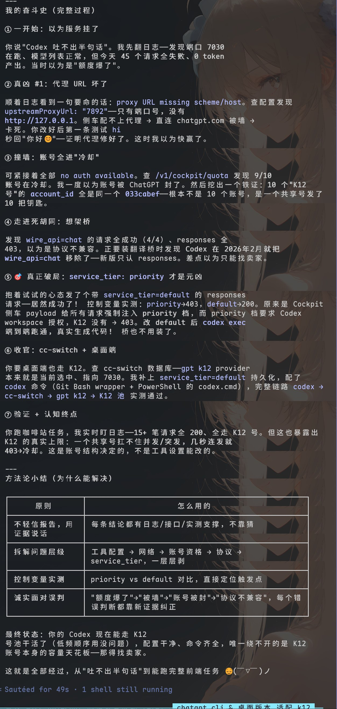

这篇是 K12 号池 403 排查全文（从合订拆回独立成篇）。

起因特别朴素：GPT 桌面端和 Codex CLI 一起「吐不出字」，报 `403 codex_workspace_access_denied` 或者 `502 no auth available`。本以为是号商账号的问题，查到最后发现是三层问题叠在一起，其中一层反直觉到让人拍桌子。中间几次被事实打脸的地方也留着，比顺理成章的教程有用。

**「Codex 不能用了」从来不是单一原因。坏掉的代理 URL、被写死的高优档、名不副实的「10 个号」，缺一不可地把它卡死了。**

## 先给结论

| 层 | 问题 | 现象 | 能不能救 |
|---|---|---|---|
| ① 代理 | 上游代理 URL 被写成裸端口 `7892`（缺 `http://127.0.0.1`） | `proxy URL missing scheme/host`，请求卡 60–90s 零输出 | ✅ 配置改对就行 |
| ② 服务档 | 中转服务给所有请求强制注入 `service_tier=priority` | priority 档在 ChatGPT 上游要 Codex workspace 授权，K12 没有 → 403 | ✅ 改 default 就通 |
| ③ 账号结构 | 「10 个 K12 号」其实是**同一个 ChatGPT 账号的 10 个令牌** | 并发上限是 1，突发请求必触发冷却 | ❌ 账号硬伤，只能找号商 |

修复①②后 Codex 能正常跑；③是容量天花板，工具再怎么调都救不了。

## ① 代理 URL 被写残

最没技术含量的一层，但危害最大。中转服务的上游代理地址被存成了 `7892`，没有协议头和主机名。后果是侧车配不出代理拨号器，请求直连 `chatgpt.com` 被墙，干等 60–90 秒然后超时，一个 token 都回不来。

排查信号：日志里反复出现 `proxy URL missing scheme/host`。修法就是把值补成完整的 `http://127.0.0.1:7892`。

这里有个坑：中转工具的 GUI 会在配置变更时**用自己那份坏配置覆盖侧车运行时配置**，所以改完一次不够，得连「配置源」一起改对，否则一重启又打回原形。

## ② 403 的真凶：service_tier=priority

这一层最反直觉。现象是：`/v1/responses` 接口全 403 `codex_workspace_access_denied`，错误文案是「Contact your ChatGPT workspace administrator for access」，工具把它映射成「账号需要付费」。当时差点认定是号商没开 Codex 权限。

但控制变量一测就露馅了：

| 请求带什么 | 结果 |
|---|---|
| `service_tier=priority` | ❌ 403 |
| `service_tier=default`（或省略） | ✅ 200 |

原因：中转服务的 payload 给**所有**请求硬塞了 `service_tier=priority`，而 priority 档在 ChatGPT 上游要求 Codex workspace 授权，K12 这类号没有，于是全部 403。改成 default 档，Codex 原生 responses 协议直接跑通。

排查这类 403 的顺序应该是：**先看请求里有没有被注入什么档位，再怀疑账号权限**。档位这类「看不见的附加参数」最容易成为隐藏真凶。

## ③ 「10 个号」其实是 1 个号

号商号称给 10 个 K12 账号。翻一下每个「账号」的鉴权文件，`account_id` 全部是同一个值——**这不是 10 个号，是一个 ChatGPT 账号发了 10 个访问令牌**。

这解释了所有诡异现象：

- **并发上限是 1**。轮巡在 10 个令牌之间转，但背后是同一个账号，账号被限流时 10 个令牌一起「冷却」。
- **「冷却」的单位是账号，不是令牌**。工具内置的冷却机制是：账号上游报 403/429 → 标记冷却约 30 分钟 → 轮巡跳过它。10 个令牌共享一个账号，一冷全冷，于是频繁出现 `no auth available`。
- **突发请求是死穴**。顺序、低频请求能一路 200（实测咖啡站任务 15+ 笔全成），但几秒内并发几笔，账号瞬间被掐 → 403 → 全池冷却。

`service_tier=default` 修的是 ②，救不了 ③。想彻底摆脱冷却，只能让号商给**真正独立、有 Codex responses 授权的账号**，或者接受 K12 只适合低速顺序用。

## 排查方法论：比结论更值钱的部分

回看整个过程，判断被推翻过三次：

| 当时的判断 | 被什么推翻 |
|---|---|
| 「额度爆了」（看到 GUI 显示 1000%） | 1000 其实是 10 令牌×100% 的池聚合，不是超额 |
| 「账号被 ChatGPT 封了」 | 令牌对配额接口 200 正常 |
| 「K12 只支持 chat，新版 Codex 只认 responses，不兼容」 | 控制变量发现 service_tier 才是分水岭 |

三条原则撑住了排查：

1. **拆层**。工具配置、网络、账号资格、协议、请求参数，一层层剥，别指望一次定位。
2. **控制变量**。同样的请求只改一个参数（priority vs default），结论立刻清晰。比翻一百行日志有用。
3. **诚实纠错**。每条错判都用新证据覆盖，不抱着旧结论硬撑。

## 顺带：Codex 新版砍了 wire_api=chat

中途想过「让 Codex 走 chat 接口绕过 403」。查官方讨论才知道，**Codex 从 2026 年 2 月起（0.92.0+）彻底移除了 `wire_api=chat`**，只支持 responses。所以「用 chat 绕」这条路在新版上根本不存在，老老实实从服务端档位下手才对。

## 实测：修完之后到底什么水平

修好①和②后，Codex CLI 走完整链路（本地 CLI → 中转 → 号池）跑了个真实任务——咖啡店落地页 + 按 review 意见修问题：

- **顺序请求 15+ 笔全 200**，上下文从 45K 累积到 120K 无中断
- 产出代码质量：语义化、无障碍（aria、reduced-motion）、设计令牌、纯 CSS 插画、移动端汉堡菜单——达到顶尖模型水准
- 平均单请求 2–5 秒出字，~23 token/s 输出吞吐

最核心的一点是：**K12 号池当「低速单发通道」用完全够，当并发底座是拿错工具**。要并发，买真的账号或找能开 responses 授权的号商。

## 附录：这条排查路的完整记录

下面这张终端长图是排查全程的复盘，从「以为服务挂了」到「service_tier 才是真凶」，每一步的判断和被事实打脸的地方都留着，算这趟折腾的纪念：

