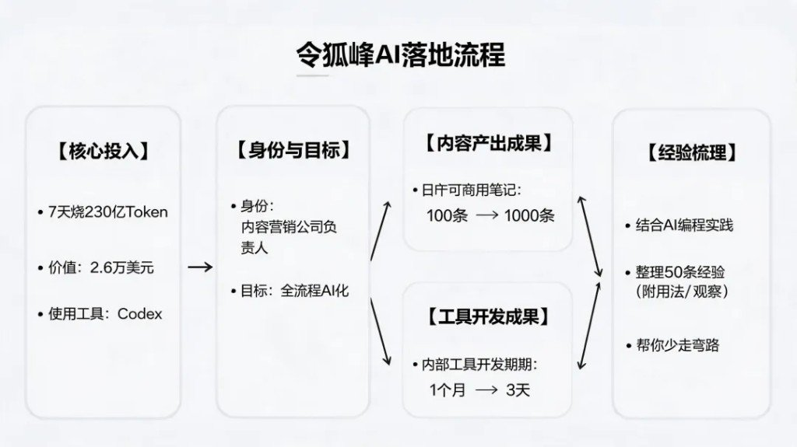
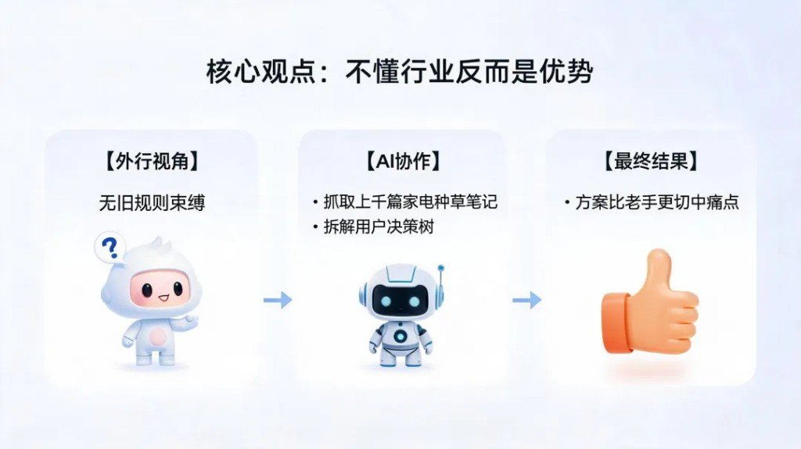
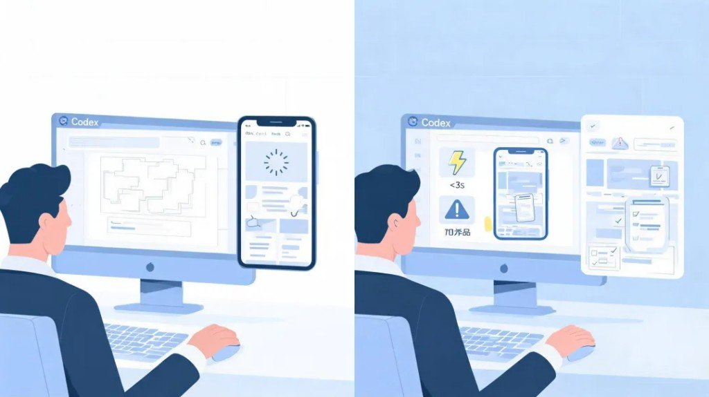

看案例、听聚会，和真正把 Codex 当默认执行者，是两回事。

有位把 Codex 当默认执行者的实践者，把完整目标直接丢给 Codex：持续调研、写代码、跑测试、开浏览器，最后交可直接用的文件或产品。7 天烧掉 **230 亿 Token**（约 **$2.6 万**），消耗一度排到榜一。落地数字也不含糊：可商用笔记日产 **100 → 1000**；内部提效工具开发期 **1 个月 → 3 天**；销售陪练考核系统 **1 天** 做出来。

下面 50 条按原文六大部分收录——不是官方十条的翻版，是业务侧「敢把权限交出去」之后的实战清单。

相关阅读：官方十条边界气质、[Claude Code 四类循环](/posts/claude-code-four-loops/)、Prompt→Harness→Loop 四站、Vibe Coding 流程纪律——见文末。

---

## AI Native 的工作方式

1. 相信未来是一个**普通人靠想法也能暴富的时代**，前提是你学会无限烧 Token 的方式。

2. 真正拉开差距的不是「会不会用 AI」，而是**拥有 AI Native 的思维**：不要让人成为瓶颈，思考怎么减少自己的参与；你敢不敢让 AI 连续工作几小时、几天，甚至长期替你推进一个目标。

3. **学会搭建稳定、低成本的模型调用方案。** Token 成本降不下来，你就会下意识少思考、少尝试、少并行。

4. 想办法让账号拥有更充足的 Token 配额。可以研究 OpenCodex、CC Switch。

5. 不要把「省 Token」当成最高目标。Token 可以再买，真正稀缺的是你的时间、注意力和机会窗口。

6. 烧 Token 不是让 AI 陪你闲聊，而是让它持续搜索、分析、执行、验证，最后交付可以直接使用的结果。

7. 最有价值的不是一个神奇提示词，而是一套能够反复运行、持续优化的工作流程。

8. **相信 AI，理解 AI，然后尽可能让 AI 去做。** 很多事情不是 AI 做不了，而是你没有真正把权限和任务交给它。

9. 再次强调：**不要让人成为工作流里的瓶颈。** 每次需要你复制、粘贴、确认、整理，都应该思考能否继续自动化。

10. AI Native 不是「原来的业务加一个聊天框」，而是重新设计整个业务，让 AI 成为默认执行者。

---

## 从陌生行业开始做新项目

11. **不懂一个行业有时反而是优势。** 你没有被旧规则限制，更容易让 AI 带着你从第一性原理重新拆解行业。

12. **遇到新行业，不要先花三个月学习。** 先让 Codex 调研市场、整理术语、分析竞品，再用真实项目反向学习。

13. 做新业务时，**先考虑能不能让 AI 完成**，再考虑要不要招人。很多过去需要一个团队的事情，现在可能只需要一个负责人。

14. 一定要**优先使用当前能力最强的模型**。模型能力差一点，可能不是结果差一点，而是整个复杂任务根本跑不通。

15. 简单任务可以交给便宜模型，关键判断、复杂编码和长期任务交给顶级模型。不要为了省小钱，浪费更多返工时间。

16. 学会观察 Codex 的额度和重置时间。临近重置还有大量额度，就安排代码审计、竞品调研、批量测试等重任务。

17. 不要等到额度快过期才随便烧。提前准备一个「高 Token 任务池」，有剩余额度时直接启动。

18. 学会使用目标模式。把一个需要数小时甚至数天的结果设成目标，让 Codex 围绕最终交付持续推进。

---

## 让 AI 从想法走到可交付结果

19. **目标要写结果，不要只写动作。** 不要说「研究一下竞品」，要说「交付竞品数据库、差异分析和可执行方案」。

20. **学会使用 Plan 模式。** 复杂任务先让 Codex 拆步骤、找风险、确定验收标准，再开始执行，返工会少很多。

21. 简单任务别过度规划，复杂任务别直接开干。判断标准是：做错一次的返工成本高不高。

22. 给 Codex 明确的完成标准。例如「页面能打开」不够，要写清楚响应速度、移动端效果、异常状态和测试要求。

23. 不要只告诉 AI「做什么」，还要告诉它**「做到什么程度」。** 没有验收标准，AI 很容易交付一个看起来完成的半成品。

24. 大任务尽量交付文件、代码、表格或网页，不要只停留在聊天答案。能沉淀的成果，才有复利。

25. 让 Codex 先读取现有项目、历史文档和真实数据，再提出方案。上下文越真实，输出越少像套话。

---

## 把重复操作做成长期流程

26. **为长期项目编写 AGENTS.md。** 把项目规则、目录结构、禁区和验收方式写进去，避免每次重新解释。

27. **把经常重复的操作做成 Skill。** 一次写好规则，以后一句话就能触发完整流程。

28. 把高频提示词升级为模板，把模板升级为 Skill，再把多个 Skill 串成自动运行的业务系统。

29. 学会使用工具和连接器。让 Codex 直接读取代码、文档、邮件和数据库，少做人工搬运。

30. 不要复制几万行日志给 AI。让 Codex 自己搜索关键词、定位异常时间段、提取相关上下文，更快也更准确。

---

## 让 AI 完成调研、开发和测试

31. **遇到 Bug，不要只让 AI 猜原因。** 让它复现问题、读取日志、缩小范围、编写测试，最后验证修复。

32. 修复问题时要求 Codex 先写失败测试，再修改代码。能被测试捕获的 Bug，才更不容易再次出现。

33. 不要用「感觉差不多」验收。让 Codex 跑测试、查看页面、检查日志，用证据证明任务已经完成。

34. 做网页时，让 Codex 同时检查桌面端、移动端、加载状态、空状态和错误状态，别只看首页截图。

35. **学会让 Codex 操作浏览器。** 大量调研、录入、页面测试和后台操作，本质上都可以转化成浏览器工作流。

36. 让 AI 看图、看截图、看视频，不要什么都靠文字描述。多模态输入经常比你解释十分钟更准确。

37. 不要自己逐个整理竞品。让 Codex 批量搜集、分类、去重、打标签，再由你判断真正值得关注的信号。

38. 相信自己的想法，但前提是看过足够多的竞品、用户反馈和失败案例。自信应该建立在信息密度上。

39. 一个想法不要只生成一套方案。让 Codex 同时给出保守版、激进版、低成本版和最快验证版，再进行比较。

40. 学会并行推进。市场研究、产品设计、技术验证和内容生产可以同时运行，不必等上一件事做完。

41. 并行不是让十个 AI 重复回答同一个问题，而是把任务拆成互不依赖的子问题，最后再汇总判断。

---

## 用复盘和配置提高长期效率

42. 让最好模型用最高推理做审查，执行用中等推理即可。

43. 重要决策不要只问「这个想法好不好」，要让 AI 主动反对你。哪里会失败、什么假设最危险、如何最低成本证伪，都可以让它一起检查。

44. 学会洞察 Codex 或 Claude 的周额度重置时间，它是有规律的，不要浪费剩余的 Token。

45. 一次对话只解决一个问题，会浪费 Codex 的连续工作能力。尽量把「调研、方案、实现、测试、复盘」连成闭环。

46. 每完成一个项目，都让 Codex 复盘。哪些步骤浪费了 Token，哪些信息重复提供，哪些流程可以自动化。

47. **建立自己的失败案例库。** AI 犯过的错误、无效提示词和项目踩坑，都应该沉淀成下一次的约束条件。

48. 买一台性能更好的电脑，建议是 1 万元以上的 Mac，尤其是需要同时运行 Codex、浏览器、开发环境和 Docker 时。生产工具卡顿，会直接限制你的并行能力和思考速度。有段时间，机器只能每天烧 30 亿 Token——因为电脑成了瓶颈。

49. **不要为了烧 Token 而烧 Token。** 原文此处附「试试装一下这几个 Skill」配图清单（镜像文本未展开具体 Skill 名，以图为准）。

50. 你不需要一次把 50 条全用上。先找一个自己每周都会重复做的任务，把目标、验收标准和上下文交代清楚，让 Codex 完整跑一遍。**跑完以后再复盘，把重复步骤写进 AGENTS.md 或做成 Skill。**

---

## 先跑通一件重复的事

别把这 50 条当收藏夹。挑一件每周必做的活，目标 + 验收 + 上下文一次说清，让 Codex 整段跑完；再把重复步骤写进 `AGENTS.md` / Skill。烧得出 Token 不难，烧成可复用流程才算数。
