## 内容说明
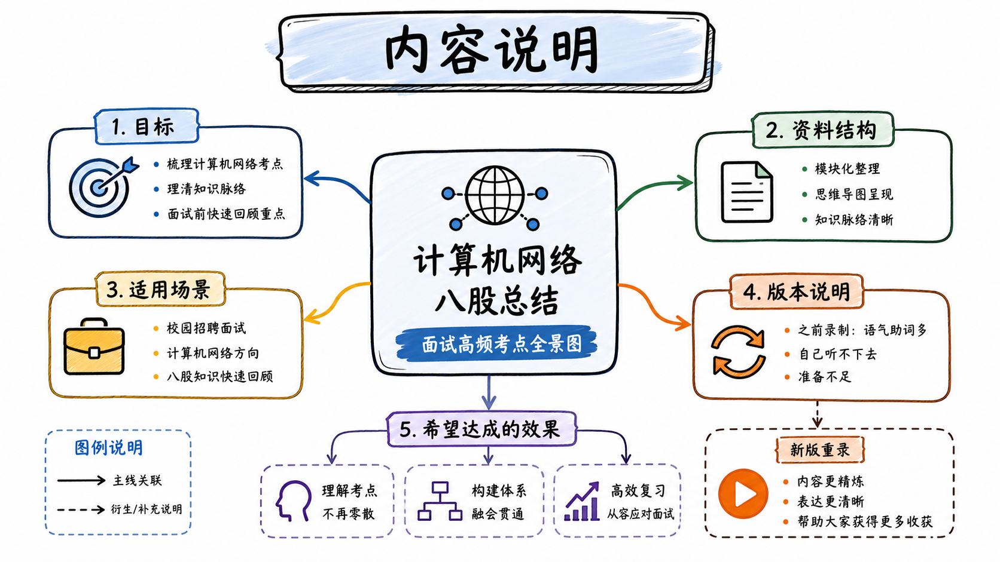

大家好，我是程序员Dan。今天想和大家一起总结计算机校园招聘面试中经常提问的计算机网络八股。我把这些内容分模块整理在了一张思维导图中，希望借此帮助大家理清计算机网络相关考点的知识脉络，也方便大家在面试前快速回顾重点。

其实我之前已经录过一版计算机网络视频，但那版非常尴尬，我自己都听不下去，因为里面有太多语气助词。也可能是第一次录这种课程，准备得不够充分，所以今天重新录制一版，希望大家能通过新版获得更多收获。

## 计算机网络体系结构
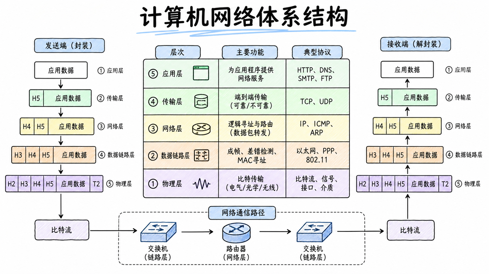

## OSI 七层模型
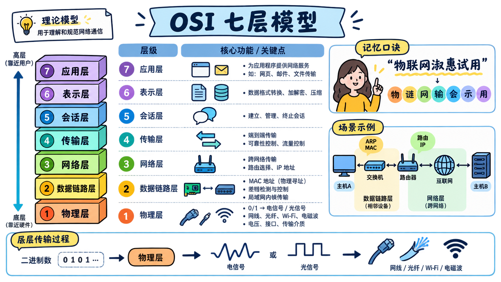

OSI 七层模型是一个理论模型，包括：

1. 物理层
2. 数据链路层
3. 网络层
4. 传输层
5. 会话层
6. 表示层
7. 应用层

可以用一句谐音口诀快速记忆：

> **“物联网淑惠试用”**——对应“物、链、网、输、会、示、用”，可以理解成有一个叫淑惠的人试用物联网。

面试中，我也被问到过 OSI 七层模型。一般面试官会要求你说出具体有哪几层，以及每一层的大致功能。对于这部分内容，建议先理解，再记忆。

### 物理层

物理层负责在物理媒介上实现原始数据传输，并定义物理设备标准，例如：

- 网线、光纤、Wi-Fi；
- 电磁波；
- 电压高低；
- 各类物理接口和传输介质。

物理层会把二进制的 `0` 和 `1` 转换为电信号或光信号发送出去。

可以想象一下：使用计算机时，如果网线没有插好、Wi-Fi 断开，或者光纤被挖断，就代表物理层出现了故障，此时自然无法与其他设备通信。

### 数据链路层

数据链路层负责在物理连接中提供相对可靠的数据传输，并建立和维护两个相邻节点之间的链路。这一层的核心功能包括：

- **物理寻址**，也就是使用 MAC 地址；
- **差错检测与控制**；
- 在同一局域网或广播域内完成数据帧传输。

例如，一台计算机的网卡拥有唯一的 MAC 地址。如果它要向同一局域网或同一机房内的另一台服务器发送数据，就可以使用 **ARP 协议**，根据 IP 地址查询对应的 MAC 地址，再完成数据发送。

因此，数据链路层主要作用于相邻设备，不负责跨网络通信。

### 网络层

网络层负责在多个网络之间传输数据，确保数据能够在复杂的网络结构中，找到从源地址到目的地址的合适路径。这一层主要使用 **IP 协议**。

例如：

- 为服务器配置公网 IP；
- 使用 `ping` 命令测试网络是否连通；
- 路由器根据 IP 地址和路由表转发数据包；
- 将数据包逐跳转发到目标区域、目标机房中的计算机。

网络层解决的是“从哪台机器到哪台机器”的问题，但一般不关心数据最终由这台机器上的哪个程序接收。

### 传输层

传输层提供端到端的通信服务，负责保证数据的完整性、顺序性，并通过端口号区分具体进程。常见的传输层协议包括：

- **TCP**
- **UDP**

传输层中的重要知识点包括：

- TCP 三次握手；
- TCP 四次挥手；
- 滑动窗口；
- 流量控制；
- 拥塞控制；
- 端口号。

例如，Tomcat 默认监听的 `8080` 端口、MySQL 默认使用的 `3306` 端口，都是在传输层定义和使用的。Java Web 中使用 `RestTemplate` 发起请求，其底层通信最终也会涉及传输层中的 TCP。

### 会话层

会话层负责管理用户会话，控制网络中两个节点之间的对话与数据交换，并负责会话的建立、维护和终止。

会话层还有一个值得记住的功能：**断点续传**。例如，一个文件传输到一半时连接中断，下次可以从断点处继续传输，相当于建立并维护了一条专属的通信会话。

现实中的协议很少单独实现会话层，它通常会被合并到应用层。例如：

- Tomcat 中的 Session 管理；
- Java Web 中使用 `HttpSession` 保持用户登录状态；
- Netty 中通过 `ChannelPipeline` 等组件管理连接生命周期；
- RDP 远程桌面的断线重连。

例如，用户登录后，一段时间内不需要重复输入密码，这种登录状态保持就与会话管理有关。

### 表示层

表示层负责数据格式转换，确保不同系统能够理解对方的数据。常见功能包括：

- 加密与解密；
- 压缩与解压；
- 编码转换；
- 数据格式转换。

相关例子包括：

- HTTPS 中 TLS 对数据的加密与解密；
- UTF-8 字符编码转换；
- JPEG、PNG 等图片格式及其压缩；
- 对数据进行摘要或编码处理。

有时向数据库存储密码摘要会使用 MD5。严格来说，**MD5 是哈希摘要算法，不是可逆加密算法**，但这种数据转换工作可以帮助理解表示层的职责。

在 TCP/IP 四层模型或五层模型中，表示层通常也会被合并到应用层。

### 应用层

应用层是离用户最近的一层，负责处理特定应用程序的网络通信细节，并提供网络服务与用户应用软件之间的接口。

常见应用层协议包括：

- HTTP、HTTPS；
- DNS；
- SMTP；
- FTP。

Web 浏览器、电子邮件客户端、FTP 客户端和服务器等，都直接使用应用层提供的服务。

在 Java Web 中，通过 `@RequestMapping` 接收请求、返回 JSON 数据，也可以理解为应用层相关的工作。

## TCP/IP 四层模型
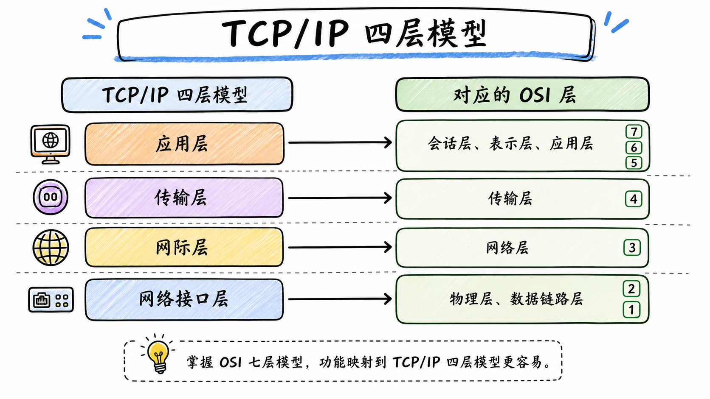

TCP/IP 四层模型与 OSI 七层模型类似，具体对应关系如下：

| TCP/IP 四层模型 | 对应的 OSI 层 |
|---|---|
| 网络接口层 | 物理层、数据链路层 |
| 网际层 | 网络层 |
| 传输层 | 传输层 |
| 应用层 | 会话层、表示层、应用层 |

只要掌握了 OSI 七层模型，每一层的功能就很容易映射到 TCP/IP 四层模型中。

## 五层网络模型
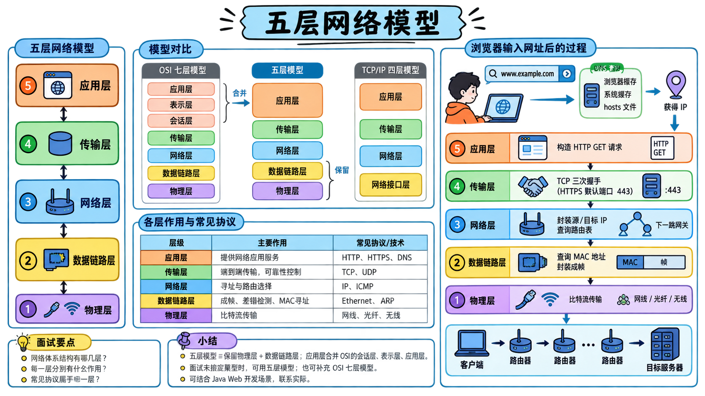

五层网络模型包括：

1. 物理层；
2. 数据链路层；
3. 网络层；
4. 传输层；
5. 应用层。

与 TCP/IP 四层模型相比，五层模型保留了物理层和数据链路层；应用层仍然合并了 OSI 模型中的会话层、表示层和应用层。

面试时，面试官有时不会指定使用哪一种模型，只会要求介绍计算机网络体系结构。这时可以使用五层模型回答，也可以为了完整起见介绍 OSI 七层模型。

这部分知识通常考得比较基础，常见问题是：

- 网络体系结构有哪几层？
- 每一层分别有什么作用？
- 常见协议属于哪一层？

部分大厂或私企的面试官可能会结合场景题，例如：

> **在浏览器中输入网址并按下回车后，发生了什么？**

可以结合网络分层回答：

- **应用层**：浏览器构造 HTTP GET 请求；DNS 根据域名查询 IP 地址，查询时可能先检查浏览器缓存、系统缓存和本地 `hosts` 文件。
- **传输层**：通过 TCP 三次握手建立连接；HTTPS 默认目标端口为 `443`。
- **网络层**：封装源 IP 和目标 IP，查询路由表，找到下一跳网关。
- **数据链路层与物理层**：查询下一跳对应的 MAC 地址，将数据封装成帧，通过网线、光纤或无线信号发送。
- 数据经过多个路由器转发，最终到达目标服务器。

回答时可以把这些内容与 Java Web 的日常开发场景结合起来，让整体逻辑更完整。

## 浏览器访问、DNS 与 HTTP
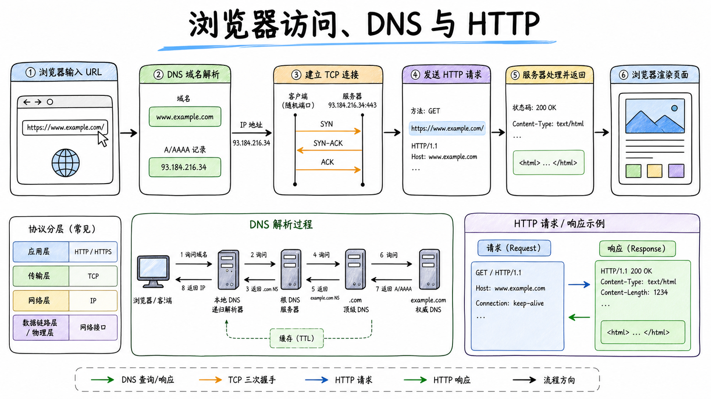

## 从输入 URL 到页面显示
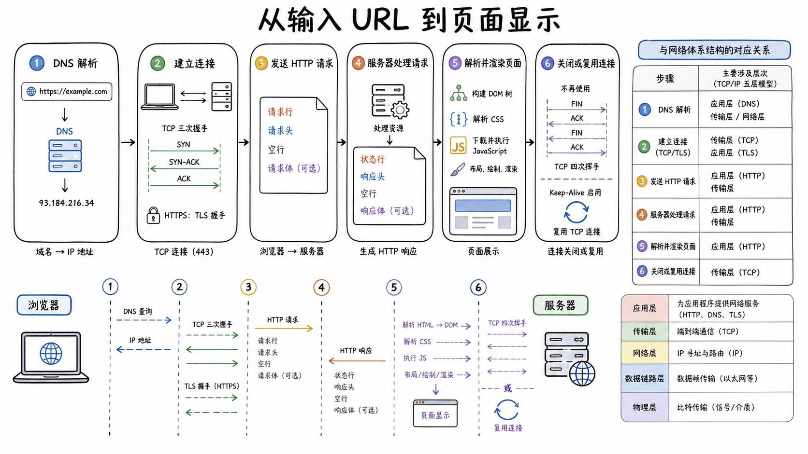

在浏览器地址栏输入 URL，到最终显示主页，通常经历以下过程。

### 1. DNS 解析

浏览器发起 DNS 查询，将域名解析为服务器对应的 IP 地址。

### 2. 建立 TCP 连接

浏览器通过解析得到的 IP 地址与服务器建立 TCP 连接。访问 HTTPS 服务时，一般连接服务器的 `443` 端口，这一步涉及 TCP 三次握手。

如果是 HTTPS，还要在 TCP 连接建立后完成 TLS 握手。

### 3. 发送 HTTP 请求

浏览器构建 HTTP 请求报文，通常包括：

- 请求行；
- 请求头；
- 空行；
- 请求体。

随后，浏览器将请求发送给服务器。

### 4. 服务器处理请求

服务器接收到 HTTP 请求后，根据请求的资源路径进行处理，并生成 HTTP 响应报文。响应报文通常包括：

- 状态行；
- 响应头；
- 空行；
- 响应体。

### 5. 浏览器解析并渲染页面

浏览器接收到 HTTP 响应后，开始解析响应体中的 HTML 内容，并继续处理相关资源：

- 构建 DOM 树；
- 解析 CSS；
- 下载并执行 JavaScript；
- 进行布局、绘制和页面渲染。

最终，页面被展示出来。

### 6. 关闭或复用连接

如果连接不再使用，可以通过 TCP 四次挥手关闭连接；如果启用了 HTTP Keep-Alive，则可能继续复用该 TCP 连接。

整个过程也可以与网络体系结构结合起来，说明每一步分别发生在哪一层。

## Cookie 与 Session 的状态管理
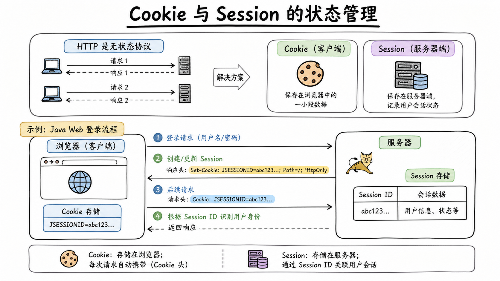

HTTP 本身是无状态协议。每一次请求都是相对独立的，服务器默认不会因为当前请求自动记住上一次请求的身份状态。

为了解决状态管理问题，可以使用 Cookie 和 Session：

- **Cookie**：保存在客户端浏览器中的一小段数据；
- **Session**：通常保存在服务器端，用于记录用户会话状态。

例如，在 Java Web 中，用户登录成功后，可以通过：

```java
HttpSession session = request.getSession();
session.setAttribute("user", user);
```

在服务器端创建或更新 Session。服务器通常会通过响应头中的 `Set-Cookie` 返回 `JSESSIONID`。浏览器保存后，下次请求会自动在请求头的 `Cookie` 字段中携带这个 ID，服务器便可以根据它识别用户身份。

## DNS 解析过程
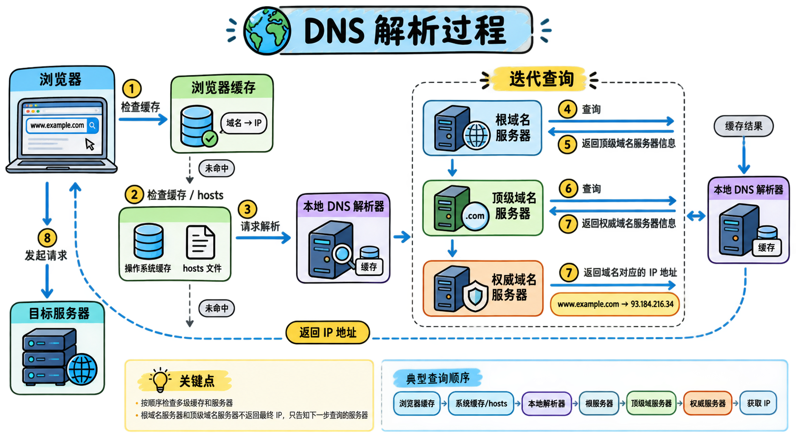

DNS 解析通常会依次检查多级缓存和服务器。简化后的流程如下：

1. 浏览器检查自身缓存中是否存在域名对应的 IP 地址。
2. 如果没有，继续检查操作系统缓存和本地 `hosts` 文件。
3. 如果仍然没有结果，则向本地 DNS 解析器发起请求。
4. 本地 DNS 解析器在没有缓存的情况下，向根域名服务器查询。
5. 根域名服务器返回对应顶级域名服务器的信息。
6. 顶级域名服务器返回对应权威域名服务器的信息。
7. 权威域名服务器返回域名对应的 IP 地址。
8. 浏览器使用获得的 IP 地址向目标服务器发起请求。

根域名服务器和顶级域名服务器通常不会直接返回最终网站的 IP，而是告诉查询方下一步应该询问哪台服务器。

## GET 与 POST 的区别
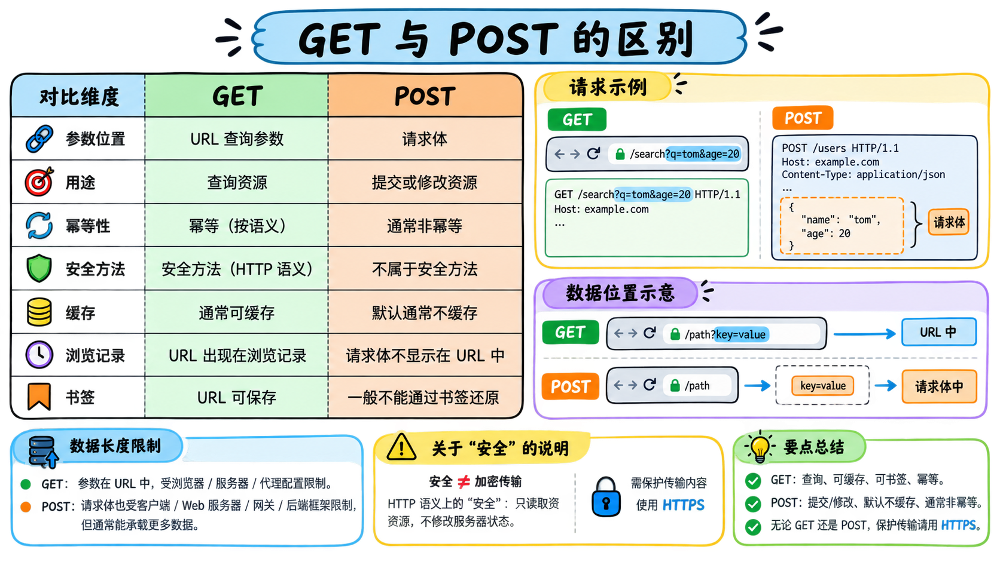

GET 和 POST 可以从多个维度进行比较。

| 对比维度 | GET | POST |
|---|---|---|
| 参数位置 | 通常放在 URL 查询参数中 | 通常放在请求体中 |
| 用途 | 通常用于查询资源 | 通常用于提交或修改资源 |
| 幂等性 | 按语义应当是幂等的 | 通常不是幂等的 |
| 安全方法 | HTTP 语义上属于安全方法 | 不属于安全方法 |
| 缓存 | 通常可以缓存 | 默认通常不缓存 |
| 浏览记录 | URL 可出现在浏览记录中 | 请求体不会直接显示在 URL 中 |
| 书签 | URL 可以保存为书签 | 一般不能通过书签还原请求体 |

GET 参数通常放在 URL 中，因此实际可传输长度会受到浏览器、服务器和代理配置限制。POST 的请求体也并非绝对“没有大小限制”，它同样会受到客户端、Web 服务器、网关和后端框架配置的限制，只是通常能承载更多数据。

这里提到的“安全”是 HTTP 方法语义上的安全，即请求原则上只读取资源，不应修改服务器状态，并不等于网络传输层面的安全。无论 GET 还是 POST，如果需要保护传输内容，都应使用 HTTPS。

## HTTP 报文结构
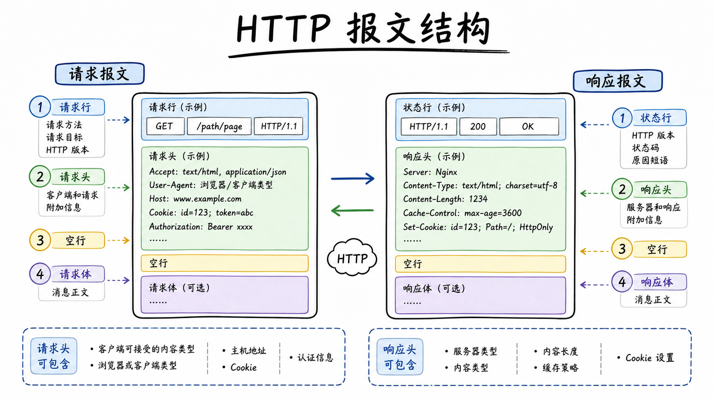

### 请求报文

HTTP 请求报文通常包括：

1. **请求行**：请求方法、请求目标和 HTTP 版本；
2. **请求头**：客户端和请求的附加信息；
3. **空行**；
4. **消息正文**，即请求体。

请求行示例：

```http
GET /index.html HTTP/1.1
```

请求头可以包含：

- 客户端可接受的内容类型；
- 浏览器或客户端类型；
- 主机地址；
- Cookie；
- 认证信息。

### 响应报文

HTTP 响应报文通常包括：

1. **状态行**：HTTP 版本、状态码和原因短语；
2. **响应头**：服务器和响应的附加信息；
3. **空行**；
4. **消息正文**，即响应体。

响应头可以包含：

- 服务器类型；
- 内容类型；
- 内容长度；
- 缓存策略；
- Cookie 设置。

## 常见 HTTP 状态码
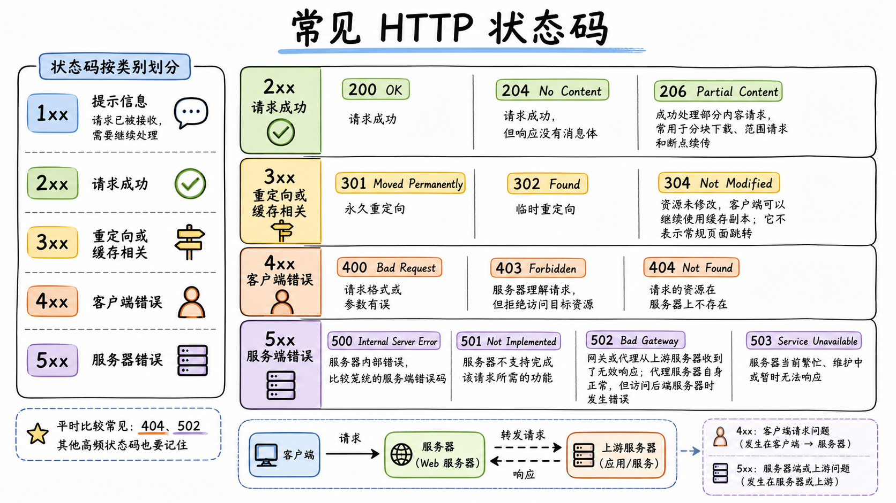

HTTP 状态码按类别划分如下：

- **1xx**：提示信息，表示请求已被接收，需要继续处理；
- **2xx**：请求成功；
- **3xx**：重定向或缓存相关；
- **4xx**：客户端错误；
- **5xx**：服务器错误。

常见状态码包括：

- **200 OK**：请求成功。
- **204 No Content**：请求成功，但响应没有消息体。
- **206 Partial Content**：服务器成功处理部分内容请求，常用于分块下载、范围请求和断点续传。
- **301 Moved Permanently**：永久重定向。
- **302 Found**：临时重定向。
- **304 Not Modified**：资源未修改，客户端可以继续使用缓存副本；它不表示常规页面跳转。
- **400 Bad Request**：请求格式或参数有误。
- **403 Forbidden**：服务器理解请求，但拒绝访问目标资源。
- **404 Not Found**：请求的资源在服务器上不存在。
- **500 Internal Server Error**：服务器内部错误，是比较笼统的服务端错误码。
- **501 Not Implemented**：服务器不支持完成该请求所需的功能。
- **502 Bad Gateway**：网关或代理从上游服务器收到了无效响应。例如代理服务器自身正常，但访问后端服务器时发生错误。
- **503 Service Unavailable**：服务器当前繁忙、维护中或暂时无法响应。

平时比较常见的是 `404` 和 `502`，但其他高频状态码也需要记住。

## HTTPS 的工作流程
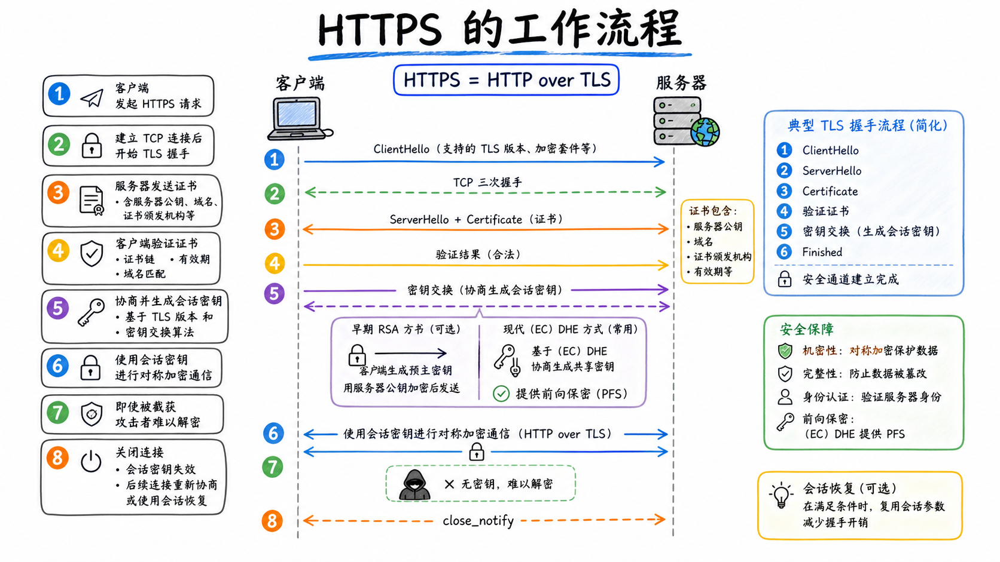

HTTPS 可以理解为 **HTTP over TLS**。其简化工作流程如下：

1. 客户端向服务器发起 HTTPS 请求。
2. 在建立 TCP 连接后，客户端与服务器开始 TLS 握手。
3. 服务器向客户端发送证书，证书中包含服务器公钥、域名、证书颁发机构等信息。
4. 客户端验证证书是否合法，包括证书链、有效期、域名匹配情况等。
5. 双方根据所使用的 TLS 版本和密钥交换算法，协商并生成会话密钥。
6. 后续通信使用会话密钥进行对称加密，以提高加解密效率。
7. 即使通信内容被截获，攻击者在没有密钥的情况下也难以解密数据。
8. 通信结束后关闭连接，相关会话密钥失效；后续连接会重新协商，或者在满足条件时使用 TLS 会话恢复机制。

在较早的 RSA 密钥交换流程中，客户端可能生成预主密钥并使用服务器公钥加密后发送给服务器；现代 TLS 通常更多使用基于（EC）DHE 的密钥交换方式，以提供前向保密能力。

## Cookie 与 Session 的区别
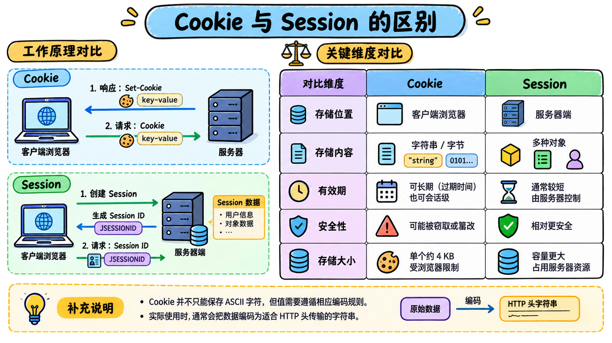

| 对比维度 | Cookie | Session |
|---|---|---|
| 存储位置 | 客户端浏览器 | 服务器端 |
| 存储内容 | 通常是字符串或字节形式的数据 | 可以保存服务端支持的多种对象 |
| 有效期 | 可通过过期时间长期保存，也可以是会话级 Cookie | 通常有效时间较短，由服务器控制 |
| 安全性 | 存在客户端，可能被窃取或篡改 | 数据存储在服务端，相对更安全 |
| 存储大小 | 单个 Cookie 通常约为 4 KB，并受浏览器限制 | 容量通常远高于 Cookie，但会占用服务器资源 |

Cookie 并不是只能保存 ASCII 字符，但其值需要遵循相应编码规则。实际使用时，通常会把数据编码为适合 HTTP 头传输的字符串。

## IP 协议与 ARP 协议
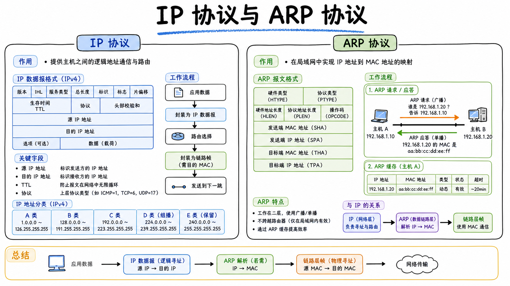

## IP 协议的作用
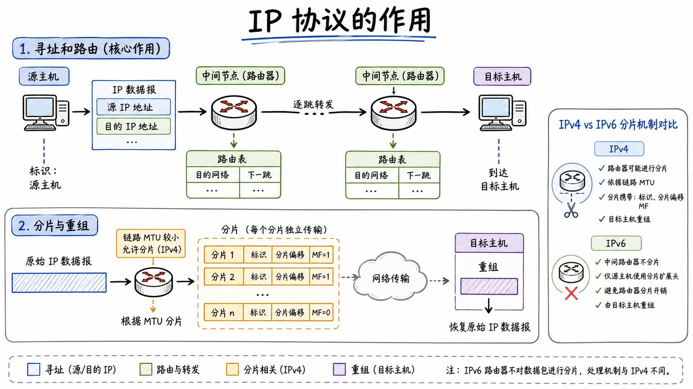

IP 协议最核心的作用是：**寻址和路由**。

IP 数据报中会携带源 IP 地址和目的 IP 地址，用于标识数据包的源主机和目标主机。数据包在传输过程中，每经过一个中间节点，节点都会根据网络地址进行转发。

如果中间节点是路由器，它会查询路由表，选择合适的下一跳路径。IP 数据报会被逐跳转发，直到到达目标主机。

### 分片与重组

IP 数据报在传输过程中可能经过不同网络，而不同网络允许通过的最大数据长度可能不同。

在 IPv4 中，如果数据报过大且允许分片，可能会根据链路的 MTU 进行分片。每个分片会携带标识、分片偏移等信息，并独立传输；到达目标主机后，再根据这些信息完成重组，恢复原始 IP 数据报。

需要注意的是，IPv6 中间路由器不会像 IPv4 那样对数据包进行分片，相关处理机制有所不同。

## ARP 协议的工作过程
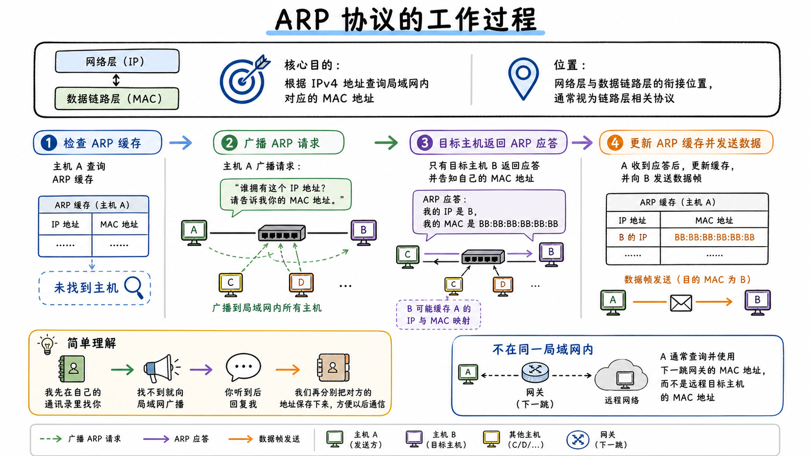

ARP 的核心目的是根据 IPv4 地址查询局域网内对应的 MAC 地址，它工作在网络层与数据链路层的衔接位置，通常被视为链路层相关协议。

假设主机 A 要向同一局域网内的主机 B 发送数据：

1. **检查 ARP 缓存**  
   主机 A 首先在自己的 ARP 缓存中查找主机 B 的 IP 地址与 MAC 地址映射关系。

2. **广播 ARP 请求**  
   如果没有找到，主机 A 会在局域网内广播一个 ARP 请求，大意是：“谁拥有这个 IP 地址？请告诉我你的 MAC 地址。”

3. **目标主机返回 ARP 应答**  
   网络中的所有主机都会收到广播，但只有拥有目标 IP 的主机 B 会返回 ARP 应答，告诉主机 A 自己的 MAC 地址。主机 B 也可能缓存主机 A 的 IP 与 MAC 地址映射关系。

4. **更新 ARP 缓存并发送数据**  
   主机 A 收到应答后，将主机 B 的 IP 与 MAC 地址映射关系保存到 ARP 缓存中，随后完成数据帧发送。

简单理解就是：

> 我先在自己的通讯录里找你；找不到就向局域网广播。你听到后回复我，我们再分别把对方的地址保存下来，方便以后通信。

如果目标主机不在同一局域网内，发送方通常查询并使用的是**下一跳网关的 MAC 地址**，而不是远程目标主机的 MAC 地址。

## TCP 核心知识
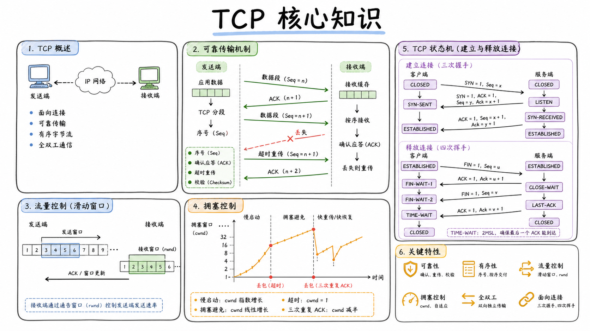

## TCP 三次握手
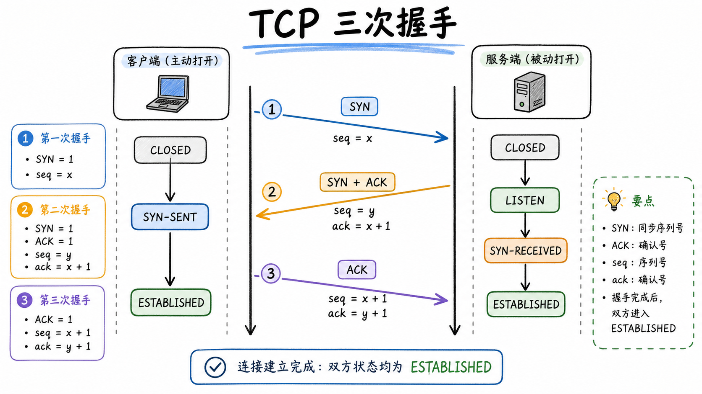

TCP 三次握手是面试中的高频基础题。除了说清楚每一步，还要掌握客户端与服务端的状态变化，以及 SYN、ACK、序列号和确认号的设置。

最初，客户端和服务端都处于 `CLOSED` 状态；服务端监听端口后进入 `LISTEN` 状态。

### 第一次握手：客户端发送 SYN

客户端向服务器发送 TCP 报文：

- `SYN = 1`；
- 客户端选择初始序列号 `seq = x`。

这表示客户端希望建立连接，并把自己的初始序列号告诉服务器。发送完成后，客户端进入：

```text
SYN_SENT
```

### 第二次握手：服务器发送 SYN + ACK

服务器收到连接请求并同意建立连接后，返回 TCP 报文：

- `SYN = 1`；
- `ACK = 1`；
- 服务器选择初始序列号 `seq = y`；
- 确认号 `ack = x + 1`。

这表示服务器确认了客户端的连接请求，同时把自己的初始序列号告诉客户端。发送完成后，服务器进入：

```text
SYN_RECEIVED
```

### 第三次握手：客户端发送 ACK

客户端收到服务器的应答后，再发送确认报文：

- `ACK = 1`；
- `seq = x + 1`；
- `ack = y + 1`。

客户端发送后进入 `ESTABLISHED` 状态；服务器收到该确认报文后，也进入 `ESTABLISHED` 状态，连接正式建立。

## 为什么不是两次握手
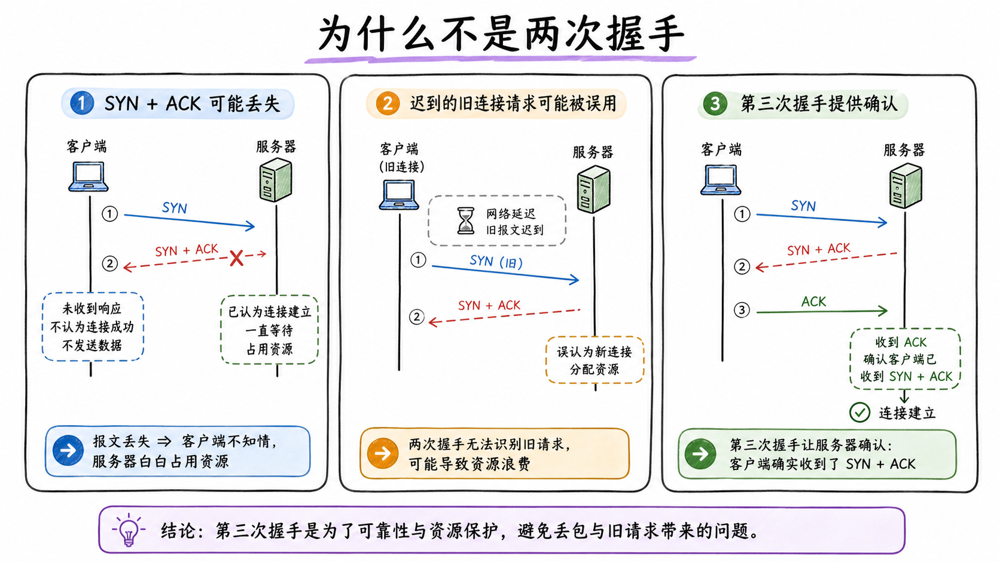

如果只有两次握手，服务器发送 `SYN + ACK` 后就认为连接已经建立，但这个报文可能丢失。客户端没有收到响应，就不会认为连接成功，也不会继续发送数据；服务器却可能一直等待，白白占用资源。

另外，网络中迟到的旧连接请求也可能到达服务器。如果只有两次握手，服务器可能误以为这是一个新的有效连接，并为其分配不必要的资源。

第三次握手能让服务器确认客户端确实收到了自己的同步与确认报文。

## 为什么不是四次握手
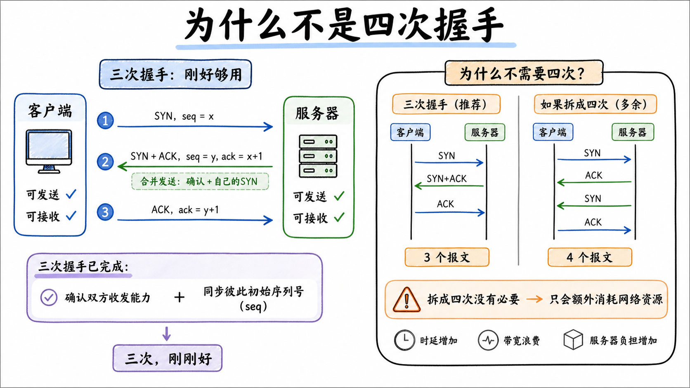

三次握手已经能够确认双方的收发能力，并同步彼此的初始序列号。

第二次握手中，服务器可以把对客户端 SYN 的确认 ACK，与服务器自己的 SYN 合并到同一个报文中发送。拆成四次没有必要，只会额外消耗网络资源。

因此，三次刚刚好。

## 三次握手与 Java Web
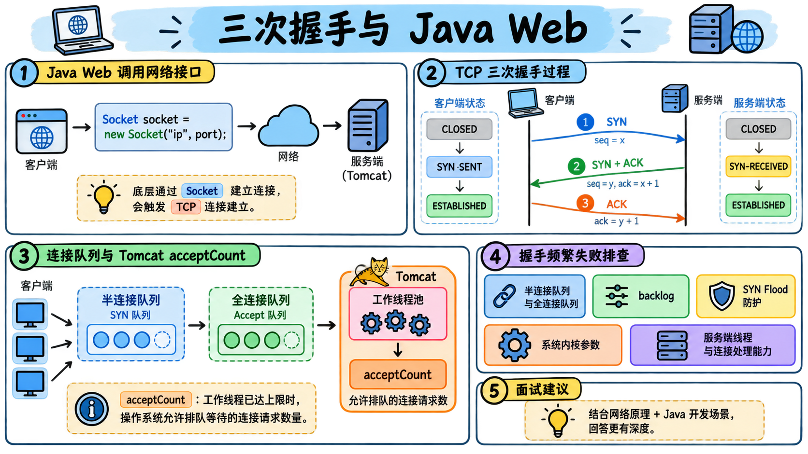

在 Java Web 开发中，调用网络接口时，底层会通过 Socket 建立连接，例如：

```java
socket.connect(address);
```

这个过程会触发 TCP 连接建立。

Tomcat 中的 `acceptCount` 表示当工作线程已达到上限时，操作系统允许排队等待接受的连接请求数量。它与高并发连接排队有关，但不应简单等同于 TCP 的半连接队列或全连接队列。

高并发场景中，如果 TCP 握手频繁失败，可以进一步排查：

- 半连接队列与全连接队列配置；
- `backlog`；
- SYN Flood 防护；
- 系统内核参数；
- 服务端线程与连接处理能力。

面试时如果能把网络原理与真实 Java 开发场景联系起来，通常会让回答更有深度。

## TCP 四次挥手
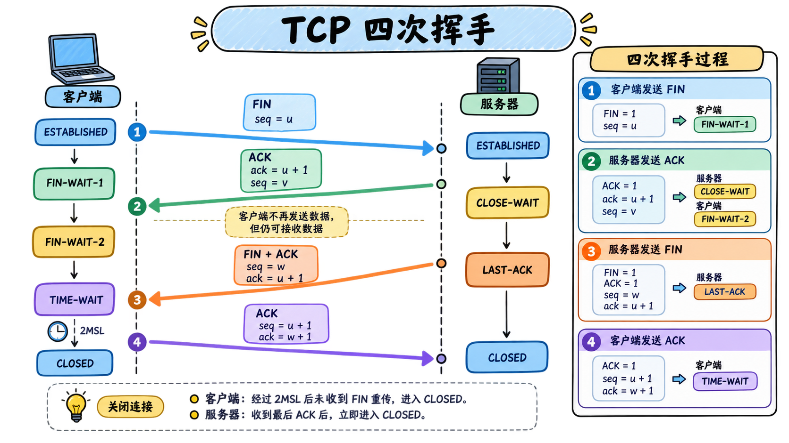

数据传输结束后，通信双方都可以主动发起关闭连接。这里假设由客户端主动关闭。

### 第一次挥手：客户端发送 FIN

客户端发送释放连接报文：

- `FIN = 1`；
- `seq = u`。

发送完成后，客户端进入：

```text
FIN_WAIT_1
```

### 第二次挥手：服务器发送 ACK

服务器收到 FIN 后返回确认报文：

- `ACK = 1`；
- `ack = u + 1`；
- `seq = v`。

服务器进入：

```text
CLOSE_WAIT
```

客户端收到 ACK 后进入：

```text
FIN_WAIT_2
```

此时，客户端不再向服务器发送数据，但仍然可以接收服务器发送的数据。

### 第三次挥手：服务器发送 FIN

服务器完成剩余数据处理后，发送释放连接报文：

- `FIN = 1`；
- `ACK = 1`；
- `seq = w`；
- `ack = u + 1`。

服务器进入：

```text
LAST_ACK
```

等待客户端最后一次确认。

### 第四次挥手：客户端发送 ACK

客户端收到服务器的 FIN 后发送确认报文：

- `ACK = 1`；
- `seq = u + 1`；
- `ack = w + 1`。

客户端进入：

```text
TIME_WAIT
```

经过 `2MSL` 后，如果没有收到服务器重传的 FIN，客户端关闭连接并进入 `CLOSED` 状态。

服务器收到客户端的 ACK 后，关闭连接并进入 `CLOSED` 状态。

## 为什么挥手需要四次
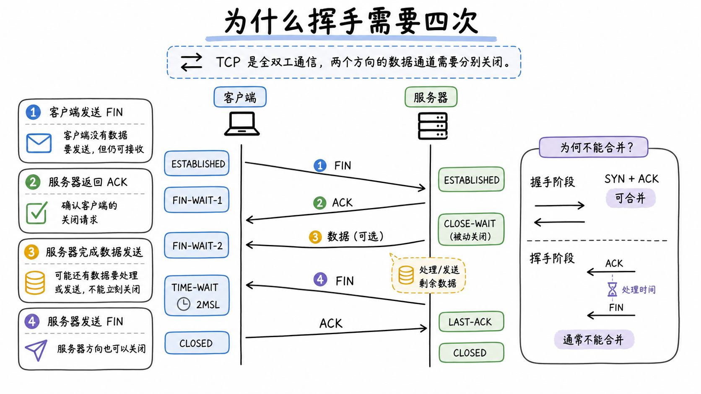

TCP 是全双工通信，两个方向的数据通道需要分别关闭。

客户端发送 FIN，只表示客户端已经没有数据要发送，但仍然可以接收数据。服务器收到 FIN 后，先返回 ACK，确认客户端的关闭请求。

此时服务器可能还有数据需要处理或发送，例如缓冲区中尚未发送完成的业务数据，因此不能立刻关闭。等服务器完成数据发送后，再发送自己的 FIN，表示服务端方向也可以关闭。

握手阶段的 SYN 和 ACK 可以合并，但挥手阶段，服务端的 ACK 与 FIN 之间可能存在一段数据处理时间，所以通常不能直接合并。

## 为什么 TIME_WAIT 要等待 2MSL
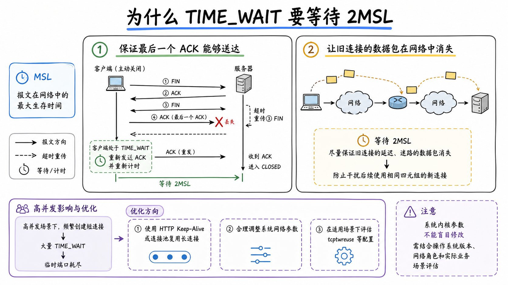

`MSL` 是报文在网络中的最大生存时间。主动关闭方需要等待 `2MSL`，主要有两个原因。

### 保证最后一个 ACK 能够送达

如果第四次挥手发送的 ACK 丢失，服务器会超时重传第三次挥手的 FIN。

客户端在 `TIME_WAIT` 状态下收到重传的 FIN 后，可以再次发送 ACK，并重新计时。如果客户端立即关闭，服务器可能永远收不到最后的 ACK，并长期停留在 `LAST_ACK` 状态，浪费服务器资源。

### 让旧连接的数据包在网络中消失

等待 `2MSL` 可以尽量保证本次连接中可能延迟、迷路的数据包在网络中彻底消失，防止它们干扰后续使用相同四元组建立的新连接。

在 Java Web 高并发场景中，频繁创建短连接可能导致大量 `TIME_WAIT`，进而造成客户端临时端口耗尽。常见优化方向包括：

- 使用 HTTP Keep-Alive 或连接池复用长连接；
- 合理调整系统网络参数；
- 在适用场景下评估 `tcp_tw_reuse` 等配置。

系统内核参数不能盲目修改，需要结合操作系统版本、网络角色和实际业务场景评估。

## TCP 如何保证可靠性
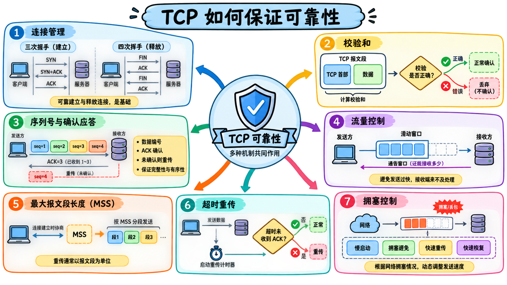

TCP 的可靠性并不是由单一机制实现的，而是多种机制共同作用的结果。

### 连接管理

三次握手用于可靠地建立连接，四次挥手用于相对可靠地释放连接。连接管理是 TCP 保证可靠性的基础。

### 校验和

TCP 会对首部和数据计算校验和，用于检测数据在传输过程中是否发生变化。

如果接收端发现校验和错误，通常会丢弃该报文段，不对其进行正常确认，发送端之后可以根据确认情况或超时机制进行重传。

### 序列号与确认应答

TCP 会对发送的数据进行编号。接收方收到数据后，通过 ACK 告诉发送方已经成功接收到了哪些数据。

发送方可以据此判断数据是否到达。如果某些数据没有被确认，就进行重传，从而保证数据的完整性和有序性。

### 流量控制

TCP 连接双方都有接收缓冲区。接收端会通过通告窗口告诉发送端自己还能接收多少数据，避免发送速度过快，导致接收端来不及处理。

TCP 的流量控制主要通过**滑动窗口**实现。

### 最大报文段长度

建立 TCP 连接时，双方会协商最大报文段长度，即 MSS。发送数据时会尽量按照合适的 MSS 进行分段，重传通常也以报文段为单位进行。

### 超时重传

发送方发送数据后会启动重传计时器。如果在规定时间内没有收到对应的确认，就认为数据可能丢失，并进行重传。

### 拥塞控制

如果网络非常拥堵，数据可能在到达接收端前就被丢弃。TCP 会使用慢启动、拥塞避免、快速重传和快速恢复等机制，根据网络拥塞情况动态调整发送速度。

## TCP 流量控制与滑动窗口
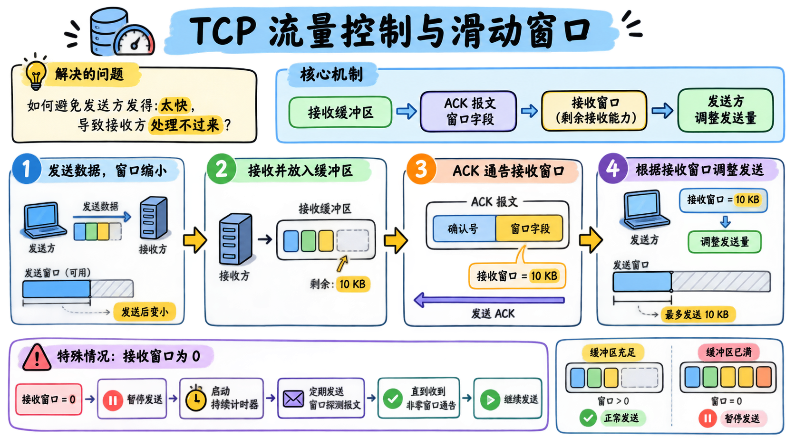

流量控制解决的是：

> **如何避免发送方发得太快，导致接收方处理不过来？**

发送方向接收方发送一定字节数的数据后，可用发送窗口会缩小。接收方收到数据后，将其放入接收缓冲区，并在 ACK 报文的窗口字段中告诉发送方当前剩余的接收能力。

例如，接收方可以通过窗口字段表达：

> 别发得太快了，我的缓冲区可能只剩 10 KB。

发送方收到这个信息后，就会根据接收窗口调整发送量。

如果接收窗口变为零，发送方会暂停发送数据，并启动持续计时器，定期发送窗口探测报文，直到接收方重新通告非零窗口。

## TCP 拥塞控制
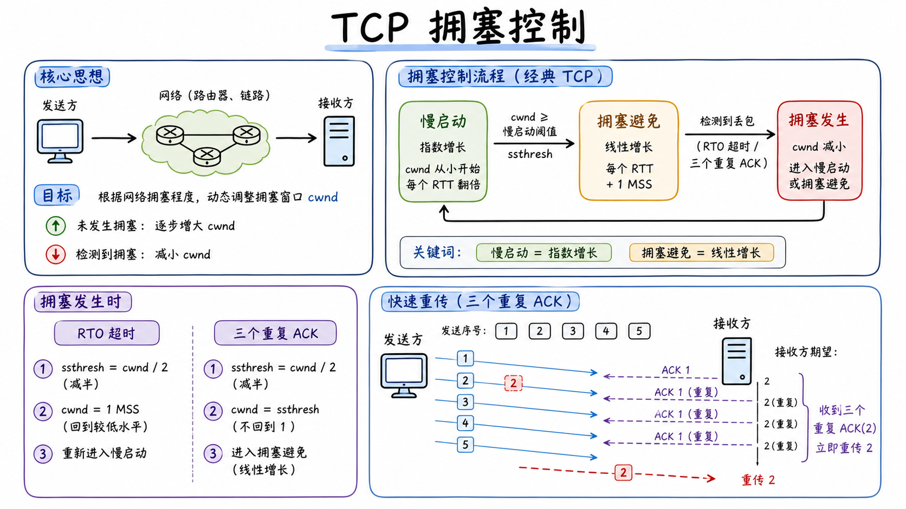

流量控制主要关注接收端的处理能力，拥塞控制则主要关注网络中的路由器、链路等是否过于拥堵。

发送方会维护一个**拥塞窗口 `cwnd`**，并根据网络拥塞程度动态调整：

- 网络未发生拥塞时，逐步增大拥塞窗口；
- 检测到拥塞时，减小拥塞窗口。

经典 TCP 拥塞控制主要包括以下算法。

### 慢启动

慢启动体现的是近似指数增长过程。

刚开始发送数据时，发送方会先“探路”，从较小的拥塞窗口开始。每经过一个往返时间，在 ACK 正常返回的情况下，拥塞窗口大致翻倍增长，直到达到慢启动阈值：

```text
ssthresh
```

可以理解为：先少量发送，成功后翻倍，再成功后继续翻倍，直到达到阈值或检测到拥塞。

### 拥塞避免

当拥塞窗口达到慢启动阈值后，进入拥塞避免阶段。此时不再快速翻倍，而是采用更谨慎的线性增长方式，经典实现中通常每个 RTT 大约增加一个 MSS。

关键词可以这样记：

- **慢启动：指数增长**
- **拥塞避免：线性增长**

### 拥塞发生

网络拥塞导致丢包时，通常可以通过两类情况感知：

- RTO 超时；
- 收到三个重复 ACK。

如果发生 RTO 超时，经典算法通常会：

1. 将慢启动阈值调整为当前拥塞窗口的一部分，经典做法是减半；
2. 将拥塞窗口缩小到较低水平；
3. 重新进入慢启动。

### 快速重传

发送方如果连续收到三个重复 ACK，就可以推测某个报文段已经丢失，不必等待超时计时器到期，立即重传丢失的数据。

例如，发送方依次发送序号为 `1、2、3、4、5` 的数据。接收方收到序号 1 后，期待序号 2；如果序号 2 丢失，而 3、4、5 陆续到达，接收方会重复返回表示“仍然期待 2”的 ACK。

发送方收到三个重复 ACK 后，就判断序号 2 对应的数据可能丢失，并立即重传。

### 快速恢复

发生快速重传后，通常不需要把拥塞窗口直接降回初始值。快速恢复会适当减小拥塞窗口，再进入拥塞避免阶段，从而避免传输速率骤降得过于严重。

具体行为会因 TCP 拥塞控制算法和实现版本而不同。

## TCP 重传机制
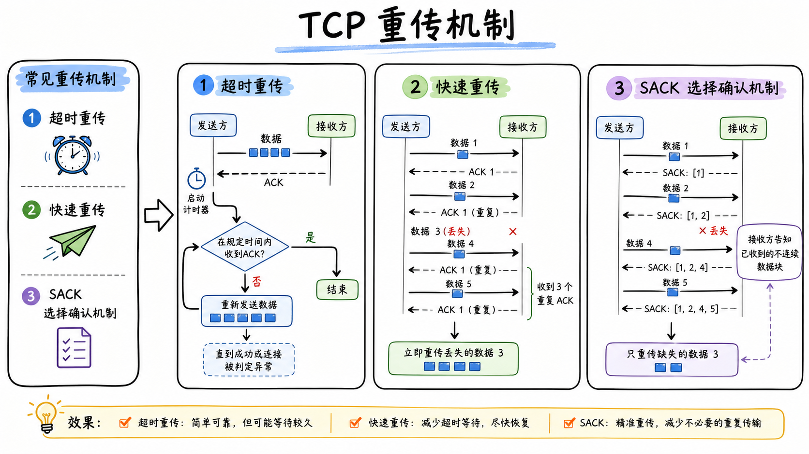

常见重传机制包括：

- **超时重传**；
- **快速重传**；
- **SACK 选择确认机制**。

超时重传的原理是：发送数据后启动计时器，如果规定时间内没有收到相应 ACK，就重新发送数据，直到成功或连接被判定异常。

SACK 可以让接收方告诉发送方哪些不连续的数据块已经收到，发送方只需要重传真正缺失的部分，减少不必要的重复传输。

## UDP 核心知识
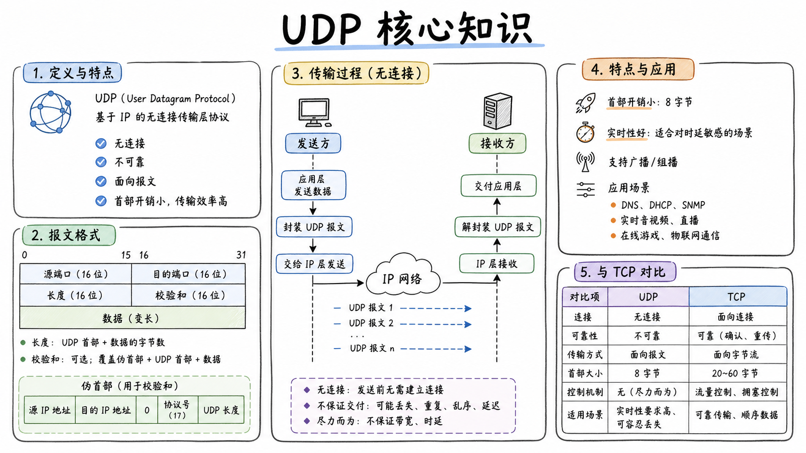

## TCP 与 UDP 的区别
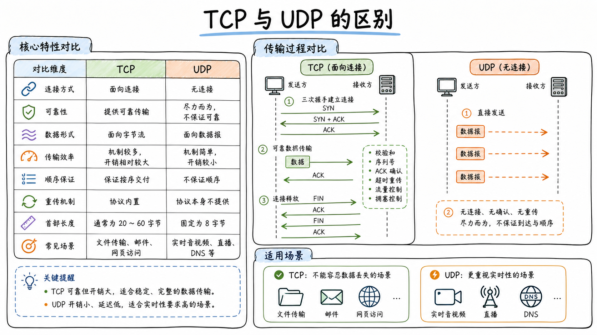

TCP 与 UDP 可以从多个维度比较。

| 对比维度 | TCP | UDP |
|---|---|---|
| 连接方式 | 面向连接 | 无连接 |
| 可靠性 | 提供可靠传输 | 尽力而为，不保证可靠 |
| 数据形式 | 面向字节流 | 面向数据报 |
| 传输效率 | 机制较多，开销相对较大 | 机制简单，开销较小 |
| 顺序保证 | 保证按序交付 | 不保证顺序 |
| 重传机制 | 协议内置 | 协议本身不提供 |
| 首部长度 | 通常为 20～60 字节 | 固定为 8 字节 |
| 常见场景 | 文件传输、邮件、网页访问 | 实时音视频、直播、DNS 等 |

TCP 在发送数据前需要建立连接，并通过校验和、序列号、ACK、超时重传、流量控制和拥塞控制等机制保证可靠性。

UDP 在发送前不建立连接，数据发出去后，协议本身不会确认是否到达。即使丢失，也不会自动重传。

TCP 常用于不能容忍数据丢失的场景，例如文件和邮件传输。UDP 常用于更重视实时性的场景，例如视频通话。视频通话偶尔卡顿、缺失一小段声音，就可能与 UDP 丢包有关。

## UDP 如何保证消息不丢失
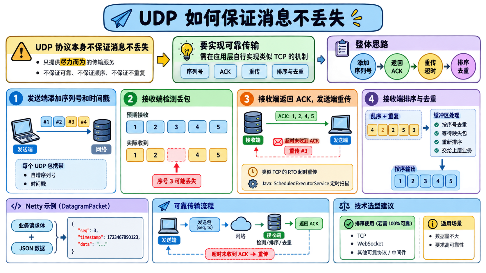

首先要开门见山地说明：

> **UDP 协议本身不保证消息不丢失，它只提供尽力而为的传输服务。**

如果业务必须基于 UDP 实现可靠传输，就需要在应用层自行实现类似 TCP 的部分机制。

### 发送端添加序列号和时间戳

可以让每个 UDP 数据包携带自增序列号，例如：

```text
sequenceNumber
```

接收端收到数据后，如果发现序列号跳号，就能判断中间可能存在丢包。

例如，原本应该按顺序收到：

```text
1、2、3、4、5
```

实际却收到：

```text
1、2、4、5
```

接收端就知道序号 3 对应的数据包可能丢失。

在 Netty 中可以结合 `DatagramPacket` 使用，在业务请求体或 JSON 数据中加入类似下面的字段：

```java
long sequence;
long timestamp;
```

### 接收端返回 ACK

接收端每收到一个数据包，就向发送端返回确认信息，告诉发送端自己已经收到了哪些序号的数据。

如果发送端在一定时间内没有收到某个数据包对应的 ACK，就主动重传该数据包。这类似于 TCP 中基于 RTO 的超时重传机制。

Java 中可以通过 `ScheduledExecutorService` 定期扫描未确认的数据包列表，如果超时，就再次调用发送方法。

### 接收端进行排序与去重

UDP 数据包可能乱序到达，也可能因为重传而重复到达。因此，接收端需要维护缓冲区：

- 根据序列号去重；
- 等待缺失的数据包重传；
- 按序列号重新排序；
- 排序完成后再交给上层业务处理，例如写入数据库。

### 根据业务选择技术方案

如果项目要求百分之百可靠，且数据量不大，通常更适合直接使用：

- TCP；
- WebSocket；
- 其他已经提供可靠传输能力的协议或中间件。

如果数据量很大，而且允许偶尔丢失，例如直播或实时音视频，可以基于 UDP 设计应用层重传策略：

- 只重传关键数据；
- 视频场景中优先保证关键帧；
- 非关键帧丢失时可以直接放弃；
- 在可靠性与实时性之间做取舍。

面试时可以按照下面的结构回答：

1. 先明确说明 UDP 本身不保证可靠性，只提供尽力而为的服务。
2. 如果业务要求可靠，需要在应用层实现序列号、ACK、超时重传、排序和去重。
3. 最后结合实际场景进行技术选型：强可靠场景优先使用 TCP 或 WebSocket；实时性优先且允许少量丢包的场景，可以继续使用 UDP，并针对关键数据设计重传策略。

## 面试复习重点
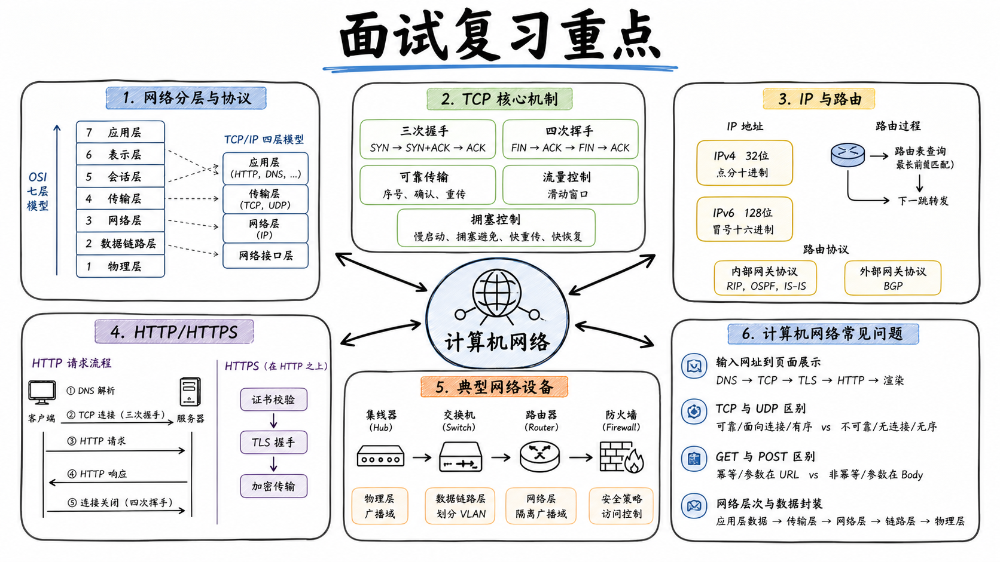

## 基础体系结构
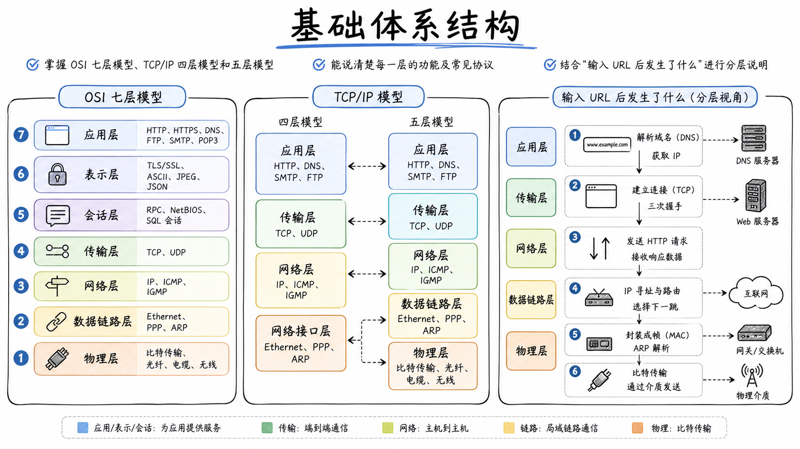

- 掌握 OSI 七层模型、TCP/IP 四层模型和五层模型。
- 能说清楚每一层的功能及常见协议。
- 能结合“输入 URL 后发生了什么”进行分层说明。

## HTTP 与状态管理
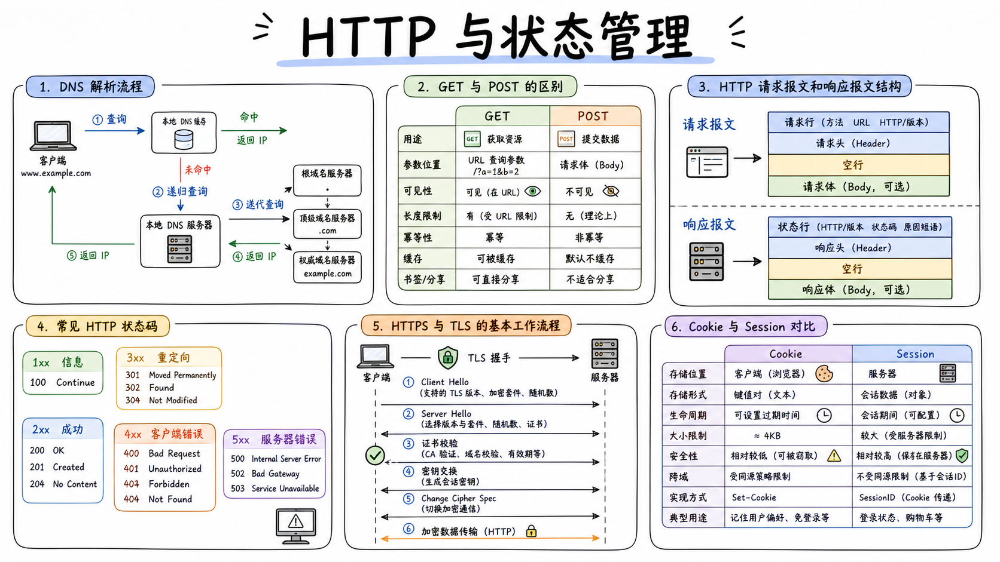

- 掌握 DNS 解析流程。
- 掌握 GET 与 POST 的区别。
- 了解 HTTP 请求报文和响应报文结构。
- 记住常见 HTTP 状态码。
- 掌握 HTTPS 与 TLS 的基本工作流程。
- 能从多个维度对比 Cookie 与 Session。

## IP 与 ARP
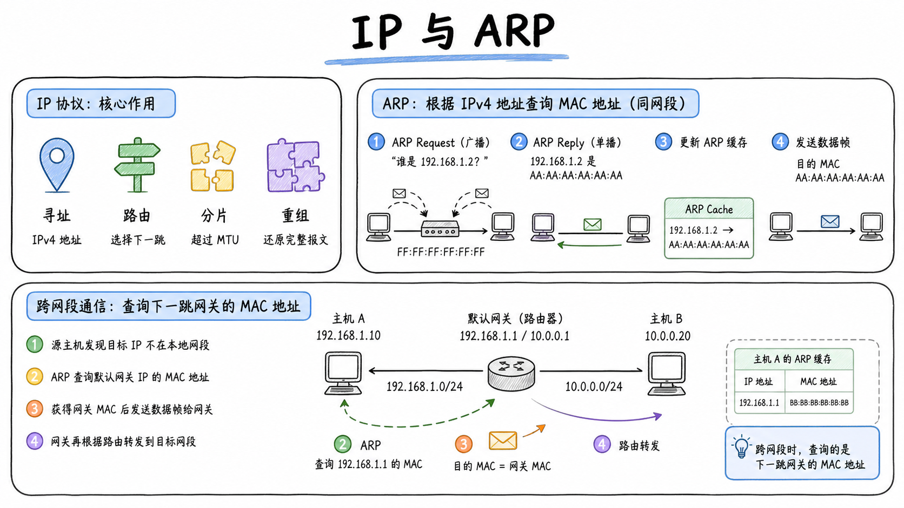

- 理解 IP 协议的寻址、路由、分片与重组。
- 掌握 ARP 根据 IPv4 地址查询 MAC 地址的完整过程。
- 理解跨网段通信时查询的是下一跳网关的 MAC 地址。

## TCP 与 UDP
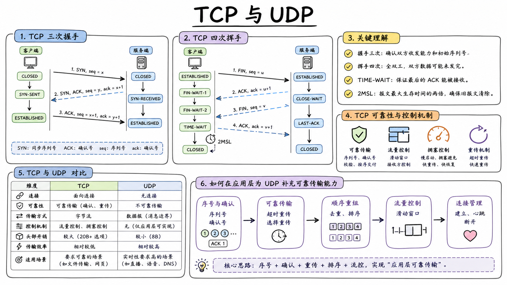

- 熟练描述 TCP 三次握手和四次挥手。
- 记住 SYN、ACK、FIN、序列号、确认号及状态变化。
- 理解为什么握手是三次、挥手通常是四次。
- 理解 `TIME_WAIT` 和 `2MSL`。
- 掌握 TCP 可靠性机制、流量控制、拥塞控制和重传机制。
- 能多维度比较 TCP 与 UDP。
- 能说明如何在应用层为 UDP 补充可靠传输能力。

希望大家能通过这套知识脉络快速回顾计算机网络重点，并在面试中取得成功。
