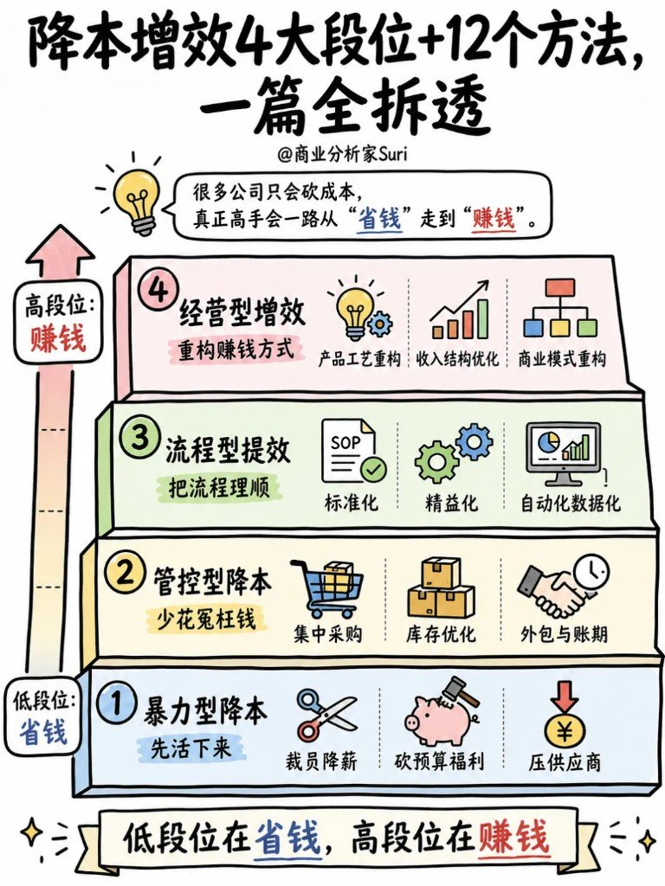
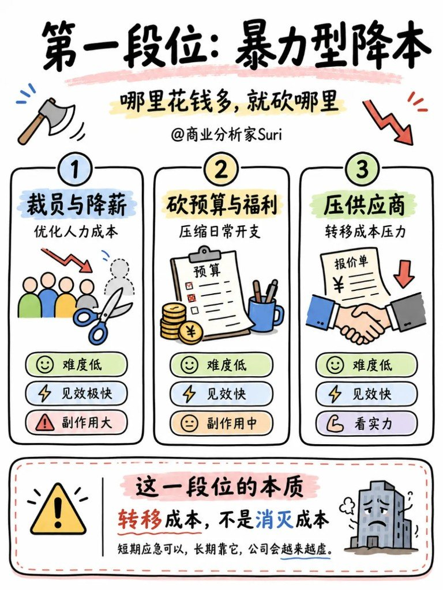
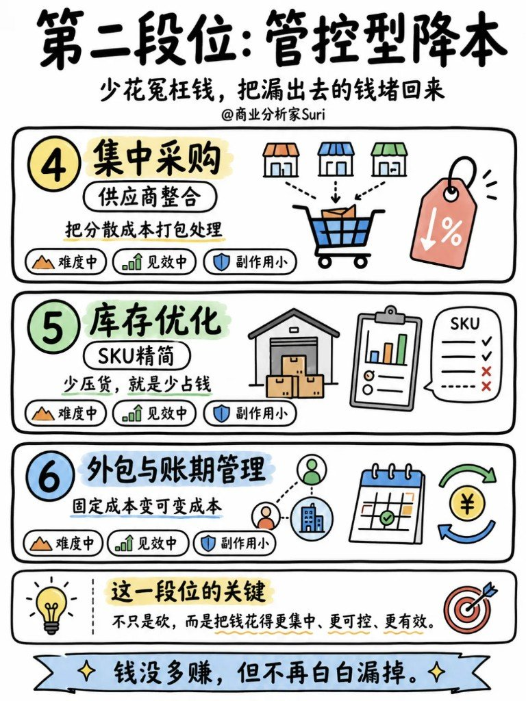
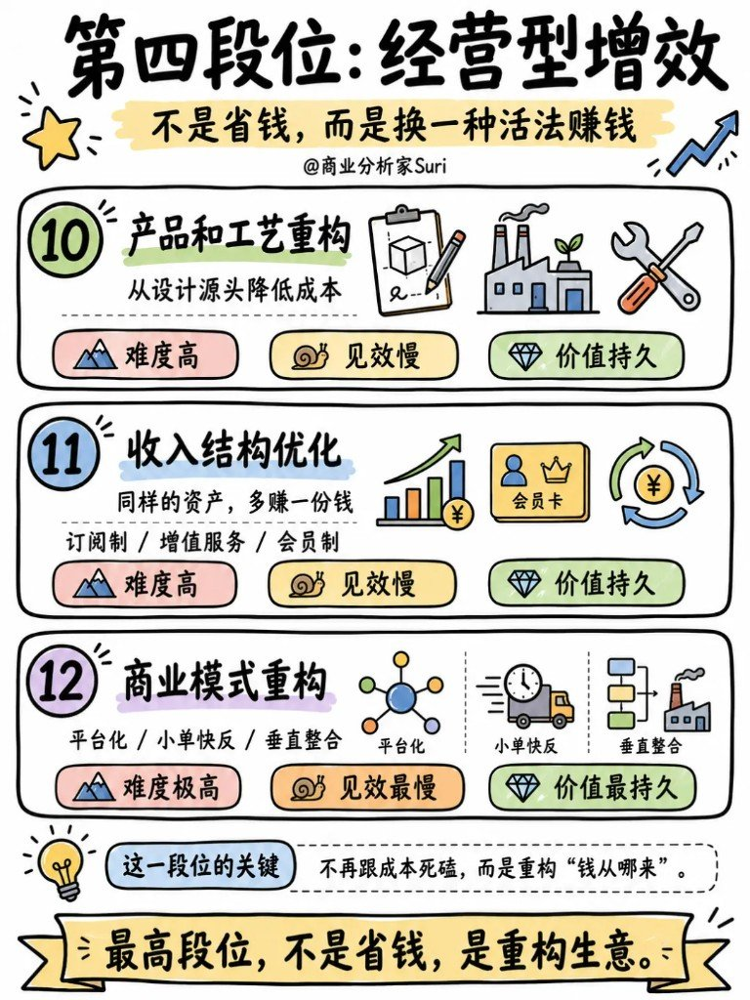

一喊「降本增效」，最先动手的往往是：裁人、砍预算、压供应商。

短期账面好看几天——现金没真多，组织却越来越虚。

真正拉开差距的，不是砍得狠不狠，是段位：暴力 → 管控 → 流程 → 经营。低段位在省钱，高段位在赚钱。

旁链提醒：同日队列里还有「人效差，答案多半不在人身上」——相关，但**不硬并**。那边讲人效公式怎么拆（个人 / 流程 / 组织 / 经营）；这边讲**降本增效路径从砍成本一路爬到重构生意**。

---

## 四段位总览

很多公司只会砍成本；真正高手会一路从「省钱」走到「赚钱」。

| 段位 | 一句话 | 三个方法 | 主逻辑 |
|---|---|---|---|
| **① 暴力型降本** | 先活下来 | 裁员降薪 / 砍预算福利 / 压供应商 | 哪里花钱多，就砍哪里 |
| **② 管控型降本** | 少花冤枉钱 | 集中采购 / 库存优化 / 外包与账期 | 把漏出去的钱堵回来 |
| **③ 流程型提效** | 把流程理顺 | 标准化 / 精益化 / 自动化数据化 | 不是让人更辛苦，是把做事方式理顺 |
| **④ 经营型增效** | 重构赚钱方式 | 产品工艺重构 / 收入结构优化 / 商业模式重构 | 不是省钱，是换一种活法赚钱 |

越往上，越接近「赚钱」；停在最底两层，省的是账面，伤的是组织。

---

## 第一段位：暴力型降本

哪里花钱多，就砍哪里。

| # | 方法 | 干什么 | 难度 | 见效 | 副作用 / 条件 |
|---|---|---|---|---|---|
| 1 | **裁员与降薪** | 优化人力成本 | 低 | 极快 | **大** |
| 2 | **砍预算与福利** | 压缩日常开支 | 低 | 快 | **中** |
| 3 | **压供应商** | 转移成本压力 | 低 | 快 | **看实力** |

这一段位的本质：**转移成本，不是消灭成本**。

短期应急可以；长期靠它，公司会越来越虚。

---

## 第二段位：管控型降本

少花冤枉钱，把漏出去的钱堵回来。

| # | 方法 | 干什么 | 难度 | 见效 | 副作用 |
|---|---|---|---|---|---|
| 4 | **集中采购** | 供应商整合；分散成本打包处理 | 中 | 中 | 小 |
| 5 | **库存优化** | SKU 精简；少压货 = 少占钱 | 中 | 中 | 小 |
| 6 | **外包与账期管理** | 固定成本变可变成本 | 中 | 中 | 小 |

这一段位的关键：不只是砍，而是把钱花得更集中、更可控、更有效。

钱没多赚，但不再白白漏掉。

---

## 第三段位：流程型提效

不是让人更辛苦，而是把做事方式理顺。

| # | 方法 | 干什么 | 难度 | 见效 | 价值属性 |
|---|---|---|---|---|---|
| 7 | **标准化** | 把动作变成 SOP | 中 | 中 | 可持续 |
| 8 | **精益化** | 消灭等待、返工、重复录入 | 中高 | 中 | 可持续 |
| 9 | **自动化与数据化** | 系统干重复活，决策更聪明 | 中高 | 中 | 价值持续放大 |

这一段位的变化：从「少花钱」，走向更快、更准、更少返工——流程更顺、错误更少、响应更快、决策更准。

省下来的不只是钱，是组织会做事的能力。

---

## 第四段位：经营型增效

不是省钱，而是换一种活法赚钱。

| # | 方法 | 干什么 | 难度 | 见效 | 价值 |
|---|---|---|---|---|---|
| 10 | **产品和工艺重构** | 从设计源头降低成本 | 高 | 慢 | 持久 |
| 11 | **收入结构优化** | 同样资产多赚一份（订阅制 / 增值服务 / 会员制） | 高 | 慢 | 持久 |
| 12 | **商业模式重构** | 平台化 / 小单快反 / 垂直整合 | 极高 | 最慢 | 最持久 |

这一段位的关键：不再跟成本死磕，而是重构「钱从哪来」。

最高段位，不是省钱，是重构生意。

---

## 卡在哪一层，就开哪一层的方

| 信号 | 先动哪一段位 | 别拿错药 |
|---|---|---|
| 现金流快断、必须止血 | **暴力**（短期） | 别把裁员当长期经营战略 |
| 钱在漏：分散采购、SKU 膨胀、账期乱 | **管控** | 别只砍人头不堵漏点 |
| 人很忙、事很慢、返工多 | **流程** | 别用加班治流程病 |
| 大家很努力，利润仍薄、生意不值钱 | **经营** | 别用再砍一轮预算治模式病 |

应急可以掉回低段位；活过来之后，段位要往上爬——否则永远停在「省钱」，到不了「赚钱」。

---

## 评论里几条值得留

1. **新技术别只当费用砍**：有人提醒——该投的数字化 / 自动化是资产投资，不是「预算里先砍掉的那一项」。砍错了，第三、四段位永远上不去。
2. **价值链是利益共同体**：压供应商到极限，短期好看，长期断链。第二段位「管控」是整合与可控，不是零和压榨。
3. **精益的价值来源是客户**：精益化不是内部自嗨的流程图；砍掉的应是客户不付钱的等待与返工。
4. **价格战之后看品牌竞争力**：第四段位若只拼更低价，收入结构与模式仍薄；重构「钱从哪来」，才撑得住价格战后的竞争位。

嘲讽裁员段子、无信息量跟风可略；有判断的留言，比再贴一张「降本增效」口号有用。

---

## 来源与交接

| 项 | 内容 |
|---|---|
| 来源 | `paste-md` · @商业分析家Suri / 精英打工人们 |
| 原文 URL | 无 |
| 合并 | **新建**；与人效四层分笔记互链，不硬并 |

| 旁链 | 彼篇主线 | 与本篇边界 |
|---|---|---|
| [人效差，答案多半不在人身上](/posts/people-efficiency-four-layers/) | 人效公式 + 个人/流程/组织/经营四层 | 彼=人效怎么拆、对症查哪层；本=降本增效路径段位（暴力→经营）与 12 法 |