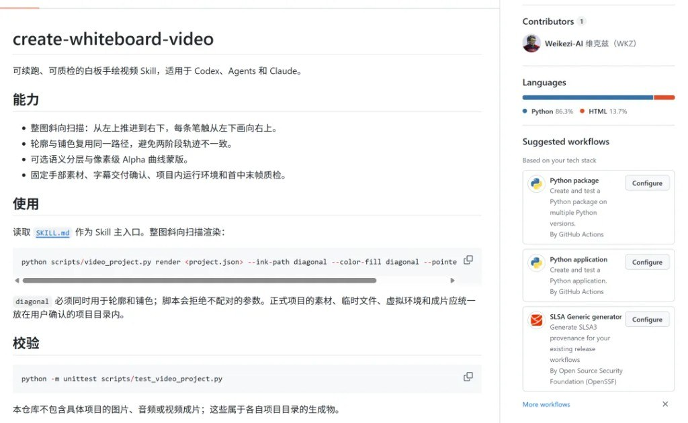
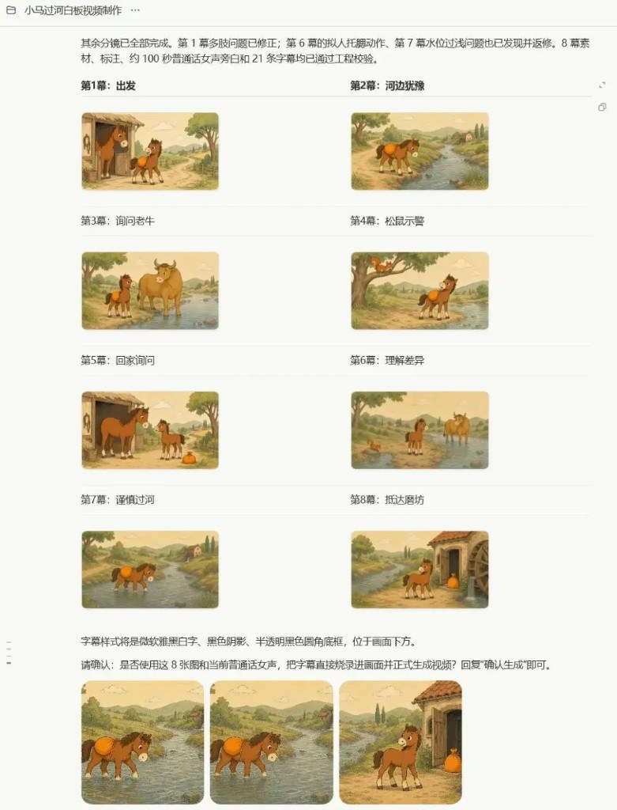
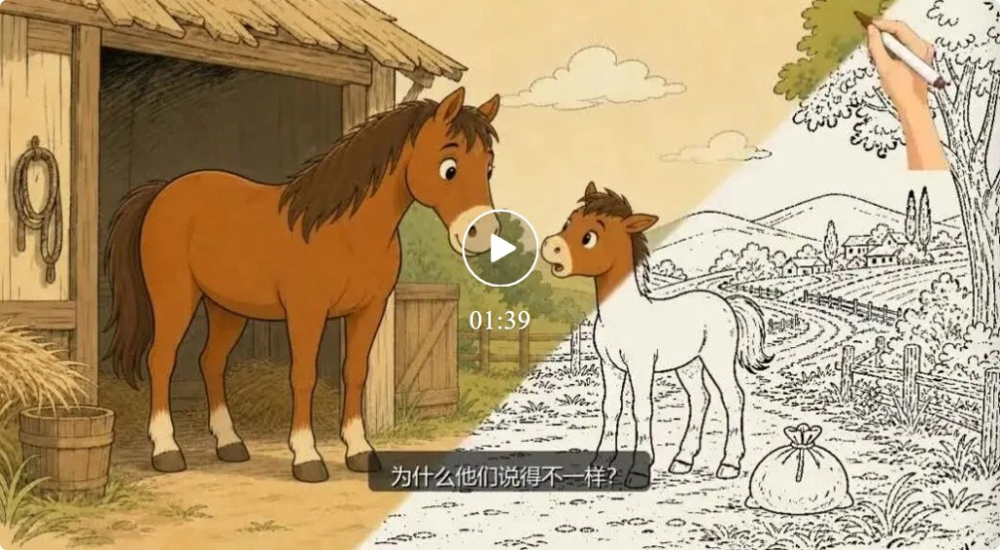
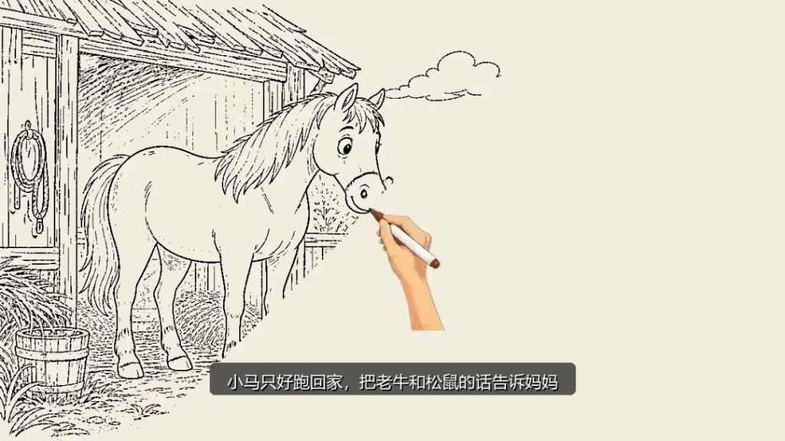

一句「帮我做个《小马过河》」不够——真正难的是目录不散、分镜可改、坏图只返工一幕、旁白驱动时长、渲染可质检。维克兹开源的 create-whiteboard-video（MIT）把这条链路收成可续跑的 `project.json` 工程，给 Codex / Claude / 同类 Agent 用。

::github{repo="Weikezi-AI/create-whiteboard-video"}

作者自称测速烧约 3 亿 Token；样例 8 幕约 100 秒普通话女声 + 烧录字幕。数字当故事背景，选型看工作流。



## 先对上这些疼点

| 痛点 | Skill 做法 |
|---|---|
| 文件散落 / C 盘炸 | **先确认项目根目录**，素材·venv·成片全进该目录 |
| 图文两层皮 | 口播稿 → 语义分镜 → 每幕一个主动作 |
| 八张一起返工 | 先第 1 幕定画风与角色，再批量 |
| 四肢/拟人手势翻车 | 逐幕结构与故事逻辑检查，不合格不进工程 |
| 画面干等旁白 | **先锁定旁白**，再按真实时长重算各幕 |
| 「画了两遍轨迹」 | 默认对角扫描：轮廓与铺色**同路径** |



## 默认画法：整图斜着扫过去

仓库默认 `diagonal-scan`：

- 整幕从左上推进到右下
- 每条笔触从左下画向右上
- `--ink-path diagonal` 与 `--color-fill diagonal` **必须成对**，否则脚本拒绝
- 固定手部素材跟落墨；可选语义分层（`semantic-stream`）才走 Alpha 蒙版

```powershell
python scripts/video_project.py render <project.json> `
  --ink-path diagonal --color-fill diagonal --pointer hand --pause auto
```





有人吐槽「不是按笔画先后的真手绘」——作者也认：当前是扫描揭示 + 手部跟笔，不是书法笔顺模拟。叫白板流水线更贴切。

## 作者实测路径，可当验收清单

```text
确认目录 → 故事/口播 → 分镜（可 6→8 校准）
→ 第1幕画风测试（五条腿之类当场打回）
→ 批量其余幕 + 质检
→ 旁白/字幕 → 时长重算 → 交付方式确认（烧录/旁挂/无）
→ 渲染 → 拼接 → 首中末帧质检
```

《小红帽》同路径约 10 幕、2 分多——说明可复用的是流水线，不是这一套马年素材。

## 安装边界，别塞错目录

- 读仓库 `SKILL.md`；项目物在**用户确认目录**，不塞进 Skill 安装目录。
- 校验：`python -m unittest scripts/test_video_project.py`
- 生图/配音依赖你的 Agent 环境与额度；作者留言称样例图用 **GPT Image 2**，顺利时大约吃 **Plus 周额度的一成量级**（非 SLA）。
- 仓库不含示例成片二进制；成片属于各项目目录生成物。

## 和本机手绘轨怎么分家

| | create-whiteboard-video | [story-to-handdrawn-video](/posts/story-to-handdrawn-video/)（本机已有） |
|---|---|---|
| 形态 | 完整项目制：分镜·TTS·字幕确认·渲染·质检 | Remotion 图轨：文案/图 → 手绘日记风揭示 |
| 揭示 | 对角扫描 + 手部指针 | 左→右 BW→彩；可选翻页 |
| 声音 | 流程内旁白/字幕（可烧录） | 默认真静音，配音后期 |
| 续跑 | `project.json` + status/validate | 偏单次渲染脚本 |

不是二选一互斥：要「儿童故事白板片 + 旁白一体」看前者；要「已有分镜图快速做无声手绘轨」看后者。

外部视频 Skill 选型地图另见 [六件视频 Agent Skills](/posts/agent-skills-handbook/)。

## 值不值得 star 后再试

价值不在「第一次居然能播」，而在**可停、可改一幕、可续跑**的生产线。人盯分镜和坏图，Agent 把长流程跑完——这才值得 star 后再本地试一发烟雾测试。
