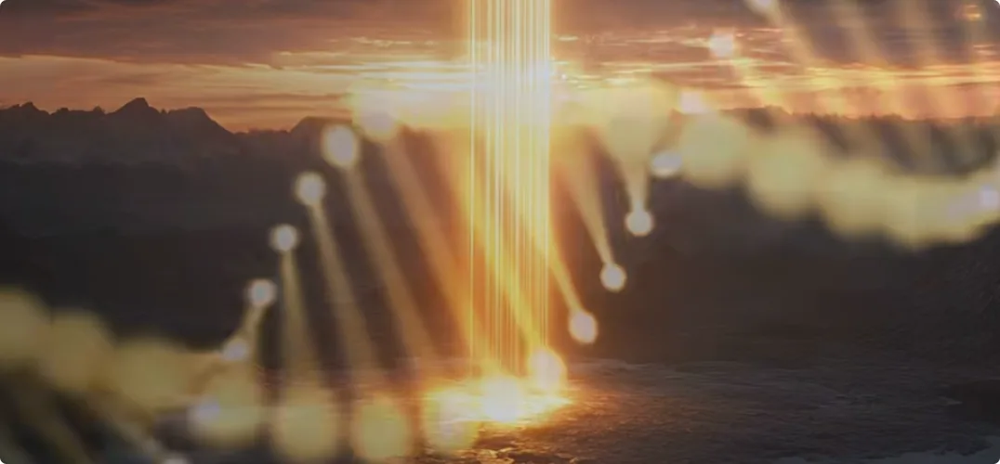

> **真正的创世神话是不分国籍的，它与众生的修行、修仙息息相关。阴阳交替平衡，是亘古不变的道理。**

## 1. 创世并非从生命开始：死亡之神先塑造大地

### 巨魔以毁灭之力锤炼世界

大家好，我是修炼者小烨。今天我要讲一个大家没听过的创世神话故事。这个故事是我在修仙过程中了解到的一些事情，会用隐喻的方式说给大家听，也是为以后想修仙的朋友提供一些有用的信息。

其实真正的创世神话是不分国籍的，它与众生的修行、修仙息息相关。**阴阳交替平衡，是亘古不变的道理。**

每个星球在诞生生命之前，都必先经历死亡。熔岩、陨石和风暴，都是巨魔在有形界的化身；摧毁和破坏，就是他们的法力体现。亿万年间，他们不分昼夜地塑造大地，将大地所需的各种基本要素锤炼出来: 
- 熔岩塑造了大地，这便是**火生土**；
- 陨石砸在大地上，锤炼出了金属，这便是**土生金**；
- 风暴将不同的金相融，产生了水，这便是**金生水**。

然而，巨魔创造不出有生命力的火、土、金、水，自然也造不出有生命力的木。

**死亡之神已经工作亿万年，阴极阳生，生命之神开始工作。**

---

## 2. 神兽降临地球：真正的生命从山川大地中苏醒

### 神兽将神魂藏入山川，以自然之力孕育生命

听一位神灵说，早在神造人之前，有一群神兽从宇宙星空降临到地球，他们被委任创造地球的生命。

他们将神魂藏于大地山川，以泥土为血肉身躯，在大地上修炼。他们运用自身的调和之力，改变所辖领域的环境，并在地面上创造出生命。
1. 有一部分神兽藏身于**山之根**，其神魂与地下金属相融。当水流经他们掌管的金属，此水便有了灵性，灵水有意识地在水中创造了生命的肉身。
2. 还有一部分神兽藏身于**山之巅**。他们带来了真正的风雨，雷电不断调和大地泥土，改变土地的养分。

### 虫鱼鸟兽、草木石头，开始诞生灵魂

亿万年后，真正的**木**才得以诞生，各类生灵开始在大地上繁衍。
这亿万年间，凡深受神兽神魂、灵气滋养者，不论虫鱼鸟兽，还是草木石头，皆诞生了灵魂。
一些灵魂选择了正道修炼，成为了最早的一批**上古神灵**。

死亡之神和生命之神依旧交替工作，有意识地演化出最接近人形的生命，为地球的下一阶段做准备。

> **死亡塑造世界，生命赋予世界灵性；阴阳交替，大地上的灵魂也开始源源不断地诞生。**

---

## 3. 人类为什么会出现：成为凡间众生继续上升的渠道

### 人类，是生命体演化中的最后一种形态

大地上的灵魂源源不断地诞生，神灵也给众生创造了一条上升的渠道。
人类作为生命体的最后一个形态，将汇聚丰富的感知、情绪、思维、喜好，已经具备认知复杂世界的能力。
**人类会作为阴阳两界过渡的物种，接纳大地上的各类生灵，成为凡间众生上升的渠道。**

神明规定，每个人类胚胎诞生时，都会赋予一缕生气，如此每个人类都拥有自己的灵魂意识。

### 为了让所有灵魂都有机会成长，轮回系统由此出现

为了让所有的灵魂都有修行、成长的机会，神灵创造了**轮回系统**，用于分配灵魂；然后又创造了**地狱界**，管理逝去的灵魂。

神灵们随后陆续下凡人间。
他们教人制作工具、创造文字、耕作栽培、制定历法、发展思想、修身养性。

在最初，神灵是可以在大地上和人类一起生活的。那时候的大地还很干净。

> ***阴藏于阳，生存意味着死亡，得到意味着失去。***
> 
> ***不贪图阳，便不招致阴。***

---

## 4. 神为什么离开人间：真正破坏平衡的是人的欲望

### 生者怕死，得者怕失，人心逐渐失去平衡

然而，人类的心性做不到平衡。

>***生者怕死，得者怕失。人类思想之多，产生的欲望之多，执念深重。虽有神仙下凡，教人无为守静之道，然而大势已成。人之所得，本由天道有定；人却不满其所得，遂逆天而行，最终倒戈，以魔王为师。***

神灵们纷纷离开大地，返回宇宙星辰。

**神灵不再展露衣角，避免人类因得不到永生而癫狂。**

### 神之所以为神，在于“司其职”

神之所以是神，**司其职也**。
天道运转，或生或杀，行道必须畅通无阻，道不会为个体意志驻足。
故神者无私心：

> **观天之道，执天之行。**

成为道体的一部分，方才在天地之间得一席之地，得永生之寿。
人却想让万物为自己所用，有进无出，背道而驰。常有求长生者，行魔道而不自知。

---

## 5. 成神不是得到力量，而是千万年如一日地修出道心

### 真正难修的，从来不是神通

**道之大，非一日能悟。**
故成神者非一日之功，需要千万年如一日，不为生死得失所动，修炼出真正的**道心**，方才得道。

虽然神明隐匿了踪迹，但仍旧给真正证得道心者留下一条升天之路。
天神降下旨意：

> **宇宙神兽，便是升天的途径。**

成神者最终都要乘着神兽，抵达宇宙长空。

### 道心不足，驾驭不了真正的力量

但是，道心不够者，宇宙神兽便会在他的心中映射出**洪水猛兽**，反噬其心。
只有真正能够驾驭这股力量的人，才会成为新的神灵。
所以，所谓修炼，并不是有一天突然获得某种力量，而是让自己的心性，真正配得上那股力量。

> **千万年如一日，不为生死得失所动，修炼出道心，方才得道。**

---

## 6. 神兽为什么一直在等待：真正的有缘人，本来就在寻找“回家”的路

### 亿万年过去，神兽仍在静待有缘人

亿万年如一日，神兽一直都在静待有缘人。
他们离开天空太久，也该回家了。

我问神灵：

> “如何知道谁是有缘人呢？”

神灵说：

> **“真正的有缘人，在过往千万年的岁月里，长期接受神兽灵气的滋养。从心底里，他们是向往回到宇宙星辰的，不愿迷恋人世。”**

### 真正的有缘人，不需要被说服

神灵继续说道：

> **“你只需要把话带到，告诉他们该回家了。”**
> 
> **“真正的有缘人自然会共鸣。藏在内心深处对家的渴望，会迫使他们采取行动。”**
> 
> **“当他们来见你的时候，就是准备好修行了。”**

所以，这个创世故事最后所指向的，并不仅仅是“世界是如何出现的”。

从死亡之神塑造大地，到生命之神唤醒万物；从神兽播撒灵性，到人类成为众生上升的渠道；从神明离开大地，再到为真正有道心者留下升天之路——这一切最终仍旧回到一个问题：

> **众生为什么要修行？**

因为真正的有缘人，从来不是突然有一天才想起修行。

**那份想要离开凡尘、回到宇宙星辰的渴望，早就藏在心里。**