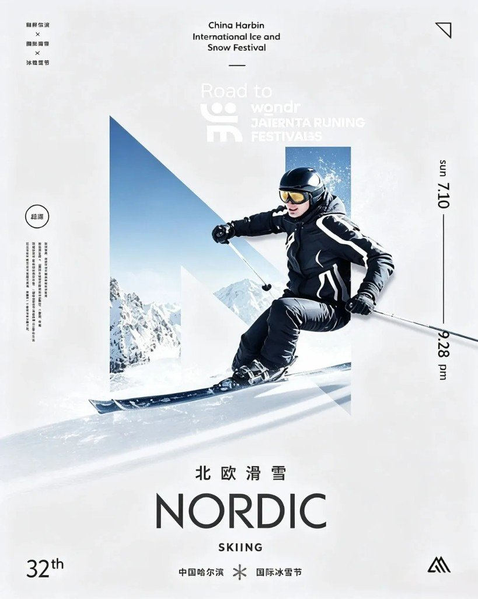
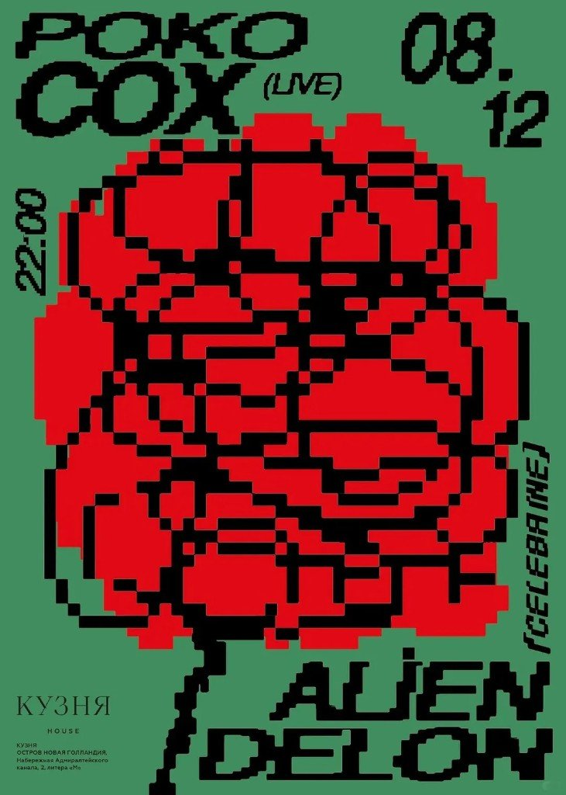
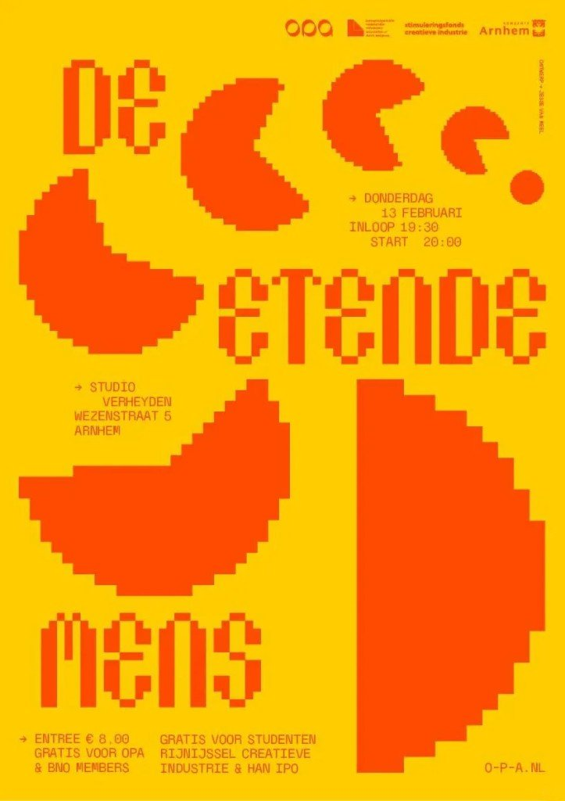

公众号几乎没写字，甩了六张国际/活动海报。跟同日的「红墙上的节气」一样是视觉品味归档，但题材不是一回事——那边是瓶口里的紫禁城，这边是破框、字母窗、像素块。

同日旁链：[红墙上的节气](/posts/solar-terms-red-wall/) · [LogoLounge 2026 十五刀](/posts/logolounge-2026-trends/)（均仍在草稿箱，本地可开）。

版权先钉死：只当案例欣赏归档。禁止商用临摹、二创当己有。权属归原设计师与品牌方。

## 按手法归类（每张一行）

| 手法 | 图 | 带走 |
|---|---|---|
| 取景 / 焦点 | 01 Focus · light/focus/shine | 蓝半调糊一片，红橙取景框抠出一只眼——乱托准 |
| 破框 + 网格 | 02 Nike Air Max Day · MAXXED OUT | 人鞋冲出蓝天框压住大字；网格管信息，破框管劲 |
| 双色场 + 跨缝 | 03 Mont-Tremblant · JOIE DE VIE | 左灰白山景 / 右黑底橙字，滑雪者骑中缝，外套色跟字同色 |
| 字母窗 + 破框 | 04 哈尔滨冰雪节 · 北欧滑雪 | 巨型 N 当雪景窗，人冲出字廓——字是容器不是贴纸 |
| 像素网格 | 05 POKO COX 红花；06 DE ETENDE MENS 黄底橙字 | 像素是造型网格，不是滤镜；06 再叠纯双色场 |

## 做 PPT / 信息图时怎么用（别描人家成稿）

- 要动能 → 主体溢出边框或压住标题一角（学 02 / 04 的逻辑，别复刻 Nike / 冰雪节画面）
- 要聚焦 → 大面积降噪 + 一小块高饱和清晰区（学 01）
- 要干净对比 → 竖切双色场，用人物或色条缝合（学 03 / 06）
- 要活动海报土味变利落 → 统一像素网格 + 中心锚点 + 信息贴边（学 05 / 06）

## 版权边界

无作者、无链接也不等于公有领域。Nike、冰雪节物料、活动票海报，权属在品牌方 / 主办方 / 署名设计师。本稿不授权二次传播、不授权改图出货。
