## 从祖龙到原初龙族

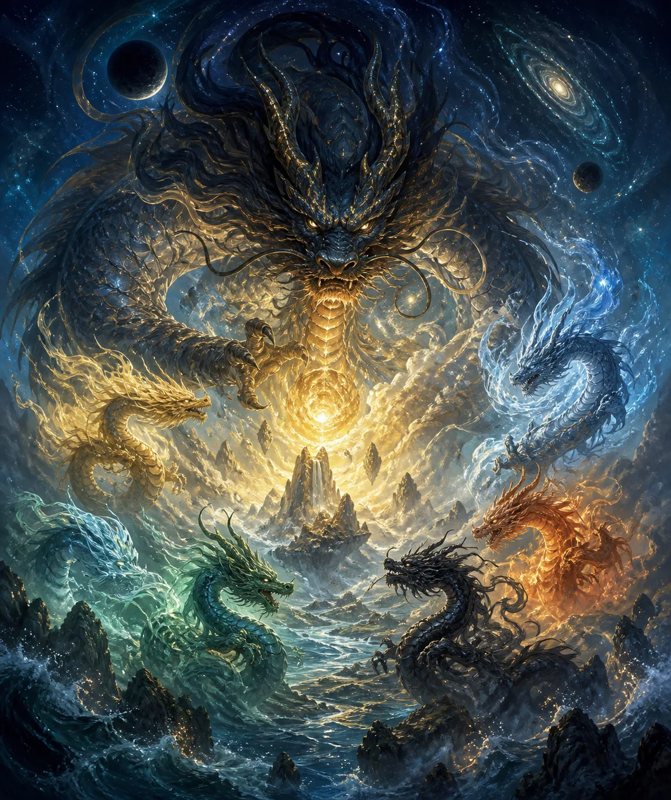

今天聊一聊法界的大家族——**龙族**。

最近很多人对龙族很感兴趣，尤其前段时间，西安、成都等地出现了疑似龙族的拍摄视频。这次就结合龙族相关知识与前段时间发生的事情，一起讲一讲。

> 如有雷同，纯属巧合。大家当作小说素材听听就好，千万不要怼我。

龙族诞生于混沌，也就是太初时期。最早诞生的是**祖龙**，所以龙族的祖先是祖龙，并不是网上很多人所说的烛龙。至于烛龙，后面会单独讲到。

祖龙通过自身分化化成阴阳，也就是我们所说的雌雄，随后逐渐诞生出许多原初龙族。最早由祖龙分化、诞生出来的那一批龙族，就叫作**原初龙族**。

与龙族同样古老的还有凤族。龙族、凤族、麒麟族以及其他种族曾经为了争夺地盘而发生大战，这段时期统称为**龙凤初劫**。

## 巫妖大战与三界分化

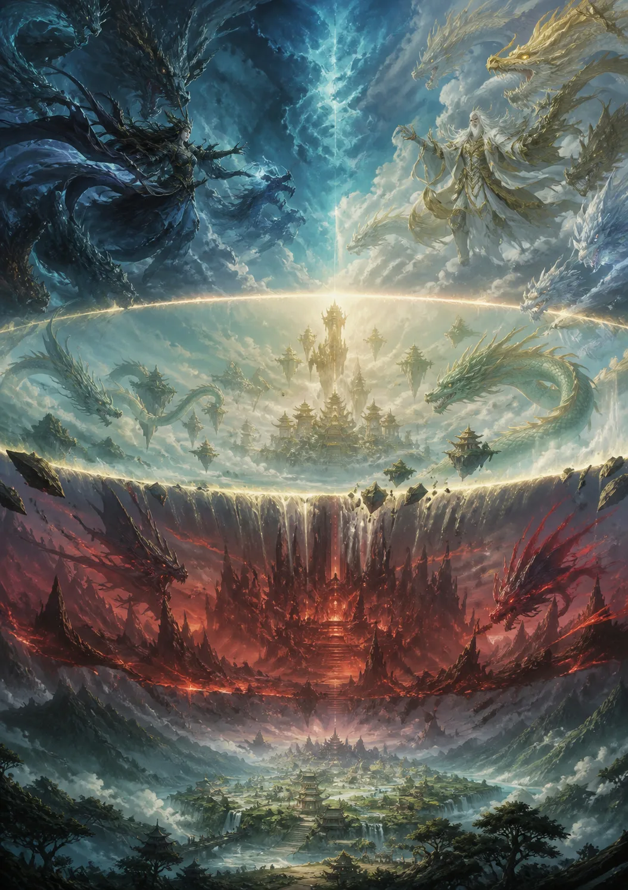

龙凤初劫之后，便来到了上古巫妖大战时期。喜欢洪荒题材的人，应该对这场久远的大战有所了解。

巫妖大战以前，天地尚未分开。当时女娲创造了人族，但人族的地位非常低下。彼时真正强势的统治者是巫族和妖族。龙族经历龙凤初劫后，自身实力已经衰弱，不再像原初时期那样强大。

巫妖大战结束后，天地开始分化。新的天庭将天、地、人三界隔开，并把龙族及许多神兽族群带往高维度，其中包括：

- 凤族
- 龙族
- 麒麟族
- 孔雀族
- 青鸾族
- 狐族中的天狐族

这些族群至少进入了四维以上的高维度，而人类则停留在三维空间。

与此同时，人本身也受到了一些限制，例如寿命被限制在一百二十岁左右，基因等方面同样受到约束，不再像天地未分时期的人族那样强大。

当时的人族有很多曾与巫族、龙族结合，血脉之力比较强，无论根骨、灵气、身体素质还是寿命，都比现在的人类更强。天地划分之后，再加上诸多限制，人类逐渐无法沟通更高维度的生命，也不再像最初那样容易通灵。

经过漫长的时间，人类开始通过**采炁**修行，也就是吸收日月精华，后来逐渐出现了修士。修士修习丹道，再往后才产生了一些宗教体系。

# 西安、成都疑似“龙影”事件

## 普通人能否拍到龙族

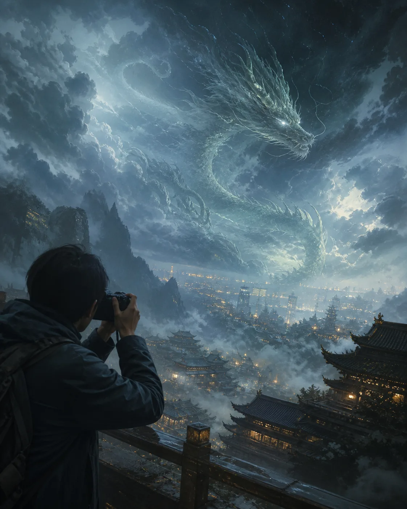

前段时间，有人在西安、成都等地拍摄了一些视频，声称空中可能出现了龙。也有人认为，视频里的东西只是塑料袋之类的物体。

按照我的个人理解，大部分龙族都属于**高维度生命体**。高维度生命体无法被人类直接通过肉眼观察到。无论是相机拍摄，还是人亲眼看见，本质上都依赖人类的视觉系统，而普通肉眼很难直接观察高维度生命。

只有在极其罕见的情况下，例如：

- 雷雨天气；
- 特殊的大气折射现象；
- 磁场异常的地带；

人们才可能看到一些很小、很微妙的现象，比如一晃而过的影子。

因此，视频中那种清晰可见、呈长条形，并且所有人都能直接看到的东西，其实并不是龙。这只是我个人的理解；有天眼的人，也可以自行观察和判断。

## 泰山上空与磁场变化

有天眼的人可以经常观察泰山上空。泰山本身有诸多神明，泰山上空也经常会有龙出现。

普通人通常看不见，但体质比较敏感的人可能会感受到磁场变化，身体也可能产生一些反应。

至于西安、成都出现疑似龙影的那一天，确实有龙在渡劫，只不过这只是当天发生的小事。真正的大事不方便讲，而且相关现象也不是因为渡劫才出现的。

# 龙族的主要分类

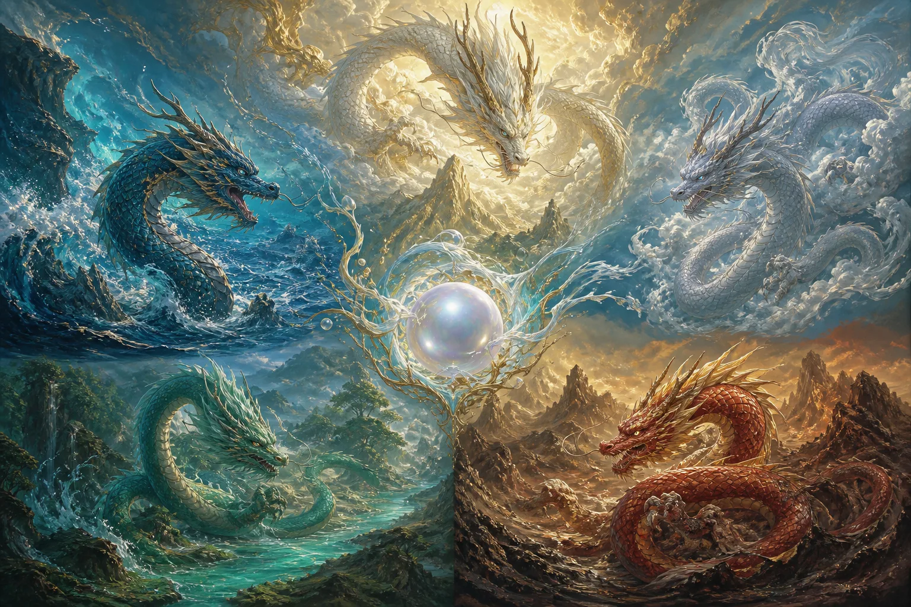

## 天龙

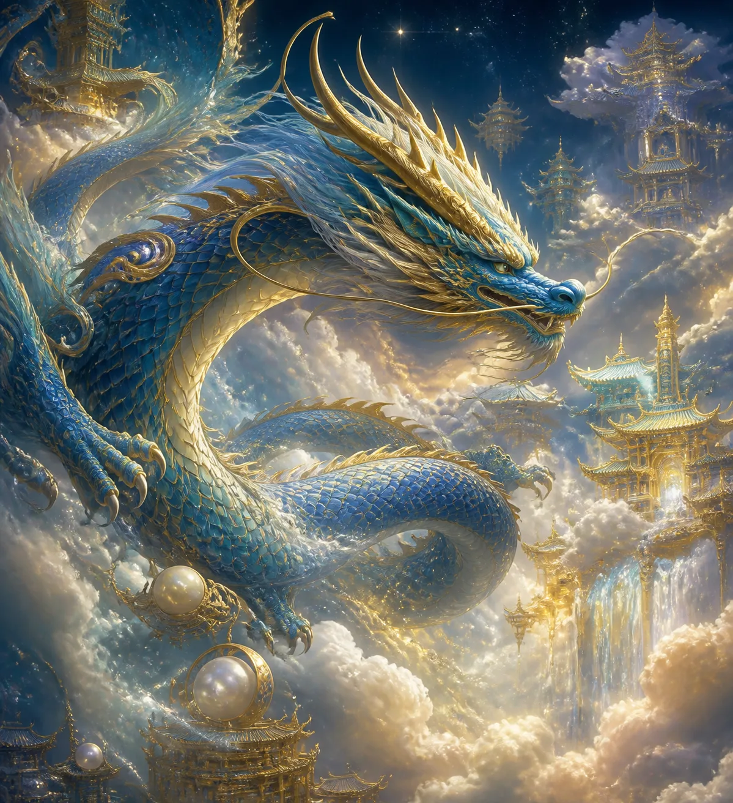

天龙之中包括**金龙族**和**银龙族**。顾名思义，金龙的原形呈金色，银龙的原形则呈银色。

此外，还有大家耳熟能详的烛龙，也就是**烛九阴**。烛龙目前正在九幽镇守某个地方，相关人员可能知道这件事。

天龙中还有翼龙。翼龙生有翅膀，其原形非常帅气。

## 四海龙族

四海龙族分别对应东海、西海、南海和北海：

1. **东海**：目前在人间的投影位置位于蓬莱。
2. **西海**：投影位置在青海附近。
3. **南海**：投影位置在普陀山附近。
4. **北海**：位置较为神秘，不方便告知。

网上有人认为北海位于贝加尔湖，但这种理解比较浅显。四海并不是指地球上的东西南北四片海域，而是相对于天界位置而言的海域。

例如，道家体系中有“北海四圣”。不可能让北海四圣只管理一个小小的贝加尔湖，所以这些海域本身位于高维度，只是隔一段时间，可能会在人间的某个地方产生投影。

如果有人到达投影区域，便有可能连接到一些比较厉害的神仙，或者看见天界海域中的某些事物。因此，四海在人间的投影位置通常并不固定，上面提到的只是目前对应的位置。

人间许多地方也存在通往这些区域的通道和入口。例如，有人前往五台山、昆仑等地时，可能会看到一些特殊景象，连接到高维度空间，甚至到达这些地方。

这样的通道与入口有很多，但通常不会轻易对外透露。

## 地龙

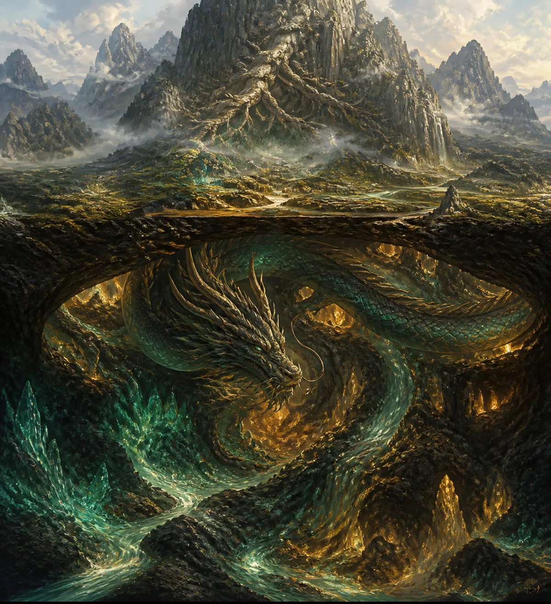

地龙的范围比较广泛，包括：

- 湖里的龙；
- 江里的龙；
- 河里的龙；
- 山上的龙；
- 井里的龙。

这些地龙目前尚未飞升，也没有进入上界，仍在人间徘徊。它们大多是人间本土精灵修炼而成的龙，本身拥有的龙族血脉比较少。

只要体内存在龙族血脉，并且血脉浓度达到一定程度，它们就可以逐渐升级、修炼成龙。

# 龙族的姓氏、性格与职责

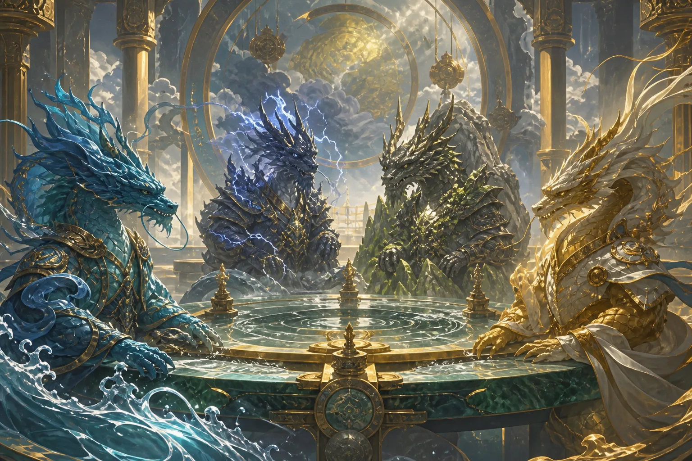

## 龙族常见姓氏

大家听得比较多的是**敖姓**，例如敖丙。除此之外，龙族还有其他姓氏：

- **龙姓**：许多天龙族以龙为姓。
- **青姓**：东海的一些贵族龙姓青，因为东海对应青龙。
- **白姓**：西海的一些龙族姓白。例如有一位很出名的存在叫白泽，这里说的是名字叫白泽，并不是白泽这个种族。
- **姬姓**：少数龙族贵族以姬为姓。

## 龙族的性格特点

龙族通常比较高傲、霸气，也非常孤傲，但并不是所有龙都如此。有些龙性格温柔，也有一些非常可爱。

龙族通常比较喜欢睡懒觉。有些龙一睡就是几百年，甚至上千年。它们跑到龙域睡上一觉，人间几百年可能就过去了。

## 龙族承担的职位

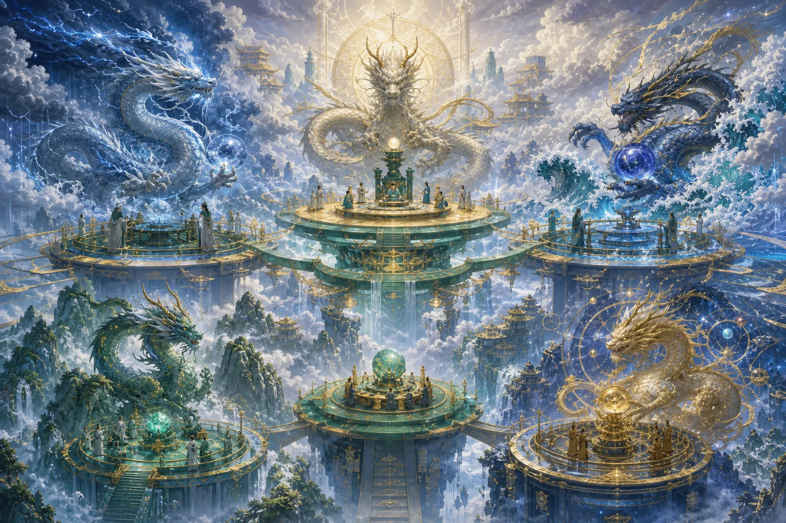

新天庭成立后，龙族签下契约，为天庭服务。佛家、道家体系中都有龙族任职。

龙族的主要职责包括：

1. **司雨布雨**  
   龙族负责司雨，为人间行云布雨，这是大众最熟悉的职责之一。

2. **担任护法**  
   许多大家族都有龙族担任护法。

3. **回应寻龙尺**  
   一些使用寻龙尺的人应该知道，某些寻龙尺确实可以招来龙族。被招来的龙有时会帮助解答问题。

4. **行军布阵**  
   天庭作战时，龙族也会参与行军布阵，为战争出力。

龙族是一个非常庞大的家族，比狐族还要大得多，基本可以算是法界规模最大的家族之一，族群数量也非常多。

# 蛇、蟒、蛟与龙的进化

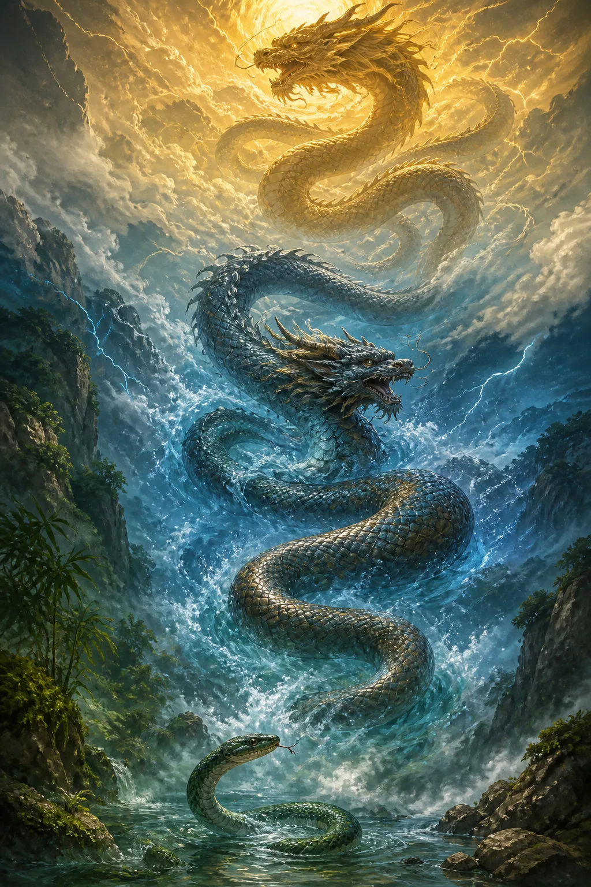

## 龙族与上古灵蛇族的区别

蛇与蟒的本源，大部分来自龙族，也有少部分来自**上古灵蛇族**。

上古灵蛇族与龙族不同。大家熟悉的女娲，就属于上古灵蛇族。上古灵蛇族还有一种称呼，叫作**娲族**。娲族与大洪水有关，懂的人自然会懂，这里只简单提一下。

蛇、蟒体内只要拥有龙族血脉，或者上古灵蛇族的血脉，就有机会不断升级，最终化为龙，或者进化为上古灵蛇族。上古灵蛇族同样是一个非常强大的家族。

## 从蛇到龙的修炼阶段

蛇、蟒、蛟化龙，大致要经历以下阶段：

1. **蛇化蟒**  
   一般需要一百年至二百年。

2. **蟒化蛟**  
   至少还要修炼五百年。

3. **蛟化龙**  
   蛟至少还需修炼一千年至一千五百年，有时甚至需要两千年，才能真正化为龙。

修炼过程中要经历的劫难，与狐族修炼时类似，并不只有雷劫，还包括许多其他考验，例如：

- 情劫；
- 亲情关；
- 色欲关；
- 其他心性与因果方面的劫难。

## 化龙时的雷劫

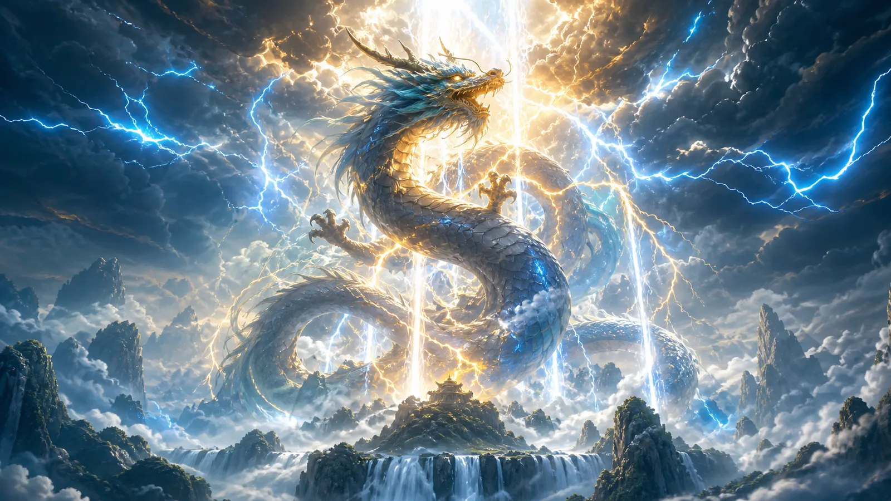

到了蛟化龙的阶段，劫难会变得非常困难。化龙时肯定要渡雷劫，而且往往不只渡一次。

雷劫的强弱还与雷电颜色有关。例如，**紫色雷劫**就属于非常厉害的一种。

# 为什么我们被称为“龙的传人”

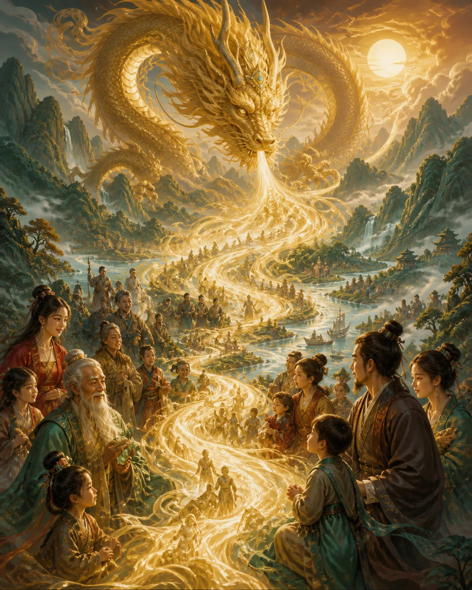

很多人一直疑惑，为什么中国人会被称为“龙的传人”。

按照这一体系的说法，我们每个人体内其实都拥有龙族血脉。因此，“龙的传人”并不只是一种象征性的说法，而是指人类身上确实存在龙族血脉。

> 我们是名副其实的龙的传人，不只是文化象征，而是真的拥有龙族血脉。
