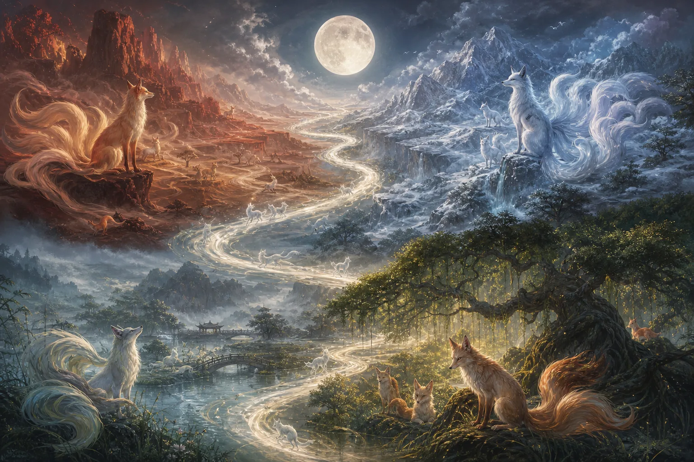
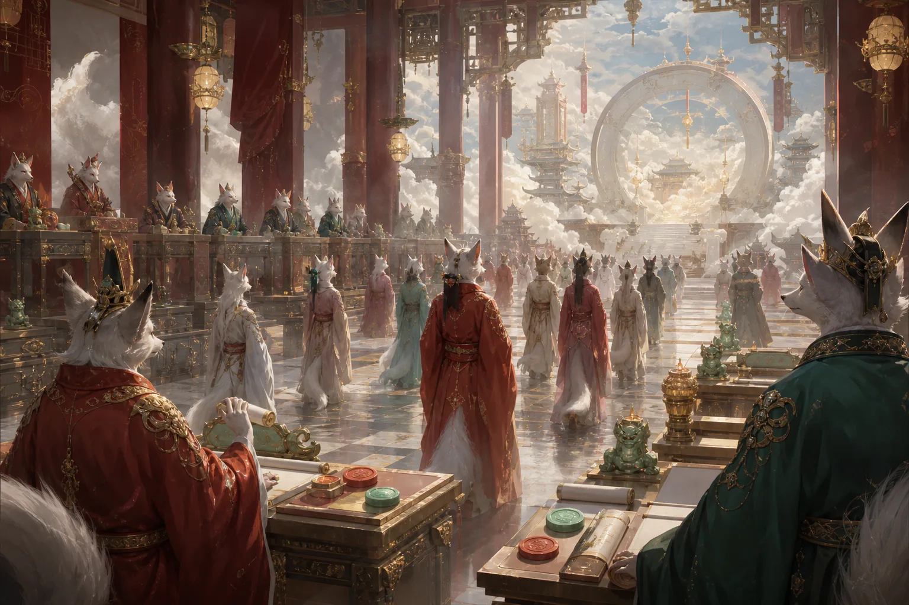
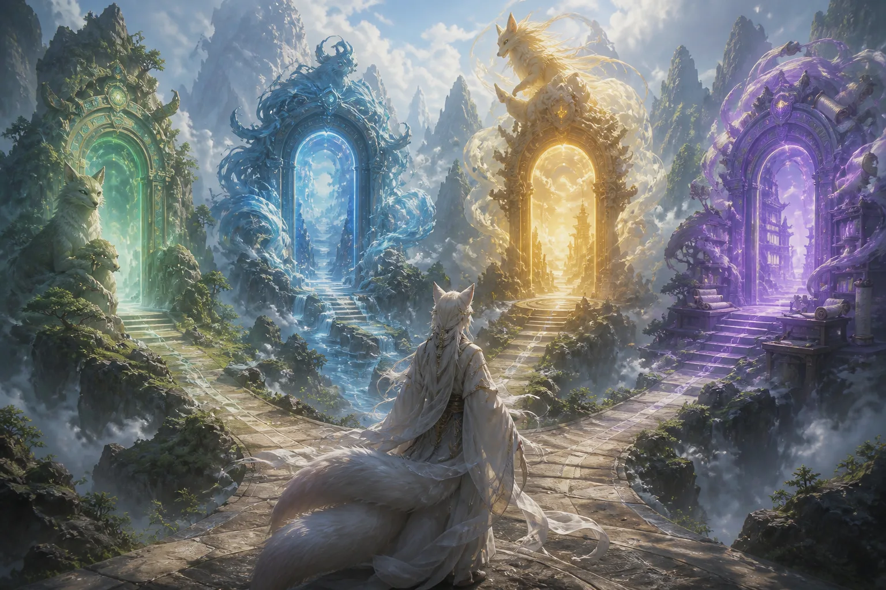

# 狐族：五大家族中的庞大体系

大家好，我是玄灵。今天开启一个新的系列，讲讲修真或日常生活中经常会遇到的一些大家族，也给大家做一点简单的科普。

这一期要讲的是五大家族中的**狐族**。狐族本身就是一个很大的家族，内部有非常多的分支体系。我国从古至今，也流传着许多与狐族有关的传说。但很多人对狐族的印象一直停留在“狐狸精”“野狐”之类的负面形象上，所以今天我想给狐族“平个反”。

我自己也修有狐仙法脉，对娘娘他们一直非常敬重。狐族整体的气质通常都很沉稳，做事不紧不慢，也比较可靠。他们的外形大多是帅哥美女、帅哥靓女，很少有不好看的。当然，我之前也讲过，有些狐仙喜欢白胡子老头的形象，所以也可能呈现出比较*仙风道骨*的样貌，但大部分还是帅哥靓女。

# 狐族的主要族群与界域

## 不同地区的狐族分支

狐族内部有许多种群，也可以叫作族群。比较广为人知的包括：

- **青丘狐族**
- **涂山狐族**
- **长白狐族**
- **昆仑狐族**
- **天山狐族**
- **龙虎山狐族**
- **阳明山一脉**

青丘狐仙和涂山狐仙之间的关系比较近。长白、昆仑一带的狐族通常以白狐为主；天山狐族主要在新疆附近的天山一带；阳明山这一脉，则是从龙虎山那边分出来的。

## 高维空间与法界投射

像青丘、昆仑这类地界，其实可以理解为其他维度的空间。有些界域投射到地球上，对应长白山等地；青丘在地球上也有一些投射点，但它本身属于一个高维空间。

打个比方，有些狐仙生活在一个独立的界域里，比如“狐仙界”或“狐界”。一些修法教的师兄也知道，法教中有一个说法叫作**师公山**。这些地方并不处于地球所在的物质维度，而是在法界中的某个界域。

甚至有些很厉害的大佬，还拥有属于自己的私人界域，类似小说里所说的“戒指空间”。这种空间在相关体系中，被认为是真实存在的。

# 天狐、地狐与狐族的修行

## 天狐与地狐的区别

从类别上来说，狐族可以分为天狐、地狐等。

**天狐**相对比较厉害。天狐可能本身就生于天界，也可能从下界一步步修炼上去，最终修成天狐。这个过程少说也需要上千年，才有机会修到天界。

**地狐**则是生活在地球上的普通狐狸。它们通过修炼获得法术或传承，逐渐修出法身。按照狐族的修行说法，狐狸修炼大约一百年后会逐渐产生灵智，并开始尝试化形，比如先把头部化出来，或者先把尾巴修掉。真正修到五百年左右，才有可能得到完整的人形。

> 狐族修到一定程度后，同样需要历劫，包括雷劫、火劫等，但并不一定百分之百都是雷劫。

## 吸收日月精华

狐族最常见的修行方式之一，就是吸收日月精华。这是一种修丹的方式，通过长期吸收日月之力，慢慢积累修为。

不过，也有一些喜欢耍小聪明的狐狸，会在人睡着后进入梦境吸取阳气和精气，目标大部分是男性。它们也可能不入梦，只是在睡觉的人旁边吸取阳气。

这种情况下，人晚上可能会做一些“不可描述”的梦，第二天醒来后觉得特别困，好像整晚都没有休息好。按照这种说法，这就是阳气被吸走了。

## 接受族内传承

狐族内部也有已经得道飞升的老祖。老祖下界后，会向族内传授功法。族内长老也会挑选一些体质特别好、灵性特别高的小狐狸，把相应的功法传给它们。

每个种族的功法都有所不同。小狐狸可以修炼狐族内部的传承功法，逐渐获得修为，最后慢慢化成人形。

## 拜斗与星辰之力

狐族还可以通过**拜斗**修行。这里的拜斗，一般指北斗、南斗以及诸天星斗。通过拜斗，可以吸收诸天星斗之力，用来增强自身修为。

除此之外，狐族的修行也可能获得信仰之力的加成。这种方式与吸收日月精华有所不同，更多与人间供奉、香火信仰有关。

# 狐族的考试与“编制”

## 狐族为什么要参加考试

狐族同样需要参加考试，有点类似于人间的“考编”。狐族拥有自己的法界，考试成功后，就可以进入相应的法界任职，获得一官半职。

狐族内部有几个主要的考试地点。大家比较熟悉的，是泰山奶奶**碧霞元君**那里举行的狐族年度考试。狐族需要通过考试，才可以名正言顺地做一些不违规的事情。

另外，狐族也可以去北斗七星那里参加考试。按照这个体系的说法，北斗七星主管天下堂口，凡是“披毛戴角”之类的众生，基本都归北斗七星主管。除此之外，通天教主那里也管披毛戴角的众生。

## 通过考试后的去向

狐族通过考试后，就相当于有了一定的“编制”，可以称得上是神仙，而不再只是妖。通过考试的狐仙，通常有以下几种去向：

1. **给法师当护法**，或者去堂上护坛。
2. **在灵界办事**，通过办事、赚丹等方式提升修为。
3. **出马办事**，吸收人间香火并接受供奉。
4. **成为保家仙**，守护特定的家庭，同时接受香火。
5. **进入相应法界任职**，获得一官半职。

对狐族来说，接受香火的主要目的还是提升修为。有些狐族觉得单纯修丹过于枯燥乏味，就会通过接受香火、给人办事等方式增加修为。

修丹首先需要戒欲、清心寡欲，这一点连普通人都很难做到，更不要说欲望往往比人更重的动物。因此，很多狐族会选择接受香火，或者成为法师的护法。

很多法师也会来问我，说自己能够感觉到背后有某种存在，但不知道究竟是什么。查过以后，会发现其中很多都是狐仙。

# 狐仙与野狐的区别

## 没有手续的“私自修炼”

如果狐族不愿意参加考试，等待它的出路可能就只有成为**野狐**。野狐也就是大家平时所说的山精野怪。野狐同样可以修炼，但这种修炼属于私自修炼，没有正式传承，也没有任何地方记录它的身份。

按照这一体系，狐族还是要参加考试，取得相应的手续后才能正式修炼。否则，它的修炼就属于违规修炼，相当于没有手续。

如果这种野狐遇到神仙，或者遇到比较厉害、能够查验手续的法师，对方发现它没有手续，就可以直接将其扣押、封住，甚至关进罐子里。

> 正式的狐仙在地府都有档案。通过查询档案，就能判断它究竟是野狐，还是拥有正式身份的狐仙。

# 人身为何难得

狐族虽然在五大家族中算是比较容易修行的，而且狐族肉身的灵性与慧根也比较强，在五大家族中甚至可以说是最大的，但与人类相比，它们的修炼仍然非常困难。

原因在于，人类对于动物来说，先天就相当于自带五百年修行。前面讲过，动物需要修炼五百年左右才能得到人身，而我们本来就有人形，相当于先天比它们多了五百年道行。

这也是为什么在平时修行中，总要告诫大家珍惜人身。

> **人身难得，正是这个意思。**

今天这一期就讲到这里。如果大家还有什么想了解的，可以跟玄灵说。感谢大家关注，记得一键三连。
