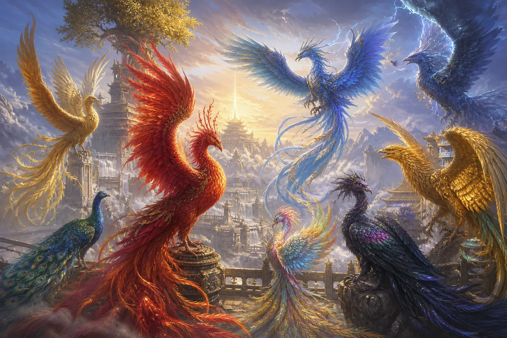
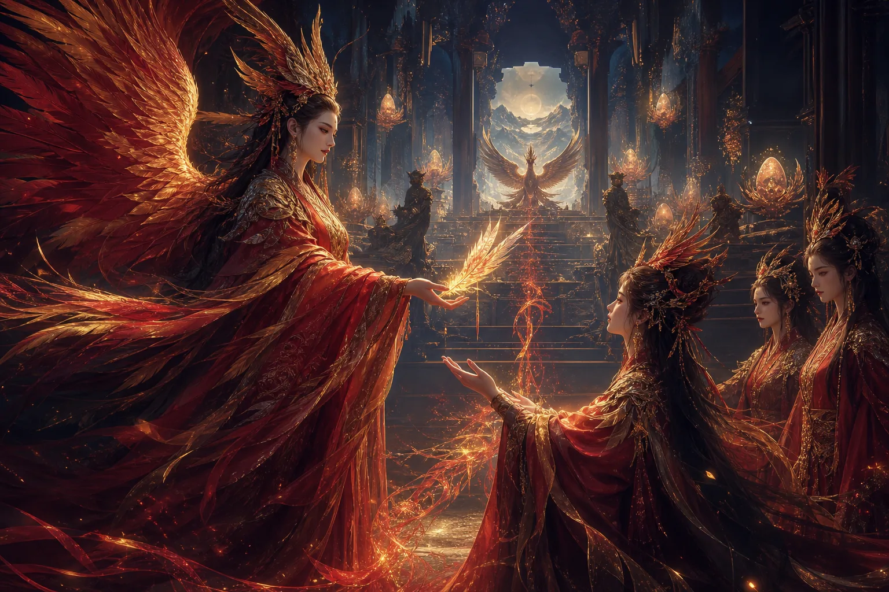
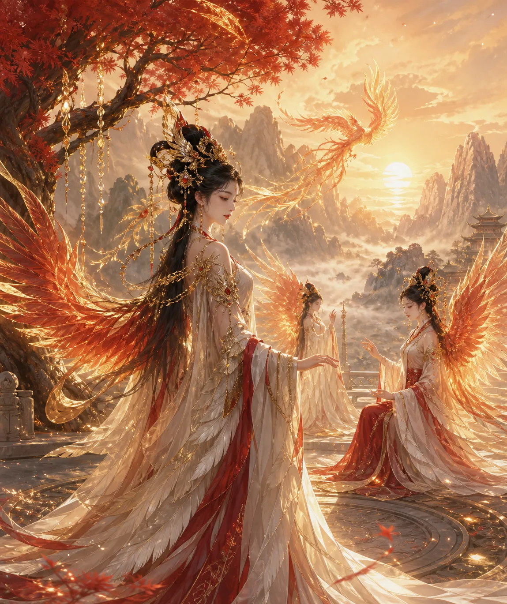
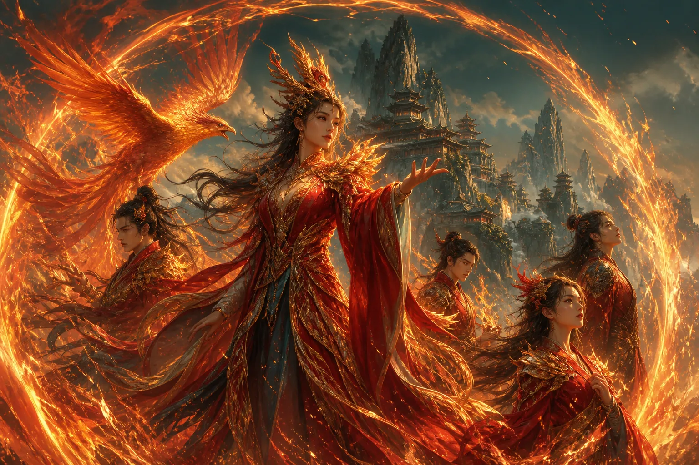
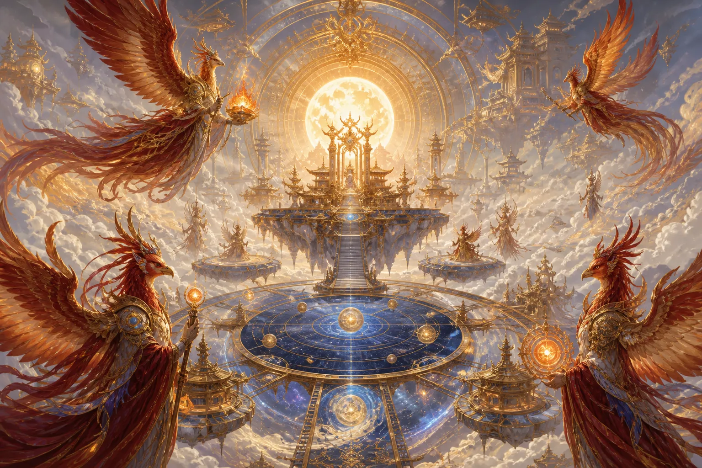

大家好，我是玄灵，本期来讲法界大家族之东方凤族。

## 一、凤族分类与主要成员

凤族旁系和旁支特别多，分类也很多。

- **赤凤**：红色的，凤凰赤如血。
- **青鸾**：经常在西王母身边做事情的种族。
- **鸿鹄**：在人间叫做大雁，但在法界非常非常大，移动速度很快，飞行速度在凤族中都是佼佼者。
- **金凤**：经常与金龙成双入对，在法界一些重要事情上会出来，非常漂亮，金灿灿的。
- **孔雀**：在人间就是孔雀动物，但在法界地位特别高，在凤族里地位都很高，因为跟青鸾、大鹏三个属于下一任凤帝的候选人。
- **大鹏**：比较与世无争，现在只有青鸾和孔雀在争。大鹏也叫金翅大鹏鸟，是道家和佛家的护法，自身能力很强，甚至能以龙为食，翅膀很大，在羽族护法里属于最厉害的战斗力。
- **雷鸟**：在天上经常会释放雷电、闪电。
- **彩凤**：是七彩祥云的凤凰，看上去跟彩虹一样，飞过的地方也会有七彩祥云。
- **玄鸟**：很多人说在人间就是乌鸦，但其实在法界才有。玄就是黑色，但不是普通黑色，是五彩斑斓的黑色，非常好看。

其中孔雀属于比较争强好斗的个性，能力很强，孔雀族族长的声望和名望甚至超过了青鸾。

## 二、凤族姓氏与血脉传承

凤族的姓氏主要有：**凤、风、孔、鹏、青、雷**。其中凤是最大的大姓。这里提一个**畲族**，畲族是中国的一个少数民族，人数很少，整个畲族都有太昊血脉，也有凤族血脉。他们的祖先三公主是人类，但其实是凤族转世，出生时百鸟朝凤，非常华丽，所以畲族整体带这个血脉。畲族中也有姓雷、孔等。

太昊也就是白帝太昊，五帝之一，居住在法界的白帝城，这个白帝城跟人间的白帝城不是一个东西，他在凤族里地位很高的一个帝王。凤族还有个姓叫**赢**，这个跟玄鸟有关。

## 三、凤族在人间与法界的居所

凤族在人间比较大的一个主庭，在昆仑东域，这里是整个凤凰的主庭，有很多凤凰栖息的树。在人间对应的是青海的扎麻隆凤凰山，这基本是最大的一个凤凰主庭。如果对凤凰凤族元素有兴趣的人可以去看一下。此外，四川、云南、河南的一些区域也有凤凰存在。

## 四、凤族外观与修行特点

凤凰的颜色，有赤、青、金、七彩等颜色。瞳色（眼睛颜色）有金色、赤色、紫色、黑色、青色等。

关于凤凰的修行，它跟植物灵、狐族、龙族比起来，修行化为人形会很久很久。这可能是因为它需要涅槃的特性，能量转化方式不同，所以化为人形需要很久，基本算是最久的种族了。平均化形成人的修为，至少要一千年左右。普通的植物大树可能500年渡劫后化形，凤族要1000年，狐族三四百年就可以，所以真的很久。整体羽族（包含凤族）的化形时间都比其他种族要久。

分辨一个凤族修为高低，可以看它的尾羽。尾羽数量不同，比如六根尾羽修为就不一样了，尾羽长短也不一样，最多只有12根尾羽。尾羽越大越多，能量修为就越大。修为高的凤凰飞起来会有光和雾，光雾颜色根据修为不同产生不同颜色，像金色、彩色就是修为很高的。

## 五、凤族个性与天赋能力

凤族的个性：据我所知接触的凤族，都不是很爱金银珠宝，不是很物质，但都很爱美，每天喜欢打扮自己、照镜子。对感情都不是恋爱脑，对感情看得很淡，允许接触感情但不执着。但非常专一，一旦认定一个人之后就不会再更改，无论那个人对他怎么样，都不会更改。无论男凤还是女凤都很专一，大多数一夫一妻，认定后不改变。

凤族天赋列举几个最厉害的：

- **空间法术**：时空间法术，可以根据修为高低改变一些时间空间，甚至一些法则。
- **飞行**：毋庸置疑，凤族是宇宙里飞行最厉害的。
- **治愈能力**：凤族的血、眼泪可以治病。但要注意，如果凤凰死亡之后的眼泪就没有效果了（没有涅槃就死亡的眼泪无效）。羽毛也有药效，可以治病。凤凰的血肉也可以治病，死亡之后的血肉和没有死亡的血肉都可以治病。但不要轻易打杀凤凰，凤凰家族虽然不如龙族庞大，但数量也很多，在天上担任很多职位。

## 六、凤族在天界的职位与功能

凤凰在天上担任很多职位。首先星宿这里有朱雀神君，南明离火，朱雀也属于凤族一类。九天玄女的坐骑以及身边护法、士兵、官员，很多都是凤族派来的，因为凤族与九天玄女签订了友好协议。

由于凤族擅长飞翔和时空间法则，所以作为仙官传信、九天使者非常擅长。

凤凰本身有除秽功效，南明离火和凤火可以净化整个磁场、污秽之物，所以多用于道坛、法坛上净坛。比如正一有科仪，像九凤破秽，法教也有九凤破秽。

其他还可以当一些仙官，如司乐仙官，管司乐，唱歌好听，演奏好听的乐曲。另外他们经常在火部待着，因为有各种各样的火，如离火、圣火等。

今天玄灵就讲到这里，如果有什么想知道的修行知识，可以私信。感谢支持，喜欢玄灵的给个一键三连。
